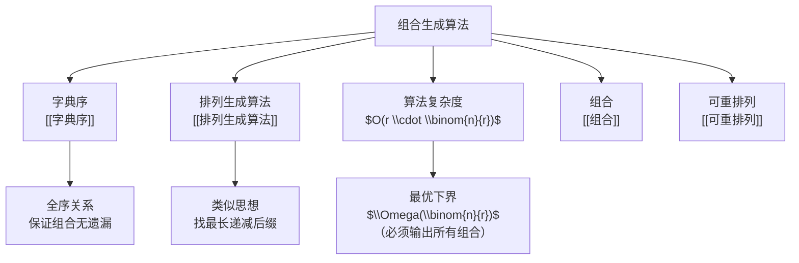

# 组合生成算法

> [!abstract]
> ==组合生成算法==按照[[字典序]]系统地生成从 $\{1, 2, \ldots, n\}$ 中选取 $r$ 个元素的所有 $\binom{n}{r}$ 个 $r$-组合。算法的核心思想是：在递增序列中找到最右边的"可增位"，将其递增并重置后续位。总时间复杂度为 $O\!\left(r \cdot \binom{n}{r}\right)$。

## 定义

> [!def] 字典序组合生成算法（Lexicographic Combination Generation）
> 给定当前 $r$-组合 $c = (c_1, c_2, \ldots, c_r)$（满足 $1 \leq c_1 < c_2 < \cdots < c_r \leq n$），求其在[[字典序]]中的后继组合。算法步骤如下：
>
> **步骤1**：从右向左找到**最右边的可增位** $c_i$，即满足 $c_i < n - r + i$ 的最大下标 $i$。
> - 直观含义：$c_i$ 还可以增大（增大后仍能为后续元素留出足够空间）。
>
> **步骤2**：将 $c_i$ 递增1，即 $c_i \leftarrow c_i + 1$。
>
> **步骤3**：将 $c_i$ 之后的所有位重置为最小值：$c_j = c_{j-1} + 1$（对 $j = i+1, i+2, \ldots, r$）。
> - 直观含义：在增大 $c_i$ 后，后续位应取尽可能小的值以得到字典序中的下一个组合。
>
> **终止条件**：当找不到满足 $c_i < n - r + i$ 的位置 $i$ 时，当前组合即为字典序最后一个组合 $(n-r+1, n-r+2, \ldots, n)$。

## 核心性质

| 编号 | 性质 | 说明 |
|:---:|------|------|
| 1 | **完备性** | 算法恰好生成所有 $\binom{n}{r}$ 个 $r$-组合，无遗漏、无重复 |
| 2 | **字典序保证** | 生成的组合序列严格按[[字典序]]递增 |
| 3 | **单步复杂度** | 每次求后继的时间复杂度为 $O(r)$（扫描+重置） |
| 4 | **总复杂度** | 生成所有组合的总复杂度为 $O\!\left(r \cdot \binom{n}{r}\right)$ |
| 5 | **与排列生成算法的类比** | 两者都基于"找可变位→修改→重置"的三步模式，但组合需维护递增约束 |

## 关系网络



## 章节扩展

- **第6.6节**：本概念是Rosen教材第6.6节的核心算法之一，与[[排列生成算法]]并列。
- **位向量法**：另一种生成组合的方法，使用长度为 $n$ 的二进制串（恰好 $r$ 个1），按字典序枚举所有含 $r$ 个1的二进制串。
- **应用场景**：子集枚举、组合优化问题的穷举搜索、Apriori关联规则挖掘中的候选集生成。

## 补充

> [!info] 算法伪代码
> ```
> procedure NextCombination(c[1..r], n)
>     // 步骤1: 找最右可增位
>     i ← r
>     while i ≥ 1 and c[i] = n - r + i do
>         i ← i - 1
>     if i = 0 then
>         return "无后继"  // 当前为最后一个组合
>     // 步骤2: 递增该位
>     c[i] ← c[i] + 1
>     // 步骤3: 重置后续位
>     for j ← i + 1 to r do
>         c[j] ← c[j-1] + 1
>     return c
> ```
>
> 要生成所有 $r$-组合，从 $(1, 2, \ldots, r)$ 开始，反复调用 `NextCombination` 直到返回"无后继"。

> [!info] 执行示例（n=5, r=3）
> 从 $123$ 开始的字典序组合序列：
> $123 \to 124 \to 125 \to 134 \to 135 \to 145 \to 234 \to 235 \to 245 \to 345$
>
> 以 $135 \to 145$ 为例演示算法：
> - 步骤1：从右检查，$c_3 = 5 = 5 - 3 + 3$（不可增），$c_2 = 3 < 5 - 3 + 2 = 4$（可增），故 $i = 2$
> - 步骤2：$c_2 \leftarrow 3 + 1 = 4$
> - 步骤3：$c_3 \leftarrow c_2 + 1 = 5$，得 $145$
>
> 以 $145 \to 234$ 为例：
> - 步骤1：$c_3 = 5$（不可增），$c_2 = 4 = 4$（不可增），$c_1 = 1 < 3$（可增），故 $i = 1$
> - 步骤2：$c_1 \leftarrow 1 + 1 = 2$
> - 步骤3：$c_2 \leftarrow 3$，$c_3 \leftarrow 4$，得 $234$

## 参见

- [[字典序]] — 字典序的定义与性质
- [[排列生成算法]] — 基于字典序的排列枚举算法
- [[组合]] — 组合的基本概念与计数公式
- [[可重排列]] — 隔板法与可重组合
- [[算法复杂度]] — 算法复杂度分析
