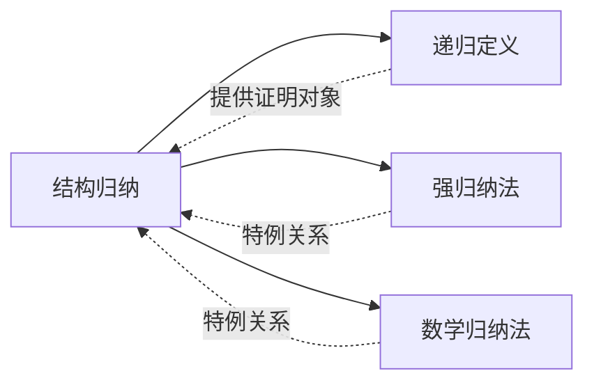

# 结构归纳

> [!abstract]
> ==结构归纳（Structural Induction）==是==对递归定义的结构==进行归纳证明的技术。它将数学归纳法从正整数域推广到任意递归定义的集合（如合式公式、字符串、树等），是验证递归定义性质的标准方法。

## 定义

> [!def] 结构归纳原理
> 设集合 $S$ 由递归定义给出（基础情形 + 递归规则 + 闭包条款），要证明命题 $P(x)$ 对所有 $x \in S$ 成立，需要：
>
> **基础步骤（Basis Step）**：证明 $P(x)$ 对基础情形中的所有元素成立。
>
> **递归步骤（Recursive Step）**：证明若 $P$ 对递归规则中引用的已有元素成立，则 $P$ 对由递归规则生成的新元素也成立。
>
> 形式化表述：设递归规则为"若 $x_1, x_2, \ldots, x_k \in S$ 满足某些条件，则 $f(x_1, x_2, \ldots, x_k) \in S$"，则需证明：
> $$P(x_1) \land P(x_2) \land \cdots \land P(x_k) \implies P(f(x_1, x_2, \ldots, x_k))$$
>
> 由闭包条款保证，$S$ 中每个元素都由有限次应用基础情形和递归规则生成，因此结构归纳覆盖 $S$ 的全部元素。

> [!def] 结构归纳与强归纳法的关系
> 结构归纳本质上是**强归纳法在递归定义集合上的推广**：
>
> - **数学归纳法**：证明域为 $\mathbb{N}$，归纳步骤从 $P(k)$ 推 $P(k+1)$（或从 $P(1), \ldots, P(k)$ 推 $P(k+1)$）。
> - **强归纳法**：归纳步骤假设 $P(1), P(2), \ldots, P(k)$ 全部成立来推出 $P(k+1)$，允许引用所有更小的情况。
> - **结构归纳**：将"更小"的概念推广为"在递归构造中更早出现"，归纳步骤假设递归规则引用的所有元素满足 $P$，推出新生成的元素也满足 $P$。
>
> 三者的关系：**结构归纳 $\supset$ 强归纳法 $\supset$ 数学归纳法**（结构归纳是最一般的归纳形式）。

> [!def] 应用示例一：合式公式性质证明
> **命题**：每个合式公式中，左括号的个数等于右括号的个数。
>
> **证明（结构归纳）**：
>
> **基础步骤**：对每个命题变元 $p$，左括号数 = 右括号数 = $0$。成立。
>
> **递归步骤**：假设 $A$ 和 $B$ 是合式公式且各自左括号数等于右括号数。
> - 对 $(\neg A)$：左括号数 = $1 + A$ 的左括号数，右括号数 = $1 + A$ 的右括号数。由归纳假设，两者相等。
> - 对 $(A \land B)$：左括号数 = $1 + A$ 的左括号数 $+ B$ 的左括号数，右括号数 = $1 + A$ 的右括号数 $+ B$ 的右括号数。由归纳假设，两者相等。
> - 其余二元连接词（$\lor, \to, \leftrightarrow$）的论证完全类似。$\blacksquare$

> [!def] 应用示例二：字符串长度性质
> **命题**：对任意 $w_1, w_2 \in \Sigma^*$，有 $|w_1 \cdot w_2| = |w_1| + |w_2|$。
>
> **证明（对 $w_1$ 进行结构归纳）**：
>
> **基础步骤**：$w_1 = \lambda$ 时，$|\lambda \cdot w_2| = |w_2| = 0 + |w_2| = |\lambda| + |w_2|$。成立。
>
> **递归步骤**：设 $w_1 = w \cdot a$（$a \in \Sigma$），假设 $|w \cdot w_2| = |w| + |w_2|$。
> $$|(w \cdot a) \cdot w_2| = |w \cdot (a \cdot w_2)| = |w| + |a \cdot w_2| = |w| + (1 + |w_2|)$$
> $$= (|w| + 1) + |w_2| = |w \cdot a| + |w_2|$$
> 成立。$\blacksquare$

> [!def] 应用示例三：二叉树节点数性质
> **命题**：设 $T$ 为满二叉树，则 $T$ 的叶子数 $l(T) = \text{内部节点数} + 1$。
>
> **证明（结构归纳）**：
>
> **基础步骤**：单节点树（仅有根节点）的叶子数 $l = 1$，内部节点数 $= 0$。$1 = 0 + 1$。成立。
>
> **递归步骤**：设 $T$ 的根有左子树 $T_L$ 和右子树 $T_R$。由归纳假设：
> $$l(T_L) = i(T_L) + 1, \quad l(T_R) = i(T_R) + 1$$
> 其中 $i(\cdot)$ 表示内部节点数。则：
> $$l(T) = l(T_L) + l(T_R) = i(T_L) + 1 + i(T_R) + 1 = i(T_L) + i(T_R) + 2$$
> $$i(T) = i(T_L) + i(T_R) + 1$$
> 因此 $l(T) = i(T) + 1$。成立。$\blacksquare$

## 核心性质

| 性质 | 说明 |
| :--- | :--- |
| **通用性** | 结构归纳适用于任何递归定义的集合，不限于自然数，可应用于合式公式、字符串、树、图等任意递归结构 |
| **与递归定义的天然对应** | 结构归纳的证明步骤与递归定义的构造步骤一一对应：基础情形对应基础步骤，递归规则对应递归步骤 |
| **归纳假设的强度** | 在递归步骤中，可以对递归规则引用的所有"更小"元素使用归纳假设，这与强归纳法的思想一致 |
| **闭包条款的保证** | 闭包条款确保集合中每个元素都通过有限步递归构造生成，从而保证结构归纳的完备性 |
| **可化为强归纳法** | 任何结构归纳证明都可以通过定义集合元素的"构造高度"（construction height），转化为对自然数的强归纳法证明 |
| **良基序基础** | 结构归纳的正确性依赖于递归定义集合上的良基序（well-founded order），构造高度提供了一个良基序 |

## 关系网络

## 章节扩展

### 第5章 — 5.3节内容

结构归纳是第5章"归纳与递归"中与递归定义紧密配合的核心证明技术，出现在 Rosen 第8版 Section 5.3。本节要点包括：

1. **结构归纳原理**：理解基础步骤和递归步骤的证明框架，掌握对任意递归定义集合进行归纳证明的方法。
2. **与强归纳法的关系**：理解结构归纳是强归纳法的推广，强归纳法是结构归纳在自然数域上的特例。
3. **典型应用**：合式公式性质证明、字符串运算性质证明、树结构性质证明等。

## 补充

> [!info]
> **理论扩展与背景**
>
> - **结构操作语义（Structural Operational Semantics）**：由 Gordon Plotkin（1981, 2004）系统发展，使用结构归纳来定义和证明编程语言的语义。在 SOS 框架中，程序行为的推理规则通过结构归纳进行验证，结构归纳因此成为编程语言理论中的基础工具。
> - **广义归纳原理**：在类型论和范畴论中，结构归纳被进一步抽象为**初始代数（Initial Algebra）语义**——递归定义的集合可以看作某个函子（functor）的初始代数，而结构归纳对应初始代数的泛性质（universal property）。
> - **与良基归纳的关系**：结构归纳的正确性最终依赖于良基关系（well-founded relation）。良基归纳是最一般的归纳原理，结构归纳、强归纳法、普通数学归纳法都是良基归纳的特例。
>
> **参考来源**：Rosen, Section 5.3 — Recursive Definitions and Structural Induction

## 参见

- [[递归定义]]
- [[强归纳法]]
- [[数学归纳法]]
