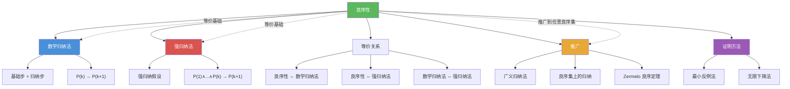

# 良序性

> [!abstract] 概述
> ==良序性（Well-Ordering Property）==断言==每个非空的正整数集合都有最小元==。这一看似简单的性质是[[数学归纳法]]和[[强归纳法]]的==等价理论基础==，也是==广义归纳法==在任意良序集上推广的基石。良序性的强大之处在于：它将"无穷集合上的命题证明"转化为"寻找最小反例并导出矛盾"的论证模式，为许多难以直接使用归纳法的问题提供了优雅的证明途径。在更高阶的数学中，Zermelo 的良序定理将这一概念推广到了任意集合。

## 定义

> [!def] 良序性公理（Well-Ordering Property）
>
> **良序性公理**：每个非空的正整数集合都有一个最小元。
>
> 形式化表述：
> $$\forall S \subseteq \mathbb{Z}^+,\ S \neq \emptyset \implies \exists m \in S,\ \forall s \in S,\ m \leq s$$
>
> 其中 $m$ 称为 $S$ 的==最小元==（least element）。
>
> 直觉理解：正整数集 $\{1, 2, 3, \ldots\}$ 是"从下往上"排列的，不存在无穷递减的正整数序列——你不可能一直往小的方向走而永远不停下来。

> [!def] 良序集（Well-Ordered Set）
>
> 设 $(S, \preceq)$ 是一个全序集（totally ordered set）。若 $S$ 的每个非空子集都有关于 $\preceq$ 的最小元，则称 $(S, \preceq)$ 为一个==良序集==（well-ordered set）。
>
> **良序集的例子**：
> - $(\mathbb{Z}^+, \leq)$：标准正整数集是良序集（良序性公理）
> - $(\{1, 2, 3, \ldots, n\}, \leq)$：任何有限全序集都是良序集
> - $(\mathbb{N} = \{0, 1, 2, \ldots\}, \leq)$：非负整数集是良序集
>
> **不是良序集的例子**：
> - $(\mathbb{Z}, \leq)$：整数集不是良序集，因为 $\mathbb{Z}$ 本身没有最小元
> - $(\mathbb{R}^+, \leq)$：正实数集不是良序集，子集 $(0, 1)$ 没有最小元
> - $(\mathbb{Q}^+, \leq)$：正有理数集不是良序集，子集 $\{x \in \mathbb{Q}^+ : x^2 > 2\}$ 没有最小元

> [!def] 良序性与数学归纳法的等价性
>
> 良序性公理与数学归纳法原理是==等价==的，可以从其中一个推出另一个。
>
> **良序性 $\Rightarrow$ 数学归纳法**：
> 用反证法。假设基础步和归纳步都成立，但存在某个正整数 $n$ 使 $P(n)$ 为假。令 $S = \{n \in \mathbb{Z}^+ : P(n) \text{ 为假}\}$，则 $S \neq \emptyset$。由良序性，$S$ 有最小元 $m$。由于 $P(1)$ 为真（基础步），$m > 1$。因此 $m - 1 \geq 1$ 且 $P(m-1)$ 为真。但由归纳步，$P(m-1) \to P(m)$，故 $P(m)$ 为真，与 $m \in S$ 矛盾。$\blacksquare$
>
> **数学归纳法 $\Rightarrow$ 良序性**：
> 设 $S$ 是 $\mathbb{Z}^+$ 的非空子集，要证 $S$ 有最小元。定义命题 $P(n)$："所有正整数 $k \leq n$ 都不属于 $S$"。用反证法：假设 $S$ 无最小元。则 $1 \notin S$（否则 $1$ 就是最小元），故 $P(1)$ 为真。若 $P(k)$ 为真，则 $1, 2, \ldots, k \notin S$，故 $k+1 \notin S$（否则 $k+1$ 是 $S$ 的最小元），故 $P(k+1)$ 为真。由归纳法，$\forall n,\ P(n)$ 为真，即 $S = \emptyset$，矛盾。$\blacksquare$
>
> 这一等价性说明：数学归纳法的有效性本质上来源于正整数集的良序性。

> [!def] 广义归纳法（广义归纳 / Well-Ordered Induction）
>
> 良序性可以推广到任意良序集上，形成==广义归纳法==（也称为良序归纳法）：
>
> 设 $(S, \preceq)$ 是一个良序集，$P(x)$ 是关于 $S$ 中元素 $x$ 的命题。若对 $\forall x \in S$，以下条件成立：
> - **归纳步**：若 $\forall y \prec x,\ P(y)$ 为真，则 $P(x)$ 为真
>
> 则 $\forall x \in S,\ P(x)$ 为真。
>
> 注意：广义归纳法不需要显式的基础步！因为对于 $S$ 的最小元 $x_0$，条件"$\forall y \prec x_0,\ P(y)$"是空真（vacuously true），因此归纳步自动蕴含 $P(x_0)$ 为真。
>
> **应用示例**：在字典序（lexicographic order）下的 $\mathbb{Z}^+ \times \mathbb{Z}^+$ 上使用广义归纳法，可以证明关于有序对 $(m, n)$ 的命题。

## 核心性质

| 性质 | 描述 | 说明 |
|------|------|------|
| ==良序性公理== | 每个非空正整数集有最小元 | 正整数集 $\mathbb{Z}^+$ 的基本性质 |
| ==与归纳法等价== | 良序性 $\Leftrightarrow$ 数学归纳法 $\Leftrightarrow$ 强归纳法 | 三者互为等价表述 |
| ==反证法模式== | 良序性常以"最小反例法"使用 | 假设命题不成立，取最小反例，导出更小反例，矛盾 |
| ==有限集良序== | 任何有限全序集都是良序集 | 有限集的良序性是平凡的 |
| ==不可推广到实数== | $\mathbb{R}$ 的标准序不是良序 | 开区间 $(0, 1)$ 无最小元；但 Zermelo 良序定理保证存在某种良序 |
| ==广义归纳无需基础步== | 在良序集上归纳时，最小元的情况自动处理 | 因为"所有前驱元素满足 $P$"对最小元空真 |

## 关系网络

- [[数学归纳法]] 与良序性等价：归纳法的有效性本质上来源于正整数集的良序性
- [[强归纳法]] 与良序性等价：强归纳法、普通归纳法、良序性三者构成等价的证明基础

## 章节扩展

### 第5章 — 5.2节内容

良序性是第5章第5.2节（强归纳与良序性）的两大核心主题之一，与强归纳法共同构成归纳法理论的完整体系。

**5.2节要点**：
- 良序性公理的表述与直觉理解
- 良序性与数学归纳法的等价性证明（双向证明）
- 良序性与强归纳法的等价性
- 使用良序性（最小反例法）证明命题的技巧
- 广义归纳法：在任意良序集上进行归纳证明
- 良序集的定义与判定

**最小反例法示例**：证明每个大于1的整数都可以写成素数的乘积。
- 假设存在大于1的整数不能写成素数乘积，令 $S$ 为这些整数的集合
- 由良序性，$S$ 有最小元 $n$
- $n$ 不是素数（否则 $n$ 本身就是素数乘积），故 $n = ab$，$1 < a, b < n$
- 由于 $a, b < n$ 且 $n$ 是最小反例，$a$ 和 $b$ 都可以写成素数乘积
- 因此 $n = ab$ 也可以写成素数乘积，矛盾。$\blacksquare$

### 第9章：关系

- **9.6 良序与良序归纳法**：良序性可以放在[[离散数学/concepts/偏序关系]]的理论框架下理解。一个==良序==（well-ordering）是一个特殊的全序（total order），要求每个非空子集都有最小元。良序必然是全序，全序必然是偏序，因此良序是偏序关系中最"整齐"的一种。

  ==良序归纳法==（well-ordered induction）是广义归纳法在良序集上的具体应用。设 $(S, \preceq)$ 是良序集，$P(x)$ 是关于 $S$ 中元素的命题。若对 $\forall x \in S$，"$\forall y \prec x,\ P(y)$ 为真 $\Rightarrow P(x)$ 为真"成立，则 $\forall x \in S,\ P(x)$ 为真。良序归纳法不需要显式的基础步，因为对于最小元 $x_0$，前提"$\forall y \prec x_0$"是空真（vacuously true），归纳步自动蕴含 $P(x_0)$ 为真。

  良序归纳法的典型应用场景包括：
  - **字典序归纳**：在 $\mathbb{Z}^+ \times \mathbb{Z}^+$ 的字典序上进行归纳，证明关于有序对的命题
  - **程序终止性证明**：为程序状态定义良序的度量函数，每次迭代使度量严格减小，由良序性保证程序必然终止
  - **递归定义的正确性**：使用良序归纳法证明递归定义的函数在良序集上处处有定义

## 补充

> [!info] 良序性的深层数学意义
>
> 良序性在数学中的地位远超其在离散数学课程中的初等应用：
>
> - **Zermelo 良序定理（1904）**：Ernst Zermelo 证明了==每个集合都可以被良序==（即对任意集合 $X$，存在 $X$ 上的一个良序 $\preceq$）。这一定理等价于==选择公理（Axiom of Choice, AC）==，是现代数学的基础公理之一。良序定理与选择公理、Zorn 引理构成数学中著名的"三等价命题"。
> - **良序性与选择公理的关系**：在 ZFC 集合论中，良序定理（"每个集合都可良序"）与选择公理等价。这意味着良序性的概念可以推广到==任何集合==，而不仅仅是正整数集。
> - **序数理论**：在集合论中，良序集的"序型"由==序数==（ordinal number）表示。序数是自然数的自然推广，超穷序数（transfinite ordinals）如 $\omega, \omega + 1, \omega \cdot 2, \omega^2, \omega^\omega, \varepsilon_0$ 等构成了丰富的层次结构。超穷归纳法（transfinite induction）就是在序数集上进行的广义归纳法。
> - **在计算机科学中的应用**：良序性是证明程序终止性（termination）的理论基础——为程序状态定义一个良序的"度量函数"，若每次循环迭代都使度量严格减小，则程序必然终止。
>
> **学术来源**：Rosen, K. H. (2019). *Discrete Mathematics and Its Applications* (8th ed.). McGraw-Hill, Section 5.2, pp. 346-356.
>
> **参考链接**：
> - Zermelo, E. (1904). "Beweis, dass jede Menge wohlgeordnet werden kann." *Mathematische Annalen*, 59(4), 514-516. https://doi.org/10.1007/BF01445300
> - Halmos, P. R. (1960). *Naive Set Theory*. Springer-Verlag, Chapter 17 (Well-Ordering). https://link.springer.com/book/10.1007/978-0-387-90104-6

## 参见

- [[数学归纳法]] — 与良序性等价的证明方法，归纳法的有效性源于正整数集的良序性
- [[强归纳法]] — 与良序性等价的加强归纳法，三者（良序性、普通归纳、强归纳）互为等价表述
