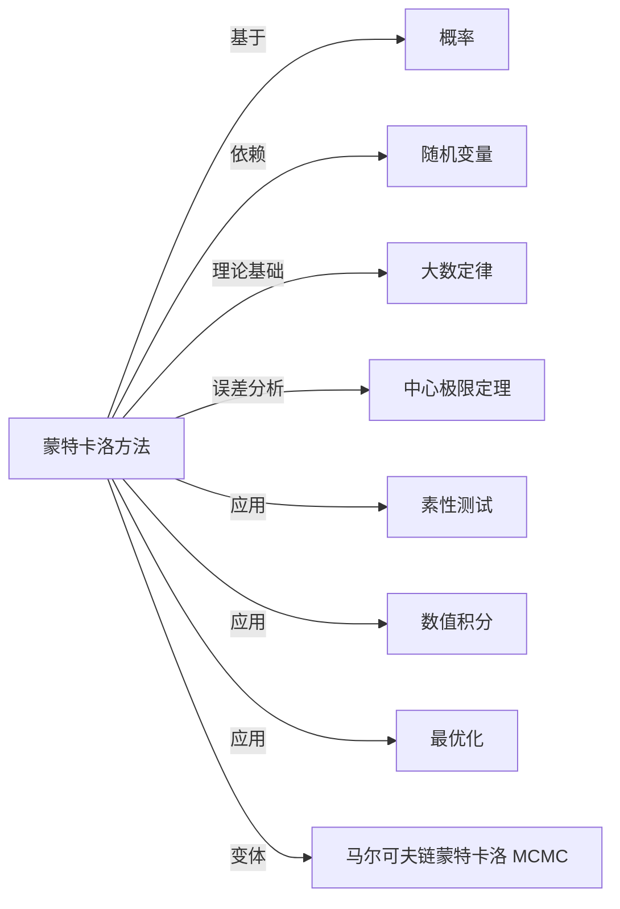

# 蒙特卡洛方法

> [!abstract]
> ==蒙特卡洛方法（Monte Carlo Method）==是一类利用**随机采样**（random sampling）和统计推断来解决确定性问题的计算方法。其核心思想是：通过大量随机试验来逼近问题的解，当采样次数足够多时，结果以高概率收敛到真实值。该方法广泛应用于素性测试、数值积分、最优化、金融建模等领域。

## 定义

> [!def] 蒙特卡洛方法
> **蒙特卡洛方法**是一类基于随机采样的数值计算方法，其基本流程为：
> 1. 构造一个与待求解问题相关的**概率模型**或**随机过程**；
> 2. 通过大量随机采样（模拟）生成该模型的样本；
> 3. 对样本结果进行统计估计，得到问题的近似解。
>
> > [!def] 蒙特卡洛估计
> > 设待求量为 $\theta$，构造[[离散数学/concepts/随机变量]] $X_1, X_2, \ldots, X_n$ 使得 $E[X_i] = \theta$。
> > 由大数定律，蒙特卡洛估计量为：
> > $$
> > \hat{\theta}_n = \frac{1}{n} \sum_{i=1}^{n} X_i \xrightarrow{P} \theta \quad (n \to \infty)
> > $$
> > 估计的精度为 $O(1/\sqrt{n})$，即要将精度提高一个数量级，采样次数需增加约 100 倍。

## 核心性质

| 编号 | 性质 | 数学表达 / 说明 |
|:---:|------|----------------|
| 1 | **随机性核心** | 方法依赖随机数生成，结果为近似解，每次运行可能略有不同 |
| 2 | **收敛性** | 由大数定律保证：$\hat{\theta}_n \xrightarrow{P} \theta$，采样越多越精确 |
| 3 | **收敛速率** | 收敛速率为 $O(1/\sqrt{n})$，与问题的维度无关（维度无关性） |
| 4 | **维度无关性** | 计算复杂度不随问题维度的增加而指数增长，适合高维问题 |
| 5 | **误差可估** | 可通过中心极限定理估计误差：$\hat{\theta}_n \approx N(\theta, \sigma^2/n)$ |

## 关系网络

## 章节扩展

- **素性测试（Miller-Rabin 算法）**：随机选择基底 $a$，利用费马小定理的逆命题检验 $n$ 是否为素数。若 $n$ 是合数，则每次测试至少有 $3/4$ 的概率检测出来。重复 $k$ 次后错误概率不超过 $(1/4)^k$。
- **数值积分**：在区域 $D$ 中均匀采样 $n$ 个点，用落入积分区域的比例估计积分值。例如估计 $\pi$：在单位正方形中随机投点，落入单位圆的比例 $\approx \pi/4$。
- **最优化**：模拟退火（Simulated Annealing）利用蒙特卡洛思想在解空间中随机搜索，以概率性接受较差解来跳出局部最优。

## 补充

> [!info] 蒙特卡洛方法的历史
> 该方法由 **Stanislaw Ulam**（乌拉姆）在 1946 年参与曼哈顿计划期间提出，
> 由 **John von Neumann**（冯·诺依曼）进一步发展和实现。
> 名称"蒙特卡洛"来源于摩纳哥的蒙特卡洛赌场，因为该方法的核心是**随机性**，
> 与赌场中的赌博游戏类似。Ulam 当时因患病卧床，通过玩纸牌游戏时思考
> 用随机方法估计 52 张牌的排列组合数，从而萌生了这一想法。
>
> [!info] 蒙特卡洛 vs 确定性方法
> | 特征 | 蒙特卡洛方法 | 确定性方法 |
> |------|-------------|-----------|
> | 结果 | 近似解（带随机误差） | 精确解（在精度范围内） |
> | 收敛速率 | $O(1/\sqrt{n})$ | 依赖具体方法 |
> | 高维问题 | 优势明显（维度无关） | 常遭遇"维度灾难" |
> | 实现难度 | 通常较简单 | 可能需要复杂的数学推导 |

## 参见

- [[离散数学/concepts/概率]]：蒙特卡洛方法的理论基础
- [[离散数学/concepts/随机变量]]：蒙特卡洛模拟中的基本数学工具
- [[离散数学/concepts/伯努利试验]]：蒙特卡洛采样中的基本试验单元
- [[离散数学/concepts/二项分布]]：多次独立试验结果的分布
