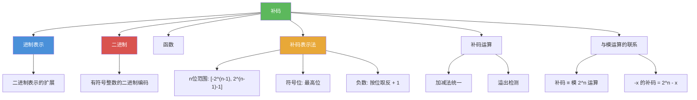

# 补码

> [!abstract] 概述
> ==补码（two's complement）==是计算机中表示有符号整数的标准方法。在 $n$ 位补码表示中，最高位为==符号位==（0 表示非负，1 表示负数），能表示的范围是 $[-2^{n-1},\, 2^{n-1} - 1]$。补码的核心优势在于：==加法和减法可以使用同一套硬件电路==，减法转化为加法只需对减数取补码。正数的补码就是其二进制表示；负数 $-x$（$x > 0$）的补码为 $2^n - x$，可通过"按位取反加 1"高效计算。

## 定义

> [!def] 补码表示法（Two's Complement Representation）
>
> 在 $n$ 位补码系统中：
> - ==正数== $x$（$0 \leq x \leq 2^{n-1} - 1$）的补码就是其 $n$ 位二进制表示
> - ==负数== $-x$（$x > 0$）的补码为 $2^n - x$，等价于对其绝对值的二进制表示"按位取反再加 1"
> - 最高位（第 $n-1$ 位）为==符号位==：0 表示非负数，1 表示负数
>
> **表示范围**：$n$ 位补码能表示的整数范围为
> $$[-2^{n-1},\; 2^{n-1} - 1]$$
>
> 例如：8 位补码的范围为 $[-128, 127]$，32 位补码的范围为 $[-2^{31},\; 2^{31} - 1]$。

> [!def] 补码运算
>
> 补码的加法与普通二进制加法完全相同，结果自动保持为补码形式（丢弃溢出位）：
> - 减法 $a - b$ 转化为加法 $a + (-b)$，其中 $-b$ 的补码通过对 $b$ 按位取反再加 1 得到
> - 溢出检测：当两个同符号数相加得到异符号结果时发生溢出

## 核心性质

| 性质 | 描述 | 说明 |
|------|------|------|
| 表示范围 | $[-2^{n-1},\, 2^{n-1} - 1]$ | $n$ 位补码能表示 $2^n$ 个不同整数 |
| 零的唯一表示 | $+0$ 和 $-0$ 的补码相同 | 不同于原码和反码 |
| 符号位 | 最高位：0 为非负，1 为负 | 与无符号数共用位模式 |
| 加减法统一 | 减法转化为加法 | 对减数取补码后相加 |
| 取补操作 | 按位取反再加 1 | 等价于计算 $2^n - x$ |
| 溢出规则 | 同号相加得异号则溢出 | 需要额外的溢出检测逻辑 |
| 非对称范围 | 负数比正数多一个 | $-2^{n-1}$ 有表示但 $2^{n-1}$ 没有 |

## 关系网络

- [[进制表示]] 是补码的理论基础：补码本质上是在模 $2^n$ 意义下的整数表示
- [[二进制]] 是补码的底层编码：补码使用二进制位模式表示有符号整数
- [[函数]] 的视角：补码转换是从整数到 $n$ 位二进制模式的函数映射

## 章节扩展

### 第4章：数论与密码学

补码是第 4 章 4.2 节的补充内容（教材练习 40-51）：

- **4.2 整数表示与算法**：二进制表示的扩展——补码和反码表示法
- **4.1 整除与模运算**：补码与模运算的深层联系——补码本质上是模 $2^n$ 运算
- **4.2 整数运算算法**：补码加法与普通二进制加法使用相同的硬件电路

## 补充

> [!info] 补码的数学本质与历史
>
> 补码的数学本质是==模 $2^n$ 运算==：在 $n$ 位系统中，整数 $x$ 的补码表示就是 $x \bmod 2^n$ 的二进制形式。当 $x \geq 0$ 时，$x \bmod 2^n = x$；当 $x < 0$ 时，$x \bmod 2^n = 2^n + x = 2^n - |x|$，这正是补码的定义。这一洞察解释了为什么补码的加减法可以统一处理：模运算天然支持"减法变加法"。补码表示由 ==John von Neumann== 在 1945 年的 EDVAC 设计报告中首次系统提出，此后成为几乎所有现代计算机的标准整数表示方法。与原码（sign-magnitude）和反码（ones' complement）相比，补码的唯一零表示和统一的加减法运算使其成为最优选择。
>
> **学术来源**：Rosen, K. H. (2019). *Discrete Mathematics and Its Applications* (8th ed.). McGraw-Hill, Section 4.2, Exercises 40-51.
>
> **参考链接**：Patterson, D. A., & Hennessy, J. L. (2021). *Computer Organization and Design: The Hardware/Software Interface* (6th ed.). Morgan Kaufmann, Chapter 3.

## 参见

- [[进制表示]] -- 基数展开定理与进制转换，补码的理论基础
- [[二进制]] -- 二进制加法和乘法算法，补码运算的底层实现
- [[函数]] -- 补码转换作为从整数到 $n$ 位二进制模式的函数映射
- [[模运算]] -- 补码本质上是模 $2^n$ 运算的体现
