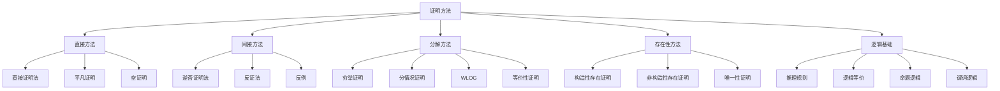

# 证明方法

> [!abstract] 概述
> ==证明方法==（proof methods）是建立数学命题为真的形式化论证技术。证明是数学中建立真理的==有效论证==，其核心逻辑在于证明"命题为假的情况永远不会发生"。Rosen 第8版第1章系统介绍了从直接证明、逆否证明法、反证法到分情况证明、存在性证明和唯一性证明等完整的方法体系，掌握这些方法是学习离散数学的关键能力。

## 定义

> [!def] 证明方法
>
> **证明**（proof）是建立定理为真的有效论证。**定理**（theorem）是可以被证明为真的陈述；**引理**（lemma）是辅助定理；**推论**（corollary）是定理的直接推论；**猜想**（conjecture）是尚未被证明或否证的陈述；**公理**（axiom）是被假定为真的基本陈述。
>
> 大多数定理的形式为 $\forall x(P(x) \to Q(x))$，即"对于论域中所有元素 $x$，如果 $P(x)$ 为真，则 $Q(x)$ 为真"。数学写作中通常省略全称量词，证明时选取任意元素并证明条件语句成立。

## 核心性质

| 证明方法 | 适用对象 | 假设 | 目标 | 逻辑基础 |
|:---------|:---------|:-----|:-----|:---------|
| ==直接证明法== | 条件命题 $p \to q$ | $p$ 为真 | 推出 $q$ 为真 | 正向推理链 |
| ==逆否证明法== | 条件命题 $p \to q$ | $\neg q$ 为真 | 推出 $\neg p$ 为真 | $p \to q \equiv \neg q \to \neg p$ |
| ==反证法== | 任何命题 $p$ | $\neg p$ 为真 | 推出矛盾 $r \wedge \neg r$ | $\neg p \to (r \wedge \neg r)$ 是重言式 |
| ==空证明== | $p \to q$（$p$ 为假） | — | 自动为真 | $F \to q \equiv T$ |
| ==平凡证明== | $p \to q$（$q$ 为真） | — | 自动为真 | $p \to T \equiv T$ |
| ==等价性证明== | $p \leftrightarrow q$ | — | 分别证 $p \to q$ 和 $q \to p$ | 双向条件定义 |
| ==反例== | 全称命题 $\forall x P(x)$ | — | 找到 $a$ 使 $P(a)$ 为假 | 一个反例即证伪 |
| ==穷举证明== | 有限论域上的命题 | — | 逐一验证每个实例 | 分情况证明的特例 |
| ==分情况证明== | $(p_1 \vee \cdots \vee p_n) \to q$ | — | 分别证每个 $p_i \to q$ | 析取对蕴含的分配 |
| ==WLOG== | 对称情况 | — | 只证一种情况 | 对称性变换 |
| ==构造性存在证明== | $\exists x P(x)$ | — | 给出具体的 $a$ 使 $P(a)$ 为真 | 见证者（witness） |
| ==非构造性存在证明== | $\exists x P(x)$ | — | 证明存在性但不给出具体实例 | 反证法等 |
| ==唯一性证明== | $\exists! x P(x)$ | — | 证存在性 + 证唯一性 | $\exists x(P(x) \wedge \forall y(y \neq x \to \neg P(y)))$ |

## 关系网络

- **前置知识**：[[命题逻辑]]（条件命题 $p \to q$ 的真值语义）、[[推理规则]]（有效推理的形式化规则）
- **核心关联**：[[逻辑学/concepts/间接证明]]（反证法与逆否证明法的逻辑基础）、[[逻辑学/concepts/条件证明]]（条件命题的证明策略）
- **验证标准**：[[逻辑学/concepts/有效性]]（论证有效性的判断）

## 章节扩展

### 第1章：逻辑与证明基础

证明方法是第1章第1.7节（证明导论）和第1.8节（证明方法与策略）的核心内容，综合运用了前6节所学的命题逻辑、谓词逻辑、逻辑等价和推理规则等知识。

**直接证明法示例**：证明"如果 $n$ 是奇数，则 $n^2$ 是奇数"。

假设 $n$ 是奇数，则存在整数 $k$ 使得 $n = 2k + 1$。平方得 $n^2 = 4k^2 + 4k + 1 = 2(2k^2 + 2k) + 1$，故 $n^2$ 是奇数。$\blacksquare$

**反证法示例**：证明 $\sqrt{2}$ 是无理数。

假设 $\sqrt{2} = a/b$（最简分数），则 $2b^2 = a^2$，故 $a$ 是偶数。设 $a = 2c$，代入得 $b^2 = 2c^2$，故 $b$ 也是偶数。矛盾：$a$ 和 $b$ 都是偶数，但 $a/b$ 是最简分数。$\blacksquare$

**分情况证明的逻辑基础**：

$$[(p_1 \vee p_2 \vee \cdots \vee p_n) \to q] \leftrightarrow [(p_1 \to q) \wedge (p_2 \to q) \wedge \cdots \wedge (p_n \to q)]$$

**唯一性证明的两部分**：
1. **存在性**：证明存在至少一个元素 $x$ 使得 $P(x)$ 为真
2. **唯一性**：证明如果 $x$ 和 $y$ 都满足 $P$，则 $x = y$

**常见证明错误**：
- **循环推理**（begging the question）：在证明中使用了待证命题本身
- **肯定结论谬误**：从 $q$ 和 $p \to q$ 错误地推出 $p$
- **除以零**：在代数推导中忽略了除数可能为零的情况

### 第5章：归纳与递归

- **5.1 数学归纳法**：数学归纳法和强归纳法是第5章引入的全新证明技术，用于证明对所有正整数成立的命题。归纳法本质上是证明方法中"直接证明"的推广——通过基础步和归纳步，将有限步验证推广到无限情形。

### 第6章：计数

- **6.3-6.4 排列组合恒等式**：组合证明方法（双重计数、双射证明）是第6章引入的新证明技术，与第1章的直接/间接/归纳证明形成互补。

## 补充

> [!info] 学术参考
>
> - **Rosen, K. H.** *Discrete Mathematics and Its Applications*, 8th ed., McGraw-Hill, Sections 1.7-1.8.
>   URL: https://www.mheducation.com/highered/product/discrete-mathematics-applications-rosen/M9781259676512.html
> - **Lakatos, I.** (1976). *Proofs and Refutations: The Logic of Mathematical Discovery*. Cambridge University Press（反证法的历史与哲学地位）。
>   URL: https://www.cambridge.org/core/books/proofs-and-refutations/A11138AE31DB52797A6E4C3F1856E1CB/
> - **Polya, G.** (1945). *How to Solve It: A New Aspect of Mathematical Method*. Princeton University Press（启发式证明策略）。
>   URL: https://www.math.ucla.edu/~abrose/proofwriting/Polyas_howto.html
> - **Antonini, S. & Mariotti, M. A.** (2008). "Indirect proof: what is specific to this way of proving?" *ZDM Mathematics Education*, 40, 401-412（间接证明的认知困难研究）。
>   URL: https://files.eric.ed.gov/fulltext/EJ1106788.pdf

## 参见

- [[推理规则]] — 有效推理的形式化规则
- [[命题逻辑]] — 条件命题的真值语义
- [[谓词逻辑]] — 全称量词与存在量词在证明中的角色
- [[逻辑学/concepts/间接证明]] — 间接证明的逻辑基础
- [[逻辑学/concepts/条件证明]] — 条件命题的证明策略
- [[逻辑学/concepts/有效性]] — 论证有效性的判断
