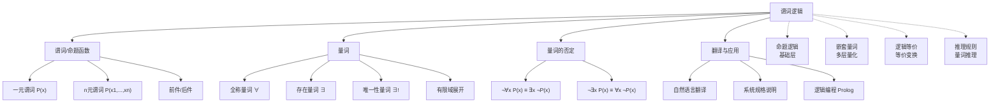

# 谓词逻辑

> [!abstract] 概述
> ==谓词逻辑（predicate logic）== 扩展了[[命题逻辑]]的表达能力，引入==谓词==（即命题函数 $P(x)$）来描述个体的性质和关系，并通过==量词==（全称量词 $\forall$ 和存在量词 $\exists$）对个体进行量化断言。谓词逻辑能够精确表达"所有"、"存在"、"唯一"等涉及变量的一般性陈述，是数学证明、形式化验证和逻辑编程（如 Prolog）的理论基础。

## 定义

> [!def] 谓词逻辑
>
> **谓词逻辑**（又称一阶逻辑/first-order logic）在命题逻辑的基础上引入以下核心概念：
>
> **1. 谓词与命题函数**
>
> - ==谓词==是包含变量的陈述语句，本身不是命题（无确定真值），但代入具体值后成为命题
> - 记为 $P(x)$，其中 $x$ 是变量，"大于 3" 等是谓词所描述的性质
> - 涉及 $n$ 个变量的称为==n 元谓词==，记为 $P(x_1, x_2, \ldots, x_n)$
>
> **2. 量词**
>
> | 量词 | 符号 | 读法 | 含义 |
> |:----:|:----:|:----:|:-----|
> | 全称量词 | $\forall x\, P(x)$ | 对所有 $x$ | 论域中每个 $x$ 都使 $P(x)$ 为真 |
> | 存在量词 | $\exists x\, P(x)$ | 存在 $x$ | 论域中至少一个 $x$ 使 $P(x)$ 为真 |
> | 唯一性量词 | $\exists! x\, P(x)$ | 存在唯一 $x$ | 恰好一个 $x$ 使 $P(x)$ 为真 |
>
> **3. 约束变量与自由变量**
>
> - ==约束变量==（bound variable）：被量词绑定的变量
> - ==自由变量==（free variable）：未被任何量词绑定的变量
> - ==量词的辖域==（scope）：量词所作用的逻辑表达式范围
>
> **4. 量词的 De Morgan 律**
>
> $$\neg \forall x\, P(x) \equiv \exists x\, \neg P(x)$$
> $$\neg \exists x\, P(x) \equiv \forall x\, \neg P(x)$$
>
> 直觉理解："并非所有人都及格" 等价于 "存在至少一个人没及格"。

## 核心性质

| 性质 | 描述 | 公式 |
|:----:|:-----|:-----|
| 有限域全称量化 | 有限域上全称量化等价于合取 | $\forall x\, P(x) \equiv P(x_1) \land P(x_2) \land \cdots \land P(x_n)$ |
| 有限域存在量化 | 有限域上存在量化等价于析取 | $\exists x\, P(x) \equiv P(x_1) \lor P(x_2) \lor \cdots \lor P(x_n)$ |
| 全称对合取的分配 | 全称量词可分配到合取 | $\forall x(P(x) \land Q(x)) \equiv \forall x\, P(x) \land \forall x\, Q(x)$ |
| 存在对析取的分配 | 存在量词可分配到析取 | $\exists x(P(x) \lor Q(x)) \equiv \exists x\, P(x) \lor \exists x\, Q(x)$ |
| 全称受限域 | 全称量词的受限域使用蕴含 | $\forall x < 0\, P(x) \equiv \forall x(x < 0 \to P(x))$ |
| 存在受限域 | 存在量词的受限域使用合取 | $\exists z > 0\, P(z) \equiv \exists z(z > 0 \land P(z))$ |
| 量词优先级 | 量词优先级高于所有命题逻辑运算符 | $\forall x\, P(x) \lor Q(x) \equiv (\forall x\, P(x)) \lor Q(x)$ |
| 唯一性量词消去 | $\exists!$ 可用 $\forall$ 和 $\exists$ 表达 | $\exists! x\, P(x) \equiv \exists x(P(x) \land \forall y(y \neq x \to \neg P(y)))$ |

> [!warning] 不能分配的情况
> 以下等价**不成立**：
> - $\forall x(P(x) \lor Q(x)) \not\equiv \forall x\, P(x) \lor \forall x\, Q(x)$
> - $\exists x(P(x) \land Q(x)) \not\equiv \exists x\, P(x) \land \exists x\, Q(x)$

## 关系网络

- **基础层**：[[命题逻辑]] 是谓词逻辑的基础，谓词逻辑在其上扩展了量词化能力
- **向上扩展**：[[嵌套量词]] 讨论量词出现在另一个量词辖域内的情况，量词顺序至关重要
- **横向关联**：[[离散数学/concepts/逻辑等价]] 中的等价律可推广到含量词的表达式
- **应用方向**：[[推理规则]] 包含量词推理规则（UI/UG/EI/EG）

## 章节扩展

### 第1章：逻辑与证明基础

谓词逻辑是第1章的核心扩展（Rosen 第8版 1.4-1.5 节）：

- **1.4 谓词与量词**：谓词与命题函数的定义、全称量词 $\forall$、存在量词 $\exists$、唯一性量词 $\exists!$、有限域上的量化展开、量词的 De Morgan 律、约束变量与自由变量、自然语言到逻辑表达式的翻译、Prolog 逻辑编程
- **1.5 嵌套量词**：嵌套量词的理解（嵌套循环类比）、量词顺序的重要性（$\forall\exists \not\equiv \exists\forall$）、同类量词可交换、否定嵌套量词（逐层翻转）、前束范式

谓词逻辑弥补了命题逻辑无法处理"所有"、"存在"等一般性陈述的缺陷，为数学证明（1.7-1.8）中常见的全称/存在性论证提供了逻辑工具。

## 补充

> [!info] 学术背景与应用
>
> 谓词逻辑是**模型检验**（model checking）和**形式化验证**（formal verification）的理论基石。在软件工程中，系统规格说明通常用谓词逻辑表达式来描述系统的预期行为，然后通过自动化工具验证实现是否满足规格。Amazon Web Services 使用基于谓词逻辑的形式化规约语言 TLA+ 对其分布式系统（如 DynamoDB）进行验证，在部署前发现了多个设计缺陷。
>
> 谓词逻辑也是逻辑编程语言 Prolog（Programming in Logic）的理论基础。Prolog 中的事实（facts）和规则（rules）直接对应谓词逻辑中的原子命题和蕴含式，查询机制对应存在量词的求解。
>
> **来源**：
> - Clarke, E. M., Grumberg, O., & Peled, D. A. (1999). *Model Checking*. MIT Press. https://mitpress.mit.edu/9780262032704/
> - Newcombe, C., et al. (2014). "Formal Methods in Practice at Amazon Web Services." *ABZ 2014*, LNCS 8477, 3-17. https://doi.org/10.1007/978-3-662-43652-3_1
> - De Morgan, A. (1847). *Formal Logic: or, The Calculus of Inference, Necessary and Probable*. Taylor and Walton. https://archive.org/details/formallogicorcal00demorich

## 参见

- [[命题逻辑]] — 谓词逻辑的基础形式逻辑系统
- [[嵌套量词]] — 多层量词的顺序、否定与前束范式
- [[离散数学/concepts/逻辑等价]] — 含量词的逻辑等价关系
- [[推理规则]] — 量词推理规则（UI/UG/EI/EG）
- [[逻辑学/concepts/量词]] — 量词的概念（逻辑学知识库）
