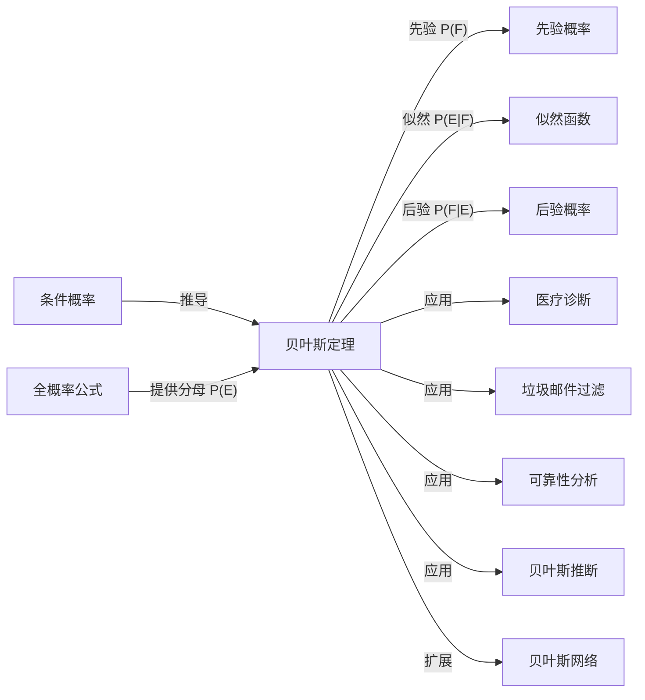

# 贝叶斯定理

> [!abstract]
> ==贝叶斯定理（Bayes' Theorem）==是概率论中关于**条件概率**的核心定理，它提供了在观察到新证据后，如何更新对假设的信念（概率）的数学框架。具体而言，贝叶斯定理将"由原因推结果"的概率（似然）转化为"由结果推原因"的概率（后验）。该定理广泛应用于医疗诊断、垃圾邮件过滤、可靠性分析、机器学习等领域。

## 定义

> [!def] 贝叶斯定理
> 设 $F_1, F_2, \ldots, F_n$ 是样本空间 $S$ 的一个**划分**（即两两互斥且并集为 $S$），
> 且 $P(F_i) > 0$ 对所有 $i$ 成立。若 $E$ 是一个满足 $P(E) > 0$ 的事件，
> 则对每个 $j = 1, 2, \ldots, n$：
> $$
> P(F_j \mid E) = \frac{P(E \mid F_j) \cdot P(F_j)}{\sum_{i=1}^{n} P(E \mid F_i) \cdot P(F_i)}
> $$
>
> > [!def] 贝叶斯定理的两事件形式
> > 当只有两个假设 $F$ 和 $\overline{F}$ 时，公式简化为：
> > $$
> > P(F \mid E) = \frac{P(E \mid F) \cdot P(F)}{P(E \mid F) \cdot P(F) + P(E \mid \overline{F}) \cdot P(\overline{F})}
> > $$
> >
> > 其中分母 $P(E) = P(E \mid F) \cdot P(F) + P(E \mid \overline{F}) \cdot P(\overline{F})$
> > 正是[[离散数学/concepts/全概率公式]]。
> >
> > [!def] 贝叶斯定理的术语
> > | 术语 | 符号 | 含义 |
> > |------|------|------|
> > | **先验概率** | $P(F_j)$ | 在观察到证据 $E$ 之前，对假设 $F_j$ 的初始信念 |
> > | **似然** | $P(E \mid F_j)$ | 在假设 $F_j$ 为真的条件下，观察到证据 $E$ 的概率 |
> > | **后验概率** | $P(F_j \mid E)$ | 在观察到证据 $E$ 之后，对假设 $F_j$ 的更新信念 |
> > | **证据概率** | $P(E)$ | 观察到证据 $E$ 的总概率（全概率公式） |

## 核心性质

| 编号 | 性质 | 数学表达 / 说明 |
|:---:|------|----------------|
| 1 | **概率更新** | 后验概率 $P(F_j \mid E)$ 是对先验概率 $P(F_j)$ 的修正 |
| 2 | **归一性** | $\sum_{j=1}^{n} P(F_j \mid E) = 1$，后验概率仍构成合法的概率分布 |
| 3 | **似然比形式** | $\frac{P(F_1 \mid E)}{P(F_2 \mid E)} = \frac{P(E \mid F_1)}{P(E \mid F_2)} \cdot \frac{P(F_1)}{P(F_2)}$ |
| 4 | **对称性** | $P(F \mid E) = \frac{P(E \mid F) \cdot P(F)}{P(E)}$，分子分母关于 $E$ 和 $F$ 对称 |
| 5 | **依赖全概率公式** | 分母 $P(E) = \sum_i P(E \mid F_i) P(F_i)$ 需要用[[离散数学/concepts/全概率公式]]计算 |
| 6 | **序贯更新** | 新的后验概率可作为下一次更新的先验概率，实现序贯贝叶斯推断 |
| 7 | **先验影响** | 当先验概率差异很大时，即使似然支持某一假设，后验也可能被先验主导 |

## 关系网络

## 章节扩展

- **[[离散数学/concepts/条件概率]]**：贝叶斯定理的基础，$P(F \mid E) = \frac{P(E \cap F)}{P(E)}$。
- **[[离散数学/concepts/全概率公式]]**：贝叶斯定理分母的计算工具。
- **贝叶斯推断**：将贝叶斯定理发展为完整的统计推断框架，通过先验分布和似然函数得到后验分布。
- **朴素贝叶斯分类器**：假设各特征条件独立，利用贝叶斯定理进行分类，是机器学习中的经典方法。

## 补充

> [!info] 医疗诊断示例
> 某疾病的人群患病率为 $P(D) = 0.001$（先验概率）。
> 检测方法的灵敏度为 $P(+\mid D) = 0.99$（真阳性率），
> 假阳性率为 $P(+\mid \overline{D}) = 0.05$。
> 若某人检测结果为阳性（$+$），则真正患病的概率为：
> $$
> P(D \mid +) = \frac{0.99 \times 0.001}{0.99 \times 0.001 + 0.05 \times 0.999} = \frac{0.00099}{0.00099 + 0.04995} \approx 0.0194
> $$
> 即仅有约 **1.94%** 的概率真正患病！
> 这说明即使检测准确率很高，在罕见疾病中假阳性仍会主导结果，
> 体现了先验概率在贝叶斯推断中的重要性。
>
> [!info] 贝叶斯定理的历史
> 该定理由英国牧师兼数学家 **托马斯·贝叶斯（Thomas Bayes, 1701–1761）** 提出。
> 他的论文 *"An Essay towards solving a Problem in the Doctrine of Chances"*
> 在他去世后的 1763 年由朋友 Richard Price 发表。
> 法国数学家 **拉普拉斯（Pierre-Simon Laplace）** 独立发现并推广了该定理，
> 将其系统化地应用于统计推断问题。

## 参见

- [[离散数学/concepts/条件概率]]：贝叶斯定理的直接基础
- [[离散数学/concepts/全概率公式]]：贝叶斯定理分母的计算公式
- [[离散数学/concepts/概率]]：先验概率和后验概率的基本定义
- [[离散数学/concepts/独立性]]：当假设与证据独立时，后验等于先验
- [[离散数学/concepts/概率分布]]：贝叶斯推断中先验和后验都是概率分布
