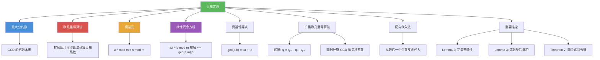

# 贝祖定理

> [!abstract] 概述
> ==贝祖定理（Bezout's Theorem）==揭示了最大公约数的代数本质：若 $a$ 和 $b$ 为正整数，则存在整数 $s$ 和 $t$ 使得 $\gcd(a, b) = sa + tb$。满足此等式的 $s$ 和 $t$ 称为==贝祖系数==（Bezout coefficients）。贝祖系数可通过==扩展欧几里得算法==在 $O(\log b)$ 时间内高效计算：在执行辗转相除的同时，维护两组系数 $s_j$ 和 $t_j$ 使得 $r_j = s_j \cdot a + t_j \cdot b$。贝祖定理的重要应用包括：求==模逆元==、判定线性同余方程的可解性、证明同余式的消去律。

## 定义

> [!def] 贝祖定理（Theorem 6: Bezout's Theorem）
>
> 若 $a$ 和 $b$ 为正整数，则存在整数 $s$ 和 $t$ 使得
> $$\gcd(a, b) = sa + tb$$
>
> 满足此等式的 $s$ 和 $t$ 称为 $a$ 和 $b$ 的==贝祖系数==（Bezout coefficients），该等式称为==贝祖恒等式==（Bezout's identity）。

> [!def] 扩展欧几里得算法
>
> 在欧几里得算法的同时，维护两组系数 $s_j$ 和 $t_j$，使得 $r_j = s_j \cdot a + t_j \cdot b$。
>
> **初始化**：$s_0 = 1, s_1 = 0, t_0 = 0, t_1 = 1$
>
> **递推**（$j = 2, 3, \ldots, n$）：
> $$s_j = s_{j-2} - q_{j-1} \cdot s_{j-1}$$
> $$t_j = t_{j-2} - q_{j-1} \cdot t_{j-1}$$
>
> 最终 $\gcd(a, b) = s_n \cdot a + t_n \cdot b$。

> [!def] 反向代入法（Back Substitution）
>
> 另一种求贝祖系数的方法：先正向执行欧几里得算法得到一系列等式，然后从最后一个非零余数开始，逐步将余数用前一步的余数表示，最终将 GCD 表示为 $a$ 和 $b$ 的线性组合。
>
> 例如对 $\gcd(252, 198) = 18$：
> $$18 = 54 - 1 \times 36 = 54 - 1 \times (198 - 3 \times 54) = 4 \times 54 - 198$$
> $$= 4 \times (252 - 198) - 198 = 4 \times 252 - 5 \times 198$$

## 核心性质

| 性质 | 描述 | 说明 |
|------|------|------|
| GCD 的线性组合表示 | $\gcd(a,b) = sa + tb$ | 贝祖恒等式 |
| 贝祖系数不唯一 | 若 $(s, t)$ 是一组解，则 $(s + kb, t - ka)$ 也是 | $k$ 为任意整数 |
| 互素判定的等价条件 | $\gcd(a,b) = 1 \iff \exists s,t: sa + tb = 1$ | 贝祖定理的直接推论 |
| 整除性推论 | $\gcd(a,b)=1$ 且 $a \mid bc \Rightarrow a \mid c$ | Lemma 2，由贝祖定理推出 |
| 素数整除乘积 | $p \mid a_1 \cdots a_n \Rightarrow p \mid$ 某 $a_i$ | Lemma 3，算术基本定理唯一性的关键 |
| 同余式消去律 | $ac \equiv bc \pmod{m}$ 且 $\gcd(c,m)=1 \Rightarrow a \equiv b$ | Theorem 7 |
| 模逆元存在性 | $\gcd(a, m) = 1 \iff a$ 在 $\mathbb{Z}_m$ 中有乘法逆元 | 逆元即为贝祖系数 $s \bmod m$ |
| 计算复杂度 | $O(\log b)$ 次递推 | 与欧几里得算法相同 |

## 关系网络

- [[最大公约数]] 是贝祖恒等式的核心：$\gcd(a,b)$ 恰好等于 $sa + tb$ 中的最小正整数
- [[欧几里得算法]] 是计算贝祖系数的工具：扩展欧几里得算法在 $O(\log b)$ 时间内完成
- [[模逆元]] 的计算依赖于贝祖定理：若 $\gcd(a, m) = 1$，则 $a^{-1} \bmod m = s \bmod m$（$s$ 为贝祖系数）
- [[线性同余方程]] $ax \equiv b \pmod{m}$ 的可解性条件 $\gcd(a, m) \mid b$ 可通过贝祖定理证明

## 章节扩展

### 第4章：数论与密码学

贝祖定理是第 4 章 4.3 节的重要理论结果：

- **4.3 素数与最大公约数**：贝祖定理（Theorem 6）、扩展欧几里得算法、反向代入法、Lemma 2（互素整除性）、Lemma 3（素数整除乘积）、Theorem 7（同余式消去律）
- **4.3 算术基本定理**：唯一性证明依赖 Lemma 3，而 Lemma 3 的证明依赖贝祖定理
- **4.4 解同余方程**：扩展欧几里得算法用于求模逆元，求解线性同余方程
- **4.5 密码学应用**：RSA 中用扩展欧几里得算法计算 $d = e^{-1} \bmod \phi(n)$

## 补充

> [!info] 贝祖定理的数学地位与历史
>
> 贝祖定理以法国数学家 ==Etienne Bezout==（1730--1783）的名字命名，他在多项式理论中发现了类似的结果。贝祖定理揭示了 GCD 的深层代数结构：$\gcd(a, b)$ 不仅是 $a$ 和 $b$ 的"最大公度"，更是 $a$ 和 $b$ 的所有整数线性组合 $\{sa + tb \mid s, t \in \mathbb{Z}\}$ 中的==最小正整数==。这一洞察在抽象代数中有深刻推广：在主理想整环（PID）中，两个元素的最大公因子总是它们的线性组合。贝祖定理的推论——同余式消去律（Theorem 7）——解决了 4.1 节中遗留的问题："同余式两边能否除以公因子？"答案是：只有当公因子与模互素时才可以。扩展欧几里得算法是密码学中计算模逆元的标准方法，也是 RSA 密钥生成步骤的核心组件。
>
> **学术来源**：Rosen, K. H. (2019). *Discrete Mathematics and Its Applications* (8th ed.). McGraw-Hill, Section 4.3, Theorem 6.
>
> **参考链接**：Cormen, T. H., Leiserson, C. E., Rivest, R. L., & Stein, C. (2022). *Introduction to Algorithms* (4th ed.). MIT Press, Chapter 31.

## 参见

- [[最大公约数]] -- 贝祖恒等式 $\gcd(a,b) = sa + tb$ 揭示了 GCD 的代数本质
- [[欧几里得算法]] -- 扩展欧几里得算法在计算 GCD 的同时求出贝祖系数
- [[模逆元]] -- 当 $\gcd(a, m) = 1$ 时，$a^{-1} \bmod m$ 可通过贝祖系数求得
- [[线性同余方程]] -- $ax \equiv b \pmod{m}$ 的可解性条件 $\gcd(a, m) \mid b$ 由贝祖定理保证
