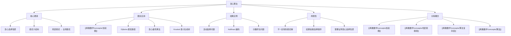

# 贪心算法

> [!abstract] 概述
> ==贪心算法==（greedy algorithm）是一种在每一步决策中都选择==当前最优==（局部最优）的策略，期望通过一系列局部最优选择最终达到==全局最优==解。贪心算法的核心前提是问题必须满足==贪心选择性质==（greedy choice property）和==最优子结构==（optimal substructure）。在图论中，Dijkstra 最短路径算法和贪心着色算法都是贪心策略的典型应用。然而，贪心算法并不总是能得到最优解——例如贪心着色算法给出的颜色数可能远大于图的==色数==（chromatic number），旅行商问题的贪心近似也可能产生较差的解。理解贪心算法的适用条件与局限性是算法设计的关键。

## 定义

> [!def] 贪心算法（Greedy Algorithm）
>
> ==贪心算法==是一种逐步构造解的算法策略。在每一步决策中，算法选择当前看起来最优的选项（==局部最优选择==），且一旦做出选择就不可撤回。形式化地，贪心算法在每一步从候选集 $C$ 中选择一个元素 $c$，使得：
>
> $$c = \arg\max_{x \in C}\ \text{greedy\_criterion}(x)$$
>
> 其中 $\text{greedy\_criterion}$ 是根据问题定义的贪心准则（如最小权重、最大收益等）。

> [!def] 贪心选择性质（Greedy Choice Property）
>
> 一个问题具有==贪心选择性质==，是指可以通过做出局部最优（贪心）选择来产生全局最优解。具体而言：
>
> - 存在一个贪心选择，使得在做出该选择后，原问题简化为一个规模更小的==子问题==
> - 对子问题继续应用贪心选择，最终可以得到原问题的全局最优解
>
> 贪心选择性质是贪心算法正确性的**必要前提**。若问题不满足该性质，贪心算法可能无法得到最优解。

> [!def] 最优子结构（Optimal Substructure）
>
> 一个问题具有==最优子结构==，是指问题的最优解包含其子问题的最优解。形式化地，若 $S$ 是问题的一个最优解，且 $S$ 可以分解为子问题 $P_1, P_2, \ldots, P_k$ 的解 $S_1, S_2, \ldots, S_k$，则每个 $S_i$ 都是子问题 $P_i$ 的最优解。
>
> 最优子结构使得问题可以通过==自底向上==或==自顶向下==的方式逐步求解。

> [!def] 贪心着色算法（Greedy Coloring Algorithm）
>
> ==贪心着色算法==用于给图的顶点着色，使得相邻顶点具有不同颜色。算法按某种顺序遍历顶点，每个顶点被赋予最小的可用颜色（即不与已着色邻居冲突的最小编号颜色）：
>
> 1. 选择顶点的一个排列顺序 $v_1, v_2, \ldots, v_n$
> 2. 对 $i = 1, 2, \ldots, n$：将 $v_i$ 染上最小的不与 $v_i$ 的已着色邻居冲突的颜色
>
> 贪心着色算法使用的颜色数取决于顶点的排列顺序，且不一定等于图的最小颜色数（色数 $\chi(G)$）。

## 核心性质

| 性质 | 描述 | 备注 |
|:-----|:-----|:-----|
| ==贪心选择性质== | 局部最优选择能导致全局最优解 | 贪心算法正确性的核心前提 |
| ==最优子结构== | 最优解包含子问题的最优解 | 使得问题可以递归/迭代求解 |
| ==不可撤回性== | 每步选择一旦做出不可更改 | 区别于回溯法和动态规划 |
| ==高效性== | 通常时间复杂度为 $O(n \log n)$ 或 $O(n)$ | 比动态规划和回溯法更高效 |
| ==不保证最优== | 对不满足贪心选择性质的问题可能得到次优解 | 如贪心着色、TSP 贪心近似 |
| ==结果依赖顺序== | 贪心着色等算法的结果受处理顺序影响 | 不同顺序可能产生不同结果 |

## 关系网络

- **前置知识**：算法基础概念、图的基本结构
- **核心关联**：贪心算法是三大经典算法策略之一（与动态规划、分治法并列）。其核心优势在于高效简洁，核心风险在于不一定得到最优解。Dijkstra 算法是贪心策略在图论中最成功的应用之一
- **后继概念**：[[离散数学/concepts/加权图]]（Dijkstra 算法作为贪心算法的实例）、[[离散数学/concepts/哈密顿路径]]（TSP 的贪心近似）

## 章节扩展

### 第10章：图论

贪心算法在图论中有丰富的应用场景，是第10章中算法部分的重要内容。

**Dijkstra 算法作为贪心算法的实例**：

Dijkstra 算法是贪心策略的经典成功案例。在每一步中，算法从未确定最短距离的顶点中选择距离值最小的顶点 $u$（贪心选择），然后通过 $u$ 更新其邻居的距离（松弛操作）。Dijkstra 算法的正确性依赖于两个关键性质：
- **贪心选择性质**：当前距离最小的未访问顶点 $u$，其距离值已经是最短距离，不可能通过其他未访问顶点找到更短路径
- **最优子结构**：若 $s \to u$ 的最短路径经过 $v$，则 $s \to v$ 的子路径也是最短路径

**贪心着色算法的分析**：

贪心着色算法的结果严重依赖于顶点的处理顺序。对于任意图 $G$，存在某个顶点排列使得贪心算法恰好使用 $\chi(G)$ 种颜色（最优着色），但也存在排列使得贪心算法使用远多于 $\chi(G)$ 种颜色。

一个重要结论：对于顶点按度数递减排列的贪心着色，使用的颜色数不超过 $\Delta(G) + 1$，其中 $\Delta(G)$ 是图的最大度数（Brooks 定理进一步证明，对于非完全图和非奇数环，贪心着色可用不超过 $\Delta(G)$ 种颜色）。

**贪心算法 vs 动态规划**：

| 比较维度 | 贪心算法 | 动态规划 |
|:---------|:---------|:---------|
| 决策方式 | 每步选当前最优 | 考虑所有子问题的最优解 |
| 子问题重叠 | 通常无重叠子问题 | 可能有重叠子问题 |
| 回溯 | 不可回溯 | 通过表格记录可"回溯" |
| 时间复杂度 | 通常更低 | 可能更高但保证最优 |
| 适用条件 | 贪心选择性质 + 最优子结构 | 最优子结构 + 重叠子问题 |

### 第11章：树

贪心算法在第11章中有两个重要应用：Huffman 编码和最小生成树。

**Huffman 编码**：

Huffman 编码是贪心算法在数据压缩中的经典成功案例。算法从底向上构建最优二叉树（Huffman 树）：每次选择频率最小的两棵树合并。贪心选择性质保证这种策略产生最优前缀码。Huffman 编码的平均码长达到信源熵的下界。

**最小生成树（Prim/Kruskal）**：

Prim 算法在每步贪心地选择与当前生成树相连的最小权重边；Kruskal 算法贪心地选择全局最小的不成环边。两者的正确性都依赖于==割性质==（Cut Property）：跨越某个割的最小权重边必属于某棵 MST。

## 补充

> [!info] 贪心算法的经典应用
>
> 贪心算法在多个领域有成功应用：
>
> - **Dijkstra 最短路径**：网络路由、地图导航中的核心算法
> - **Kruskal/Prim 最小生成树**：网络设计、聚类分析
> - **Huffman 编码**：数据压缩中的最优前缀码构造
> - **活动选择问题**：区间调度中的最大兼容活动集选择
> - **分数背包问题**：可分割物品的最优装载（与 0-1 背包不同）

> [!tip] 判断贪心算法是否适用的方法
>
> - **证明贪心选择性质**：证明做出局部最优选择后，原问题简化为同类型的子问题
> - **证明最优子结构**：证明最优解包含子问题的最优解
> - **反例验证**：尝试构造反例，若能找到贪心策略不成立的反例，则问题不适合贪心算法
> - **交换论证**（exchange argument）：证明任意最优解都可以通过局部替换转化为贪心解

> [!warning] 贪心算法的常见陷阱
>
> - **0-1 背包问题不能用贪心算法**：按单位价值排序贪心选择不一定得到最优解（需要动态规划）
> - **旅行商问题的贪心近似质量差**：最近邻贪心策略的近似比无常数上界，最坏情况下解的质量很差
> - **贪心着色不保证最优**：贪心着色使用的颜色数可能远大于色数 $\chi(G)$，判断图的最优着色本身是 NP 困难的
> - **贪心选择不可撤回**：一旦做出选择就不能更改，因此错误的早期选择可能导致最终解远非最优

## 参见

- [[离散数学/concepts/加权图]] -- Dijkstra 算法是贪心策略在加权图中的经典应用
- [[离散数学/concepts/哈密顿路径]] -- TSP 的贪心近似算法及其局限性
- [[离散数学/concepts/算法复杂度]] -- 贪心算法的时间复杂度分析
- [[离散数学/concepts/算法]] -- 贪心算法作为算法设计策略的分类
