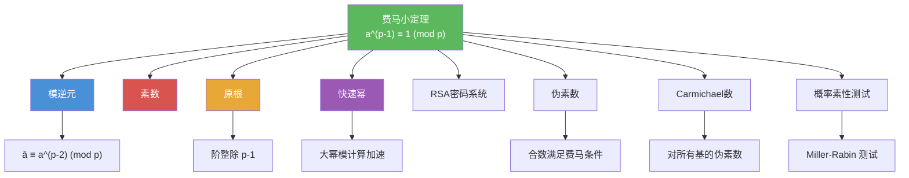

# 费马小定理

> [!abstract] 概述
> ==费马小定理==（Fermat's Little Theorem）是数论中的核心定理之一：若 $p$ 为素数且 $p \nmid a$，则 $a^{p-1} \equiv 1 \pmod{p}$。该定理揭示了素数模下幂运算的==周期性规律==，使得计算 $a^n \bmod p$ 时只需计算 $a^{n \bmod (p-1)} \bmod p$，大幅降低计算量。费马小定理也是==概率素性测试==（如 Miller-Rabin 测试）的理论基础。需要注意==伪素数==和==Carmichael 数==的存在——它们是满足费马小定理条件的合数，是素性测试的"陷阱"。

## 定义

> [!def] 费马小定理（Fermat's Little Theorem）
>
> 若 $p$ 为素数且 $p \nmid a$，则
>
> $$a^{p-1} \equiv 1 \pmod{p}$$
>
> 进一步，对任意整数 $a$：
>
> $$a^p \equiv a \pmod{p}$$
>
> **证明思路**：
> (a) 若 $p \nmid a$，则 $a, 2a, \ldots, (p-1)a$ 这 $p-1$ 个数在模 $p$ 下互不相同（且均非零），因此它们是 $\{1, 2, \ldots, p-1\}$ 的一个排列。
>
> (b) 因此 $\prod_{i=1}^{p-1}(ia) \equiv \prod_{i=1}^{p-1} i \pmod{p}$，即 $a^{p-1}(p-1)! \equiv (p-1)! \pmod{p}$。
>
> (c) 因为 $p \nmid (p-1)!$，由消去律得 $a^{p-1} \equiv 1 \pmod{p}$。
>
> $\blacksquare$

> [!def] 伪素数（Pseudoprime）
>
> 设 $b$ 为正整数。若 $n$ 是==合数==，且满足
>
> $$b^{n-1} \equiv 1 \pmod{n}$$
>
> 则称 $n$ 为==以 $b$ 为基的伪素数==（pseudoprime to base $b$）。
>
> 例如，$341 = 11 \times 31$ 是合数，但 $2^{340} \equiv 1 \pmod{341}$，因此 341 是以 2 为基的伪素数。

> [!def] Carmichael 数（Carmichael Number）
>
> 若合数 $n$ 满足：对所有满足 $\gcd(b, n) = 1$ 的正整数 $b$，都有
>
> $$b^{n-1} \equiv 1 \pmod{n}$$
>
> 则称 $n$ 为==Carmichael 数==。
>
> 例如，$561 = 3 \times 11 \times 17$ 是最小的 Carmichael 数。Carmichael 数是概率素性测试的"最强陷阱"，因为它们对所有基都"伪装"成素数。

## 核心性质

| 性质 | 描述 | 说明 |
|------|------|------|
| 基本形式 | $a^{p-1} \equiv 1 \pmod{p}$（$p \nmid a$） | 素数模下幂运算的周期为 $p-1$ |
| 推广形式 | $a^p \equiv a \pmod{p}$（任意整数 $a$） | 无需 $p \nmid a$ 的限制 |
| 大幂简化 | $a^n \equiv a^{n \bmod (p-1)} \pmod{p}$ | 将指数从 $n$ 降至 $< p-1$ |
| 求逆元 | $\bar{a} \equiv a^{p-2} \pmod{p}$ | 素数模下求逆元的替代方法 |
| 伪素数 | 合数满足 $b^{n-1} \equiv 1 \pmod{n}$ | 费马素性测试的"假阳性" |
| Carmichael 数 | 对所有互素基都是伪素数的合数 | 概率素性测试的"最强陷阱" |

## 关系网络

- [[模逆元]] 在素数模下可由费马小定理直接计算：$\bar{a} \equiv a^{p-2} \pmod{p}$
- [[素数]] 是费马小定理成立的前提条件：定理中的 $p$ 必须是素数
- [[原根]] 的阶整除 $p-1$：由费马小定理 $a^{p-1} \equiv 1 \pmod{p}$ 可知阶不超过 $p-1$
- [[快速幂]] 配合费马小定理可高效计算大幂模素数：$a^n \equiv a^{n \bmod (p-1)} \pmod{p}$
- [[RSA密码系统]] 的正确性证明依赖于费马小定理的推广形式——Euler 定理

## 章节扩展

### 第4章：数论与密码学

费马小定理是第 4.4 节的核心定理之一，连接了数论理论与密码学应用：

- **4.4 解同余方程**：费马小定理提供大幂模素数的快速计算方法
- **4.4 伪素数与 Carmichael 数**：费马小定理的"反例"——满足条件的合数
- **4.6 密码学**：RSA 系统的正确性证明依赖 Euler 定理（费马小定理的推广）；Miller-Rabin 素性测试基于费马小定理的逆命题

## 补充

> [!info] 费马小定理的历史与学术背景
>
> 费马小定理由法国数学家 **Pierre de Fermat** 于 1640 年在一封给 Frénicle de Bessy 的信中首次提出，Fermat 声称他有一个证明但未公开发表。该定理的第一个公开发表的证明由 **Euler** 于 1736 年给出。费马小定理是更一般的 **Euler 定理**（$a^{\varphi(n)} \equiv 1 \pmod{n}$，其中 $\gcd(a, n) = 1$）的特殊情形。Carmichael 数的存在性由 **Robert D. Carmichael** 于 1910 年研究，Alford、Granville 和 Pomerance 在 1994 年证明了 Carmichael 数有==无穷多个==。费马小定理在现代密码学中扮演核心角色：它是 RSA、Diffie-Hellman、ElGamal 等公钥密码系统正确性证明的理论基础，也是 Miller-Rabin 概率素性测试的理论依据。
>
> **学术来源**：Rosen, K. H. (2019). *Discrete Mathematics and Its Applications* (8th ed.). McGraw-Hill, Section 4.4, Theorem 3.
>
> **参考链接**：[Fermat's Little Theorem - Wikipedia](https://en.wikipedia.org/wiki/Fermat%27s_little_theorem)

## 参见

- [[模逆元]] -- 素数模下 $\bar{a} \equiv a^{p-2} \pmod{p}$
- [[素数]] -- 费马小定理成立的前提条件
- [[原根]] -- 阶为 $p-1$ 的元素，与费马小定理密切相关
- [[快速幂]] -- 配合费马小定理高效计算大幂模素数
- [[RSA密码系统]] -- 正确性证明依赖 Euler 定理（费马小定理的推广）
