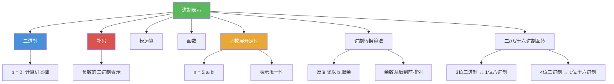

# 进制表示

> [!abstract] 概述
> ==进制表示（base representation）==是整数在不同基数下的展开形式。==基数展开定理==保证：对任意大于 1 的整数 $b$，每个正整数 $n$ 都可以==唯一==地表示为 $n = a_k b^k + a_{k-1}b^{k-1} + \cdots + a_1 b + a_0$，其中 $0 \leq a_i < b$。进制转换算法通过"反复除以基数取余"实现十进制到任意进制的转换。==二进制==（$b=2$）是计算机的基础，==八进制==（$b=8$）和==十六进制==（$b=16$）是二进制的简写形式，分别按 3 位和 4 位分组进行快速互转。

## 定义

> [!def] 基数展开定理（Theorem 1）
>
> 设 $b$ 为大于 $1$ 的整数。若 $n$ 为正整数，则 $n$ 可以==唯一==地表示为
>
> $$n = a_k b^k + a_{k-1} b^{k-1} + \cdots + a_1 b + a_0$$
>
> 其中 $k$ 为非负整数，$a_0, a_1, \ldots, a_k$ 为满足 $0 \leq a_i < b$ 的非负整数，且 $a_k \neq 0$。
>
> - 该表示称为 $n$ 的==$b$ 进制展开==（base $b$ expansion），记作 $(a_k a_{k-1} \ldots a_1 a_0)_b$
> - $b$ 进制表示的位数为 $\lfloor \log_b n \rfloor + 1$

> [!def] 进制转换算法（Algorithm 1）
>
> 将十进制正整数 $n$ 转换为 $b$ 进制表示的方法：
> 1. 用 $n$ 除以 $b$，得商 $q_0$ 和余数 $a_0$（$0 \leq a_0 < b$），$a_0$ 是最低位
> 2. 用 $q_0$ 除以 $b$，得商 $q_1$ 和余数 $a_1$，$a_1$ 是次低位
> 3. 重复此过程，直到商为 $0$
> 4. 余数序列 $a_k, a_{k-1}, \ldots, a_1, a_0$（从最后一次到第一次）构成 $b$ 进制表示

> [!def] 二/八/十六进制快速互转
>
> - 每位==八进制==数字对应==3 位==二进制数字
> - 每位==十六进制==数字对应==4 位==二进制数字
> - 转换方法：将二进制按 3 位（八进制）或 4 位（十六进制）分组，不足的在左边补零
> - 十六进制中 $A=10, B=11, C=12, D=13, E=14, F=15$

## 核心性质

| 性质 | 描述 | 说明 |
|------|------|------|
| 表示的唯一性 | 每个 $n > 0$ 恰好有一种 $b$ 进制展开 | 基数展开定理的核心结论 |
| 位数公式 | $b$ 进制位数为 $\lfloor \log_b n \rfloor + 1$ | 由 $b^k \leq n < b^{k+1}$ 推出 |
| 余数排列顺序 | 第一个余数是最低位，最后一个是最高位 | 进制转换时易犯的错误 |
| 八进制-二进制互转 | 每 3 位二进制 = 1 位八进制 | $2^3 = 8$ |
| 十六进制-二进制互转 | 每 4 位二进制 = 1 位十六进制 | $2^4 = 16$ |
| $b$ 进制转十进制 | 按位展开为 $b$ 的幂次和 | $(a_k \ldots a_0)_b = \sum a_i b^i$ |

## 关系网络

- [[二进制]] 是进制表示的特殊情况（$b = 2$），是计算机内部数据表示的基础
- [[补码]] 建立在二进制表示之上，是计算机中表示有符号整数的标准方法
- [[模运算]] 与进制转换密切相关：进制转换中的"除以 $b$ 取余"本质上就是 $\bmod$ 运算
- [[函数]] 的视角：进制转换是一个从十进制到 $b$ 进制的函数映射

## 章节扩展

### 第4章：数论与密码学

进制表示是第 4 章 4.2 节的前半部分内容：

- **4.2 整数表示与算法**：基数展开定理（Theorem 1）、进制转换算法（Algorithm 1）、二/八/十六进制互转方法
- **4.2 整数运算算法**：二进制加法和乘法算法建立在二进制表示之上
- **4.2 模幂算法**：快速幂利用指数的二进制展开实现高效计算

## 补充

> [!info] 进制表示的历史与学术背景
>
> 进制表示的历史可以追溯到古代文明。古巴比伦人使用 60 进制（至今仍影响时间和角度的计量），玛雅人使用 20 进制。现代计算机使用二进制（$b = 2$）的思想由 ==Leibniz== 在 1703 年的论文中系统阐述，他认为二进制完美体现了从无到有的创造过程。八进制和十六进制作为二进制的简写形式，在计算机科学中被广泛使用——每个十六进制数字恰好对应 4 位二进制（半个字节），使得地址和数据的表示更加紧凑。基数展开定理的唯一性证明可用数学归纳法完成（见教材第 5 章）。
>
> **学术来源**：Rosen, K. H. (2019). *Discrete Mathematics and Its Applications* (8th ed.). McGraw-Hill, Section 4.2.
>
> **参考链接**：Knuth, D. E. (1997). *The Art of Computer Programming* (Vol. 2, 3rd ed.). Addison-Wesley, Section 4.1.

## 参见

- [[二进制]] -- $b = 2$ 的进制表示，计算机内部数据的基础编码方式
- [[补码]] -- 建立在二进制之上的有符号整数表示方法
- [[模运算]] -- 进制转换中"除以 $b$ 取余"的本质是 $\bmod$ 运算
- [[函数]] -- 进制转换是从十进制到 $b$ 进制的函数映射
