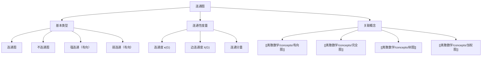

# 连通图

> [!abstract] 概述
> ==连通图==（connected graph）是==图论==中的一个核心概念：无向图中任意两个顶点之间都存在路径。连通性是图的基本拓扑性质之一，直接影响图的遍历、路径搜索和网络可靠性分析。连通图的一个重要特例是==树==——一棵 $n$ 个顶点的树恰好有 $n-1$ 条边，是==连通==且==无环==的图。连通性的破坏产生==连通分量==（connected component），而==连通度== $\kappa(G)$ 衡量图的"韧性"——需要删除多少个顶点才能使图不连通。在有向图中，连通性进一步细分为==强连通==（任意两个顶点互相可达）和==弱连通==（忽略方向后连通）。

## 定义

> [!def] 连通图（Connected Graph）
>
> 一个无向图 $G = (V, E)$ 是==连通图==，当且仅当对于任意两个顶点 $u, v \in V$，都存在一条从 $u$ 到 $v$ 的路径。形式化地：
>
> $$\forall u, v \in V,\ \exists\ \text{path}(u, v)$$

> [!def] 连通分量（Connected Component）
>
> 无向图 $G$ 的==连通分量==是 $G$ 的极大连通子图。每个顶点恰好属于一个连通分量。图 $G$ 的连通分量数记为 $c(G)$。$G$ 是连通图当且仅当 $c(G) = 1$。

> [!def] 强连通与弱连通
>
> 对于有向图 $G = (V, E)$：
> - ==强连通==：对于任意 $u, v \in V$，既存在 $u \to v$ 的有向路径，也存在 $v \to u$ 的有向路径
> - ==弱连通==：忽略所有边的方向后得到的底图（underlying undirected graph）是连通图
> - 有向图的==强连通分量==（strongly connected component, SCC）是有向图中的极大强连通子图

> [!def] 连通度（Connectivity）
>
> - ==点连通度== $\kappa(G)$（vertex connectivity）：使 $G$ 不连通（或变为单点图）所需删除的最少顶点数
> - ==边连通度== $\lambda(G)$（edge connectivity）：使 $G$ 不连通所需删除的最少边数
> - 满足不等式：$\kappa(G) \leq \lambda(G) \leq \delta(G)$，其中 $\delta(G)$ 是最小度数

## 核心性质

| 性质 | 描述 | 备注 |
|:-----|:-----|:-----|
| ==连通性等价条件== | $u \sim v$（存在路径）是等价关系 | 连通分量是等价类 |
| ==连通度不等式== | $\kappa(G) \leq \lambda(G) \leq \delta(G)$ | Whitney 不等式 |
| ==Menger 定理== | $\kappa(u,v) = $ 顶点 $u,v$ 间内部不相交路径的最大数 | 连通度的路径刻画 |
| ==树的等价刻画== | 连通 + 无环 ⟺ $n$ 顶点 $n-1$ 条边 ⟺ 任意两点恰好一条路径 | 连通性与树的深层联系 |
| ==割点判定== | $v$ 是割点 ⟺ 存在 $u,w$ 使得所有 $u$-$w$ 路径经过 $v$ | DFS 可以 $O(n)$ 检测 |
| ==割边判定== | $e$ 是割边 ⟺ $e$ 不在任何环上 | DFS 可以 $O(n)$ 检测 |

## 关系网络

- **前置知识**：图的基本定义、路径与回路
- **核心关联**：连通性是图的拓扑基础，树的定义依赖连通性，生成树算法（DFS/BFS）以连通图为前提
- **后继概念**：[[离散数学/concepts/树图]]（连通无环图=树）、[[离散数学/concepts/有向图]]（强/弱连通）

## 章节扩展

### 第10章：图论

连通性是第10章的核心概念之一（Section 10.4），涉及路径分类、连通分量、割点割边、连通度等。

**连通性与路径计数**：

利用邻接矩阵的幂可以计算路径数：$A^k[i][j]$ 等于从顶点 $i$ 到顶点 $j$ 的长度为 $k$ 的路径数。两个顶点 $u,v$ 连通当且仅当存在某个 $k$ 使得 $A^k[u][v] > 0$。

### 第11章：树

连通性是树的定义基础。一棵树是连通且无环的图，生成树是连通图的极小连通子图。

**树与连通性的关系**：

- 树是==极小连通图==：删除任意一条边都会使图不连通
- 树是==极大无环图==：添加任意一条边都会产生唯一的环
- 连通图的生成树包含图中所有顶点，且恰好有 $n-1$ 条边
- 最小生成树算法（Prim/Kruskal）以连通图为前提

## 补充

> [!info] 连通性在实际网络中的应用
>
> - **互联网路由**：互联网的连通性保证了任意两台主机之间可以通信
> - **社交网络**：连通分量代表社交群体，连通度衡量网络的"韧性"
> - **电力网络**：割点（关键节点）和割边（关键线路）的识别对电网可靠性至关重要
> - **交通网络**：连通度分析帮助识别瓶颈路段

> [!tip] 连通性检测算法
>
> - **BFS/DFS**：$O(n + e)$ 时间检测无向图是否连通，并找出所有连通分量
> - **Tarjan SCC 算法**：$O(n + e)$ 时间找出有向图的所有强连通分量
> - **Kosaraju 算法**：两次 DFS 找出强连通分量

## 参见

- [[离散数学/concepts/有向图]] -- 有向图的强/弱连通性
- [[离散数学/concepts/完全图]] -- 完全图的连通度 $\kappa(K_n) = n-1$
- [[离散数学/concepts/树图]] -- 连通无环图=树，极小连通图
- [[离散数学/concepts/加权图]] -- 加权连通图上的最小生成树
