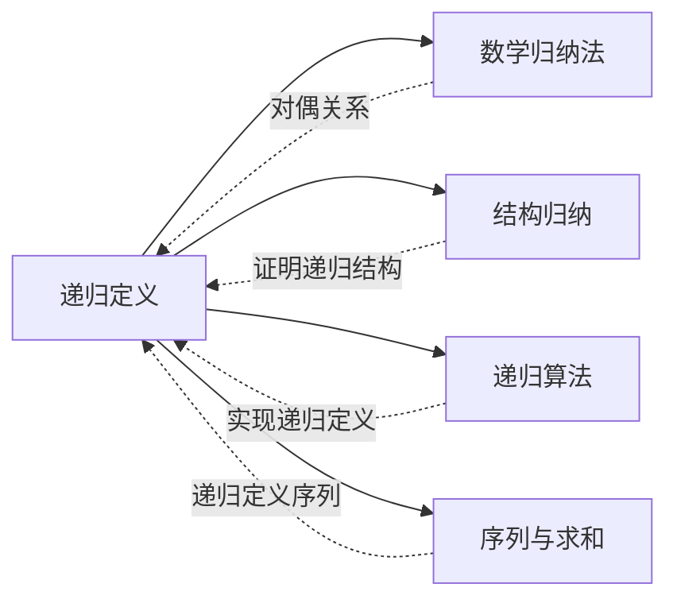

# 递归定义

> [!abstract]
> ==递归定义（Recursive Definition）==通过==基础情形（basis case）==和==递归规则（recursive rule）==来定义对象，是定义函数、集合、字符串、树等递归结构的标准方法。递归定义与数学归纳法互为对偶：归纳法用于证明，递归定义用于构造。

## 定义

> [!def] 递归定义函数
> 递归定义函数由两部分组成：
> 1. **基础情形（Basis Case）**：直接给出函数在一个或多个初始参数处的值。
> 2. **递归规则（Recursive Rule）**：用函数在较小参数处的值来表达函数在当前参数处的值。
>
> **例1：阶乘函数**
> $$f(0) = 1$$
> $$f(n) = n \cdot f(n-1), \quad n \geq 1$$
>
> **例2：斐波那契数列**
> $$F(0) = 0, \quad F(1) = 1$$
> $$F(n) = F(n-1) + F(n-2), \quad n \geq 2$$
>
> **例3：Ackermann 函数**（非原始递归函数的经典例子）
> $$A(0, y) = y + 1$$
> $$A(x, 0) = A(x-1, 1), \quad x \geq 1$$
> $$A(x, y) = A(x-1, A(x, y-1)), \quad x \geq 1, y \geq 1$$

> [!def] 递归定义集合
> 递归定义集合由三部分组成：
> 1. **基础情形（Basis Clause）**：指定某些初始元素属于该集合。
> 2. **递归规则（Recursive Clause）**：若某些元素已在集合中，则可通过规则生成新元素。
> 3. **闭包条款（Closure Clause）**：除了由基础情形和递归规则生成的元素外，集合中不包含其他元素。
>
> **例：合式公式的定义**
> 设命题变元集合为 $S$，合式公式集合 $WFF$ 定义如下：
> - **基础情形**：每个 $p \in S$ 是合式公式。
> - **递归规则**：若 $A$ 和 $B$ 是合式公式，则 $(\neg A)$、$(A \land B)$、$(A \lor B)$、$(A \to B)$、$(A \leftrightarrow B)$ 均为合式公式。
> - **闭包条款**：所有合式公式均由上述规则有限次应用生成。
>
> **例：字符串集合 $\Sigma^*$**
> 设字母表 $\Sigma$ 为有限非空集合，$\Sigma^*$ 定义如下：
> - **基础情形**：空串 $\lambda \in \Sigma^*$。
> - **递归规则**：若 $w \in \Sigma^*$ 且 $a \in \Sigma$，则 $wa \in \Sigma^*$。
> - **闭包条款**：$\Sigma^*$ 仅含由上述规则生成的串。

> [!def] 递归定义字符串
> 字符串上的运算可通过递归定义：
>
> **字符串长度**（设 $w \in \Sigma^*$）：
> $$|\lambda| = 0$$
> $$|wa| = |w| + 1, \quad a \in \Sigma$$
>
> **字符串连接**（设 $w_1, w_2 \in \Sigma^*$）：
> $$\lambda \cdot w_2 = w_2$$
> $$(w_1 a) \cdot w_2 = w_1 \cdot (a w_2) = w_1 \cdot (a) \cdot w_2, \quad a \in \Sigma$$

> [!def] 递归与归纳的对偶关系
> 递归定义与数学归纳法之间存在深刻的对偶关系：
> - **递归定义**是**构造性**的：它告诉我们如何**生成**对象。
> - **数学归纳法**是**验证性**的：它告诉我们如何**证明**关于这些对象的命题。
>
> 对偶对应关系：
> | 递归定义 | 数学归纳法 |
> | :--- | :--- |
> | 基础情形（给出初始值） | 基础步骤（验证 $P(1)$ 成立） |
> | 递归规则（从已知构造新对象） | 归纳步骤（从 $P(k)$ 推出 $P(k+1)$） |
>
> 这种对偶性意味着：**每一个良定义的递归定义都对应一个可用的归纳证明策略**，反之亦然。

## 核心性质

| 性质 | 说明 |
| :--- | :--- |
| **良定义性** | 递归定义必须保证对定义域中每个元素都有唯一确定的值；基础情形和递归规则必须覆盖所有情况且不产生矛盾 |
| **终止性** | 每次递归调用必须使参数"更小"（在良基序下严格递减），保证递归最终到达基础情形而终止 |
| **基础情形的必要性** | 缺少基础情形将导致定义不完整（如 $f(n) = n \cdot f(n-1)$ 无法确定 $f(0)$ 的值） |
| **递归深度的有限性** | 对任意输入，递归展开的层数是有限的，这是良定义性的直接推论 |
| **与归纳法的对偶性** | 递归定义用于构造对象，归纳法用于证明关于这些对象的性质，二者互为对偶 |
| **多重递归** | 递归规则中可以引用多个较小参数处的值（如斐波那契数列 $F(n) = F(n-1) + F(n-2)$） |
| **嵌套递归** | 递归调用可以嵌套在另一个递归调用的参数中（如 Ackermann 函数 $A(x,y) = A(x-1, A(x,y-1))$） |
| **原始递归 vs. 一般递归** | 原始递归函数的递归调用参数严格小于当前参数；一般递归函数允许更复杂的嵌套（如 Ackermann 函数不是原始递归的） |

## 关系网络

## 章节扩展

### 第5章 — 5.3节核心内容

递归定义是第5章"归纳与递归"的核心内容之一，出现在 Rosen 第8版 Section 5.3。本节要点包括：

1. **递归定义函数**：通过基础情形和递归规则定义函数，经典例子包括阶乘、斐波那契数列、Ackermann 函数。
2. **递归定义集合**：基础情形 + 递归规则 + 闭包条款的三段式结构，应用于合式公式、字符串集合等。
3. **递归定义字符串与字符串运算**：长度、连接、反转等运算的递归定义。
4. **递归与归纳的对偶关系**：理解递归定义（构造）与归纳法（证明）之间的深刻联系，为后续学习结构归纳奠定基础。

### 第8章：递推关系 — 8.1节内容

- **递推关系与递归定义的关系**：递推关系（recurrence relation）是递归定义在序列上的特例。递归定义函数的一般形式 $f(n) = g(f(n-1), f(n-2), \ldots, f(n-k))$ 本身就是一个递推关系。具体而言：
  - 递归定义提供了递推关系的**初始条件**（基础情形）和**递推规则**（递归规则），二者在结构上完全对应。
  - 例如，斐波那契数列的递归定义 $F(0)=0,\ F(1)=1,\ F(n)=F(n-1)+F(n-2)$ 就是一个递推关系，其中前两项是初始条件，第三项是递推公式。
  - 递推关系求解的目标是找到序列的**封闭公式**（closed formula），即不依赖前项的直接表达式。例如斐波那契数列的 Binet 公式。
  - 数学归纳法在递推关系中的角色：验证所求得的封闭公式确实满足原始递推关系和初始条件（详见[[离散数学/concepts/数学归纳法]]的8.2节扩展）。

### 第11章：树

树的结构天然适合递归定义和递归处理。一棵树的递归定义为：一棵树要么为空，要么由一个根节点和若干棵不相交的子树组成。

**树的递归遍历**：
- **前序遍历**（preorder）：访问根 → 递归遍历左子树 → 递归遍历右子树
- **中序遍历**（inorder）：递归遍历左子树 → 访问根 → 递归遍历右子树
- **后序遍历**（postorder）：递归遍历左子树 → 递归遍历右子树 → 访问根

这些遍历算法的递归结构直接反映了树的递归定义，是递归定义在实际算法中的经典应用。

### 第13章：计算建模

- **13.1 语言与文法**：字符串和语言通过递归方式定义——字母表 $\Sigma$ 上的字符串集合 $\Sigma^*$ 由基础情形（空串 $\lambda$）和递归规则（若 $w \in \Sigma^*$ 且 $a \in \Sigma$，则 $wa \in \Sigma^*$）构成。文法（grammar）本身也是一种递归定义：产生式 $S \to aSb$ 递归地生成形如 $a^nb^n$ 的字符串。
- **13.4 语言识别**：正则表达式通过递归方式定义——基础情形（$\emptyset$、$\epsilon$、单个符号）和递归规则（并、连接、Kleene 闭包 $R^*$）。

## 补充

> [!info]
> **历史与理论背景**
>
> - **Dedekind（1888）**：在《Was sind und was sollen die Zahlen?》中首次系统性地使用递归定义来建立自然数理论，证明了递归定义定理（递归定理），表明递归定义的合理性依赖于自然数的皮亚诺公理。
> - **Peano（1889）**：皮亚诺公理体系为递归定义提供了形式化的基础，其中第五条公理（归纳公理）保证了递归定义的唯一性。
> - **McCarthy 91 函数**：由 John McCarthy（1968）提出的一个著名递归函数：
>   $$M(n) = \begin{cases} n - 10 & \text{若 } n > 100 \\ M(M(n+11)) & \text{若 } n \leq 100 \end{cases}$$
>   该函数对所有 $n \leq 101$ 都返回 $91$，是一个展示嵌套递归与"反直觉"行为的经典例子。
>
> **参考来源**：Rosen, Section 5.3 — Recursive Definitions and Structural Induction

## 参见

- [[数学归纳法]]
- [[结构归纳]]
- [[递归算法]]
- [[序列与求和]]
