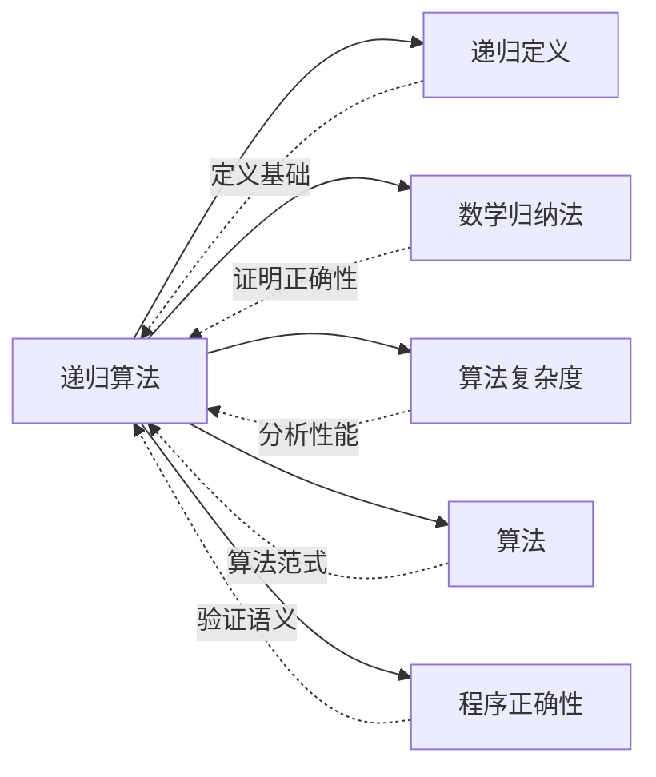

# 递归算法

> [!abstract]
> ==递归算法（Recursive Algorithm）==是通过==调用自身==来求解问题的算法。每个递归算法包含==基础情形（base case）==和==递归调用（recursive call）==两部分，其正确性通常用数学归纳法证明，复杂度通过==递推关系==分析。

## 定义

> [!def] 递归算法的结构
> 一个递归算法由两个基本部分组成：
>
> 1. **基础情形（Base Case）**：直接返回结果，不再进行递归调用。这是递归的终止条件。
> 2. **递归调用（Recursive Call）**：将问题分解为更小的子问题，调用自身来求解子问题，然后将子问题的解组合为原问题的解。
>
> 伪代码框架：
> ```
> procedure RECURSIVE(input)
>     if input 满足基础情形 then
>         return 直接计算的结果
>     else
>         result = RECURSIVE(更小的输入)
>         return 对 result 进行组合处理
> ```
>
> **关键要求**：每次递归调用必须使输入"变小"（在良基序下严格递减），保证算法最终到达基础情形。

> [!def] 递归与迭代的关系
> 递归和迭代是表达重复计算的两种等价方式：
>
> - **递归**：函数调用自身，利用系统调用栈保存中间状态。
> - **迭代**：使用循环结构，显式维护状态变量。
>
> **递归 → 迭代的转换方法**：
> 1. **尾递归优化**：若递归调用是函数的最后操作（尾位置），可直接转化为循环。
> 2. **显式栈模拟**：用自定义栈数据结构模拟系统调用栈，将递归展开为迭代。
> 3. **递推展开**：将递推关系展开为循环，如斐波那契的递归实现可转化为自底向上的迭代。
>
> **效率对比**：递归通常有额外的函数调用开销（栈帧分配与释放），但代码更简洁、更贴近问题的数学定义。迭代通常更节省空间和时间，但可读性可能较低。

> [!def] 经典递归算法
>
> **1. 阶乘（Factorial）**
> ```
> procedure FACTORIAL(n)
>     if n = 0 then return 1
>     else return n · FACTORIAL(n - 1)
> ```
> 时间复杂度：$O(n)$，空间复杂度：$O(n)$（栈深度）。
>
> **2. 斐波那契数列（Fibonacci）**
> ```
> procedure FIB(n)
>     if n = 0 then return 0
>     else if n = 1 then return 1
>     else return FIB(n-1) + FIB(n-2)
> ```
> 时间复杂度：$O(2^n)$（朴素递归，存在大量重复计算）。
> 优化：使用记忆化（memoization）可降至 $O(n)$。
>
> **3. 模幂 / 快速幂（Modular Exponentiation）**
> 计算 $a^n \bmod m$：
> ```
> procedure MOD-EXP(a, n, m)
>     if n = 0 then return 1
>     else if n 为偶数 then
>         return MOD-EXP(a, n/2, m)^2 mod m
>     else
>         return (a · MOD-EXP(a, (n-1)/2, m)^2) mod m
> ```
> 时间复杂度：$O(\log n)$，空间复杂度：$O(\log n)$。
>
> **4. 最大公因数（GCD）— 欧几里得算法**
> ```
> procedure GCD(a, b)
>     if b = 0 then return a
>     else return GCD(b, a mod b)
> ```
> 时间复杂度：$O(\log(\min(a, b)))$（由 Lamé 定理保证）。

> [!def] 归并排序的递归分析
> 归并排序（Merge Sort）是递归算法的经典应用，体现了**分治（Divide and Conquer）**策略：
>
> ```
> procedure MERGE-SORT(A, p, r)
>     if p < r then
>         q = ⌊(p + r) / 2⌋
>         MERGE-SORT(A, p, q)       // 递归排序左半部分
>         MERGE-SORT(A, q+1, r)     // 递归排序右半部分
>         MERGE(A, p, q, r)         // 合并两个有序子数组
> ```
>
> **递推关系建立**：
> 设 $T(n)$ 为对 $n$ 个元素进行归并排序的比较次数：
> $$T(n) = 2T\left(\frac{n}{2}\right) + n, \quad T(1) = 0$$
>
> 其中 $2T(n/2)$ 是两次递归调用的代价，$n$ 是合并步骤的代价。
>
> **递推关系求解**（代入法 / 主定理）：
> - $T(n) = 2T(n/2) + n$
> - 展开第一层：$T(n) = 2[2T(n/4) + n/2] + n = 4T(n/4) + 2n$
> - 展开第 $k$ 层：$T(n) = 2^k T(n/2^k) + kn$
> - 当 $n/2^k = 1$，即 $k = \log_2 n$ 时：$T(n) = n \cdot T(1) + n \log_2 n = n \log_2 n$
>
> 因此归并排序的时间复杂度为 $O(n \log n)$，空间复杂度为 $O(n)$。

> [!def] 递推关系与复杂度分析
> 递归算法的复杂度分析通常通过建立**递推关系（Recurrence Relation）**来完成：
>
> **常见递推关系模式**：
>
> | 模式 | 递推关系 | 解 | 典型算法 |
> | :--- | :--- | :--- | :--- |
> | 线性递减 | $T(n) = T(n-1) + O(1)$ | $O(n)$ | 阶乘、线性搜索 |
> | 二分递减 | $T(n) = T(n/2) + O(1)$ | $O(\log n)$ | 二分搜索、快速幂 |
> | 分治（等分） | $T(n) = aT(n/b) + f(n)$ | 由主定理确定 | 归并排序、快速排序 |
> | 二路递归 | $T(n) = T(n-1) + T(n-2)$ | $O(\phi^n)$ | 朴素斐波那契 |
>
> **主定理（Master Theorem）**：对 $T(n) = aT(n/b) + f(n)$（$a \geq 1, b > 1$）：
> - 若 $f(n) = O(n^{\log_b a - \epsilon})$，则 $T(n) = \Theta(n^{\log_b a})$
> - 若 $f(n) = \Theta(n^{\log_b a})$，则 $T(n) = \Theta(n^{\log_b a} \log n)$
> - 若 $f(n) = \Omega(n^{\log_b a + \epsilon})$，则 $T(n) = \Theta(f(n))$

## 核心性质

| 性质 | 说明 |
| :--- | :--- |
| **自引用性** | 递归算法通过调用自身来求解子问题，代码结构直接反映问题的递归定义 |
| **基础情形的必要性** | 没有基础情形的递归将导致无限递归（栈溢出），基础情形是算法终止的唯一保障 |
| **正确性由归纳法保证** | 递归算法的正确性证明天然对应数学归纳法：基础情形对应归纳基础，递归调用对应归纳步骤 |
| **分治策略** | 许多递归算法采用分治策略——将问题分解为若干独立子问题、递归求解、合并结果（如归并排序） |
| **重复计算问题** | 朴素递归可能产生大量重复计算（如斐波那契的 $O(2^n)$ 复杂度），可通过记忆化或动态规划消除 |
| **栈空间开销** | 递归深度决定调用栈的大小，最坏情况下空间复杂度等于递归深度 $O(d)$，其中 $d$ 为最大递归深度 |
| **尾递归优化** | 若递归调用处于尾位置（函数的最后操作），编译器可将其优化为迭代，使空间复杂度降至 $O(1)$ |
| **递推关系建模** | 递归算法的运行时间可精确建模为递推关系，通过主定理、代入法、递推树等方法求解 |

## 关系网络



## 章节扩展

### 第5章 — 5.4节核心内容

递归算法是第5章"归纳与递归"中从理论到实践的关键环节，出现在 Rosen 第8版 Section 5.4。本节要点包括：

1. **递归算法的基本结构**：基础情形与递归调用的设计原则。
2. **经典递归算法**：阶乘、斐波那契、模幂（快速幂）、欧几里得 GCD 算法。
3. **递归与迭代的关系**：理解两种范式的等价性与转换方法。
4. **归并排序的递归分析**：通过递推关系分析分治算法的复杂度。
5. **递推关系与复杂度**：建立递推关系模型并运用主定理等工具求解。

### 第11章：树

树是递归算法最自然的应用领域之一。树的结构天然适合递归处理——每棵子树本身也是一棵树。

**树的递归遍历**：
- 前序遍历、中序遍历、后序遍历都是递归算法的直接应用
- 中序遍历 BST 产生有序序列，时间复杂度 $O(n)$

**BST 操作的递归实现**：
- 查找：与根比较 → 递归搜索子树 → 基准情况为空树
- 插入：递归找到位置 → 创建节点
- 删除：三种情况（叶/单子树/双子树）均用递归处理

**DFS 生成树**：
深度优先搜索（DFS）从起始顶点出发，递归探索未访问的邻居。DFS 产生的==DFS 树==（或 DFS 森林）揭示了图的层次结构，是判断割点和桥（割边）的基础。

### 第13章：计算建模

- **13.1 语言与文法**：文法的派生过程（derivation）本质上是一种递归算法——从起始符号出发，反复应用产生式规则进行替换，直到生成终结符串。自顶向下的语法分析（如递归下降解析器）直接将文法规则编码为递归函数调用，每个非终结符对应一个递归过程。

## 补充

> [!info]
> **历史与理论背景**
>
> - **John McCarthy（1958）**：在 Lisp 语言中首次将递归作为基本的程序构造手段，Lisp 的名称即来源于 "LISt Processing"，其核心数据结构（列表）和操作（car, cdr, cons）天然适合递归处理。McCarthy 同时提出了递归函数理论（递归函数论）。
> - **John von Neumann**：虽然 von Neumann 架构本身是迭代式的（冯·诺依曼机器的指令顺序执行），但递归算法的实现依赖于调用栈机制，这一机制在 von Neumann 架构上通过系统栈实现。
> - **分治策略的历史**：分治思想可追溯至古代（如 Karatsuba 1960 年的快速乘法算法），但作为系统性的算法设计范式，由 Knuth、Aho、Hopcroft、Ullman 等人在 1970 年代形式化。归并排序由 von Neumann 于 1945 年首次描述。
> - **主定理**：由 Bentley、Haken 和 Saxe 于 1980 年形式化，为分治递推关系提供了统一的求解框架，是算法分析中最常用的工具之一。
>
> **参考来源**：Rosen, Section 5.4 — Recursive Algorithms

## 参见

- [[递归定义]]
- [[数学归纳法]]
- [[算法复杂度]]
- [[算法]]
- [[程序正确性]]
