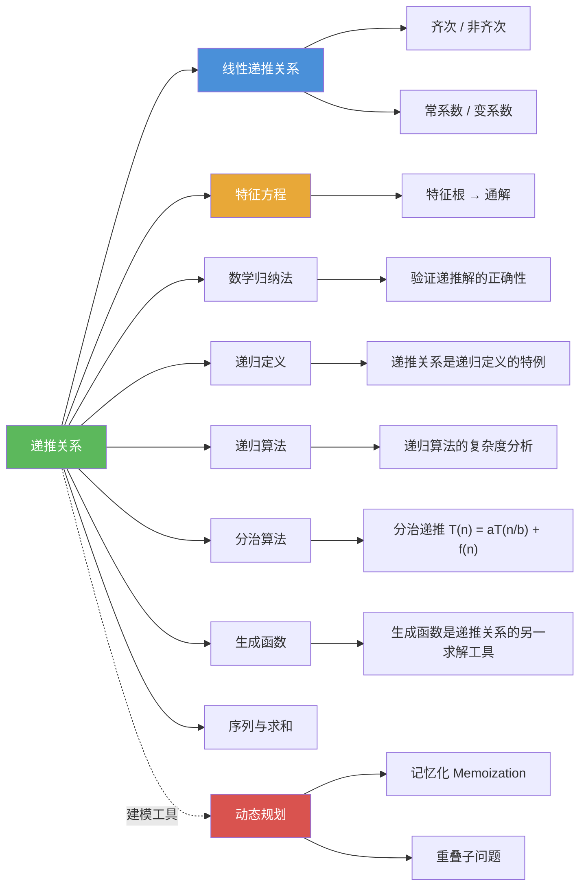

# 递推关系

> [!abstract] 概述
> ==递推关系（Recurrence Relation）==是将序列 $\{a_n\}$ 的第 $n$ 项表示为前面若干项的函数的等式，配合==初始条件==唯一确定整个序列。递推关系通过==将问题分解为规模更小的子问题==来建立数学模型，是解决许多基本计数技术难以直接处理的计数问题的强大工具，也是==动态规划==算法的理论基础。

## 定义

> [!def] 递推关系（Recurrence Relation）
>
> 一个==递推关系==是将序列 $\{a_n\}$ 的第 $n$ 项表示为前面若干项的函数的等式。如果一个序列的项满足某个递推关系，则称该序列为该递推关系的一个==解==（solution）。
>
> 一般形式为：
> $$a_n = f(a_{n-1}, a_{n-2}, \ldots, a_{n-k}, n)$$
>
> 其中 $k$ 称为递推关系的==阶==（degree）。要唯一确定一个序列，除了递推关系外，还需要 $k$ 个==初始条件==（initial conditions）：
> $$a_0 = C_0, \quad a_1 = C_1, \quad \ldots, \quad a_{k-1} = C_{k-1}$$
>
> 递推关系是[[离散数学/concepts/递归定义|第5章递归定义]]的自然延伸——递归定义是更一般的概念，递推关系是递归定义的一种特殊形式，专门用于定义序列。第二数学归纳原理保证了递推关系加上初始条件能唯一确定一个序列。

> [!def] 初始条件（Initial Conditions）
>
> ==初始条件==是递推关系所需的起始值，用于唯一确定序列。阶为 $k$ 的递推关系需要恰好 $k$ 个初始条件。不同的初始条件会导致完全不同的解，即使递推关系相同。

> [!def] 动态规划（Dynamic Programming）
>
> ==动态规划==是一种算法范式，通过==将问题递归地分解为更简单的重叠子问题==，并利用子问题的解来构造原问题的解。递推关系通常用于从子问题的解推导出整体解。
>
> 关键技术——==记忆化（memoization）==：在计算过程中==存储每个子问题的解==，避免重复计算，将指数级复杂度降低为多项式级。

## 核心性质

| 性质 | 描述 | 说明 |
|------|------|------|
| ==阶（degree）== | 递推关系中 $a_n$ 依赖的最远前项距离 | 阶为 $k$ 的递推关系需要 $k$ 个初始条件 |
| ==初始条件的必要性== | 仅有递推关系不能唯一确定序列 | 同一递推关系 + 不同初始条件 = 不同序列 |
| ==解的唯一性== | 递推关系 + 足够初始条件唯一确定序列 | 由第二数学归纳原理保证 |
| ==与归纳法的天然联系== | 递推关系提供归纳步，初始条件提供基础步 | 求出显式公式后常用归纳法严格证明 |
| ==建模核心：递归结构== | 将第 $n$ 步的解分解为互不重叠的若干情况 | 必须确保分类不重不漏 |
| ==动态规划基础== | 递推关系 + 记忆化 = 动态规划 | 将重叠子问题的指数级复杂度降为多项式级 |
| ==求解方法多样== | 迭代法、特征方程法、生成函数法等 | 8.2节系统介绍特征方程法 |

## 关系网络

- [[离散数学/concepts/线性递推关系]] 是递推关系中最重要的一类，可用特征方程法系统求解
- [[离散数学/concepts/特征方程]] 将线性齐次递推关系转化为代数方程，是求解的核心工具
- [[离散数学/concepts/数学归纳法]] 用于验证递推关系求得的显式公式的正确性
- [[离散数学/concepts/递归定义]] 是更一般的概念，递推关系是其在序列上的特化
- [[离散数学/concepts/递归算法]] 的正确性和时间复杂度分析依赖递推关系
- [[离散数学/concepts/分治算法]] 的复杂度分析产生特殊形式的递推关系 $T(n) = aT(n/b) + f(n)$
- [[离散数学/concepts/生成函数]] 是求解递推关系的另一强大工具（8.4节）
- [[离散数学/concepts/序列与求和]] 是递推关系的研究对象

## 章节扩展

### 第5章：归纳与递归 — 递归定义的自然延伸

递推关系是第5章递归定义在序列上的自然延伸。递归定义（5.3节）可以定义集合、字符串、树等结构，而递推关系专门用于定义序列。递归定义的基础情形对应初始条件，递归规则对应递推关系。递推关系与数学归纳法（5.1节）一体两面：递推关系提供归纳步，初始条件提供基础步。

### 第8章：高级计数技术 — 8.1节核心内容

递推关系是8.1节的核心主题。经典实例包括：

- **斐波那契数列**：$f_n = f_{n-1} + f_{n-2}$，初始条件 $f_1 = 1, f_2 = 1$。源于兔子繁殖问题，在自然界中广泛出现（花瓣数、松果螺旋、向日葵种子排列等）。
- **汉诺塔**：$H_n = 2H_{n-1} + 1$，初始条件 $H_1 = 1$。显式解 $H_n = 2^n - 1$。传说中64个金盘需要 $2^{64}-1$ 步，超过5000亿年。
- **位串计数**：不含两个连续0的长度为 $n$ 的位串数 $a_n = a_{n-1} + a_{n-2}$，与斐波那契数列满足相同递推关系。
- **有效码字**：含偶数个0的 $n$ 位十进制串数 $a_n = 8a_{n-1} + 10^{n-1}$，这是一个非齐次递推关系。
- **Catalan 数列**：$C_n = \sum_{k=0}^{n-1} C_k C_{n-k-1}$，初始条件 $C_0 = 1, C_1 = 1$。闭式公式 $C_n = \frac{1}{n+1}\binom{2n}{n}$。

### 第8章：高级计数技术 — 动态规划

动态规划是递推关系在算法领域的直接应用。以讲座调度问题为例：设 $T(j)$ 为前 $j$ 个讲座的最优调度方案的最大总参加人数，则 $T(j) = \max(w_j + T(p(j)),\; T(j-1))$，其中 $p(j)$ 是与讲座 $j$ 兼容的最近讲座。通过记忆化存储中间结果，算法复杂度为 $O(n^2)$。

## 补充

> [!info] 建立递推关系的常见策略
>
> 建立递推关系的关键是找到问题的递归结构，常用策略包括：
> 1. **分类讨论法**：将第 $n$ 步的所有可能情况按某种标准分类（如按最后一个元素分类），分别计算各类的数量后求和
> 2. **分解法**：将问题分解为若干独立的子问题，利用乘法原理
> 3. **增删法**：考虑从长度为 $n-1$ 的解如何构造长度为 $n$ 的解（如追加元素、插入元素等）
> 4. **逆向分析法**：从最终状态倒推，分析最后一步操作的可能情况
>
> 注意：必须确保分类不重不漏，且每类的计数可以表示为前面项的函数。

> [!info] 递推关系与数学归纳法的天然联系
>
> 递推关系和数学归纳法是一体两面：
> - 递推关系提供了归纳步骤：$a_n$ 如何从 $a_{n-1}$ 等前项得到
> - 初始条件提供了基础步骤：$a_0, a_1, \ldots$ 的值
> - 用迭代法求出显式公式后，通常需要用数学归纳法来严格证明公式的正确性
>
> 例如，汉诺塔的公式 $H_n = 2^n - 1$ 可以通过数学归纳法验证：
> - 基础：$H_1 = 1 = 2^1 - 1$ 成立
> - 归纳：假设 $H_k = 2^k - 1$，则 $H_{k+1} = 2H_k + 1 = 2(2^k - 1) + 1 = 2^{k+1} - 1$ 成立

> [!info] 动态规划的命名趣闻
>
> Richard Bellman 在1950年代于 RAND 公司为美国军方项目工作时发明了"动态规划"一词。当时美国国防部长对数学研究持敌对态度，Bellman 认为需要一个不含"数学"一词的名字来确保经费。他选择了"dynamic"（动态的），因为他认为"没有人会对动态这个词有负面看法"，而"动态规划"是"连国会议员都无法反对的东西"。

## 参见

- [[离散数学/concepts/特征方程]] — 线性齐次递推关系的代数求解工具
- [[离散数学/concepts/线性递推关系]] — 线性齐次与非齐次递推关系的系统理论
- [[离散数学/concepts/数学归纳法]] — 验证递推解的正确性
- [[离散数学/concepts/递归定义]] — 递推关系是递归定义在序列上的特化
- [[离散数学/concepts/递归算法]] — 递归算法的复杂度分析依赖递推关系
- [[离散数学/concepts/分治算法]] — 分治递推关系 $T(n) = aT(n/b) + f(n)$
- [[离散数学/concepts/生成函数]] — 求解递推关系的另一强大工具
- [[离散数学/concepts/序列与求和]] — 递推关系的研究对象
