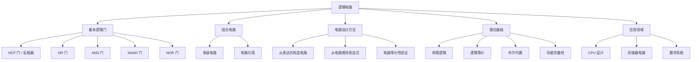

# 逻辑电路

> [!abstract] 概述
> ==逻辑电路==（logic circuit）是使用逻辑门实现布尔函数的电子电路，是命题逻辑在计算机硬件中的直接物理映射。三种基本逻辑门——==NOT 门==（反相器）、==OR 门==和 ==AND 门==——分别对应否定 $\neg$、析取 $\lor$ 和合取 $\land$ 三种逻辑运算。通过组合基本逻辑门可以构建==组合电路==（combinatorial circuit），每个命题逻辑表达式都对应一个逻辑电路，反之亦然，电路化简对应逻辑表达式化简。

## 定义

> [!def] 逻辑门与逻辑电路
>
> **逻辑门**（logic gate）是实现基本逻辑运算的电子元件。三种基本逻辑门：
>
> | 逻辑门 | 输入 | 输出 | 对应逻辑运算 | 布尔表达式 |
> |:-------|:-----|:-----|:-------------|:-----------|
> | ==反相器（Inverter）/ NOT 门== | $p$ | $\neg p$ | 否定 | $\bar{p}$ |
> | ==OR 门== | $p, q$ | $p \lor q$ | 析取 | $p + q$ |
> | ==AND 门== | $p, q$ | $p \land q$ | 合取 | $p \cdot q$ |
>
> **组合电路**（combinatorial circuit）是由逻辑门通过导线连接而成的电路，每个门的输出连接到另一个门的输入，最终产生一个或多个输出。组合电路没有反馈回路，输出仅取决于当前输入。

## 核心性质

| 性质 | 描述 | 说明 |
|:-----|:-----|:-----|
| 逻辑-电路对应 | 每个命题逻辑表达式 $\leftrightarrow$ 一个逻辑电路 | 双向对应关系 |
| NOT 门 | 输入 $p$，输出 $\neg p$ | 单输入单输出 |
| OR 门 | 输入 $p, q$，输出 $p \lor q$ | 多输入（可扩展为 $n$ 输入） |
| AND 门 | 输入 $p, q$，输出 $p \land q$ | 多输入（可扩展为 $n$ 输入） |
| 电路化简 | 利用逻辑等价律化简表达式 $\to$ 减少门的数量 | 降低硬件成本 |
| NAND/NOR 功能完备 | NAND 或 NOR 单独可实现所有逻辑功能 | 只需一种门即可构建任意电路 |

**从逻辑表达式构造电路的步骤**：

1. 识别表达式中的子表达式
2. 从内层运算开始，逐层构造逻辑门
3. 将子电路的输出连接到外层逻辑门的输入

**从电路推导逻辑表达式的步骤**：

1. 从输入端开始，逐级标注每个门的输出
2. 将每个门的输出写成输入的逻辑表达式
3. 最终输出即为整个电路的逻辑表达式

## 关系网络

- **前置知识**：[[命题逻辑]]（逻辑联结词的语义）、[[逻辑等价]]（表达式化简与等价变换）
- **核心关联**：功能完备性（NAND/NOR 单独构建任意电路）
- **应用延伸**：布尔代数（第12章）、数字电路设计、计算机组成原理

## 章节扩展

### 第1章：逻辑与证明基础

逻辑电路是第1章第1.2节（命题逻辑的应用）的重要内容，展示了命题逻辑在计算机硬件设计中的直接应用。

**分析组合电路示例**：

给定电路：输入 $p, q, r$，输出 $(p \land \neg q) \lor \neg r$。

电路结构分解：
1. NOT 门：$q \to \neg q$
2. AND 门：$p, \neg q \to p \land \neg q$
3. NOT 门：$r \to \neg r$
4. OR 门：$(p \land \neg q), \neg r \to (p \land \neg q) \lor \neg r$

**根据逻辑表达式构造电路示例**：

构造输出为 $(p \lor \neg r) \land (\neg p \lor (q \lor \neg r))$ 的电路：

1. 构造子电路 $(p \lor \neg r)$：NOT 门（$r \to \neg r$）+ OR 门（$p, \neg r \to p \lor \neg r$）
2. 构造子电路 $(\neg p \lor (q \lor \neg r))$：NOT 门（$p \to \neg p$）+ OR 门（$q, \neg r \to q \lor \neg r$）+ OR 门（$\neg p, (q \lor \neg r) \to \neg p \lor (q \lor \neg r)$）
3. AND 门：组合两个子电路的输出

**电路化简与逻辑等价**：

利用逻辑等价律（如德摩根定律、吸收律、分配律等）化简逻辑表达式，可以减少电路中逻辑门的数量，从而降低硬件成本、提高运算速度。这与 [[逻辑等价]] 中的等价律直接对应。

### 第12章：布尔代数

第12章系统地将==逻辑电路==建立在布尔代数的数学基础之上。每个逻辑门实现一个布尔运算：NOT 门实现 $\bar{x}$，AND 门实现 $x \cdot y$，OR 门实现 $x + y$。NAND 门和 NOR 门各自功能完备——仅用一种门就可以实现任意布尔函数。

==组合电路==是由多个逻辑门组成的电路，其输出完全由当前输入决定（无记忆）。第12章以半加器和全加器为例，展示了如何从布尔表达式设计组合电路：
- 半加器：$s = x \oplus y$，$c = xy$
- 全加器：$s = x \oplus y \oplus c_{in}$，$c_{out} = xy + xc_{in} + yc_{in}$

==电路最小化==（12.4节）通过卡诺图或 Quine-McCluskey 方法化简布尔表达式，从而减少所需的逻辑门数量，降低电路成本。

## 补充

> [!info] 学术参考
>
> - **Rosen, K. H.** *Discrete Mathematics and Its Applications*, 8th ed., McGraw-Hill, Section 1.2.
>   URL: https://www.mheducation.com/highered/product/discrete-mathematics-applications-rosen/M9781259676512.html
> - **Shannon, C. E.** (1938). "A Symbolic Analysis of Relay and Switching Circuits." *Transactions of the American Institute of Electrical Engineers*, 57(12): 713-723（布尔代数与数字电路设计的奠基性论文）。
>   URL: https://doi.org/10.1109/T-AIEE.1938.5057767
> - **Wakerly, J. F.** *Digital Design: Principles and Practices*, 5th ed., Pearson（数字电路设计的经典教材）。

## 参见

- [[命题逻辑]] — 逻辑联结词的语义基础
- [[逻辑等价]] — 表达式化简与电路优化的理论基础
