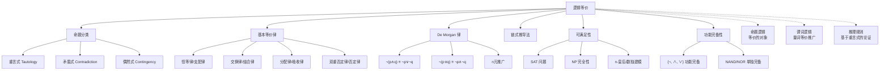

# 逻辑等价

> [!abstract] 概述
> ==逻辑等价（logical equivalence）== 指两个复合命题在所有可能的真值赋值下具有相同的真值，记为 $p \equiv q$。它是命题逻辑的"代数"核心，通过建立一套系统的==逻辑恒等式==（恒等律、支配律、幂等律、双重否定律、交换律、结合律、分配律、==De Morgan 律==、吸收律、否定律），我们可以在不构造真值表的情况下化简和变换逻辑表达式。逻辑等价还与==可满足性==（satisfiability）问题密切相关，后者是理论计算机科学中 NP 完全性的核心问题。

## 定义

> [!def] 逻辑等价
>
> 两个复合命题 $p$ 和 $q$ 称为==逻辑等价==的，如果 $p \leftrightarrow q$ 是一个==重言式==（tautology）。记为 $p \equiv q$。
>
> **命题的三种分类：**
>
> | 类型 | 定义 | 符号 | 示例 |
> |:----:|:-----|:----:|:-----|
> | 重言式（tautology） | 所有赋值下均为真 | 恒等于 $T$ | $p \lor \neg p$（排中律） |
> | 矛盾式（contradiction） | 所有赋值下均为假 | 恒等于 $F$ | $p \land \neg p$（矛盾律） |
> | 偶然式（contingency） | 既非重言式也非矛盾式 | — | $p \lor q$ |
>
> **可满足性：** 一个复合命题称为==可满足的==（satisfiable），如果存在至少一组赋值使其为真。矛盾式不可满足，重言式和偶然式可满足。
>
> **注意：** $\equiv$ 不是逻辑联结词，$p \equiv q$ 是关于两个命题的==元陈述==（meta-statement），而非命题本身。

## 核心性质

### 基本等价律

| 等价律 | 公式 |
|:------:|:-----|
| ==恒等律==（Identity） | $p \land T \equiv p$；$p \lor F \equiv p$ |
| ==支配律==（Domination） | $p \lor T \equiv T$；$p \land F \equiv F$ |
| ==幂等律==（Idempotent） | $p \lor p \equiv p$；$p \land p \equiv p$ |
| ==双重否定律==（Double Negation） | $\neg(\neg p) \equiv p$ |
| ==交换律==（Commutative） | $p \lor q \equiv q \lor p$；$p \land q \equiv q \land p$ |
| ==结合律==（Associative） | $(p \lor q) \lor r \equiv p \lor (q \lor r)$；$(p \land q) \land r \equiv p \land (q \land r)$ |
| ==分配律==（Distributive） | $p \lor (q \land r) \equiv (p \lor q) \land (p \lor r)$；$p \land (q \lor r) \equiv (p \land q) \lor (p \land r)$ |
| ==De Morgan 律== | $\neg(p \land q) \equiv \neg p \lor \neg q$；$\neg(p \lor q) \equiv \neg p \land \neg q$ |
| ==吸收律==（Absorption） | $p \lor (p \land q) \equiv p$；$p \land (p \lor q) \equiv p$ |
| ==否定律==（Negation） | $p \lor \neg p \equiv T$；$p \land \neg p \equiv F$ |

### 条件语句等价律

| 等价关系 | 名称 |
|:--------:|:----:|
| $p \to q \equiv \neg p \lor q$ | 条件-析取等价 |
| $p \to q \equiv \neg q \to \neg p$ | 逆否等价 |
| $\neg(p \to q) \equiv p \land \neg q$ | 条件的否定 |
| $p \lor q \equiv \neg p \to q$ | 析取-条件等价 |
| $p \land q \equiv \neg(p \to \neg q)$ | 合取-条件等价 |

### De Morgan 律的推广

对 $n$ 个命题 $p_1, p_2, \ldots, p_n$：

$$\neg\left(\bigvee_{j=1}^{n} p_j\right) \equiv \bigwedge_{j=1}^{n} \neg p_j \qquad \neg\left(\bigwedge_{j=1}^{n} p_j\right) \equiv \bigvee_{j=1}^{n} \neg p_j$$

### 链式推导法

当真值表过大时，可利用已知等价律通过逐步替换证明新的等价关系。每一步必须标注所使用的等价律。

**示例**：证明 $\neg(p \to q) \equiv p \land \neg q$

$$\neg(p \to q) \equiv \neg(\neg p \lor q) \equiv \neg(\neg p) \land \neg q \equiv p \land \neg q$$

## 关系网络

- **基础层**：[[命题逻辑]] 中的复合命题是逻辑等价的研究对象
- **扩展层**：[[谓词逻辑]] 中的量词 De Morgan 律是命题逻辑 De Morgan 律的自然推广
- **应用层**：[[推理规则]] 中的每条有效规则都对应一个重言式

## 章节扩展

### 第1章：逻辑与证明基础

逻辑等价是第1章的"代数"部分（Rosen 第8版 1.3 节）：

- **命题分类**：重言式（永远为真）、矛盾式（永远为假）、偶然式（有时真有时假）
- **等价判定**：$p \equiv q$ 当且仅当 $p \leftrightarrow q$ 是重言式，可通过真值表验证
- **基本等价律表**：10 组基本等价律 + 条件语句等价律 + 双条件语句等价律
- **De Morgan 律**：否定运算与合取/析取运算的对偶关系，可推广到 $n$ 个命题
- **链式推导法**：利用已知等价律逐步替换，避免构造庞大真值表
- **可满足性**：SAT 问题是判断是否存在使复合命题为真的赋值，是 NP 完全问题
- **功能完备性**：$\{\neg, \land\}$、$\{\neg, \lor\}$、NAND、NOR 各自功能完备

### 第12章：布尔代数

命题逻辑中的==逻辑等价==在布尔代数中对应==布尔恒等式==。第12章的12条核心布尔恒等式（同一律、支配律、交换律、结合律、分配律、补律、德摩根律、对合律、零元律、幺元律、幂等律、吸收律）与第1章的逻辑等价式一一对应。

布尔代数的==对偶性原理==也源于逻辑等价的对偶性：如果将布尔恒等式中的 $+$ 和 $\cdot$ 互换、$0$ 和 $1$ 互换，得到的新恒等式仍然成立。这与命题逻辑中 $\vee$ 和 $\wedge$ 的对偶性完全一致。

功能完备性定理（$\{\cdot,+,\bar{}\}$ 可以表示所有布尔函数）对应命题逻辑中 $\{\wedge,\vee,\neg\}$ 可以表示所有命题形式。

## 补充

> [!info] 学术背景与计算复杂性
>
> 可满足性问题（SAT）是理论计算机科学的**核心问题**。1971 年，Stephen Cook 证明了 SAT 是第一个被确认为 **NP 完全**的问题（Cook-Levin 定理）：SAT 本身是 NP 问题（给定赋值可在多项式时间内验证），且所有 NP 问题都可以在多项式时间内归约为 SAT。尽管 SAT 是 NP 完全的，现代 SAT 求解器（基于 DPLL 算法和 CDCL——Conflict-Driven Clause Learning 技术）在实际应用中表现出惊人效率，能处理包含数百万变量的工业级实例，广泛应用于硬件验证、软件测试和人工智能规划。
>
> 逻辑等价律与布尔代数恒等式在数学结构上完全对应，两者都是特殊的**布尔格**（Boolean lattice）的实例。英国数学家 **Augustus De Morgan**（1806-1871）在 1847 年出版的《Formal Logic》中发明的记法帮助证明了以他命名的 De Morgan 律。
>
> **来源**：
> - Cook, S. A. (1971). "The Complexity of Theorem Proving Procedures." *Proceedings of the 3rd ACM STOC*, 151-158. https://doi.org/10.1145/800157.805047
> - De Morgan, A. (1847). *Formal Logic: or, The Calculus of Inference, Necessary and Probable*. Taylor and Walton. https://archive.org/details/formallogicorcal00demorich

## 参见

- [[命题逻辑]] — 逻辑等价的研究对象
- [[谓词逻辑]] — 量词的 De Morgan 律与分配律
- [[逻辑学/concepts/逻辑等价]] — 逻辑等价的概念（逻辑学知识库）
- [[逻辑学/concepts/真值函项性]] — 真值函项性与逻辑等价的关系
- [[逻辑学/concepts/重言式与矛盾式]] — 重言式与矛盾式的详细讨论
