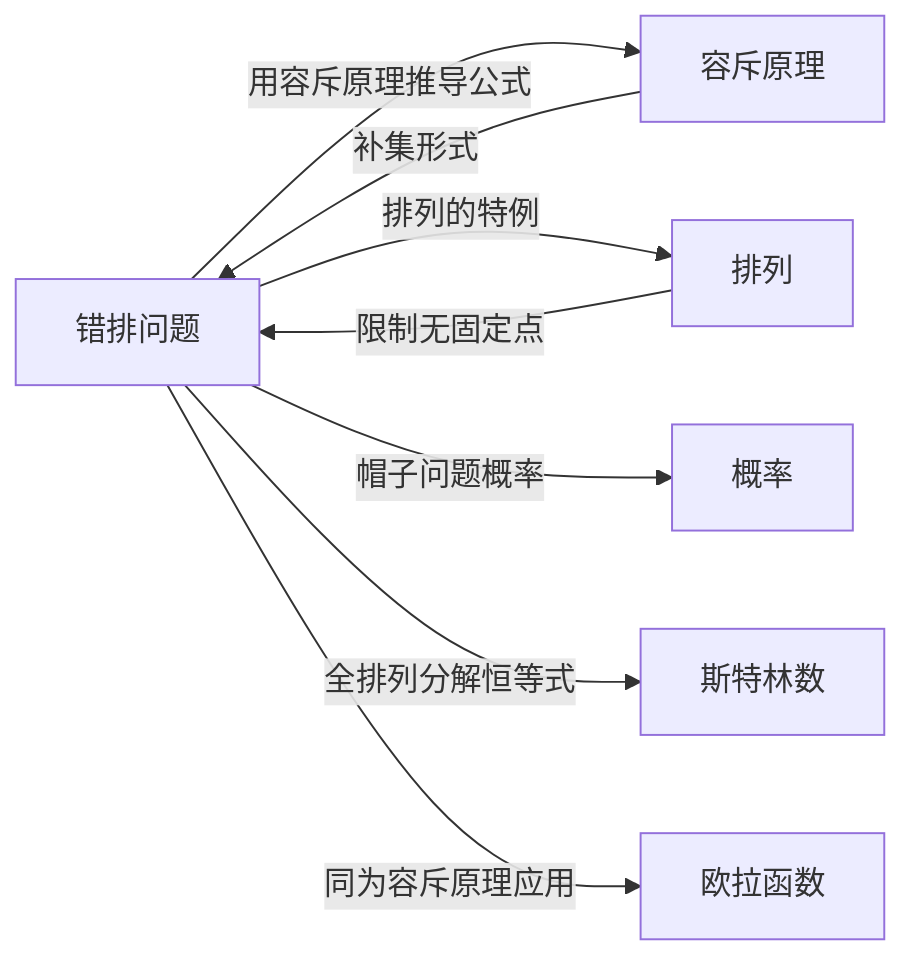

# 错排问题

> [!abstract]
> ==错排（Derangement）==是 $\{1, 2, \ldots, n\}$ 的一种[[排列]]，其中**没有任何元素留在其原始位置**上。错排数 $D_n$ 可由[[离散数学/concepts/容斥原理|容斥原理]]的补集形式推导出闭式公式，且当 $n \to \infty$ 时，错排概率 $\frac{D_n}{n!}$ 趋近于 $\frac{1}{e} \approx 0.368$。

## 定义

> [!def] 错排（Derangement）
> 设 $S = \{1, 2, \ldots, n\}$，$S$ 的一个**错排**是 $S$ 的一种排列 $\pi$，使得对所有 $i \in \{1, 2, \ldots, n\}$，都有 $\pi(i) \neq i$。用 $D_n$ 表示 $n$ 个元素的错排数。
>
> **示例**：排列 $21453$ 是 $12345$ 的错排（没有数字在原位），但 $21543$ 不是（4留在原位）。
>
> 小规模值：$D_1 = 0$，$D_2 = 1$（排列 $21$），$D_3 = 2$（排列 $231$ 和 $312$）。

> [!def] 错排公式（Theorem 2）
> $n$ 个元素的错排数为
> $$D_n = n!\left[1 - \frac{1}{1!} + \frac{1}{2!} - \frac{1}{3!} + \cdots + \frac{(-1)^n}{n!}\right]$$

> [!def] 错排的递推关系
> 错排数 $D_n$ 满足递推关系：
> $$D_n = (n-1)(D_{n-1} + D_{n-2}), \quad n \geq 2$$
> 初始条件：$D_0 = 1$，$D_1 = 0$。
>
> 另一递推形式：$D_n = nD_{n-1} + (-1)^n, \quad n \geq 1$。

## 核心性质

| 编号 | 性质 | 公式 / 说明 |
|:---:|------|------|
| P1 | **闭式公式** | $D_n = n!\displaystyle\sum_{k=0}^{n}\frac{(-1)^k}{k!}$ |
| P2 | **递推关系** | $D_n = (n-1)(D_{n-1} + D_{n-2})$，初始 $D_0=1, D_1=0$ |
| P3 | **概率极限** | $\displaystyle\lim_{n\to\infty}\frac{D_n}{n!} = \frac{1}{e} \approx 0.368$ |
| P4 | **误差估计** | $\left|\frac{D_n}{n!} - \frac{1}{e}\right| < \frac{1}{(n+1)!}$（交错级数余项估计） |
| P5 | **全排列分解** | $n! = \displaystyle\sum_{k=0}^{n}\binom{n}{k}D_{n-k}$（按恰好固定 $k$ 个元素分类） |
| P6 | **恰好 $k$ 个固定** | 恰好 $k$ 个元素在原位的排列数为 $\binom{n}{k}D_{n-k}$ |
| P7 | **至少一个固定** | 至少一个元素在原位的排列数为 $n! - D_n$ |

## 关系网络

## 章节扩展

- **容斥原理**：错排公式是[[离散数学/concepts/容斥原理|容斥原理]]补集形式的经典应用，性质 $P_i$ 定义为"排列固定了元素 $i$"
- **排列**：错排是[[离散数学/concepts/排列|排列]]的一个特殊子类，要求所有元素都不在原位
- **概率论**：帽子检查问题中，无人拿到自己帽子的概率为 $D_n/n!$，当 $n$ 较大时接近 $1/e$
- **组合恒等式**：全排列的错排分解 $n! = \sum_{k=0}^{n}\binom{n}{k}D_{n-k}$ 将排列计数与错排计数联系起来
- **第二类 Stirling 数**：错排与[[离散数学/concepts/斯特林数|Stirling 数]]同为容斥原理的重要应用对象

## 补充

> [!info] 容斥原理证明错排公式
> 设性质 $P_i$ 为"排列固定了元素 $i$"（$i = 1, 2, \ldots, n$）。错排数就是不具有任何性质 $P_i$ 的排列数：
> $$D_n = N(\overline{P_1}\,\overline{P_2} \cdots \overline{P_n})$$
> 由容斥原理的补集形式：
> $$D_n = N - \sum_i N(P_i) + \sum_{i<j} N(P_i P_j) - \cdots + (-1)^n N(P_1 P_2 \cdots P_n)$$
> 逐项计算：
> - $N = n!$（总排列数）
> - $N(P_i) = (n-1)!$（固定第 $i$ 个位置），共 $\binom{n}{1}$ 项
> - $N(P_i P_j) = (n-2)!$（固定第 $i$ 和第 $j$ 个位置），共 $\binom{n}{2}$ 项
> - 一般地，$N(P_{i_1} \cdots P_{i_m}) = (n-m)!$，共 $\binom{n}{m}$ 项
> 利用 $\binom{n}{m}(n-m)! = \frac{n!}{m!}$，化简得：
> $$D_n = n!\left[1 - \frac{1}{1!} + \frac{1}{2!} - \cdots + \frac{(-1)^n}{n!}\right]$$

> [!info] 帽子检查问题（Hatcheck Problem）
> 一位新员工负责检查餐厅顾客的帽子，但忘记在帽子上做标记。当顾客取回帽子时，检查员从剩余帽子中随机分配。问没有人拿到自己帽子的概率是多少？
>
> 该概率为 $\frac{D_n}{n!}$，由错排公式：
> $$\frac{D_n}{n!} = 1 - \frac{1}{1!} + \frac{1}{2!} - \frac{1}{3!} + \cdots + \frac{(-1)^n}{n!}$$
>
> | $n$ | 2 | 3 | 4 | 5 | 6 | 7 |
> |:---:|:---:|:---:|:---:|:---:|:---:|:---:|
> | $D_n/n!$ | 0.50000 | 0.33333 | 0.37500 | 0.36667 | 0.36806 | 0.36786 |
>
> 由微积分中 $e^x = \sum_{j=0}^{\infty} \frac{x^j}{j!}$，令 $x = -1$ 得 $e^{-1} \approx 0.368$。由于这是一个各项趋于零的交错级数，错排概率收敛于 $1/e$，误差不超过 $\frac{1}{(n+1)!}$。这意味着无论有多少人，没有人拿到自己帽子的概率大约都是 36.8%。

> [!info] 递推关系的组合证明
> 考虑 $n$ 个元素的错排中第1个元素的位置。它不能在位置1，所以可以在位置 $2, 3, \ldots, n$ 中任意一个，共 $n-1$ 种选择。假设第1个元素放在位置 $k$：
> - **情况1**：第 $k$ 个元素放在位置1（两个元素交换），剩余 $n-2$ 个元素需要错排，有 $D_{n-2}$ 种方式
> - **情况2**：第 $k$ 个元素不放在位置1，则元素 $2, \ldots, n$ 在位置 $1, 2, \ldots, k-1, k+1, \ldots, n$ 中需要形成错排（其中位置1现在"属于"第 $k$ 个元素），有 $D_{n-1}$ 种方式
>
> 因此 $D_n = (n-1)(D_{n-1} + D_{n-2})$。

## 参见

- [[离散数学/concepts/容斥原理]]：错排公式的推导基础——容斥原理的补集形式
- [[离散数学/concepts/排列]]：错排是排列的特殊子类
- [[离散数学/concepts/概率]]：帽子检查问题中的概率应用
- [[离散数学/concepts/斯特林数]]：全排列分解恒等式与 Stirling 数的联系
