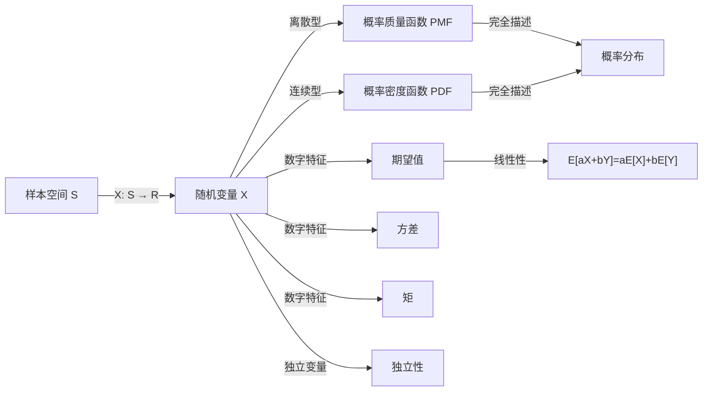

# 随机变量

> [!abstract]
> ==随机变量（Random Variable）==是从样本空间到实数集的一个**函数** $X: S \to \mathbb{R}$，它将随机试验的每个可能结果映射为一个实数。随机变量是概率论从"事件概率"走向"数值分析"的关键桥梁，使得我们可以用微积分和代数工具来研究随机现象。随机变量分为**离散型**和**连续型**两大类。

## 定义

> [!def] 随机变量
> 设 $S$ 是一个样本空间。一个**随机变量** $X$ 是从 $S$ 到实数集 $\mathbb{R}$ 的一个函数：
> $$
> X: S \to \mathbb{R}
> $$
> 即对于样本空间中的每一个结果 $s \in S$，$X(s)$ 是一个实数。
>
> > [!def] 离散随机变量
> > 若随机变量 $X$ 的取值集合是**有限集**或**可列无限集**（即可以排列为 $x_1, x_2, x_3, \ldots$），
> > 则称 $X$ 为**离散随机变量**。
> > 例如：掷骰子的点数、抛硬币的正面次数、一天内的来电数量等。
> >
> > [!def] 连续随机变量
> > 若随机变量 $X$ 可以在某一个或多个**区间**上取任意实数值，
> > 则称 $X$ 为**连续随机变量**。
> > 例如：人的身高、灯泡的寿命、温度的测量值等。
> > 连续随机变量的概率分布由**概率密度函数**（PDF）描述。

## 核心性质

| 编号 | 性质 | 数学表达 / 说明 |
|:---:|------|----------------|
| 1 | **本质是函数** | $X: S \to \mathbb{R}$，将样本空间中的结果映射为实数 |
| 2 | **离散型特征** | 取值为有限或可列无限个，用[[概率分布]]的 PMF 描述 |
| 3 | **连续型特征** | 取值充满区间，用概率密度函数 PDF 描述 |
| 4 | **期望值** | $E(X) = \sum_x x \cdot p(x)$（离散）或 $E(X) = \int_{-\infty}^{+\infty} x \cdot f(x) dx$（连续） |
| 5 | **线性性** | $E(aX + bY) = aE(X) + bE(Y)$，期望具有线性运算性质 |
| 6 | **独立性** | 若 $X, Y$ 独立，则 $E(XY) = E(X) \cdot E(Y)$，$V(X+Y) = V(X) + V(Y)$ |

## 关系网络

## 章节扩展

- **期望值**：随机变量的"加权平均值"，详见 [[期望值]]。$E(X)$ 衡量分布的中心位置。
- **方差**：$V(X) = E[(X - \mu)^2]$，衡量随机变量取值偏离期望的程度，详见 [[方差]]。
- **标准化**：$Z = \frac{X - \mu}{\sigma}$ 将随机变量转化为标准形式，$E(Z) = 0$，$V(Z) = 1$。
- **协方差与相关系数**：衡量两个随机变量之间的线性关系。

## 补充

> [!info] 随机变量是函数，不是"变量"
> 初学者常被"随机变量"这个名称误导，以为它是一个"会随机变化的量"。
> 实际上，随机变量是一个**确定的函数** $X: S \to \mathbb{R}$。
> "随机性"来源于输入——样本空间中的结果是随机的，
> 而函数 $X$ 本身的映射规则是确定的。
> 例如，"掷骰子的点数"这个随机变量，映射规则是确定的：
> 结果"掷出3点"映射为数值3，但每次掷骰子的结果是随机的。
>
> [!info] 离散 vs 连续随机变量的对比
> | 特征 | 离散随机变量 | 连续随机变量 |
> |------|------------|------------|
> | 取值 | 有限或可列无限个 | 区间内的任意实数 |
> | 描述工具 | 概率质量函数 PMF | 概率密度函数 PDF |
> | 求概率 | 求和 $\sum p(x)$ | 积分 $\int f(x) dx$ |
> | 单点概率 | $P(X = a) > 0$ 可以成立 | $P(X = a) = 0$ 恒成立 |
> | 典型例子 | 掷骰子点数、硬币正面数 | 身高、温度、时间 |

## 参见

- [[概率分布]]：随机变量的概率规律
- [[期望值]]：随机变量的数字特征——均值
- [[方差]]：随机变量的数字特征——离散程度
- [[概率]]：随机变量概率计算的基础
- [[伯努利试验]]：产生二项随机变量的基本试验
- [[二项分布]]：离散随机变量的重要分布类型
