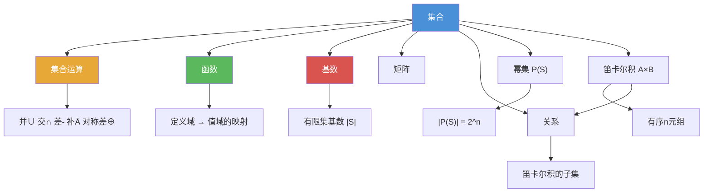

# 集合

> [!abstract] 概述
> ==集合（set）==是离散数学中最基本的离散结构，由==无序的、互不相同的对象==汇集而成。集合提供了描述和组织离散对象的基础框架，其核心操作包括==子集判定==、==幂集构造==和==笛卡尔积==。集合论由 Georg Cantor 于 19 世纪创立，是几乎所有现代数学分支的共同语言。

## 定义

> [!def] 集合（Set）
>
> **集合**是一个==无序的、互不相同的对象==的汇集，这些对象称为集合的==元素（elements）==或==成员（members）==。
>
> - $a \in A$ 表示 $a$ 是集合 $A$ 的元素
> - $a \notin A$ 表示 $a$ 不是集合 $A$ 的元素
> - 集合通常用**大写字母**表示，元素用**小写字母**表示

> [!def] 列举法与描述法
>
> - **列举法（Roster Method）**：将所有元素列在花括号 $\{ \}$ 中，如 $V = \{a, e, i, o, u\}$。元素规律明显时可用省略号 $\ldots$
> - **描述法（Set Builder Notation）**：$\{x \mid x \text{ has property } P\}$，如 $O = \{x \in \mathbb{Z}^+ \mid x \text{ is odd and } x < 10\} = \{1, 3, 5, 7, 9\}$

> [!def] 常用数集
>
> | 符号 | 名称 | 定义 |
> |------|------|------|
> | $\mathbb{N}$ | 自然数集 | $\{0, 1, 2, 3, \ldots\}$ |
> | $\mathbb{Z}$ | 整数集 | $\{\ldots, -2, -1, 0, 1, 2, \ldots\}$ |
> | $\mathbb{Z}^+$ | 正整数集 | $\{1, 2, 3, \ldots\}$ |
> | $\mathbb{Q}$ | 有理数集 | $\{p/q \mid p \in \mathbb{Z}, q \in \mathbb{Z}, q \neq 0\}$ |
> | $\mathbb{R}$ | 实数集 | 所有实数 |
> | $\mathbb{C}$ | 复数集 | 所有复数 |

> [!def] 集合相等与空集
>
> 两个集合相等当且仅当它们有完全相同的元素：
> $$A = B \iff \forall x(x \in A \leftrightarrow x \in B)$$
>
> ==空集== $\emptyset$（或 $\{\}$）是不包含任何元素的集合，$|\emptyset| = 0$。
>
> 注意：$\emptyset \neq \{\emptyset\}$，前者没有元素，后者有一个元素（即 $\emptyset$ 本身）。

> [!def] 子集与真子集
>
> - **子集**：$A \subseteq B \iff \forall x(x \in A \to x \in B)$
> - **真子集**：$A \subset B \iff A \subseteq B \land A \neq B$
>
> 对任意集合 $S$：$\emptyset \subseteq S$（空虚证明）且 $S \subseteq S$。

> [!def] 幂集（Power Set）
>
> 集合 $S$ 的==幂集== $\mathcal{P}(S)$ 是 $S$ 的所有子集构成的集合：
> $$\mathcal{P}(S) = \{X \mid X \subseteq S\}$$
>
> 若 $|S| = n$，则 $|\mathcal{P}(S)| = 2^n$（每个元素有"选"或"不选"两种选择）。

> [!def] 笛卡尔积（Cartesian Product）
>
> 集合 $A$ 和 $B$ 的==笛卡尔积== $A \times B$ 是所有有序对 $(a, b)$ 的集合：
> $$A \times B = \{(a, b) \mid a \in A \land b \in B\}$$
>
> - 有序 $n$ 元组：$(a_1, a_2, \ldots, a_n)$，相等当且仅当对应位置元素都相等
> - $|A \times B| = |A| \cdot |B|$；推广：$|A_1 \times \cdots \times A_n| = |A_1| \cdot \cdots \cdot |A_n|$
> - $A \times B \neq B \times A$（有序对中顺序重要）

## 核心性质

| 性质 | 描述 | 公式 |
|------|------|------|
| 无序性 | 元素排列顺序无关紧要 | $\{1, 3, 5\} = \{3, 5, 1\}$ |
| 互异性 | 重复元素不影响集合 | $\{1, 3, 3, 5\} = \{1, 3, 5\}$ |
| 子集传递性 | 子集关系可传递 | $A \subseteq B \land B \subseteq C \Rightarrow A \subseteq C$ |
| 空集是子集 | 空集是任何集合的子集 | $\emptyset \subseteq S$（空虚证明） |
| 幂集大小 | $n$ 元素集合的幂集有 $2^n$ 个元素 | $|\mathcal{P}(S)| = 2^{|S|}$ |
| 笛卡尔积大小 | 笛卡尔积的基数等于各集合基数的乘积 | $|A \times B| = |A| \cdot |B|$ |
| $\in$ vs $\subseteq$ | 连接的层次不同 | $\in$ 连接元素与集合，$\subseteq$ 连接集合与集合 |

## 关系网络

- **集合**是所有离散结构的基石
- [[集合运算]] 在集合基础上定义了并、交、差、补等操作
- [[函数]] 建立在笛卡尔积的子集（即关系）之上
- [[基数]] 衡量集合的"大小"，有限集的基数即元素个数
- [[矩阵]] 可以看作从索引集合到值域的函数
- **关系**是笛卡尔积的子集，是后续章节的核心概念

## 章节扩展

### 第2章：基本结构

集合是第 2 章的第一个主题（2.1 节），为后续所有内容提供基础：

- **2.1 集合**：定义、表示方法、子集、幂集、笛卡尔积
- **2.2 集合运算**：在集合基础上定义并、交、差、补等操作，建立集合恒等式体系
- **2.3 函数**：函数的图是笛卡尔积的子集，函数是特殊的关系
- **2.4 序列与求和**：序列是从 $\mathbb{Z}^+$ 到集合的函数
- **2.5 基数**：直接衡量集合的大小，利用双射比较无限集的势
- **2.6 矩阵**：矩阵是二维索引到值的映射，本质上是函数

### 第6章：计数

- **6.1 计数基础**：$n$ 元素集合有 $2^n$ 个子集，可用乘法法则证明。容斥原理是集合运算在计数中的直接应用。

## 补充

> [!info] 集合论的公理化背景
>
> 本节采用的是由 Georg Cantor 创立的==朴素集合论（naive set theory）==。然而，1902 年 Bertrand Russell 发现了著名的==罗素悖论==：考虑集合 $S = \{x \mid x \notin x\}$，则 $S \in S \iff S \notin S$，产生矛盾。为避免此类悖论，数学家发展了==ZFC 公理化集合论==（Zermelo-Fraenkel + 选择公理），通过限制"集合"的构造方式排除"太大"的汇集。
>
> **学术来源**：Halmos, P. R. (1960). *Naive Set Theory*. Springer-Verlag.
>
> **参考链接**：Jech, T. (2003). *Set Theory: The Third Millennium Edition*. Springer. https://link.springer.com/book/10.1007/3-540-44761-X

## 参见

- [[集合运算]] -- 并、交、差、补、对称差及集合恒等式
- [[函数]] -- 从定义域到值域的映射关系
- [[基数]] -- 集合大小的度量与无限集的比较
- [[矩阵]] -- 数字的矩形阵列，离散结构的表示工具
- [[逻辑学/concepts/命题]] -- 命题逻辑与集合运算的深层对应关系
