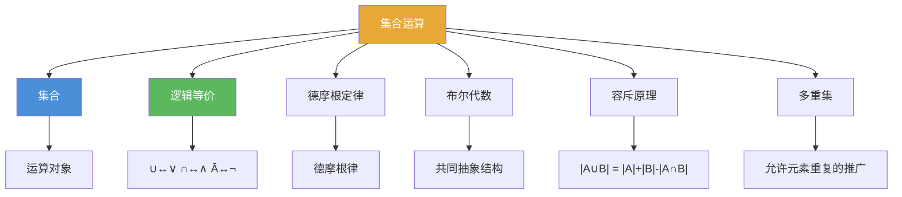

# 集合运算

> [!abstract] 概述
> ==集合运算==是对集合进行操作以产生新集合的方法，包括==并集 $\cup$==、==交集 $\cap$==、==差集 $-$==、==补集 $\overline{A}$== 和==对称差 $\oplus$==。集合运算与命题逻辑存在精确的对应关系，两者都是==布尔代数==的实例。集合恒等式可通过子集法、成员表法或恒等式推导法三种方法证明。

## 定义

> [!def] 五种基本集合运算
>
> 设 $A$ 和 $B$ 为集合，全集为 $U$：
>
> | 运算 | 记号 | 定义 | 描述 |
> |------|------|------|------|
> | ==并集== | $A \cup B$ | $\{x \mid x \in A \lor x \in B\}$ | 属于 $A$ 或 $B$ 的所有元素 |
> | ==交集== | $A \cap B$ | $\{x \mid x \in A \land x \in B\}$ | 同时属于 $A$ 和 $B$ 的元素 |
> | ==差集== | $A - B$ | $\{x \mid x \in A \land x \notin B\}$ | 属于 $A$ 但不属于 $B$ 的元素 |
> | ==补集== | $\overline{A}$ | $\{x \in U \mid x \notin A\}$ | 全集中不属于 $A$ 的元素 |
> | ==对称差== | $A \oplus B$ | $(A \cup B) - (A \cap B)$ | 属于 $A$ 或 $B$ 但不同时属于两者的元素 |
>
> 两个集合称为==不相交的==（disjoint），如果 $A \cap B = \emptyset$。

> [!def] 集合恒等式（Set Identities）
>
> 以下恒等式对所有集合 $A, B, C$ 成立（全集为 $U$）：
>
> | 恒等式 | 名称 |
> |--------|------|
> | $A \cap U = A$，$A \cup \emptyset = A$ | ==恒等律==（Identity laws） |
> | $A \cup U = U$，$A \cap \emptyset = \emptyset$ | ==支配律==（Domination laws） |
> | $A \cup A = A$，$A \cap A = A$ | ==幂等律==（Idempotent laws） |
> | $\overline{\overline{A}} = A$ | ==补律==（Complementation law） |
> | $A \cup B = B \cup A$，$A \cap B = B \cap A$ | ==交换律==（Commutative laws） |
> | $A \cup (B \cup C) = (A \cup B) \cup C$，$A \cap (B \cap C) = (A \cap B) \cap C$ | ==结合律==（Associative laws） |
> | $A \cup (B \cap C) = (A \cup B) \cap (A \cup C)$，$A \cap (B \cup C) = (A \cap B) \cup (A \cap C)$ | ==分配律==（Distributive laws） |
> | $\overline{A \cap B} = \overline{A} \cup \overline{B}$，$\overline{A \cup B} = \overline{A} \cap \overline{B}$ | ==德摩根律==（De Morgan's laws） |
> | $A \cup (\overline{A} \cap B) = A$，$A \cap (\overline{A} \cup B) = A$ | ==吸收律==（Absorption laws） |
> | $A \cup \overline{A} = U$，$A \cap \overline{A} = \emptyset$ | ==补律==（Complement laws） |

> [!def] 证明集合恒等式的三种方法
>
> 1. **子集法**：证明 $X \subseteq Y$ 且 $Y \subseteq X$。任取 $x \in X$，利用定义推导 $x \in Y$
> 2. **成员表法**：列出所有 $2^n$ 种原子集合组合，逐步计算等式两边，比较列是否相同
> 3. **恒等式推导法**：从等式一边出发，通过已证明的恒等式逐步变形为另一边

> [!def] 广义并集与交集
>
> $$\bigcup_{i=1}^{n} A_i = \{x \mid \exists i \in \{1, \ldots, n\}(x \in A_i)\}$$
> $$\bigcap_{i=1}^{n} A_i = \{x \mid \forall i \in \{1, \ldots, n\}(x \in A_i)\}$$
>
> 可推广到无限情形（$n \to \infty$）和任意指标集 $I$。

> [!def] 位字符串表示法（Bit String Representation）
>
> 设全集 $U = \{a_1, a_2, \ldots, a_n\}$，集合 $A \subseteq U$ 用长度为 $n$ 的位字符串表示：
> - 第 $i$ 位为 **1** 当且仅当 $a_i \in A$
> - 集合运算对应按位布尔运算：$\cup \leftrightarrow$ OR，$\cap \leftrightarrow$ AND，$\overline{\phantom{A}} \leftrightarrow$ NOT，$\oplus \leftrightarrow$ XOR

> [!def] 多重集（Multiset）
>
> ==多重集==允许元素重复出现，元素 $x$ 出现的次数称为==重数== $m(x)$。
>
> | 运算 | 重数规则 |
> |------|---------|
> | 并集 $P \cup Q$ | $\max(m_P(x), m_Q(x))$ |
> | 交集 $P \cap Q$ | $\min(m_P(x), m_Q(x))$ |
> | 差集 $P - Q$ | $\max(m_P(x) - m_Q(x), 0)$ |
> | 和 $P + Q$ | $m_P(x) + m_Q(x)$ |

## 核心性质

| 性质 | 描述 | 公式 |
|------|------|------|
| 并集基数公式 | 容斥原理的最简形式 | $|A \cup B| = \|A\| + \|B\| - \|A \cap B\|$ |
| 差集与补集关系 | 差集可转化为交集与补集 | $A - B = A \cap \overline{B}$ |
| 差集不满足交换律 | 差集运算有方向性 | $A - B \neq B - A$（一般情况） |
| 集合与逻辑的对应 | 集合恒等式与逻辑等价一一对应 | $\cup \leftrightarrow \lor$，$\cap \leftrightarrow \land$，$\overline{\phantom{A}} \leftrightarrow \neg$ |
| 德摩根律的对偶性 | 并/交互换、全集/空集互换即得另一式 | $\overline{A \cap B} = \overline{A} \cup \overline{B}$ |
| 多重集 vs 普通集合 | 多重集保留元素重数信息 | 普通集合 $\{a, a\} = \{a\}$；多重集 $\{2 \cdot a\} \neq \{1 \cdot a\}$ |

## 关系网络

- [[集合]] 是集合运算的操作对象，提供基本的结构定义
- [[离散数学/concepts/逻辑等价]] 与集合恒等式存在精确的对应关系（布尔代数的两个实例）
- 德摩根定律在命题逻辑和集合论中同时成立，体现布尔代数的对偶性（逻辑学知识库中无独立概念页）
- **布尔代数**是集合代数与命题逻辑的共同抽象
- **容斥原理**从并集基数公式推广而来，是组合计数的核心工具

## 章节扩展

### 第2章：基本结构

集合运算是第 2 章的 2.2 节，在集合定义的基础上建立运算体系：

- **2.1 集合**：定义了集合的基本概念，是集合运算的前提
- **2.2 集合运算**：五种基本运算 + 集合恒等式 + 三种证明方法 + 位字符串表示 + 多重集
- **2.3 函数**：函数的图是笛卡尔积的子集，特征函数将集合运算转化为算术运算
- **2.5 基数**：并集基数公式 $|A \cup B| = |A| + |B| - |A \cap B|$ 是容斥原理的基础
- **第6章 计数**：容斥原理的一般形式是计数理论的核心技术

### 第8章：高级计数 — 8.5节内容

- **容斥原理是集合运算（并集计数）的高级扩展**：第2章中学习的并集基数公式 $|A \cup B| = |A| + |B| - |A \cap B|$ 是容斥原理在两个集合时的特例。第8章将这一思想推广到任意 $n$ 个集合：
  $$\left|\bigcup_{i=1}^{n} A_i\right| = \sum_{k=1}^{n}(-1)^{k+1}\sum_{1 \leq i_1 < \cdots < i_k \leq n}|A_{i_1} \cap \cdots \cap A_{i_k}|$$
  本质上，容斥原理是对广义并集 $\bigcup_{i=1}^{n} A_i$ 的基数进行精确计算的工具，它系统性地处理了多重交集导致的重复计数问题。从集合运算的角度看，容斥原理将简单的二元并集公式通过数学归纳法推广到了 $n$ 元情形。详见[[离散数学/concepts/容斥原理]]。

### 第12章：布尔代数

集合的幂集代数 $(\mathcal{P}(S), \cup, \cap, \bar{})$ 是布尔代数的经典实例之一。集合运算与布尔运算之间存在同构：

| 集合运算 | 布尔运算 |
|:---------|:---------|
| $\cup$（并集） | $+$（布尔或） |
| $\cap$（交集） | $\cdot$（布尔与） |
| $\bar{A}$（补集） | $\bar{x}$（布尔非） |
| $S$（全集） | $1$ |
| $\emptyset$（空集） | $0$ |

集合运算的恒等式（如德摩根定律 $\overline{A \cup B} = \bar{A} \cap \bar{B}$）与布尔恒等式完全对应。这种同构关系使得布尔代数的理论可以无缝应用于集合论。

## 补充

> [!info] 德摩根律的历史与布尔代数
>
> 德摩根律以英国数学家 **Augustus De Morgan**（1806-1871）命名，他在 1847 年的 *Formal Logic* 中首次明确表述。德摩根律的深刻之处在于其==对偶性==：将并集与交集互换、全集与空集互换，一个恒等式就变为另一个。这种对偶性贯穿整个布尔代数。在电路设计中，德摩根律直接对应 NAND 门和 NOR 门的万能性。
>
> **学术来源**：De Morgan, A. (1847). *Formal Logic: or, The Calculus of Inference, Necessary and Probable*. Taylor and Walton.
>
> **参考链接**：Bocheński, I. M. (1961). *A History of Formal Logic*. University of Notre Dame Press.

## 参见

- [[集合]] -- 集合的基本定义、表示方法、子集与笛卡尔积
- [[离散数学/concepts/逻辑等价]] -- 命题逻辑中的等价关系，与集合恒等式精确对应
- 德摩根定律 -- 命题逻辑中的德摩根定律，集合版本的一般化（逻辑学知识库中无独立概念页）
