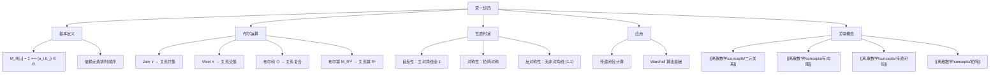

# 零一矩阵

> [!abstract] 概述
> ==零一矩阵==（zero-one matrix）是所有元素仅取 0 或 1 的矩阵，用于表示有限集上的==二元关系==。核心定义为 $M_R[i,j]=1 \Leftrightarrow (a_i,b_j)\in R$。零一矩阵支持三种布尔运算：==布尔 join==（$\vee$，按位或）对应关系并集，==布尔 meet==（$\wedge$，按位与）对应关系交集，==布尔乘积==（$\odot$）对应关系复合。==布尔幂== $M_R^{[n]}$ 则对应关系幂 $R^n$，是计算传递闭包的基础。

## 定义

> [!def] 零一矩阵表示关系（Zero-One Matrix Representation）
>
> 设 $R$ 是从集合 $A = \{a_1, a_2, \ldots, a_m\}$ 到集合 $B = \{b_1, b_2, \ldots, b_n\}$ 的关系（元素按某种确定顺序排列），则 $R$ 可以用一个 $m \times n$ 的==零一矩阵== $M_R = [m_{ij}]$ 表示，其中
>
> $$m_{ij} = \begin{cases} 1 & \text{若 } (a_i, b_j) \in R \\ 0 & \text{若 } (a_i, b_j) \notin R \end{cases}$$
>
> 当 $A = B$ 时，$M_R$ 是一个 $n \times n$ 的==方阵==。矩阵的表示依赖于集合元素的排列顺序。

> [!def] 布尔 join 和 meet
>
> 设 $A = [a_{ij}]$ 和 $B = [b_{ij}]$ 是两个 $m \times n$ 的零一矩阵，则
>
> - **布尔 join**（$\vee$）：$A \vee B = [a_{ij} \vee b_{ij}]$，即按位"或"运算
> - **布尔 meet**（$\wedge$）：$A \wedge B = [a_{ij} \wedge b_{ij}]$，即按位"与"运算

> [!def] 布尔乘积（Boolean Product）
>
> 设 $A$ 是 $m \times n$ 的零一矩阵，$B$ 是 $n \times p$ 的零一矩阵，则 $A$ 和 $B$ 的==布尔乘积== $A \odot B$ 是 $m \times p$ 的零一矩阵 $C = [c_{ij}]$，其中
>
> $$c_{ij} = \bigvee_{k=1}^{n}(a_{ik} \wedge b_{kj})$$
>
> 即 $c_{ij} = 1$ 当且仅当存在某个 $k$ 使得 $a_{ik} = b_{kj} = 1$。

> [!def] 布尔幂（Boolean Power）
>
> 设 $R$ 是集合 $A$ 上的关系，$M_R$ 是其零一矩阵，则 $R^n$ 的零一矩阵为
>
> $$M_{R^n} = M_R^{[n]}$$
>
> 其中 $M_R^{[n]}$ 表示 $n$ 个 $M_R$ 的布尔乘积：$M_R^{[n]} = \underbrace{M_R \odot M_R \odot \cdots \odot M_R}_{n \text{ 个因子}}$。

## 核心性质

| 性质 | 公式/规则 | 说明 |
|:-----|:----------|:-----|
| ==关系并集== | $M_{R_1 \cup R_2} = M_{R_1} \vee M_{R_2}$ | 布尔 join 对应并集 |
| ==关系交集== | $M_{R_1 \cap R_2} = M_{R_1} \wedge M_{R_2}$ | 布尔 meet 对应交集 |
| ==关系复合== | $M_{S \circ R} = M_S \odot M_R$ | 布尔乘积对应复合 |
| ==关系幂== | $M_{R^n} = M_R^{[n]}$ | 布尔幂对应关系幂 |
| ==自反性判定== | $m_{ii} = 1$ 对所有 $i$ | 主对角线全为 1 |
| ==对称性判定== | $m_{ij} = m_{ji}$ 对所有 $i, j$ | 矩阵关于主对角线对称 |
| ==反对称性判定== | $i \neq j$ 时 $m_{ij}=1 \Rightarrow m_{ji}=0$ | 非对角线无 $(1,1)$ 对 |
| ==布尔乘积含义== | $c_{ij}=1 \Leftrightarrow \exists k: a_{ik}=b_{kj}=1$ | 判定"是否存在路径" |

## 关系网络

- **前置知识**：[[离散数学/concepts/二元关系]]（零一矩阵是关系的矩阵表示）、[[离散数学/concepts/矩阵]]（布尔运算基于矩阵结构与布尔代数）
- **核心关联**：零一矩阵将关系的集合运算自然转化为矩阵的布尔运算，使计算机程序能够高效处理关系问题
- **后继概念**：[[离散数学/concepts/传递闭包]]（利用布尔幂和布尔 join 计算传递闭包）、[[离散数学/concepts/有向图]]（零一矩阵与有向图是同一关系的两种等价表示）

## 章节扩展

### 第09章：关系

零一矩阵是 Rosen 第8版第9章第9.3节的核心内容之一，为关系的计算化处理提供了工具。

**布尔运算与关系运算的对应**：零一矩阵的布尔 join/meet/乘积分别对应关系的并集/交集/复合，这种对应关系使得我们可以利用矩阵运算来研究关系的性质。布尔乘积 $c_{ij} = \bigvee_k (a_{ik} \wedge b_{kj})$ 的本质是判定"是否存在中间元素 $k$ 使得两步关系成立"，这与普通矩阵乘法 $c_{ij} = \sum_k a_{ik} b_{kj}$ 计算"数值的线性组合"有本质区别。

**布尔幂的路径含义**：$M_R^{[n]}$ 的 $(i,j)$ 元素为 1 当且仅当从 $a_i$ 到 $a_j$ 存在长度为 $n$ 的路径。这一性质是传递闭包算法（Algorithm 1 和 Warshall 算法）的理论基础。

**矩阵判定关系性质的效率**：自反性检查 $O(n)$，对称性检查 $O(n^2)$，反对称性检查 $O(n^2)$，传递性检查 $O(n^3)$（需穷举所有长度为 2 的路径）。

### 第10章：图论

> [!info] 零一矩阵与图论
> 在第10章图论中，零一矩阵是图的邻接矩阵和关联矩阵的基础：
>
> - ==邻接矩阵==是零一矩阵的最重要应用之一
> - 邻接矩阵的==布尔乘法==对应关系的复合
> - 邻接矩阵的==布尔幂==计算图的传递闭包（可达性矩阵）

### 第12章：布尔代数

==零一矩阵==（Boolean matrix）的运算与布尔代数直接相关。零一矩阵的元素取自 $\{0, 1\}$，其加法和乘法运算使用布尔运算（布尔或 $+$ 和布尔与 $\cdot$）替代普通的算术运算。

**布尔矩阵乘法**：设 $A$ 和 $B$ 是 $n \times n$ 零一矩阵，则 $(A \odot B)_{ij} = \bigvee_{k=1}^{n}(A_{ik} \land B_{kj})$，其中 $\vee$ 是布尔或，$\land$ 是布尔与。

布尔矩阵在关系理论中有重要应用：关系的复合可以通过布尔矩阵乘法计算（第9章），而关系的传递闭包可以通过布尔矩阵的幂运算和 Warshall 算法求解。

## 补充

> [!info] 布尔矩阵的历史背景
>
> 零一矩阵（也称为布尔矩阵）的理论基础源于 George Boole 在 1854 年创立的布尔代数。布尔代数将逻辑运算（与、或、非）系统化为代数结构，后来成为数字电路设计和计算机科学的理论基石。在关系理论中，零一矩阵将关系的集合运算自然地转化为矩阵的布尔运算，这种对应关系使得我们可以利用线性代数的工具来研究离散结构。
>
> 布尔矩阵乘法与普通矩阵乘法的区别在于：普通乘法用"乘加"（$\sum a_{ik} \cdot b_{kj}$），而布尔乘法用"与或"（$\bigvee (a_{ik} \wedge b_{kj})$）。前者计算的是数值的线性组合，后者判定的是"是否存在"某种连接，这恰好对应了关系复合的本质。

> [!warning] 常见误区
>
> - 零一矩阵的表示依赖于集合元素的排列顺序，同一关系在不同排列下产生不同矩阵，但关系的性质（自反性等）不依赖于排列顺序
> - 布尔乘积回答的问题是"是否存在路径"，而非"有多少条路径"
> - 对称性与反对称性不互斥：恒等关系 $I_A$ 既是对称的又是反对称的

## 参见

- [[离散数学/concepts/二元关系]] -- 零一矩阵所表示的对象
- [[离散数学/concepts/有向图]] -- 关系的另一种等价表示
- [[离散数学/concepts/传递闭包]] -- 利用布尔幂和布尔 join 计算
- [[离散数学/concepts/矩阵]] -- 矩阵的基本定义与算术运算
