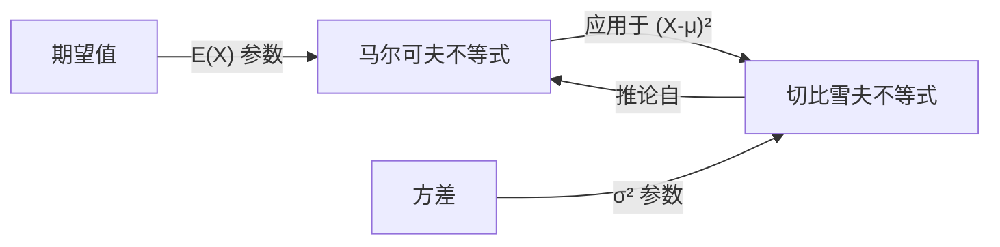

# 马尔可夫不等式

> [!abstract]
> ==马尔可夫不等式（Markov's Inequality）==是概率论中最基本的不等式，它利用非负[[离散数学/concepts/随机变量]]的[[离散数学/concepts/期望值]]给出"随机变量取大值"的概率上界。具体而言，若 $X$ 是非负随机变量，则对任意 $a > 0$，有 $P(X \geq a) \leq E(X)/a$。马尔可夫不等式是[[离散数学/concepts/切比雪夫不等式]]的基础——切比雪夫不等式本质上是将马尔可夫不等式应用于 $(X - \mu)^2$ 的结果。

## 定义

> [!def] 马尔可夫不等式（Markov's Inequality）
> 设 $X$ 是**非负**[[离散数学/concepts/随机变量]]（即 $X \geq 0$），$a > 0$ 为任意正实数，则：
> $$P(X \geq a) \leq \frac{E(X)}{a}$$
>
> **等价形式**：$P(X \geq a) \leq \frac{E(X)}{a}$ 也可以写为 $P(X \geq a \cdot E(X)) \leq \frac{1}{a}$（令 $a$ 替换为 $a \cdot E(X)$）。
>
> **直观含义**：如果 $X$ 的平均值很小，那么 $X$ 取很大值的概率必然很低。

> [!def] 马尔可夫不等式的证明
> **证明**：
>
> 由于 $X \geq 0$，将[[离散数学/concepts/期望值]]拆分为两部分：
> $$E(X) = \sum_{x} x \cdot p(x) = \sum_{x < a} x \cdot p(x) + \sum_{x \geq a} x \cdot p(x)$$
>
> 由于 $X \geq 0$，第一项非负，故：
> $$E(X) \geq \sum_{x \geq a} x \cdot p(x)$$
>
> 在第二项中，由于 $x \geq a$，用 $a$ 替换 $x$ 只会使求和变小：
> $$E(X) \geq \sum_{x \geq a} a \cdot p(x) = a \sum_{x \geq a} p(x) = a \cdot P(X \geq a)$$
>
> 两边除以 $a$：$P(X \geq a) \leq E(X)/a$。$\blacksquare$

> [!def] 应用示例
> **问题**：某考试的平均分为75分，求得分超过90分的比例最多是多少？
>
> **解法**：设 $X$ 为考试成绩（非负随机变量），$E(X) = 75$。
> 由马尔可夫不等式：
> $$P(X \geq 90) \leq \frac{75}{90} = \frac{5}{6} \approx 83.3\%$$
>
> **注意**：这个上界非常宽松，因为马尔可夫不等式只利用了期望值信息。如果还知道方差，可以使用[[离散数学/concepts/切比雪夫不等式]]得到更紧的上界。

> [!def] 与切比雪夫不等式的关系
> 马尔可夫不等式应用于 $(X - \mu)^2$（其中 $\mu = E(X)$）即可得到[[离散数学/concepts/切比雪夫不等式]]：
>
> 令 $Y = (X - \mu)^2$，则 $Y \geq 0$，$E(Y) = \sigma^2$。
>
> 由马尔可夫不等式：
> $$P(Y \geq r^2) \leq \frac{E(Y)}{r^2} = \frac{\sigma^2}{r^2}$$
>
> 即 $P(|X - \mu| \geq r) \leq \sigma^2/r^2$，这正是切比雪夫不等式。

## 核心性质

| 编号 | 性质 | 说明 |
|:---:|------|------|
| P1 | **非负性要求** | 仅适用于非负随机变量 $X \geq 0$，这是使用的前提条件 |
| P2 | **仅需期望信息** | 只需要知道 $E(X)$，不需要方差或其他高阶矩 |
| P3 | **上界的宽松性** | 给出的上界通常比较宽松，因为利用的信息最少 |
| P4 | **切比雪夫不等式的基础** | [[离散数学/concepts/切比雪夫不等式]]是马尔可夫不等式应用于 $(X-\mu)^2$ 的推论 |
| P5 | **单调性** | $a$ 越大，上界 $E(X)/a$ 越小，即"取更大值的概率更小" |

## 关系网络

## 章节扩展

- **期望值**：[[离散数学/concepts/期望值]]是马尔可夫不等式中唯一的参数，$P(X \geq a) \leq E(X)/a$
- **切比雪夫不等式**：[[离散数学/concepts/切比雪夫不等式]]是马尔可夫不等式最重要的推论，利用方差信息给出更紧的上界
- **方差**：[[离散数学/concepts/方差]]信息可以弥补马尔可夫不等式的不足，通过切比雪夫不等式提供更好的估计

## 补充

> [!info] 生活类比
> 想象你知道一个班级的平均身高是170厘米。马尔可夫不等式告诉你：身高超过340厘米的学生比例不超过 $170/340 = 50\%$。这个结论虽然正确但没什么用——因为实际上不可能有人身高超过340厘米。马尔可夫不等式就像一个"只看平均值"的粗略估计器：它只利用最有限的信息（平均值），所以给出的结论虽然一定正确，但往往非常保守。

> [!info] 马尔可夫不等式的局限性
> 马尔可夫不等式有两个主要局限：
> 1. **只适用于非负随机变量**：对于可能取负值的随机变量不能直接使用
> 2. **上界过于宽松**：因为它只利用期望值信息，完全忽略了分布的形状
>
> 正因如此，在实际应用中，如果还知道方差信息，通常优先使用[[离散数学/concepts/切比雪夫不等式]]；如果知道具体分布（如正态分布），则使用分布特有的精确概率计算。

> [!info] 马尔可夫不等式的推广
> 马尔可夫不等式可以推广为：对任意**单调递增**的非负函数 $\varphi$：
> $$P(X \geq a) = P(\varphi(X) \geq \varphi(a)) \leq \frac{E[\varphi(X)]}{\varphi(a)}$$
>
> 常见选择：
> - $\varphi(x) = x$：标准马尔可夫不等式
> - $\varphi(x) = x^2$：应用于 $(X-\mu)^2$ 得到切比雪夫不等式
> - $\varphi(x) = e^{tx}$：应用于指数函数得到**切尔诺夫界（Chernoff Bound）**，这是概率论中最强大的集中不等式之一

## 参见

- [[离散数学/concepts/期望值]]：马尔可夫不等式中唯一的参数
- [[离散数学/concepts/切比雪夫不等式]]：马尔可夫不等式最重要的推论
- [[离散数学/concepts/方差]]：切比雪夫不等式的核心参数，弥补马尔可夫不等式的不足
