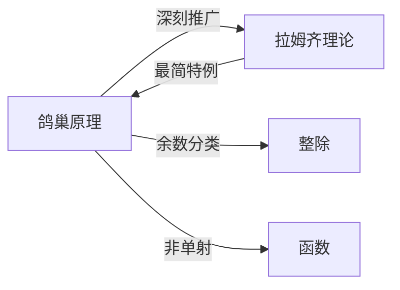

# 鸽巢原理

> [!abstract]
> ==鸽巢原理（Pigeonhole Principle）==是组合数学中最基本的存在性定理之一。它断言：如果将 $N$ 个物体放入 $k$ 个盒子中，那么**至少有一个盒子包含至少 $\lceil N/k \rceil$ 个物体**。该原理不构造具体的解，而是证明某种情况**必然存在**，属于"存在性证明"的经典工具。

## 定义

> [!def] 鸽巢原理（简单形式）
> 若将 $k + 1$ 个或更多的物体放入 $k$ 个盒子中，则**至少有一个盒子中有两个或更多的物体**。
>
> **形式化表述**：若 $f: A \to B$ 是一个[[函数]]，且 $|A| > |B|$，则 $f$ 不是单射，即存在 $a_1 \neq a_2 \in A$ 使得 $f(a_1) = f(a_2)$。

> [!def] 广义鸽巢原理（Generalized Pigeonhole Principle）
> 若将 $N$ 个物体放入 $k$ 个盒子中，则**至少有一个盒子包含至少 $\lceil N/k \rceil$ 个物体**。
>
> 等价表述：若 $N$ 个物体放入 $k$ 个盒子，则至少有一个盒子包含至少 $\lfloor (N-1)/k \rfloor + 1$ 个物体。
>
> **特例验证**：当 $N = k + 1$ 时，$\lceil (k+1)/k \rceil = 2$，退化为简单形式。

> [!def] 典型应用场景
> 1. **整除性**：在 $n + 1$ 个整数中，必有两个数之差能被 $n$ 整除（考虑模 $n$ 的余数，共 $n$ 个余数类即 $n$ 个"鸽巢"）
> 2. **序列问题**：在任意 $n^2 + 1$ 个不同的实数组成的序列中，必有长度为 $n + 1$ 的递增子序列或长度为 $n + 1$ 的递减子序列（Erdős-Szekeres 定理）
> 3. **几何问题**：在边长为 1 的正方形内放置 5 个点，至少有两个点的距离不超过 $\sqrt{2}/2$（将正方形分为 4 个小正方形）
> 4. **握手问题**：在一个聚会中，至少有两个人握手的次数相同（每个人的握手次数范围为 0 到 $n-1$，但 0 和 $n-1$ 不能同时出现）

## 核心性质

| 编号 | 性质 | 说明 |
|:---:|------|------|
| P1 | **存在性而非构造性** | 鸽巢原理只保证"存在"，不指出具体是哪个盒子、哪些物体 |
| P2 | **函数视角** | 鸽巢原理等价于"从较大集合到较小集合的函数不是单射" |
| P3 | **余数分类法** | 最常见的鸽巢构造方式是利用模运算的余数作为"盒子" |
| P4 | **最优性** | 结论中的 $\lceil N/k \rceil$ 是最优的（紧的），即存在恰好使每个盒子不超过 $\lceil N/k \rceil$ 的分配方式 |
| P5 | **与拉姆齐理论的联系** | 鸽巢原理是[[拉姆齐理论]]的最简单特例，拉姆齐理论是其深刻推广 |
| P6 | **分区策略** | 应用鸽巢原理的关键在于**如何构造"盒子"**（即如何对物体进行分类），这是解题的核心技巧 |
| P7 | **平均数论证** | 鸽巢原理本质上是平均数原理的推论——如果平均每个盒子有 $N/k$ 个物体，则至少一个盒子不少于平均值 |

## 关系网络

## 章节扩展

- **拉姆齐理论**：[[拉姆齐理论]]是鸽巢原理的深刻推广，研究在足够大的结构中必然出现的有序子结构
- **函数与单射**：鸽巢原理与[[函数]]的单射性密切相关——从较大定义域到较小值域的函数不可能为单射
- **整除理论**：鸽巢原理在[[整除]]问题中有广泛应用，通过模运算构造鸽巢是经典技巧

## 补充

> [!info] 生活类比
> "鸽巢原理"的名字来源于一个直观场景：如果有3只鸽子要飞进2个鸽巢，那么至少有一个鸽巢里会有至少2只鸽子。无论你怎么安排，都无法让每个鸽巢最多只有1只鸽子——因为鸽子比鸽巢多。这个道理虽然简单，但在数学中有着极其广泛而深刻的应用。

> [!info] 经典例题
> 证明：在任意367人中，至少有两个人生日相同。
> - 一年最多366天（考虑闰年），将367人按生日分类
> - 共有366个"盒子"（可能的生日），367个"物体"（人）
> - 由鸽巢原理：$367 > 366$，至少有一个盒子中有至少2个人
> - 即至少有两个人生日相同

> [!info] 解题策略总结
> 应用鸽巢原理的关键三步：
> 1. **确定物体**：明确需要分配的对象是什么
> 2. **构造鸽巢**：设计合适的分类方式（这是最关键的一步）
> 3. **计算数量**：验证物体数大于鸽巢数，得出结论

## 参见

- [[拉姆齐理论]]：鸽巢原理的深刻推广
- [[整除]]：鸽巢原理在整除问题中的应用
- [[函数]]：鸽巢原理与函数单射性的关系
