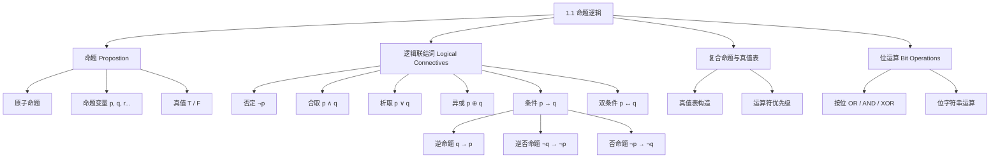

**相关笔记：** [[1.2 命题逻辑的应用]]

> [!abstract] 概览
> 本节是离散数学的逻辑学起点，系统介绍了==命题（proposition）==的定义、五种基本==逻辑联结词（logical connectives）==（否定、合取、析取、条件、双条件）以及==真值表（truth table）==的构造方法，最后将逻辑运算与计算机==位运算（bit operation）==联系起来。
>
> - **命题**是只能为真或为假的陈述句，是逻辑推理的最小原子单位
> - **否定** $\neg p$、**合取** $p \land q$、**析取** $p \lor q$、**异或** $p \oplus q$、**条件** $p \to q$、**双条件** $p \leftrightarrow q$ 是六种核心逻辑运算
> - 条件语句的**逆否命题**（contrapositive）与原命题逻辑等价，但**逆命题**（converse）和**否命题**（inverse）不一定等价
> - **真值表**是判断复合命题真值的系统性工具，$n$ 个变量需要 $2^n$ 行
> - 逻辑运算可直接映射到计算机的**位运算**（AND、OR、XOR），是数字电路设计的理论基础
> - 逻辑运算符有明确的**优先级**：$\neg > \land > \lor > \to > \leftrightarrow$

---

## 一、知识结构总览



---

## 二、核心思想

> [!tip] 核心思想
> 本节的核心思想是==命题逻辑的形式化==（formalization of propositional logic）：通过定义命题（真/假的陈述句）和六种逻辑联结词（否定、合取、析取、异或、条件、双条件），将自然语言中的推理转化为精确的数学运算。真值表提供了系统性的判定工具，而逻辑运算与计算机位运算的直接对应则揭示了逻辑学作为数字电路设计理论基础的深层联系。

### 1. 命题的定义

> [!def] 命题（Proposition）
> **命题**是一个==陈述句==（declarative sentence），它要么为真（true），要么为假（false），但不能同时为真和为假。
>
> - 命题的真值用 **T**（True）或 **F**（False）表示
> - 不能再分解为更简单命题的命题称为==原子命题（atomic proposition）==
> - 用小写字母 $p, q, r, s, \ldots$ 表示==命题变量（propositional variable）==

> [!example] 命题 vs 非命题
> | 句子 | 是否为命题 | 原因 |
> |------|-----------|------|
> | "华盛顿特区是美国的首都" | 是（T） | 陈述句，有确定真值 |
> | "多伦多是加拿大的首都" | 是（F） | 陈述句，有确定真值 |
> | "$1 + 1 = 2$" | 是（T） | 陈述句，有确定真值 |
> | "现在几点了？" | 否 | 疑问句，非陈述句 |
> | "$x + 1 = 2$" | 否 | 含变量，真值取决于 $x$ 的赋值 |
> | "仔细阅读本文" | 否 | 祈使句，非陈述句 |

> [!tip] 关键区分
> 判断一个句子是否为命题，需要同时满足两个条件：(1) 是陈述句；(2) 有确定的真值（真或假）。含自由变量的句子不是命题，但给变量赋值后可以变成命题。

### 2. 逻辑联结词

#### 2.1 否定（Negation）

> [!def] 否定
> 设 $p$ 为命题，$p$ 的==否定==记为 $\neg p$（也记为 $\bar{p}$），读作"非 $p$"。$\neg p$ 的真值与 $p$ 的真值**相反**。

$$
\begin{array}{|c|c|}
\hline
p & \neg p \\
\hline
T & F \\
F & T \\
\hline
\end{array}
$$

> [!example] 否定的自然语言表达
> - 原命题 $p$："Michael 的电脑运行 Linux"
> - 否定 $\neg p$："Michael 的电脑不运行 Linux"（而非"Michael 的电脑运行非 Linux"）

#### 2.2 合取（Conjunction）

> [!def] 合取
> 设 $p$ 和 $q$ 为命题，$p$ 和 $q$ 的==合取==记为 $p \land q$，读作"$p$ 与 $q$"。$p \land q$ 为真**当且仅当** $p$ 和 $q$ 同时为真。

$$
\begin{array}{|c|c|c|}
\hline
p & q & p \land q \\
\hline
T & T & T \\
T & F & F \\
F & T & F \\
F & F & F \\
\hline
\end{array}
$$

> [!tip] "but" 也是合取
> 在逻辑中，"but"（但是）和 "and"（并且）表达的是同一个逻辑联结词。例如 "The sun is shining, but it is raining" 在逻辑上等同于 "The sun is shining and it is raining"。

#### 2.3 析取（Disjunction）

> [!def] 析取
> 设 $p$ 和 $q$ 为命题，$p$ 和 $q$ 的==析取==记为 $p \lor q$，读作"$p$ 或 $q$"。$p \lor q$ 为假**当且仅当** $p$ 和 $q$ 同时为假。这是==包含或（inclusive or）==。

$$
\begin{array}{|c|c|c|}
\hline
p & q & p \lor q \\
\hline
T & T & T \\
T & F & T \\
F & T & T \\
F & F & F \\
\hline
\end{array}
$$

> [!example] 包含或 vs 异或
> - **包含或**："学过微积分或计算机导论的学生可以选修这门课"（两者都学过也可以）
> - **异或**："晚餐可以选汤或沙拉，但不能都选"（恰好选一个）

#### 2.4 异或（Exclusive Or）

> [!def] 异或
> 设 $p$ 和 $q$ 为命题，$p$ 和 $q$ 的==异或==记为 $p \oplus q$（也记为 $p \text{ XOR } q$）。$p \oplus q$ 为真**当且仅当** $p$ 和 $q$ 恰好一个为真。

$$
\begin{array}{|c|c|c|}
\hline
p & q & p \oplus q \\
\hline
T & T & F \\
T & F & T \\
F & T & T \\
F & F & F \\
\hline
\end{array}
$$

#### 2.5 条件语句（Conditional Statement）

> [!def] 条件语句
> 设 $p$ 和 $q$ 为命题，==条件语句== $p \to q$ 读作"如果 $p$，则 $q$"。$p \to q$ 为假**当且仅当** $p$ 为真而 $q$ 为假。
>
> - $p$ 称为==假设（hypothesis）==（或前件/前提）
> - $q$ 称为==结论（conclusion）==（或后件）

$$
\begin{array}{|c|c|c|}
\hline
p & q & p \to q \\
\hline
T & T & T \\
T & F & F \\
F & T & T \\
F & F & T \\
\hline
\end{array}
$$

> [!warning] 理解 "F → T = T" 和 "F → F = T"
> 这是初学者最容易困惑的地方。条件语句 $p \to q$ 在 $p$ 为假时**总是为真**，无论 $q$ 的真值如何。可以这样理解：条件语句是一种"承诺"——"如果你做了 $p$，我就保证 $q$"。如果你没有做 $p$（$p$ 为假），那么承诺者并没有违背承诺，所以整个语句为真。只有当你做了 $p$（$p$ 为真）但 $q$ 没有发生（$q$ 为假），承诺才被打破。

条件语句有多种等价的自然语言表达方式：

| 表达方式 | 对应形式 |
|---------|---------|
| "if $p$, then $q$" | $p \to q$ |
| "$p$ implies $q$" | $p \to q$ |
| "$p$ only if $q$" | $p \to q$ |
| "$p$ is sufficient for $q$" | $p \to q$ |
| "$q$ is necessary for $p$" | $p \to q$ |
| "$q$ whenever $p$" | $p \to q$ |
| "$q$ unless $\neg p$" | $p \to q$ |
| "$q$ provided that $p$" | $p \to q$ |

> [!tip] 记忆 "only if" 的方向
> "$p$ only if $q$" 意味着 $p$ 为真时 $q$ 必须为真，即 $p \to q$。例如 "You can receive an A only if your score is at least 90" 意味着：如果你得了 A，那么你的分数至少是 90。注意不要混淆为 "$q$ only if $p$"。

##### 逆命题、逆否命题与否命题

> [!def] 逆命题、逆否命题与否命题
> 给定条件语句 $p \to q$：
>
> | 名称 | 形式 | 是否与原命题等价 |
> |------|------|----------------|
> | ==逆命题（converse）== | $q \to p$ | 不一定 |
> | ==逆否命题（contrapositive）== | $\neg q \to \neg p$ | **一定等价** |
> | ==否命题（inverse）== | $\neg p \to \neg q$ | 不一定 |

> [!warning] 最常见的逻辑错误
> **假设逆命题或否命题与原命题等价**。例如，从"如果下雨，主队就赢"不能推出"如果主队赢了，就一定下雨了"（这是逆命题，不一定成立）。但可以推出"如果主队没赢，就没下雨"（这是逆否命题，一定成立）。

> [!example] 逆命题、逆否命题、否命题
> 原命题："If it is raining, then the home team wins."（$p \to q$）
>
> - 逆命题："If the home team wins, then it is raining."（$q \to p$）
> - 逆否命题："If the home team does not win, then it is not raining."（$\neg q \to \neg p$）
> - 否命题："If it is not raining, then the home team does not win."（$\neg p \to \neg q$）

只有逆否命题与原命题逻辑等价。

#### 2.6 双条件语句（Biconditional Statement）

> [!def] 双条件语句
> 设 $p$ 和 $q$ 为命题，==双条件语句== $p \leftrightarrow q$ 读作"$p$ 当且仅当 $q$"。$p \leftrightarrow q$ 为真**当且仅当** $p$ 和 $q$ 有相同的真值。

$$
\begin{array}{|c|c|c|}
\hline
p & q & p \leftrightarrow q \\
\hline
T & T & T \\
T & F & F \\
F & T & F \\
F & F & T \\
\hline
\end{array}
$$

等价关系：$p \leftrightarrow q \equiv (p \to q) \land (q \to p)$

其他表达方式：
- "$p$ is necessary and sufficient for $q$"
- "$p$ iff $q$"（"iff" 是 "if and only if" 的缩写）
- "$p$ exactly when $q$"

### 3. 复合命题的真值表

> [!tip] 真值表构造方法
> 构造含 $n$ 个命题变量的复合命题的真值表：
>
> 1. 列出所有 $2^n$ 种真值组合（按字典序排列）
> 2. 为每个中间子表达式添加一列
> 3. 按运算符优先级逐步计算
> 4. 最后一列为最终结果

> [!example] 构造 $(p \lor \neg q) \to (p \land q)$ 的真值表
> $$
> \begin{array}{|c|c|c|c|c|c|}
> \hline
> p & q & \neg q & p \lor \neg q & p \land q & (p \lor \neg q) \to (p \land q) \\
> \hline
> T & T & F & T & T & T \\
> T & F & T & T & F & F \\
> F & T & F & F & F & T \\
> F & F & T & T & F & F \\
> \hline
> \end{array}
> $$

**推导过程**（以第二行为例）：
1. $p = T, q = F$
2. $\neg q = \neg F = T$
3. $p \lor \neg q = T \lor T = T$
4. $p \land q = T \land F = F$
5. $(p \lor \neg q) \to (p \land q) = T \to F = F$

### 4. 逻辑运算符的优先级

> [!def] 运算符优先级
> | 优先级 | 运算符 | 说明 |
> |--------|--------|------|
> | 1（最高） | $\neg$ | 否定 |
> | 2 | $\land$ | 合取 |
> | 3 | $\lor$ | 析取 |
> | 4 | $\to$ | 条件 |
> | 5（最低） | $\leftrightarrow$ | 双条件 |

例如：
- $\neg p \land q$ 等价于 $(\neg p) \land q$，而非 $\neg(p \land q)$
- $p \to q \lor r$ 等价于 $p \to (q \lor r)$，而非 $(p \to q) \lor r$
- $p \lor q \to r$ 等价于 $(p \lor q) \to r$，而非 $p \lor (q \to r)$

> [!tip] 实践建议
> 当优先级容易引起混淆时，**始终使用括号**明确运算顺序，避免歧义。

### 5. 逻辑与位运算

> [!def] 位运算（Bit Operations）
> 计算机使用==位（bit）==表示信息，位只有两个值：0 和 1。约定：
> - **1 表示 T（真）**
> - **0 表示 F（假）**
>
> | 位运算 | 逻辑运算 | 含义 |
> |--------|---------|------|
> | AND | $\land$ | 按位与 |
> | OR | $\lor$ | 按位或 |
> | XOR | $\oplus$ | 按位异或 |

> [!def] 位字符串（Bit String）
> ==位字符串==是零个或多个位的序列。其长度就是其中位的个数。

> [!example] 按位运算
> 对位字符串 `01 1011 0110` 和 `11 0001 1101` 进行按位运算：

```
  01 1011 0110
  11 0001 1101
  ────────────
  11 1011 1111  按位 OR
  01 0001 0100  按位 AND
  10 1010 1011  按位 XOR
```

---

## 三、补充理解与易混淆点

### 补充理解

> [!info] 补充1：命题逻辑的历史渊源与布尔代数
> 命题逻辑作为形式逻辑的基石，其系统化发展可追溯到古希腊哲学家亚里士多德（公元前384-322年），他首次系统地研究了三段论推理。然而，现代命题逻辑的代数化处理则归功于英国数学家**George Boole**（1815-1864）。Boole 在 1854 年出版的《The Laws of Thought》中首次引入了用代数方法处理逻辑推理的框架，即今天所称的**布尔代数（Boolean Algebra）**。Boole 的工作将逻辑推理从哲学思辨转化为严格的数学运算，为后来的数字电路设计奠定了理论基础。1938 年，**Claude Shannon** 在其 MIT 硕士论文中首次将布尔代数应用于继电器电路的设计分析，标志着逻辑学与计算机工程的正式结合。
>
> - **来源**: Boole, G. (1854). *An Investigation of the Laws of Thought*. Walton and Maberly.
> - **参考**: Shannon, C. E. (1938). "A Symbolic Analysis of Relay and Switching Circuits." *Transactions of the American Institute of Electrical Engineers*, 57(12), 713-723.
>
> **网络资源：**
> - [Logic Calculator](https://logic-calculator.com/) -- 在线命题逻辑计算器，支持真值表生成与逻辑门电路可视化

> [!info] 补充2：实质蕴涵的哲学争议
> 条件语句 $p \to q$ 的真值定义（即"实质蕴涵"）在逻辑哲学中引发了长期争论。按照这一定义，当 $p$ 为假时，无论 $q$ 取何值，$p \to q$ 均为真。这意味着"If Juan has a smartphone, then $2+3=5$"和"If Juan has a smartphone, then $2+3=6$"在 Juan 没有智能手机时**都为真**。这种"实质蕴涵怪论（paradoxes of material implication）"表明数学中的条件语句比自然语言中的"如果...那么..."更为宽泛——数学逻辑中的条件语句**不要求**前件和后件之间存在因果关系或语义关联。这一特性使得命题逻辑成为一种纯粹的形式系统，但也使得初学者在将自然语言翻译为逻辑表达式时需要格外谨慎。
>
> - **来源**: Lewis, C. I. (1917). "The Issues Concerning Material Implication." *The Journal of Philosophy, Psychology and Scientific Methods*, 14(13), 350-356.
>
> **网络资源：**
> - [Truth Table Generator](https://www.truthtablegenerator.site/propositional-logic-truth-table-generator/) -- 交互式真值表生成器，帮助直观理解实质蕴涵的真值行为

### 易混淆点

> [!warning] 误区：条件语句 vs 程序设计中的 if-then
> - ❌ 认为逻辑中的 $p \to q$ 与编程中的 `if p then S` 完全相同
> - ✅ 逻辑中的 $p \to q$ 是一个**命题**（有真值），而编程中的 `if p then S` 是一条**控制流指令**（$S$ 是可执行语句，不是命题）。当 $p$ 为假时，$p \to q$ 仍为真（有真值），但 `if p then S` 不会执行 $S$（没有输出）

> [!warning] 误区：包含或（$\lor$）vs 异或（$\oplus$）
> - ❌ 认为"或"在所有语境下都表示"二选一"
> - ✅ 逻辑中的析取 $p \lor q$ 是**包含或**（inclusive or），允许 $p$ 和 $q$ 同时为真。只有明确说"但不能都选"或使用 $\oplus$ 时才是异或。例如："密码至少3位或至少8个字符"是包含或（两个条件都满足也可以）；"晚餐选汤或沙拉"通常是异或

---

## 四、习题精选

> [!todo] 习题概览
> | 题号范围 | 核心考点 | 难度 |
> |---------|---------|------|
> | 1-2 | 判断命题与非命题 | ⭐ |
> | 3-7 | 求命题的否定 | ⭐ |
> | 8-9 | 复合命题真值判断 | ⭐⭐ |
> | 10-17 | 命题符号化（自然语言 ↔ 逻辑表达式） | ⭐⭐ |
> | 18-20 | 条件语句与双条件语句真值判断 | ⭐⭐ |
> | 21-23 | 包含或 vs 异或的辨析 | ⭐⭐ |
> | 24-28 | 条件语句/双条件语句的自然语言改写 | ⭐⭐⭐ |
> | 29-30 | 逆命题、逆否命题、否命题的构造 | ⭐⭐ |
> | 31-32 | 真值表行数计算 | ⭐ |
> | 33-43 | 复合命题真值表构造 | ⭐⭐⭐ |
> | 46 | 编程中的 if-then 语句执行 | ⭐⭐ |
> | 47 | 按位 OR/AND/XOR 运算 | ⭐⭐ |

### 题1：构造复合命题的真值表

> [!problem] 题目
> 构造 $(p \to q) \land (\neg q \to \neg p)$ 的真值表，并判断该命题是否为重言式。

> [!faq]- 解答
> 逐步计算每个子表达式：
>
> $$
> \begin{array}{|c|c|c|c|c|c|c|}
> \hline
> p & q & p \to q & \neg q & \neg p & \neg q \to \neg p & (p \to q) \land (\neg q \to \neg p) \\
> \hline
> T & T & T & F & F & T & T \\
> T & F & F & T & F & F & F \\
> F & T & T & F & T & T & T \\
> F & F & T & T & T & T & T \\
> \hline
> \end{array}
> $$
>
> 第二行为 F，因此该命题**不是重言式**（是偶然式）。
>
> 注意：$\neg q \to \neg p$ 是 $p \to q$ 的逆否命题，两者逻辑等价，所以 $(p \to q) \land (\neg q \to \neg p) \equiv (p \to q) \land (p \to q) \equiv p \to q$，确实不是重言式。
>
> $\blacksquare$

### 题2：构造三变量条件语句的真值表

> [!problem] 题目
> 构造 $(p \land q) \to r$ 的真值表，判断该命题是否为重言式、矛盾式或偶然式。

> [!faq]- 解答
> 逐步计算每个子表达式：
>
> $$
> \begin{array}{|c|c|c|c|c|c|}
> \hline
> p & q & r & p \land q & (p \land q) \to r & \text{结果} \\
> \hline
> T & T & T & T & T & T \\
> T & T & F & T & F & F \\
> T & F & T & F & T & T \\
> T & F & F & F & T & T \\
> F & T & T & F & T & T \\
> F & T & F & F & T & T \\
> F & F & T & F & T & T \\
> F & F & F & F & T & T \\
> \hline
> \end{array}
> $$
>
> 第二行为 F，其余行为 T，因此该命题**不是重言式**，也**不是矛盾式**，而是**偶然式**（contingency）。
>
> $\blacksquare$

### 题3：用真值表验证德摩根律

> [!problem] 题目
> 用真值表验证 $\neg(p \lor q) \equiv \neg p \land \neg q$（德摩根律）。

> [!faq]- 解答
> 构造两列的真值表进行对比：
>
> $$
> \begin{array}{|c|c|c|c|c|c|c|}
> \hline
> p & q & p \lor q & \neg(p \lor q) & \neg p & \neg q & \neg p \land \neg q \\
> \hline
> T & T & T & F & F & F & F \\
> T & F & T & F & F & T & F \\
> F & T & T & F & T & F & F \\
> F & F & F & T & T & T & T \\
> \hline
> \end{array}
> $$
>
> 第4列 $\neg(p \lor q)$ 与第7列 $\neg p \land \neg q$ 完全相同，因此 $\neg(p \lor q) \equiv \neg p \land \neg q$ 成立。
>
> $\blacksquare$

### 题4：证明假言三段论是重言式

> [!problem] 题目
> 用真值表证明 $(p \to q) \land (q \to r) \to (p \to r)$ 是重言式（假言三段论）。

> [!faq]- 解答
> 构造完整真值表：
>
> $$
> \begin{array}{|c|c|c|c|c|c|c|c|}
> \hline
> p & q & r & p \to q & q \to r & p \to r & (p \to q) \land (q \to r) & \text{最终} \\
> \hline
> T & T & T & T & T & T & T & T \\
> T & T & F & T & F & F & F & T \\
> T & F & T & F & T & T & F & T \\
> T & F & F & F & T & F & F & T \\
> F & T & T & T & T & T & T & T \\
> F & T & F & T & F & T & F & T \\
> F & F & T & T & T & T & T & T \\
> F & F & F & T & T & T & T & T \\
> \hline
> \end{array}
> $$
>
> 最后一列全部为 T，因此 $(p \to q) \land (q \to r) \to (p \to r)$ 是**重言式**。
>
> 直观理解：假言三段论表达的是条件的传递性——如果 $p$ 蕴含 $q$，$q$ 蕴含 $r$，那么 $p$ 必然蕴含 $r$。
>
> $\blacksquare$

### 题5：证明构造性两难是重言式

> [!problem] 题目
> 用真值表证明 $[(p \to q) \land (r \to s) \land (p \lor r)] \to (q \lor s)$ 是重言式（构造性两难，Constructive Dilemma）。

> [!faq]- 解答
> 此命题涉及4个变量，真值表有 $2^4 = 16$ 行。我们构造完整真值表：
>
> $$
> \begin{array}{|c|c|c|c|c|c|c|c|c|c|}
> \hline
> p & q & r & s & p \to q & r \to s & p \lor r & q \lor s & \text{前件} & \text{最终} \\
> \hline
> T & T & T & T & T & T & T & T & T & T \\
> T & T & T & F & T & F & T & T & F & T \\
> T & T & F & T & T & T & T & T & T & T \\
> T & T & F & F & T & T & T & T & T & T \\
> T & F & T & T & F & T & T & T & F & T \\
> T & F & T & F & F & F & T & F & F & T \\
> T & F & F & T & F & T & T & T & F & T \\
> T & F & F & F & F & T & T & F & F & T \\
> F & T & T & T & T & T & T & T & T & T \\
> F & T & T & F & T & F & T & T & F & T \\
> F & T & F & T & T & T & F & T & F & T \\
> F & T & F & F & T & T & F & T & F & T \\
> F & F & T & T & T & T & T & T & T & T \\
> F & F & T & F & T & F & T & F & F & T \\
> F & F & F & T & T & T & F & T & F & T \\
> F & F & F & F & T & T & F & F & F & T \\
> \hline
> \end{array}
> $$
>
> 最后一列全部为 T，因此该命题是**重言式**。
>
> 直观理解：构造性两难说的是——如果 $p$ 蕴含 $q$，$r$ 蕴含 $s$，且 $p$ 或 $r$ 至少有一个为真，那么 $q$ 或 $s$ 也至少有一个为真。当前件为真时（即三个条件同时满足），后件必然为真。
>
> $\blacksquare$

> [!tip] 解题思路提示
> 1. **构造真值表**：按运算符优先级从内到外逐步计算，确保每列都正确
> 2. **判断命题类型**：如果所有行都为 T 则是重言式，所有行都为 F 则是矛盾式，否则是偶然式
> 3. **利用等价关系简化**：在构造真值表前，先尝试用等价律化简表达式，可以减少计算量
> 4. **逆否命题技巧**：$\neg q \to \neg p \equiv p \to q$，识别逆否命题可以快速简化

---

## 五、视频学习指南

> [!info] 视频资源
> | 资源 | 链接 | 对应内容 | 备注 |
> |:-----|:-----|:---------|:-----|
> | Rosen 8e Section 1.1 | [教材原文](https://www.mheducation.com/highered/product/discrete-mathematics-applications-rosen/M9781259676512.html) | 命题、联结词、真值表 | 英文教材 |
> | MIT 6.042J Lecture 1 | [链接](https://www.youtube.com/watch?v=2Ew_JKrS0pI) | 命题逻辑基础 | 英文，MIT开放课程 |
> | 3Blue1Brown Logic | [链接](https://www.youtube.com/results?search_query=3blue1brown+logic) | 逻辑运算可视化 | 英文，直观动画 |

---

## 六、教材原文

> [!quote] 教材原文
> "A proposition is a declarative sentence that is either true or false, but not both."
>
> "We now define the logical operators (also called connectives) that are used to form new propositions from existing propositions. These logical operators are negation, conjunction, disjunction, exclusive or, conditional, and biconditional."

---

## 参见 Wiki

- [[逻辑学/concepts/命题]] -- 命题的基本概念（逻辑学知识库）
- [[逻辑学/concepts/实质蕴涵]] -- 实质蕴涵的深入讨论
- [[逻辑学/concepts/真值表]] -- 真值表的详细用法
- [[逻辑学/concepts/真值函项性]] -- 真值函项性的定义与意义
- [[离散数学/concepts/命题逻辑]] -- 基于命题和逻辑联结词的形式逻辑系统
- [[离散数学/concepts/逻辑等价]] -- 两个复合命题在所有赋值下真值相同的关系
- [[离散数学/concepts/逻辑电路]] -- 使用逻辑门实现布尔函数的电子电路

#学习/离散数学/逻辑与证明
