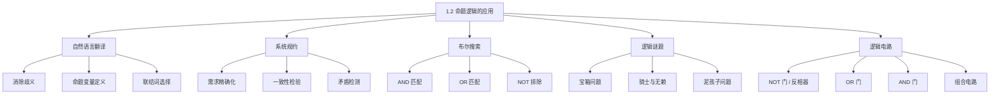

**相关笔记：** [[1.1 命题逻辑]] | [[1.3 命题等价]]

> [!abstract] 概览
> 本节展示 [[1.1 命题逻辑]] 中学到的逻辑工具在多个实际领域中的应用，核心在于==将自然语言的模糊性转化为逻辑表达式的精确性==。
>
> - ==自然语言翻译==是消除歧义的关键步骤，将英语/中文句子转化为命题逻辑公式
> - ==系统规约（system specification）==用逻辑表达式精确描述软硬件需求，并检验规约的==一致性（consistency）==
> - ==布尔搜索（Boolean search）==利用 AND、OR、NOT 联结词在大型信息集合中精确检索
> - ==逻辑谜题（logic puzzle）==通过命题建模和逻辑推理训练形式化思维能力
> - ==逻辑电路（logic circuit）==将命题逻辑直接映射为数字电路设计，是计算机硬件的基础

---

## 一、知识结构总览

---

## 二、核心思想

> [!tip] 核心思想
> ### 1. 将英语句子翻译为逻辑表达式

### 1. 将英语句子翻译为逻辑表达式

> [!tip] 翻译方法论
> >
> 将自然语言翻译为命题逻辑的一般步骤：
>
> 1. **识别原子命题**：将句子分解为最基本的陈述成分
> 2. **定义命题变量**：为每个原子命题分配一个字母（$a, b, c, \ldots$ 或 $p, q, r, \ldots$）
> 3. **选择逻辑联结词**：根据句子中的关键词（"and"、"or"、"if...then"、"only if"、"unless" 等）选择对应的逻辑联结词
> 4. **组合表达式**：按照句子的逻辑结构组合命题变量

> [!example] 翻译示例 1
> >
> "You can access the Internet from campus only if you are a computer science major or you are not a freshman."

**步骤分析**：

1. 定义命题变量：
   - $a$："You can access the Internet from campus"
   - $c$："You are a computer science major"
   - $f$："You are a freshman"

2. 关键词分析：
   - "only if" 对应条件语句 $a \to (\text{...})$
   - "or" 对应析取 $\lor$
   - "not a freshman" 对应 $\neg f$

3. 最终表达式：$a \to (c \lor \neg f)$

> [!example] 翻译示例 2
> >
> "You cannot ride the roller coaster if you are under 4 feet tall unless you are older than 16 years old."

**步骤分析**：

1. 定义命题变量：
   - $q$："You can ride the roller coaster"
   - $r$："You are under 4 feet tall"
   - $s$："You are older than 16 years old"

2. 关键词分析：
   - "cannot ride" 对应 $\neg q$
   - "if" 引出条件，"unless" 等价于 "if not"
   - 整句逻辑：如果你身高不足4英尺**且**你不超过16岁，则不能乘坐
   - 即：$(r \land \neg s) \to \neg q$

3. 最终表达式：$(r \land \neg s) \to \neg q$

> [!warning] "unless" 的处理
> "$q$ unless $\neg p$" 等价于 $p \to q$。例如 "You will get an A unless you don't study" 等价于 "If you study, you will get an A"。翻译 "unless" 时，将其替换为 "if not" 往往更清晰。

### 2. 系统规约

> [!def] 系统规约（System Specification）
> >
> 在软硬件工程中，系统规约是使用逻辑表达式精确描述系统需求的过程。规约必须满足==一致性（consistency）==——即所有规约不能相互矛盾，否则无法开发出满足所有需求的系统。

> [!example] 系统规约示例
> >
> "The automated reply cannot be sent when the file system is full."

定义变量：
- $p$："The automated reply can be sent"
- $q$："The file system is full"

翻译：$q \to \neg p$（如果文件系统满了，则不能发送自动回复）

> [!example] 一致性检验
> >
> 判断以下系统规约是否一致：
>
> 1. "The diagnostic message is stored in the buffer or it is retransmitted." $\to p \lor q$
> 2. "The diagnostic message is not stored in the buffer." $\to \neg p$
> 3. "If the diagnostic message is stored in the buffer, then it is retransmitted." $\to p \to q$

**推理过程**：

1. 由 $\neg p$ 为真，得 $p = F$
2. 由 $p \lor q$ 为真且 $p = F$，得 $q = T$
3. 验证 $p \to q$：$F \to T = T$ ✓

三者在 $p = F, q = T$ 时同时为真，因此规约是**一致的**。

> [!example] 不一致性检验
> >
> 在上述规约基础上，添加第四条：
>
> 4. "The diagnostic message is not retransmitted." $\to \neg q$

由前面的推理，唯一使前三条同时为真的赋值是 $p = F, q = T$。但 $\neg q$ 在 $q = T$ 时为假。因此四条规约**不一致**。

> [!tip] 一致性检验方法
> 检验一组规约是否一致，就是寻找是否存在一组真值赋值使得所有规约同时为真。如果存在，则一致；如果不存在（即所有可能的赋值都至少使一条规约为假），则不一致。

### 3. 布尔搜索

> [!def] 布尔搜索（Boolean Search）
> >
> 布尔搜索利用命题逻辑的联结词在大型信息集合（如网页索引）中进行精确检索：
>
> | 搜索运算符 | 逻辑联结词 | 含义 |
> |-----------|-----------|------|
> | AND | $\land$ | 匹配同时包含两个搜索词的记录 |
> | OR | $\lor$ | 匹配包含至少一个搜索词的记录 |
> | NOT（或 AND NOT） | $\neg$ | 排除包含特定搜索词的记录 |

> [!example] 布尔搜索示例
> >
> **目标**：查找关于新墨西哥州（New Mexico）大学的网页
>
> | 搜索表达式 | 匹配内容 |
> |-----------|---------|
> | `NEW AND MEXICO AND UNIVERSITIES` | 同时包含三个词的页面（但也会匹配墨西哥的新大学） |
> | `"NEW MEXICO" AND UNIVERSITIES` | 包含短语 "NEW MEXICO" 和词 UNIVERSITIES 的页面 |
> | `(NEW MEXICO OR ARIZONA) AND UNIVERSITIES` | 包含 UNIVERSITIES 且包含 NEW MEXICO 或 ARIZONA 的页面 |
> | `(MEXICO AND UNIVERSITIES) NOT NEW` | 包含 MEXICO 和 UNIVERSITIES 但不包含 NEW 的页面 |

> [!tip] 搜索引擎中的布尔运算
> 在 Google 等现代搜索引擎中，AND 是默认行为（所有搜索词都必须出现），OR 需要显式写出，NOT 用减号 `-` 表示。例如 `MEXICO UNIVERSITIES -NEW`。

### 4. 逻辑谜题

#### 4.1 宝箱问题

> [!example] 宝箱问题
> >
> 三个宝箱，只有一个装有宝藏。宝箱铭文：
> - 宝箱 1："This trunk is empty."（$\neg p_1$）
> - 宝箱 2："This trunk is empty."（$\neg p_2$）
> - 宝箱 3："The treasure is in Trunk 2."（$p_2$）

女王说：只有一条铭文为真。

**求解过程**：

设 $p_i$ 表示"宝箱 $i$ 中有宝藏"（$i = 1, 2, 3$）。

女王的话翻译为逻辑表达式（恰好一条铭文为真）：

$$
(\neg p_1 \land \neg(\neg p_2) \land \neg p_2) \lor (\neg(\neg p_1) \land \neg p_2 \land \neg p_2) \lor (\neg(\neg p_1) \land \neg(\neg p_2) \land p_2)
$$

化简（利用 [[1.3 命题等价]] 中的等价律）：

1. 第一个子式：$\neg p_1 \land p_2 \land \neg p_2 = \neg p_1 \land F = F$（矛盾，不可能）
2. 第二个子式：$p_1 \land \neg p_2 \land \neg p_2 = p_1 \land \neg p_2$
3. 第三个子式：$p_1 \land p_2 \land p_2 = p_1 \land p_2$

所以：$(p_1 \land \neg p_2) \lor (p_1 \land p_2) = p_1 \land (\neg p_2 \lor p_2) = p_1 \land T = p_1$

**结论**：宝藏在宝箱 1 中（$p_1 = T$），宝箱 2 的铭文是唯一为真的。

#### 4.2 骑士与无赖（Knights and Knaves）

> [!def] 骑士与无赖
> >
> Raymond Smullyan 提出的经典逻辑谜题：
> - ==骑士（knight）==：总是说真话
> - ==无赖（knave）==：总是说谎话

> [!example] 骑士与无赖问题
> >
> A 说："B is a knight." B 说："The two of us are opposite types."

设 $p$："A is a knight"，$q$："B is a knight"。

**推理过程**：

**情况 1**：假设 A 是骑士（$p = T$）
- A 说真话 $\Rightarrow$ B 是骑士（$q = T$）
- B 说真话 $\Rightarrow$ "A 和 B 是不同类型"为真
- 但 A 和 B 都是骑士，是相同类型 $\Rightarrow$ 矛盾！
- 因此 $p = F$，A 不是骑士

**情况 2**：A 是无赖（$p = F$）
- A 说谎 $\Rightarrow$ "B is a knight" 为假 $\Rightarrow$ $q = F$，B 也是无赖
- B 说谎 $\Rightarrow$ "A 和 B 是不同类型" 为假
- A 和 B 都是无赖，确实是相同类型 $\Rightarrow$ 与"不同类型为假"一致 ✓

**结论**：A 和 B 都是无赖。

#### 4.3 泥孩子问题（Muddy Children Puzzle）

> [!example] 泥孩子问题
> >
> 父亲对两个孩子说："你们中至少一个人额头上有泥。" 然后问："你知道自己额头上有泥吗？" 问两次。

设 $s$："儿子额头有泥"，$d$："女儿额头有泥"。两个孩子都有泥，即 $s = T, d = T$。

**第一次提问**：
- 儿子看到女儿有泥（$d = T$），知道 $s \lor d$ 为真，但无法确定 $s$ 是否为真 $\to$ 回答 "No"
- 女儿看到儿子有泥（$s = T$），知道 $s \lor d$ 为真，但无法确定 $d$ 是否为真 $\to$ 回答 "No"

**第二次提问**：
- 儿子推理：女儿第一次回答 "No"，说明女儿不确定自己是否有泥。如果女儿没有泥（$d = F$），那么女儿看到儿子有泥（$s = T$），且知道 $s \lor d$ 为真，就会立即知道 $s$ 必须为真，从而回答 "Yes"。但女儿回答了 "No"，说明 $d$ 不可能为假，即 $d = T$。但儿子已经知道 $d = T$（看到了），这个推理不能帮儿子确定 $s$。

等等，让我们更仔细地分析：

**第二次提问的推理**：
- 儿子知道：$s \lor d$ 为真（父亲说的），$d = T$（看到的）
- 儿子还知道：女儿第一次回答 "No"
- 儿子推理：如果 $s = F$，那么女儿看到 $s = F$，但知道 $s \lor d$ 为真，所以女儿能推出 $d = T$，就会在第一次回答 "Yes"。但女儿回答了 "No"，所以 $s \neq F$，即 $s = T$。
- 女儿做对称推理，得出 $d = T$。

**结论**：两个孩子第二次都回答 "Yes"。

### 5. 逻辑电路

> [!def] 逻辑门（Logic Gates）
> >
> 命题逻辑可以直接映射到数字电路设计。三种基本逻辑门：
>
> | 逻辑门 | 符号 | 输入 | 输出 | 对应逻辑运算 |
> |--------|------|------|------|-------------|
> | ==反相器（Inverter）/ NOT 门== | NOT | $p$ | $\neg p$ | 否定 |
> | ==OR 门== | OR | $p, q$ | $p \lor q$ | 析取 |
> | ==AND 门== | AND | $p, q$ | $p \land q$ | 合取 |

> [!example] 分析组合电路
> >
> 给定电路：输入 $p, q, r$，输出 $(p \land \neg q) \lor \neg r$

**电路结构**：
1. 对 $q$ 取反得到 $\neg q$（NOT 门）
2. 将 $p$ 和 $\neg q$ 做合取得到 $p \land \neg q$（AND 门）
3. 对 $r$ 取反得到 $\neg r$（NOT 门）
4. 将 $p \land \neg q$ 和 $\neg r$ 做析取得到最终输出（OR 门）

> [!example] 根据逻辑表达式构造电路
> >
> 构造输出为 $(p \lor \neg r) \land (\neg p \lor (q \lor \neg r))$ 的电路：

**分解步骤**：
1. 构造子电路 $(p \lor \neg r)$：
   - NOT 门：$r \to \neg r$
   - OR 门：$p, \neg r \to p \lor \neg r$
2. 构造子电路 $(\neg p \lor (q \lor \neg r))$：
   - NOT 门：$r \to \neg r$（可复用）
   - OR 门：$q, \neg r \to q \lor \neg r$
   - NOT 门：$p \to \neg p$
   - OR 门：$\neg p, (q \lor \neg r) \to \neg p \lor (q \lor \neg r)$
3. 用 AND 门组合两个子电路的输出

> [!tip] 逻辑电路与命题逻辑的对应关系
> 每一个命题逻辑表达式都可以对应一个逻辑电路，反之亦然。这种对应关系是布尔代数（[[1.3 命题等价]] 和第12章）的核心应用。电路化简对应逻辑表达式化简，可以减少硬件成本。

---

## 三、补充理解与易混淆点

### 补充理解

### 1. 逻辑在软件工程形式化方法中的应用

将自然语言需求翻译为逻辑表达式不仅是学术练习，更是工业界**形式化方法（formal methods）**的核心。在安全攸关系统（如航空控制、医疗设备、核反应堆）的开发中，使用逻辑规约语言（如 Z、VDM、TLA+、Alloy）精确描述系统行为，并通过模型检测（model checking）自动验证系统是否满足规约。例如，Amazon Web Services 使用 TLA+ 对其分布式系统（如 DynamoDB）进行形式化验证，在部署前发现了多个微妙的设计缺陷。这种方法的核心思想与本节介绍的"系统规约 + 一致性检验"完全一致。

- **来源**: Newcombe, C., et al. (2014). "Formal Methods in Practice at Amazon Web Services." *Abstract State Machines, Alloy, B, TLA, VDM, and Z (ABZ)*, LNCS 8477, 3-17. [https://doi.org/10.1007/978-3-662-43652-3_1](https://doi.org/10.1007/978-3-662-43652-3_1)
>
> **网络资源：**
> - [Logic Calculator - Circuit Visualization](https://logic-calculator.com/) -- 将逻辑表达式可视化为 IEEE 标准逻辑门电路图

### 2. 布尔搜索与信息检索的演进

布尔搜索是信息检索（Information Retrieval）领域的基石。早期的信息检索系统（如 1960 年代的 MEDLINE）完全依赖布尔查询模型。虽然现代搜索引擎（Google、Bing）已发展出基于概率排序的模型（如 PageRank、BM25），布尔逻辑仍然是查询语法的基础组成部分。在专业数据库检索（如法律数据库 Westlaw、学术数据库 PubMed）中，布尔搜索仍然是核心检索方式。理解布尔逻辑的 AND/OR/NOT 运算对于有效利用这些工具至关重要。更高级的检索系统还引入了模糊逻辑（fuzzy logic），允许对查询结果进行相关性排序而非简单的二元匹配。

- **来源**: Manning, C. D., Raghavan, P., & Schutze, H. (2008). *Introduction to Information Retrieval*. Cambridge University Press. [https://nlp.stanford.edu/IR-book/](https://nlp.stanford.edu/IR-book/)
>
> **网络资源：**
> - [Truth Table Generator with Venn Diagram](https://www.truthtablegenerator.site/truth-table-generator-with-venn-diagram-visualization/) -- 真值表与 Venn 图联动可视化

### 易混淆点

### 1. "only if" vs "if" 的翻译方向

- ❌ 将 "You can graduate only if you pass all exams" 翻译为 "If you pass all exams, you can graduate"（$q \to p$）
- ✅ 正确翻译为 "If you can graduate, then you passed all exams"（$p \to q$）。"only if" 表示必要条件：通过考试是毕业的必要条件，即毕业 $\to$ 通过考试。注意 "$p$ only if $q$" 等价于 $p \to q$，而非 $q \to p$

### 2. 系统规约的一致性 vs 正确性

- ❌ 认为一致的规约一定是正确的、合理的
- ✅ 一致性（consistency）仅意味着规约之间不矛盾，**不保证**规约本身是正确或合理的。例如，"系统总是返回错误"和"系统从不返回错误"是不一致的（矛盾），但"系统总是返回错误"和"系统在用户输入时返回错误"是一致的（不矛盾），尽管前者可能不是好的设计

---

## 四、习题精选

> [!todo] 习题概览
> | 题号范围 | 核心考点 | 难度 |
> |---------|---------|------|
> | 1-6 | 自然语言翻译为命题逻辑 | ⭐⭐ |
> | 7-8 | 系统规约的逻辑表达 | ⭐⭐ |
> | 9-12 | 系统规约一致性检验 | ⭐⭐⭐ |
> | 13-16 | 布尔搜索表达式构造 | ⭐⭐ |
> | 17-18 | 宝箱问题变体 | ⭐⭐⭐ |
> | 19-22 | 骑士与无赖谜题 | ⭐⭐⭐ |
> | 23-35 | 骑士、无赖与间谍谜题 | ⭐⭐⭐⭐ |
> | 36-42 | 逻辑推理综合题 | ⭐⭐⭐⭐ |
> | 44-47 | 逻辑电路分析与构造 | ⭐⭐⭐ |

### 题1：系统规约一致性检验

> [!problem] 题目
> 判断以下系统规约是否一致：
> 1. "当文件系统满时，不能发送自动回复。"（$q 	o 
eg p$）
> 2. "诊断消息存储在缓冲区中或被重传。"（$p \lor q$）
> 3. "诊断消息没有存储在缓冲区中。"（$
eg p$）
> 4. "如果诊断消息存储在缓冲区中，则被重传。"（$p 	o q$）

> [!faq]- 解答
> 设 $p$："诊断消息存储在缓冲区中"，$q$："文件系统满"。
>
> 由 (3) $
eg p$ 为真，得 $p = F$。
>
> 由 (1) $q 	o 
eg p$：$q 	o T$，无论 $q$ 取何值都为真。
>
> 由 (2) $p \lor q$：$F \lor q = q$，需要 $q = T$。
>
> 验证 (4) $p 	o q$：$F 	o T = T$ ✓
>
> 在 $p = F, q = T$ 时所有规约同时为真，因此规约是**一致的**。
>
> $lacksquare$

### 题2：自然语言翻译为命题逻辑

> [!problem] 题目
> 将"如果天下雨且我出门，我就带伞"翻译为命题逻辑公式。定义所有使用的命题变量。

> [!faq]- 解答
> 定义命题变量：
> - $p$："天下雨"
> - $q$："我出门"
> - $r$："我带伞"
>
> 原句的结构为"如果（天下雨 且 我出门），就（带伞）"，即：
> $$ (p \land q) \to r $$
>
> 注意：这里的"且"对应合取 $\land$，"如果...就..."对应条件语句 $\to$。括号确保了"天下雨且我出门"作为一个整体作为条件语句的前件。
>
> $\blacksquare$

### 题3：判断逆命题是否等价

> [!problem] 题目
> 判断 $p \to q$ 与 $q \to p$（即逆命题）是否逻辑等价。用真值表验证。

> [!faq]- 解答
> 构造真值表对比两列：
>
> $$
> \begin{array}{|c|c|c|c|}
> \hline
> p & q & p \to q & q \to p \\
> \hline
> T & T & T & T \\
> T & F & F & T \\
> F & T & T & F \\
> F & F & T & T \\
> \hline
> \end{array}
> $$
>
> 第3列与第4列**不完全相同**（第2行和第3行不同），因此 $p \to q \not\equiv q \to p$。
>
> 这说明条件语句的**逆命题与原命题一般不等价**。例如，"如果下雨则地湿"为真，但"如果地湿则下雨"不一定为真（地湿可能有其他原因）。
>
> $\blacksquare$

### 题4：用命题逻辑建模多数表决系统

> [!problem] 题目
> 一个系统有3个开关 $s_1, s_2, s_3$，当至少2个开关开启时系统运行。用命题逻辑写出系统运行的逻辑表达式。

> [!faq]- 解答
> 设 $s_i$（$i = 1, 2, 3$）表示"开关 $i$ 开启"（$T$ = 开启，$F$ = 关闭）。
>
> "至少2个开启"意味着以下三种情况之一成立：
> - $s_1$ 和 $s_2$ 都开启（$s_1 \land s_2$）
> - $s_1$ 和 $s_3$ 都开启（$s_1 \land s_3$）
> - $s_2$ 和 $s_3$ 都开启（$s_2 \land s_3$）
>
> 因此系统运行的逻辑表达式为：
> $$ (s_1 \land s_2) \lor (s_1 \land s_3) \lor (s_2 \land s_3) $$
>
> 验证：当恰好2个开关开启时，三个合取式中恰好一个为真，析取结果为真。当3个开关都开启时，三个合取式全为真，析取结果为真。当0个或1个开关开启时，所有合取式都为假，析取结果为假。符合要求。
>
> $\blacksquare$

### 题5：设计4人委员会多数决投票系统

> [!problem] 题目
> 设计一个4人委员会投票系统（多数决，即至少3人赞成时提案通过）。设4个委员为 $a, b, c, d$，用命题逻辑写出所有通过条件。

> [!faq]- 解答
> 设 $a, b, c, d$ 分别表示4个委员投赞成票（$T$ = 赞成，$F$ = 反对）。
>
> "至少3人赞成"意味着以下 $\binom{4}{3} = 4$ 种情况之一成立：
> - $a, b, c$ 赞成：$a \land b \land c$
> - $a, b, d$ 赞成：$a \land b \land d$
> - $a, c, d$ 赞成：$a \land c \land d$
> - $b, c, d$ 赞成：$b \land c \land d$
>
> 提案通过的逻辑表达式为：
> $$ (a \land b \land c) \lor (a \land b \land d) \lor (a \land c \land d) \lor (b \land c \land d) $$
>
> 可以化简（提取公因子）：
> $$ (a \land b \land (c \lor d)) \lor (c \land d \land (a \lor b)) $$
>
> 验证：
> - 4人全赞成：所有4项为真，结果为真 ✓
> - 恰好3人赞成：恰好1项为真，结果为真 ✓
> - 恰好2人赞成：没有任何3人组合同时为真，结果为假 ✓
> - 1人或0人赞成：结果为假 ✓
>
> $\blacksquare$

---

> [!tip] 解题思路提示
> 1. **自然语言翻译**：先定义命题变量，再识别关键词（"only if"、"unless"等），最后组合表达式
> 2. **一致性检验**：寻找使所有规约同时为真的赋值，若存在则一致
> 3. **布尔搜索**：AND = 同时包含，OR = 至少一个，NOT = 排除

## 五、视频学习指南

> [!info] 视频资源
> | 资源 | 链接 | 对应内容 | 备注 |
> |:-----|:-----|:---------|:-----|
> | Rosen 8e Section 1.2 | [教材原文](https://www.mheducation.com/highered/product/discrete-mathematics-applications-rosen/M9781259676512.html) | 命题逻辑的应用完整内容 | 英文教材 |
> | MIT 6.042J Lectures | [链接](https://www.youtube.com/results?search_query=MIT+6.042+discrete+math) | 对应章节讲解 | 英文，MIT开放课程 |
> | TrevTutor Discrete Math | [链接](https://www.youtube.com/results?search_query=TrevTutor+discrete+math) | 知识点精讲 | 英文，适合入门 |

---

## 六、教材原文

> [!quote] 教材原文
> "Translating sentences in natural language (such as English) into logical expressions is an essential part of specifying both hardware and software systems."
>
> "We can use Boolean searches to find relevant Web pages. These searches employ techniques from propositional logic."

---

## 参见 Wiki

- [[逻辑学/concepts/命题]] — 命题的基本概念
- [[逻辑学/concepts/实质蕴涵]] — 条件语句的深入理解
- [[逻辑学/concepts/逻辑形式]] — 逻辑形式与论证结构

--

- [[离散数学/concepts/命题逻辑]] — 基于命题和逻辑联结词的形式逻辑系统
- [[离散数学/concepts/逻辑电路]] — 使用逻辑门实现布尔函数的电子电路

#学习/离散数学/逻辑与证明

