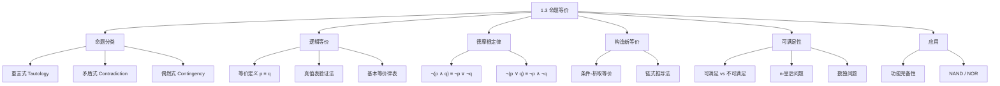

**相关笔记：** [[1.2 命题逻辑的应用]] | [[1.4 谓词与量词]]

> [!abstract] 概览
> 本节是命题逻辑的"代数"部分，核心是研究==逻辑等价（logical equivalence）==——两个复合命题在所有可能的真值赋值下具有相同真值的关系。通过建立一套系统的==逻辑恒等式（logical identities）==，我们可以在不使用真值表的情况下化简和变换逻辑表达式。
>
> - ==重言式（tautology）== 永远为真，==矛盾式（contradiction）== 永远为假，==偶然式（contingency）== 有时真有时假
> - 两个命题 $p$ 和 $q$ 逻辑等价（$p \equiv q$）当且仅当 $p \leftrightarrow q$ 是重言式
> - ==德摩根定律（De Morgan's Laws）== 是最重要的等价律之一，揭示了否定与合取/析取的对偶关系
> - 利用已知的等价律进行==逐步替换==，可以高效地建立新的等价关系，避免构造庞大的真值表
> - ==可满足性（satisfiability）== 问题是判断是否存在使复合命题为真的赋值，是计算机科学中的核心问题
> - $n$ 个变量的真值表有 $2^n$ 行，当 $n$ 较大时，使用等价律推导比真值表更高效

---

## 一、知识结构总览

---

## 二、核心思想

> [!tip] 核心思想
> ### 1. 命题的分类

### 1. 命题的分类

> [!def] 重言式、矛盾式与偶然式
>
> | 类型 | 定义 | 符号 | 示例 |
> |------|------|------|------|
> | ==重言式（tautology）== | 无论变量取何值，复合命题**始终为真** | 恒等于 $T$ | $p \lor \neg p$ |
> | ==矛盾式（contradiction）== | 无论变量取何值，复合命题**始终为假** | 恒等于 $F$ | $p \land \neg p$ |
> | ==偶然式（contingency）== | 既不是重言式也不是矛盾式 | — | $p \lor q$ |

$$
\begin{array}{|c|c|c|c|}
\hline
p & \neg p & p \lor \neg p & p \land \neg p \\
\hline
T & F & T & F \\
F & T & T & F \\
\hline
\end{array}
$$

- $p \lor \neg p$（排中律）在所有情况下为真 $\to$ **重言式**
- $p \land \neg p$（矛盾律）在所有情况下为假 $\to$ **矛盾式**

### 2. 逻辑等价的定义与判定

> [!def] 逻辑等价（Logical Equivalence）
>
> 两个复合命题 $p$ 和 $q$ 称为==逻辑等价==的，如果 $p \leftrightarrow q$ 是一个重言式。记为 $p \equiv q$。

> [!tip] 等价符号的含义
> $\equiv$ 不是逻辑联结词，$p \equiv q$ 本身不是一个命题，而是关于两个命题的**元陈述**（meta-statement），表示"在所有真值赋值下 $p$ 和 $q$ 具有相同的真值"。有时也用 $\Leftrightarrow$ 代替 $\equiv$。

**判定方法**：构造 $p$ 和 $q$ 的真值表，如果两列完全相同，则 $p \equiv q$。

### 3. 重要逻辑等价律

#### 3.1 基本等价律（表 6）

> [!def] 基本逻辑等价律
>
> | 等价律 | 名称 |
> |--------|------|
> | $p \land T \equiv p$ $p \lor F \equiv p$ | ==恒等律（Identity Laws）== |
> | $p \lor T \equiv T$ $p \land F \equiv F$ | ==支配律（Domination Laws）== |
> | $p \lor p \equiv p$ $p \land p \equiv p$ | ==幂等律（Idempotent Laws）== |
> | $\neg(\neg p) \equiv p$ | ==双重否定律（Double Negation Law）== |
> | $p \lor q \equiv q \lor p$ $p \land q \equiv q \land p$ | ==交换律（Commutative Laws）== |
> | $(p \lor q) \lor r \equiv p \lor (q \lor r)$ $(p \land q) \land r \equiv p \land (q \land r)$ | ==结合律（Associative Laws）== |
> | $p \lor (q \land r) \equiv (p \lor q) \land (p \lor r)$ $p \land (q \lor r) \equiv (p \land q) \lor (p \land r)$ | ==分配律（Distributive Laws）== |
> | $\neg(p \land q) \equiv \neg p \lor \neg q$ $\neg(p \lor q) \equiv \neg p \land \neg q$ | ==德摩根定律（De Morgan's Laws）== |
> | $p \lor (p \land q) \equiv p$ $p \land (p \lor q) \equiv p$ | ==吸收律（Absorption Laws）== |
> | $p \lor \neg p \equiv T$ $p \land \neg p \equiv F$ | ==否定律（Negation Laws）== |

#### 3.2 条件语句等价律（表 7）

> [!def] 条件语句等价律
>
> | 等价关系 | 名称 |
> |---------|------|
> | $p \to q \equiv \neg p \lor q$ | ==条件-析取等价== |
> | $p \to q \equiv \neg q \to \neg p$ | ==逆否等价== |
> | $\neg(p \to q) \equiv p \land \neg q$ | ==条件的否定== |
> | $p \lor q \equiv \neg p \to q$ | 析取-条件等价 |
> | $p \land q \equiv \neg(p \to \neg q)$ | 合取-条件等价 |
> | $(p \to q) \land (p \to r) \equiv p \to (q \land r)$ | 前件相同合并 |
> | $(p \to r) \land (q \to r) \equiv (p \lor q) \to r$ | 后件相同合并 |
> | $(p \to q) \lor (p \to r) \equiv p \to (q \lor r)$ | 前件相同析取合并 |
> | $(p \to r) \lor (q \to r) \equiv (p \land q) \to r$ | 后件相同析取合并 |

#### 3.3 双条件语句等价律（表 8）

> [!def] 双条件语句等价律
>
> | 等价关系 |
> |---------|
> | $p \leftrightarrow q \equiv (p \to q) \land (q \to p)$ |
> | $p \leftrightarrow q \equiv \neg p \leftrightarrow \neg q$ |
> | $p \leftrightarrow q \equiv (p \land q) \lor (\neg p \land \neg q)$ |
> | $\neg(p \leftrightarrow q) \equiv p \leftrightarrow \neg q$ |

### 4. 德摩根定律的深入理解

> [!tip] 德摩根定律的核心思想
>
> 德摩根定律揭示了**否定运算**与**合取/析取运算**之间的对偶关系：

$$
\neg(p \land q) \equiv \neg p \lor \neg q \qquad \text{（合取的否定 = 否定的析取）}
$$

$$
\neg(p \lor q) \equiv \neg p \land \neg q \qquad \text{（析取的否定 = 否定的合取）}
$$

**记忆口诀**：否定"深入"括号内部，同时将 $\land$ 变为 $\lor$（或将 $\lor$ 变为 $\land$）。

> [!example] 德摩根定律的应用
>
> **例 1**：求 "Miguel has a cellphone and he has a laptop computer" 的否定。

设 $p$："Miguel has a cellphone"，$q$："Miguel has a laptop computer"。

原命题：$p \land q$

否定：$\neg(p \land q) \equiv \neg p \lor \neg q$

翻译："Miguel does not have a cellphone or he does not have a laptop computer."

**例 2**：求 "Heather will go to the concert or Steve will go to the concert" 的否定。

设 $r$："Heather will go to the concert"，$s$："Steve will go to the concert"。

原命题：$r \lor s$

否定：$\neg(r \lor s) \equiv \neg r \land \neg s$

翻译："Heather will not go to the concert and Steve will not go to the concert."

> [!warning] 德摩根定律的常见错误
> ❌ $\neg(p \land q) \equiv \neg p \land \neg q$（忘记交换运算符）
> ❌ $\neg(p \lor q) \equiv \neg p \lor \neg q$（忘记交换运算符）
> ✅ 否定时必须同时做两件事：(1) 对每个分量取否定；(2) 将 $\land$ 变为 $\lor$（或反之）

#### 德摩根定律的推广

对于 $n$ 个命题 $p_1, p_2, \ldots, p_n$：

$$
\neg\left(\bigvee_{j=1}^{n} p_j\right) \equiv \bigwedge_{j=1}^{n} \neg p_j
$$

$$
\neg\left(\bigwedge_{j=1}^{n} p_j\right) \equiv \bigvee_{j=1}^{n} \neg p_j
$$

### 5. 利用等价律构造新等价

> [!tip] 链式推导法（Chain of Equivalences）
>
> 当真值表过大（变量太多）时，可以利用已知的等价律，通过逐步替换来证明新的等价关系。每一步必须标注所使用的等价律。

> [!example] 证明 $\neg(p \to q) \equiv p \land \neg q$
>
> **推导过程**：
>
> $$
> \begin{aligned}
> \neg(p \to q) &\equiv \neg(\neg p \lor q) && \text{（条件-析取等价）} \\
> &\equiv \neg(\neg p) \land \neg q && \text{（德摩根定律：$\neg(p \lor q) \equiv \neg p \land \neg q$）} \\
> &\equiv p \land \neg q && \text{（双重否定律）}
> \end{aligned}
> $$

> [!tip] 这个等价非常重要
> 它告诉我们：条件语句 $p \to q$ 为假，当且仅当 $p$ 为真且 $q$ 为假。这与条件语句的真值表定义完全一致。

> [!example] 证明 $\neg(p \lor (\neg p \land q)) \equiv \neg p \land \neg q$
>
> **推导过程**：
>
> $$
> \begin{aligned}
> \neg(p \lor (\neg p \land q)) &\equiv \neg p \land \neg(\neg p \land q) && \text{（德摩根定律）} \\
> &\equiv \neg p \land (\neg(\neg p) \lor \neg q) && \text{（德摩根定律）} \\
> &\equiv \neg p \land (p \lor \neg q) && \text{（双重否定律）} \\
> &\equiv (\neg p \land p) \lor (\neg p \land \neg q) && \text{（分配律：$\land$ 对 $\lor$ 的分配）} \\
> &\equiv F \lor (\neg p \land \neg q) && \text{（$\neg p \land p \equiv F$，否定律）} \\
> &\equiv (\neg p \land \neg q) \lor F && \text{（交换律）} \\
> &\equiv \neg p \land \neg q && \text{（恒等律：$x \lor F \equiv x$）}
> \end{aligned}
> $$

> [!example] 证明 $(p \land q) \to (p \lor q)$ 是重言式
>
> **推导过程**：
>
> $$
> \begin{aligned}
> (p \land q) \to (p \lor q) &\equiv \neg(p \land q) \lor (p \lor q) && \text{（条件-析取等价）} \\
> &\equiv (\neg p \lor \neg q) \lor (p \lor q) && \text{（德摩根定律）} \\
> &\equiv (\neg p \lor p) \lor (\neg q \lor q) && \text{（交换律 + 结合律）} \\
> &\equiv T \lor T && \text{（否定律：$p \lor \neg p \equiv T$）} \\
> &\equiv T && \text{（支配律：$T \lor T \equiv T$）}
> \end{aligned}
> $$
>
> 由于最终结果为 $T$，原命题是**重言式**。

### 6. 可满足性

> [!def] 可满足性（Satisfiability）
>
> 一个复合命题称为==可满足的（satisfiable）==，如果存在至少一组真值赋值使其为真。如果不存在任何赋值使其为真，则称为==不可满足的（unsatisfiable）==。

> [!tip] 可满足性与重言式/矛盾式的关系
> - 重言式一定可满足（实际上所有赋值都使其为真）
> - 偶然式也可满足（至少一组赋值使其为真）
> - 矛盾式不可满足（没有赋值使其为真）
> - 一个命题不可满足 $\iff$ 其否定是重言式

> [!example] 可满足性判定
>
> 判断以下命题的可满足性：

**命题 1**：$(p \lor \neg q) \land (q \lor \neg r) \land (r \lor \neg p)$

**推理**（不使用真值表）：当 $p, q, r$ 取相同真值时：
- 若 $p = q = r = T$：$(T \lor F) \land (T \lor F) \land (T \lor F) = T \land T \land T = T$ ✓
- 因此命题 1 是**可满足的**

**命题 2**：$(p \lor q \lor r) \land (\neg p \lor \neg q \lor \neg r)$

**推理**：当 $p, q, r$ 中至少一个为真且至少一个为假时：
- 例如 $p = T, q = T, r = F$：$(T \lor T \lor F) \land (F \lor F \lor T) = T \land T = T$ ✓
- 因此命题 2 是**可满足的**

**命题 3**：$(p \lor \neg q) \land (q \lor \neg r) \land (r \lor \neg p) \land (p \lor q \lor r) \land (\neg p \lor \neg q \lor \neg r)$

**推理**：
- 前三个子式要求 $p, q, r$ 取相同真值（命题 1 的分析）
- 后两个子式要求至少一个为真且至少一个为假（命题 2 的分析）
- 这两个条件**矛盾**：不可能同时满足
- 因此命题 3 是**不可满足的**

### 7. 可满足性的应用

#### 7.1 n-皇后问题

> [!def] n-皇后问题的 SAT 建模
>
> 将 $n$ 个皇后放置在 $n \times n$ 棋盘上，使得没有两个皇后可以互相攻击（不在同一行、同一列、同一对角线）。

**变量定义**：$p(i, j)$ 表示"在位置 $(i, j)$ 有皇后"，$i, j = 1, 2, \ldots, n$。

**约束条件**：

| 约束 | 逻辑表达式 | 含义 |
|------|-----------|------|
| 每行至少一个皇后 | $\displaystyle\bigwedge_{i=1}^{n}\bigvee_{j=1}^{n} p(i,j)$ | $Q_1$ |
| 每行至多一个皇后 | $\displaystyle\bigwedge_{i=1}^{n}\bigwedge_{1 \le j < k \le n}(\neg p(i,j) \lor \neg p(i,k))$ | $Q_2$ |
| 每列至多一个皇后 | $\displaystyle\bigwedge_{j=1}^{n}\bigwedge_{1 \le i < k \le n}(\neg p(i,j) \lor \neg p(k,j))$ | $Q_3$ |
| 对角线约束 | $Q_4$ 和 $Q_5$（类似结构） | — |

**完整 SAT 公式**：$Q = Q_1 \wedge Q_2 \wedge Q_3 \wedge Q_4 \wedge Q_5$

当 $n = 8$ 时，共有 92 个解。

#### 7.2 数独问题（Sudoku）

> [!def] 数独问题的 SAT 建模
>
> 在 $9 \times 9$ 的网格中填入数字 1-9，使得每行、每列、每个 $3 \times 3$ 子网格都恰好包含 1-9 各一次。

**变量定义**：$p(i, j, n)$ 表示"在第 $i$ 行第 $j$ 列填入数字 $n$"，共 $9 \times 9 \times 9 = 729$ 个变量。

**约束条件**：

1. **已知数字**：对每个给定的格子 $(i, j, n)$，断言 $p(i, j, n)$ 为真
2. **每行包含所有数字**：$\displaystyle\bigwedge_{i=1}^{9}\bigwedge_{n=1}^{9}\bigvee_{j=1}^{9} p(i,j,n)$
3. **每列包含所有数字**：$\displaystyle\bigwedge_{j=1}^{9}\bigwedge_{n=1}^{9}\bigvee_{i=1}^{9} p(i,j,n)$
4. **每个 $3 \times 3$ 子网格包含所有数字**：$\displaystyle\bigwedge_{r=0}^{2}\bigwedge_{s=0}^{2}\bigwedge_{n=1}^{9}\bigvee_{i=1}^{3}\bigvee_{j=1}^{3} p(3r+i, 3s+j, n)$
5. **每个格子恰好一个数字**：对所有 $n \neq n'$，断言 $p(i,j,n) \to \neg p(i,j,n')$

> [!tip] SAT 求解器的威力
> 使用现代 SAT 求解器，数独问题可以在不到 10 毫秒内解决。这展示了将组合问题建模为可满足性问题的强大能力。

### 8. 功能完备性

> [!def] 功能完备性（Functional Completeness）
>
> 一组逻辑运算符称为==功能完备的==，如果每个复合命题都逻辑等价于仅使用这组运算符构成的命题。

> [!example] 功能完备的运算符集合
>
> - $\{\neg, \land, \lor\}$ 是功能完备的（因为每个命题都可以化为合取范式或析取范式）
> - $\{\neg, \land\}$ 是功能完备的（因为 $p \lor q \equiv \neg(\neg p \land \neg q)$，用德摩根定律消去 $\lor$）
> - $\{\neg, \lor\}$ 是功能完备的（因为 $p \land q \equiv \neg(\neg p \lor \neg q)$）

> [!def] NAND 和 NOR
>
> - **NAND**（与非）：$p \mid q \equiv \neg(p \land q)$
> - **NOR**（或非）：$p \downarrow q \equiv \neg(p \lor q)$

NAND 和 NOR 各自单独构成功能完备的运算符集合：

- 用 NAND 表示否定：$p \mid p \equiv \neg(p \land p) \equiv \neg p$
- 用 NAND 表示析取：$(p \mid q) \mid (p \mid q) \equiv \neg(\neg(p \land q)) \equiv p \land q$，然后利用德摩根定律可得 $\lor$

> [!tip] 实际意义
> 在硬件设计中，NAND 门（或 NOR 门）可以单独实现所有逻辑功能，这意味着只需要一种类型的门就可以构建任意复杂的数字电路。这简化了芯片制造过程。

---

## 三、补充理解与易混淆点

### 补充理解

### 1. SAT 问题的计算复杂性与 NP 完全性

可满足性问题（SAT）不仅是逻辑学的基础问题，更是理论计算机科学的**核心问题**。1971 年，Stephen Cook 在其开创性论文 "The Complexity of Theorem Proving Procedures" 中证明了 SAT 是第一个被确认为 **NP 完全（NP-complete）** 的问题（Cook-Levin 定理）。这意味着：(1) SAT 本身是 NP 问题（给定一个赋值，可以在多项式时间内验证其是否满足公式）；(2) 所有 NP 问题都可以在多项式时间内归约为 SAT。尽管 SAT 是 NP 完全的，现代 SAT 求解器（基于 DPLL 算法和 CDCL——Conflict-Driven Clause Learning 技术）在实际应用中表现出惊人的效率，能够处理包含数百万变量的工业级实例，广泛应用于硬件验证、软件测试、人工智能规划等领域。

- **来源**: Cook, S. A. (1971). "The Complexity of Theorem Proving Procedures." *Proceedings of the 3rd Annual ACM Symposium on Theory of Computing*, 151-158. [https://doi.org/10.1145/800157.805047](https://doi.org/10.1145/800157.805047)
- **参考**: Mathkour, H. (2023). "On the Structure of the Boolean Satisfiability Problem: A Survey." *IEEE Access*. [https://doi.org/10.1109/ACCESS.2023.3248866](https://doi.org/10.1109/ACCESS.2023.3248866)
>
> **网络资源：**
> - [Truth Table Generator](https://www.truthtablegenerator.site/propositional-logic-truth-table-generator/) -- 自动判定命题公式是否为重言式/矛盾式

### 2. 逻辑等价与布尔代数的历史联系

本节中的逻辑等价律与第 12 章将学习的布尔代数恒等式在数学结构上是完全对应的。这种对应关系并非巧合：命题逻辑和布尔代数都是特殊的**布尔格（Boolean lattice）** 的实例。英国数学家 **Augustus De Morgan**（1806-1871）在 1840 年代对符号逻辑做出了基础性贡献，他发明的记法帮助证明了以他命名的德摩根定律。De Morgan 还在 1838 年给出了数学归纳法的第一个清晰解释，并在 1842 年提出了极限的精确定义。值得注意的是，De Morgan 的学生 Augusta Ada, Countess of Lovelace（1815-1852）被认为是世界上第一位程序员，她在为 Babbage 的分析机（Analytical Engine）撰写笔记时，深刻理解了逻辑运算与机械计算之间的联系，预见了通用计算机的概念。

- **来源**: De Morgan, A. (1847). *Formal Logic: or, The Calculus of Inference, Necessary and Probable*. Taylor and Walton.
- **参考**: Babbage, C. & Lovelace, A. A. (1843). "Sketch of the Analytical Engine." *Scientific Memoirs*, 3, 666-731.
>
> **网络资源：**
> - [Logic Calculator](https://logic-calculator.com/) -- 支持布尔代数运算与命题等价验证

### 易混淆点

### 1. 逻辑等价（$\equiv$）vs 双条件（$\leftrightarrow$）

- ❌ 将 $\equiv$ 和 $\leftrightarrow$ 混为一谈，认为它们是同一个东西
- ✅ $\leftrightarrow$ 是一个**逻辑联结词**，$p \leftrightarrow q$ 是一个**命题**（有真值）；$\equiv$ 是一个**元语言符号**，$p \equiv q$ 是一个**关于命题的陈述**（表示两个命题在所有赋值下真值相同）。虽然 $p \equiv q$ 成立当且仅当 $p \leftrightarrow q$ 是重言式，但两者的语法角色完全不同。类比：$\equiv$ 就像数学中的 $=$，而 $\leftrightarrow$ 就像运算符 $+$

### 2. 等价律的误用——混合运算符

- ❌ 对混合了 $\land$ 和 $\lor$ 的表达式直接套用交换律或结合律，如认为 $p \land (q \lor r) \equiv (p \land q) \lor r$
- ✅ 交换律和结合律**仅适用于同类运算符**。$p \land q \equiv q \land p$ 是正确的，但 $p \land (q \lor r) \not\equiv (p \land q) \lor r$。要处理混合运算符的情况，必须使用**分配律**：$p \land (q \lor r) \equiv (p \land q) \lor (p \land r)$（注意右边多了一个 $p$）

---

## 四、习题精选

> [!todo] 习题概览
> | 题号范围 | 核心考点 | 难度 |
> |---------|---------|------|
> | 1-6 | 用真值表验证基本等价律 | ⭐⭐ |
> | 7-8 | 德摩根定律求否定 | ⭐⭐ |
> | 9-10 | 条件-析取等价消去条件 | ⭐⭐ |
> | 11-16 | 用真值表/推理证明重言式 | ⭐⭐⭐ |
> | 17 | 验证吸收律 | ⭐⭐ |
> | 18-19 | 判断是否为重言式 | ⭐⭐ |
> | 20-32 | 证明逻辑等价 | ⭐⭐⭐ |
> | 33-34 | 证明重言式 | ⭐⭐⭐ |
> | 35-37 | 证明不等价 | ⭐⭐⭐ |
> | 38-43 | 对偶性（duality） | ⭐⭐⭐ |
> | 44-46 | 析取范式（DNF）构造 | ⭐⭐⭐ |
> | 47-49 | 功能完备性证明 | ⭐⭐⭐⭐ |
> | 50-58 | NAND / NOR 运算 | ⭐⭐⭐ |
> | 59 | 真值表数量计数 | ⭐⭐ |
> | 60 | 等价关系的传递性 | ⭐⭐ |
> | 61-63 | 等价律综合应用 | ⭐⭐⭐ |
> | 64-65 | 可满足性判定 | ⭐⭐⭐ |
> | 71-72 | 数独 SAT 建模 | ⭐⭐⭐⭐ |

### 题1：利用等价律证明重言式

> [!problem] 题目
> 利用等价律证明 $(p 	o q) \land (q 	o p) 	o (p \leftrightarrow q)$ 是重言式。

> [!faq]- 解答
> 注意 $(p 	o q) \land (q 	o p) \equiv p \leftrightarrow q$（双条件语句的定义）。
>
> 因此原命题等价于 $(p \leftrightarrow q) 	o (p \leftrightarrow q)$。
>
> 对任意命题 $r$，$r 	o r$ 是重言式（当 $r = T$ 时 $T 	o T = T$，当 $r = F$ 时 $F 	o F = T$）。
>
> 因此原命题是重言式。
>
> $lacksquare$

### 题2：用等价律化简复合否定

> [!problem] 题目
> 用等价律化简 $\neg(p \land (q \land r))$，写出每一步使用的等价律。

> [!faq]- 解答
> $$
> \begin{aligned}
> \neg(p \land (q \land r)) &\equiv \neg p \lor \neg(q \land r) && \text{（德摩根定律）} \\
> &\equiv \neg p \lor (\neg q \lor \neg r) && \text{（德摩根定律）} \\
> \end{aligned}
> $$
>
> 最终结果为 $\neg p \lor \neg q \lor \neg r$。
>
> 这实际上是德摩根定律对三个变量的推广：$\neg(p \land q \land r) \equiv \neg p \lor \neg q \lor \neg r$。
>
> $\blacksquare$

### 题3：证明输出律

> [!problem] 题目
> 证明 $p \to (q \to r) \equiv (p \land q) \to r$（输出律，Exportation Law）。

> [!faq]- 解答
> 从左到右逐步化简：
>
> $$
> \begin{aligned}
> p \to (q \to r) &\equiv \neg p \lor (q \to r) && \text{（条件-析取等价）} \\
> &\equiv \neg p \lor (\neg q \lor r) && \text{（条件-析取等价）} \\
> &\equiv (\neg p \lor \neg q) \lor r && \text{（结合律）} \\
> &\equiv \neg(p \land q) \lor r && \text{（德摩根定律：$\neg p \lor \neg q \equiv \neg(p \land q)$）} \\
> &\equiv (p \land q) \to r && \text{（条件-析取等价：$\neg A \lor B \equiv A \to B$）}
> \end{aligned}
> $$
>
> 因此 $p \to (q \to r) \equiv (p \land q) \to r$ 成立。
>
> 直观理解：输出律说的是"如果 $p$，那么（如果 $q$ 则 $r$）"等价于"如果 $p$ 且 $q$，则 $r$"。
>
> $\blacksquare$

### 题4：不用真值表证明重言式

> [!problem] 题目
> 不用真值表，用等价律证明 $\neg p \to (q \to \neg p)$ 是重言式。

> [!faq]- 解答
> $$
> \begin{aligned}
> \neg p \to (q \to \neg p) &\equiv \neg(\neg p) \lor (q \to \neg p) && \text{（条件-析取等价）} \\
> &\equiv p \lor (q \to \neg p) && \text{（双重否定律）} \\
> &\equiv p \lor (\neg q \lor \neg p) && \text{（条件-析取等价）} \\
> &\equiv (p \lor \neg q) \lor \neg p && \text{（结合律）} \\
> &\equiv \neg q \lor (p \lor \neg p) && \text{（交换律 + 结合律）} \\
> &\equiv \neg q \lor T && \text{（否定律：$p \lor \neg p \equiv T$）} \\
> &\equiv T && \text{（支配律：$x \lor T \equiv T$）}
> \end{aligned}
> $$
>
> 最终结果为 $T$（恒真），因此 $\neg p \to (q \to \neg p)$ 是**重言式**。
>
> $\blacksquare$

### 题5：用等价律证明消解律

> [!problem] 题目
> 用等价律证明 $(p \lor q) \land (\neg p \lor r) \land (q \lor r) \equiv (p \lor q) \land (\neg p \lor r)$（消解律，Resolution）。

> [!faq]- 解答
> 我们需要证明 $(p \lor q) \land (\neg p \lor r) \land (q \lor r) \equiv (p \lor q) \land (\neg p \lor r)$，即证明从左到右可以消去 $(q \lor r)$。
>
> 策略：证明 $(p \lor q) \land (\neg p \lor r)$ 蕴含 $(q \lor r)$，从而 $(q \lor r)$ 是冗余的。
>
> $$
> \begin{aligned}
> (p \lor q) \land (\neg p \lor r) &\equiv [(p \lor q) \land \neg p] \lor [(p \lor q) \land r] && \text{（分配律：$\land$ 对 $\lor$ 的分配）} \\
> &\equiv [(\neg p \land p) \lor (\neg p \land q)] \lor [(r \land p) \lor (r \land q)] && \text{（分配律）} \\
> &\equiv [F \lor (\neg p \land q)] \lor [(p \land r) \lor (q \land r)] && \text{（否定律：$\neg p \land p \equiv F$）} \\
> &\equiv (\neg p \land q) \lor (p \land r) \lor (q \land r) && \text{（恒等律 + 结合律）}
> \end{aligned}
> $$
>
> 现在证明上述结果蕴含 $(q \lor r)$。分两种情况：
>
> - 如果 $q = T$，则 $q \lor r = T$ ✓
> - 如果 $q = F$，则 $(\neg p \land q) = F$ 且 $(q \land r) = F$，所以上式变为 $(p \land r)$。此时若 $p \land r = T$，则 $r = T$，从而 $q \lor r = F \lor T = T$ ✓
>
> 因此 $(p \lor q) \land (\neg p \lor r) \to (q \lor r)$ 恒为真，$(q \lor r)$ 是冗余的。
>
> 所以 $(p \lor q) \land (\neg p \lor r) \land (q \lor r) \equiv (p \lor q) \land (\neg p \lor r)$。
>
> $\blacksquare$

---

> [!tip] 解题思路提示
> 1. **等价律证明**：每一步必须标注所使用的等价律，从左到右逐步变换
> 2. **德摩根定律**：否定时同时做两件事——(1) 对每个分量取否定；(2) 交换 $\land$ 和 $\lor$
> 3. **重言式判定**：化简最终结果为 $T$ 即可证明是重言式

## 五、视频学习指南

> [!info] 视频资源
> | 资源 | 链接 | 对应内容 | 备注 |
> |:-----|:-----|:---------|:-----|
> | Rosen 8e Section 1.3 | [教材原文](https://www.mheducation.com/highered/product/discrete-mathematics-applications-rosen/M9781259676512.html) | 命题等价完整内容 | 英文教材 |
> | MIT 6.042J Lectures | [链接](https://www.youtube.com/results?search_query=MIT+6.042+discrete+math) | 对应章节讲解 | 英文，MIT开放课程 |
> | TrevTutor Discrete Math | [链接](https://www.youtube.com/results?search_query=TrevTutor+discrete+math) | 知识点精讲 | 英文，适合入门 |

---

## 六、教材原文

> [!quote] 教材原文
> "An important way to determine whether two compound propositions are equivalent is to use a truth table."
>
> "The logical equivalences in Table 6, as well as any others that can be derived from these, can be used to construct additional logical equivalences."

---

## 参见 Wiki

- [[逻辑学/concepts/逻辑等价]] — 逻辑等价的概念（逻辑学知识库）
- [[逻辑学/concepts/真值函项性]] — 真值函项性与逻辑等价的关系
- [[逻辑学/concepts/重言式与矛盾式]] — 重言式与矛盾式的详细讨论
- [[逻辑学/concepts/实质蕴涵]] — 条件-析取等价的哲学背景

--

- [[离散数学/concepts/逻辑等价]] — 两个复合命题在所有赋值下真值相同的关系
- [[离散数学/concepts/可满足性]] — 复合命题存在使其为真的赋值的性质

#学习/离散数学/逻辑与证明

