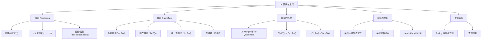

**相关笔记：** [[1.3 命题等价]] | [[1.5 嵌套量词]]


> [!abstract] 概览
> 本节从[[1.3 命题等价|命题逻辑]]过渡到表达能力更强的==谓词逻辑==（predicate logic），引入==谓词==（predicate）、==命题函数==（propositional function）和==量词==（quantifier）三大核心概念，使我们能够精确表达涉及变量和一般性陈述的数学命题。
>
> - **谓词**是带有变量的陈述，本身没有真假值，但代入具体值后成为命题
> - **全称量词** $\forall$ 表示"对所有...成立"，**存在量词** $\exists$ 表示"存在至少一个..."
> - 量词的否定遵循==De Morgan 律==：$\neg\forall x P(x) \equiv \exists x \neg P(x)$，$\neg\exists x P(x) \equiv \forall x \neg P(x)$
> - ==论域==（domain of discourse）的选择直接影响量化命题的真假值
> - 全称量化在有限域上等价于合取，存在量化在有限域上等价于析取
> - 谓词与量词是形式化验证、逻辑编程（如 Prolog）和人工智能的理论基础

---

## 一、知识结构总览




---

## 二、核心思想


> [!tip] 核心思想
> ### 1. 从命题逻辑到谓词逻辑：为什么需要谓词？

### 1. 从命题逻辑到谓词逻辑：为什么需要谓词？

> [!def] 命题逻辑的局限性
> >
> [[1.3 命题等价|命题逻辑]]无法处理涉及变量的陈述。考虑以下推理：

> 前提："校园网络上每台连接的计算机都运行正常。"
> 结论："MATH3 运行正常。"（MATH3 是校园网络上的一台计算机）

在命题逻辑中，我们无法从前提推出结论，因为前提和结论是不同的原子命题，命题逻辑没有提供从"所有"到"某个"的推理规则。这正是谓词逻辑要解决的问题。

> [!def] 谓词 (Predicate)
> >
> 一个**谓词**是包含变量的陈述语句，它本身不是命题（没有确定的真假值），但当变量被赋予具体值后，就变成一个有真假值的命题。

**形式化定义：** 设 $P(x)$ 表示陈述"$x$ 大于 3"，其中：
- $x$ 是**变量**（variable），即陈述的**主语**
- "大于 3" 是**谓词**（predicate），即主语可能具有的**性质**

当 $x = 4$ 时，$P(4)$ 即 "$4 > 3$"，为**真命题**
当 $x = 2$ 时，$P(2)$ 即 "$2 > 3$"，为**假命题**

> [!def] n 元谓词 (n-ary Predicate)
> >
> 涉及 $n$ 个变量 $x_1, x_2, \ldots, x_n$ 的陈述记为 $P(x_1, x_2, \ldots, x_n)$，称为 **$n$ 元谓词**（$n$-place predicate 或 $n$-ary predicate）。$P(x_1, x_2, \ldots, x_n)$ 也称为命题函数 $P$ 在 $n$ 元组 $(x_1, x_2, \ldots, x_n)$ 处的值。

**示例：**
- $Q(x, y)$: "$x = y + 3$" —— 二元谓词
  - $Q(1, 2)$: "$1 = 2 + 3$" → **假**
  - $Q(3, 0)$: "$3 = 0 + 3$" → **真**
- $R(x, y, z)$: "$x + y = z$" —— 三元谓词
  - $R(1, 2, 3)$: "$1 + 2 = 3$" → **真**
  - $R(0, 0, 1)$: "$0 + 0 = 1$" → **假**

> [!example] 谓词在程序中的使用
> >
```pascal
if x > 0 then x := x + 1
```

当程序执行到这条语句时，变量 $x$ 的当前值被代入命题函数 $P(x)$（即 "$x > 0$"）。若 $P(x)$ 为真，则执行赋值操作；若为假，则跳过。

> [!tip] 前件与后件 (Preconditions and Postconditions)
> >
> 谓词广泛用于**程序正确性验证**：
> - **前件**（precondition）：描述程序输入应满足的条件
> - **后件**（postcondition）：描述程序输出应满足的条件

**示例：** 验证交换变量值的程序
```
temp := x
x := y
y := temp
```
- 前件 $P(x, y)$: "$x = a \wedge y = b$"
- 后件 $Q(x, y)$: "$x = b \wedge y = a$"

**验证过程：**
1. 执行前：$x = a, y = b$
2. `temp := x` 后：$x = a, \text{temp} = a, y = b$
3. `x := y` 后：$x = b, \text{temp} = a, y = b$
4. `y := temp` 后：$x = b, \text{temp} = a, y = a$

最终 $x = b \wedge y = a$，后件成立，程序正确。


### 2. 全称量词 (Universal Quantifier)

> [!def] 全称量词的定义
> >
> **全称量化**（universal quantification）$\forall x P(x)$ 表示命题：

> "$P(x)$ 对于论域中的所有 $x$ 都成立。"

其中 $\forall$ 是**全称量词**（universal quantifier），读作"对所有 $x$"或"对每个 $x$"。

**真值条件：**
- $\forall x P(x)$ 为**真** $\iff$ 论域中每个元素 $x$ 都使 $P(x)$ 为真
- $\forall x P(x)$ 为**假** $\iff$ 论域中存在至少一个元素 $x$ 使 $P(x)$ 为假（即存在**反例**，counterexample）

> [!warning] 论域的重要性
> >
> $\forall x P(x)$ 的真假值**完全取决于论域的选择**。

**示例：** $P(x)$: "$x^2 \geq x$"

| 论域 | 真假值 | 原因 |
|------|--------|------|
| 所有实数 | **假** | $x = \frac{1}{2}$ 时，$\left(\frac{1}{2}\right)^2 = \frac{1}{4} \not\geq \frac{1}{2}$ |
| 所有整数 | **真** | 不存在整数 $x$ 满足 $0 < x < 1$ |

**完整推导：** $x^2 \geq x \iff x^2 - x = x(x-1) \geq 0$。要使乘积 $x(x-1) \geq 0$，需要两个因子同号：
- $x \leq 0$ 且 $x - 1 \leq 0$，即 $x \leq 0$（此时 $x \leq 0 \leq x - 1$ 不可能同时成立，实际上 $x \leq 0$ 时 $x - 1 \leq -1 < 0$，两者同为非正，乘积非负）
- $x \geq 0$ 且 $x - 1 \geq 0$，即 $x \geq 1$

因此 $x^2 \geq x \iff x \leq 0 \text{ 或 } x \geq 1$。在实数域中，$0 < x < 1$ 时 $x^2 < x$，故 $\forall x(x^2 \geq x)$ 为假。在整数域中，不存在 $0 < x < 1$ 的整数，故为真。

> [!example] 全称量词的日常使用
> >
> - "所有学生都通过了考试"：$\forall x P(x)$，论域 = 所有学生，$P(x)$ = "$x$ 通过了考试"
> - "对任意实数 $x$，$x + 1 > x$"：$\forall x(x + 1 > x)$，论域 = $\mathbb{R}$，为**真**


### 3. 存在量词 (Existential Quantifier)

> [!def] 存在量词的定义
> >
> **存在量化**（existential quantification）$\exists x P(x)$ 表示命题：

> "论域中存在一个 $x$ 使得 $P(x)$ 为真。"

其中 $\exists$ 是**存在量词**（existential quantifier），读作"存在 $x$"或"至少有一个 $x$"。

**真值条件：**
- $\exists x P(x)$ 为**真** $\iff$ 论域中至少有一个元素 $x$ 使 $P(x)$ 为真
- $\exists x P(x)$ 为**假** $\iff$ 论域中所有元素 $x$ 都使 $P(x)$ 为假

> [!example] 存在量词示例
> >
> - $P(x)$: "$x > 3$"，论域 = $\mathbb{R}$。$\exists x P(x)$ 为**真**（如 $x = 4$）
> - $Q(x)$: "$x = x + 1$"，论域 = $\mathbb{R}$。$\exists x Q(x)$ 为**假**（没有任何实数满足 $x = x + 1$）

> [!def] 唯一性量词 (Uniqueness Quantifier)
> >
> $\exists! x P(x)$（或 $\exists_1 x P(x)$）表示"存在**唯一**一个 $x$ 使得 $P(x)$ 为真"。

**示例：** $\exists! x(x - 1 = 0)$，论域 = $\mathbb{R}$。为**真**，因为唯一解为 $x = 1$。

> [!tip] 唯一性量词可以消去
> $\exists! x P(x)$ 可以用 $\forall$ 和 $\exists$ 表达为：
> $$\exists x (P(x) \wedge \forall y (y \neq x \to \neg P(y)))$$
> 即"存在一个 $x$ 满足 $P(x)$，且对其他所有 $y$，$P(y)$ 都不成立"。


### 4. 有限域上的量化

> [!tip] 量化与逻辑连接词的关系
> >
> 当论域为有限集 $\{x_1, x_2, \ldots, x_n\}$ 时：

**全称量化 = 合取（conjunction）：**
$$\forall x P(x) \equiv P(x_1) \wedge P(x_2) \wedge \cdots \wedge P(x_n)$$

**存在量化 = 析取（disjunction）：**
$$\exists x P(x) \equiv P(x_1) \vee P(x_2) \vee \cdots \vee P(x_n)$$

> [!example] 有限域量化的计算
> >
> 论域 $= \{1, 2, 3, 4\}$，$P(x)$: "$x^2 < 10$"

$$\forall x P(x) = P(1) \wedge P(2) \wedge P(3) \wedge P(4) = T \wedge T \wedge T \wedge F = \textbf{假}$$

（因为 $P(4)$ 即 "$16 < 10$" 为假）

$$\exists x P(x) = P(1) \vee P(2) \vee P(3) \vee P(4) = T \vee T \vee T \vee F = \textbf{真}$$


### 5. 量词的受限域 (Restricted Domains)

> [!def] 受限量词的缩写
> >
> 我们可以用缩写来限制量词的作用范围：
>
> | 缩写 | 等价形式 | 含义 |
> |------|----------|------|
> | $\forall x < 0\, P(x)$ | $\forall x(x < 0 \to P(x))$ | 对所有负数 $x$，$P(x)$ 成立 |
> | $\forall y \neq 0\, P(y)$ | $\forall y(y \neq 0 \to P(y))$ | 对所有非零 $y$，$P(y)$ 成立 |
> | $\exists z > 0\, P(z)$ | $\exists z(z > 0 \wedge P(z))$ | 存在正数 $z$ 使 $P(z)$ 成立 |

> [!warning] 关键区别
> - 全称量词的受限域使用**蕴含**（$\to$）：$\forall x < 0\, (x^2 > 0)$ 等价于 $\forall x(x < 0 \to x^2 > 0)$
> - 存在量词的受限域使用**合取**（$\wedge$）：$\exists z > 0\, (z^2 = 2)$ 等价于 $\exists z(z > 0 \wedge z^2 = 2)$


### 6. 量词的优先级与变量绑定

> [!def] 量词的优先级
> >
> 量词 $\forall$ 和 $\exists$ 的优先级**高于所有命题逻辑运算符**。

$$\forall x P(x) \vee Q(x) \equiv (\forall x P(x)) \vee Q(x) \not\equiv \forall x(P(x) \vee Q(x))$$

> [!def] 约束变量与自由变量
> >
> - **约束变量**（bound variable）：被量词绑定的变量
> - **自由变量**（free variable）：未被任何量词绑定的变量
> - **量词的辖域**（scope）：量词所作用的逻辑表达式范围

**示例：** 在 $\exists x(x + y = 1)$ 中：
- $x$ 是**约束变量**（被 $\exists x$ 绑定）
- $y$ 是**自由变量**

在 $\exists x(P(x) \wedge Q(x)) \vee \forall x R(x)$ 中：
- 第一个 $\exists x$ 的辖域是 $P(x) \wedge Q(x)$
- 第二个 $\forall x$ 的辖域是 $R(x)$
- 所有变量都是约束变量


### 7. 涉及量词的逻辑等价

> [!def] 量词的分配律
> >
> **全称量词对合取的分配（成立）：**
> $$\forall x(P(x) \wedge Q(x)) \equiv \forall x P(x) \wedge \forall x Q(x)$$

**存在量词对析取的分配（成立）：**
$$\exists x(P(x) \vee Q(x)) \equiv \exists x P(x) \vee \exists x Q(x)$$

**完整证明（以全称量词对合取的分配为例）：**

**方向一：** 假设 $\forall x(P(x) \wedge Q(x))$ 为真。则对论域中任意元素 $a$，$P(a) \wedge Q(a)$ 为真。因此 $P(a)$ 为真且 $Q(a)$ 为真。由于 $a$ 是任意的，$\forall x P(x)$ 为真且 $\forall x Q(x)$ 为真，故 $\forall x P(x) \wedge \forall x Q(x)$ 为真。

**方向二：** 假设 $\forall x P(x) \wedge \forall x Q(x)$ 为真。则 $\forall x P(x)$ 为真且 $\forall x Q(x)$ 为真。对论域中任意元素 $a$，$P(a)$ 为真且 $Q(a)$ 为真，故 $P(a) \wedge Q(a)$ 为真。由于 $a$ 是任意的，$\forall x(P(x) \wedge Q(x))$ 为真。

> [!warning] 不能分配的情况
> >
> 以下等价**不成立**：
> - $\forall x(P(x) \vee Q(x)) \not\equiv \forall x P(x) \vee \forall x Q(x)$
> - $\exists x(P(x) \wedge Q(x)) \not\equiv \exists x P(x) \wedge \exists x Q(x)$


### 8. 量词的否定 —— De Morgan 律

> [!def] De Morgan 律 for Quantifiers
> >
> 这是本节最重要的等价关系之一：

$$\boxed{\neg \forall x P(x) \equiv \exists x \neg P(x)}$$
$$\boxed{\neg \exists x P(x) \equiv \forall x \neg P(x)}$$

**直观理解：**
- "并非所有人都及格" $\equiv$ "存在至少一个人没及格"
- "不存在会飞的人" $\equiv$ "所有人都不会飞"

**完整推导（以第一条为例）：**

$\neg \forall x P(x)$ 为真
$\iff \forall x P(x)$ 为假
$\iff$ 论域中存在元素 $x$ 使得 $P(x)$ 为假
$\iff$ 论域中存在元素 $x$ 使得 $\neg P(x)$ 为真
$\iff \exists x \neg P(x)$ 为真

**与有限域 De Morgan 律的联系：** 当论域为 $\{x_1, \ldots, x_n\}$ 时：
$$\neg \forall x P(x) = \neg(P(x_1) \wedge \cdots \wedge P(x_n)) = \neg P(x_1) \vee \cdots \vee \neg P(x_n) = \exists x \neg P(x)$$

这正是命题逻辑中 De Morgan 律的自然推广。

> [!example] 否定蕴含式的量化
> >
> 证明 $\neg \forall x(P(x) \to Q(x)) \equiv \exists x(P(x) \wedge \neg Q(x))$：

**推导过程：**
$$\neg \forall x(P(x) \to Q(x)) \equiv \exists x \neg(P(x) \to Q(x))$$

由 [[1.3 命题等价|命题等价]] 知 $\neg(p \to q) \equiv p \wedge \neg q$，因此：

$$\equiv \exists x(P(x) \wedge \neg Q(x))$$

**直观含义：** "并非所有 $P$ 都是 $Q$" $\equiv$ "存在某个 $P$ 不是 $Q$"。


### 9. 英语语句到逻辑表达式的翻译

> [!tip] 翻译策略
> >
> 翻译的关键步骤：
> 1. 明确论域
> 2. 识别量词（"所有"、"有些"、"没有"等）
> 3. 定义谓词
> 4. 选择正确的逻辑连接词

> [!example] 翻译示例
> >
> **语句：** "这个班上的每个学生都学过微积分"

**方法一**（论域 = 班级中的学生）：
$$\forall x C(x)$$
其中 $C(x)$: "$x$ 学过微积分"

**方法二**（论域 = 所有人）：
$$\forall x(S(x) \to C(x))$$
其中 $S(x)$: "$x$ 是这个班的学生"

> [!warning] 常见错误
> 不能写成 $\forall x(S(x) \wedge C(x))$！这表示"所有人都是这个班的学生并且学过微积分"，含义完全不同。

**语句：** "这个班上有些学生去过墨西哥"

**方法一**（论域 = 班级中的学生）：
$$\exists x M(x)$$

**方法二**（论域 = 所有人）：
$$\exists x(S(x) \wedge M(x))$$

> [!warning] 常见错误
> 不能写成 $\exists x(S(x) \to M(x))$！因为当 $x$ 不是学生时，$S(x) \to M(x) = F \to ? = T$，使得命题平凡地为真。

> [!example] Lewis Carroll 示例
> >
> **前提一：** "所有狮子都是凶猛的。"
> $$\forall x(P(x) \to Q(x))$$
> $P(x)$: "$x$ 是狮子"，$Q(x)$: "$x$ 是凶猛的"

**前提二：** "有些狮子不喝咖啡。"
$$\exists x(P(x) \wedge \neg R(x))$$
$R(x)$: "$x$ 喝咖啡"

**结论：** "有些凶猛的生物不喝咖啡。"
$$\exists x(Q(x) \wedge \neg R(x))$$

> [!warning] 注意
> 前提二不能写成 $\exists x(P(x) \to \neg R(x))$，因为当 $x$ 不是狮子时，$P(x) \to \neg R(x)$ 平凡为真。


### 10. 逻辑编程：Prolog

> [!tip] Prolog 中的谓词与量词
> >
> Prolog（Programming in Logic）是一种基于谓词逻辑的编程语言，广泛用于人工智能领域。

**核心概念：**
- **Prolog 事实**（facts）：直接定义谓词的实例
- **Prolog 规则**（rules）：用已有谓词定义新谓词

> [!example] Prolog 示例
> >
```prolog
% 事实：定义 instructor 和 enrolled 关系
instructor(chan, math273).
instructor(patel, ee222).
instructor(grossman, cs301).
enrolled(kevin, math273).
enrolled(juana, ee222).
enrolled(juana, cs301).
enrolled(kiko, math273).
enrolled(kiko, cs301).

% 规则：定义 teaches 关系
% teaches(P, S) 为真，当且仅当存在课程 C，
% 使得 P 是 C 的讲师且 S 选修了 C
teaches(P, S) :- instructor(P, C), enrolled(S, C).
```

查询 `?teaches(X, juana)` 返回 `patel` 和 `grossman`，因为：
- Juana 选修了 ee222（讲师 patel）和 cs301（讲师 grossman）

**逻辑对应：** Prolog 规则 `teaches(P, S) :- instructor(P, C), enrolled(S, C)` 对应逻辑表达式：
$$\text{teaches}(p, s) \leftrightarrow \exists c\,(\text{instructor}(p, c) \wedge \text{enrolled}(s, c))$$


---

## 三、补充理解与易混淆点

### 补充理解

### 补充理解一：谓词逻辑在形式化验证中的核心地位

谓词逻辑是**模型检验**（model checking）和**形式化验证**（formal verification）的理论基石。在软件工程中，系统规格说明（system specifications）通常用谓词逻辑表达式来描述系统的预期行为，然后通过自动化工具验证实现是否满足规格。

> **学术来源：** Edmund M. Clarke, Orna Grumberg, and Doron A. Peled. *Model Checking*. MIT Press, 1999.
> **URL：** https://mitpress.mit.edu/9780262032704/
>
> **网络资源：**
> - [Carnap - Natural Deduction](https://carnap.io/srv/doc/gentzen-ND.md) -- 免费、开源的自然演绎证明检查器，支持命题逻辑与谓词逻辑

### 补充理解二：量词的 De Morgan 律与对偶性

量词的 De Morgan 律反映了全称量词与存在量词之间的**对偶性**（duality）。这一对偶性可以追溯到 Augustus De Morgan 在 1847 年出版的 *Formal Logic* 一书中的工作。De Morgan 的发现深刻影响了 George Boole 的逻辑代数研究，奠定了现代符号逻辑的基础。在一阶逻辑中，$\forall$ 和 $\exists$ 是一对对偶量词，正如集合运算中 $\cap$ 和 $\cup$ 是一对对偶运算。

> **学术来源：** Augustus De Morgan. *Formal Logic: or, The Calculus of Inference, Necessary and Probable*. Taylor and Walton, 1847.
> **URL：** https://archive.org/details/formallogicorcal00demorich
>
> **网络资源：**
> - [Carnap - Sequent Calculus](https://carnap.io/srv/doc/sequent-calculus.md) -- 序列演算证明系统，帮助理解量词推理规则


### 易混淆点

### 易混淆点一：全称量词用蕴含 vs 存在量词用合取

| 场景 | 错误写法 | 正确写法 | 原因 |
|------|----------|----------|------|
| "所有学生都及格了" | $\forall x(S(x) \wedge P(x))$ | $\forall x(S(x) \to P(x))$ | $\wedge$ 要求所有人都是学生 |
| "有些学生及格了" | $\exists x(S(x) \to P(x))$ | $\exists x(S(x) \wedge P(x))$ | $\to$ 对非学生平凡为真 |

**记忆口诀：** "全称用箭头，存在用且号"（Universal → Implication, Existential → Conjunction）

### 易混淆点二：否定量词时忘记翻转量词类型

| 原始语句 | 错误否定 | 正确否定 |
|----------|----------|----------|
| $\forall x P(x)$ | $\forall x \neg P(x)$ | $\exists x \neg P(x)$ |
| $\exists x P(x)$ | $\exists x \neg P(x)$ | $\forall x \neg P(x)$ |

**记忆规则：** 否定量词时，$\forall$ 和 $\exists$ **互换**，同时 $\neg$ **穿过量词**作用于谓词内部。


---

## 四、习题精选

> [!todo] 习题概览
> | 题号 | 核心考点 | 难度 |
> |------|----------|------|
> | 1-4 | 命题函数的真值判断 | ★☆☆ |
> | 5-8 | 量化命题的英语翻译 | ★★☆ |
> | 9-10 | 用量词和谓词表达复合语句 | ★★☆ |
> | 11-16 | 量化命题的真值判断（不同论域） | ★★☆ |
> | 17-20 | 有限域上量化的展开 | ★★☆ |
> | 21-22 | 论域选择对真假值的影响 | ★★★ |
> | 23-28 | 英语到逻辑表达式的翻译（多种方法） | ★★★ |
> | 29-31 | 多变量命题函数的量化 | ★★☆ |
> | 32-34 | 量化命题的否定 | ★★★ |
> | 35-38 | 反例的寻找 | ★★☆ |
> | 39-44 | 系统规格说明的逻辑表达 | ★★★ |
> | 45-53 | 量词的逻辑等价证明 | ★★★ |
> | 54 | 唯一性量词的真值判断 | ★★☆ |

### 题1：量词否定的应用

> [!problem] 题目
> 否定命题"班上每个学生都选修了至少一门数学课"，并将结果翻译回自然语言。

> [!faq]- 解答
> 设 $S(x)$："$x$ 是班上的学生"，$M(x)$："$x$ 选修了至少一门数学课"。
>
> 原命题：$orall x(S(x) 	o M(x))$
>
> 否定过程：
> $$
eg orall x(S(x) 	o M(x)) \equiv \exists x 
eg(S(x) 	o M(x))$$
> $$\equiv \exists x 
eg(
eg S(x) \lor M(x))$$
> $$\equiv \exists x(S(x) \land 
eg M(x))$$
>
> 翻译："班上存在一个学生，他没有选修任何数学课。"
>
> $lacksquare$

### 题2：自然语言翻译为谓词逻辑

> [!problem] 题目
> 将"每个学生都学过一门数学课"翻译为谓词逻辑表达式。分别用两种论域给出答案。

> [!faq]- 解答
> 定义谓词：
> - $S(x)$：$x$ 是学生
> - $M(y)$：$y$ 是数学课
> - $T(x, y)$：$x$ 学过课程 $y$
>
> **方法一**（论域 = 所有学生）：
> $$\forall x \exists y (M(y) \land T(x, y))$$
>
> 含义：对每个学生 $x$，存在一门数学课 $y$ 使得 $x$ 学过 $y$。
>
> **方法二**（论域 = 所有人）：
> $$\forall x (S(x) \to \exists y (M(y) \land T(x, y)))$$
>
> 含义：对所有人 $x$，如果 $x$ 是学生，则存在一门数学课 $y$ 使得 $x$ 学过 $y$。
>
> 注意：方法二中使用蕴含 $\to$ 而非合取 $\land$，因为全称量词的受限域用蕴含。
>
> $\blacksquare$

### 题3：判断量词分配律是否成立

> [!problem] 题目
> 判断 $\forall x (P(x) \lor Q(x))$ 与 $\forall x P(x) \lor \forall x Q(x)$ 是否等价。给出证明或反例。

> [!faq]- 解答
> **不等价**。$\forall x (P(x) \lor Q(x)) \not\equiv \forall x P(x) \lor \forall x Q(x)$。
>
> **反例**：设论域 $= \{1, 2\}$，定义：
> - $P(1) = T, P(2) = F$
> - $Q(1) = F, Q(2) = T$
>
> 计算 $\forall x (P(x) \lor Q(x))$：
> - $P(1) \lor Q(1) = T \lor F = T$
> - $P(2) \lor Q(2) = F \lor T = T$
> - 合取：$T \land T = T$
>
> 计算 $\forall x P(x) \lor \forall x Q(x)$：
> - $\forall x P(x) = T \land F = F$
> - $\forall x Q(x) = F \land T = F$
> - 析取：$F \lor F = F$
>
> $T \neq F$，因此两式不等价。
>
> 直观理解：每个学生要么学过微积分要么学过线性代数（可能不同学生学不同课），但这不意味着要么所有学生都学过微积分，要么所有学生都学过线性代数。
>
> $\blacksquare$

### 题4：证明量词等价

> [!problem] 题目
> 证明 $\exists x (P(x) \to Q(x)) \equiv \forall x P(x) \to \exists x Q(x)$。

> [!faq]- 解答
> 从左到右逐步化简：
>
> $$
> \begin{aligned}
> \exists x (P(x) \to Q(x)) &\equiv \exists x (\neg P(x) \lor Q(x)) && \text{（条件-析取等价）} \\
> &\equiv \exists x \neg P(x) \lor \exists x Q(x) && \text{（存在量词对 $\lor$ 的分配律）} \\
> &\equiv \neg \forall x P(x) \lor \exists x Q(x) && \text{（量词 De Morgan 律：$\exists x \neg P(x) \equiv \neg \forall x P(x)$）} \\
> &\equiv \forall x P(x) \to \exists x Q(x) && \text{（条件-析取等价：$\neg A \lor B \equiv A \to B$）}
> \end{aligned}
> $$
>
> 因此 $\exists x (P(x) \to Q(x)) \equiv \forall x P(x) \to \exists x Q(x)$ 成立。
>
> $\blacksquare$

### 题5：将"没有最大的整数"形式化并证明

> [!problem] 题目
> 将"没有最大的整数"翻译为谓词逻辑表达式，并证明其真值为真。

> [!faq]- 解答
> **翻译**：
>
> "没有最大的整数"意味着：对任意整数 $x$，都存在一个整数 $y$ 使得 $y > x$。
>
> 论域 = 所有整数 $\mathbb{Z}$。定义谓词 $G(x, y)$："$y > x$"。
>
> 谓词逻辑表达式：
> $$\forall x \exists y (y > x)$$
>
> **证明真值为真**：
>
> 对任意整数 $x$，取 $y = x + 1$。因为 $x$ 是整数，$x + 1$ 也是整数，且 $x + 1 > x$。
>
> 因此对任意整数 $x$，都存在整数 $y$（即 $x + 1$）使得 $y > x$。
>
> 所以 $\forall x \exists y (y > x)$ 在整数域上为**真**。
>
> $\blacksquare$

---

> [!tip] 解题思路提示
> 1. **量词否定**：逐层应用 De Morgan 律，$orall$ 变 $\exists$，$\exists$ 变 $orall$
> 2. **翻译技巧**："所有"用 $orall$ + 蕴含，"有些"用 $\exists$ + 合取
> 3. **论域选择**：论域越小，表达式越简单，但需注意受限域的正确写法

## 五、视频学习指南

> [!info] 视频资源
> | 资源 | 链接 | 对应内容 | 备注 |
> |:-----|:-----|:---------|:-----|
> | Rosen 8e Section 1.4 | [教材原文](https://www.mheducation.com/highered/product/discrete-mathematics-applications-rosen/M9781259676512.html) | 谓词与量词完整内容 | 英文教材 |
> | MIT 6.042J Lectures | [链接](https://www.youtube.com/results?search_query=MIT+6.042+discrete+math) | 对应章节讲解 | 英文，MIT开放课程 |
> | TrevTutor Discrete Math | [链接](https://www.youtube.com/results?search_query=TrevTutor+discrete+math) | 知识点精讲 | 英文，适合入门 |

---

## 六、教材原文

> [!quote] 教材原文
> "Predicate calculus extends propositional calculus by allowing variables and quantifiers to be used in logical expressions."
>
> "The universal quantification of P(x) is the statement that P(x) is true for all values of x in the domain."

---

## 参见 Wiki

- [[逻辑学/concepts/量词]] —— 逻辑学知识库中的量词概念
- [[逻辑学/concepts/命题]] —— 命题的基本概念
- [[逻辑学/concepts/实质蕴涵]] —— 蕴含关系 $P \to Q$ 的讨论
- [[逻辑学/concepts/逻辑等价]] —— 逻辑等价关系
- [[逻辑学/concepts/有效性]] —— 推理有效性的概念
- [[逻辑学/concepts/自然演绎]] —— 自然演绎推理系统

--

- [[离散数学/concepts/谓词逻辑]] — 扩展命题逻辑，引入谓词和量词的形式逻辑系统
- [[离散数学/concepts/嵌套量词]] — 量词出现在另一个量词辖域内的量化结构


#学习/离散数学/逻辑与证明


