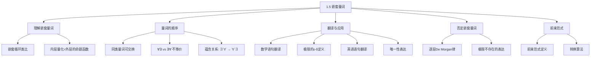

**相关笔记：** [[1.4 谓词与量词]] | [[1.6 推理规则]]


> [!abstract] 概览
> 本节是 [[1.4 谓词与量词]] 的自然延伸，讨论当一个量词出现在另一个量词的==辖域==（scope）内时——即==嵌套量词==（nested quantifiers）——的含义、翻译与否定规则。嵌套量词在数学分析（如 $\epsilon$-$\delta$ 极限定义）、数据库查询和程序规格说明中无处不在。
>
> - ==嵌套量词==的本质是将内层量化视为外层量词的命题函数：$\forall x \exists y P(x,y)$ 即 $\forall x Q(x)$，其中 $Q(x) = \exists y P(x,y)$
> - ==量词顺序至关重要==：$\forall x \exists y P(x,y)$ 与 $\exists y \forall x P(x,y)$ 一般**不等价**
> - 同类量词可交换顺序：$\forall x \forall y P(x,y) \equiv \forall y \forall x P(x,y)$，$\exists x \exists y P(x,y) \equiv \exists y \exists x P(x,y)$
> - 否定嵌套量词时，==逐层应用 De Morgan 律==，每穿过一个量词就翻转其类型
> - ==前束范式==（Prenex Normal Form）将所有量词移到公式最前端，是标准化逻辑表达式的重要工具
> - 嵌套量词可用**嵌套循环**类比来理解其真值判定过程

---

## 一、知识结构总览




---

## 二、核心思想


> [!tip] 核心思想
> ### 1. 理解嵌套量词

### 1. 理解嵌套量词

> [!def] 嵌套量词的基本概念
> >
> 当一个量词出现在另一个量词的辖域内时，就形成了**嵌套量词**。例如：

$$\forall x \exists y (x + y = 0)$$

这个语句的含义可以分层理解：
- 外层：$\forall x Q(x)$，其中 $Q(x)$ 是一个命题函数
- 内层：$Q(x) = \exists y P(x, y)$，其中 $P(x, y)$ 是 "$x + y = 0$"

因此，$\forall x \exists y (x + y = 0)$ 的含义是：**对每个实数 $x$，命题函数 $Q(x) = \exists y(x + y = 0)$ 都为真**——即每个实数都有加法逆元。

> [!example] 常见嵌套量词的数学含义
> >
> | 嵌套量词表达式 | 含义 | 真假值（论域 = $\mathbb{R}$） |
> |---|---|---|
> | $\forall x \forall y (x + y = y + x)$ | 加法交换律 | 真 |
> | $\forall x \exists y (x + y = 0)$ | 每个数都有加法逆元 | 真 |
> | $\forall x \forall y \forall z (x + (y + z) = (x + y) + z)$ | 加法结合律 | 真 |
> | $\forall x \forall y ((x > 0) \wedge (y < 0) \to (xy < 0))$ | 正数乘负数得负数 | 真 |


### 2. 用嵌套循环理解嵌套量词

> [!tip] 嵌套循环类比
> >
> 判定嵌套量化命题的真假值时，可以将量词想象为**嵌套循环**：

**$\forall x \forall y P(x, y)$：** 双重全循环
```
for each x:
    for each y:
        if P(x, y) is false: return FALSE
return TRUE
```
对每一对 $(x, y)$ 都检查 $P(x, y)$，只要有一对为假，整个命题为假。

**$\forall x \exists y P(x, y)$：** 外层全循环 + 内层搜索循环
```
for each x:
    found = false
    for each y:
        if P(x, y) is true: found = true; break
    if not found: return FALSE
return TRUE
```
对每个 $x$，搜索是否存在 $y$ 使 $P(x, y)$ 为真。注意 $y$ **可以依赖于 $x$**。

**$\exists x \forall y P(x, y)$：** 外层搜索 + 内层全循环
```
for each x:
    allTrue = true
    for each y:
        if P(x, y) is false: allTrue = false; break
    if allTrue: return TRUE
return FALSE
```
搜索是否存在一个 $x$，使得对**所有** $y$ 都有 $P(x, y)$ 为真。这里 $x$ 是**固定的**，不依赖于 $y$。

**$\exists x \exists y P(x, y)$：** 双重搜索循环
```
for each x:
    for each y:
        if P(x, y) is true: return TRUE
return FALSE
```
只要找到一对 $(x, y)$ 使 $P(x, y)$ 为真即可。


### 3. 量词的顺序

> [!def] 同类量词的交换性
> >
> **全称量词的交换：**
> $$\forall x \forall y P(x, y) \equiv \forall y \forall x P(x, y)$$

**存在量词的交换：**
$$\exists x \exists y P(x, y) \equiv \exists y \exists x P(x, y)$$

**原因：** 同类量词本质上是对所有元素对的"遍历"或"搜索"，顺序不影响最终结果。

> [!warning] 不同类量词的顺序不可交换
> >
> 这是本节最重要的知识点之一。$\forall x \exists y P(x, y)$ 和 $\exists y \forall x P(x, y)$ **一般不等价**。

> [!example] 经典反例
> >
> 设 $Q(x, y)$: "$x + y = 0$"，论域 = $\mathbb{R}$。

**$\exists y \forall x Q(x, y)$：** "存在一个实数 $y$，使得对所有实数 $x$，$x + y = 0$。"
- 这要求找到一个**固定的** $y$，使得对**所有** $x$ 都有 $x + y = 0$
- 但对任意固定的 $y$，只有 $x = -y$ 时 $x + y = 0$ 才成立
- 因此 **$\exists y \forall x Q(x, y)$ 为假**

**$\forall x \exists y Q(x, y)$：** "对每个实数 $x$，存在一个实数 $y$ 使得 $x + y = 0$。"
- 给定任意 $x$，只需取 $y = -x$ 即可
- 注意 $y$ **可以依赖于** $x$ 的选择
- 因此 **$\forall x \exists y Q(x, y)$ 为真**

> [!def] 蕴含关系
> >
> $$\exists y \forall x P(x, y) \implies \forall x \exists y P(x, y)$$

**但反之不成立。**

**证明：** 若 $\exists y \forall x P(x, y)$ 为真，则存在一个固定的 $y_0$ 使得对所有 $x$ 都有 $P(x, y_0)$ 为真。因此对每个 $x$，都存在 $y$（即 $y_0$）使 $P(x, y)$ 为真。故 $\forall x \exists y P(x, y)$ 为真。

**反例说明反之不成立：** 上面的 $Q(x, y) = (x + y = 0)$ 即可——$\forall x \exists y Q(x, y)$ 为真，但 $\exists y \forall x Q(x, y)$ 为假。

> [!tip] 核心区别总结
> >
> | 表达式 | $y$ 是否依赖于 $x$ | 语义强度 |
> |--------|---------------------|----------|
> | $\exists y \forall x P(x, y)$ | $y$ **独立于** $x$（一个 $y$ 适用于所有 $x$） | **更强** |
> | $\forall x \exists y P(x, y)$ | $y$ **可以依赖于** $x$（每个 $x$ 可以有自己的 $y$） | **较弱** |

> [!tip] 记忆方法
> "存在一个万能的 $y$" 比 "每个 $x$ 都有自己的 $y$" 要强得多。前者蕴含后者，但后者不蕴含前者。

> [!example] 三变量嵌套量词
> >
> $Q(x, y, z)$: "$x + y = z$"，论域 = $\mathbb{R}$。

**$\forall x \forall y \exists z Q(x, y, z)$：** "对所有实数 $x, y$，存在实数 $z$ 使得 $x + y = z$。"
- 给定任意 $x, y$，取 $z = x + y$ 即可
- **为真**

**$\exists z \forall x \forall y Q(x, y, z)$：** "存在一个实数 $z$，使得对所有实数 $x, y$ 都有 $x + y = z$。"
- 不存在这样的 $z$（因为不同的 $x, y$ 对应不同的和）
- **为假**


### 4. 两变量量化的完整分类

> [!def] 两变量量化总结表
> >
> | 语句 | 为真条件 | 为假条件 |
> |------|----------|----------|
> | $\forall x \forall y P(x, y)$ | $P(x, y)$ 对**每对** $x, y$ 为真 | 存在一对 $x, y$ 使 $P(x, y)$ 为假 |
> | $\forall x \exists y P(x, y)$ | 对**每个** $x$，存在 $y$ 使 $P(x, y)$ 为真 | 存在 $x$ 使得对所有 $y$，$P(x, y)$ 为假 |
> | $\exists x \forall y P(x, y)$ | 存在 $x$ 使得对**所有** $y$，$P(x, y)$ 为真 | 对每个 $x$，存在 $y$ 使 $P(x, y)$ 为假 |
> | $\exists x \exists y P(x, y)$ | 存在一对 $x, y$ 使 $P(x, y)$ 为真 | $P(x, y)$ 对**每对** $x, y$ 为假 |


### 5. 数学语句的翻译

> [!example] 正整数和为正
> >
> **语句：** "两个正整数之和总是正的。"

**翻译步骤：**
1. 改写为显含量词的形式："对任意两个整数，如果它们都是正的，则它们的和是正的。"
2. 引入变量："对所有整数 $x$ 和 $y$，如果 $x > 0$ 且 $y > 0$，则 $x + y > 0$。"
3. 形式化：

$$\forall x \forall y ((x > 0) \wedge (y > 0) \to (x + y > 0))$$

论域 = 所有整数。

**替代方案：** 若论域 = 所有正整数，则简化为：
$$\forall x \forall y (x + y > 0)$$

> [!example] 乘法逆元
> >
> **语句：** "每个非零实数都有乘法逆元。"

**翻译：**
$$\forall x ((x \neq 0) \to \exists y (xy = 1))$$

论域 = $\mathbb{R}$。乘法逆元（multiplicative inverse）是满足 $xy = 1$ 的 $y$。

> [!example] 极限的 $\epsilon$-$\delta$ 定义
> >
> **语句：** $\displaystyle\lim_{x \to a} f(x) = L$

**形式化翻译：**

$$\forall \epsilon > 0\, \exists \delta > 0\, \forall x (0 < |x - a| < \delta \to |f(x) - L| < \epsilon)$$

论域：$\epsilon, \delta$ 为正实数，$x$ 为实数。

**逐层解读：**
1. $\forall \epsilon > 0$：对任意（无论多小的）正数 $\epsilon$
2. $\exists \delta > 0$：存在一个正数 $\delta$
3. $\forall x$：使得对所有 $x$
4. $0 < |x - a| < \delta \to |f(x) - L| < \epsilon$：只要 $x$ 与 $a$ 的距离小于 $\delta$（且 $x \neq a$），$f(x)$ 与 $L$ 的距离就小于 $\epsilon$

> [!tip] 量词顺序的数学意义
> 极限定义中 $\forall \epsilon \exists \delta$ 的顺序不可交换。$\delta$ **依赖于** $\epsilon$ 的选择——$\epsilon$ 越小，通常需要的 $\delta$ 也越小。如果写成 $\exists \delta \forall \epsilon$，则要求一个固定的 $\delta$ 适用于所有 $\epsilon$，这在数学上几乎不可能成立。


### 6. 嵌套量词到英语的翻译

> [!example] 复杂嵌套量词的翻译
> >
> **表达式：** $\forall x (C(x) \vee \exists y (C(y) \wedge F(x, y)))$

$C(x)$: "$x$ 有电脑"，$F(x, y)$: "$x$ 和 $y$ 是朋友"，论域 = 学校所有学生。

**翻译过程：**
1. 外层：对每个学生 $x$，$C(x) \vee \exists y (C(y) \wedge F(x, y))$ 为真
2. 即：每个学生 $x$ 有电脑，**或者**存在学生 $y$ 使得 $y$ 有电脑且 $x$ 和 $y$ 是朋友
3. 简化："每个学生要么自己有电脑，要么有一个有电脑的朋友。"

**表达式：** $\exists x \forall y \forall z ((F(x, y) \wedge F(x, z) \wedge (y \neq z)) \to \neg F(y, z))$

$F(a, b)$: "$a$ 和 $b$ 是朋友"，论域 = 学校所有学生。

**翻译过程：**
1. 内层 $(F(x, y) \wedge F(x, z) \wedge (y \neq z)) \to \neg F(y, z)$：如果 $x$ 和 $y$ 是朋友，且 $x$ 和 $z$ 是朋友，且 $y \neq z$，则 $y$ 和 $z$ 不是朋友
2. 中层 $\forall y \forall z$：对**所有**学生 $y, z$（$y \neq z$），上述条件成立
3. 外层 $\exists x$：存在一个学生 $x$ 满足上述条件
4. 简化："存在一个学生，其任何两个朋友之间彼此不是朋友。"


### 7. 英语语句到嵌套量词的翻译

> [!example] "每人恰好有一个最好的朋友"
> >
> **分析：**
> 1. 引入全称量词：$\forall x$（$x$ 恰好有一个最好的朋友）
> 2. "$x$ 恰好有一个最好的朋友 $y$" = "存在 $y$ 是 $x$ 的最好朋友，且对其他所有 $z$，$z$ 不是 $x$ 的最好朋友"
> 3. 设 $B(x, y)$: "$y$ 是 $x$ 的最好朋友"

$$\forall x \exists y (B(x, y) \wedge \forall z ((z \neq y) \to \neg B(x, z)))$$

也可以用唯一性量词简写为 $\forall x \exists! y B(x, y)$。

> [!example] "存在一个女人乘坐过世界上每家航空公司的航班"
> >
> 设 $P(w, f)$: "$w$ 乘坐过航班 $f$"，$Q(f, a)$: "$f$ 是航空公司 $a$ 的航班"。

$$\exists w \forall a \exists f (P(w, f) \wedge Q(f, a))$$

论域：$w$ = 所有女性，$f$ = 所有航班，$a$ = 所有航空公司。

**逐层解读：**
- $\exists w$：存在一个女人 $w$
- $\forall a$：对每家航空公司 $a$
- $\exists f$：存在一个航班 $f$
- $P(w, f) \wedge Q(f, a)$：$w$ 乘坐过 $f$，且 $f$ 属于航空公司 $a$


### 8. 否定嵌套量词

> [!def] 逐层应用 De Morgan 律
> >
> 否定嵌套量词的方法是**从外到内逐层应用** [[1.4 谓词与量词|De Morgan 律]]，每穿过一个量词就翻转其类型。

> [!example] 否定 $\forall x \exists y (xy = 1)$
> >
> **推导过程：**

$$\neg \forall x \exists y (xy = 1)$$
$$\equiv \exists x \neg \exists y (xy = 1)$$
$$\equiv \exists x \forall y \neg (xy = 1)$$
$$\equiv \exists x \forall y (xy \neq 1)$$

**含义：** "存在一个实数 $x$，使得对所有实数 $y$，$xy \neq 1$。"

> [!example] 否定复杂嵌套量词
> >
> 否定"存在一个女人乘坐过世界上每家航空公司的航班"：

$$\neg \exists w \forall a \exists f (P(w, f) \wedge Q(f, a))$$
$$\equiv \forall w \neg \forall a \exists f (P(w, f) \wedge Q(f, a))$$
$$\equiv \forall w \exists a \neg \exists f (P(w, f) \wedge Q(f, a))$$
$$\equiv \forall w \exists a \forall f \neg (P(w, f) \wedge Q(f, a))$$
$$\equiv \forall w \exists a \forall f (\neg P(w, f) \vee \neg Q(f, a))$$

**含义：** "对每个女人，都存在一家航空公司，使得对该航空公司的所有航班，这个女人要么没乘坐过该航班，要么该航班不属于这家航空公司。"

> [!example] 极限不存在的形式化
> >
> "$\displaystyle\lim_{x \to a} f(x)$ 不存在"意味着对所有实数 $L$，$\displaystyle\lim_{x \to a} f(x) \neq L$。

由 [[1.4 谓词与量词|1.4 节]] 的极限定义，$\lim_{x \to a} f(x) = L$ 为：
$$\forall \epsilon > 0\, \exists \delta > 0\, \forall x (0 < |x - a| < \delta \to |f(x) - L| < \epsilon)$$

其否定为：
$$\exists \epsilon > 0\, \forall \delta > 0\, \exists x (0 < |x - a| < \delta \wedge |f(x) - L| \geq \epsilon)$$

因此，"$\lim_{x \to a} f(x)$ 不存在"形式化为：
$$\forall L\, \exists \epsilon > 0\, \forall \delta > 0\, \exists x (0 < |x - a| < \delta \wedge |f(x) - L| \geq \epsilon)$$

**逐步推导（对单个 $L$ 的否定）：**

$$\neg \forall \epsilon > 0\, \exists \delta > 0\, \forall x (0 < |x - a| < \delta \to |f(x) - L| < \epsilon)$$
$$\equiv \exists \epsilon > 0\, \neg \exists \delta > 0\, \forall x (0 < |x - a| < \delta \to |f(x) - L| < \epsilon)$$
$$\equiv \exists \epsilon > 0\, \forall \delta > 0\, \neg \forall x (0 < |x - a| < \delta \to |f(x) - L| < \epsilon)$$
$$\equiv \exists \epsilon > 0\, \forall \delta > 0\, \exists x \neg (0 < |x - a| < \delta \to |f(x) - L| < \epsilon)$$

最后一步利用 $\neg(p \to q) \equiv p \wedge \neg q$：
$$\equiv \exists \epsilon > 0\, \forall \delta > 0\, \exists x (0 < |x - a| < \delta \wedge |f(x) - L| \geq \epsilon)$$


### 9. 前束范式 (Prenex Normal Form)

> [!def] 前束范式的定义
> >
> 一个公式处于**前束范式**（PNF），当且仅当它具有如下形式：

$$Q_1 x_1\, Q_2 x_2\, \cdots\, Q_k x_k\, P(x_1, x_2, \ldots, x_k)$$

其中每个 $Q_i$ 是 $\forall$ 或 $\exists$，$P(x_1, \ldots, x_k)$ 是不含量词的谓词公式。

**示例：**
- $\exists x \forall y (P(x, y) \wedge Q(y))$ 是前束范式
- $\exists x P(x) \vee \forall x Q(x)$ **不是**前束范式（量词不在最前端）

> [!tip] 转换为前束范式的步骤
> >
> 1. **消去 $\to$ 和 $\leftrightarrow$**：利用 $p \to q \equiv \neg p \vee q$ 和 $p \leftrightarrow q \equiv (p \wedge q) \vee (\neg p \wedge \neg q)$
> 2. **将 $\neg$ 内移**：利用 De Morgan 律，使 $\neg$ 只作用于原子谓词
> 3. **变量换名**：确保不同量词使用不同变量名
> 4. **量词前移**：利用以下等价规则将量词逐步移到最前端

**量词前移的关键等价规则：**

$$\forall x P(x) \vee A \equiv \forall x (P(x) \vee A) \quad (x \text{ 不在 } A \text{ 中自由出现})$$
$$\exists x P(x) \vee A \equiv \exists x (P(x) \vee A) \quad (x \text{ 不在 } A \text{ 中自由出现})$$
$$\forall x P(x) \wedge A \equiv \forall x (P(x) \wedge A) \quad (x \text{ 不在 } A \text{ 中自由出现})$$
$$\exists x P(x) \wedge A \equiv \exists x (P(x) \wedge A) \quad (x \text{ 不在 } A \text{ 中自由出现})$$

> [!def] 重要定理
> **每个**由命题变量、谓词、$T$、$F$ 通过逻辑连接词和量词构成的公式，都等价于某个前束范式。


---

## 三、补充理解与易混淆点

### 补充理解

### 补充理解一：嵌套量词与数学分析中连续性的定义

嵌套量词在数学分析中有着深远的应用。除了极限的 $\epsilon$-$\delta$ 定义外，**函数一致连续性**的定义也涉及嵌套量词，且量词顺序与普通连续性有本质区别：

- **连续性：** $\forall x \forall \epsilon > 0\, \exists \delta > 0\, \forall y (|x - y| < \delta \to |f(x) - f(y)| < \epsilon)$
  - $\delta$ 依赖于 $x$ 和 $\epsilon$

- **一致连续性：** $\forall \epsilon > 0\, \exists \delta > 0\, \forall x \forall y (|x - y| < \delta \to |f(x) - f(y)| < \epsilon)$
  - $\delta$ 仅依赖于 $\epsilon$，不依赖于 $x$

量词顺序的差异（$\forall x \forall \epsilon \exists \delta$ vs $\forall \epsilon \exists \delta \forall x$）精确地刻画了连续性与一致连续性的区别。

> **学术来源：** Walter Rudin. *Principles of Mathematical Analysis* (3rd Edition). McGraw-Hill, 1976. Chapter 4, Section 5.
> **URL：** https://www.mheducation.com/highered/product/principles-mathematical-analysis-rudin/M9780070542358.html
>
> **网络资源：**
> - [Carnap - About](https://carnap.philosophy.ubc.ca/about) -- 开源形式化推理框架，支持多种逻辑系统

### 补充理解二：嵌套量词在数据库查询语言中的应用

嵌套量词是关系数据库查询语言（如 SQL）和逻辑编程的理论基础。SQL 中的 `EXISTS` 和 `NOT EXISTS` 子查询直接对应存在量词和否定存在量词。例如，"找出选修了所有课程的学生"这一查询涉及 $\forall$ 量词，在 SQL 中通过 `NOT EXISTS ... NOT EXISTS` 的双重否定模式实现，本质上是将 $\forall$ 转化为 $\neg\exists\neg$。

> **学术来源：** Edgar F. Codd. "A Relational Model of Data for Large Shared Data Banks." *Communications of the ACM*, 13(6): 377-387, 1970.
> **URL：** https://doi.org/10.1145/362384.362685
>
> **网络资源：**
> - [Carnap - Proof Reference Guide](https://calare.org/carnap.io.php) -- Carnap 证明系统参考指南


### 易混淆点

### 易混淆点一：$\forall x \exists y$ 与 $\exists y \forall x$ 的混淆

| 表达式 | 含义 | 类比 |
|--------|------|------|
| $\forall x \exists y P(x, y)$ | 每个 $x$ 都能找到**自己的** $y$ | 每个学生都能找到一门自己及格的课程 |
| $\exists y \forall x P(x, y)$ | 存在一个**万能的** $y$ 适用于所有 $x$ | 存在一门课所有学生都及格 |

**错误思维：** 认为"对每个 $x$ 存在 $y$"和"存在 $y$ 对所有 $x$"是一回事。

**纠正：** 前者允许 $y$ 随 $x$ 变化（弱条件），后者要求同一个 $y$ 适用于所有 $x$（强条件）。$\exists y \forall x \implies \forall x \exists y$，但反之不成立。

### 易混淆点二：否定嵌套量词时遗漏翻转

**错误示范：** 否定 $\forall x \exists y P(x, y)$ 时写成 $\exists x \exists y \neg P(x, y)$。

**正确过程：**
$$\neg \forall x \exists y P(x, y) \equiv \exists x \neg \exists y P(x, y) \equiv \exists x \forall y \neg P(x, y)$$

**记忆规则：** 否定符号 $\neg$ 从外向内逐层推进，**每穿过一个量词，$\forall$ 变 $\exists$，$\exists$ 变 $\forall$**。

| 原始 | 错误否定 | 正确否定 |
|------|----------|----------|
| $\forall x \exists y P(x, y)$ | $\exists x \exists y \neg P(x, y)$ | $\exists x \forall y \neg P(x, y)$ |
| $\exists x \forall y \forall z P(x, y, z)$ | $\forall x \exists y \forall z \neg P(x, y, z)$ | $\forall x \exists y \exists z \neg P(x, y, z)$ |


---

## 四、习题精选

> [!todo] 习题概览
> | 题号 | 核心考点 | 难度 |
> |------|----------|------|
> | 1-2 | 嵌套量词到英语的翻译 | ★★☆ |
> | 3-7 | 嵌套量词在具体场景中的英语表达 | ★★☆ |
> | 8-14 | 英语语句到嵌套量词的翻译 | ★★★ |
> | 15-16 | 多变量谓词与量词的表达 | ★★★ |
> | 17-18 | 系统规格说明的逻辑表达 | ★★★ |
> | 19-25 | 数学语句的形式化表达 | ★★★ |
> | 26-29 | 嵌套量词的真值判断 | ★★☆ |
> | 30-34 | 嵌套量词的否定（De Morgan 律逐层应用） | ★★★ |
> | 35-38 | 反例的寻找 | ★★☆ |
> | 39-44 | 数学定律的量词表达 | ★★★ |
> | 45-46 | 量词命题在不同论域下的真假值 | ★★☆ |
> | 47-49 | 量词等价性的证明 | ★★★★ |
> | 50-51 | 前束范式的转换 | ★★★★ |
> | 52 | 唯一性量词的消去 | ★★★ |

### 题1：否定嵌套量词

> [!problem] 题目
> 否定命题 $orall x \exists y (x + y = 10)$（论域为实数），并将结果翻译为自然语言。

> [!faq]- 解答
> 否定过程：
> $$
eg orall x \exists y (x + y = 10)$$
> $$\equiv \exists x 
eg \exists y (x + y = 10)$$
> $$\equiv \exists x orall y 
eg(x + y = 10)$$
> $$\equiv \exists x orall y (x + y 
eq 10)$$
>
> 翻译："存在一个实数 $x$，使得对所有实数 $y$，$x + y$ 都不等于 10。"
>
> 验证：取 $x$ 为任意实数，令 $y = 10 - x$，则 $x + y = 10$。因此对任意 $x$，都存在 $y$ 使 $x + y = 10$。原命题为真，其否定为假。
>
> $lacksquare$

### 题2：写出嵌套量词表达式

> [!problem] 题目
> 写出"对每个正整数 $x$，存在一个正整数 $y$ 使得 $y > x$"的谓词逻辑表达式。论域为正整数。

> [!faq]- 解答
> 定义谓词 $G(x, y)$："$y > x$"。
>
> 论域 = 正整数 $\mathbb{Z}^+$。
>
> 谓词逻辑表达式：
> $$\forall x \exists y\, G(x, y)$$
>
> 即：
> $$\forall x \exists y\, (y > x)$$
>
> 该命题为**真**：对任意正整数 $x$，取 $y = x + 1$（也是正整数），则 $y > x$ 成立。
>
> $\blacksquare$

### 题3：判断嵌套量词命题的真值

> [!problem] 题目
> 判断 $\forall x \exists y (x + y = 0)$ 在实数域上的真值，并解释。

> [!faq]- 解答
> 该命题在实数域上为**真**。
>
> **解释**：对任意实数 $x$，取 $y = -x$。因为 $x$ 是实数，$-x$ 也是实数，且 $x + (-x) = 0$。
>
> 注意这里 $y$ **依赖于** $x$ 的选择——不同的 $x$ 对应不同的 $y$。这正是 $\forall x \exists y$ 量词顺序的含义：对每个 $x$，可以找到**自己的** $y$。
>
> 如果量词顺序交换为 $\exists y \forall x (x + y = 0)$，则要求存在一个**固定的** $y$ 使得对所有 $x$ 都有 $x + y = 0$，这是**假**的（不存在这样的 $y$）。
>
> $\blacksquare$

### 题4：连续性的 $\epsilon$-$\delta$ 定义

> [!problem] 题目
> 写出函数 $f$ 在点 $a$ 处连续的 $\epsilon$-$\delta$ 定义的嵌套量词表达式，并解释为什么量词顺序不能交换。

> [!faq]- 解答
> 函数 $f$ 在点 $a$ 处连续的定义为：
> $$\forall \epsilon > 0\, \exists \delta > 0\, \forall x\, (0 < |x - a| < \delta \to |f(x) - f(a)| < \epsilon)$$
>
> **逐层解读**：
> 1. $\forall \epsilon > 0$：对任意（无论多小的）正数 $\epsilon$
> 2. $\exists \delta > 0$：可以找到一个正数 $\delta$
> 3. $\forall x$：使得对所有 $x$
> 4. 当 $x$ 足够接近 $a$（$0 < |x - a| < \delta$）时，$f(x)$ 足够接近 $f(a)$（$|f(x) - f(a)| < \epsilon$）
>
> **量词顺序不能交换的原因**：
>
> 如果写成 $\exists \delta > 0\, \forall \epsilon > 0\, \forall x\, (0 < |x - a| < \delta \to |f(x) - f(a)| < \epsilon)$，则要求存在一个**固定的** $\delta$ 适用于**所有** $\epsilon$。这意味着只要 $x$ 在 $(a - \delta, a + \delta)$ 内，$f(x)$ 就要无限接近 $f(a)$，即 $f(x) = f(a)$ 对所有这样的 $x$ 成立。这要求 $f$ 在 $a$ 的某个邻域内是常数函数，绝大多数连续函数不满足这一条件。
>
> 因此 $\delta$ 必须依赖于 $\epsilon$ 的选择——$\epsilon$ 越小，通常需要的 $\delta$ 也越小。
>
> $\blacksquare$

### 题5：量词顺序对语义的影响

> [!problem] 题目
> 证明 $\exists y \forall x (x + y = x)$ 在实数域上为真，但 $\forall x \exists y (x + y = x)$ 的解释不同。比较两个命题的含义。

> [!faq]- 解答
> **命题 1**：$\exists y \forall x (x + y = x)$
>
> 化简：$x + y = x$ 等价于 $y = 0$。所以命题变为 $\exists y \forall x (y = 0)$，即"存在一个实数 $y$，使得对所有实数 $x$，$y = 0$"。
>
> 取 $y = 0$，则对任意 $x$，$x + 0 = x$ 成立。因此该命题为**真**。
>
> **命题 2**：$\forall x \exists y (x + y = x)$
>
> 化简：$x + y = x$ 等价于 $y = 0$。所以命题变为 $\forall x \exists y (y = 0)$，即"对每个实数 $x$，存在一个实数 $y$ 使得 $y = 0$"。
>
> 对任意 $x$，取 $y = 0$ 即可。因此该命题也为**真**。
>
> **两个命题的区别**：
>
> 虽然两个命题在实数域上都为真，但它们的语义结构不同：
>
> - $\exists y \forall x (x + y = x)$：存在一个**固定的、与 $x$ 无关的** $y$（即 $y = 0$），使得对所有 $x$ 都成立。这里 $y$ 是"全局"选择的。
> - $\forall x \exists y (x + y = x)$：对每个 $x$，可以找到一个 $y$（这里恰好也是 $0$）。这里 $y$ 理论上可以依赖于 $x$。
>
> 在这个特例中，因为满足条件的 $y$ 恰好只有一个值（$0$），所以两个命题的真值相同。但一般情况下，$\exists y \forall x P(x,y)$ 蕴含 $\forall x \exists y P(x,y)$，而反之不成立。例如 $P(x, y)$ 为 "$y > x$" 时，$\forall x \exists y (y > x)$ 为真但 $\exists y \forall x (y > x)$ 为假。
>
> $\blacksquare$

---

> [!tip] 解题思路提示
> 1. **嵌套量词否定**：从外到内逐层推进，每穿过一个量词就翻转其类型
> 2. **量词顺序**：$orall x \exists y$ 允许 $y$ 依赖于 $x$；$\exists y orall x$ 要求同一个 $y$ 适用于所有 $x$
> 3. **前束范式**：先消去 $	o$ 和 $\leftrightarrow$，再将 $
eg$ 内移，最后量词前移

## 五、视频学习指南

> [!info] 视频资源
> | 资源 | 链接 | 对应内容 | 备注 |
> |:-----|:-----|:---------|:-----|
> | Rosen 8e Section 1.5 | [教材原文](https://www.mheducation.com/highered/product/discrete-mathematics-applications-rosen/M9781259676512.html) | 嵌套量词完整内容 | 英文教材 |
> | MIT 6.042J Lectures | [链接](https://www.youtube.com/results?search_query=MIT+6.042+discrete+math) | 对应章节讲解 | 英文，MIT开放课程 |
> | TrevTutor Discrete Math | [链接](https://www.youtube.com/results?search_query=TrevTutor+discrete+math) | 知识点精讲 | 英文，适合入门 |

---

## 六、教材原文

> [!quote] 教材原文
> "Nested quantifiers are often necessary to express the meaning of statements in mathematics."
>
> "The order of quantifiers is important. The statements ∀x∃yP(x,y) and ∃y∀xP(x,y) are not logically equivalent."

---

## 参见 Wiki

- [[逻辑学/concepts/量词]] —— 逻辑学知识库中的量词概念
- [[逻辑学/concepts/实质蕴涵]] —— 蕴含关系在嵌套量词中的使用
- [[逻辑学/concepts/逻辑等价]] —— 量词等价性的理论基础
- [[逻辑学/concepts/有效性]] —— 推理有效性
- [[逻辑学/concepts/自然演绎]] —— 自然演绎系统中的量词规则

--

- [[离散数学/concepts/嵌套量词]] — 量词出现在另一个量词辖域内的量化结构
- [[离散数学/concepts/谓词逻辑]] — 扩展命题逻辑，引入谓词和量词的形式逻辑系统


#学习/离散数学/逻辑与证明


