**相关笔记：** [[1.5 嵌套量词]] | [[1.7 证明导论]]

> [!abstract] 概览
> 本节建立从逻辑到数学证明的桥梁。核心目标是理解如何从已知前提出发，通过==有效的推理规则==推导出可靠的结论。
>
> - **论证（argument）** 是一系列命题的序列，最后一个命题是结论，其余是前提
> - **有效论证** 要求：当前提全部为真时，结论不可能为假
> - 命题逻辑中有 ==8 条基本推理规则==（modus ponens、modus tollens、假言三段论等）
> - 量词推理有 ==4 条基本规则==（全称实例化、全称泛化、存在实例化、存在泛化）
> - ==谬误（fallacy）== 是看似有效但实际无效的推理模式，如"肯定结论"和"否定假设"
> - ==归结原理（resolution）== 是自动定理证明的核心规则，也是 Prolog 语言的逻辑基础

---

## 一、知识结构总览

```mermaid
graph TB
    A["1.6 推理规则"] --> B["命题逻辑推理"]
    A --> C["量词推理"]
    A --> D["谬误识别"]
    A --> E["归结原理"]

    B --> B1["Modus Ponens<br/>假言推理"]
    B --> B2["Modus Tollens<br/>拒取式"]
    B --> B3["假言三段论<br/>Hypothetical Syllogism"]
    B --> B4["选言三段论<br/>Disjunctive Syllogism"]
    B --> B5["附加律 Addition"]
    B --> B6["化简律 Simplification"]
    B --> B7["合取律 Conjunction"]
    B --> B8["归结 Resolution"]

    C --> C1["全称实例化<br/>Universal Instantiation"]
    C --> C2["全称泛化<br/>Universal Generalization"]
    C --> C3["存在实例化<br/>Existential Instantiation"]
    C --> C4["存在泛化<br/>Existential Generalization"]

    D --> D1["肯定结论谬误<br/>Fallacy of Affirming Conclusion"]
    D --> D2["否定假设谬误<br/>Fallacy of Denying Hypothesis"]

    E --> E1["子句化"]
    E --> E2["消解"]
    E --> E3["自动定理证明"]
```

---

## 二、核心思想

> [!tip] 核心思想
> ### 1. 论证与有效性

### 1. 论证与有效性

> [!def] 论证与论证形式
> >
> - **论证（argument）**：一个命题序列。除最后一个命题（结论）外，其余均为**前提（premises）**。
> - **论证形式（argument form）**：用命题变量替换具体命题后得到的复合命题序列。
> - **有效论证**：如果所有前提为真，则结论必然为真。即"前提全真而结论为假"的情况不可能发生。

关键等价关系：论证形式 $p_1, p_2, \ldots, p_n \therefore q$ 是有效的，**当且仅当** $(p_1 \wedge p_2 \wedge \cdots \wedge p_n) \to q$ 是一个**重言式（tautology）**。

> [!example] 示例：Modus Ponens 的论证
> 前提1：如果你有当前密码，则你可以登录网络。($p \to q$)
> 前提2：你有当前密码。($p$)
> 结论：你可以登录网络。($q$)
>
> 对应重言式：$((p \wedge (p \to q)) \to q)$，可通过真值表验证其为重言式。

> [!warning] 有效性与真实性
> >
> **有效论证**只保证"如果前提为真，则结论为真"，但**不保证结论一定为真**。如果前提本身为假，有效论证仍可能推出假结论。

> [!example] 有效论证但结论为假
> "如果 $\sqrt{2} > \frac{3}{2}$，则 $(\sqrt{2})^2 > (\frac{3}{2})^2$。我们知道 $\sqrt{2} > \frac{3}{2}$。因此 $(\sqrt{2})^2 > (\frac{3}{2})^2$。"
>
> 论证形式是有效的（modus ponens），但前提 $\sqrt{2} > \frac{3}{2}$ 为假（因为 $\sqrt{2} \approx 1.414 < 1.5$），结论 $2 > \frac{9}{4}$ 也为假。

### 2. 命题逻辑的推理规则

> [!def] 八条基本推理规则
> >
> 以下是命题逻辑中最常用的推理规则，每条都对应一个重言式：
>
> | 规则名称 | 形式 | 对应重言式 |
> |:---------|:-----|:----------|
> | **Modus Ponens**（假言推理） | $p \to q,\; p \;\therefore\; q$ | $(p \wedge (p \to q)) \to q$ |
> | **Modus Tollens**（拒取式） | $p \to q,\; \neg q \;\therefore\; \neg p$ | $(\neg q \wedge (p \to q)) \to \neg p$ |
> | **假言三段论** | $p \to q,\; q \to r \;\therefore\; p \to r$ | $((p \to q) \wedge (q \to r)) \to (p \to r)$ |
> | **选言三段论** | $p \vee q,\; \neg p \;\therefore\; q$ | $((p \vee q) \wedge \neg p) \to q$ |
> | **附加律** | $p \;\therefore\; p \vee q$ | $p \to (p \vee q)$ |
> | **化简律** | $p \wedge q \;\therefore\; p$ | $(p \wedge q) \to p$ |
> | **合取律** | $p,\; q \;\therefore\; p \wedge q$ | $(p \wedge q) \to (p \wedge q)$ |
> | **归结** | $p \vee q,\; \neg p \vee r \;\therefore\; q \vee r$ | $((p \vee q) \wedge (\neg p \vee r)) \to (q \vee r)$ |

> [!tip] 记忆技巧
> - **Modus Ponens**（肯定前件）：有 $p \to q$ 且 $p$ 为真，则 $q$ 为真。这是最常用的推理规则。
> - **Modus Tollens**（否定后件）：有 $p \to q$ 且 $q$ 为假，则 $p$ 为假。等价于"逆否命题"推理。
> - **假言三段论**：条件的传递性，$p \to q$ 和 $q \to r$ 蕴含 $p \to r$。
> - **选言三段论**：$p \vee q$ 为真且 $p$ 为假，则 $q$ 必为真。

### 3. 使用推理规则构建论证

当有多个前提时，通常需要组合使用多条推理规则来推导结论。

> [!example] 综合推理示例
> **前提**：
> 1. 今天下午不是晴天且比昨天冷 ($\neg p \wedge q$)
> 2. 只有晴天我们才去游泳 ($r \to p$)
> 3. 如果不去游泳，就去划独木舟 ($\neg r \to s$)
> 4. 如果去划独木舟，日落后回家 ($s \to t$)
>
> **结论**：日落后回家 ($t$)
>
> **推理过程**：
>
> | 步骤 | 命题 | 理由 |
> |:----:|:-----|:-----|
> | 1 | $\neg p \wedge q$ | 前提 |
> | 2 | $\neg p$ | 化简律，由 (1) |
> | 3 | $r \to p$ | 前提 |
> | 4 | $\neg r$ | Modus Tollens，由 (2) 和 (3) |
> | 5 | $\neg r \to s$ | 前提 |
> | 6 | $s$ | Modus Ponens，由 (4) 和 (5) |
> | 7 | $s \to t$ | 前提 |
> | 8 | $t$ | Modus Ponens，由 (6) 和 (7) |

> [!example] 使用逆否命题的推理
> **前提**：$p \to q$，$\neg p \to r$，$r \to s$
> **结论**：$\neg q \to s$
>
> | 步骤 | 命题 | 理由 |
> |:----:|:-----|:-----|
> | 1 | $p \to q$ | 前提 |
> | 2 | $\neg q \to \neg p$ | 逆否命题，由 (1) |
> | 3 | $\neg p \to r$ | 前提 |
> | 4 | $\neg q \to r$ | 假言三段论，由 (2) 和 (3) |
> | 5 | $r \to s$ | 前提 |
> | 6 | $\neg q \to s$ | 假言三段论，由 (4) 和 (5) |

### 4. 归结原理（Resolution）

> [!def] 归结
> >
> **归结**是一条特殊的推理规则，基于重言式 $((p \vee q) \wedge (\neg p \vee r)) \to (q \vee r)$。其核心思想是：两个子句中若存在**互补文字**（一个命题及其否定），则可以消去这对互补文字，将剩余部分合取。

**归结的特殊情形**：
- 当 $q = r$ 时：$(p \vee q) \wedge (\neg p \vee q) \to q$（两个子句归结为 $q$）
- 当 $r = F$ 时：$(p \vee q) \wedge \neg p \to q$（退化为选言三段论）

> [!tip] 归结与自动定理证明
> 归结原理是**自动定理证明**的基础。要使用归结进行证明：
> 1. 将所有前提和结论的否定都转化为**子句（clause）**形式（即析取式）
> 2. 反复应用归结规则
> 3. 若能推导出空子句（矛盾），则原论证有效
>
> 这是 Prolog 等逻辑编程语言的理论基础。

> [!example] 归结示例
> **前提**："Jasmine 在滑雪或没下雪" ($\neg p \vee q$) 和 "下雪或 Bart 在打曲棍球" ($p \vee r$)
>
> 应用归结：互补文字为 $p$ 和 $\neg p$，消去后得到 $q \vee r$，即 "Jasmine 在滑雪或 Bart 在打曲棍球"。

### 5. 谬误（Fallacies）

> [!def] 两种常见谬误
> >
> 谬误是基于**偶然式（contingency）**而非**重言式**的无效推理模式。

**1. 肯定结论谬误（Fallacy of Affirming the Conclusion）**

形式：$p \to q,\; q \;\therefore\; p$

对应命题 $((p \to q) \wedge q) \to p$ **不是重言式**（当 $p = F, q = T$ 时为假）。

> [!example] 肯定结论谬误
> "如果你做了本书每道题，你就能学会离散数学。你学会了离散数学。因此你做了每道题。"
>
> 这是无效推理——你可以通过其他方式学会离散数学。

**2. 否定假设谬误（Fallacy of Denying the Hypothesis）**

形式：$p \to q,\; \neg p \;\therefore\; \neg q$

对应命题 $((p \to q) \wedge \neg p) \to \neg q$ **不是重言式**（当 $p = F, q = T$ 时为假）。

> [!example] 否定假设谬误
> "如果你做了每道题，你就能学会离散数学。你没做每道题。因此你没学会离散数学。"
>
> 无效——即使没做每道题，也可能通过其他途径学会。

### 6. 量词化命题的推理规则

> [!def] 四条量词推理规则
> >
> | 规则名称 | 形式 | 说明 |
> |:---------|:-----|:-----|
> | **全称实例化** | $\forall x P(x) \;\therefore\; P(c)$ | 从全称命题中取出特定元素 |
> | **全称泛化** | $P(c)$（$c$ 为任意元素）$\;\therefore\; \forall x P(x)$ | 从任意元素推广到全称 |
> | **存在实例化** | $\exists x P(x) \;\therefore\; P(c)$（某个特定 $c$） | 从存在命题中取出一个 witness |
> | **存在泛化** | $P(c)$（某个特定 $c$）$\;\therefore\; \exists x P(x)$ | 从特定元素推广到存在 |

> [!warning] 全称泛化的关键限制
> >
> 全称泛化要求 $c$ 是**任意**选取的元素，不能对 $c$ 做出任何额外假设。如果 $c$ 是某个具有特殊性质的元素，则不能使用全称泛化。

> [!warning] 存在实例化的关键限制
> >
> 存在实例化选出的 $c$ 必须是一个**新的名字**，不能与证明中已使用的任何名字冲突。在同一个证明中，对不同的 $\exists$ 命题做存在实例化时，必须使用**不同的名字**。

> [!example] 量词推理综合示例
> **前提**：
> 1. 班上有人没读过这本书：$\exists x(C(x) \wedge \neg B(x))$
> 2. 班上每个人都通过了第一次考试：$\forall x(C(x) \to P(x))$
>
> **结论**：有人通过了第一次考试但没读过这本书：$\exists x(P(x) \wedge \neg B(x))$
>
> | 步骤 | 命题 | 理由 |
> |:----:|:-----|:-----|
> | 1 | $\exists x(C(x) \wedge \neg B(x))$ | 前提 |
> | 2 | $C(a) \wedge \neg B(a)$ | 存在实例化，由 (1)，$a$ 是某个特定学生 |
> | 3 | $C(a)$ | 化简律，由 (2) |
> | 4 | $\forall x(C(x) \to P(x))$ | 前提 |
> | 5 | $C(a) \to P(a)$ | 全称实例化，由 (4) |
> | 6 | $P(a)$ | Modus Ponens，由 (3) 和 (5) |
> | 7 | $\neg B(a)$ | 化简律，由 (2) |
> | 8 | $P(a) \wedge \neg B(a)$ | 合取律，由 (6) 和 (7) |
> | 9 | $\exists x(P(x) \wedge \neg B(x))$ | 存在泛化，由 (8) |

### 7. 命题规则与量词规则的组合

> [!def] 全称假言推理与全称拒取式
> >
> **全称假言推理（Universal Modus Ponens）**：
> $$\forall x(P(x) \to Q(x)),\; P(a) \;\therefore\; Q(a)$$

本质上是全称实例化 + 假言推理的组合。

**全称拒取式（Universal Modus Tollens）**：
$$\forall x(P(x) \to Q(x)),\; \neg Q(a) \;\therefore\; \neg P(a)$$

本质上是全称实例化 + 拒取式的组合。

> [!example] 全称假言推理示例
> "对所有正整数 $n$，如果 $n > 4$，则 $n^2 < 2^n$。"
> 令 $P(n)$ 为 "$n > 4$"，$Q(n)$ 为 "$n^2 < 2^n$"。
> $P(100)$ 为真（因为 $100 > 4$），由全称假言推理得 $Q(100)$ 为真，即 $100^2 < 2^{100}$。

---

## 三、补充理解与易混淆点

### 补充理解

### 自然演绎系统

推理规则的思想可追溯到 **Gentzen（1935）** 提出的**自然演绎（Natural Deduction）**系统。在自然演绎中，每个逻辑联结词都由**引入规则（introduction rules）**和**消去规则（elimination rules）**来刻画。引入规则告诉我们如何证明含有该联结词的命题，消去规则告诉我们从含有该联结词的命题可以推出什么。Rosen 本节中的推理规则本质上就是自然演绎系统中命题逻辑部分的子集。

> **来源**：Gentzen, G. (1935). *Untersuchungen ueber das logische Schliessen*. Mathematische Zeitschrift, 39, 176-210, 405-431.
> **参考**：Stanford Encyclopedia of Philosophy, "Natural Deduction Systems in Logic" — https://plato.stanford.edu/entries/natural-deduction/
>
> **网络资源：**
> - [Carnap - Gentzen-Prawitz Natural Deduction](https://carnap.io/srv/doc/gentzen-ND.md) -- 在线自然演绎练习系统，实时检查证明正确性

### 归结原理与自动定理证明

**Robinson（1965）** 提出的**归结原理（Resolution Principle）**是自动定理证明领域的里程碑。其核心洞察是：如果将所有命题转化为子句形式（析取式），那么仅用归结这一条推理规则就能构成一个**完备的**演绎系统。这意味着：如果一个论证是有效的，归结原理一定能通过有限步推导出矛盾。这一发现直接催生了 Prolog 等逻辑编程语言，并在人工智能的自动推理领域产生了深远影响。

> **来源**：Robinson, J. A. (1965). *A Machine-Oriented Logic Based on the Resolution Principle*. Journal of the ACM, 12(1), 23-41.
> **链接**：https://dl.acm.org/doi/10.1145/321250.321253
>
> **网络资源：**
> - [Carnap - Sequent Calculus](https://carnap.io/srv/doc/sequent-calculus.md) -- 序列演算在线工具

### 易混淆点

### 1. Modus Tollens vs. 否定假设谬误

| | Modus Tollens（有效） | 否定假设谬误（无效） |
|:--|:--|:--|
| **形式** | $p \to q,\; \neg q \;\therefore\; \neg p$ | $p \to q,\; \neg p \;\therefore\; \neg q$ |
| **操作** | 否定**后件** $q$ | 否定**前件** $p$ |
| **本质** | 逆否命题推理 | 错误推理 |
| **记忆** | "后件假则前件假" | ~~"前件假则后件假"~~ |

### 2. 全称泛化 vs. 存在实例化中对 $c$ 的选取

| | 全称泛化 | 存在实例化 |
|:--|:--|:--|
| **$c$ 的性质** | 必须是**任意**元素，不能有额外假设 | 必须是**特定**元素，满足 $P(c)$ |
| **能否重复使用** | 一次泛化覆盖所有元素 | 每次实例化需用**新名字** |
| **典型错误** | 对特殊元素做全称泛化 | 对不同 $\exists$ 命题用同一个名字 |

---

## 四、习题精选

> [!todo] 习题概览
> | 题号 | 核心考点 | 难度 |
> |:----:|:---------|:----:|
> | 1-2 | 识别论证形式并判断有效性 | ★☆☆ |
> | 3-4 | 识别具体论证使用的推理规则 | ★☆☆ |
> | 5-6 | 使用推理规则构建有效论证 | ★★☆ |
> | 7-8 | 经典三段论中的推理规则 | ★★☆ |
> | 9-10 | 从前提中推导结论 | ★★★ |
> | 11-12 | 论证有效性的元推理 | ★★★ |
> | 13-14 | 量词推理规则的综合应用 | ★★★ |
> | 15-16 | 判断论证正确性（识别谬误） | ★★☆ |
> | 17-18 | 量词实例化的常见错误 | ★★★ |
> | 19-20 | 判断论证有效性 | ★★☆ |
> | 23-24 | 量词推理中的典型错误分析 | ★★★ |
> | 25-29 | 组合推理规则的证明 | ★★★ |
> | 30-33 | 归结原理的应用 | ★★★ |

### 题1：使用推理规则构建论证

> [!problem] 题目
> 已知前提：(1) 如果今天下雨，我就带伞（$p 	o q$）；(2) 今天下雨（$p$）；(3) 如果我带伞，包就很重（$q 	o r$）。请推导出"包很重"（$r$）。

> [!faq]- 解答
> | 步骤 | 命题 | 理由 |
> |:----:|:-----|:-----|
> | 1 | $p 	o q$ | 前提 |
> | 2 | $p$ | 前提 |
> | 3 | $q$ | Modus Ponens，由 (1) 和 (2) |
> | 4 | $q 	o r$ | 前提 |
> | 5 | $r$ | Modus Ponens，由 (3) 和 (4) |
>
> 结论：$r$（包很重）。$lacksquare$

### 题2：Modus Ponens 的应用

> [!problem] 题目
> 用 Modus Ponens 从前提 $p \to q$ 和 $p$ 推出 $q$。写出完整的推理步骤。

> [!faq]- 解答
> | 步骤 | 命题 | 理由 |
> |:----:|:-----|:-----|
> | 1 | $p \to q$ | 前提 |
> | 2 | $p$ | 前提 |
> | 3 | $q$ | Modus Ponens，由 (1) 和 (2) |
>
> Modus Ponens（假言推理）的形式为：从 $p \to q$ 和 $p$，可以推出 $q$。对应重言式 $(p \wedge (p \to q)) \to q$。
>
> $\blacksquare$

### 题3：识别谬误

> [!problem] 题目
> 判断论证"如果下雨则地湿。地湿。因此下雨。"是否有效。如果是无效的，指出犯了什么谬误。

> [!faq]- 解答
> 设 $p$："下雨"，$q$："地湿"。
>
> 论证形式为：$p \to q, q \therefore p$。
>
> 这是**无效论证**，犯了**肯定结论谬误**（Fallacy of Affirming the Conclusion）。
>
> 对应命题 $((p \to q) \wedge q) \to p$ **不是重言式**。反例：$p = F, q = T$ 时，$p \to q = T$，$q = T$，但 $p = F$。
>
> 直观理解：地湿可能由其他原因造成（如洒水车、水管破裂），不能从"地湿"反推出"下雨"。
>
> $\blacksquare$

### 题4：假言三段论的完整证明

> [!problem] 题目
> 用假言三段论从前提 $p \to q$、$q \to r$、$p$ 推出 $r$，写出完整的推理步骤。

> [!faq]- 解答
> | 步骤 | 命题 | 理由 |
> |:----:|:-----|:-----|
> | 1 | $p \to q$ | 前提 |
> | 2 | $q \to r$ | 前提 |
> | 3 | $p \to r$ | 假言三段论，由 (1) 和 (2) |
> | 4 | $p$ | 前提 |
> | 5 | $r$ | Modus Ponens，由 (3) 和 (4) |
>
> 这里先用假言三段论（Hypothetical Syllogism）将 $p \to q$ 和 $q \to r$ 合并为 $p \to r$，再用 Modus Ponens 从 $p \to r$ 和 $p$ 推出 $r$。
>
> 也可以不使用假言三段论，分两步 Modus Ponens：
> | 步骤 | 命题 | 理由 |
> |:----:|:-----|:-----|
> | 1 | $p \to q$ | 前提 |
> | 2 | $p$ | 前提 |
> | 3 | $q$ | Modus Ponens，由 (1) 和 (2) |
> | 4 | $q \to r$ | 前提 |
> | 5 | $r$ | Modus Ponens，由 (3) 和 (4) |
>
> 两种方法等价，殊途同归。
>
> $\blacksquare$

### 题5：综合推理证明

> [!problem] 题目
> 用推理规则证明：前提 $\neg p \lor q$、$\neg q \lor r$、$p$，结论 $r$。

> [!faq]- 解答
> | 步骤 | 命题 | 理由 |
> |:----:|:-----|:-----|
> | 1 | $\neg p \lor q$ | 前提 |
> | 2 | $p \to q$ | 条件-析取等价，由 (1)：$\neg p \lor q \equiv p \to q$ |
> | 3 | $p$ | 前提 |
> | 4 | $q$ | Modus Ponens，由 (2) 和 (3) |
> | 5 | $\neg q \lor r$ | 前提 |
> | 6 | $q \to r$ | 条件-析取等价，由 (5)：$\neg q \lor r \equiv q \to r$ |
> | 7 | $r$ | Modus Ponens，由 (4) 和 (6) |
>
> 推理路径：先将析取式转化为条件语句，然后连续两次应用 Modus Ponens。
>
> 也可以使用归结原理：
> | 步骤 | 命题 | 理由 |
> |:----:|:-----|:-----|
> | 1 | $\neg p \lor q$ | 前提（子句形式） |
> | 2 | $\neg q \lor r$ | 前提（子句形式） |
> | 3 | $p$ | 前提（子句形式） |
> | 4 | $\neg p \lor r$ | 归结，由 (1) 和 (2)，消去互补文字 $q$ |
> | 5 | $r$ | 归结（选言三段论），由 (3) 和 (4)，消去互补文字 $p$ |
>
> $\blacksquare$

---

> [!tip] 解题思路提示
> 1. **推理规则选择**：Modus Ponens 用于"有条件+有前件"，Modus Tollens 用于"有条件+后件为假"
> 2. **谬误识别**：肯定结论（$p 	o q, q 	herefore p$）和否定假设（$p 	o q, 
eg p 	herefore 
eg q$）都是无效的
> 3. **量词推理**：全称泛化要求 $c$ 是任意元素，存在实例化必须使用新名字

## 五、视频学习指南

> [!info] 视频资源
> | 资源 | 链接 | 对应内容 | 备注 |
> |:-----|:-----|:---------|:-----|
> | Rosen 8e Section 1.6 | [教材原文](https://www.mheducation.com/highered/product/discrete-mathematics-applications-rosen/M9781259676512.html) | 推理规则完整内容 | 英文教材 |
> | MIT 6.042J Lectures | [链接](https://www.youtube.com/results?search_query=MIT+6.042+discrete+math) | 对应章节讲解 | 英文，MIT开放课程 |
> | TrevTutor Discrete Math | [链接](https://www.youtube.com/results?search_query=TrevTutor+discrete+math) | 知识点精讲 | 英文，适合入门 |

---

## 六、教材原文

> [!quote] 教材原文
> "An argument in propositional logic is a sequence of propositions. All propositions in the argument except the final one are called premises, and the final proposition is called the conclusion."
>
> "The rules of inference are templates for constructing valid arguments."

---

## 参见 Wiki

- [[逻辑学/concepts/自然演绎]] — 自然演绎系统中的引入与消去规则
- [[逻辑学/concepts/推论规则]] — 逻辑学中的推理规则体系
- [[逻辑学/concepts/假言三段论]] — 条件命题的传递推理
- [[逻辑学/concepts/析取三段论]] — 选言命题的推理
- [[逻辑学/concepts/实质蕴涵]] — 条件命题 $p \to q$ 的真值函项解释
- [[逻辑学/concepts/有效性]] — 论证有效性的定义与判断
- [[逻辑学/concepts/重言式与矛盾式]] — 永真式与永假式

--

- [[离散数学/concepts/推理规则]] — 从前提推出结论的有效推理模式
- [[离散数学/concepts/证明方法]] — 建立数学命题为真的形式化论证技术

#学习/离散数学/逻辑与证明

