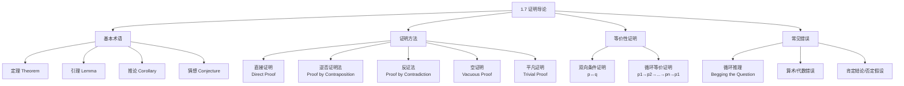

**相关笔记：** [[1.6 推理规则]] | [[1.8 证明方法与策略]]

> [!abstract] 概览
> 本节是数学证明的入门指南，系统介绍了几种核心证明方法。证明是数学中建立真理的==有效论证==，掌握证明方法是学习离散数学的关键能力。
>
> - **定理（theorem）** 是可以被证明为真的陈述；**引理（lemma）** 是辅助定理，**推论（corollary）** 是定理的直接推论
> - ==直接证明（direct proof）== 是最基本的方法：假设 $p$ 为真，通过推理得出 $q$ 为真
> - ==逆否证明法（proof by contraposition）== 利用 $p \to q \equiv \neg q \to \neg p$，从否定结论出发
> - ==反证法（proof by contradiction）== 假设命题为假，推出矛盾，从而证明命题为真
> - ==空证明（vacuous proof）== 和 ==平凡证明（trivial proof）== 处理条件命题的特殊情况
> - ==反例（counterexample）== 用于证明全称命题为假

---

## 一、知识结构总览

---

## 二、核心思想

> [!tip] 核心思想
> ### 1. 数学证明的基本术语

### 1. 数学证明的基本术语

> [!def] 定理、引理、推论与猜想
> >
> - **定理（Theorem）**：可以被证明为真的重要数学陈述
> - **命题（Proposition）**：不太重要的定理（也译为"命题"）
> - **引理（Lemma）**：为证明其他定理而预先证明的辅助性定理
> - **推论（Corollary）**：可以直接从已证定理推出的结果
> - **猜想（Conjecture）**：基于部分证据提出的、尚未被证明或否证的陈述
> - **证明（Proof）**：建立定理为真的有效论证
> - **公理（Axiom）**：被假定为真的基本陈述（如实数公理、几何公理）

> [!tip] 定理的常见形式
> 大多数定理的形式为 $\forall x(P(x) \to Q(x))$，即"对于论域中所有元素 $x$，如果 $P(x)$ 为真，则 $Q(x)$ 为真"。
>
> 数学写作中的惯例是**省略全称量词**，例如：
> - "如果 $x > y$（$x, y$ 为正实数），则 $x^2 > y^2$"
> - 实际含义："对所有正实数 $x$ 和 $y$，如果 $x > y$，则 $x^2 > y^2$"
>
> 证明时通常先选取论域中的**任意元素**，然后证明条件语句成立，最后隐式地应用全称泛化。

### 2. 直接证明法（Direct Proof）

> [!def] 直接证明
> >
> 要证明条件命题 $p \to q$：
> 1. **假设** $p$ 为真
> 2. 利用公理、定义、已证定理和推理规则，通过一系列推理步骤
> 3. **得出** $q$ 为真

直接证明的核心逻辑：证明 $p$ 为真而 $q$ 为假的情况**永远不会发生**。

> [!example] 定理：如果 $n$ 是奇数，则 $n^2$ 是奇数
> **证明**：
>
> 假设 $n$ 是奇数。由奇数的定义，存在整数 $k$ 使得
> $$n = 2k + 1$$
>
> 对等式两边平方：
> $$n^2 = (2k + 1)^2 = 4k^2 + 4k + 1$$
>
> 提取公因子 $2$：
> $$n^2 = 2(2k^2 + 2k) + 1$$
>
> 令 $m = 2k^2 + 2k$，则 $m$ 是整数（因为 $k$ 是整数，整数对加法和乘法封闭），所以
> $$n^2 = 2m + 1$$
>
> 由奇数的定义，$n^2$ 是奇数。$\blacksquare$

> [!example] 定理：如果 $m$ 和 $n$ 都是完全平方数，则 $mn$ 也是完全平方数
> **证明**：
>
> 假设 $m$ 和 $n$ 都是完全平方数。由定义，存在整数 $s$ 和 $t$ 使得 $m = s^2$，$n = t^2$。
>
> 则：
> $$mn = s^2 \cdot t^2 = (st)(st) = (st)^2$$
>
> 因为 $st$ 是整数（整数乘法封闭），所以 $mn$ 是完全平方数。$\blacksquare$

### 3. 逆否证明法（Proof by Contraposition）

> [!def] 逆否证明法
> >
> 当直接证明难以进行时，可以利用逻辑等价性 $p \to q \equiv \neg q \to \neg p$，转而证明**逆否命题** $\neg q \to \neg p$。

步骤：
1. 假设 $\neg q$ 为真（即结论的否定）
2. 通过推理得出 $\neg p$ 为真（即假设的否定）
3. 由逻辑等价性，$p \to q$ 为真

> [!tip] 何时使用逆否证明法？
> 当假设 $p$ 为真后难以找到通往 $q$ 的路径时，尤其是当 $p$ 涉及"无理数"、"不等于零"等**否定性**假设时，逆否证明法往往更有效。

> [!example] 定理：如果 $3n + 2$ 是奇数（$n$ 为整数），则 $n$ 是奇数
> **直接证明尝试**：假设 $3n + 2$ 是奇数，则 $3n + 2 = 2k + 1$，即 $3n + 1 = 2k$。从这里很难直接推出 $n$ 是奇数。
>
> **逆否证明**：
>
> 我们证明逆否命题："如果 $n$ 不是奇数（即 $n$ 是偶数），则 $3n + 2$ 不是奇数（即 $3n + 2$ 是偶数）。"
>
> 假设 $n$ 是偶数，则存在整数 $k$ 使得 $n = 2k$。代入：
> $$3n + 2 = 3(2k) + 2 = 6k + 2 = 2(3k + 1)$$
>
> 因为 $3k + 1$ 是整数，所以 $3n + 2$ 是 $2$ 的倍数，即 $3n + 2$ 是偶数。
>
> 因此 $3n + 2$ 不是奇数，逆否命题成立，原命题成立。$\blacksquare$

> [!example] 定理：如果 $n = ab$（$a, b$ 为正整数），则 $a \leq \sqrt{n}$ 或 $b \leq \sqrt{n}$
> **逆否证明**：
>
> 证明逆否命题："如果 $a > \sqrt{n}$ 且 $b > \sqrt{n}$，则 $n \neq ab$。"
>
> 假设 $a > \sqrt{n}$ 且 $b > \sqrt{n}$。因为 $a, b, \sqrt{n}$ 都是正数，将两个不等式相乘：
> $$a \cdot b > \sqrt{n} \cdot \sqrt{n} = n$$
>
> 即 $ab > n$，所以 $ab \neq n$。逆否命题成立，原命题成立。$\blacksquare$

### 4. 空证明与平凡证明

> [!def] 空证明（Vacuous Proof）
> >
> 如果要证明 $p \to q$，而 $p$ 本身为**假**，则 $p \to q$ 自动为真（因为 $F \to q \equiv T$）。

> [!example] 空证明
> 证明 $P(0)$ 为真，其中 $P(n)$ 为 "如果 $n > 1$，则 $n^2 > n$"。
>
> $P(0)$ 是 "如果 $0 > 1$，则 $0^2 > 0$"。
> 假设 $0 > 1$ 为假，因此条件语句自动为真。$\blacksquare$

> [!def] 平凡证明（Trivial Proof）
> >
> 如果要证明 $p \to q$，而 $q$ 本身为**真**，则 $p \to q$ 自动为真（因为 $p \to T \equiv T$）。

> [!example] 平凡证明
> 证明 $P(0)$ 为真，其中 $P(n)$ 为 "如果 $a \geq b$（$a, b$ 为正整数），则 $a^0 \geq b^0$"。
>
> $P(0)$ 是 "如果 $a \geq b$，则 $a^0 \geq b^0$"。
> 因为 $a^0 = b^0 = 1$，结论 $1 \geq 1$ 为真，条件语句自动为真。$\blacksquare$

### 5. 反证法（Proof by Contradiction）

> [!def] 反证法
> >
> 要证明命题 $p$ 为真：
> 1. 假设 $\neg p$ 为真
> 2. 从 $\neg p$ 出发，通过推理得出一个**矛盾** $r \wedge \neg r$
> 3. 因为矛盾不可能为真，所以 $\neg p$ 必为假，即 $p$ 为真

逻辑基础：$\neg p \to (r \wedge \neg r)$ 是重言式（因为后件恒假，前件必须为假）。

> [!tip] 反证法 vs. 逆否证明法
> - **反证法**：假设 $\neg p$，推出矛盾。适用于任何形式的命题。
> - **逆否证明法**：假设 $\neg q$，推出 $\neg p$。仅适用于条件命题 $p \to q$。
> - 逆否证明法可以改写为反证法：假设 $p \wedge \neg q$，从 $\neg q$ 出发推出 $\neg p$，得到 $p \wedge \neg p$ 矛盾。

> [!example] 定理：$\sqrt{2}$ 是无理数
> **反证法证明**：
>
> 假设 $\sqrt{2}$ 是有理数。则存在整数 $a$ 和 $b$（$b \neq 0$），使得
> $$\sqrt{2} = \frac{a}{b}$$
> 且 $a/b$ 为最简分数（$a$ 和 $b$ 没有公因子）。
>
> 两边平方：
> $$2 = \frac{a^2}{b^2}$$
> $$2b^2 = a^2$$
>
> 由 $a^2 = 2b^2$ 知 $a^2$ 是偶数。由"若整数的平方为偶数，则该整数本身为偶数"（练习18），$a$ 是偶数。
>
> 设 $a = 2c$（$c$ 为整数），代入：
> $$2b^2 = (2c)^2 = 4c^2$$
> $$b^2 = 2c^2$$
>
> 同理，$b^2$ 是偶数，所以 $b$ 是偶数。
>
> **矛盾**：$a$ 和 $b$ 都是偶数（都能被 $2$ 整除），但 $a/b$ 是最简分数（$a$ 和 $b$ 没有公因子）。
>
> 因此假设不成立，$\sqrt{2}$ 是无理数。$\blacksquare$

> [!example] 反证法证明条件命题：如果 $3n + 2$ 是奇数，则 $n$ 是奇数
> 假设 $3n + 2$ 是奇数且 $n$ 不是奇数（即 $n$ 是偶数）。
>
> 因为 $n$ 是偶数，存在整数 $k$ 使得 $n = 2k$。则：
> $$3n + 2 = 3(2k) + 2 = 6k + 2 = 2(3k + 1)$$
>
> 所以 $3n + 2$ 是偶数。但我们同时假设了 $3n + 2$ 是奇数。
>
> **矛盾**：$3n + 2$ 既是奇数又是偶数。因此假设不成立。$\blacksquare$

### 6. 等价性证明

> [!def] 双向条件证明
> >
> 要证明 $p \leftrightarrow q$，需要分别证明：
> - $p \to q$（正向）
> - $q \to p$（反向）

> [!example] 定理：$n$ 是奇数当且仅当 $n^2$ 是奇数（$n$ 为整数）
> **证明**：
>
> **($\Rightarrow$)** 如果 $n$ 是奇数，则 $n^2$ 是奇数。
> （见直接证明的示例1，已证。）
>
> **($\Leftarrow$)** 如果 $n^2$ 是奇数，则 $n$ 是奇数。
> 用逆否证明：假设 $n$ 是偶数，则 $n = 2k$，$n^2 = 4k^2 = 2(2k^2)$，所以 $n^2$ 是偶数。$\blacksquare$

> [!def] 循环等价证明
> >
> 要证明 $p_1, p_2, \ldots, p_n$ 相互等价，可以证明循环链：
> $$p_1 \to p_2 \to p_3 \to \cdots \to p_n \to p_1$$

这比证明所有 $n(n-1)$ 个方向的条件命题高效得多。

> [!example] 证明以下关于整数 $n$ 的三个命题等价
> - $p_1$：$n$ 是偶数
> - $p_2$：$n - 1$ 是奇数
> - $p_3$：$n^2$ 是偶数
>
> **证明**：我们证明 $p_1 \to p_2 \to p_3 \to p_1$。
>
> **$p_1 \to p_2$**：设 $n$ 是偶数，$n = 2k$。则 $n - 1 = 2k - 1 = 2(k-1) + 1$，是奇数。
>
> **$p_2 \to p_3$**：设 $n - 1$ 是奇数，$n - 1 = 2k + 1$。则 $n = 2k + 2$，$n^2 = (2k+2)^2 = 4k^2 + 8k + 4 = 2(2k^2 + 4k + 2)$，是偶数。
>
> **$p_3 \to p_1$**：用逆否证明。如果 $n$ 不是偶数（$n$ 是奇数），则 $n = 2k + 1$，$n^2 = (2k+1)^2 = 4k^2 + 4k + 1 = 2(2k^2 + 2k) + 1$，是奇数。所以 $n^2$ 不是偶数。$\blacksquare$

### 7. 反例（Counterexample）

> [!def] 反例
> >
> 要证明全称命题 $\forall x P(x)$ 为**假**，只需找到一个元素 $x$ 使得 $P(x)$ 为假。这样的 $x$ 称为**反例**。

> [!example] 反例
> 命题："每个正整数都是两个整数的平方和。"
>
> **反例**：$n = 3$。不超过 $3$ 的完全平方数只有 $0^2 = 0$ 和 $1^2 = 1$。$0 + 0 = 0$，$0 + 1 = 1$，$1 + 1 = 2$，都不等于 $3$。因此该命题为假。

### 8. 证明中的常见错误

> [!warning] 循环推理（Begging the Question / Circular Reasoning）
> >
> 证明中使用了**待证命题本身**（或其等价命题）作为推理步骤，这构成了循环推理。

> [!example] 循环推理示例
> "定理"：如果 $n^2$ 是偶数，则 $n$ 是偶数。
>
> "证明"：设 $n^2$ 是偶数。则 $n^2 = 2k$。设 $n = 2l$。这说明 $n$ 是偶数。
>
> **错误**：从 $n^2 = 2k$ 到 $n = 2l$ 没有任何推理依据。直接断言 $n = 2l$ 等价于断言 "$n$ 是偶数"，这正是要证明的结论。这是循环推理。

> [!warning] 肯定结论 / 否定假设
> >
> 在证明中误用无效推理规则（参见 [[1.6 推理规则]] 中的谬误部分）。

> [!example] 肯定结论的错误证明
> "定理"：如果 $n^2$ 是正数，则 $n$ 是正数。
>
> "证明"：设 $n^2$ 是正数。因为 "如果 $n$ 是正数，则 $n^2$ 是正数" 为真，所以 $n$ 是正数。
>
> **错误**：从 $Q(n)$ 和 $\forall n(P(n) \to Q(n))$ 不能推出 $P(n)$。这是**肯定结论谬误**。反例：$n = -1$，$n^2 = 1 > 0$，但 $n$ 是负数。

> [!example] 经典错误：$1 = 2$ 的"证明"
> 令 $a = b$（$a, b$ 为正整数）。
> 1. $a = b$
> 2. $a^2 = ab$
> 3. $a^2 - b^2 = ab - b^2$
> 4. $(a-b)(a+b) = b(a-b)$
> 5. $a + b = b$ ← **错误！** 除以了 $a - b = 0$
> 6. $2b = b$
> 7. $2 = 1$
>
> **错误**：第5步除以 $a - b$，但 $a = b$ 意味着 $a - b = 0$，不能除以零。

---

## 三、补充理解与易混淆点

### 补充理解

### 反证法的历史与哲学地位

反证法（reductio ad absurdum，归谬法）是最古老的证明方法之一。早在古希腊时期，欧几里得在《几何原本》中就大量使用了反证法，例如证明素数有无穷多个（Euclid, *Elements* IX.20）以及 $\sqrt{2}$ 的无理性（归功于毕达哥拉斯学派）。20世纪哲学家 **Lakatos（1976）** 在《证明与反驳》（*Proofs and Refutations*）中深入探讨了数学证明的本质，指出证明并非静态的"真理展示"，而是一个动态的"猜想—证明—反驳—改进"过程。反证法在这一过程中扮演着重要角色——通过假设结论不成立并导出矛盾，我们不仅证明了原命题，还深入理解了命题成立的根本原因。

> **来源**：Lakatos, I. (1976). *Proofs and Refutations: The Logic of Mathematical Discovery*. Cambridge University Press.
> **链接**：https://www.cambridge.org/core/books/proofs-and-refutations/A11138AE31DB52797A6E4C3F1856E1CB/
>
> **网络资源：**
> - [Carnap - Natural Deduction](https://carnap.io/srv/doc/gentzen-ND.md) -- 在线练习反证法等证明技巧

### 间接证明的认知困难

数学教育研究表明，间接证明（包括逆否证明法和反证法）对学生来说具有特殊的认知挑战。Antonini & Mariotti (2008) 的研究发现，学生在学习间接证明时常面临以下困难：(1) 难以理解"假设结论不成立"这一步的逻辑合法性；(2) 在反证法中，难以识别哪个推导步骤导致了矛盾；(3) 容易将反证法与逆否证明法混淆。理解这些困难有助于在学习中更有针对性地练习。

> **来源**：Antonini, S. & Mariotti, M. A. (2008). *Indirect proof: what is specific to this way of proving?* ZDM Mathematics Education, 40, 401-412.
> **链接**：https://files.eric.ed.gov/fulltext/EJ1106788.pdf
>
> **网络资源：**
> - [Carnap - About](https://carnap.philosophy.ubc.ca/about) -- 形式化推理教学框架

### 易混淆点

### 1. 逆否证明法 vs. 反证法

| | 逆否证明法 | 反证法 |
|:--|:--|:--|
| **适用对象** | 条件命题 $p \to q$ | 任何命题 $p$ |
| **假设** | $\neg q$ 为真 | $\neg p$ 为真 |
| **目标** | 推出 $\neg p$ | 推出矛盾 $r \wedge \neg r$ |
| **逻辑基础** | $p \to q \equiv \neg q \to \neg p$ | $\neg p \to (r \wedge \neg r)$ 是重言式 |
| **关系** | 逆否证明可以改写为反证法 | 反证法不限于条件命题 |

### 2. "假设为假推出矛盾" vs. "直接证明假设为真推出结论"

| | 直接证明 | 反证法 |
|:--|:--|:--|
| **出发点** | 假设 $p$ 为真 | 假设 $p$ 为假 |
| **推理方向** | 正向：$p \Rightarrow \cdots \Rightarrow q$ | 反向：$\neg p \Rightarrow \cdots \Rightarrow$ 矛盾 |
| **结论** | $q$ 为真 | $\neg p$ 为假，即 $p$ 为真 |
| **直觉** | "因为...所以..." | "如果不...就会出矛盾" |

---

## 四、习题精选

> [!todo] 习题概览
> | 题号 | 核心考点 | 难度 |
> |:----:|:---------|:----:|
> | 1-4 | 直接证明（奇偶性、完全平方数） | ★☆☆ |
> | 5 | 混合证明方法的选择 | ★★☆ |
> | 6-7 | 直接证明（乘积的奇偶性、平方差） | ★★☆ |
> | 8 | 反证法（完全平方数性质） | ★★☆ |
> | 9 | 反证法（无理数+有理数） | ★★★ |
> | 10 | 直接证明（有理数乘积） | ★★☆ |
> | 11-12 | 证明或反驳（无理数乘积） | ★★★ |
> | 13-14 | 反证法/逆否证明（倒数的有理性） | ★★☆ |
> | 15 | 反证法（无理数的平方根） | ★★★ |
> | 16 | 反证法（三整数之和为奇数） | ★★☆ |
> | 17-18 | 逆否证明（不等式、乘积的偶性） | ★★☆ |
> | 19-20 | 逆否证明 + 反证法（同一命题两种证法） | ★★★ |
> | 21-23 | 空证明/平凡证明 | ★☆☆ |
> | 24 | 反证法（鸽巢原理） | ★★☆ |
> | 25-26 | 反证法（鸽巢原理） | ★★☆ |
> | 27 | 反证法（无理根） | ★★★ |
> | 28-29 | 等价性证明 | ★★★ |
> | 30 | 等价性证明（平方与正负） | ★★☆ |
> | 31 | 证明或反驳（乘积为1） | ★★★ |
> | 32-35 | 多命题等价性证明 | ★★★ |
> | 36-37 | 判断推理步骤的正确性 | ★★☆ |
> | 38-39 | 等价性的循环证明 | ★★★ |
> | 40-44 | 反例与等价性证明 | ★★★ |

### 题1：选择证明方法

> [!problem] 题目
> 证明：如果 $n$ 是奇数，则 $n^2 + 1$ 是偶数（$n$ 为整数）。分别用直接证明法和反证法给出证明。

> [!faq]- 解答
> **直接证明法**：
>
> 假设 $n$ 是奇数，则存在整数 $k$ 使得 $n = 2k + 1$。
> $$n^2 + 1 = (2k+1)^2 + 1 = 4k^2 + 4k + 1 + 1 = 4k^2 + 4k + 2 = 2(2k^2 + 2k + 1)$$
>
> 因为 $2k^2 + 2k + 1$ 是整数，所以 $n^2 + 1$ 是偶数。$lacksquare$
>
> **反证法**：
>
> 假设 $n$ 是奇数且 $n^2 + 1$ 不是偶数（即 $n^2 + 1$ 是奇数）。
>
> 由 $n$ 是奇数，$n = 2k + 1$，$n^2 = 4k^2 + 4k + 1$ 是奇数。
>
> 则 $n^2 + 1 = 	ext{奇数} + 1 = 	ext{偶数}$，与假设"$n^2 + 1$ 是奇数"矛盾。
>
> 因此假设不成立，$n^2 + 1$ 是偶数。$lacksquare$

### 题2：直接证明——偶数之和

> [!problem] 题目
> 用直接证明法证明：两个偶数之和是偶数。

> [!faq]- 解答
> **定理**：如果 $a$ 和 $b$ 都是偶数，则 $a + b$ 是偶数。
>
> **证明**：
>
> 假设 $a$ 和 $b$ 都是偶数。由偶数的定义，存在整数 $m$ 和 $n$ 使得：
> $$a = 2m, \quad b = 2n$$
>
> 计算和：
> $$a + b = 2m + 2n = 2(m + n)$$
>
> 因为 $m$ 和 $n$ 都是整数，$m + n$ 也是整数（整数对加法封闭）。令 $k = m + n$，则：
> $$a + b = 2k$$
>
> 由偶数的定义，$a + b$ 是偶数。$\blacksquare$

### 题3：直接证明——奇数之积

> [!problem] 题目
> 用直接证明法证明：两个奇数之积是奇数。

> [!faq]- 解答
> **定理**：如果 $a$ 和 $b$ 都是奇数，则 $ab$ 是奇数。
>
> **证明**：
>
> 假设 $a$ 和 $b$ 都是奇数。由奇数的定义，存在整数 $m$ 和 $n$ 使得：
> $$a = 2m + 1, \quad b = 2n + 1$$
>
> 计算积：
> $$ab = (2m + 1)(2n + 1) = 4mn + 2m + 2n + 1$$
>
> 提取公因子 $2$：
> $$ab = 2(2mn + m + n) + 1$$
>
> 令 $k = 2mn + m + n$。因为 $m, n$ 是整数，$2mn, m, n$ 都是整数，它们的和 $k$ 也是整数。因此：
> $$ab = 2k + 1$$
>
> 由奇数的定义，$ab$ 是奇数。$\blacksquare$

### 题4：反证法证明 $\sqrt{2}$ 是无理数

> [!problem] 题目
> 用反证法证明 $\sqrt{2}$ 是无理数。

> [!faq]- 解答
> **定理**：$\sqrt{2}$ 是无理数。
>
> **证明**（反证法）：
>
> 假设 $\sqrt{2}$ 是有理数。则存在互素的整数 $a$ 和 $b$（$b \neq 0$），使得：
> $$\sqrt{2} = \frac{a}{b}$$
>
> 两边平方：
> $$2 = \frac{a^2}{b^2}$$
> $$a^2 = 2b^2$$
>
> 由 $a^2 = 2b^2$ 知 $a^2$ 是偶数（是 $2$ 的倍数）。
>
> **引理**：若整数的平方为偶数，则该整数本身为偶数。
>
> 引理证明（反证法）：设 $a^2$ 是偶数但 $a$ 是奇数。则 $a = 2k + 1$，$a^2 = 4k^2 + 4k + 1 = 2(2k^2 + 2k) + 1$ 是奇数，与 $a^2$ 是偶数矛盾。
>
> 由引理，$a$ 是偶数。设 $a = 2c$（$c$ 为整数），代入 $a^2 = 2b^2$：
> $$4c^2 = 2b^2$$
> $$b^2 = 2c^2$$
>
> 同理，$b^2$ 是偶数，由引理 $b$ 是偶数。
>
> **矛盾**：$a$ 和 $b$ 都是偶数（都能被 $2$ 整除），但 $a/b$ 是最简分数（$a$ 和 $b$ 互素，没有公因子）。
>
> 因此假设不成立，$\sqrt{2}$ 是无理数。$\blacksquare$

### 题5：反证法证明素数无限多

> [!problem] 题目
> 用反证法证明存在无限多个素数（欧几里得证明）。

> [!faq]- 解答
> **定理**：素数有无限多个。
>
> **证明**（反证法）：
>
> 假设素数只有有限多个，设全部素数为 $p_1, p_2, \ldots, p_n$（共 $n$ 个）。
>
> 构造数：
> $$N = p_1 \cdot p_2 \cdot \cdots \cdot p_n + 1$$
>
> 考虑 $N$ 的性质：
>
> **断言**：$N$ 不能被任何 $p_i$（$i = 1, 2, \ldots, n$）整除。
>
> 证明断言：对任意 $p_i$，用 $p_i$ 除 $N$：
> $$N = p_1 \cdot p_2 \cdot \cdots \cdot p_n + 1$$
>
> 因为 $p_i$ 是 $p_1 \cdot p_2 \cdot \cdots \cdot p_n$ 的因子，所以 $p_i$ 整除 $p_1 \cdot p_2 \cdot \cdots \cdot p_n$。但 $p_i$ 不整除 $1$（因为 $p_i \geq 2 > 1$）。因此 $p_i$ 不整除 $N$。
>
> 所以 $N$ 要么本身是素数（不在 $p_1, \ldots, p_n$ 中），要么 $N$ 有一个素因子不在 $p_1, \ldots, p_n$ 中。
>
> **矛盾**：无论哪种情况，都存在一个不在列表 $p_1, \ldots, p_n$ 中的素数，与"素数只有有限 $n$ 个"的假设矛盾。
>
> 因此素数有无限多个。$\blacksquare$

---

> [!tip] 解题思路提示
> 1. **直接证明**：假设 $p$ 为真，逐步推导 $q$ 为真，适用于路径清晰的情况
> 2. **逆否证明**：当 $p$ 涉及否定性假设（如"无理数"）时，证明 $
eg q 	o 
eg p$ 往往更有效
> 3. **反证法**：假设命题为假，推出矛盾，适用于"不存在"或"无限"类命题

## 五、视频学习指南

> [!info] 视频资源
> | 资源 | 链接 | 对应内容 | 备注 |
> |:-----|:-----|:---------|:-----|
> | Rosen 8e Section 1.7 | [教材原文](https://www.mheducation.com/highered/product/discrete-mathematics-applications-rosen/M9781259676512.html) | 证明导论完整内容 | 英文教材 |
> | MIT 6.042J Lectures | [链接](https://www.youtube.com/results?search_query=MIT+6.042+discrete+math) | 对应章节讲解 | 英文，MIT开放课程 |
> | TrevTutor Discrete Math | [链接](https://www.youtube.com/results?search_query=TrevTutor+discrete+math) | 知识点精讲 | 英文，适合入门 |

---

## 六、教材原文

> [!quote] 教材原文
> "A proof is a valid argument that establishes the truth of a mathematical statement."
>
> "A theorem is a statement that can be shown to be true. A lemma is a less important theorem that is helpful in the proof of other results."

---

## 参见 Wiki

- [[逻辑学/concepts/自然演绎]] — 自然演绎系统中的证明方法
- [[逻辑学/concepts/间接证明]] — 间接证明的逻辑基础
- [[逻辑学/concepts/条件证明]] — 条件证明方法
- [[逻辑学/concepts/有效性]] — 论证有效性的判断
- [[逻辑学/concepts/实质蕴涵]] — 条件命题 $p \to q$ 的逻辑解释
- [[逻辑学/concepts/重言式与矛盾式]] — 重言式在证明中的角色

--

- [[离散数学/concepts/证明方法]] — 建立数学命题为真的形式化论证技术
- [[离散数学/concepts/推理规则]] — 从前提推出结论的有效推理模式

#学习/离散数学/逻辑与证明

