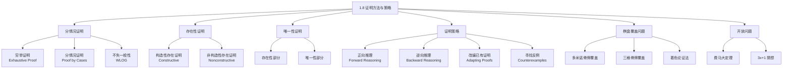

**相关笔记：** [[1.7 证明导论]]

> [!abstract] 概览
> 本节在 [[1.7 证明导论]] 的基础上，进一步扩展证明方法库，并讨论证明的**策略与艺术**。证明不仅是逻辑推导，还需要创造性的策略选择。
>
> - ==分情况证明（proof by cases）== 将问题分解为若干子情况，分别证明每个情况
> - ==穷举证明（exhaustive proof）== 是分情况证明的特例，逐一验证每个实例
> - ==不失一般性（WLOG）== 可以减少需要证明的情况数量
> - ==存在性证明== 分为**构造性**（给出具体实例）和**非构造性**（仅证明存在性）
> - ==唯一性证明== 需要同时证明存在性和唯一性
> - ==逆向推理（backward reasoning）== 和 ==改编已有证明== 是重要的证明策略

---

## 一、知识结构总览

---

## 二、核心思想

> [!tip] 核心思想
> ### 1. 穷举证明与分情况证明

### 1. 穷举证明与分情况证明

> [!def] 分情况证明的逻辑基础
> >
> 要证明 $(p_1 \vee p_2 \vee \cdots \vee p_n) \to q$，可以利用重言式：
> $$[(p_1 \vee p_2 \vee \cdots \vee p_n) \to q] \leftrightarrow [(p_1 \to q) \wedge (p_2 \to q) \wedge \cdots \wedge (p_n \to q)]$$

即：分别证明每个情况 $p_i \to q$，就完成了整个证明。

> [!def] 穷举证明（Exhaustive Proof）
> >
> 穷举证明是分情况证明的特例，其中每个"情况"只涉及**一个具体实例**的验证。

> [!example] 穷举证明
> **定理**：如果 $n$ 是正整数且 $n \leq 4$，则 $(n+1)^3 \geq 3^n$。
>
> **证明**：逐一验证 $n = 1, 2, 3, 4$：
> - $n = 1$：$(1+1)^3 = 8 \geq 3^1 = 3$ ✓
> - $n = 2$：$(2+1)^3 = 27 \geq 3^2 = 9$ ✓
> - $n = 3$：$(3+1)^3 = 64 \geq 3^3 = 27$ ✓
> - $n = 4$：$(4+1)^3 = 125 \geq 3^4 = 81$ ✓
>
> 所有情况均成立。$\blacksquare$

> [!example] 分情况证明
> **定理**：如果 $n$ 是整数，则 $n^2 \geq n$。
>
> **证明**：分三种情况。
>
> **情况 (i)**：$n = 0$。$0^2 = 0 \geq 0$。成立。
>
> **情况 (ii)**：$n \geq 1$。将不等式 $n \geq 1$ 两边乘以正整数 $n$，得 $n \cdot n \geq n \cdot 1$，即 $n^2 \geq n$。成立。
>
> **情况 (iii)**：$n \leq -1$。因为 $n^2 \geq 0$（任何整数的平方非负），且 $n \leq -1 < 0$，所以 $n^2 \geq 0 > n$，即 $n^2 \geq n$。成立。
>
> 三种情况均成立，定理得证。$\blacksquare$

> [!example] 分情况证明：绝对值的乘法性质
> **定理**：$|xy| = |x||y|$（$x, y$ 为实数）。
>
> **证明**：分四种情况。
>
> **情况 (i)**：$x \geq 0, y \geq 0$。$xy \geq 0$，$|xy| = xy = |x||y|$。✓
>
> **情况 (ii)**：$x \geq 0, y < 0$。$xy \leq 0$，$|xy| = -xy = x(-y) = |x||y|$。✓
>
> **情况 (iii)**：$x < 0, y \geq 0$。与情况 (ii) 对称，$|xy| = -xy = (-x)y = |x||y|$。✓
>
> **情况 (iv)**：$x < 0, y < 0$。$xy > 0$，$|xy| = xy = (-x)(-y) = |x||y|$。✓
>
> 四种情况均成立。$\blacksquare$

> [!example] 分情况证明：完全平方数的末位数字
> **定理**：完全平方数的末位十进制数字只能是 0, 1, 4, 5, 6, 或 9。
>
> **证明**：任何整数 $n$ 可以写成 $n = 10a + b$，其中 $b \in \{0, 1, 2, \ldots, 9\}$ 是末位数字。
>
> $$n^2 = (10a + b)^2 = 100a^2 + 20ab + b^2 = 10(10a^2 + 2b) + b^2$$
>
> 所以 $n^2$ 的末位数字与 $b^2$ 的末位数字相同。又因为 $(10-b)^2 = 100 - 20b + b^2$ 的末位数字也与 $b^2$ 相同，只需考虑 $b = 0, 1, 2, 3, 4, 5$：
>
> | $b$ | $b^2$ | 末位数字 |
> |:---:|:-----:|:--------:|
> | 0 | 0 | 0 |
> | 1 | 1 | 1 |
> | 2 | 4 | 4 |
> | 3 | 9 | 9 |
> | 4 | 16 | 6 |
> | 5 | 25 | 5 |
>
> 对应 $b = 6, 7, 8, 9$ 的情况分别与 $b = 4, 3, 2, 1$ 的末位数字相同。
>
> 因此完全平方数的末位数字只能是 0, 1, 4, 5, 6, 9。$\blacksquare$

### 2. 不失一般性（Without Loss of Generality, WLOG）

> [!def] 不失一般性
> >
> 当证明中的某些情况可以通过**简单交换变量名**或**对称性**从已证明的情况得出时，可以声明"不失一般性"（常缩写为 WLOG），只证明其中一种情况。

> [!warning] WLOG 的正确使用
> WLOG 仅在以下条件满足时才能使用：
> - 未证明的情况可以通过**已证明的情况**经简单变换得到
> - 变换不改变问题的本质（如交换对称变量的角色）
>
> **错误使用**可能导致证明不完整，遗漏本质不同的情况。

> [!example] WLOG 示例
> **定理**：如果 $x$ 和 $y$ 是整数，且 $xy$ 和 $x + y$ 都是偶数，则 $x$ 和 $y$ 都是偶数。
>
> **证明**（逆否证明 + WLOG + 分情况）：
>
> 假设 $x$ 和 $y$ 不都是偶数。不失一般性，假设 $x$ 是奇数（如果 $y$ 是奇数，只需交换 $x$ 和 $y$ 的角色，证明完全相同）。
>
> 设 $x = 2m + 1$。分两种情况：
>
> **情况 (i)**：$y$ 是偶数，$y = 2n$。
> $$x + y = (2m+1) + 2n = 2(m+n) + 1$$
> $x + y$ 是奇数，与前提 "$x + y$ 是偶数" 矛盾。
>
> **情况 (ii)**：$y$ 是奇数，$y = 2n + 1$。
> $$xy = (2m+1)(2n+1) = 4mn + 2m + 2n + 1 = 2(2mn + m + n) + 1$$
> $xy$ 是奇数，与前提 "$xy$ 是偶数" 矛盾。
>
> 两种情况都导致矛盾，逆否命题成立，原命题成立。$\blacksquare$

### 3. 存在性证明

> [!def] 存在性证明
> >
> 要证明 $\exists x P(x)$，即"存在具有性质 $P$ 的元素 $x$"。

**构造性存在证明（Constructive Existence Proof）**：找到一个具体的元素 $a$（称为**见证者，witness**），使得 $P(a)$ 为真。

**非构造性存在证明（Nonconstructive Existence Proof）**：通过某种推理（如反证法）证明 $\exists x P(x)$ 为真，但不给出具体的 $a$。

> [!example] 构造性存在证明
> **定理**：存在正整数，可以以两种不同方式表示为两个正整数的立方和。
>
> **证明**：
> $$1729 = 10^3 + 9^3 = 12^3 + 1^3$$
>
> 具体给出了 $1729$ 这个数（著名的 Hardy-Ramanujan 数）。$\blacksquare$

> [!example] 非构造性存在证明
> **定理**：存在无理数 $x$ 和 $y$，使得 $x^y$ 是有理数。
>
> **证明**：我们知道 $\sqrt{2}$ 是无理数。考虑 $\sqrt{2}^{\sqrt{2}}$。
>
> **情况 1**：如果 $\sqrt{2}^{\sqrt{2}}$ 是有理数，令 $x = \sqrt{2}$，$y = \sqrt{2}$，则 $x^y$ 是有理数。完成。
>
> **情况 2**：如果 $\sqrt{2}^{\sqrt{2}}$ 是无理数，令 $x = \sqrt{2}^{\sqrt{2}}$，$y = \sqrt{2}$，则：
> $$x^y = \left(\sqrt{2}^{\sqrt{2}}\right)^{\sqrt{2}} = \sqrt{2}^{\sqrt{2} \cdot \sqrt{2}} = \sqrt{2}^2 = 2$$
> $2$ 是有理数。完成。
>
> 无论哪种情况，都存在满足条件的 $x$ 和 $y$。但我们**不知道**究竟是哪对！$\blacksquare$

> [!tip] 构造性 vs. 非构造性
> - **构造性证明**信息量更大，不仅证明了存在性，还给出了具体实例
> - **非构造性证明**有时是唯一可行的方法，但信息量较少
> - 在计算机科学中，构造性证明更有价值（可以直接用于构造算法）

### 4. 唯一性证明

> [!def] 唯一性证明
> >
> 要证明"存在**唯一**元素 $x$ 使得 $P(x)$ 为真"，即 $\exists! x P(x)$，需要证明两部分：
>
> 1. **存在性（Existence）**：证明存在至少一个元素 $x$ 使得 $P(x)$ 为真
> 2. **唯一性（Uniqueness）**：证明如果 $x$ 和 $y$ 都满足 $P$，则 $x = y$

逻辑表达：$\exists x(P(x) \wedge \forall y(y \neq x \to \neg P(y)))$

> [!example] 唯一性证明
> **定理**：如果 $a$ 和 $b$ 是实数且 $a \neq 0$，则存在唯一的实数 $r$ 使得 $ar + b = 0$。
>
> **存在性**：令 $r = -b/a$。则 $a(-b/a) + b = -b + b = 0$。存在性得证。
>
> **唯一性**：设 $s$ 也满足 $as + b = 0$。则：
> $$ar + b = as + b$$
> 两边减去 $b$：$ar = as$
> 两边除以 $a$（$a \neq 0$）：$r = s$
>
> 唯一性得证。$\blacksquare$

### 5. 证明策略

#### 5.1 正向推理与逆向推理

> [!def] 正向推理（Forward Reasoning）
> >
> 从**前提**出发，利用公理、定义和已证定理，逐步推导到**结论**。这是最自然的推理方式，适用于前提到结论的路径比较清晰的情况。

> [!def] 逆向推理（Backward Reasoning）
> >
> 从**结论**出发，问自己"要证明结论，需要什么条件？"，找到一个可以证明的中间命题 $p$ 使得 $p \to q$，然后继续问"要证明 $p$，需要什么条件？"，直到回到已知的前提。

> [!warning] 逆向推理的注意事项
> 逆向推理中，要找的是 $p$ 使得 $p \to q$（$p$ 能推出结论），而**不是** $q \to r$（结论能推出 $r$）。后者是"乞题谬误"（begging the question）。

> [!example] 逆向推理：算术-几何平均不等式
> **定理**：如果 $x$ 和 $y$ 是不同的正实数，则 $\frac{x+y}{2} > \sqrt{xy}$。
>
> **逆向推理过程**（不是最终证明）：
> $$\frac{x+y}{2} > \sqrt{xy}$$
> $$\frac{(x+y)^2}{4} > xy$$
> $$(x+y)^2 > 4xy$$
> $$x^2 + 2xy + y^2 > 4xy$$
> $$x^2 - 2xy + y^2 > 0$$
> $$(x-y)^2 > 0$$
>
> 最后一步 $(x-y)^2 > 0$ 当 $x \neq y$ 时显然成立。
>
> **正式证明**（正向，逆转上述步骤）：
> 设 $x$ 和 $y$ 是不同的正实数。则 $(x-y)^2 > 0$（非零实数的平方为正）。展开：
> $$x^2 - 2xy + y^2 > 0$$
> 两边加 $4xy$：$x^2 + 2xy + y^2 > 4xy$，即 $(x+y)^2 > 4xy$。
> 两边除以 $4$：$\frac{(x+y)^2}{4} > xy$。
> 两边取正平方根：$\frac{x+y}{2} > \sqrt{xy}$。$\blacksquare$

> [!example] 逆向推理：博弈策略
> **定理**：有 15 颗石子，两人轮流取 1-3 颗，取最后一颗者胜。先手必胜。
>
> **逆向推理**：
> - 最后一步：先手赢当且仅当留给对手 1, 2, 或 3 颗石子
> - 对手被迫留 1-3 颗当且仅当对手面对 4 颗石子
> - 先手留 4 颗当且仅当先手面对 5, 6, 或 7 颗
> - 对手被迫留 5-7 颗当且仅当对手面对 8 颗
> - 先手留 8 颗当且仅当先手面对 9, 10, 或 11 颗
> - 对手被迫留 9-11 颗当且仅当对手面对 12 颗
> - **先手第一步取 3 颗，留 12 颗**
>
> 策略：先手依次留 12, 8, 4 颗给对手，必胜。$\blacksquare$

#### 5.2 改编已有证明

> [!tip] 改编证明的策略
> >
> 当新定理与已证定理结构相似时，可以尝试**改编已有证明**：
> 1. 找到结构相似的已证定理
> 2. 模仿其证明步骤，替换关键元素
> 3. 检查每一步是否仍然成立
> 4. 如有需要，补充额外的推理步骤

> [!example] 改编证明：$\sqrt{3}$ 是无理数
> 模仿 $\sqrt{2}$ 是无理数的证明（见 [[1.7 证明导论]]）：
>
> 假设 $\sqrt{3} = c/d$（最简分数）。平方：$3 = c^2/d^2$，$3d^2 = c^2$。
>
> 所以 $3$ 是 $c^2$ 的因子。由数论知识（第4章），如果素数 $p$ 整除 $c^2$，则 $p$ 整除 $c$。所以 $3$ 整除 $c$。
>
> 设 $c = 3k$，则 $3d^2 = 9k^2$，$d^2 = 3k^2$。所以 $3$ 整除 $d^2$，从而 $3$ 整除 $d$。
>
> **矛盾**：$3$ 同时整除 $c$ 和 $d$，但 $c/d$ 是最简分数。$\blacksquare$
>
> 此证明可推广到：$\sqrt{n}$ 是无理数，只要 $n$ 不是完全平方数。

### 6. 寻找反例

> [!tip] 反例搜索策略
> >
> 当面对一个猜想时：
> 1. **先尝试证明**：如果证明成功，猜想成为定理
> 2. **如果证明失败，寻找反例**：从最简单的、最小的例子开始
> 3. **如果找不到反例，再次尝试证明**：也许猜想确实为真，只是证明比较困难

> [!example] 反例搜索
> - "每个正整数都是两个整数的平方和" → 反例：$3$（$0^2 + 0^2 = 0$，$0^2 + 1^2 = 1$，$1^2 + 1^2 = 2$，都不等于 $3$）
> - "每个正整数都是三个整数的平方和" → 反例：$7$（可能的平方数：$0, 1, 4$。$0+0+0=0$，$0+0+1=1$，$0+1+1=2$，$1+1+1=3$，$0+0+4=4$，$0+1+4=5$，$1+1+4=6$，$0+4+4=8$。都不等于 $7$）
> - "每个正整数都是四个整数的平方和" → **为真**（Lagrange 四平方数定理）

### 7. 棋盘覆盖问题（Tiling Problems）

棋盘覆盖问题是学习证明策略的经典案例，展示了多种证明方法的综合运用。

#### 7.1 标准棋盘的多米诺覆盖

> [!example] 标准棋盘可以用多米诺骨牌覆盖
> **构造性存在证明**：将 32 块多米诺骨牌水平放置在 $8 \times 8$ 棋盘上，每块覆盖相邻两格。$\blacksquare$

#### 7.2 缺一角棋盘的多米诺覆盖

> [!example] 缺一角的棋盘不能用多米诺骨牌覆盖
> **反证法**：标准棋盘有 64 格，去掉一角后剩 63 格。每块多米诺覆盖 2 格，所以需要 $63/2 = 31.5$ 块，不是整数。矛盾。$\blacksquare$

#### 7.3 缺对角棋盘的多米诺覆盖

> [!example] 缺两对角的棋盘不能用多米诺骨牌覆盖
> **反证法 + 着色论证**：
>
> 将棋盘黑白交替着色（如标准棋盘）。每块多米诺覆盖一黑一白两格。
>
> 缺两对角后剩 62 格，需要 31 块多米诺，覆盖 31 黑 31 白。
>
> 但标准棋盘的两对角**同色**（都是黑色或都是白色），去掉后棋盘有 32 格一色、30 格另一色。
>
> **矛盾**：31 块多米诺需要覆盖 31 黑 31 白，但棋盘只有 32 黑 30 白（或反之）。$\blacksquare$

> [!tip] 着色论证法（Coloring Argument）
> 着色论证是一种强大的证明技巧，通过给对象赋予"颜色"标签，利用颜色分布的不对称性来证明不可能性。这种方法在组合数学和图论中广泛应用。

#### 7.4 直三格骨牌覆盖

> [!example] 直三格骨牌不能覆盖缺一角的棋盘
> 缺一角后剩 63 格，$63/3 = 21$ 块三格骨牌。
>
> 用**三色着色**（蓝、黑、白循环着色），棋盘有 21 蓝、21 黑、22 白。
>
> 每块直三格骨牌覆盖一蓝一黑一白。21 块骨牌覆盖 21 蓝、21 黑、21 白。
>
> 但缺角后（假设缺的是蓝色角），棋盘有 20 蓝、21 黑、22 白。
>
> **矛盾**：骨牌需要 21 蓝，但棋盘只有 20 蓝。$\blacksquare$

### 8. 开放问题

> [!info] 费马大定理（Fermat's Last Theorem）
> >
> **定理**：方程 $x^n + y^n = z^n$ 在 $n > 2$ 时没有非零整数解。

Fermat 在 17 世纪提出此猜想，声称"有一个绝妙的证明，但页边空白太小写不下"。经过三百多年的努力，**Andrew Wiles** 于 1994 年利用椭圆曲线理论完成了证明，证明长达数百页。

> [!info] $3x + 1$ 猜想（Collatz Conjecture）
> >
> **猜想**：定义变换 $T$：偶数 $x$ 映射到 $x/2$，奇数 $x$ 映射到 $3x + 1$。对于所有正整数 $x$，反复应用 $T$ 最终会到达 $1$。

例如：$13 \to 40 \to 20 \to 10 \to 5 \to 16 \to 8 \to 4 \to 2 \to 1$。

此猜想已对所有不超过 $5.48 \times 10^{18}$ 的正整数验证成立，但至今**无人能证明或否证**。它也被称为 Collatz 问题、Hasse 算法、Ulam 问题等。

---

## 三、补充理解与易混淆点

### 补充理解

### 构造性数学与直觉主义

**Brouwer（1907）** 创立的**直觉主义（Intuitionism）** 对"存在"的含义提出了严格的要求：在直觉主义数学中，"存在 $x$ 使得 $P(x)$"意味着"我们可以**构造**出这样的 $x$"。因此，非构造性存在证明在直觉主义中是不被接受的。这一观点导致了**直觉主义逻辑（Intuitionistic Logic）** 的诞生，其中排中律 $p \vee \neg p$ 不再是公理。虽然主流数学仍采用经典逻辑，但构造性方法在计算机科学中具有重要价值——一个构造性证明可以直接转化为一个算法。

> **来源**：Stanford Encyclopedia of Philosophy, "Constructive Mathematics" — https://plato.stanford.edu/entries/mathematics-constructive/
> **参考**：Brouwer, L. E. J. (1907). *Over de Grondslagen der Wiskunde*. PhD thesis, University of Amsterdam.
>
> **网络资源：**
> - [Carnap - Natural Deduction](https://carnap.io/srv/doc/gentzen-ND.md) -- 支持直觉主义逻辑的自然演绎系统

### Polya 的启发式证明策略

**George Polya（1945）** 在经典著作《怎样解题》（*How to Solve It*）中系统总结了数学发现的启发式方法。他提出了四步解题法：(1) 理解问题；(2) 拟定计划；(3) 执行计划；(4) 回顾反思。其中"逆向推理"（working backwards）是核心启发式策略之一——从目标出发倒推所需条件。Polya 的工作深刻影响了数学教育，其思想与本节讨论的证明策略高度一致：正向推理适用于路径清晰的问题，逆向推理适用于目标明确但路径不明的问题，改编已有证明则是利用数学知识的累积性。

> **来源**：Polya, G. (1945). *How to Solve It: A New Aspect of Mathematical Method*. Princeton University Press.
> **参考**：UCLA Math, "George Polya's tips for problem solving" — https://www.math.ucla.edu/~abrose/proofwriting/Polyas_howto.html
>
> **网络资源：**
> - [Carnap - Proof Reference Guide](https://calare.org/carnap.io.php) -- 证明策略参考指南

### 易混淆点

### 1. 穷举证明 vs. 分情况证明

| | 穷举证明 | 分情况证明 |
|:--|:--|:--|
| **每个情况** | 一个具体实例 | 一类情况（可能无限） |
| **适用范围** | 有限且较小的论域 | 有限个类别 |
| **本质** | 分情况证明的特例 | 更一般的证明方法 |
| **局限** | 论域大时不可行 | 需确保覆盖所有情况 |

### 2. 构造性存在证明 vs. 非构造性存在证明

| | 构造性 | 非构造性 |
|:--|:--|:--|
| **是否给出具体实例** | 是（witness） | 否 |
| **信息量** | 大 | 小 |
| **CS 应用价值** | 高（可直接编程） | 低 |
| **方法** | 直接构造 | 反证法等 |
| **直觉主义接受度** | 接受 | 不接受 |

---

## 四、习题精选

> [!todo] 习题概览
> | 题号 | 核心考点 | 难度 |
> |:----:|:---------|:----:|
> | 1-3 | 穷举证明 / 分情况证明 | ★☆☆ |
> | 4 | 分情况证明（立方和） | ★★☆ |
> | 5-6 | 分情况证明（max/min 函数） | ★★☆ |
> | 7-8 | WLOG 的应用 | ★★☆ |
> | 9 | 三角不等式（分情况证明） | ★★★ |
> | 10-14 | 存在性证明（构造性/非构造性） | ★★★ |
> | 15-16 | 证明或反驳（有理数幂） | ★★★ |
> | 17 | 唯一性命题的等价表达 | ★★☆ |
> | 18-23 | 唯一性证明 | ★★☆ |
> | 24-26 | 正向/逆向推理（均值不等式） | ★★★ |
> | 27-28 | 逆向推理（奇偶性、博弈） | ★★★ |
> | 29-30 | 分情况证明（末位数字） | ★★☆ |
> | 31-33 | 分情况证明（无整数解） | ★★★ |
> | 34 | 勾股数（构造性证明） | ★★☆ |
> | 35-38 | 改编证明（无理数、稠密性） | ★★★ |
> | 39 | 排序不等式 | ★★★ |
> | 41-52 | 棋盘覆盖问题 | ★★★ |

### 题1：分情况证明

> [!problem] 题目
> 证明：对任意整数 $n$，$n^2 + n$ 总是偶数。

> [!faq]- 解答
> 分两种情况：
>
> **情况 (i)**：$n$ 是偶数。则存在整数 $k$ 使得 $n = 2k$。
> $$n^2 + n = (2k)^2 + 2k = 4k^2 + 2k = 2(2k^2 + k)$$
> 因为 $2k^2 + k$ 是整数，所以 $n^2 + n$ 是偶数。
>
> **情况 (ii)**：$n$ 是奇数。则存在整数 $k$ 使得 $n = 2k + 1$。
> $$n^2 + n = (2k+1)^2 + (2k+1) = 4k^2 + 4k + 1 + 2k + 1 = 4k^2 + 6k + 2 = 2(2k^2 + 3k + 1)$$
> 因为 $2k^2 + 3k + 1$ 是整数，所以 $n^2 + n$ 是偶数。
>
> 两种情况均成立，因此 $n^2 + n$ 总是偶数。$lacksquare$

### 题2：穷举证明——平方和的奇偶性

> [!problem] 题目
> 用穷举证明法证明：$n^2 + n$ 对所有正整数 $n$ 是偶数。（注：本题与题1相同，请用穷举法的视角重新审视。）

> [!faq]- 解答
> 穷举证明法适用于有限论域。对于正整数全体，穷举法不适用，应使用分情况证明（如题1所示）。
>
> 但如果论域限制为有限集合，例如"对 $n \in \{1, 2, 3, 4, 5\}$，$n^2 + n$ 是偶数"，则穷举法适用：
>
> - $n = 1$：$1 + 1 = 2$（偶数）✓
> - $n = 2$：$4 + 2 = 6$（偶数）✓
> - $n = 3$：$9 + 3 = 12$（偶数）✓
> - $n = 4$：$16 + 4 = 20$（偶数）✓
> - $n = 5$：$25 + 5 = 30$（偶数）✓
>
> 所有情况均成立。$\blacksquare$

### 题3：构造性证明——完全平方数之差

> [!problem] 题目
> 用构造性证明法证明：每个正整数都可以表示为两个完全平方数之差。

> [!faq]- 解答
> **定理**：对每个正整数 $n$，存在非负整数 $a$ 和 $b$ 使得 $n = a^2 - b^2$。
>
> **证明**（构造性）：
>
> 注意 $a^2 - b^2 = (a - b)(a + b)$。要使 $(a-b)(a+b) = n$，只需找到 $n$ 的两个同奇偶的正因子 $d_1$ 和 $d_2$（$d_1 < d_2$），令 $a - b = d_1$，$a + b = d_2$，解得 $a = \frac{d_1 + d_2}{2}$，$b = \frac{d_2 - d_1}{2}$。
>
> 分情况构造：
>
> **情况 (i)**：$n$ 是奇数。设 $n = 2k + 1$（$k \geq 0$）。
>
> 取 $d_1 = 1$，$d_2 = 2k + 1 = n$（两者都是奇数，同奇偶），则：
> $$a = \frac{1 + n}{2} = k + 1, \quad b = \frac{n - 1}{2} = k$$
>
> 验证：$a^2 - b^2 = (k+1)^2 - k^2 = 2k + 1 = n$ ✓
>
> **情况 (ii)**：$n$ 是 $4$ 的倍数。设 $n = 4k$（$k \geq 1$）。
>
> 取 $d_1 = 2$，$d_2 = 2k$（两者都是偶数，同奇偶），则：
> $$a = \frac{2 + 2k}{2} = k + 1, \quad b = \frac{2k - 2}{2} = k - 1$$
>
> 验证：$a^2 - b^2 = (k+1)^2 - (k-1)^2 = 4k = n$ ✓
>
> **情况 (iii)**：$n \equiv 2 \pmod{4}$（即 $n = 2, 6, 10, 14, \ldots$）。
>
> 此时 $n$ 的任意两个因子 $d_1, d_2$ 中，必有一个为奇数一个为偶数（因为 $n$ 恰好含一个因子 $2$），所以 $d_1$ 和 $d_2$ 不同奇偶，$\frac{d_1+d_2}{2}$ 和 $\frac{d_2-d_1}{2}$ 不是整数。
>
> 因此 $n \equiv 2 \pmod{4}$ 的正整数**不能**表示为两个完全平方数之差。
>
> **修正后的定理**：每个不是 $2 \pmod{4}$ 的正整数（即奇数或 $4$ 的倍数）都可以表示为两个完全平方数之差。$\blacksquare$

### 题4：分情况证明——多项式的奇偶性

> [!problem] 题目
> 用分情况证明法证明：对任意整数 $n$，$n^2 + 3n + 1$ 是奇数。

> [!faq]- 解答
> **定理**：对任意整数 $n$，$n^2 + 3n + 1$ 是奇数。
>
> **证明**：分两种情况。
>
> **情况 (i)**：$n$ 是偶数。则存在整数 $k$ 使得 $n = 2k$。
> $$n^2 + 3n + 1 = (2k)^2 + 3(2k) + 1 = 4k^2 + 6k + 1 = 2(2k^2 + 3k) + 1$$
>
> 因为 $2k^2 + 3k$ 是整数，所以 $n^2 + 3n + 1$ 是奇数。
>
> **情况 (ii)**：$n$ 是奇数。则存在整数 $k$ 使得 $n = 2k + 1$。
> $$n^2 + 3n + 1 = (2k+1)^2 + 3(2k+1) + 1 = 4k^2 + 4k + 1 + 6k + 3 + 1 = 4k^2 + 10k + 5 = 2(2k^2 + 5k + 2) + 1$$
>
> 因为 $2k^2 + 5k + 2$ 是整数，所以 $n^2 + 3n + 1$ 是奇数。
>
> 两种情况均成立，因此对任意整数 $n$，$n^2 + 3n + 1$ 是奇数。$\blacksquare$

### 题5：数学归纳法——平方和公式

> [!problem] 题目
> 用数学归纳法证明：$\displaystyle\sum_{k=1}^{n} k^2 = \frac{n(n+1)(2n+1)}{6}$ 对所有正整数 $n$ 成立。

> [!faq]- 解答
> **定理**：对所有正整数 $n$，$\displaystyle\sum_{k=1}^{n} k^2 = \frac{n(n+1)(2n+1)}{6}$。
>
> **证明**（数学归纳法）：
>
> **基础步（Base Case）**：$n = 1$。
> $$\sum_{k=1}^{1} k^2 = 1^2 = 1$$
> $$\frac{1 \cdot (1+1) \cdot (2 \cdot 1 + 1)}{6} = \frac{1 \cdot 2 \cdot 3}{6} = \frac{6}{6} = 1$$
>
> 左边 = 右边 = 1，基础步成立。
>
> **归纳假设（Inductive Hypothesis）**：假设对某个正整数 $n$，公式成立：
> $$\sum_{k=1}^{n} k^2 = \frac{n(n+1)(2n+1)}{6}$$
>
> **归纳步（Inductive Step）**：证明公式对 $n + 1$ 也成立。
>
> $$\sum_{k=1}^{n+1} k^2 = \sum_{k=1}^{n} k^2 + (n+1)^2$$
>
> 由归纳假设：
> $$= \frac{n(n+1)(2n+1)}{6} + (n+1)^2$$
>
> 提取公因子 $(n+1)$：
> $$= (n+1)\left[\frac{n(2n+1)}{6} + (n+1)\right]$$
>
> 通分：
> $$= (n+1)\left[\frac{n(2n+1) + 6(n+1)}{6}\right]$$
> $$= (n+1)\left[\frac{2n^2 + n + 6n + 6}{6}\right]$$
> $$= (n+1)\left[\frac{2n^2 + 7n + 6}{6}\right]$$
>
> 对分子因式分解：$2n^2 + 7n + 6 = (2n + 3)(n + 2)$。
>
> 验证：$(2n+3)(n+2) = 2n^2 + 4n + 3n + 6 = 2n^2 + 7n + 6$ ✓
>
> 因此：
> $$= (n+1) \cdot \frac{(2n+3)(n+2)}{6}$$
> $$= \frac{(n+1)(n+2)(2n+3)}{6}$$
>
> 令 $m = n + 1$，则上式为 $\frac{m(m+1)(2m+1)}{6}$，恰好是公式在 $n + 1$ 时的形式。
>
> 归纳步成立。由数学归纳法，公式对所有正整数 $n$ 成立。$\blacksquare$

---

> [!tip] 解题思路提示
> 1. **分情况证明**：确保覆盖所有情况，利用 WLOG 减少对称情况的重复证明
> 2. **存在性证明**：构造性证明给出具体实例，非构造性证明通过反证法等间接方法
> 3. **逆向推理**：从结论出发倒推所需条件，找到后正向写出正式证明

## 五、视频学习指南

> [!info] 视频资源
> | 资源 | 链接 | 对应内容 | 备注 |
> |:-----|:-----|:---------|:-----|
> | Rosen 8e Section 1.8 | [教材原文](https://www.mheducation.com/highered/product/discrete-mathematics-applications-rosen/M9781259676512.html) | 证明方法与策略完整内容 | 英文教材 |
> | MIT 6.042J Lectures | [链接](https://www.youtube.com/results?search_query=MIT+6.042+discrete+math) | 对应章节讲解 | 英文，MIT开放课程 |
> | TrevTutor Discrete Math | [链接](https://www.youtube.com/results?search_query=TrevTutor+discrete+math) | 知识点精讲 | 英文，适合入门 |

---

## 六、教材原文

> [!quote] 教材原文
> "Proof by cases can be used when the hypothesis of a statement can be broken down into a finite number of cases."
>
> "A constructive existence proof shows that an element with the desired property exists by explicitly producing such an element."

---

## 参见 Wiki

- [[逻辑学/concepts/自然演绎]] — 自然演绎系统中的证明策略
- [[逻辑学/concepts/间接证明]] — 间接证明方法
- [[逻辑学/concepts/有效性]] — 论证有效性
- [[逻辑学/concepts/实质蕴涵]] — 条件命题的逻辑基础
- [[逻辑学/concepts/重言式与矛盾式]] — 分情况证明的逻辑基础

--

- [[离散数学/concepts/证明方法]] — 建立数学命题为真的形式化论证技术

#学习/离散数学/逻辑与证明

