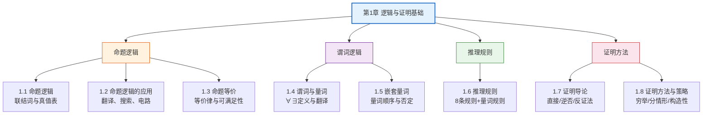

# 第01章 逻辑与证明基础 — 章节汇总

> [!abstract] 概览
> 第1章是离散数学的==逻辑基础==，从==命题逻辑==到==谓词逻辑==，再到==推理规则==与==证明方法==，构建了完整的数学推理体系。本章内容与逻辑学导论有大量重叠，但更侧重于==数学证明==的技术与策略。

---

## 全章知识框架



---

## 各节核心知识点汇总

### 1.1 命题逻辑

- **命题**（proposition）：或真或假的陈述句
- **六种逻辑联结词**：$\neg$（否定）、$\land$（合取）、$\lor$（析取）、$\oplus$（异或）、$\to$（条件）、$\leftrightarrow$（双条件）
- **条件语句**的逆命题、逆否命题、否命题及其等价关系：$p \to q \equiv \neg q \to \neg p$
- **位运算**：与、或、异或、非

### 1.2 命题逻辑的应用

- 自然语言到命题逻辑的翻译方法论
- 系统规约的精确化与一致性检验
- 布尔搜索（AND/OR/NOT）
- 逻辑谜题求解（骑士与无赖、泥孩子等）
- 逻辑电路设计（NOT/OR/AND 门）

### 1.3 命题等价

- **重言式**（tautology）、**矛盾式**（contradiction）、**偶然式**（contingency）
- **逻辑等价**：$p \equiv q \iff p \leftrightarrow q$ 是重言式
- 完整的等价律表（恒等律、支配律、幂等律、De Morgan 律、分配律、吸收律、否定律等）
- **链式推导法**证明新等价
- **可满足性**（SAT）与 NP 完全性
- **功能完备性**：$\{\text{NAND}\}$ 和 $\{\text{NOR}\}$ 是功能完备集

### 1.4 谓词与量词

- **谓词**（predicate）：带变量的命题函数 $P(x)$
- **全称量词** $\forall$、**存在量词** $\exists$、**唯一性量词** $\exists!$
- 有限域上量词与合取/析取的等价关系
- 受限量词的缩写（全称用蕴含、存在用合取）
- 量词的 De Morgan 律：$\neg \forall x P(x) \equiv \exists x \neg P(x)$

### 1.5 嵌套量词

- 嵌套量词的分层理解（内层量化 = 外层的命题函数）
- **量词顺序的重要性**：$\forall x \exists y$ 与 $\exists y \forall x$ 不等价
- 数学语句翻译（极限的 $\epsilon$-$\delta$ 定义）
- 否定嵌套量词的逐层 De Morgan 律方法
- **前束范式**（PNF）

### 1.6 推理规则

- **论证有效性**：当所有前提为真时结论不可能为假
- 8 条命题逻辑推理规则（假言推理、拒取式、假言三段论、析取三段论等）
- **归结原理**（resolution）
- 量词推理规则（全称实例化/泛化、存在实例化/泛化）
- 常见谬误：否定假设谬误、肯定结论谬误

### 1.7 证明导论

- **直接证明法**：假设 $p$ 为真，推导 $q$ 为真
- **逆否证明法**：证明 $\neg q \to \neg p$
- **反证法**（proof by contradiction）：假设 $\neg p$ 推出矛盾
- **空证明**与**平凡证明**
- **等价性证明**：$p \leftrightarrow q$ 需证 $p \to q$ 和 $q \to p$
- **反例**（counterexample）

### 1.8 证明方法与策略

- **穷举证明**与**分情况证明**
- **WLOG**（Without Loss of Generality）
- **构造性** vs **非构造性**存在证明
- **唯一性证明**
- **正向推理**与**逆向推理**
- **棋盘覆盖问题**（着色论证法）

---

## 学习脉络

```
命题逻辑（1.1-1.3）
  ↓ 扩展
谓词逻辑（1.4-1.5）
  ↓ 应用
推理规则（1.6）
  ↓ 实践
证明方法（1.7-1.8）
  ↓ 预告
集合与函数（第2章）— 将用本章的逻辑工具定义集合运算
```

---

## 跨章关联

| 后续章节 | 关联内容 | 关联方式 |
|:---------|:---------|:---------|
| 第2章 集合、函数 | 集合运算的定义使用逻辑联结词 | 直接应用 |
| 第3章 算法 | 算法正确性证明使用本章证明方法 | 直接应用 |
| 第5章 归纳与递归 | 数学归纳法是本章证明方法的扩展 | 深化 |
| 第9章 关系 | 等价关系、偏序关系的证明 | 直接应用 |

### 跨学科关联

| 学科 | 关联概念 | 说明 |
|:-----|:---------|:-----|
| 逻辑学导论 | 命题、有效性、自然演绎、推论规则 | DM-1.1~1.6 与逻辑学第1、8-10章内容高度重叠 |
| 数据结构 | 算法正确性证明 | 第3章将直接用到 |
| 计算机组成 | 逻辑电路设计 | 1.2 节的逻辑电路是数字逻辑的基础 |

---

## 复习题

> [!faq]- 综合复习题 1
> **题目：** 用命题逻辑和量词分别表达以下语句："每个学生都有一门喜欢的课程。"
>
> **解答：**
> 命题逻辑无法精确表达（因为涉及"每个"和"有一门"的量化）。
>
> 谓词逻辑：设 $S(x)$ 表示"$x$ 是学生"，$C(y)$ 表示"$y$ 是课程"，$L(x,y)$ 表示"$x$ 喜欢 $y$"。
> $$\forall x (S(x) \to \exists y (C(y) \land L(x,y)))$$

> [!faq]- 综合复习题 2
> **题目：** 用反证法证明：不存在最大的素数。
>
> **解答：**
> **假设**存在最大的素数 $p$。
>
> 考虑所有素数的乘积加 1：$N = p_1 \cdot p_2 \cdot \ldots \cdot p + 1$。
>
> - 若 $N$ 是素数，则 $N > p$，与"$p$ 是最大素数"矛盾。
> - 若 $N$ 不是素数，则 $N$ 有某个素因子 $q$。但 $q$ 不能是 $p_1, p_2, \ldots, p$ 中的任何一个（因为 $N$ 除以每个 $p_i$ 余 1），所以 $q$ 是一个不在列表中的新素数，且 $q \leq N > p$，矛盾。
>
> 因此假设不成立，不存在最大的素数。$\blacksquare$

---

## 笔记索引

| 节 | 标题 | 笔记链接 |
|:---|:-----|:---------|
| 1.1 | 命题逻辑 | [[1.1 命题逻辑]] |
| 1.2 | 命题逻辑的应用 | [[1.2 命题逻辑的应用]] |
| 1.3 | 命题等价 | [[1.3 命题等价]] |
| 1.4 | 谓词与量词 | [[1.4 谓词与量词]] |
| 1.5 | 嵌套量词 | [[1.5 嵌套量词]] |
| 1.6 | 推理规则 | [[1.6 推理规则]] |
| 1.7 | 证明导论 | [[1.7 证明导论]] |
| 1.8 | 证明方法与策略 | [[1.8 证明方法与策略]] |

#学习/离散数学/逻辑与证明
