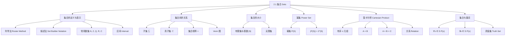

**相关笔记：** [[2.2 集合运算]]

> [!abstract] 概览
> 本节是离散数学中所有离散结构的基石，系统介绍了==集合（set）==的定义、表示方法、==子集（subset）==关系、集合的==基数（cardinality）==、==幂集（power set）==、==笛卡尔积（Cartesian product）==，以及集合记法与==量词（quantifier）==的结合使用。
>
> - **集合**是==无序的、互不相同的对象==的汇集，是离散数学中最基本的离散结构
> - 集合的两种主要表示方法是==列举法（roster method）==和==描述法（set builder notation）==
> - $A \subseteq B$ 当且仅当 $\forall x(x \in A \to x \in B)$；证明 $A \not\subseteq B$ 只需找到一个反例
> - 含 $n$ 个元素的集合的==幂集==有 $2^n$ 个元素
> - ==笛卡尔积== $A \times B$ 是所有有序对 $(a, b)$ 的集合，其中 $a \in A$，$b \in B$
> - 集合记法可与量词结合：$\forall x \in S(P(x))$ 是 $\forall x(x \in S \to P(x))$ 的简写

---

## 一、知识结构总览

---

## 二、核心思想

> [!tip] 核心思想
> 本节的核心思想是：集合是离散数学中最基本的离散结构，所有更复杂的离散对象（关系、函数、图等）都建立在集合之上。理解集合的定义、表示方法（列举法与描述法）、子集关系、幂集和笛卡尔积，是后续学习一切离散结构的基石。特别重要的是区分元素关系 $\in$ 与子集关系 $\subseteq$，以及掌握用逻辑语言精确描述集合性质的能力。

### 1. 集合的定义与表示

> [!def] 集合（Set）
> >
> **集合**是一个==无序的、互不相同的对象==的汇集，这些对象称为集合的==元素（elements）==或==成员（members）==。集合**包含**其元素。
>
> - $a \in A$ 表示 $a$ 是集合 $A$ 的元素
> - $a \notin A$ 表示 $a$ 不是集合 $A$ 的元素
> - 集合通常用**大写字母**表示，元素用**小写字母**表示

> [!def] 列举法（Roster Method）
> >
> 将集合的所有元素列在花括号 $\{ \}$ 中，例如 $V = \{a, e, i, o, u\}$。
>
> 当元素规律明显时，可以使用省略号 $\ldots$，例如 $\{1, 2, 3, \ldots, 99\}$。

> [!def] 描述法（Set Builder Notation）
> >
> 用元素必须满足的性质来刻画集合，一般形式为 $\{x \mid x \text{ has property } P\}$，读作"所有满足性质 $P$ 的 $x$ 的集合"。
>
> 例如：$O = \{x \in \mathbb{Z}^+ \mid x \text{ is odd and } x < 10\} = \{1, 3, 5, 7, 9\}$

> [!def] 常用数集
> >
> | 符号 | 名称 | 定义 |
> |------|------|------|
> | $\mathbb{N}$ | 自然数集 | $\{0, 1, 2, 3, \ldots\}$ |
> | $\mathbb{Z}$ | 整数集 | $\{\ldots, -2, -1, 0, 1, 2, \ldots\}$ |
> | $\mathbb{Z}^+$ | 正整数集 | $\{1, 2, 3, \ldots\}$ |
> | $\mathbb{Q}$ | 有理数集 | $\{p/q \mid p \in \mathbb{Z}, q \in \mathbb{Z}, q \neq 0\}$ |
> | $\mathbb{R}$ | 实数集 | 所有实数 |
> | $\mathbb{C}$ | 复数集 | 所有复数 |

> [!def] 区间（Interval）
> >
> 设 $a, b \in \mathbb{R}$ 且 $a \leq b$：
>
> | 记号 | 名称 | 定义 |
> |------|------|------|
> | $[a, b]$ | 闭区间 | $\{x \mid a \leq x \leq b\}$ |
> | $(a, b)$ | 开区间 | $\{x \mid a < x < b\}$ |
> | $[a, b)$ | 半开半闭 | $\{x \mid a \leq x < b\}$ |
> | $(a, b]$ | 半闭半开 | $\{x \mid a < x \leq b\}$ |

> [!example] 集合的元素可以多样化
> >
> 集合 $\{a, 2, \text{Fred}, \text{New Jersey}\}$ 是一个合法的集合，包含四个元素：字母 $a$、数字 $2$、人名 Fred 和地名 New Jersey。集合中的元素**不必**具有相似的性质。

### 2. 集合相等

> [!def] 集合相等（Set Equality）
> >
> 两个集合相等**当且仅当**它们有完全相同的元素：
>
> $$A = B \iff \forall x(x \in A \leftrightarrow x \in B)$$
>
> - 集合中元素的**排列顺序**无关紧要：$\{1, 3, 5\} = \{3, 5, 1\}$
> - 集合中元素的**重复**不影响集合：$\{1, 3, 3, 5, 5\} = \{1, 3, 5\}$

> [!def] 空集（Empty Set / Null Set）
> >
> ==空集==是不包含任何元素的集合，记为 $\emptyset$（或 $\{\}$）。
>
> - $|\emptyset| = 0$
> - $\emptyset$ 与 $\{\emptyset\}$ 是**不同的**：$\emptyset$ 没有元素，而 $\{\emptyset\}$ 有一个元素（即 $\emptyset$ 本身）
> - 类比：$\emptyset$ 是空文件夹，$\{\emptyset\}$ 是里面有一个空文件夹的文件夹

> [!tip] 证明两个集合相等的方法
> >
> 要证明 $A = B$，只需证明 $A \subseteq B$ 且 $B \subseteq A$。这一方法在后文中反复使用。

### 3. Venn 图

> [!def] Venn 图（Venn Diagram）
> >
> ==Venn 图==用图形方式表示集合及其关系：
>
> - **矩形**表示==全集（universal set）== $U$，包含所有当前讨论的对象
> - **圆形**（或其他封闭图形）表示集合
> - 圆内的**点**表示集合的元素

### 4. 子集

> [!def] 子集（Subset）
> >
> 集合 $A$ 是 $B$ 的==子集==，记为 $A \subseteq B$，当且仅当 $A$ 的每个元素也是 $B$ 的元素：
>
> $$A \subseteq B \iff \forall x(x \in A \to x \in B)$$
>
> 等价地，$B$ 是 $A$ 的==超集（superset）==，记为 $B \supseteq A$。

> [!def] 真子集（Proper Subset）
> >
> $A$ 是 $B$ 的==真子集==，记为 $A \subset B$，当且仅当 $A \subseteq B$ 且 $A \neq B$：
>
> $$A \subset B \iff \forall x(x \in A \to x \in B) \land \exists x(x \in B \land x \notin A)$$

> [!thm] 空集和集合本身是子集
>
> 对于任意集合 $S$：
>
> (i) $\emptyset \subseteq S$
>
> (ii) $S \subseteq S$
>
> **证明 (i)**：要证 $\forall x(x \in \emptyset \to x \in S)$。因为空集不包含任何元素，所以 $x \in \emptyset$ 恒为假。条件语句 $x \in \emptyset \to x \in S$ 的假设恒为假，因此该条件语句恒为真（这是==空虚证明（vacuous proof）==的一个实例）。证毕。

> [!tip] 子集判定的实用规则
> >
> | 目标 | 方法 |
> |------|------|
> | 证明 $A \subseteq B$ | 任取 $x \in A$，证明 $x \in B$ |
> | 证明 $A \not\subseteq B$ | 找到一个 $x \in A$ 使得 $x \notin B$（反例） |

### 5. 集合的基数

> [!def] 基数（Cardinality）
> >
> 设 $S$ 为集合。若 $S$ 恰有 $n$ 个不同的元素（$n$ 为非负整数），则称 $S$ 为==有限集（finite set）==，$n$ 称为 $S$ 的==基数==，记为 $|S|$。
>
> - $|\{a, e, i, o, u\}| = 5$
> - $|\emptyset| = 0$
>
> 不是有限集的集合称为==无限集（infinite set）==，例如 $\mathbb{Z}^+$、$\mathbb{R}$。

### 6. 幂集

> [!def] 幂集（Power Set）
> >
> 集合 $S$ 的==幂集== $\mathcal{P}(S)$ 是 $S$ 的所有子集构成的集合：
>
> $$\mathcal{P}(S) = \{X \mid X \subseteq S\}$$

> [!example] 幂集的计算
> >
> $\mathcal{P}(\{0, 1, 2\}) = \{\emptyset, \{0\}, \{1\}, \{2\}, \{0, 1\}, \{0, 2\}, \{1, 2\}, \{0, 1, 2\}\}$
>
> 共 $8 = 2^3$ 个元素。
>
> $\mathcal{P}(\emptyset) = \{\emptyset\}$（1 个元素）
>
> $\mathcal{P}(\{\emptyset\}) = \{\emptyset, \{\emptyset\}\}$（2 个元素）

> [!thm] 幂集的大小
>
> 若 $|S| = n$，则 $|\mathcal{P}(S)| = 2^n$。
>
> **直觉理解**：对 $S$ 中的每个元素，在构造子集时都有"选"或"不选"两种选择，$n$ 个元素共有 $2^n$ 种组合。

### 7. 笛卡尔积

> [!def] 有序 $n$ 元组（Ordered $n$-tuple）
> >
> ==有序 $n$ 元组== $(a_1, a_2, \ldots, a_n)$ 是一个有序的汇集，其中 $a_i$ 是第 $i$ 个元素。
>
> 两个有序 $n$ 元组相等当且仅当对应位置的每个元素都相等：
>
> $$(a_1, a_2, \ldots, a_n) = (b_1, b_2, \ldots, b_n) \iff a_i = b_i \text{ for } i = 1, 2, \ldots, n$$
>
> 有序 2 元组特称为==有序对（ordered pair）==。

> [!def] 笛卡尔积（Cartesian Product）
> >
> 集合 $A$ 和 $B$ 的==笛卡尔积== $A \times B$ 是所有有序对 $(a, b)$ 的集合，其中 $a \in A$，$b \in B$：
>
> $$A \times B = \{(a, b) \mid a \in A \land b \in B\}$$

> [!example] 笛卡尔积的计算
> >
> 设 $A = \{1, 2\}$，$B = \{a, b, c\}$，则：
>
> $$A \times B = \{(1, a), (1, b), (1, c), (2, a), (2, b), (2, c)\}$$
>
> $$B \times A = \{(a, 1), (a, 2), (b, 1), (b, 2), (c, 1), (c, 2)\}$$
>
> 注意 $A \times B \neq B \times A$（有序对中顺序重要）。

> [!def] 多个集合的笛卡尔积
> >
> $$A_1 \times A_2 \times \cdots \times A_n = \{(a_1, a_2, \ldots, a_n) \mid a_i \in A_i \text{ for } i = 1, 2, \ldots, n\}$$
>
> 特别地，$A^n = \underbrace{A \times A \times \cdots \times A}_{n \text{ 个}}$。

> [!thm] 笛卡尔积的大小
>
> 若 $|A| = m$，$|B| = n$，则 $|A \times B| = m \cdot n$。
>
> 推广：$|A_1 \times A_2 \times \cdots \times A_n| = |A_1| \cdot |A_2| \cdot \cdots \cdot |A_n|$。

> [!def] 关系（Relation）
> >
> 笛卡尔积 $A \times B$ 的一个==子集== $R$ 称为从 $A$ 到 $B$ 的==关系（relation）==。从集合 $A$ 到自身的关系称为 $A$ 上的关系。
>
> 例如，$R = \{(0, 0), (0, 1), (0, 2), (1, 1), (1, 2), (2, 2)\}$ 是集合 $\{0, 1, 2\}$ 上的"小于等于"关系。

### 8. 集合记法与量词

> [!def] 集合限定量词
> >
> - $\forall x \in S(P(x))$ 是 $\forall x(x \in S \to P(x))$ 的简写
> - $\exists x \in S(P(x))$ 是 $\exists x(x \in S \land P(x))$ 的简写

> [!example] 集合限定量词的翻译
> >
> - $\forall x \in \mathbb{R}(x^2 \geq 0)$："每个实数的平方都是非负的"（真）
> - $\exists x \in \mathbb{Z}(x^2 = 1)$："存在一个整数，其平方为 1"（真，$x = 1$ 或 $x = -1$）

### 9. 真值集

> [!def] 真值集（Truth Set）
> >
> 给定谓词 $P$ 和论域 $D$，$P$ 的==真值集==是 $D$ 中使 $P(x)$ 为真的所有元素 $x$ 构成的集合，记为 $\{x \in D \mid P(x)\}$。
>
> - $\forall x P(x)$ 在论域 $U$ 上为真 $\iff$ $P$ 的真值集就是 $U$
> - $\exists x P(x)$ 在论域 $U$ 上为真 $\iff$ $P$ 的真值集非空

---

## 三、补充理解与易混淆点

### 补充理解

### 1. 集合论的公理化：从朴素集合论到 ZFC

本节采用的是由 Georg Cantor 创立的==朴素集合论（naive set theory）==，即"任何满足某种性质的对象的汇集就是一个集合"。然而，1902 年 Bertrand Russell 发现了著名的==罗素悖论（Russell's paradox）==：考虑集合 $S = \{x \mid x \notin x\}$，则 $S \in S \iff S \notin S$，产生矛盾。为避免此类悖论，数学家发展了==公理化集合论（axiomatic set theory）==，其中最广泛使用的是 ==ZFC 集合论==（Zermelo-Fraenkel 集合论 + 选择公理）。ZFC 通过限制"集合"的构造方式，排除了"太大"的汇集（如"所有集合的集合"），从而在逻辑上保持一致性。虽然本书使用朴素集合论已足够，但了解公理化背景有助于理解为什么某些构造是被禁止的。

- **来源**: Halmos, P. R. (1960). *Naive Set Theory*. Springer-Verlag.
- **参考**: Jech, T. (2003). *Set Theory: The Third Millennium Edition*. Springer. [https://link.springer.com/book/10.1007/3-540-44761-X](https://link.springer.com/book/10.1007/3-540-44761-X)
>
> **网络资源：**
> - [IntersectMe](https://intersectme.leibniz-fli.de/) -- 交互式集合运算工具，支持 2-5 集合 Venn 图与 UpSet 图

### 2. 笛卡尔积与关系数据库的理论基础

笛卡尔积 $A \times B$ 不仅是数学中的基本构造，更是计算机科学中==关系数据库（relational database）==的理论基石。在关系数据库中，一张表（table）就是一个关系（relation），即笛卡尔积的一个子集。例如，若 $A$ 是所有学生 ID 的集合，$B$ 是所有课程编号的集合，则 $A \times B$ 表示所有可能的选课组合，而实际的学生选课表就是 $A \times B$ 的一个子集——每个有序对 $(a, b)$ 表示"学生 $a$ 选了课程 $b$"。关系数据库中的==选择（selection）==、==投影（projection）==和==连接（join）==操作都可以用集合运算来精确描述。E. F. Codd 在 1970 年提出的关系模型正是基于这一数学框架，他因此获得了图灵奖。

- **来源**: Codd, E. F. (1970). "A Relational Model of Data for Large Shared Data Banks." *Communications of the ACM*, 13(6), 377-387. [https://doi.org/10.1145/362384.362685](https://doi.org/10.1145/362384.362685)
>
> **网络资源：**
> - [Venn Diagram Generator (Academo)](https://academo.org/demos/venn-diagram-generator/) -- 滑块调节集合基数与交集的动态 Venn 图

### 易混淆点

### 1. 元素关系 $\in$ vs 子集关系 $\subseteq$

- ❌ 混淆 $\in$ 和 $\subseteq$，认为 $a \in A$ 和 $\{a\} \subseteq A$ 是一回事
- ✅ $a \in A$ 表示 $a$ 是集合 $A$ 的一个**元素**；$\{a\} \subseteq A$ 表示以 $a$ 为唯一元素的**集合**是 $A$ 的子集。两者层次不同：$\in$ 连接的是"元素与集合"，$\subseteq$ 连接的是"集合与集合"。例如，$1 \in \{1, 2, 3\}$ 为真，$\{1\} \subseteq \{1, 2, 3\}$ 也为真，但 $1 \subseteq \{1, 2, 3\}$ 无意义（1 不是集合），$\{1\} \in \{1, 2, 3\}$ 为假（$\{1\}$ 不是 $\{1, 2, 3\}$ 的元素）

### 2. 空集 $\emptyset$ vs 包含空集的集合 $\{\emptyset\}$

- ❌ 认为 $\emptyset$ 和 $\{\emptyset\}$ 是同一个东西
- ✅ $\emptyset$ 是**没有**任何元素的集合（$|\emptyset| = 0$）；$\{\emptyset\}$ 是有**一个**元素的集合，这个元素恰好是 $\emptyset$（$|\{\emptyset\}| = 1$）。类比：$\emptyset$ 是空文件夹，$\{\emptyset\}$ 是里面恰好放了一个空文件夹的文件夹。因此 $\emptyset \in \{\emptyset\}$ 为真，但 $\emptyset = \{\emptyset\}$ 为假

---

## 四、习题精选

> [!todo] 习题概览
> >
> | 题号范围 | 核心考点 | 难度 |
> |---------|---------|------|
> | 1-2 | 列举法与描述法的互译 | ⭐ |
> | 3-4 | 区间的判定与元素列举 | ⭐ |
> | 5-6 | 子集关系的判定 | ⭐⭐ |
> | 7 | 集合相等的判定（含重复元素、嵌套集合） | ⭐⭐ |
> | 8 | 子集关系的系统判定 | ⭐⭐ |
> | 9-10 | $\in$ vs $\subseteq$ 的辨析（嵌套集合） | ⭐⭐⭐ |
> | 11-13 | 空集与单元素集的 $\in$/$\subseteq$ 判断 | ⭐⭐⭐ |
> | 14-18 | Venn 图绘制与子集传递性证明 | ⭐⭐ |
> | 19 | 子集的传递性 $A \subseteq B \land B \subseteq C \to A \subseteq C$ | ⭐⭐ |
> | 20 | 同时满足 $A \in B$ 和 $A \subseteq B$ 的集合 | ⭐⭐⭐ |
> | 21-22 | 嵌套集合的基数计算 | ⭐⭐ |
> | 23-26 | 幂集的构造与判定 | ⭐⭐⭐ |
> | 27 | $\mathcal{P}(A) \subseteq \mathcal{P}(B) \iff A \subseteq B$ 的证明 | ⭐⭐⭐ |
> | 28 | 笛卡尔积的子集关系 | ⭐⭐ |
> | 29-36 | 笛卡尔积的计算 | ⭐⭐ |
> | 37-38 | 笛卡尔积的大小计算 | ⭐ |
> | 39-42 | 笛卡尔积的性质（交换律不成立、结合律不成立） | ⭐⭐⭐ |
> | 43-44 | 幂集与笛卡尔积的关系 | ⭐⭐⭐ |
> | 45-48 | 集合限定量词的翻译与真值判断 | ⭐⭐ |
> | 49 | 有序对的集合论构造 $\{\{a\}, \{a, b\}\}$ | ⭐⭐⭐⭐ |
> | 50 | 罗素悖论 | ⭐⭐⭐⭐ |

### 题1：证明子集的传递性

> [!problem] 题目
> 证明：若 $A \subseteq B$ 且 $B \subseteq C$，则 $A \subseteq C$。

> [!faq]- 解答
> 要证 $\forall x(x \in A \to x \in C)$。
>
> 设 $x$ 为任意元素，且 $x \in A$。
>
> 由 $A \subseteq B$，得 $x \in B$。
>
> 由 $B \subseteq C$，得 $x \in C$。
>
> 因此 $x \in A \to x \in C$ 对所有 $x$ 成立，即 $A \subseteq C$。$\blacksquare$

### 题2：集合的基本运算

> [!problem] 题目
> 设 $A = \{1,2,3,4\}$，$B = \{3,4,5,6\}$，求 $A \cup B$、$A \cap B$、$A - B$、$B - A$。

> [!faq]- 解答
> - $A \cup B = \{1,2,3,4,5,6\}$（取所有出现过的元素，去掉重复）
> - $A \cap B = \{3,4\}$（同时属于 $A$ 和 $B$ 的元素）
> - $A - B = \{1,2\}$（属于 $A$ 但不属于 $B$ 的元素）
> - $B - A = \{5,6\}$（属于 $B$ 但不属于 $A$ 的元素）
>
> 注意 $A - B \neq B - A$，差集运算不满足交换律。$\blacksquare$

### 题3：幂集的构造与验证

> [!problem] 题目
> 求 $A = \{a,b,c\}$ 的幂集 $\mathcal{P}(A)$，验证 $|\mathcal{P}(A)| = 2^{|A|}$。

> [!faq]- 解答
> $A$ 有 3 个元素，对每个元素有"选"或"不选"两种选择，共 $2^3 = 8$ 个子集：
>
> - 0 个元素：$\emptyset$
> - 1 个元素：$\{a\},\{b\},\{c\}$
> - 2 个元素：$\{a,b\},\{a,c\},\{b,c\}$
> - 3 个元素：$\{a,b,c\}$
>
> $$\mathcal{P}(A) = \{\emptyset, \{a\}, \{b\}, \{c\}, \{a,b\}, \{a,c\}, \{b,c\}, \{a,b,c\}\}$$
>
> 验证：$|\mathcal{P}(A)| = 8 = 2^3 = 2^{|A|}$。$\blacksquare$

### 题4：并集对子集关系的保持性

> [!problem] 题目
> 证明：若 $A \subseteq C$ 且 $B \subseteq C$，则 $A \cup B \subseteq C$。

> [!faq]- 解答
> 要证 $\forall x(x \in A \cup B \to x \in C)$。
>
> 设 $x$ 为任意元素，且 $x \in A \cup B$。
>
> 由并集定义，$x \in A$ 或 $x \in B$。
>
> - 若 $x \in A$，由 $A \subseteq C$，得 $x \in C$。
> - 若 $x \in B$，由 $B \subseteq C$，得 $x \in C$。
>
> 无论哪种情况，都有 $x \in C$。
>
> 因此 $A \cup B \subseteq C$。$\blacksquare$

### 题5：容斥原理的证明

> [!problem] 题目
> 证明：对任意有限集 $A$ 和 $B$，$|A \cup B| = |A| + |B| - |A \cap B|$（容斥原理）。

> [!faq]- 解答
> **证明**：将 $A \cup B$ 划分为三个不相交的部分：
>
> $$A \cup B = (A - B) \cup (A \cap B) \cup (B - A)$$
>
> 这三个集合两两不相交，因此：
>
> $$|A \cup B| = |A - B| + |A \cap B| + |B - A|$$
>
> 另一方面：
>
> $$|A| = |A - B| + |A \cap B| \implies |A - B| = |A| - |A \cap B|$$
>
> $$|B| = |B - A| + |A \cap B| \implies |B - A| = |B| - |A \cap B|$$
>
> 代入得：
>
> $$|A \cup B| = (|A| - |A \cap B|) + |A \cap B| + (|B| - |A \cap B|) = |A| + |B| - |A \cap B|$$
>
> $\blacksquare$

> [!tip] 解题思路提示
> 子集证明的核心模式：任取 $x \in A$，利用已知包含关系逐步"传递" membership，最终得到 $x \in C$。这种链式推理在后续的关系传递性、等价关系等章节中会反复出现。

---

## 五、视频学习指南

> [!info] 视频资源
> | 资源 | 链接 | 对应内容 | 备注 |
> |:-----|:-----|:---------|:-----|
> | Rosen 8e Section 2.1 | [教材原文](https://www.mheducation.com/highered/product/discrete-mathematics-applications-rosen/M9781259676512.html) | 集合的定义、表示方法、子集 | 英文教材 |
> | MIT 6.042J Lecture 2 | [链接](https://www.youtube.com/watch?v=kEJQlA-1udE) | 集合、子集与幂集 | 英文，MIT开放课程 |
> | 3Blue1Brown - Essence of Linear Algebra | [链接](https://www.youtube.com/playlist?list=PLZHQObOWTQDPD3MizzM2xVFitgF8hE_ab) | 线性代数直觉（含笛卡尔积） | 英文，可视化讲解 |

---

## 六、教材原文

> [!quote] 教材原文
> "A set is an unordered collection of objects, called elements or members of the set. A set is said to contain its elements."
>
> "The set A is said to be a subset of B if and only if every element of A is also an element of B. We use the notation A ⊆ B to indicate that A is a subset of the set B."

---

## 参见 Wiki

- [[离散数学/concepts/集合]] -- 集合的基本概念与公理化基础
- [[离散数学/concepts/集合|子集]] -- 子集与真子集的定义及性质
- [[离散数学/concepts/集合|幂集]] -- 幂集的结构与计数
- [[离散数学/concepts/集合|笛卡尔积]] -- 笛卡尔积与有序对
- [[离散数学/concepts/集合|关系]] -- 笛卡尔积的子集，关系的定义与性质
- [[离散数学/concepts/集合|Venn图]] -- 集合关系的图形表示方法
- [[离散数学/concepts/集合|朴素集合论]] -- Cantor 的集合论及其局限性
#学习/离散数学/基本结构
