**相关笔记：** [[2.1 集合]] | [[2.3 函数]]

> [!abstract] 概览
> 本节系统介绍了集合的五种基本运算——==并集（union）==、==交集（intersection）==、==差集（difference）==、==补集（complement）==和==对称差（symmetric difference）==，给出了完整的==集合恒等式（set identities）==表，并讨论了三种证明集合恒等式的方法、广义并交运算、集合的==计算机表示（bit string）==以及==多重集（multiset）==的概念。
>
> - **并集** $A \cup B = \{x \mid x \in A \lor x \in B\}$，**交集** $A \cap B = \{x \mid x \in A \land x \in B\}$
> - **差集** $A - B = \{x \mid x \in A \land x \notin B\}$，**补集** $\overline{A} = U - A$
> - ==德摩根律（De Morgan's laws）==：$\overline{A \cap B} = \overline{A} \cup \overline{B}$，$\overline{A \cup B} = \overline{A} \cap \overline{B}$
> - 集合恒等式有三种证明方法：**子集法**、**成员表法**、**已知恒等式推导法**
> - 有限全集上的集合可用==位字符串（bit string）==表示，集合运算对应==按位布尔运算==
> - ==多重集==允许元素重复出现，其并、交、差运算基于==重数（multiplicity）==的最大值/最小值/差值

---

## 一、知识结构总览

```mermaid
graph TB
    A["2.2 集合运算 Set Operations"] --> B["基本集合运算"]
    A --> C["集合恒等式"]
    A --> D["广义并交"]
    A --> E["计算机表示"]
    A --> F["多重集"]

    B --> B1["并集 A ∪ B"]
    B --> B2["交集 A ∩ B"]
    B --> B3["不相交 Disjoint"]
    B --> B4["差集 A − B"]
    B --> B5["补集 Ā"]
    B --> B6["对称差 A ⊕ B"]

    C --> C1["恒等律 Identity"]
    C --> C2["支配律 Domination"]
    C --> C3["幂等律 Idempotent"]
    C --> C4["交换律 Commutative"]
    C --> C5["结合律 Associative"]
    C --> C6["分配律 Distributive"]
    C --> C7["德摩根律 De Morgan"]
    C --> C8["吸收律 Absorption"]
    C --> C9["补律 Complement"]

    C --> C10["子集法证明"]
    C --> C11["成员表法证明"]
    C --> C12["恒等式推导法"]

    D --> D1["有限并 ⋃ᵢ₌₁ⁿ Aᵢ"]
    D --> D2["有限交 ⋂ᵢ₌₁ⁿ Aᵢ"]
    D --> D3["无限并 ⋃ᵢ₌₁^∞ Aᵢ"]
    D --> D4["无限交 ⋂ᵢ₌₁^∞ Aᵢ"]

    E --> E1["位字符串表示"]
    E --> E2["按位 OR/AND/NOT"]

    F --> F1["重数 Multiplicity"]
    F --> F2["多重集的并/交/差/和"]
```

---

## 二、核心思想

> [!tip] 核心思想
> 本节的核心思想是：集合运算与命题逻辑运算存在精确的对应关系——并集对应析取、交集对应合取、补集对应否定。这一对应关系使得每个集合恒等式都可以转化为一个命题逻辑等价式，反之亦然。掌握三种证明集合恒等式的方法（子集法、成员表法、恒等式推导法），以及理解集合运算与位运算的对应，是本节的关键。

### 1. 并集

> [!def] 并集（Union）
> >
> 设 $A$ 和 $B$ 为集合。$A$ 和 $B$ 的==并集==，记为 $A \cup B$，是包含所有属于 $A$ 或属于 $B$（或同时属于两者）的元素的集合：
>
> $$A \cup B = \{x \mid x \in A \lor x \in B\}$$

> [!example] 并集的计算
> >
> $\{1, 3, 5\} \cup \{1, 2, 3\} = \{1, 2, 3, 5\}$
>
> 注意：重复元素只出现一次（集合中元素互不相同）。

### 2. 交集

> [!def] 交集（Intersection）
> >
> 设 $A$ 和 $B$ 为集合。$A$ 和 $B$ 的==交集==，记为 $A \cap B$，是包含同时属于 $A$ 和 $B$ 的元素的集合：
>
> $$A \cap B = \{x \mid x \in A \land x \in B\}$$

> [!example] 交集的计算
> >
> $\{1, 3, 5\} \cap \{1, 2, 3\} = \{1, 3\}$

> [!def] 不相交（Disjoint）
> >
> 两个集合称为==不相交的==，如果它们的交集是空集，即 $A \cap B = \emptyset$。
>
> 例如，$A = \{1, 3, 5, 7, 9\}$ 和 $B = \{2, 4, 6, 8, 10\}$ 是不相交的。

> [!thm] 并集的基数公式
>
> 对于有限集合 $A$ 和 $B$：
>
> $$|A \cup B| = |A| + |B| - |A \cap B|$$
>
> **推导过程**：$|A| + |B|$ 将 $A \cap B$ 中的元素计算了两次（一次在 $|A|$ 中，一次在 $|B|$ 中），因此需要减去 $|A \cap B|$ 以修正重复计数。这是==容斥原理（inclusion-exclusion principle）==的最简形式。

### 3. 差集与补集

> [!def] 差集（Difference / Set Difference）
> >
> 设 $A$ 和 $B$ 为集合。$A$ 和 $B$ 的==差集==，记为 $A - B$（也记为 $A \setminus B$），是包含属于 $A$ 但不属于 $B$ 的元素的集合：
>
> $$A - B = \{x \mid x \in A \land x \notin B\}$$
>
> 差集 $A - B$ 也称为 $B$ 相对于 $A$ 的补集。

> [!example] 差集的计算
> >
> $\{1, 3, 5\} - \{1, 2, 3\} = \{5\}$
>
> $\{1, 2, 3\} - \{1, 3, 5\} = \{2\}$
>
> 注意：$A - B \neq B - A$（差集运算**不满足交换律**）。

> [!def] 补集（Complement）
> >
> 设 $U$ 为全集。集合 $A$ 的==补集==，记为 $\overline{A}$，是 $A$ 相对于 $U$ 的差集：
>
> $$\overline{A} = U - A = \{x \in U \mid x \notin A\}$$
>
> **注意**：补集的定义依赖于全集 $U$ 的选择。

> [!tip] 差集与补集的关系
> >
> $$A - B = A \cap \overline{B}$$
>
> 这一恒等式将差集运算转化为交集与补集的组合，在证明中非常有用。

### 4. 对称差

> [!def] 对称差（Symmetric Difference）
> >
> 集合 $A$ 和 $B$ 的==对称差==，记为 $A \oplus B$，是包含属于 $A$ 或 $B$ 但不同时属于两者的元素的集合：
>
> $$A \oplus B = (A \cup B) - (A \cap B) = (A - B) \cup (B - A)$$

> [!example] 对称差的计算
> >
> $\{1, 3, 5\} \oplus \{1, 2, 3\} = \{2, 5\}$

### 5. 集合恒等式

> [!def] 集合恒等式（Set Identities）
> >
> 以下恒等式对所有集合 $A, B, C$ 成立（全集为 $U$）：

| 恒等式 | 名称 |
|--------|------|
| $A \cap U = A$，$A \cup \emptyset = A$ | ==恒等律（Identity laws）== |
| $A \cup U = U$，$A \cap \emptyset = \emptyset$ | ==支配律（Domination laws）== |
| $A \cup A = A$，$A \cap A = A$ | ==幂等律（Idempotent laws）== |
| $\overline{\overline{A}} = A$ | ==补律（Complementation law）== |
| $A \cup B = B \cup A$，$A \cap B = B \cap A$ | ==交换律（Commutative laws）== |
| $A \cup (B \cup C) = (A \cup B) \cup C$ | ==结合律（Associative laws）== |
| $A \cap (B \cap C) = (A \cap B) \cap C$ | ==结合律（Associative laws）== |
| $A \cup (B \cap C) = (A \cup B) \cap (A \cup C)$ | ==分配律（Distributive laws）== |
| $A \cap (B \cup C) = (A \cap B) \cup (A \cap C)$ | ==分配律（Distributive laws）== |
| $\overline{A \cap B} = \overline{A} \cup \overline{B}$ | ==德摩根律（De Morgan's laws）== |
| $\overline{A \cup B} = \overline{A} \cap \overline{B}$ | ==德摩根律（De Morgan's laws）== |
| $A \cup (\overline{A} \cap B) = A$，$A \cap (\overline{A} \cup B) = A$ | ==吸收律（Absorption laws）== |
| $A \cup \overline{A} = U$，$A \cap \overline{A} = \emptyset$ | ==补律（Complement laws）== |

> [!tip] 集合恒等式与命题逻辑的对应关系
> >
> 集合恒等式与 [[离散数学/notes/第01章_逻辑与证明基础/1.3 命题等价]] 中的逻辑等价式存在精确的对应关系：
>
> | 集合运算 | 逻辑运算 |
> |---------|---------|
> | $\cup$（并集） | $\lor$（析取） |
> | $\cap$（交集） | $\land$（合取） |
> | $\overline{A}$（补集） | $\neg p$（否定） |
> | $U$（全集） | T（真） |
> | $\emptyset$（空集） | F（假） |
> | $=$（集合相等） | $\equiv$（逻辑等价） |
>
> 这意味着每个集合恒等式都可以通过将集合运算替换为对应的逻辑运算，转化为一个命题逻辑等价式，反之亦然。两者都是==布尔代数（Boolean algebra）==的特殊情况。

### 6. 证明集合恒等式的三种方法

#### 方法一：子集法

> [!tip] 子集法
> >
> 要证明 $X = Y$，分别证明 $X \subseteq Y$ 和 $Y \subseteq X$。
>
> 对每个方向，任取 $x \in X$（或 $x \in Y$），利用定义和逻辑推理证明 $x \in Y$（或 $x \in X$）。

> [!example] 用子集法证明第一德摩根律 $\overline{A \cap B} = \overline{A} \cup \overline{B}$
> >
> **证明**：
>
> **方向一**：证明 $\overline{A \cap B} \subseteq \overline{A} \cup \overline{B}$。
>
> 设 $x \in \overline{A \cap B}$。由补集定义，$x \notin A \cap B$。
>
> 由交集定义，$\neg(x \in A \land x \in B)$ 为真。
>
> 由命题逻辑的德摩根律，$\neg(x \in A) \lor \neg(x \in B)$，即 $x \notin A$ 或 $x \notin B$。
>
> 由补集定义，$x \in \overline{A}$ 或 $x \in \overline{B}$。
>
> 由并集定义，$x \in \overline{A} \cup \overline{B}$。证毕。
>
> **方向二**：证明 $\overline{A} \cup \overline{B} \subseteq \overline{A \cap B}$。
>
> 设 $x \in \overline{A} \cup \overline{B}$。由并集定义，$x \in \overline{A}$ 或 $x \in \overline{B}$。
>
> 由补集定义，$x \notin A$ 或 $x \notin B$，即 $\neg(x \in A) \lor \neg(x \in B)$。
>
> 由命题逻辑的德摩根律，$\neg(x \in A \land x \in B)$，即 $x \notin A \cap B$。
>
> 由补集定义，$x \in \overline{A \cap B}$。证毕。
>
> 两个方向都成立，因此 $\overline{A \cap B} = \overline{A} \cup \overline{B}$。

#### 方法二：成员表法

> [!tip] 成员表法（Membership Table）
> >
> 类似于真值表的构造方法：
>
> 1. 列出所有 $2^n$ 种原子集合的组合（$n$ 为原子集合的个数）
> 2. 用 1 表示元素属于该集合，0 表示不属于
> 3. 逐步计算等式两边的列
> 4. 若两边的列完全相同，则恒等式成立

> [!example] 用成员表法证明分配律 $A \cap (B \cup C) = (A \cap B) \cup (A \cap C)$
> >
> $$
> \begin{array}{|c|c|c|c|c|c|c|c|}
> \hline
> A & B & C & B \cup C & A \cap (B \cup C) & A \cap B & A \cap C & (A \cap B) \cup (A \cap C) \\
> \hline
> 1 & 1 & 1 & 1 & 1 & 1 & 1 & 1 \\
> 1 & 1 & 0 & 1 & 1 & 1 & 0 & 1 \\
> 1 & 0 & 1 & 1 & 1 & 0 & 1 & 1 \\
> 1 & 0 & 0 & 0 & 0 & 0 & 0 & 0 \\
> 0 & 1 & 1 & 1 & 0 & 0 & 0 & 0 \\
> 0 & 1 & 0 & 1 & 0 & 0 & 0 & 0 \\
> 0 & 0 & 1 & 1 & 0 & 0 & 0 & 0 \\
> 0 & 0 & 0 & 0 & 0 & 0 & 0 & 0 \\
> \hline
> \end{array}
> $$
>
> 第 5 列和第 8 列完全相同，因此恒等式成立。

#### 方法三：已知恒等式推导法

> [!tip] 已知恒等式推导法
> >
> 从等式的一边出发，通过一系列已证明的恒等式，逐步变形为另一边。每一步需明确标注所使用的恒等式。

> [!example] 用恒等式推导法证明 $\overline{A} \cup (B \cap C) = (\overline{C} \cup \overline{B}) \cap A$
> >
> **证明**：
>
> $$\overline{A} \cup (B \cap C)$$
>
> $= \overline{A} \cap \overline{(B \cap C)}$ （第一德摩根律）
>
> $= \overline{A} \cap (\overline{B} \cup \overline{C})$ （第二德摩根律）
>
> $= (\overline{B} \cup \overline{C}) \cap \overline{A}$ （交集交换律）
>
> $= (\overline{C} \cup \overline{B}) \cap \overline{A}$ （并集交换律）

### 7. 广义并集与交集

> [!def] 广义并集与交集（Generalized Unions and Intersections）
> >
> $n$ 个集合的==广义并集==：
>
> $$\bigcup_{i=1}^{n} A_i = A_1 \cup A_2 \cup \cdots \cup A_n = \{x \mid \exists i \in \{1, 2, \ldots, n\}(x \in A_i)\}$$
>
> $n$ 个集合的==广义交集==：
>
> $$\bigcap_{i=1}^{n} A_i = A_1 \cap A_2 \cap \cdots \cap A_n = \{x \mid \forall i \in \{1, 2, \ldots, n\}(x \in A_i)\}$$
>
> 可推广到无限情形：
>
> $$\bigcup_{i=1}^{\infty} A_i = \{x \mid \exists i \in \mathbb{Z}^+(x \in A_i)\}, \quad \bigcap_{i=1}^{\infty} A_i = \{x \mid \forall i \in \mathbb{Z}^+(x \in A_i)\}$$
>
> 更一般地，设 $I$ 为指标集：
>
> $$\bigcup_{i \in I} A_i = \{x \mid \exists i \in I(x \in A_i)\}, \quad \bigcap_{i \in I} A_i = \{x \mid \forall i \in I(x \in A_i)\}$$

> [!example] 广义并交的计算
> >
> 设 $A_i = \{1, 2, 3, \ldots, i\}$（$i = 1, 2, 3, \ldots$），则：
>
> $$\bigcup_{i=1}^{\infty} A_i = \{1, 2, 3, \ldots\} = \mathbb{Z}^+$$
>
> 因为每个正整数 $n$ 都属于 $A_n$。
>
> $$\bigcap_{i=1}^{\infty} A_i = \{1\}$$
>
> 因为 $A_1 = \{1\}$，且 $1 \in A_i$ 对所有 $i$ 成立，但任何 $n \geq 2$ 都不属于 $A_{n-1}$。

### 8. 集合的计算机表示

> [!def] 位字符串表示法（Bit String Representation）
> >
> 设全集 $U$ 为有限集，指定 $U$ 中元素的一个任意排列 $a_1, a_2, \ldots, a_n$。集合 $A \subseteq U$ 用一个长度为 $n$ 的==位字符串==表示：
>
> - 第 $i$ 位为 **1** 当且仅当 $a_i \in A$
> - 第 $i$ 位为 **0** 当且仅当 $a_i \notin A$

> [!example] 位字符串表示
> >
> 设 $U = \{1, 2, 3, 4, 5, 6, 7, 8, 9, 10\}$（按递增排列），则：
>
> | 集合 | 位字符串 |
> |------|---------|
> | $\{1, 3, 5, 7, 9\}$（奇数） | `10 1010 1010` |
> | $\{2, 4, 6, 8, 10\}$（偶数） | `01 0101 0101` |
> | $\{1, 2, 3, 4, 5\}$ | `11 1110 0000` |

> [!tip] 集合运算与位运算的对应
> >
> | 集合运算 | 位运算 | 说明 |
> |---------|--------|------|
> | 补集 $\overline{A}$ | 按位取反 NOT | 0 变 1，1 变 0 |
> | 并集 $A \cup B$ | 按位 OR | 有 1 则 1 |
> | 交集 $A \cap B$ | 按位 AND | 全 1 才 1 |
> | 差集 $A - B$ | $A$ AND (NOT $B$) | |
> | 对称差 $A \oplus B$ | 按位 XOR | 不同则 1 |

> [!example] 用位字符串求并集和交集
> >
> $\{1, 2, 3, 4, 5\}$ 的位字符串：`11 1110 0000`
>
> $\{1, 3, 5, 7, 9\}$ 的位字符串：`10 1010 1010`
>
> 并集：`11 1110 0000` OR `10 1010 1010` = `11 1110 1010` = $\{1, 2, 3, 4, 5, 7, 9\}$
>
> 交集：`11 1110 0000` AND `10 1010 1010` = `10 1010 0000` = $\{1, 3, 5\}$

### 9. 多重集

> [!def] 多重集（Multiset）
> >
> ==多重集==是一个允许元素重复出现的无序汇集。元素 $a_i$ 出现的次数称为其==重数（multiplicity）==，记为 $m_i$。
>
> 表示法：$\{m_1 \cdot a_1, m_2 \cdot a_2, \ldots, m_r \cdot a_r\}$，其中 $m_i$ 是元素 $a_i$ 的重数。
>
> 多重集的基数是所有重数之和。

> [!def] 多重集的运算
> >
> 设 $P$ 和 $Q$ 为多重集，$m_P(x)$ 和 $m_Q(x)$ 分别为元素 $x$ 在 $P$ 和 $Q$ 中的重数：
>
> | 运算 | 重数规则 |
> |------|---------|
> | 并集 $P \cup Q$ | $\max(m_P(x), m_Q(x))$ |
> | 交集 $P \cap Q$ | $\min(m_P(x), m_Q(x))$ |
> | 差集 $P - Q$ | $\max(m_P(x) - m_Q(x), 0)$ |
> | 和 $P + Q$ | $m_P(x) + m_Q(x)$ |

> [!example] 多重集运算
> >
> 设 $P = \{4 \cdot a, 1 \cdot b, 3 \cdot c\}$，$Q = \{3 \cdot a, 4 \cdot b, 2 \cdot d\}$，则：
>
> - $P \cup Q = \{4 \cdot a, 4 \cdot b, 3 \cdot c, 2 \cdot d\}$（取各重数的最大值）
> - $P \cap Q = \{3 \cdot a, 1 \cdot b\}$（取各重数的最小值，重数为 0 的元素省略）
> - $P - Q = \{1 \cdot a, 3 \cdot c\}$（$4-3=1$，$1-4<0$ 取 0，$3-0=3$，$0-2<0$ 取 0）
> - $P + Q = \{7 \cdot a, 5 \cdot b, 3 \cdot c, 2 \cdot d\}$（各重数相加）

---

## 三、补充理解与易混淆点

### 补充理解

### 1. 德摩根律的历史与双重性

德摩根律以英国数学家 **Augustus De Morgan**（1806-1871）的名字命名，他在 1847 年出版的 *Formal Logic* 中首次明确表述了这一规律。然而，这一规律的思想可以追溯到更早的中世纪逻辑学。De Morgan 本人是 19 世纪英国数学界的重要人物，他是伦敦大学学院（UCL）的首批数学教授之一，也是推动逻辑学代数化的关键人物。德摩根律的深刻之处在于它的==对偶性（duality）==：将并集与交集互换、全集与空集互换，一个恒等式就变为另一个。这种对偶性贯穿整个布尔代数，是布尔代数结构之美的重要体现。在电路设计中，德摩根律直接对应着 **NAND 门**（与非门）和 **NOR 门**（或非门）的万能性——任何逻辑电路都可以仅用 NAND 门或仅用 NOR 门来实现。

- **来源**: De Morgan, A. (1847). *Formal Logic: or, The Calculus of Inference, Necessary and Probable*. Taylor and Walton.
- **参考**: Bocheński, I. M. (1961). *A History of Formal Logic*. University of Notre Dame Press.
>
> **网络资源：**
> - [Truth Table Generator with Venn Diagram](https://www.truttablegenerator.site/truth-table-generator-with-venn-diagram-visualization/) -- 逻辑运算与集合运算的 Venn 图联动可视化

### 2. 容斥原理与计数理论

并集基数公式 $|A \cup B| = |A| + |B| - |A \cap B|$ 是==容斥原理（Principle of Inclusion-Exclusion, PIE）==的最简形式。容斥原理是组合数学中最重要的计数技术之一，它提供了一种系统化的方法来计算有限个集合的并集的大小。对于三个集合，公式扩展为：
>
> $$|A \cup B \cup C| = |A| + |B| + |C| - |A \cap B| - |A \cap C| - |B \cap C| + |A \cap B \cap C|$$
>
> 一般地，$n$ 个集合的容斥原理涉及交替的加减号，可用==符号化公式==表示为：
>
> $$\left|\bigcup_{i=1}^{n} A_i\right| = \sum_{k=1}^{n} (-1)^{k+1} \sum_{1 \leq i_1 < \cdots < i_k \leq n} |A_{i_1} \cap \cdots \cap A_{i_k}|$$
>
> 容斥原理在概率论（概率的加法公式）、数论（欧拉函数 $\phi(n)$ 的计算）、密码学等领域都有广泛应用。

- **来源**: Rosen, K. H. (2019). *Handbook of Discrete and Combinatorial Mathematics* (2nd ed.). CRC Press, Chapter 6.
- **参考**: van Lint, J. H. & Wilson, R. M. (2001). *A Course in Combinatorics* (2nd ed.). Cambridge University Press. [https://doi.org/10.1017/CBO9780511987045](https://doi.org/10.1017/CBO9780511987045)
>
> **网络资源：**
> - [IntersectMe](https://intersectme.leibniz-fli.de/) -- 交互式多集合运算可视化工具

### 易混淆点

### 1. 差集 $A - B$ vs 补集 $\overline{A}$

- ❌ 认为 $A - B$ 和 $\overline{A}$ 是同一个概念
- ✅ $A - B$ 是 $A$ 中去掉与 $B$ 重叠的部分，结果**一定是 $A$ 的子集**；$\overline{A} = U - A$ 是全集 $U$ 中去掉 $A$ 的所有元素，结果**一定不包含 $A$ 的任何元素**。补集是差集的特例（当减去的集合是全集时）。例如，设 $U = \{1, 2, 3, 4, 5\}$，$A = \{1, 2\}$，$B = \{2, 3\}$，则 $A - B = \{1\}$（$A$ 的子集），而 $\overline{A} = \{3, 4, 5\}$（不含 $A$ 的元素）

### 2. 多重集运算 vs 普通集合运算

- ❌ 将多重集的并/交/差运算与普通集合的并/交/差运算混为一谈
- ✅ 在普通集合中，$\{a, a\} \cup \{a, a, a\} = \{a\}$（重复元素被消除）；但在多重集中，$\{2 \cdot a\} \cup \{3 \cdot a\} = \{3 \cdot a\}$（取重数最大值）。普通集合的并集对应"至少出现一次"，多重集的并集对应"取最大重数"；普通集合的交集对应"同时属于两者"，多重集的交集对应"取最小重数"。此外，多重集还有普通集合所没有的"和"运算（重数相加），这是多重集特有的

---

## 四、习题精选

> [!todo] 习题概览
> >
> | 题号范围 | 核心考点 | 难度 |
> |---------|---------|------|
> | 1-4 | 并/交/差集的基本计算 | ⭐ |
> | 5-9 | 集合恒等式的证明（补律、恒等律、支配律、幂等律） | ⭐⭐ |
> | 10 | $A - \emptyset = A$，$\emptyset - A = \emptyset$ | ⭐⭐ |
> | 11-13 | 交换律、吸收律的证明 | ⭐⭐ |
> | 14 | 由差集和交集反推原集合 | ⭐⭐⭐ |
> | 15 | 德摩根律的证明（子集法 + 成员表法） | ⭐⭐⭐ |
> | 16-17 | 集合包含关系的证明 | ⭐⭐ |
> | 18 | 条件语句与双条件语句的集合版本 Venn 图 | ⭐⭐⭐ |
> | 19-20 | 三集合恒等式的证明 | ⭐⭐⭐ |
> | 21 | $A - B = A \cap \overline{B}$ 的证明 | ⭐⭐ |
> | 22 | $A \subseteq B$ 时的恒等式推导 | ⭐⭐ |
> | 23-25 | 结合律、分配律的证明 | ⭐⭐⭐ |
> | 26-30 | 三集合运算的计算与 Venn 图绘制 | ⭐⭐ |
> | 31-32 | 由集合运算结果反推集合关系 | ⭐⭐⭐ |
> | 33-35 | 利用恒等式证明新恒等式 | ⭐⭐⭐ |
> | 36-37 | 笛卡尔积与集合运算的分配律 | ⭐⭐⭐ |
> | 38-49 | 对称差的性质与证明 | ⭐⭐⭐ |
> | 50-52 | 有限/无限集并集的性质、三集合容斥原理 | ⭐⭐⭐ |
> | 53-57 | 广义并交的计算（有限与无限） | ⭐⭐⭐ |
> | 58-64 | 位字符串表示与位运算 | ⭐⭐ |
> | 65-66 | 后继集合 $A \cup \{A\}$ | ⭐⭐ |
> | 67-70 | 多重集的运算 | ⭐⭐⭐ |
> | 71-72 | Jaccard 相似度与距离 | ⭐⭐⭐ |
> | 73-75 | 模糊集（Fuzzy Set）的运算 | ⭐⭐⭐ |

### 题1：用子集法证明分配律

> [!problem] 题目
> 用子集法证明 $A \cap (B \cup C) = (A \cap B) \cup (A \cap C)$。

> [!faq]- 解答
> **方向一**：证明 $A \cap (B \cup C) \subseteq (A \cap B) \cup (A \cap C)$。
>
> 设 $x \in A \cap (B \cup C)$，则 $x \in A$ 且 $x \in B \cup C$。
>
> 由 $x \in B \cup C$，得 $x \in B$ 或 $x \in C$。
>
> 若 $x \in B$，则 $x \in A \cap B \subseteq (A \cap B) \cup (A \cap C)$。
> 若 $x \in C$，则 $x \in A \cap C \subseteq (A \cap B) \cup (A \cap C)$。
>
> **方向二**：证明 $(A \cap B) \cup (A \cap C) \subseteq A \cap (B \cup C)$。
>
> 设 $x \in (A \cap B) \cup (A \cap C)$，则 $x \in A \cap B$ 或 $x \in A \cap C$。
>
> 若 $x \in A \cap B$，则 $x \in A$ 且 $x \in B \subseteq B \cup C$，故 $x \in A \cap (B \cup C)$。
> 若 $x \in A \cap C$，则 $x \in A$ 且 $x \in C \subseteq B \cup C$，故 $x \in A \cap (B \cup C)$。$\blacksquare$

### 题2：用成员表法验证分配律

> [!problem] 题目
> 用成员表法验证 $A \cap (B \cup C) = (A \cap B) \cup (A \cap C)$（分配律）。

> [!faq]- 解答
> 构造 3 个原子集合 $A, B, C$ 的成员表，共 $2^3 = 8$ 行：
>
> $$
> \begin{array}{|c|c|c|c|c|c|c|c|}
> \hline
> A & B & C & B \cup C & A \cap (B \cup C) & A \cap B & A \cap C & (A \cap B) \cup (A \cap C) \\
> \hline
> 1 & 1 & 1 & 1 & 1 & 1 & 1 & 1 \\
> 1 & 1 & 0 & 1 & 1 & 1 & 0 & 1 \\
> 1 & 0 & 1 & 1 & 1 & 0 & 1 & 1 \\
> 1 & 0 & 0 & 0 & 0 & 0 & 0 & 0 \\
> 0 & 1 & 1 & 1 & 0 & 0 & 0 & 0 \\
> 0 & 1 & 0 & 1 & 0 & 0 & 0 & 0 \\
> 0 & 0 & 1 & 1 & 0 & 0 & 0 & 0 \\
> 0 & 0 & 0 & 0 & 0 & 0 & 0 & 0 \\
> \hline
> \end{array}
> $$
>
> 第 5 列 $A \cap (B \cup C)$ 与第 8 列 $(A \cap B) \cup (A \cap C)$ 完全相同，故恒等式成立。$\blacksquare$

### 题3：用集合恒等式化简表达式

> [!problem] 题目
> 用集合恒等式化简 $(A \cup B) \cap (A \cup \overline{B})$。

> [!faq]- 解答
> $$(A \cup B) \cap (A \cup \overline{B})$$
>
> $= A \cup (B \cap \overline{B})$ （分配律，将 $A$ 分配到括号内）
>
> $= A \cup \emptyset$ （补律：$B \cap \overline{B} = \emptyset$）
>
> $= A$ （恒等律：$A \cup \emptyset = A$）
>
> 因此 $(A \cup B) \cap (A \cup \overline{B}) = A$。$\blacksquare$

### 题4：用子集法证明德摩根律

> [!problem] 题目
> 用子集法证明德摩根律 $\overline{A \cap B} = \overline{A} \cup \overline{B}$。

> [!faq]- 解答
> **方向一**：证明 $\overline{A \cap B} \subseteq \overline{A} \cup \overline{B}$。
>
> 设 $x \in \overline{A \cap B}$，由补集定义，$x \notin A \cap B$。
>
> 由交集定义，$\neg(x \in A \land x \in B)$ 为真。
>
> 由命题逻辑的德摩根律，$\neg(x \in A) \lor \neg(x \in B)$，即 $x \notin A$ 或 $x \notin B$。
>
> 由补集定义，$x \in \overline{A}$ 或 $x \in \overline{B}$。
>
> 由并集定义，$x \in \overline{A} \cup \overline{B}$。证毕。
>
> **方向二**：证明 $\overline{A} \cup \overline{B} \subseteq \overline{A \cap B}$。
>
> 设 $x \in \overline{A} \cup \overline{B}$，由并集定义，$x \in \overline{A}$ 或 $x \in \overline{B}$。
>
> 由补集定义，$x \notin A$ 或 $x \notin B$，即 $\neg(x \in A) \lor \neg(x \in B)$。
>
> 由命题逻辑的德摩根律，$\neg(x \in A \land x \in B)$，即 $x \notin A \cap B$。
>
> 由补集定义，$x \in \overline{A \cap B}$。证毕。
>
> 两个方向都成立，因此 $\overline{A \cap B} = \overline{A} \cup \overline{B}$。$\blacksquare$

### 题5：广义德摩根律的证明（数学归纳法）

> [!problem] 题目
> 证明广义德摩根律：$\overline{\bigcup_{i=1}^{n} A_i} = \bigcap_{i=1}^{n} \overline{A_i}$（数学归纳法）。

> [!faq]- 解答
> **证明**（对 $n$ 用数学归纳法）：
>
> **基础步**（$n = 1$）：
> $$\overline{\bigcup_{i=1}^{1} A_i} = \overline{A_1} = \bigcap_{i=1}^{1} \overline{A_i}$$
> 显然成立。
>
> **基础步**（$n = 2$）：
> $$\overline{A_1 \cup A_2} = \overline{A_1} \cap \overline{A_2}$$
> 这就是普通的德摩根律，已证。
>
> **归纳步**：假设对 $n = k$ 成立，即 $\overline{\bigcup_{i=1}^{k} A_i} = \bigcap_{i=1}^{k} \overline{A_i}$。
>
> 证明 $n = k + 1$ 时也成立：
>
> $$\overline{\bigcup_{i=1}^{k+1} A_i} = \overline{\left(\bigcup_{i=1}^{k} A_i\right) \cup A_{k+1}}$$
>
> 由普通德摩根律（$n=2$ 的情况）：
>
> $$= \overline{\bigcup_{i=1}^{k} A_i} \cap \overline{A_{k+1}}$$
>
> 由归纳假设：
>
> $$= \left(\bigcap_{i=1}^{k} \overline{A_i}\right) \cap \overline{A_{k+1}} = \bigcap_{i=1}^{k+1} \overline{A_i}$$
>
> 因此 $n = k+1$ 时也成立。由数学归纳法，对所有正整数 $n$，广义德摩根律成立。$\blacksquare$

> [!tip] 解题思路提示
> 子集法证明分配律的关键：利用"或"的分支讨论。$x \in B \cup C$ 意味着 $x$ 至少属于 $B$ 或 $C$ 之一，分别讨论两种情况即可完成证明。

---

## 五、视频学习指南

> [!info] 视频资源
> | 资源 | 链接 | 对应内容 | 备注 |
> |:-----|:-----|:---------|:-----|
> | Rosen 8e Section 2.2 | [教材原文](https://www.mheducation.com/highered/product/discrete-mathematics-applications-rosen/M9781259676512.html) | 集合运算与恒等式 | 英文教材 |
> | MIT 6.042J Lecture 3 | [链接](https://www.youtube.com/watch?v=kEJQlA-1udE) | 集合运算与德摩根律 | 英文，MIT开放课程 |
> | TrevTutor - Set Theory | [链接](https://www.youtube.com/playlist?list=PLDDGPdw7e6AgWFFZxVDHjPb9egFkX7gJ) | 集合运算全面讲解 | 英文，适合自学 |

---

## 六、教材原文

> [!quote] 教材原文
> "Let A and B be sets. The union of the sets A and B, denoted by A ∪ B, is the set that contains those elements that are either in A or in B, or in both."
>
> "The complement of the set A, denoted by Ā, is the complement of A with respect to U. That is, Ā = U − A."

---

## 参见 Wiki

- [[离散数学/concepts/集合运算]] -- 并、交、差、补的基本运算
- [[离散数学/concepts/集合运算|集合恒等式]] -- 完整的集合恒等式表与证明方法
- [[离散数学/concepts/集合运算|德摩根律]] -- 德摩根律的深入讨论与应用
- [[离散数学/concepts/集合运算|容斥原理]] -- 容斥原理的一般形式与应用
- [[离散数学/concepts/集合运算|布尔代数]] -- 集合代数与命题逻辑的共同抽象
- [[离散数学/concepts/集合运算|多重集]] -- 允许元素重复的集合推广
- [[离散数学/concepts/集合运算|对称差]] -- 对称差的性质与代数结构
- [[离散数学/concepts/集合运算|位字符串]] -- 集合的计算机表示方法
#学习/离散数学/基本结构
