**相关笔记：** [[2.2 集合运算]] | [[2.4 序列与求和]]

> [!abstract] 概览
> 本节系统介绍了==函数（function）==的基本概念与核心性质，包括函数的定义、==单射（injective）==、==满射（surjective）==、==双射（bijective）==三种特殊函数，以及==反函数（inverse function）==与==函数复合（composition）==运算。此外，本节还介绍了离散数学中极为重要的==下取整函数（floor function）==和==上取整函数（ceiling function）==，以及==偏函数（partial function）==的概念。
>
> - **函数**是从定义域到值域的"一对一"或"多对一"映射，每个输入恰好对应一个输出
> - **单射**要求不同输入映射到不同输出，**满射**要求值域中每个元素都被映射到，**双射**同时满足两者
> - ==反函数==仅当函数是双射时才存在，它将映射关系完全反转
> - ==函数复合== $f \circ g$ 先应用 $g$ 再应用 $f$，且一般不满足交换律
> - ==下取整== $\lfloor x \rfloor$ 和==上取整== $\lceil x \rceil$ 在数据存储、算法分析等领域有广泛应用
> - ==偏函数==允许定义域中某些元素没有对应的输出值，与全函数（total function）相对

---

## 一、知识结构总览

```mermaid
graph TB
    A["2.3 函数"] --> B["函数的基本概念"]
    A --> C["单射与满射"]
    A --> D["反函数与复合"]
    A --> E["函数的图"]
    A --> F["重要函数"]
    A --> G["偏函数"]

    B --> B1["定义域 Domain"]
    B --> B2["值域 Codomain"]
    B --> B3["像 Range"]
    B --> B4["子集的像 f(S)"]
    B --> B5["函数的相等"]

    C --> C1["单射 Injection"]
    C --> C2["满射 Surjection"]
    C --> C3["双射 Bijection"]
    C --> C4["恒等函数"]
    C --> C5["单调性与单射的关系"]

    D --> D1["反函数 f⁻¹"]
    D --> D2["函数复合 f ∘ g"]
    D --> D3["复合与反函数的关系"]

    E --> E1["图的定义"]
    E --> E2["有序对集合"]

    F --> F1["下取整 ⌊x⌋"]
    F --> F2["上取整 ⌈x⌉"]
    F --> F3["性质与恒等式"]
    F --> F4["阶乘函数 n!"]

    G --> G1["定义域 of Definition"]
    G --> G2["全函数 vs 偏函数"]
```

---

## 二、核心思想

> [!tip] 核心思想
> 本节的核心思想是：函数是定义域到值域的一种特殊关系——每个输入恰好对应一个输出。单射、满射和双射是函数的三种重要性质，它们分别刻画了函数的"不重复性"、"覆盖性"和"一一对应性"。反函数仅对双射存在，函数复合是构造新函数的基本手段。下取整和上取整函数是连接连续数学与离散数学的桥梁，在算法分析中无处不在。

### 1. 函数的定义

> [!def] 函数（Function）
> >
> 设 $A$ 和 $B$ 为非空集合，从 $A$ 到 $B$ 的==函数== $f$ 是一种==将 $B$ 中恰好一个元素分配给 $A$ 中每个元素==的规则。若 $b$ 是 $f$ 分配给 $a \in A$ 的唯一元素，则记 $f(a) = b$。
>
> - 记作 $f : A \to B$，也称 $f$ 将 $A$ ==映射==（maps）到 $B$
> - $A$ 称为 $f$ 的==定义域==（domain），$B$ 称为 $f$ 的==值域==（codomain）
> - 若 $f(a) = b$，则 $b$ 是 $a$ 的==像==（image），$a$ 是 $b$ 的==原像==（preimage）
> - $f$ 的所有像的集合称为 $f$ 的==值域==（range），即 $\{f(a) \mid a \in A\}$
> - range $\subseteq$ codomain，两者不一定相等
> - 函数也称为==映射==（mapping）或==变换==（transformation）

> [!example] 函数示例：成绩分配
> >
> 设 $G$ 为将成绩分配给离散数学班级学生的函数：
>
> | 学生 | $G(\text{学生})$ |
> |------|-----------------|
> | Adams | A |
> | Chou | C |
> | Goodfriend | B |
> | Rodriguez | A |
> | Stevens | F |
>
> - 定义域：$\{$Adams, Chou, Goodfriend, Rodriguez, Stevens$\}$
> - 值域（codomain）：$\{A, B, C, D, F\}$
> - 值域（range）：$\{A, B, C, F\}$（D 没有被分配给任何学生）

> [!def] 函数的相等
> >
> 两个函数相等当且仅当它们具有相同的定义域、相同的值域，并且对定义域中每个元素映射到值域中相同的元素。改变定义域、值域或映射规则中的任何一个，都会得到不同的函数。

> [!def] 子集的像
> >
> 设 $f : A \to B$，$S \subseteq A$。$S$ 在 $f$ 下的==像==（image）定义为：
> $$f(S) = \{t \mid \exists s \in S, \, t = f(s)\}$$

> [!example] 子集的像
> >
> 设 $A = \{a, b, c, d, e\}$，$B = \{1, 2, 3, 4\}$，$f(a)=2, f(b)=1, f(c)=4, f(d)=1, f(e)=1$。
> 取 $S = \{b, c, d\}$，则 $f(S) = \{1, 4\}$。

### 2. 单射、满射与双射

#### 2.1 单射（Injection）

> [!def] 单射函数（Injective Function）
> >
> 函数 $f$ 称为==单射==（injective）或==一对一==（one-to-one），当且仅当对所有定义域中的 $a$ 和 $b$，$f(a) = f(b)$ 蕴含 $a = b$。
>
> - 等价表述：$\forall a \forall b (a \neq b \to f(a) \neq f(b))$
> - 直觉：不同的输入一定产生不同的输出

> [!example] 单射 vs 非单射
> >
> | 函数 | 是否单射 | 原因 |
> |------|---------|------|
> | $f(x) = x + 1$（$\mathbb{R} \to \mathbb{R}$） | 是 | 若 $f(x) = f(y)$，则 $x+1 = y+1$，故 $x = y$ |
> | $f(x) = x^2$（$\mathbb{Z} \to \mathbb{Z}$） | 否 | $f(1) = f(-1) = 1$，但 $1 \neq -1$ |
> | $f(x) = x^2$（$\mathbb{Z}^+ \to \mathbb{Z}^+$） | 是 | 在正整数上，不同输入的平方不同 |

> [!tip] 判断单射的方法
> >
> - **证明单射**：假设 $f(x) = f(y)$，推导出 $x = y$
> - **证明非单射**：找到具体的 $x \neq y$ 使得 $f(x) = f(y)$

#### 2.2 单调性与单射的关系

> [!def] 单调函数
> >
> 设 $f$ 的定义域和值域是实数集的子集：
>
> | 类型 | 定义 | 形式化 |
> |------|------|--------|
> | ==递增==（increasing） | $x < y \Rightarrow f(x) \leq f(y)$ | $\forall x \forall y(x < y \to f(x) \leq f(y))$ |
> | ==严格递增==（strictly increasing） | $x < y \Rightarrow f(x) < f(y)$ | $\forall x \forall y(x < y \to f(x) < f(y))$ |
> | ==递减==（decreasing） | $x < y \Rightarrow f(x) \geq f(y)$ | $\forall x \forall y(x < y \to f(x) \geq f(y))$ |
> | ==严格递减==（strictly decreasing） | $x < y \Rightarrow f(x) > f(y)$ | $\forall x \forall y(x < y \to f(x) > f(y))$ |

> [!important] 严格单调 $\Rightarrow$ 单射
>
> 严格递增或严格递减的函数一定是单射的。但递增（非严格）或递减（非严格）的函数不一定是单射的。

> [!example] 严格递增保证单射
> >
> $f(x) = x^2$ 在 $\mathbb{R}^+ \to \mathbb{R}^+$ 上是严格递增的：
>
> **推导过程**：设 $x, y$ 为正实数且 $x < y$。
> 1. 由 $x < y$ 且 $x > 0$，得 $x^2 < xy$（两边同乘 $x$）
> 2. 由 $x < y$ 且 $y > 0$，得 $xy < y^2$（两边同乘 $y$）
> 3. 综合：$x^2 < xy < y^2$，即 $f(x) < f(y)$
>
> 因此 $f$ 严格递增，故为单射。
>
> 但 $f(x) = x^2$ 在 $\mathbb{R} \to \mathbb{R}^+$ 上不是严格递增的：$-1 < 0$，但 $f(-1) = 1 > 0 = f(0)$。

#### 2.3 满射（Surjection）

> [!def] 满射函数（Surjective Function）
> >
> 函数 $f : A \to B$ 称为==满射==（surjective），当且仅当对值域中每个元素 $b \in B$，都存在 $a \in A$ 使得 $f(a) = b$。
>
> - 等价表述：$\forall y \exists x(f(x) = y)$
> - 直觉：值域中的每个元素都"被用到了"

> [!example] 满射 vs 非满射
> >
> | 函数 | 是否满射 | 原因 |
> |------|---------|------|
> | $f(x) = x + 1$（$\mathbb{Z} \to \mathbb{Z}$） | 是 | 对任意整数 $y$，取 $x = y - 1$，则 $f(x) = y$ |
> | $f(x) = x^2$（$\mathbb{Z} \to \mathbb{Z}$） | 否 | 不存在整数 $x$ 使得 $x^2 = -1$ |

> [!tip] 判断满射的方法
> >
> - **证明满射**：取值域中任意元素 $y$，找到定义域中的 $x$ 使得 $f(x) = y$
> - **证明非满射**：找到值域中某个元素 $y$，使得对所有 $x$ 都有 $f(x) \neq y$

#### 2.4 双射（Bijection）

> [!def] 双射函数（Bijective Function）
> >
> 函数 $f$ 称为==双射==（bijection）或==一一对应==（one-to-one correspondence），当且仅当 $f$ 既是单射又是满射。
>
> - 双射也称为==可逆函数==（invertible function），因为只有双射才存在反函数
> - ==恒等函数== $\iota_A : A \to A$，$\iota_A(x) = x$ 是一个双射

> [!example] 四种对应关系
> >
> | 类型 | 单射 | 满射 | 示例 |
> |------|------|------|------|
> | 单射但非满射 | 是 | 否 | $\{a,b,c,d\} \to \{1,2,3,4,5\}$，每个映射到不同值 |
> | 满射但非单射 | 否 | 是 | $\{a,b,c,d\} \to \{1,2,3\}$，值域全覆盖但有重复 |
> | 双射 | 是 | 是 | $\{a,b,c,d\} \to \{1,2,3,4\}$，一一对应 |
> | 既非单射也非满射 | 否 | 否 | 多个输入映射到同一值，且值域未全覆盖 |

> [!important] 有限集上的单射与满射
>
> 若 $A$ 是有限集，则 $f : A \to A$ 是单射当且仅当它是满射。但这一结论对无限集**不成立**。

### 3. 反函数与函数复合

#### 3.1 反函数

> [!def] 反函数（Inverse Function）
> >
> 设 $f$ 是从 $A$ 到 $B$ 的双射。$f$ 的==反函数== $f^{-1}$ 是从 $B$ 到 $A$ 的函数，满足 $f^{-1}(b) = a$ 当且仅当 $f(a) = b$。
>
> - 反函数存在的充要条件：$f$ 是双射
> - 若 $f$ 不是单射，则某些 $b$ 有多个原像，无法唯一确定 $f^{-1}(b)$
> - 若 $f$ 不是满射，则某些 $b$ 没有原像，$f^{-1}(b)$ 无定义
> - 注意：$f^{-1}$ 不要与 $1/f$（倒数函数）混淆

> [!example] 反函数的构造
> >
> $f(x) = x + 1$（$\mathbb{Z} \to \mathbb{Z}$）是双射（单射见例10，满射见例15）。
>
> **推导过程**：设 $y = f(x) = x + 1$，则 $x = y - 1$。
> 因此 $f^{-1}(y) = y - 1$。

> [!example] 限制定义域使函数可逆
> >
> $f(x) = x^2$（$\mathbb{R} \to \mathbb{R}$）不是双射（非单射也非满射）。
>
> 但若将定义域和值域都限制为 $\mathbb{R}^+ \cup \{0\}$：
> - **单射**：若 $f(x) = f(y)$，则 $x^2 = y^2$，即 $(x+y)(x-y) = 0$。由于 $x, y \geq 0$，$x+y > 0$，故 $x - y = 0$，即 $x = y$
> - **满射**：对任意 $y \geq 0$，取 $x = \sqrt{y} \geq 0$，则 $x^2 = y$
> - 反函数：$f^{-1}(y) = \sqrt{y}$

#### 3.2 函数复合

> [!def] 函数复合（Composition of Functions）
> >
> 设 $g : A \to B$，$f : B \to C$。$f$ 和 $g$ 的==复合==记为 $f \circ g$，是从 $A$ 到 $C$ 的函数，定义为：
> $$(f \circ g)(a) = f(g(a))$$
>
> - 复合的定义前提：$g$ 的值域必须是 $f$ 的定义域的子集
> - $(f \circ g)$ 的定义域是 $g$ 的定义域
> - $(f \circ g)$ 的值域是 $f$ 在 $g$ 的值域上的像

> [!example] 函数复合的计算
> >
> 设 $f(x) = 2x + 3$，$g(x) = 3x + 2$（均为 $\mathbb{Z} \to \mathbb{Z}$）。
>
> **推导过程**：
> $$(f \circ g)(x) = f(g(x)) = f(3x + 2) = 2(3x + 2) + 3 = 6x + 7$$
> $$(g \circ f)(x) = g(f(x)) = g(2x + 3) = 3(2x + 3) + 2 = 6x + 11$$
>
> 注意 $f \circ g \neq g \circ f$，即函数复合**不满足交换律**。

> [!important] 复合与反函数的关系
>
> 若 $f : A \to B$ 是双射，则：
> $$f^{-1} \circ f = \iota_A, \quad f \circ f^{-1} = \iota_B$$
>
> 即反函数与原函数的复合（无论顺序）得到恒等函数。

### 4. 函数的图

> [!def] 函数的图（Graph of a Function）
> >
> 设 $f : A \to B$。$f$ 的==图==是有序对的集合：
> $$\{(a, b) \mid a \in A \text{ 且 } f(a) = b\}$$
>
> - 函数的图是 $A \times B$ 的一个子集
> - 函数的图与函数确定的关系完全相同

### 5. 下取整与上取整函数

> [!def] 下取整函数（Floor Function）与上取整函数（Ceiling Function）
> >
> - ==下取整函数== $\lfloor x \rfloor$：不超过 $x$ 的最大整数（向左取整）
> - ==上取整函数== $\lceil x \rceil$：不小于 $x$ 的最小整数（向右取整）

$$
\lfloor 1/2 \rfloor = 0, \quad \lceil 1/2 \rceil = 1, \quad \lfloor -1/2 \rfloor = -1, \quad \lceil -1/2 \rceil = 0
$$

> [!def] 下取整与上取整的核心性质
> >
> 设 $n$ 为整数，$x$ 为实数：
>
> | 编号 | 性质 |
> |------|------|
> | (1a) | $\lfloor x \rfloor = n \iff n \leq x < n + 1$ |
> | (1b) | $\lceil x \rceil = n \iff n - 1 < x \leq n$ |
> | (1c) | $\lfloor x \rfloor = n \iff x - 1 < n \leq x$ |
> | (1d) | $\lceil x \rceil = n \iff x \leq n < x + 1$ |
> | (2) | $x - 1 < \lfloor x \rfloor \leq x \leq \lceil x \rceil < x + 1$ |
> | (3a) | $\lfloor -x \rfloor = -\lceil x \rceil$ |
> | (3b) | $\lceil -x \rceil = -\lfloor x \rfloor$ |
> | (4a) | $\lfloor x + n \rfloor = \lfloor x \rfloor + n$ |
> | (4b) | $\lceil x + n \rceil = \lceil x \rceil + n$ |

> [!example] 性质 (4a) 的证明
> >
> **证明**：设 $\lfloor x \rfloor = m$，由性质 (1a) 知 $m \leq x < m + 1$。
> 在不等式各部分加上 $n$：$m + n \leq x + n < m + n + 1$。
> 由性质 (1a) 得 $\lfloor x + n \rfloor = m + n = \lfloor x \rfloor + n$。$\blacksquare$

> [!example] 下取整恒等式的证明：$\lfloor 2x \rfloor = \lfloor x \rfloor + \lfloor x + 1/2 \rfloor$
> >
> **证明**：令 $x = n + \epsilon$，其中 $n = \lfloor x \rfloor$ 为整数，$0 \leq \epsilon < 1$。
>
> **情况 1**：$0 \leq \epsilon < 1/2$。
> - $2x = 2n + 2\epsilon$，由于 $0 \leq 2\epsilon < 1$，故 $\lfloor 2x \rfloor = 2n$
> - $x + 1/2 = n + (1/2 + \epsilon)$，由于 $0 < 1/2 + \epsilon < 1$，故 $\lfloor x + 1/2 \rfloor = n$
> - 因此 $\lfloor 2x \rfloor = 2n = n + n = \lfloor x \rfloor + \lfloor x + 1/2 \rfloor$ $\checkmark$
>
> **情况 2**：$1/2 \leq \epsilon < 1$。
> - $2x = 2n + 2\epsilon = (2n+1) + (2\epsilon - 1)$，由于 $0 \leq 2\epsilon - 1 < 1$，故 $\lfloor 2x \rfloor = 2n + 1$
> - $x + 1/2 = n + 1 + (\epsilon - 1/2)$，由于 $0 \leq \epsilon - 1/2 < 1/2 < 1$，故 $\lfloor x + 1/2 \rfloor = n + 1$
> - 因此 $\lfloor 2x \rfloor = 2n + 1 = n + (n+1) = \lfloor x \rfloor + \lfloor x + 1/2 \rfloor$ $\checkmark$
>
> 两种情况均成立，故恒等式得证。$\blacksquare$

> [!example] 上取整的反例：$\lceil x + y \rceil \neq \lceil x \rceil + \lceil y \rceil$
> >
> 取 $x = 1/2$，$y = 1/2$：
> - $\lceil x + y \rceil = \lceil 1 \rceil = 1$
> - $\lceil x \rceil + \lceil y \rceil = 1 + 1 = 2$
> - $1 \neq 2$，故该等式不成立。

> [!tip] 下取整/上取整的实用技巧
> >
> - 处理 $\lfloor x \rfloor$ 相关问题时，令 $x = n + \epsilon$，其中 $n = \lfloor x \rfloor$，$0 \leq \epsilon < 1$
> - 处理 $\lceil x \rceil$ 相关问题时，令 $x = n - \epsilon$，其中 $n = \lceil x \rceil$，$0 \leq \epsilon < 1$
> - 对 $\lfloor 2x \rfloor$ 类问题，通常在 $\epsilon = 1/2$ 处分情况讨论

### 6. 阶乘函数

> [!def] 阶乘函数（Factorial Function）
> >
> ==阶乘函数== $f : \mathbb{N} \to \mathbb{Z}^+$ 定义为 $f(n) = n!$，即前 $n$ 个正整数的乘积：
> $$n! = 1 \cdot 2 \cdots (n-1) \cdot n, \quad 0! = 1$$
>
> - 阶乘函数增长极快：$20! = 2{,}432{,}902{,}008{,}176{,}640{,}000$
> - **Stirling 公式**：$n! \sim \sqrt{2\pi n}(n/e)^n$（当 $n \to \infty$ 时，$n!/(\sqrt{2\pi n}(n/e)^n) \to 1$）

### 7. 偏函数

> [!def] 偏函数（Partial Function）
> >
> 从 $A$ 到 $B$ 的==偏函数== $f$ 是对 $A$ 的某个子集（称为 $f$ 的==定义域==，domain of definition）中的每个元素分配 $B$ 中唯一元素的规则。
>
> - 对于 $A$ 中不在定义域内的元素，$f$ 是==未定义的==（undefined）
> - 当定义域等于 $A$ 时，$f$ 是==全函数==（total function）
> - 偏函数的记号 $f : A \to B$ 与全函数相同，需根据上下文区分

> [!example] 偏函数示例
> >
> $f : \mathbb{Z} \to \mathbb{R}$，$f(n) = \sqrt{n}$。
> - 定义域（domain of definition）：非负整数集 $\{0, 1, 2, \ldots\}$
> - 对负整数未定义（因为 $\sqrt{n}$ 不是实数）

---

## 三、补充理解与易混淆点

### 补充理解

### 1. 函数概念的历史演变

函数概念是数学中最核心的概念之一，其历史可追溯至 17 世纪。德国数学家 **Gottfried Wilhelm Leibniz**（1646-1716）在 1673 年首次引入"函数"（function）一词，最初用于描述与曲线上的点相关的量（如切线、法线等）。此后，**Johann Bernoulli**（1667-1748）在 1718 年将函数定义为一个由变量和常量以任何方式构成的解析表达式。18 世纪，**Leonhard Euler**（1707-1783）在其名著《Institutiones Calculi Differentialis》（1755）中进一步发展了函数理论。现代数学中基于集合论的函数定义（即作为有序对的集合）归功于 20 世纪初的数学形式化运动，特别是 **Dirichlet**（1805-1859）提出的"任意对应"观念打破了函数必须是解析表达式的限制，使得离散数学中的函数（如特征函数、下取整函数等）获得了严格的数学基础。

- **来源**: Kleiner, I. (1989). "Evolution of the Function Concept: A Brief Survey." *The College Mathematics Journal*, 20(4), 282-300. [https://doi.org/10.1080/07468342.1989.11973245](https://doi.org/10.1080/07468342.1989.11973245)
>
> **网络资源：**
> - [Brilliant - Bijection, Injection, Surjection](https://brilliant.org/wiki/bijection-injection-and-surjection/) -- 单射、满射、双射的交互式教程与练习

### 2. 下取整与上取整在计算机科学中的广泛应用

下取整 $\lfloor x \rfloor$ 和上取整 $\lceil x \rceil$ 函数在计算机科学中无处不在。在**算法分析**中，归并排序的时间复杂度为 $T(n) = T(\lfloor n/2 \rfloor) + T(\lceil n/2 \rceil) + \Theta(n)$，需要利用取整函数的性质来求解递推关系。在**密码学**中，RSA 加密算法的核心运算依赖于模幂运算，而密钥长度和分组大小的计算都涉及取整函数。在**计算机图形学**中，将连续的几何坐标映射到离散的像素网格时，Bresenham 画线算法本质上就是在进行取整运算。在**数据通信**中，如教材中 ATM 信元计算的例子所示，数据分组的数量需要用 $\lceil \cdot \rceil$ 或 $\lfloor \cdot \rfloor$ 来确定。此外，在**散列函数**的设计中，取整运算用于将浮点数映射到整数索引。

- **来源**: Graham, R. L., Knuth, D. E., & Patashnik, O. (1994). *Concrete Mathematics* (2nd ed.). Addison-Wesley. Chapter 3: Integer Functions.
- **参考**: Cormen, T. H., Leiserson, C. E., Rivest, R. L., & Stein, C. (2009). *Introduction to Algorithms* (3rd ed.). MIT Press. [https://mitpress.mit.edu/9780262033848/](https://mitpress.mit.edu/9780262033848/)
>
> **网络资源：**
> - [UCL - Function Properties](https://www.ucl.ac.uk/~ucahmto/0005_2021/Ch2.S8.html) -- 函数性质的系统讲解

### 易混淆点

### 1. 反函数记号 $f^{-1}$ vs 倒数 $1/f$

- ❌ 将反函数 $f^{-1}(x)$ 与倒数函数 $1/f(x)$ 混淆，认为 $f^{-1}(x) = 1/f(x)$
- ✅ $f^{-1}$ 是反函数（将映射关系反转），$1/f$ 是倒数函数（对函数值取倒数）。例如 $f(x) = x + 1$ 的反函数是 $f^{-1}(x) = x - 1$，而 $1/f(x) = 1/(x+1)$。两者完全不同。注意 $f^{-1}$ 仅当 $f$ 是双射时才存在，而 $1/f$ 只要求 $f(x) \neq 0$

### 2. 值域（codomain）vs 像集（range）

- ❌ 认为值域（codomain）和像集（range）是同一个概念，可以互换使用
- ✅ **值域**（codomain）是函数定义中指定的目标集合 $B$，包含所有可能的输出值；**像集**（range）是实际被映射到的值的集合 $\{f(a) \mid a \in A\}$。像集一定是值域的子集，但两者不一定相等。例如 $f(x) = x^2$（$\mathbb{Z} \to \mathbb{Z}$）的值域是 $\mathbb{Z}$，但像集是 $\{0, 1, 4, 9, \ldots\}$。改变值域会得到不同的函数，即使映射规则不变

---

## 四、习题精选

> [!todo] 习题概览
> >
> | 题号范围 | 核心考点 | 难度 |
> |---------|---------|------|
> | 1-3 | 判断是否为函数（定义域/值域/映射规则） | ⭐ |
> | 4-7 | 求函数的定义域和值域 | ⭐⭐ |
> | 8-9 | 下取整与上取整函数的计算 | ⭐ |
> | 10-13 | 判断单射/满射（有限集与整数集） | ⭐⭐ |
> | 14-15 | 判断 $\mathbb{Z} \times \mathbb{Z} \to \mathbb{Z}$ 的满射性 | ⭐⭐⭐ |
> | 16-19 | 实际场景中的单射/满射条件分析 | ⭐⭐ |
> | 20-23 | 构造单射/满射/双射/非单非满的函数 | ⭐⭐⭐ |
> | 24-27 | 严格单调与单射的关系证明 | ⭐⭐⭐ |
> | 28-29 | 可逆性判断与限制定义域使函数可逆 | ⭐⭐ |
> | 30-32 | 子集的像 $f(S)$ 的计算 | ⭐⭐ |
> | 33-37 | 函数复合的性质（单射/满射的保持性） | ⭐⭐⭐ |
> | 38-41 | 函数复合与反函数的计算 | ⭐⭐ |
> | 42-47 | 像与逆像的性质证明 | ⭐⭐⭐ |
> | 48-58 | 下取整/上取整函数的性质证明 | ⭐⭐⭐ |
> | 60-63 | 下取整/上取整在实际问题中的应用 | ⭐⭐ |
> | 64-70 | 函数图形的绘制 | ⭐⭐ |
> | 71-72 | 反函数的求解与复合反函数 | ⭐⭐ |
> | 73 | 特征函数与集合运算的关系 | ⭐⭐⭐ |
> | 74 | 有限集上单射与满射的等价性证明 | ⭐⭐⭐ |
> | 75-78 | 下取整/上取整恒等式的证明与反证 | ⭐⭐⭐ |
> | 79-82 | 偏函数与全函数 | ⭐⭐ |

### 题1：判断函数的单射性与满射性

> [!problem] 题目
> 判断函数 $f : \mathbb{Z} \to \mathbb{Z}$，$f(x) = x^2 + 1$ 是否为单射、满射或双射，并说明理由。

> [!faq]- 解答
> **非单射**：取 $x = 1$ 和 $x = -1$，则 $f(1) = 1^2 + 1 = 2$，$f(-1) = (-1)^2 + 1 = 2$。由于 $1 \neq -1$ 但 $f(1) = f(-1)$，故 $f$ 不是单射。
>
> **非满射**：不存在整数 $x$ 使得 $f(x) = 0$（因为 $x^2 + 1 \geq 1$ 对所有整数 $x$ 成立），故 $0$ 不在值域中，$f$ 不是满射。
>
> **结论**：$f$ 既非单射也非满射，故非双射。$\blacksquare$

### 题2：判断线性函数的单射性与满射性

> [!problem] 题目
> 判断 $f: \mathbb{Z} \to \mathbb{Z}$，$f(x) = 2x + 1$ 是否为单射、满射、双射。

> [!faq]- 解答
> **单射**：设 $f(x) = f(y)$，则 $2x + 1 = 2y + 1$，故 $2x = 2y$，$x = y$。因此 $f$ 是单射。
>
> **满射**：取 $y = 2$（偶数），若存在 $x \in \mathbb{Z}$ 使得 $2x + 1 = 2$，则 $2x = 1$，$x = 1/2 \notin \mathbb{Z}$。因此偶数不在值域中，$f$ 不是满射。
>
> **结论**：$f$ 是单射但非满射，故非双射。$\blacksquare$

### 题3：不同定义域下单射性/满射性的讨论

> [!problem] 题目
> 设 $f(x) = x^2$，分别讨论定义域为 $\mathbb{R}$ 和 $\mathbb{R}^+$ 时的单射性/满射性（值域均为 $\mathbb{R}$）。

> [!faq]- 解答
> **情况一**：$f: \mathbb{R} \to \mathbb{R}$，$f(x) = x^2$。
>
> - **非单射**：$f(1) = f(-1) = 1$，但 $1 \neq -1$。
> - **非满射**：不存在 $x \in \mathbb{R}$ 使得 $x^2 = -1$。
> - **结论**：既非单射也非满射。
>
> **情况二**：$f: \mathbb{R}^+ \to \mathbb{R}$，$f(x) = x^2$。
>
> - **单射**：设 $f(x) = f(y)$，则 $x^2 = y^2$。由于 $x, y > 0$，故 $x = y$（负根被排除）。
> - **非满射**：不存在 $x > 0$ 使得 $x^2 = -1$。
> - **结论**：是单射但非满射。
>
> 若将值域也限制为 $\mathbb{R}^+$，即 $f: \mathbb{R}^+ \to \mathbb{R}^+$，则 $f$ 是双射（反函数为 $f^{-1}(y) = \sqrt{y}$）。$\blacksquare$

### 题4：求反函数并验证复合

> [!problem] 题目
> 设 $f: \mathbb{R} \to \mathbb{R}$，$f(x) = 2x - 3$，求 $f^{-1}$ 并验证 $f \circ f^{-1} = I$。

> [!faq]- 解答
> **第一步**：验证 $f$ 是双射。
>
> - **单射**：设 $f(x) = f(y)$，则 $2x - 3 = 2y - 3$，故 $x = y$。
> - **满射**：对任意 $y \in \mathbb{R}$，取 $x = (y + 3)/2$，则 $f(x) = 2 \cdot \frac{y+3}{2} - 3 = y$。
>
> 因此 $f$ 是双射，反函数存在。
>
> **第二步**：求 $f^{-1}$。
>
> 设 $y = f(x) = 2x - 3$，解得 $x = \frac{y + 3}{2}$。
>
> 因此 $f^{-1}(y) = \frac{y + 3}{2}$。
>
> **第三步**：验证 $f \circ f^{-1} = I$。
>
> $$(f \circ f^{-1})(y) = f\left(\frac{y + 3}{2}\right) = 2 \cdot \frac{y + 3}{2} - 3 = y + 3 - 3 = y$$
>
> 同理验证 $f^{-1} \circ f = I$：
>
> $$(f^{-1} \circ f)(x) = f^{-1}(2x - 3) = \frac{(2x - 3) + 3}{2} = \frac{2x}{2} = x$$
>
> 两者都等于恒等函数，验证完毕。$\blacksquare$

### 题5：复合双射的反函数公式

> [!problem] 题目
> 证明：若 $f: A \to B$ 和 $g: B \to C$ 都是双射，则 $(g \circ f)^{-1} = f^{-1} \circ g^{-1}$。

> [!faq]- 解答
> **证明**：要证 $(g \circ f)^{-1} = f^{-1} \circ g^{-1}$，只需证 $f^{-1} \circ g^{-1}$ 确实是 $g \circ f$ 的反函数。
>
> 由反函数定义，需验证以下两点：
>
> **验证一**：$(f^{-1} \circ g^{-1}) \circ (g \circ f) = \iota_A$。
>
> $$((f^{-1} \circ g^{-1}) \circ (g \circ f))(a) = (f^{-1} \circ g^{-1})(g(f(a)))$$
>
> $= f^{-1}(g^{-1}(g(f(a))))$ （函数复合的定义）
>
> $= f^{-1}(f(a))$ （因为 $g^{-1} \circ g = \iota_B$）
>
> $= a$ （因为 $f^{-1} \circ f = \iota_A$）
>
> **验证二**：$(g \circ f) \circ (f^{-1} \circ g^{-1}) = \iota_C$。
>
> $$((g \circ f) \circ (f^{-1} \circ g^{-1}))(c) = (g \circ f)(f^{-1}(g^{-1}(c)))$$
>
> $= g(f(f^{-1}(g^{-1}(c))))$
>
> $= g(g^{-1}(c))$ （因为 $f \circ f^{-1} = \iota_B$）
>
> $= c$ （因为 $g \circ g^{-1} = \iota_C$）
>
> 两个条件都满足，因此 $(g \circ f)^{-1} = f^{-1} \circ g^{-1}$。$\blacksquare$

> [!tip] 解题思路提示
> 判断单射：找两个不同输入是否映射到相同输出（偶函数通常非单射）。判断满射：检查值域中是否有元素没有被映射到。对于 $f(x) = x^2 + c$ 类函数，注意偶数次幂会导致非单射，而值域下界 $c$ 会导致非满射。

---

## 五、视频学习指南

> [!info] 视频资源
> | 资源 | 链接 | 对应内容 | 备注 |
> |:-----|:-----|:---------|:-----|
> | Rosen 8e Section 2.3 | [教材原文](https://www.mheducation.com/highered/product/discrete-mathematics-applications-rosen/M9781259676512.html) | 函数定义、单射满射双射 | 英文教材 |
> | MIT 6.042J Lecture 4 | [链接](https://www.youtube.com/watch?v=kEJQlA-1udE) | 函数与下取整/上取整 | 英文，MIT开放课程 |
> | TrevTutor - Functions | [链接](https://www.youtube.com/playlist?list=PLDDGPdw7e6AgWFFZxVDHjPb9egFkX7gJ) | 单射、满射、双射判定 | 英文，适合自学 |

---

## 六、教材原文

> [!quote] 教材原文
> "Let A and B be nonempty sets. A function f from A to B is an assignment of exactly one element of B to each element of A. We write f(a) = b if b is the unique element of B assigned by the function f to the element a of A."
>
> "A function f is called injective (or one-to-one) if and only if f(a) = f(b) implies that a = b for all a and b in the domain of f."

---

## 参见 Wiki

- [[离散数学/concepts/函数]] -- 函数的基本概念与分类
- [[离散数学/concepts/函数|双射]] -- 一一对应关系的深入讨论
- [[离散数学/concepts/函数|反函数]] -- 反函数的存在条件与计算方法
- [[离散数学/concepts/函数|函数复合]] -- 复合运算的性质与计算
- [[离散数学/concepts/函数|下取整函数]] -- Floor 函数的性质与应用
- [[离散数学/concepts/函数|上取整函数]] -- Ceiling 函数的性质与应用
- [[离散数学/concepts/函数|偏函数]] -- 偏函数与全函数的区别
- [[离散数学/concepts/函数|特征函数]] -- 用函数表示集合的方法
#学习/离散数学/基本结构
