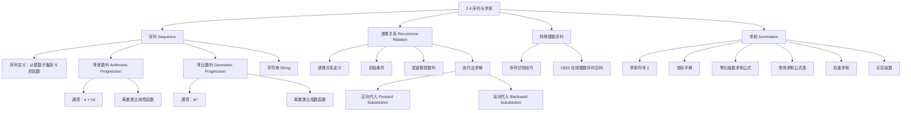

**相关笔记：** [[2.3 函数]] | [[2.5 基数]]

> [!abstract] 概览
> 本节系统介绍了==序列（sequence）==的基本概念、两类重要的特殊序列（==等差数列==与==等比数列==）、==递推关系（recurrence relation）==的定义与求解方法，以及==求和符号（summation notation）==的使用与常用求和公式。序列是离散数学中最基本的数据结构之一，在计数问题、算法分析和计算机科学中有着广泛的应用。
>
> - **序列**是从整数子集到集合 $S$ 的函数，用 $\{a_n\}$ 表示，$a_n$ 称为序列的项
> - **等差数列** $a, a+d, a+2d, \ldots$ 是线性函数的离散类比，**等比数列** $a, ar, ar^2, \ldots$ 是指数函数的离散类比
> - **递推关系**通过前项定义后项，配合初始条件可唯一确定一个序列；求解递推关系的基本方法是==迭代法（iteration）==
> - **斐波那契数列** $f_n = f_{n-1} + f_{n-2}$ 是最经典的递推定义序列，在自然界和计算机科学中广泛出现
> - **求和符号** $\sum_{j=m}^{n} a_j$ 表示从 $a_m$ 到 $a_n$ 的累加，支持线性性质和指标平移
> - 常用求和公式包括等比级数求和、前 $n$ 个正整数求和 $\frac{n(n+1)}{2}$、平方和 $\frac{n(n+1)(2n+1)}{6}$ 等

---

## 一、知识结构总览

---

## 二、核心思想

> [!tip] 核心思想
> 本节的核心思想是：序列是定义在整数集上的函数，是连接离散与连续的桥梁。递推关系通过"前项定义后项"的方式描述序列的生成规则，配合初始条件可唯一确定序列。迭代法是求解递推关系的基本方法——通过反复代入得到闭公式，但所得公式需用数学归纳法严格验证。求和符号 $\sum$ 是处理序列累加的标准工具，掌握常用求和公式和指标平移技巧对后续学习至关重要。

### 1. 序列的定义

> [!def] 序列（Sequence）
> >
> ==序列==是一个从整数集的某个子集（通常是 $\{0, 1, 2, \ldots\}$ 或 $\{1, 2, 3, \ldots\}$）到集合 $S$ 的==函数==。我们用 $a_n$ 表示整数 $n$ 的像，$a_n$ 称为序列的==项（term）==。
>
> - 用 $\{a_n\}$ 来描述整个序列（注意与集合符号冲突，需根据上下文区分）
> - 序列可以是==有限的==（finite）或==无限的==（infinite）

> [!example] 序列的例子
> >
> 序列 $\{a_n\}$，其中 $a_n = \frac{1}{n}$（$n \geq 1$），其各项为：
>
> $$a_1, a_2, a_3, a_4, \ldots = 1, \frac{1}{2}, \frac{1}{3}, \frac{1}{4}, \ldots$$

#### 1.1 等比数列（Geometric Progression）

> [!def] 等比数列
> >
> ==等比数列==（geometric progression）是形如
>
> $$a, ar, ar^2, \ldots, ar^n, \ldots$$
>
> 的序列，其中==首项== $a$ 和==公比== $r$ 都是实数。
>
> - 等比数列是指数函数 $f(x) = ar^x$ 的**离散类比**

> [!example] 等比数列的例子
> >
> | 序列 | 首项 $a$ | 公比 $r$ | 前几项 |
> |------|---------|---------|--------|
> | $b_n = (-1)^n$ | 1 | $-1$ | $1, -1, 1, -1, 1, \ldots$ |
> | $c_n = 2 \cdot 5^n$ | 2 | $5$ | $2, 10, 50, 250, 1250, \ldots$ |
> | $d_n = 6 \cdot (1/3)^n$ | 6 | $1/3$ | $6, 2, \frac{2}{3}, \frac{2}{9}, \frac{2}{27}, \ldots$ |

#### 1.2 等差数列（Arithmetic Progression）

> [!def] 等差数列
> >
> ==等差数列==（arithmetic progression）是形如
>
> $$a, a+d, a+2d, \ldots, a+nd, \ldots$$
>
> 的序列，其中==首项== $a$ 和==公差== $d$ 都是实数。
>
> - 等差数列是线性函数 $f(x) = dx + a$ 的**离散类比**

> [!example] 等差数列的例子
> >
> | 序列 | 首项 $a$ | 公差 $d$ | 前几项 |
> |------|---------|---------|--------|
> | $s_n = -1 + 4n$ | $-1$ | $4$ | $-1, 3, 7, 11, \ldots$ |
> | $t_n = 7 - 3n$ | $7$ | $-3$ | $7, 4, 1, -2, \ldots$ |

#### 1.3 字符串（String）

> [!def] 字符串
> >
> 形如 $a_1, a_2, \ldots, a_n$ 的有限序列也称为==字符串==（string），记为 $a_1 a_2 \ldots a_n$。
>
> - 字符串的==长度==是其中项的个数
> - ==空字符串==记为 $\lambda$，长度为零

### 2. 递推关系（Recurrence Relations）

> [!def] 递推关系
> >
> 序列 $\{a_n\}$ 的==递推关系==是一个方程，它将 $a_n$ 用前一项或多项来表示，即用 $a_0, a_1, \ldots, a_{n-1}$ 来表达 $a_n$（对所有 $n \geq n_0$ 的整数成立，$n_0$ 是非负整数）。
>
> - 满足递推关系的序列称为该递推关系的==解（solution）==

> [!def] 初始条件（Initial Conditions）
> >
> ==初始条件==指定了递推关系生效之前的那几项。递推关系与初始条件一起唯一确定一个序列（可用[[5.1 数学归纳法|数学归纳法]]证明）。

> [!example] 递推关系的计算
> >
> 设 $\{a_n\}$ 满足递推关系 $a_n = a_{n-1} + 3$（$n = 1, 2, 3, \ldots$），初始条件 $a_0 = 2$。
>
> **推导过程**：
> 1. $a_1 = a_0 + 3 = 2 + 3 = 5$
> 2. $a_2 = a_1 + 3 = 5 + 3 = 8$
> 3. $a_3 = a_2 + 3 = 8 + 3 = 11$

#### 2.1 斐波那契数列（Fibonacci Sequence）

> [!def] 斐波那契数列
> >
> ==斐波那契数列== $f_0, f_1, f_2, \ldots$ 由初始条件 $f_0 = 0, f_1 = 1$ 和递推关系
>
> $$f_n = f_{n-1} + f_{n-2} \quad (n = 2, 3, 4, \ldots)$$
>
> 定义。
>
> - 以意大利数学家 Fibonacci（12世纪）命名
> - 在自然界中广泛出现（向日葵种子排列、鹦鹉螺壳等）

> [!example] 斐波那契数列的计算
> >
> | $n$ | 0 | 1 | 2 | 3 | 4 | 5 | 6 |
> |-----|---|---|---|---|---|---|---|
> | $f_n$ | 0 | 1 | 1 | 2 | 3 | 5 | 8 |
>
> **推导过程**：
> 1. $f_2 = f_1 + f_0 = 1 + 0 = 1$
> 2. $f_3 = f_2 + f_1 = 1 + 1 = 2$
> 3. $f_4 = f_3 + f_2 = 2 + 1 = 3$
> 4. $f_5 = f_4 + f_3 = 3 + 2 = 5$
> 5. $f_6 = f_5 + f_4 = 5 + 3 = 8$

#### 2.2 用迭代法求解递推关系

> [!tip] 迭代法（Iteration）
> >
> ==迭代法==是求解递推关系的基本方法，通过反复应用递推关系来推导==闭公式（closed formula）==。
>
> - **正向代入（forward substitution）**：从初始条件出发，逐步向上推导到 $a_n$
> - **反向代入（backward substitution）**：从 $a_n$ 出发，逐步向下展开到初始条件

> [!example] 用迭代法求解 $a_n = a_{n-1} + 3$，$a_0 = 2$
> >
> **正向代入**：
> 1. $a_1 = 2 + 3$
> 2. $a_2 = (2 + 3) + 3 = 2 + 3 \cdot 2$
> 3. $a_3 = (2 + 2 \cdot 3) + 3 = 2 + 3 \cdot 3$
> 4. $\vdots$
> 5. $a_n = a_{n-1} + 3 = (2 + 3(n-2)) + 3 = 2 + 3(n-1)$
>
> **反向代入**：
> 1. $a_n = a_{n-1} + 3$
> 2. $= (a_{n-2} + 3) + 3 = a_{n-2} + 3 \cdot 2$
> 3. $= (a_{n-3} + 3) + 3 \cdot 2 = a_{n-3} + 3 \cdot 3$
> 4. $\vdots$
> 5. $= a_2 + 3(n-2) = (a_1 + 3) + 3(n-2) = 2 + 3(n-1)$
>
> 闭公式：$a_n = 2 + 3(n-1)$（这是一个等差数列）

> [!warning] 迭代法给出的是"猜想"
> 迭代法本质上是**猜想**一个公式，要严格证明其正确性，需要使用[[5.1 数学归纳法|数学归纳法]]。

> [!example] 复利问题——递推关系的实际应用
> >
> 某人存入 $10{,}000$ 美元，年利率 11%，按年复利计算。30 年后账户余额是多少？
>
> **建立递推关系**：设 $P_n$ 为 $n$ 年后的余额，则
>
> $$P_n = P_{n-1} + 0.11 P_{n-1} = 1.11 \cdot P_{n-1}$$
>
> 初始条件：$P_0 = 10{,}000$。
>
> **迭代求解**：
> 1. $P_1 = 1.11 \cdot P_0$
> 2. $P_2 = 1.11 \cdot P_1 = 1.11^2 \cdot P_0$
> 3. $P_3 = 1.11 \cdot P_2 = 1.11^3 \cdot P_0$
> 4. $\vdots$
> 5. $P_n = 1.11^n \cdot P_0 = 1.11^n \cdot 10{,}000$
>
> 代入 $n = 30$：$P_{30} = 1.11^{30} \cdot 10{,}000 = \$228{,}922.97$

### 3. 特殊整数序列的识别

> [!tip] 序列识别技巧
> >
> 给定序列的前几项，尝试识别其规律时，可以问以下问题：
>
> - 是否有相同值的连续出现（runs）？
> - 后项是否由前项加上某个量得到？
> - 后项是否由前项乘以某个量得到？
> - 后项是否由前几项组合得到？
> - 各项之间是否存在周期性（cycles）？

> [!example] 识别序列的规律
> >
> | 前几项 | 规律 | 通项公式 | 类型 |
> |--------|------|---------|------|
> | $1, \frac{1}{2}, \frac{1}{4}, \frac{1}{8}, \frac{1}{16}$ | 分母为 2 的幂 | $a_n = \frac{1}{2^n}$ | 等比数列 |
> | $1, 3, 5, 7, 9$ | 每项加 2 | $a_n = 2n + 1$ | 等差数列 |
> | $1, -1, 1, -1, 1$ | 正负交替 | $a_n = (-1)^n$ | 等比数列 |
> | $1, 3, 4, 7, 11, 18, 29, \ldots$ | 每项等于前两项之和 | Lucas 数列 | 递推关系 |

> [!info] OEIS——在线整数序列百科
> >
> 由 Neil Sloane 于 1964 年发起的 **OEIS**（On-Line Encyclopedia of Integer Sequences）是一个包含超过 250,000 个整数序列的数据库。输入序列的前几项即可搜索匹配的已知序列，获取其通项公式、递推关系和相关文献。网址：[https://oeis.org](https://oeis.org)

### 4. 求和（Summations）

> [!def] 求和符号
> >
> 用大写希腊字母 $\sum$ 表示求和：
>
> $$\sum_{j=m}^{n} a_j = a_m + a_{m+1} + \cdots + a_n$$
>
> - $j$ 称为==求和指标（index of summation）==，其选择是任意的：$\sum_{j=m}^{n} a_j = \sum_{i=m}^{n} a_i = \sum_{k=m}^{n} a_k$
> - $m$ 为==下限==，$n$ 为==上限==

> [!example] 求和的计算
> >
> $$\sum_{j=1}^{5} j^2 = 1^2 + 2^2 + 3^2 + 4^2 + 5^2 = 1 + 4 + 9 + 16 + 25 = 55$$
>
> $$\sum_{k=4}^{8} (-1)^k = (-1)^4 + (-1)^5 + (-1)^6 + (-1)^7 + (-1)^8 = 1 + (-1) + 1 + (-1) + 1 = 1$$

#### 4.1 求和的线性性质

> [!def] 求和的线性性质
> >
> 当 $a$ 和 $b$ 为实数时：
>
> $$\sum_{j=1}^{n} (a x_j + b y_j) = a \sum_{j=1}^{n} x_j + b \sum_{j=1}^{n} y_j$$
>
> 该性质可由加法的交换律、结合律以及乘法对加法的分配律推导（严格证明需用数学归纳法）。

#### 4.2 求和指标的平移

> [!example] 求和指标的平移
> >
> 将 $\sum_{j=1}^{5} j^2$ 的指标从 $j=1 \ldots 5$ 平移到 $k=0 \ldots 4$：
>
> 令 $k = j - 1$，则 $j = k + 1$，当 $j=1$ 时 $k=0$，当 $j=5$ 时 $k=4$：
>
> $$\sum_{j=1}^{5} j^2 = \sum_{k=0}^{4} (k+1)^2$$
>
> 验证：$1 + 4 + 9 + 16 + 25 = 55$，两种写法结果一致。

#### 4.3 等比级数求和公式

> [!thm] 等比级数求和公式（Theorem 1）
>
> 若 $a$ 和 $r$ 为实数且 $r \neq 0$，则
>
> $$\sum_{j=0}^{n} ar^j = \begin{cases} \dfrac{ar^{n+1} - a}{r - 1} & \text{若 } r \neq 1 \\ (n+1)a & \text{若 } r = 1 \end{cases}$$

> [!proof] 证明
>
> 令 $S_n = \sum_{j=0}^{n} ar^j$。
>
> **第一步**：两边同乘 $r$：
>
> $$r S_n = r \sum_{j=0}^{n} ar^j = \sum_{j=0}^{n} ar^{j+1}$$
>
> **第二步**：作指标平移，令 $k = j + 1$：
>
> $$r S_n = \sum_{k=1}^{n+1} ar^k$$
>
> **第三步**：将求和拆分为 $k=0$ 到 $n$ 的部分加上 $k=n+1$ 的项，减去 $k=0$ 的项：
>
> $$r S_n = \left(\sum_{k=0}^{n} ar^k\right) + ar^{n+1} - a = S_n + (ar^{n+1} - a)$$
>
> **第四步**：解方程 $r S_n = S_n + (ar^{n+1} - a)$，得：
>
> $$(r - 1) S_n = ar^{n+1} - a$$
>
> 当 $r \neq 1$ 时：
>
> $$S_n = \frac{ar^{n+1} - a}{r - 1}$$
>
> 当 $r = 1$ 时，$S_n = \sum_{j=0}^{n} a = (n+1)a$。$\blacksquare$

#### 4.4 常用求和公式表

> [!def] 常用求和公式
> >
> | 求和 | 闭公式 |
> |------|--------|
> | $\displaystyle\sum_{k=0}^{n} ar^k \quad (r \neq 0)$ | $\dfrac{ar^{n+1} - a}{r - 1}, \ r \neq 1$ |
> | $\displaystyle\sum_{k=1}^{n} k$ | $\dfrac{n(n+1)}{2}$ |
> | $\displaystyle\sum_{k=1}^{n} k^2$ | $\dfrac{n(n+1)(2n+1)}{6}$ |
> | $\displaystyle\sum_{k=1}^{n} k^3$ | $\dfrac{n^2(n+1)^2}{4}$ |
> | $\displaystyle\sum_{k=0}^{\infty} x^k \quad (|x| < 1)$ | $\dfrac{1}{1-x}$ |
> | $\displaystyle\sum_{k=1}^{\infty} kx^{k-1} \quad (|x| < 1)$ | $\dfrac{1}{(1-x)^2}$ |

> [!example] 利用公式计算求和
> >
> 求 $\sum_{k=50}^{100} k^2$。
>
> **推导过程**：
> 1. 将求和拆分：$\sum_{k=50}^{100} k^2 = \sum_{k=1}^{100} k^2 - \sum_{k=1}^{49} k^2$
> 2. 利用公式 $\sum_{k=1}^{n} k^2 = \frac{n(n+1)(2n+1)}{6}$：
> 3. $\sum_{k=1}^{100} k^2 = \frac{100 \cdot 101 \cdot 201}{6} = 338{,}350$
> 4. $\sum_{k=1}^{49} k^2 = \frac{49 \cdot 50 \cdot 99}{6} = 40{,}425$
> 5. 结果：$338{,}350 - 40{,}425 = 297{,}925$

#### 4.5 双重求和

> [!def] 双重求和
> >
> 双重求和先展开内层求和，再计算外层求和。
>
> $$\sum_{i=1}^{3} \sum_{j=1}^{4} ij = \sum_{i=1}^{4} (i + 2i + 3i) = \sum_{i=1}^{4} 6i = 6 + 12 + 18 + 24 = 60$$

#### 4.6 无穷级数

> [!def] 无穷级数
> >
> 当 $|x| < 1$ 时，$x^{n+1}$ 在 $n \to \infty$ 时趋于 0，因此：
>
> $$\sum_{n=0}^{\infty} x^n = \lim_{n \to \infty} \frac{x^{n+1} - 1}{x - 1} = \frac{0 - 1}{x - 1} = \frac{1}{1 - x}$$
>
> 对上式两边求导，可得：
>
> $$\sum_{k=1}^{\infty} kx^{k-1} = \frac{1}{(1-x)^2} \quad (|x| < 1)$$

---

## 三、补充理解与易混淆点

### 补充理解

### 1. 斐波那契数列与黄金比例

斐波那契数列不仅是一个数学上的递推定义序列，它与==黄金比例== $\varphi = \frac{1+\sqrt{5}}{2} \approx 1.618$ 有着深刻的联系。法国数学家 Binet 在 1843 年发现了斐波那契数列的显式公式（Binet 公式）：$f_n = \frac{\varphi^n - \psi^n}{\sqrt{5}}$，其中 $\psi = \frac{1-\sqrt{5}}{2}$。这意味着即使递推关系只涉及简单的加法，其闭公式却包含了无理数。更值得注意的是，相邻斐波那契数之比 $\frac{f_{n+1}}{f_n}$ 在 $n \to \infty$ 时收敛到 $\varphi$。这一性质在算法分析（如 AVL 树的分析）和计算机图形学中都有应用。

- **来源**: Binet, J. P. M. (1843). "Memoire sur l'integration des equations lineaires aux differences finies d'un ordre quelconque, a coefficients variables." *Comptes Rendus de l'Academie des Sciences*, 17, 559-567.
- **参考**: Knuth, D. E. (1997). *The Art of Computer Programming, Volume 1: Fundamental Algorithms* (3rd ed.). Addison-Wesley. [https://www-cs-faculty.stanford.edu/~knuth/taocp.html](https://www-cs-faculty.stanford.edu/~knuth/taocp.html)
>
> **网络资源：**
> - [IntersectMe](https://intersectme.leibniz-fli.de/) -- 集合运算可视化（辅助理解序列的集合表示）

### 2. OEIS 与整数序列的现代研究

由 Bell Labs 研究员 Neil Sloane 于 1964 年发起的 OEIS（On-Line Encyclopedia of Integer Sequences）是数学和计算机科学领域最重要的在线资源之一。截至 2017 年，OEIS 已收录超过 250,000 个整数序列，每年新增超过 10,000 个条目。OEIS 的重要性在于：许多看似不相关的数学问题最终会归结为同一个整数序列。例如，斐波那契数列不仅出现在兔子繁殖问题中，还出现在股票价格的斐波那契回撤分析、数据结构的 AVL 树节点计数、以及密码学的伪随机数生成中。OEIS 使得研究者能够快速发现这种跨领域的联系。

- **来源**: Sloane, N. J. A. and Plouffe, S. (1995). *The Encyclopedia of Integer Sequences*. Academic Press.
- **参考**: OEIS Foundation. (2023). *The On-Line Encyclopedia of Integer Sequences*. [https://oeis.org](https://oeis.org)
>
> **网络资源：**
> - [OEIS - On-Line Encyclopedia of Integer Sequences](https://oeis.org/) -- 整数序列在线百科全书，可查询任意序列的已知性质

### 易混淆点

### 1. 序列符号 $\{a_n\}$ 与集合符号 $\{a_n\}$ 的歧义

- ❌ 认为 $\{a_n\}$ 只能表示集合，因此序列中的元素没有顺序且不能重复
- ✅ 在离散数学中，$\{a_n\}$ **既可表示集合也可表示序列**，需要根据上下文区分。作为序列时，元素**有顺序**且**可以重复**（如 $1, 1, 2, 3, 5$ 是合法的序列）。教材中通过上下文说明来消除歧义

### 2. 递推关系的解不唯一

- ❌ 认为给定递推关系就能唯一确定一个序列
- ✅ 递推关系**必须配合初始条件**才能唯一确定序列。不同的初始条件会产生不同的解。例如，$a_n = a_{n-1} + a_{n-2}$ 配合 $f_0=0, f_1=1$ 产生斐波那契数列，但配合 $L_1=1, L_2=3$ 则产生 Lucas 数列。此外，有限个初始项不能唯一确定无限序列——存在无穷多个序列以任意给定的有限项开头

---

## 四、习题精选

> [!todo] 习题概览
> >
> | 题号范围 | 核心考点 | 难度 |
> |---------|---------|------|
> | 1-4 | 根据通项公式求序列的指定项 | ⭐ |
> | 5-6 | 列出序列的前 10 项（递推/通项/描述） | ⭐⭐ |
> | 7-8 | 给定前几项，构造不同的序列 | ⭐⭐ |
> | 9-10 | 根据递推关系和初始条件求前几项 | ⭐⭐ |
> | 11-15 | 验证给定通项是否为递推关系的解 | ⭐⭐⭐ |
> | 16-17 | 用迭代法求解递推关系 | ⭐⭐⭐ |
> | 18-24 | 递推关系的实际应用（复利、人口增长、贷款） | ⭐⭐⭐ |
> | 25-26 | 识别序列规律并预测后续项 | ⭐⭐ |
> | 27 | 非完全平方数的序列公式（进阶） | ⭐⭐⭐⭐ |

### 题1：用迭代法求解递推关系

> [!problem] 题目
> 用迭代法求解递推关系 $a_n = 2a_{n-1} + 1$（$n \geq 1$），初始条件 $a_0 = 0$，并给出闭公式。

> [!faq]- 解答
> **正向代入**：
> 1. $a_1 = 2 \cdot 0 + 1 = 1$
> 2. $a_2 = 2 \cdot 1 + 1 = 3$
> 3. $a_3 = 2 \cdot 3 + 1 = 7$
> 4. $a_4 = 2 \cdot 7 + 1 = 15$
>
> 观察规律：$a_0 = 0 = 2^0 - 1$，$a_1 = 1 = 2^1 - 1$，$a_2 = 3 = 2^2 - 1$，$a_3 = 7 = 2^3 - 1$，$a_4 = 15 = 2^4 - 1$。
>
> **猜想**：$a_n = 2^n - 1$。
>
> **反向代入验证**：$a_n = 2a_{n-1} + 1 = 2(2^{n-1} - 1) + 1 = 2^n - 2 + 1 = 2^n - 1$。$\blacksquare$

### 题2：等差数列的求和

> [!problem] 题目
> 求等差数列 $a_n = 3n + 1$ 的前 10 项和。

> [!faq]- 解答
> **方法一**：直接展开求和。
>
> 前 10 项为：$a_1 = 4, a_2 = 7, a_3 = 10, a_4 = 13, a_5 = 16, a_6 = 19, a_7 = 22, a_8 = 25, a_9 = 28, a_{10} = 31$。
>
> $$S_{10} = \sum_{k=1}^{10} (3k + 1) = 3\sum_{k=1}^{10} k + \sum_{k=1}^{10} 1 = 3 \cdot \frac{10 \cdot 11}{2} + 10 = 3 \cdot 55 + 10 = 165 + 10 = 175$$
>
> **方法二**：利用等差数列求和公式 $S_n = \frac{n(a_1 + a_n)}{2}$。
>
> $$S_{10} = \frac{10 \cdot (4 + 31)}{2} = \frac{10 \cdot 35}{2} = 175$$
>
> 两种方法结果一致。$\blacksquare$

### 题3：平方和的计算

> [!problem] 题目
> 用求和公式计算 $\sum_{k=1}^{100} k^2$。

> [!faq]- 解答
> 利用平方和公式 $\sum_{k=1}^{n} k^2 = \frac{n(n+1)(2n+1)}{6}$，代入 $n = 100$：
>
> $$\sum_{k=1}^{100} k^2 = \frac{100 \times 101 \times 201}{6}$$
>
> 计算过程：
>
> - $100 \times 101 = 10100$
> - $10100 \times 201 = 10100 \times 200 + 10100 \times 1 = 2020000 + 10100 = 2030100$
> - $2030100 \div 6 = 338350$
>
> $$\sum_{k=1}^{100} k^2 = 338350$$ $\blacksquare$

### 题4：用迭代法求解递推关系

> [!problem] 题目
> 用迭代法求解递推关系 $a_n = 3a_{n-1} + 2$，$a_0 = 1$，求 $a_n$ 的通项公式。

> [!faq]- 解答
> **正向代入**，计算前几项观察规律：
>
> - $a_0 = 1$
> - $a_1 = 3 \cdot 1 + 2 = 5$
> - $a_2 = 3 \cdot 5 + 2 = 17$
> - $a_3 = 3 \cdot 17 + 2 = 53$
>
> 观察到 $a_0 = 1 = 3^0 \cdot 2 - 1$？不对。重新分析：
>
> $a_0 = 1$，$a_1 = 5$，$a_2 = 17$，$a_3 = 53$。
>
> 注意到 $a_1 + 1 = 6 = 2 \cdot 3$，$a_2 + 1 = 18 = 2 \cdot 9$，$a_3 + 1 = 54 = 2 \cdot 27$。
>
> **猜想**：$a_n + 1 = 2 \cdot 3^n$，即 $a_n = 2 \cdot 3^n - 1$。
>
> **反向代入验证**：
>
> $$a_n = 3a_{n-1} + 2 = 3(2 \cdot 3^{n-1} - 1) + 2 = 2 \cdot 3^n - 3 + 2 = 2 \cdot 3^n - 1$$
>
> 验证基础步：$a_0 = 2 \cdot 3^0 - 1 = 2 - 1 = 1$。$\checkmark$
>
> 因此通项公式为 $a_n = 2 \cdot 3^n - 1$。$\blacksquare$

### 题5：斐波那契数列 Binet 公式的证明

> [!problem] 题目
> 用数学归纳法证明斐波那契数列的 Binet 公式：$F_n = \frac{\phi^n - \psi^n}{\sqrt{5}}$，其中 $\phi = \frac{1+\sqrt{5}}{2}$，$\psi = \frac{1-\sqrt{5}}{2}$。

> [!faq]- 解答
> **预备知识**：$\phi$ 和 $\psi$ 是方程 $x^2 = x + 1$ 的两个根，即 $\phi^2 = \phi + 1$，$\psi^2 = \psi + 1$。且 $\phi + \psi = 1$，$\phi \psi = -1$。
>
> **证明**（强数学归纳法）：
>
> **基础步**：
>
> $n = 0$：$F_0 = 0$，$\frac{\phi^0 - \psi^0}{\sqrt{5}} = \frac{1 - 1}{\sqrt{5}} = 0$。$\checkmark$
>
> $n = 1$：$F_1 = 1$，$\frac{\phi - \psi}{\sqrt{5}} = \frac{\frac{1+\sqrt{5}}{2} - \frac{1-\sqrt{5}}{2}}{\sqrt{5}} = \frac{\sqrt{5}}{\sqrt{5}} = 1$。$\checkmark$
>
> **归纳步**：假设公式对 $n = k$ 和 $n = k - 1$ 都成立（$k \geq 1$），即
>
> $$F_k = \frac{\phi^k - \psi^k}{\sqrt{5}}, \quad F_{k-1} = \frac{\phi^{k-1} - \psi^{k-1}}{\sqrt{5}}$$
>
> 证明 $n = k + 1$ 时公式成立：
>
> $$F_{k+1} = F_k + F_{k-1} = \frac{\phi^k - \psi^k}{\sqrt{5}} + \frac{\phi^{k-1} - \psi^{k-1}}{\sqrt{5}}$$
>
> $= \frac{\phi^{k-1}(\phi + 1) - \psi^{k-1}(\psi + 1)}{\sqrt{5}}$
>
> 利用 $\phi + 1 = \phi^2$ 和 $\psi + 1 = \psi^2$：
>
> $= \frac{\phi^{k-1} \cdot \phi^2 - \psi^{k-1} \cdot \psi^2}{\sqrt{5}} = \frac{\phi^{k+1} - \psi^{k+1}}{\sqrt{5}}$
>
> 因此公式对 $n = k + 1$ 也成立。由强数学归纳法，Binet 公式对所有非负整数 $n$ 成立。$\blacksquare$

> [!tip] 解题思路提示
> 迭代法求解递推关系的步骤：先用正向代入计算前几项，观察规律猜想闭公式，再用反向代入验证。对于 $a_n = ca_{n-1} + d$ 型递推关系，闭公式通常涉及 $c^n$ 和常数项的组合。

---

## 五、视频学习指南

> [!info] 视频资源
> | 资源 | 链接 | 对应内容 | 备注 |
> |:-----|:-----|:---------|:-----|
> | Rosen 8e Section 2.4 | [教材原文](https://www.mheducation.com/highered/product/discrete-mathematics-applications-rosen/M9781259676512.html) | 序列、递推关系与求和 | 英文教材 |
> | MIT 6.042J Lecture 5 | [链接](https://www.youtube.com/watch?v=kEJQlA-1udE) | 递推关系与求和 | 英文，MIT开放课程 |
> | Numberphile - Fibonacci | [链接](https://www.youtube.com/watch?v=wTlw5fJqjhc) | 斐波那契数列的奇妙性质 | 英文，科普向 |

---

## 六、教材原文

> [!quote] 教材原文
> "A sequence is a function from a subset of the set of integers (usually either the set {0, 1, 2, ...} or the set {1, 2, 3, ...}) to a set S. We use the notation a_n to denote the image of the integer n. We call a_n a term of the sequence."
>
> "A recurrence relation for the sequence {a_n} is an equation that relates a_n to certain of its predecessors a_0, a_1, ..., a_{n-1}. Initial conditions for the sequence are specified values for a finite number of terms of the sequence."

---

## 参见 Wiki

- [[离散数学/concepts/序列与求和]] -- 序列与求和的基本概念
- [[离散数学/concepts/序列与求和|序列]] -- 序列的基本概念与分类
- [[离散数学/concepts/序列与求和|递推关系]] -- 递推关系的深入讨论与求解方法
- [[离散数学/concepts/序列与求和|斐波那契数列]] -- 斐波那契数列的性质与应用
- [[离散数学/concepts/序列与求和|求和]] -- 求和符号与常用求和公式
- [[离散数学/concepts/序列与求和|等差数列]] -- 线性递增的离散序列
- [[离散数学/concepts/序列与求和|等比数列]] -- 指数增长的离散序列
- [[离散数学/concepts/序列与求和|数学归纳法]] -- 证明递推关系解的正确性
- [[离散数学/concepts/序列与求和|无穷级数]] -- 无限求和与收敛性
#学习/离散数学/基本结构
