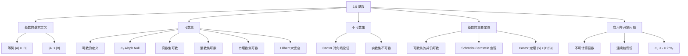

**相关笔记：** [[2.4 序列与求和]] | [[2.6 矩阵]]

> [!abstract] 概览
> 本节将集合大小的概念从有限集推广到无限集，引入了==基数（cardinality）==的概念来比较无限集的"大小"。核心内容包括==可数集（countable set）==与==不可数集（uncountable set）==的分类、Cantor 的==对角线论证法（diagonalization argument）==、==Schröder-Bernstein 定理==，以及==连续统假设（continuum hypothesis）==这一著名的数学开放问题。
>
> - 两个集合==基数相等==当且仅当存在它们之间的双射，这一标准同时适用于有限集和无限集
> - ==可数集==包括所有有限集以及与正整数集 $\mathbb{Z}^+$ 等势的无限集，其基数记为 $\aleph_0$（aleph null）
> - 有理数集 $\mathbb{Q}$ 是可数的，但实数集 $\mathbb{R}$ 是==不可数==的——这是 Cantor 对角线论证法的经典结论
> - ==Schröder-Bernstein 定理==提供了一种不直接构造双射就能证明两个集合等势的强大工具
> - 计算机程序集合是可数的，但函数集合是不可数的，由此可推出==不可计算函数==的存在
> - ==连续统假设==（$\aleph_0$ 与 $\mathfrak{c}$ 之间不存在其他基数）在标准集合论公理下既不能被证明也不能被证伪

---

## 一、知识结构总览

---

## 二、核心思想

> [!tip] 核心思想
> 本节的核心思想是：利用双射作为比较集合"大小"的通用标准，将有限集的元素计数推广到无限集的基数比较。Cantor 的对角线论证法证明了实数集不可数，揭示了"无限"也有不同层次。Schröder-Bernstein 定理将等势证明简化为分别构造两个单射。连续统假设的不可判定性则展示了数学公理体系的内在局限。

### 1. 基数的定义

> [!def] 等势（Same Cardinality）
> >
> 集合 $A$ 和 $B$ ==基数相等==（have the same cardinality）当且仅当存在从 $A$ 到 $B$ 的双射。此时记 $|A| = |B|$。
>
> - 对有限集，$|A| = |B|$ 就是两个集合元素个数相同
> - 对无限集，$|A| = |B|$ 提供了一种比较相对大小的标准

> [!def] 基数的大小比较
> >
> - 若存在从 $A$ 到 $B$ 的单射，则 $|A| \leq |B|$
> - 若 $|A| \leq |B|$ 且 $|A| \neq |B|$，则 $|A| < |B|$
>
> 注意：对任意无限集 $A$，记号 $|A|$ 本身没有独立的含义——只有 $|A| = |B|$、$|A| \leq |B|$、$|A| < |B|$ 这些关系式才有定义。

### 2. 可数集

> [!def] 可数集（Countable Set）
> >
> - ==可数集==是有限集或与正整数集 $\mathbb{Z}^+$ 等势的集合
> - ==不可数集==（uncountable set）是非可数的集合
> - 当无限集 $S$ 可数时，记 $|S| = \aleph_0$（读作"aleph null"），其中 $\aleph$ 是希伯来字母表的第一个字母

> [!important] 可数集的等价刻画
>
> 一个无限集是可数的，当且仅当它的元素可以排成一个序列 $a_1, a_2, a_3, \ldots$（以正整数为索引）。
>
> 这是因为双射 $f : \mathbb{Z}^+ \to S$ 可以表示为序列 $a_n = f(n)$。

#### 2.1 奇数集是可数的

> [!example] 奇正整数集是可数的
> >
> 构造双射 $f : \mathbb{Z}^+ \to \{1, 3, 5, 7, \ldots\}$，$f(n) = 2n - 1$。
>
> **证明 $f$ 是双射**：
>
> **单射**：设 $f(n) = f(m)$，则 $2n - 1 = 2m - 1$，故 $n = m$。
>
> **满射**：设 $t$ 为任意奇正整数，则 $t = 2k - 1$（$k$ 为正整数），故 $t = f(k)$。

| $n$ | 1 | 2 | 3 | 4 | 5 | 6 | ... |
|-----|---|---|---|---|---|---|-----|
| $f(n)$ | 1 | 3 | 5 | 7 | 9 | 11 | ... |

#### 2.2 整数集是可数的

> [!example] 整数集 $\mathbb{Z}$ 是可数的
> >
> 可以将所有整数排列为序列：$0, 1, -1, 2, -2, 3, -3, \ldots$
>
> 对应的双射 $f : \mathbb{Z}^+ \to \mathbb{Z}$：
> $$f(n) = \begin{cases} n/2 & \text{若 } n \text{ 为偶数} \\ -(n-1)/2 & \text{若 } n \text{ 为奇数} \end{cases}$$

#### 2.3 有理数集是可数的

> [!example] 正有理数集 $\mathbb{Q}^+$ 是可数的
> >
> 将正有理数按分子分母之和 $p + q$ 分组排列，沿对角线遍历，跳过已经出现过的数（如 $2/2 = 1$ 已作为 $1/1$ 出现）：
>
> $$
> \begin{array}{cccccc}
> 1/1 & 1/2 & 1/3 & 1/4 & 1/5 & \cdots \\
> 2/1 & 2/2 & 2/3 & 2/4 & 2/5 & \cdots \\
> 3/1 & 3/2 & 3/3 & 3/4 & 3/5 & \cdots \\
> 4/1 & 4/2 & 4/3 & 4/4 & 4/5 & \cdots \\
> \vdots & \vdots & \vdots & \vdots & \vdots & \ddots
> \end{array}
> $$
>
> 按对角线顺序列出：$1, 1/2, 2, 3, 1/3, 1/4, 2/3, 3/2, 4, 5, \ldots$
>
> 每个正有理数恰好出现一次，因此 $\mathbb{Q}^+$ 是可数的。

> [!tip] 直觉突破
> >
> 有理数集可数这一结论常常令人惊讶——有理数在数轴上是"稠密"的（任意两个有理数之间都有无穷多个有理数），但它的"大小"竟然和稀疏分布的正整数一样。这说明直觉在无限集的"大小"判断上并不可靠。

#### 2.4 Hilbert 大饭店

> [!info] Hilbert 大饭店悖论
> >
> David Hilbert 提出的著名思想实验：一家有可数无穷多个房间的大饭店，每个房间都住满了客人。当一位新客人到来时：
>
> 1. 将房间 1 的客人移到房间 2
> 2. 将房间 2 的客人移到房间 3
> 3. 一般地，将房间 $n$ 的客人移到房间 $n+1$
> 4. 房间 1 空出，分配给新客人
>
> 所有人都有房间！这在有限集上是不可能的（满 = 无法再容纳），但在无限集上却可以实现。这揭示了"满射"在有限集和无限集上的本质区别。

### 3. 不可数集——Cantor 对角线论证法

> [!def] Cantor 对角线论证法（Cantor Diagonalization Argument）
> >
> 1879 年由 **Georg Cantor** 引入的一种证明方法，用于证明实数集是不可数的。

> [!example] 实数集是不可数的
> >
> **证明**（反证法）：
>
> 假设 $(0, 1)$ 中的实数是可数的，则可以列出：$r_1, r_2, r_3, \ldots$
>
> 设它们的小数展开为：
> $$
> \begin{aligned}
> r_1 &= 0.d_{11}d_{12}d_{13}d_{14}\ldots \\
> r_2 &= 0.d_{21}d_{22}d_{23}d_{24}\ldots \\
> r_3 &= 0.d_{31}d_{32}d_{33}d_{34}\ldots \\
> r_4 &= 0.d_{41}d_{42}d_{43}d_{44}\ldots \\
> &\;\;\vdots
> \end{aligned}
> $$
>
> 构造新实数 $r = 0.d_1 d_2 d_3 d_4 \ldots$，其中：
> $$d_i = \begin{cases} 4 & \text{若 } d_{ii} \neq 4 \\ 5 & \text{若 } d_{ii} = 4 \end{cases}$$
>
> **关键推理**：
> 1. $r$ 与 $r_1$ 在第 1 位小数不同（$d_1 \neq d_{11}$），故 $r \neq r_1$
> 2. $r$ 与 $r_2$ 在第 2 位小数不同（$d_2 \neq d_{22}$），故 $r \neq r_2$
> 3. 一般地，$r$ 与 $r_i$ 在第 $i$ 位小数不同，故 $r \neq r_i$
> 4. 因此 $r$ 不在列表中
>
> 但 $r$ 显然是 $(0, 1)$ 中的一个实数，矛盾！
>
> 因此 $(0, 1)$ 中的实数不可数，从而 $\mathbb{R}$ 也不可数。$\blacksquare$

> [!tip] 对角线论证法的要点
> >
> - 选择数字 4 和 5 是为了避免 $0.4999\ldots = 0.5000\ldots$ 这类双重表示问题
> - 核心思想：无论怎样列举，总可以通过"修改对角线上的数字"来构造一个不在列表中的数
> - 这一方法在可计算性理论（如停机问题的证明）中有广泛应用

### 4. 关于基数的重要定理

#### 4.1 可数集的并仍可数

> [!thm] 可数集的并
>
> 若 $A$ 和 $B$ 是可数集，则 $A \cup B$ 也是可数集。

> [!example] 定理的证明
> >
> **证明**：不失一般性，假设 $A$ 和 $B$ 不相交（否则用 $B - A$ 替代 $B$）。
>
> 分三种情况：
>
> **情况 (i)**：$A$ 和 $B$ 均有限。
> 则 $A \cup B$ 也有限，故可数。
>
> **情况 (ii)**：$A$ 可数无穷，$B$ 有限。
> $A$ 的元素列为 $a_1, a_2, \ldots$，$B$ 的元素列为 $b_1, b_2, \ldots, b_m$。
> $A \cup B$ 可列为 $b_1, b_2, \ldots, b_m, a_1, a_2, \ldots$，故可数无穷。
>
> **情况 (iii)**：$A$ 和 $B$ 均可数无穷。
> $A$ 的元素列为 $a_1, a_2, \ldots$，$B$ 的元素列为 $b_1, b_2, \ldots$。
> 交替排列：$a_1, b_1, a_2, b_2, a_3, b_3, \ldots$，故 $A \cup B$ 可数无穷。$\blacksquare$

#### 4.2 Schröder-Bernstein 定理

> [!thm] Schröder-Bernstein 定理
>
> 若 $|A| \leq |B|$ 且 $|B| \leq |A|$，则 $|A| = |B|$。
>
> 换言之，若存在从 $A$ 到 $B$ 的单射 $f$ 和从 $B$ 到 $A$ 的单射 $g$，则存在从 $A$ 到 $B$ 的双射。

> [!example] Schröder-Bernstein 定理的应用
> >
> 证明 $|(0, 1)| = |(0, 1]|$。
>
> **推导过程**：
> 1. 构造单射 $f : (0, 1) \to (0, 1]$：取 $f(x) = x$（因为 $(0, 1) \subset (0, 1]$）
> 2. 构造单射 $g : (0, 1] \to (0, 1)$：取 $g(x) = x/2$（映射到 $(0, 1/2] \subset (0, 1)$）
> 3. 由 Schröder-Bernstein 定理，$|(0, 1)| = |(0, 1]|$
>
> 注意：直接构造双射并不容易，但 Schröder-Bernstein 定理让我们只需分别构造两个单射即可。

> [!tip] Schröder-Bernstein 定理的意义
> >
> 直接构造双射有时非常困难。该定理将问题分解为两个更简单的子问题（各构造一个单射），大大简化了等势证明。该定理由 Ernst Schröder（1898，证明有误）和 Felix Bernstein（1897）独立提出，但 Richard Dedekind 在 1887 年的笔记中已有证明。

#### 4.3 Cantor 定理

> [!thm] Cantor 定理
>
> 对任意集合 $S$，$|S| < |\mathcal{P}(S)|$，即集合的基数严格小于其幂集的基数。

> [!example] Cantor 定理的证明思路
> >
> **证明**：假设存在到上的函数 $f : S \to \mathcal{P}(S)$。
> 令 $T = \{s \in S \mid s \notin f(s)\}$。
>
> 若存在 $s_0$ 使得 $f(s_0) = T$：
> - 若 $s_0 \in T$，则由 $T$ 的定义，$s_0 \notin f(s_0) = T$，矛盾
> - 若 $s_0 \notin T$，则由 $T$ 的定义，$s_0 \in f(s_0) = T$，矛盾
>
> 因此不存在 $s_0$ 使得 $f(s_0) = T$，$f$ 不是到上的。$\blacksquare$
>
> 推论：$\aleph_0 = |\mathbb{Z}^+| < |\mathcal{P}(\mathbb{Z}^+)| = |\mathbb{R}| = \mathfrak{c}$

### 5. 不可计算函数

> [!def] 可计算函数与不可计算函数
> >
> - ==可计算函数==（computable function）：存在某种编程语言的计算机程序可以求出其所有值的函数
> - ==不可计算函数==（uncomputable function）：不存在任何计算机程序能求出其所有值的函数

> [!example] 不可计算函数的存在性证明
> >
> **推导过程**（三步论证）：
>
> **第一步**：任何特定编程语言的程序集合是可数的。
> 原因：程序可以看作有限字母表上的字符串，而有限字母表上所有字符串的集合是可数的。
>
> **第二步**：从 $\mathbb{Z}^+$ 到 $\{0, 1, \ldots, 9\}$ 的所有函数的集合是不可数的。
> 原因：可以建立从 $(0, 1)$ 中的实数到这些函数的子集的双射（将 $0.d_1 d_2 \ldots$ 对应到 $f(n) = d_n$），而 $(0, 1)$ 不可数。
>
> **第三步**：由于可计算函数对应于程序（可数），但所有函数（不可数）远多于程序，因此存在不可计算函数。$\blacksquare$

### 6. 连续统假设

> [!info] 连续统假设（Continuum Hypothesis）
> >
> ==连续统假设==断言：不存在基数 $X$ 使得 $\aleph_0 < X < \mathfrak{c}$。
>
> 已知结果：
> - $|\mathcal{P}(\mathbb{Z}^+)| = |\mathbb{R}| = \mathfrak{c}$
> - $|\mathbb{Z}^+| < |\mathcal{P}(\mathbb{Z}^+)|$，即 $\aleph_0 < 2^{\aleph_0}$
> - $2^{\aleph_0} = \mathfrak{c}$
>
> 若连续统假设成立，则 $\mathfrak{c} = \aleph_1$，即 $2^{\aleph_0} = \aleph_1$。
>
> **历史**：Cantor 于 1877 年提出，1900 年被 Hilbert 列为 23 个开放问题中的第一题。
>
> **现状**：Gödel（1940）证明了连续统假设与 ZF 集合论公理不矛盾（不能被证伪）；Cohen（1963）证明了连续统假设的否定也与 ZF 公理不矛盾（不能被证明）。因此，在标准 Zermelo-Fraenkel 集合论公理下，连续统假设是**不可判定**的。

---

## 三、补充理解与易混淆点

### 补充理解

### 1. Cantor 对角线论证法的历史意义与深远影响

Georg Cantor（1845-1918）在 1874-1891 年间建立的超限数理论（transfinite number theory）是数学史上最具革命性的成就之一。对角线论证法最初发表于 1891 年的论文 "Ueber eine elementare Frage der Mannigfaltigkeitslehre" 中，比他在 1874 年用区间套方法证明实数不可数的原始证明更加简洁和有力。对角线论证法的核心思想——通过自指（self-reference）构造矛盾——后来成为数理逻辑和计算理论中的基本工具。最著名的应用是 **Alan Turing** 在 1936 年对停机问题（Halting Problem）不可判定性的证明，以及 **Kurt Gödel** 在 1931 年的不完备性定理（First Incompleteness Theorem）。这些结果共同构成了理论计算机科学和数学基础的理论支柱。

- **来源**: Cantor, G. (1891). "Ueber eine elementare Frage der Mannigfaltigkeitslehre." *Jahresbericht der Deutschen Mathematiker-Vereinigung*, 1, 75-78.
- **参考**: Turing, A. M. (1936). "On Computable Numbers, with an Application to the Entscheidungsproblem." *Proceedings of the London Mathematical Society*, 2(42), 230-265. [https://doi.org/10.1112/plms/s2-42.1.230](https://doi.org/10.1112/plms/s2-42.1.230)
>
> **网络资源：**
> - [Brilliant - Bijection, Injection, Surjection](https://brilliant.org/wiki/bijection-injection-and-surjection/) -- 双射与基数比较的交互式教程

### 2. Schröder-Bernstein 定理的证明难度与链构造技巧

Schröder-Bernstein 定理的陈述看似简单——"若 $A$ 可嵌入 $B$ 且 $B$ 可嵌入 $A$，则 $A$ 与 $B$ 等势"——但其证明却出人意料地精巧。直觉上，人们可能认为只需将两个单射"拼接"就能得到双射，但当两个单射都不是满射时，拼接并不直接可行。标准的证明方法（由 Julius König 等人发展）使用"链分解"技巧：对 $A$ 中每个元素 $a$，构造交替链 $a \to f(a) \to g(f(a)) \to f(g(f(a))) \to \cdots$，并根据链的类型（环形链、无限向后延伸链、在 $A$ 终止的链、在 $B$ 终止的链）来决定使用 $f$ 还是 $g^{-1}$ 来构造双射。这一技巧在集合论、测度论和泛函分析中都有广泛应用，是理解等价关系和分类定理的重要工具。

- **来源**: Hallett, M. (1984). *Cantorian Set Theory and Limitation of Size*. Oxford University Press. Chapter 7.
- **参考**: Hrbacek, K., & Jech, T. (1999). *Introduction to Set Theory* (3rd ed.). Marcel Dekker. Chapter 3.
>
> **网络资源：**
> - [UCL - Function Properties](https://www.ucl.ac.uk/~ucahmto/0005_2021/Ch2.S8.html) -- 函数性质与双射的系统讲解

### 易混淆点

### 1. "可数"的含义——有限集也算可数

- ❌ 认为"可数"仅指"可以一个一个数出来的无限集"，而将有限集排除在外
- ✅ 在数学定义中，==可数集==包括**所有有限集**以及与正整数集等势的无限集。因此 $\{1, 2, 3\}$ 是可数的，空集 $\emptyset$ 也是可数的。如果只想指"与 $\mathbb{Z}^+$ 等势的无限集"，应使用"可数无穷"（countably infinite）这一术语。可数集的正式定义是：有限或可数无穷

### 2. 基数不等式 $|A| \leq |B|$ 不要求 $A \subseteq B$

- ❌ 认为 $|A| \leq |B|$ 意味着 $A$ 是 $B$ 的子集
- ✅ $|A| \leq |B|$ 仅要求存在从 $A$ 到 $B$ 的单射，而**不要求** $A \subseteq B$。例如，$\{a, b\}$ 和 $\{1, 2, 3\}$ 满足 $|\{a, b\}| \leq |\{1, 2, 3\}|$（因为存在单射 $a \mapsto 1, b \mapsto 2$），但 $\{a, b\}$ 不是 $\{1, 2, 3\}$ 的子集。类似地，$|\mathbb{Z}^+| \leq |\mathbb{Z}|$（存在单射 $n \mapsto n$），但 $\mathbb{Z}^+ \subset \mathbb{Z}$ 的关系与基数比较是两个不同的概念

---

## 四、习题精选

> [!todo] 习题概览
> >
> | 题号范围 | 核心考点 | 难度 |
> |---------|---------|------|
> | 1-4 | 判断集合是有限/可数无穷/不可数 | ⭐⭐ |
> | 5-9 | Hilbert 大饭店的各种变体 | ⭐⭐⭐ |
> | 10-11 | 不可数集的差集与交集 | ⭐⭐ |
> | 12-21 | 基数不等式的传递性与等势证明 | ⭐⭐⭐ |
> | 22-24 | 满射/单射与可数性的关系 | ⭐⭐⭐ |
> | 25-32 | 可数性的各种证明技巧 | ⭐⭐⭐ |
> | 33-34 | Schröder-Bernstein 定理的应用 | ⭐⭐⭐ |
> | 35-36 | Cantor 定理与 $\mathcal{P}(\mathbb{Z}^+)$ 的不可数性 | ⭐⭐⭐⭐ |
> | 37-39 | 不可计算函数的存在性证明 | ⭐⭐⭐⭐ |
> | 40 | Cantor 定理的证明 | ⭐⭐⭐⭐ |
> | 41 | Schröder-Bernstein 定理的完整证明（链分解） | ⭐⭐⭐⭐⭐ |

### 题1：用对角线论证法证明不可数性

> [!problem] 题目
> 用 Cantor 对角线论证法证明：所有从 $\mathbb{Z}^+$ 到 $\{0, 1\}$ 的函数的集合是不可数的。

> [!faq]- 解答
> **证明**（反证法）：
>
> 假设所有从 $\mathbb{Z}^+$ 到 $\{0, 1\}$ 的函数可以列为 $f_1, f_2, f_3, \ldots$。
>
> 构造新函数 $g : \mathbb{Z}^+ \to \{0, 1\}$，令 $g(n) = 1 - f_n(n)$（即对角线取反）。
>
> 对任意 $n$，$g(n) = 1 - f_n(n) \neq f_n(n)$，故 $g \neq f_n$。
>
> 因此 $g$ 不在列表中，矛盾。故该函数集合不可数。$\blacksquare$

### 题2：证明整数集是可数集

> [!problem] 题目
> 证明 $\mathbb{Z}$（整数集）是可数集。

> [!faq]- 解答
> **证明**：构造双射 $f: \mathbb{Z}^+ \to \mathbb{Z}$：
>
> $$f(n) = \begin{cases} n/2 & \text{若 } n \text{ 为偶数} \\ -(n-1)/2 & \text{若 } n \text{ 为奇数} \end{cases}$$
>
> 对应的排列为：$0, 1, -1, 2, -2, 3, -3, \ldots$
>
> **验证单射**：设 $f(n) = f(m)$。
>
> - 若 $n, m$ 同为偶数，则 $n/2 = m/2$，故 $n = m$。
> - 若 $n, m$ 同为奇数，则 $-(n-1)/2 = -(m-1)/2$，故 $n = m$。
> - 若 $n$ 为偶数、$m$ 为奇数，则 $n/2 = -(m-1)/2$，即 $n = -(m-1) < 0$，但 $n \geq 1$，矛盾。故此情况不可能。
>
> **验证满射**：对任意整数 $z$：
> - 若 $z \geq 0$，取 $n = 2z$（偶数），则 $f(n) = z$。
> - 若 $z < 0$，取 $n = -2z + 1$（奇数），则 $f(n) = -((-2z+1)-1)/2 = -(-2z)/2 = z$。
>
> 因此 $f$ 是双射，$\mathbb{Z}$ 是可数集。$\blacksquare$

### 题3：可数集的子集的性质

> [!problem] 题目
> 证明可数集的子集要么有限要么可数。

> [!faq]- 解答
> **证明**：设 $A$ 是可数集，$B \subseteq A$。分两种情况讨论。
>
> **情况一**：$B$ 是有限集。
>
> 此时结论已成立（有限集是可数的）。
>
> **情况二**：$B$ 是无限集。
>
> 由于 $A$ 可数，$A$ 的元素可以排列为 $a_1, a_2, a_3, \ldots$
>
> 按照在 $A$ 的排列中出现的顺序，依次列出 $B$ 中的元素：$b_1, b_2, b_3, \ldots$（其中 $b_k$ 是 $A$ 的排列中第 $k$ 个属于 $B$ 的元素）。
>
> 这就建立了双射 $f: \mathbb{Z}^+ \to B$，$f(k) = b_k$。
>
> - **单射**：$b_k$ 的下标 $k$ 唯一确定。
> - **满射**：$B$ 中每个元素都在 $A$ 的排列中出现，因此会被分配到某个下标。
>
> 因此 $B$ 是可数无穷集。
>
> 综合两种情况，可数集的子集要么有限要么可数。$\blacksquare$

### 题4：用对角线论证法证明 $(0,1)$ 不可数

> [!problem] 题目
> 用对角线论证法证明 $(0,1)$ 区间的实数集不可数。

> [!faq]- 解答
> **证明**（反证法）：
>
> 假设 $(0,1)$ 中的实数是可数的，则可以全部列出：$r_1, r_2, r_3, \ldots$
>
> 将每个实数写成唯一的小数展开（约定不使用以 $999\ldots$ 结尾的展开），设：
>
> $$
> \begin{aligned}
> r_1 &= 0.d_{11}d_{12}d_{13}\ldots \\
> r_2 &= 0.d_{21}d_{22}d_{23}\ldots \\
> r_3 &= 0.d_{31}d_{32}d_{33}\ldots \\
> &\;\;\vdots
> \end{aligned}
> $$
>
> 构造新实数 $r = 0.d_1 d_2 d_3 \ldots$，其中：
>
> $$d_i = \begin{cases} 4 & \text{若 } d_{ii} \neq 4 \\ 5 & \text{若 } d_{ii} = 4 \end{cases}$$
>
> 选择 4 和 5 是为了避免 $0.4999\ldots = 0.5000\ldots$ 的双重表示问题。
>
> **关键推理**：
> - $r$ 与 $r_1$ 在第 1 位小数不同（$d_1 \neq d_{11}$），故 $r \neq r_1$
> - $r$ 与 $r_2$ 在第 2 位小数不同（$d_2 \neq d_{22}$），故 $r \neq r_2$
> - 一般地，$r$ 与 $r_i$ 在第 $i$ 位小数不同，故 $r \neq r_i$
>
> 因此 $r$ 不在列表中。但 $r \in (0,1)$（因为 $0 < r < 1$），矛盾！
>
> 因此 $(0,1)$ 中的实数不可数。$\blacksquare$

### 题5：证明 $|\mathbb{R}^2| = |\mathbb{R}|$

> [!problem] 题目
> 证明 $\mathbb{R} \times \mathbb{R}$（平面上的点集）与 $\mathbb{R}$ 等势（$|\mathbb{R}^2| = |\mathbb{R}|$）。

> [!faq]- 解答
> **证明思路**：利用 Schröder-Bernstein 定理，分别构造 $\mathbb{R} \to \mathbb{R}^2$ 和 $\mathbb{R}^2 \to \mathbb{R}$ 的单射。
>
> **第一步**：构造单射 $f: \mathbb{R} \to \mathbb{R}^2$。
>
> 取 $f(x) = (x, 0)$。若 $f(x) = f(y)$，则 $(x, 0) = (y, 0)$，故 $x = y$。单射得证。
>
> **第二步**：构造单射 $g: \mathbb{R}^2 \to \mathbb{R}$。
>
> 对 $(x, y) \in \mathbb{R}^2$，将 $x$ 和 $y$ 的小数部分交错排列来构造一个实数。
>
> 具体地，设 $x = a_0.a_1 a_2 a_3 \ldots$，$y = b_0.b_1 b_2 b_3 \ldots$（取不以 $999\ldots$ 结尾的唯一展开）。
>
> 定义 $g(x, y) = a_0 b_0 . a_1 b_1 a_2 b_2 a_3 b_3 \ldots$
>
> **验证单射**：若 $g(x, y) = g(x', y')$，则交错排列的每一位都相同，从而 $x$ 的每一位等于 $x'$ 的每一位，$y$ 的每一位等于 $y'$ 的每一位，故 $(x, y) = (x', y')$。
>
> **第三步**：由 Schröder-Bernstein 定理，$|\mathbb{R}| \leq |\mathbb{R}^2|$ 且 $|\mathbb{R}^2| \leq |\mathbb{R}|$，故 $|\mathbb{R}^2| = |\mathbb{R}|$。$\blacksquare$

> [!tip] 解题思路提示
> 对角线论证法的核心模式：假设可数并列表，然后构造一个"对角线上取反"的新元素，证明它不在列表中。关键在于如何定义"取反"操作——对于 $\{0, 1\}$ 值域，直接用 $1 - f_n(n)$ 即可。

---

## 五、视频学习指南

> [!info] 视频资源
> | 资源 | 链接 | 对应内容 | 备注 |
> |:-----|:-----|:---------|:-----|
> | Rosen 8e Section 2.5 | [教材原文](https://www.mheducation.com/highered/product/discrete-mathematics-applications-rosen/M9781259676512.html) | 基数、可数集与不可数集 | 英文教材 |
> | MIT 6.042J Lecture 6 | [链接](https://www.youtube.com/watch?v=kEJQlA-1udE) | 对角线论证法与基数 | 英文，MIT开放课程 |
> | PBS Infinite Series - Cantor | [链接](https://www.youtube.com/watch?v=lOIP_Z_-0Hs) | 无限的大小与对角线论证 | 英文，科普向 |

---

## 六、教材原文

> [!quote] 教材原文
> "The sets A and B have the same cardinality if and only if there is a bijection from A to B. When A and B have the same cardinality, we write |A| = |B|."
>
> "A set is called uncountable if it is not countable. The set of real numbers is an example of an uncountable set, as the German mathematician Georg Cantor discovered in 1879."

---

## 参见 Wiki

- [[离散数学/concepts/基数]] -- 基数的基本概念与分类
- [[离散数学/concepts/基数|可数集]] -- 可数集的判定方法与典型例子
- [[离散数学/concepts/基数|对角线论证]] -- Cantor 对角线论证法及其应用
- [[离散数学/concepts/函数|双射]] -- 双射在基数比较中的核心作用
- [[离散数学/concepts/基数|Schröder-Bernstein定理]] -- 等势判定的重要工具
- [[离散数学/concepts/基数|连续统假设]] -- 集合论中的著名不可判定问题
- [[离散数学/concepts/基数|Cantor定理]] -- 幂集基数严格大于原集基数
- [[离散数学/concepts/基数|不可计算函数]] -- 计算理论中的核心概念
#学习/离散数学/基本结构
