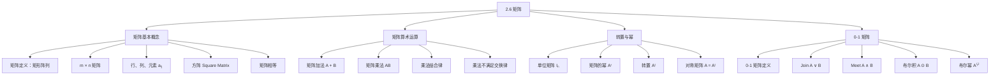

**相关笔记：** [[2.5 基数]]

> [!abstract] 概览
> 本节系统介绍了==矩阵（matrix）==的基本概念、==矩阵加法==与==矩阵乘法==的运算规则、==转置矩阵==与==对称矩阵==的性质，以及专门用于表示离散结构的==0-1 矩阵（zero-one matrix）==及其==布尔运算==。矩阵是离散数学中表示集合元素间关系的核心工具，在图论、通信网络和算法设计中有着广泛的应用。
>
> - **矩阵**是数的矩形阵列，$m \times n$ 矩阵有 $m$ 行 $n$ 列，$(i,j)$ 处的元素记为 $a_{ij}$
> - **矩阵加法**要求两个矩阵==同型==（行数和列数分别相同），对应位置元素相加
> - **矩阵乘法** $AB$ 仅在 $A$ 的列数等于 $B$ 的行数时有定义，$(i,j)$ 处元素为 $A$ 的第 $i$ 行与 $B$ 的第 $j$ 列的点积
> - 矩阵乘法满足**结合律**但不满足**交换律**（$AB \neq BA$ 一般成立）
> - **转置矩阵** $A^t$ 通过互换行和列得到，若 $A = A^t$ 则称 $A$ 为==对称矩阵==
> - **0-1 矩阵**的布尔运算（join $\vee$、meet $\wedge$、布尔积 $\odot$）是图论中路径计数的基础

---

## 一、知识结构总览

---

## 二、核心思想

> [!tip] 核心思想
> 本节的核心思想是：矩阵不仅是线性代数的计算工具，更是离散数学中表示==关系==的核心数据结构。矩阵乘法不满足交换律是初学者最需注意的性质。0-1 矩阵及其布尔运算（join、meet、布尔积）为图论中的路径计数和连通性判断提供了精确的代数工具——布尔幂 $A^{[r]}$ 的 $(i,j)$ 元素直接表示顶点 $i$ 到 $j$ 是否存在长度为 $r$ 的路径。

### 1. 矩阵的定义

> [!def] 矩阵（Matrix）
> >
> ==矩阵==是一个==矩形阵列==（rectangular array）的数。一个有 $m$ 行 $n$ 列的矩阵称为 $m \times n$ 矩阵。
>
> - 矩阵的复数形式为 **matrices**
> - 行数等于列数的矩阵称为==方阵（square matrix）==
> - 两个矩阵==相等==当且仅当它们有相同的行数和列数，且所有对应位置的元素都相等

> [!example] 矩阵的例子
> >
> $$\begin{bmatrix} 1 & 1 \\ 0 & 2 \\ 1 & 3 \end{bmatrix}$$
>
> 是一个 $3 \times 2$ 矩阵。

> [!def] 矩阵的元素、行与列
> >
> 设 $m \times n$ 矩阵
>
> $$\mathbf{A} = \begin{bmatrix} a_{11} & a_{12} & \cdots & a_{1n} \\ a_{21} & a_{22} & \cdots & a_{2n} \\ \vdots & \vdots & \ddots & \vdots \\ a_{m1} & a_{m2} & \cdots & a_{mn} \end{bmatrix}$$
>
> - $a_{ij}$ 称为 $\mathbf{A}$ 的==第 $(i,j)$ 元素==（或 $(i,j)$ 处的元素/entry）
> - $\mathbf{A}$ 的第 $i$ 行是 $1 \times n$ 矩阵 $[a_{i1}, a_{i2}, \ldots, a_{in}]$
> - $\mathbf{A}$ 的第 $j$ 列是 $m \times 1$ 矩阵 $\begin{bmatrix} a_{1j} \\ a_{2j} \\ \vdots \\ a_{mj} \end{bmatrix}$
> - 简记：$\mathbf{A} = [a_{ij}]$

### 2. 矩阵算术运算

#### 2.1 矩阵加法

> [!def] 矩阵加法
> >
> 设 $\mathbf{A} = [a_{ij}]$ 和 $\mathbf{B} = [b_{ij}]$ 都是 $m \times n$ 矩阵，则 $\mathbf{A}$ 与 $\mathbf{B}$ 的==和==记为 $\mathbf{A} + \mathbf{B}$，是 $m \times n$ 矩阵：
>
> $$\mathbf{A} + \mathbf{B} = [a_{ij} + b_{ij}]$$
>
> - 矩阵加法通过==对应位置元素相加==得到
> - **不同大小的矩阵不能相加**

> [!example] 矩阵加法
> >
> $$\begin{bmatrix} 1 & 0 & -1 \\ 2 & 2 & -3 \\ 3 & 4 & 0 \end{bmatrix} + \begin{bmatrix} 3 & 4 & -1 \\ 1 & -3 & 0 \\ -1 & 1 & 2 \end{bmatrix} = \begin{bmatrix} 4 & 4 & -2 \\ 3 & -1 & -3 \\ 2 & 5 & 2 \end{bmatrix}$$
>
> **推导过程**（以 $(1,1)$ 元素为例）：$1 + 3 = 4$

#### 2.2 矩阵乘法

> [!def] 矩阵乘法
> >
> 设 $\mathbf{A}$ 是 $m \times k$ 矩阵，$\mathbf{B}$ 是 $k \times n$ 矩阵，则 $\mathbf{A}$ 与 $\mathbf{B}$ 的==积== $\mathbf{AB}$ 是 $m \times n$ 矩阵，其 $(i,j)$ 处元素为：
>
> $$c_{ij} = a_{i1}b_{1j} + a_{i2}b_{2j} + \cdots + a_{ik}b_{kj} = \sum_{l=1}^{k} a_{il} b_{lj}$$
>
> - 矩阵乘法**仅当** $\mathbf{A}$ 的列数等于 $\mathbf{B}$ 的行数时有定义
> - $(i,j)$ 处元素是 $\mathbf{A}$ 的第 $i$ 行与 $\mathbf{B}$ 的第 $j$ 列的**点积**

> [!example] 矩阵乘法的计算
> >
> 设
>
> $$\mathbf{A} = \begin{bmatrix} 1 & 0 & 4 \\ 2 & 1 & 1 \\ 3 & 1 & 0 \\ 0 & 2 & 2 \end{bmatrix}, \quad \mathbf{B} = \begin{bmatrix} 2 & 4 \\ 1 & 1 \\ 3 & 0 \end{bmatrix}$$
>
> $\mathbf{A}$ 是 $4 \times 3$ 矩阵，$\mathbf{B}$ 是 $3 \times 2$ 矩阵，故 $\mathbf{AB}$ 是 $4 \times 2$ 矩阵。
>
> **推导过程**（以 $(3,1)$ 元素为例）：
>
> $$c_{31} = a_{31}b_{11} + a_{32}b_{21} + a_{33}b_{31} = 3 \cdot 2 + 1 \cdot 1 + 0 \cdot 3 = 6 + 1 + 0 = 7$$
>
> 完整结果：
>
> $$\mathbf{AB} = \begin{bmatrix} 14 & 4 \\ 8 & 9 \\ 7 & 13 \\ 8 & 2 \end{bmatrix}$$

> [!warning] 矩阵乘法不满足交换律
> >
> 这是初学者最容易犯错的地方。即使 $\mathbf{AB}$ 和 $\mathbf{BA}$ 都有定义，它们也**不一定相等**。
>
> **反例**：设 $\mathbf{A} = \begin{bmatrix} 1 & 1 \\ 2 & 1 \end{bmatrix}$，$\mathbf{B} = \begin{bmatrix} 2 & 1 \\ 1 & 1 \end{bmatrix}$，则
>
> $$\mathbf{AB} = \begin{bmatrix} 3 & 2 \\ 5 & 3 \end{bmatrix}, \quad \mathbf{BA} = \begin{bmatrix} 4 & 3 \\ 3 & 2 \end{bmatrix}$$
>
> 显然 $\mathbf{AB} \neq \mathbf{BA}$。

> [!tip] 矩阵乘法的维度分析
> >
> - $m \times k$ 矩阵 $\times$ $k \times n$ 矩阵 $=$ $m \times n$ 矩阵
> - 如果 $\mathbf{A}$ 是 $m \times n$，$\mathbf{B}$ 是 $r \times s$：
>   - $\mathbf{AB}$ 有定义 $\Leftrightarrow$ $n = r$
>   - $\mathbf{BA}$ 有定义 $\Leftrightarrow$ $s = m$
>   - 两者都有定义且同型 $\Leftrightarrow$ $m = n = r = s$（即两者都是同阶方阵）

### 3. 单位矩阵、转置与对称矩阵

#### 3.1 单位矩阵（Identity Matrix）

> [!def] 单位矩阵
> >
> $n$ 阶==单位矩阵== $\mathbf{I}_n = [\delta_{ij}]$，其中 $\delta_{ij}$ 是==Kronecker delta==：
>
> $$\delta_{ij} = \begin{cases} 1 & \text{若 } i = j \\ 0 & \text{若 } i \neq j \end{cases}$$
>
> 即主对角线上的元素为 1，其余为 0：
>
> $$\mathbf{I}_n = \begin{bmatrix} 1 & 0 & \cdots & 0 \\ 0 & 1 & \cdots & 0 \\ \vdots & \vdots & \ddots & \vdots \\ 0 & 0 & \cdots & 1 \end{bmatrix}$$
>
> - 单位矩阵是矩阵乘法的"单位元"：$\mathbf{A}\mathbf{I}_n = \mathbf{I}_m\mathbf{A} = \mathbf{A}$（$\mathbf{A}$ 为 $m \times n$ 矩阵）

#### 3.2 矩阵的幂

> [!def] 矩阵的幂
> >
> 由于矩阵乘法满足结合律，可以定义方阵的==幂==：
>
> $$\mathbf{A}^r = \underbrace{\mathbf{A} \cdot \mathbf{A} \cdots \mathbf{A}}_{r \text{ 个因子}}, \quad \mathbf{A}^0 = \mathbf{I}_n$$

#### 3.3 转置矩阵（Transpose）

> [!def] 转置矩阵
> >
> 设 $\mathbf{A} = [a_{ij}]$ 是 $m \times n$ 矩阵，则 $\mathbf{A}$ 的==转置== $\mathbf{A}^t$ 是 $n \times m$ 矩阵，通过==互换行和列==得到。若 $\mathbf{A}^t = [b_{ij}]$，则：
>
> $$b_{ij} = a_{ji} \quad (i = 1, 2, \ldots, n; \ j = 1, 2, \ldots, m)$$

> [!example] 转置矩阵
> >
> $$\mathbf{A} = \begin{bmatrix} 1 & 2 & 3 \\ 4 & 5 & 6 \end{bmatrix} \implies \mathbf{A}^t = \begin{bmatrix} 1 & 4 \\ 2 & 5 \\ 3 & 6 \end{bmatrix}$$
>
> $\mathbf{A}$ 是 $2 \times 3$ 矩阵，$\mathbf{A}^t$ 是 $3 \times 2$ 矩阵。

#### 3.4 对称矩阵（Symmetric Matrix）

> [!def] 对称矩阵
> >
> 方阵 $\mathbf{A}$ 称为==对称矩阵==，如果 $\mathbf{A} = \mathbf{A}^t$。即对所有 $i, j$，有 $a_{ij} = a_{ji}$。
>
> - 对称矩阵关于其==主对角线==（main diagonal）对称

> [!example] 对称矩阵
> >
> $$\mathbf{A} = \begin{bmatrix} 1 & 1 & 0 \\ 1 & 0 & 1 \\ 0 & 1 & 0 \end{bmatrix}$$
>
> 验证：$a_{12} = 1 = a_{21}$，$a_{13} = 0 = a_{31}$，$a_{23} = 1 = a_{32}$，故 $\mathbf{A} = \mathbf{A}^t$。

> [!tip] 转置的重要性质
> >
> - $(\mathbf{A}^t)^t = \mathbf{A}$
> - $(\mathbf{A} + \mathbf{B})^t = \mathbf{A}^t + \mathbf{B}^t$
> - $(\mathbf{AB})^t = \mathbf{B}^t \mathbf{A}^t$（注意顺序反转！）

### 4. 0-1 矩阵（Zero-One Matrices）

> [!def] 0-1 矩阵
> >
> ==0-1 矩阵==是所有元素都等于 0 或 1 的矩阵。0-1 矩阵常用于表示离散结构（如[[10.1 图与图模型|图]]的邻接矩阵）。
>
> - 基于==布尔运算== $\wedge$（与）和 $\vee$（或）定义：
>   - $b_1 \wedge b_2 = 1$ 当且仅当 $b_1 = b_2 = 1$
>   - $b_1 \vee b_2 = 1$ 当且仅当 $b_1 = 1$ 或 $b_2 = 1$

#### 4.1 Join 与 Meet

> [!def] Join 与 Meet
> >
> 设 $\mathbf{A} = [a_{ij}]$ 和 $\mathbf{B} = [b_{ij}]$ 是 $m \times n$ 的 0-1 矩阵：
>
> - $\mathbf{A}$ 与 $\mathbf{B}$ 的==join==（合取）$\mathbf{A} \vee \mathbf{B} = [a_{ij} \vee b_{ij}]$
> - $\mathbf{A}$ 与 $\mathbf{B}$ 的==meet==（析取）$\mathbf{A} \wedge \mathbf{B} = [a_{ij} \wedge b_{ij}]$

> [!example] Join 与 Meet 的计算
> >
> 设 $\mathbf{A} = \begin{bmatrix} 1 & 0 & 1 \\ 0 & 1 & 0 \end{bmatrix}$，$\mathbf{B} = \begin{bmatrix} 0 & 1 & 0 \\ 1 & 1 & 0 \end{bmatrix}$。
>
> $$\mathbf{A} \vee \mathbf{B} = \begin{bmatrix} 1 \vee 0 & 0 \vee 1 & 1 \vee 0 \\ 0 \vee 1 & 1 \vee 1 & 0 \vee 0 \end{bmatrix} = \begin{bmatrix} 1 & 1 & 1 \\ 1 & 1 & 0 \end{bmatrix}$$
>
> $$\mathbf{A} \wedge \mathbf{B} = \begin{bmatrix} 1 \wedge 0 & 0 \wedge 1 & 1 \wedge 0 \\ 0 \wedge 1 & 1 \wedge 1 & 0 \wedge 0 \end{bmatrix} = \begin{bmatrix} 0 & 0 & 0 \\ 0 & 1 & 0 \end{bmatrix}$$

#### 4.2 布尔积（Boolean Product）

> [!def] 布尔积
> >
> 设 $\mathbf{A} = [a_{ij}]$ 是 $m \times k$ 的 0-1 矩阵，$\mathbf{B} = [b_{ij}]$ 是 $k \times n$ 的 0-1 矩阵，则 $\mathbf{A}$ 与 $\mathbf{B}$ 的==布尔积== $\mathbf{A} \odot \mathbf{B}$ 是 $m \times n$ 矩阵，其 $(i,j)$ 处元素为：
>
> $$c_{ij} = (a_{i1} \wedge b_{1j}) \vee (a_{i2} \wedge b_{2j}) \vee \cdots \vee (a_{ik} \wedge b_{kj})$$
>
> - 布尔积的计算方式与普通矩阵乘法类似，但用 $\vee$ 替代加法，用 $\wedge$ 替代乘法

> [!example] 布尔积的计算
> >
> 设 $\mathbf{A} = \begin{bmatrix} 1 & 0 \\ 0 & 1 \\ 1 & 0 \end{bmatrix}$，$\mathbf{B} = \begin{bmatrix} 1 & 1 & 0 \\ 0 & 1 & 1 \end{bmatrix}$。
>
> **推导过程**（以 $(1,1)$ 元素为例）：
>
> $$c_{11} = (a_{11} \wedge b_{11}) \vee (a_{12} \wedge b_{21}) = (1 \wedge 1) \vee (0 \wedge 0) = 1 \vee 0 = 1$$
>
> **推导过程**（以 $(2,2)$ 元素为例）：
>
> $$c_{22} = (a_{21} \wedge b_{12}) \vee (a_{22} \wedge b_{22}) = (0 \wedge 1) \vee (1 \wedge 1) = 0 \vee 1 = 1$$
>
> 完整结果：
>
> $$\mathbf{A} \odot \mathbf{B} = \begin{bmatrix} 1 & 1 & 0 \\ 0 & 1 & 1 \\ 1 & 1 & 0 \end{bmatrix}$$

#### 4.3 布尔幂（Boolean Powers）

> [!def] 布尔幂
> >
> 设 $\mathbf{A}$ 是 $n \times n$ 的 0-1 方阵，$r$ 为正整数，则 $\mathbf{A}$ 的第 $r$ 次==布尔幂==为：
>
> $$\mathbf{A}^{[r]} = \underbrace{\mathbf{A} \odot \mathbf{A} \odot \cdots \odot \mathbf{A}}_{r \text{ 个因子}}$$
>
> - $\mathbf{A}^{[0]} = \mathbf{I}_n$
> - 布尔幂在[[10.4 连通性|图论]]中有重要应用：$\mathbf{A}^{[r]}$ 的 $(i,j)$ 元素为 1 表示图中顶点 $i$ 到顶点 $j$ 存在长度为 $r$ 的路径

> [!example] 布尔幂的计算
> >
> 设 $\mathbf{A} = \begin{bmatrix} 0 & 1 & 0 \\ 0 & 0 & 1 \\ 1 & 0 & 0 \end{bmatrix}$。
>
> $$\mathbf{A}^{[2]} = \mathbf{A} \odot \mathbf{A} = \begin{bmatrix} 0 & 0 & 1 \\ 1 & 0 & 0 \\ 0 & 1 & 0 \end{bmatrix}$$
>
> $$\mathbf{A}^{[3]} = \mathbf{A}^{[2]} \odot \mathbf{A} = \begin{bmatrix} 1 & 0 & 0 \\ 0 & 1 & 0 \\ 0 & 0 & 1 \end{bmatrix} = \mathbf{I}_3$$
>
> $$\mathbf{A}^{[4]} = \mathbf{A}^{[3]} \odot \mathbf{A} = \mathbf{I}_3 \odot \mathbf{A} = \mathbf{A}$$
>
> 可以看到，布尔幂呈现周期性：$\mathbf{A}^{[n+3]} = \mathbf{A}^{[n]}$。

---

## 三、补充理解与易混淆点

### 补充理解

### 1. 矩阵的历史发展与 Cayley 的贡献

矩阵的概念虽然现在看来是线性代数的核心，但其系统化发展相对较晚。英国数学家**James Joseph Sylvester** 在 1850 年首次引入"matrix"一词（拉丁语"子宫"之意，因为他将矩阵视为从其中产生行列式的母体）。然而，真正建立矩阵代数体系的是英国数学家**Arthur Cayley**（1821-1895）。Cayley 在 1855 年的论文"A Memoir on the Theory of Matrices"中首次系统阐述了矩阵的加法、乘法和求逆运算，并证明了矩阵乘法的结合律以及 $(\mathbf{AB})^t = \mathbf{B}^t\mathbf{A}^t$ 等重要性质。Cayley 的工作将矩阵从单纯的计算工具提升为独立的代数结构，为后来的量子力学、计算机图形学和机器学习奠定了数学基础。

- **来源**: Cayley, A. (1855). "A Memoir on the Theory of Matrices." *Philosophical Transactions of the Royal Society of London*, 148, 17-37. [https://doi.org/10.1098/rstl.1858.0002](https://doi.org/10.1098/rstl.1858.0002)
- **参考**: Hawkins, T. (1975). "Cauchy and the spectral theory of matrices." *Historia Mathematica*, 2(1), 1-29.
>
> **网络资源：**
> - [Academo - Venn Diagram Generator](https://academo.org/demos/venn-diagram-generator/) -- 集合关系的可视化（矩阵与集合运算的对应）

### 2. 0-1 矩阵与图论中的邻接矩阵

0-1 矩阵在离散数学中最重要的应用之一是表示图（graph）的==邻接矩阵（adjacency matrix）==。给定一个有 $n$ 个顶点的图 $G$，其邻接矩阵 $\mathbf{A}$ 是一个 $n \times n$ 的 0-1 矩阵，其中 $a_{ij} = 1$ 当且仅当存在从顶点 $i$ 到顶点 $j$ 的边。邻接矩阵的布尔幂 $\mathbf{A}^{[r]}$ 揭示了图的深层结构：$(\mathbf{A}^{[r]})_{ij} = 1$ 表示顶点 $i$ 到顶点 $j$ 之间存在长度恰好为 $r$ 的路径。进一步地，$\mathbf{A} \vee \mathbf{A}^{[2]} \vee \cdots \vee \mathbf{A}^{[n-1]}$ 的 $(i,j)$ 元素为 1 表示顶点 $i$ 到顶点 $j$ 之间存在**任意长度**的路径，这是判断图连通性的关键工具。这一理论将在第 9 章中详细展开。

- **来源**: Rosen, K. H. (2019). *Discrete Mathematics and Its Applications* (8th ed.), Section 9.4. McGraw-Hill.
- **参考**: Bondy, J. A. and Murty, U. S. R. (2008). *Graph Theory* (2nd ed.). Springer. [https://doi.org/10.1007/978-1-84628-970-5](https://doi.org/10.1007/978-1-84628-970-5)
>
> **网络资源：**
> - [IntersectMe](https://intersectme.leibniz-fli.de/) -- 集合关系可视化工具

### 易混淆点

### 1. 矩阵乘法 vs 标量乘法

- ❌ 认为矩阵乘法与数的乘法一样满足交换律，即 $\mathbf{AB} = \mathbf{BA}$
- ✅ 矩阵乘法**不满足交换律**。即使 $\mathbf{AB}$ 和 $\mathbf{BA}$ 都有定义（要求两者都是同阶方阵），它们也通常不相等。矩阵乘法满足结合律 $\mathbf{A}(\mathbf{BC}) = (\mathbf{AB})\mathbf{C}$ 和分配律 $\mathbf{A}(\mathbf{B}+\mathbf{C}) = \mathbf{AB} + \mathbf{AC}$，但**不满足交换律**和**消去律**（$\mathbf{AB} = \mathbf{AC}$ 不能推出 $\mathbf{B} = \mathbf{C}$）

### 2. 普通矩阵乘法 vs 布尔积

- ❌ 将布尔积 $\mathbf{A} \odot \mathbf{B}$ 与普通矩阵乘法 $\mathbf{AB}$ 混淆，使用普通加法和乘法来计算布尔积
- ✅ 布尔积的计算方式与普通矩阵乘法**结构相同**，但运算被替换：用**布尔或** $\vee$ 替代加法，用**布尔与** $\wedge$ 替代乘法。例如，普通乘法中 $c_{ij} = \sum_{l} a_{il} b_{lj}$（求和后可能大于 1），而布尔积中 $c_{ij} = \bigvee_{l} (a_{il} \wedge b_{lj})$（结果只能是 0 或 1）。布尔积的结果始终是 0-1 矩阵

---

## 四、习题精选

> [!todo] 习题概览
> >
> | 题号范围 | 核心考点 | 难度 |
> |---------|---------|------|
> | 1 | 矩阵的维度、行、列、元素、转置 | ⭐ |
> | 2 | 矩阵加法 | ⭐ |
> | 3-4 | 矩阵乘法 | ⭐⭐ |
> | 5-6 | 已知乘积求未知矩阵（解线性方程组） | ⭐⭐⭐ |
> | 7-9 | 矩阵加法的性质（单位元、交换律、结合律） | ⭐⭐ |
> | 10-11 | 矩阵乘法的维度分析 | ⭐⭐ |
> | 12-13 | 矩阵乘法的分配律与结合律证明 | ⭐⭐⭐ |
> | 14-15 | 对角矩阵与矩阵的幂 | ⭐⭐ |
> | 16-17 | 转置的性质证明 | ⭐⭐ |
> | 18-22 | 逆矩阵的定义与性质 | ⭐⭐⭐ |
> | 23 | 对称矩阵的证明 | ⭐⭐ |
> | 24-26 | 矩阵与线性方程组的关系 | ⭐⭐⭐ |
> | 27-29 | 0-1 矩阵的 join、meet、布尔积、布尔幂 | ⭐⭐ |
> | 30-35 | 0-1 矩阵运算的性质证明 | ⭐⭐⭐ |

### 题1：计算布尔积

> [!problem] 题目
> 设 $\mathbf{A} = \begin{bmatrix} 1 & 1 & 0 \\ 0 & 1 & 1 \\ 1 & 0 & 0 \end{bmatrix}$，$\mathbf{B} = \begin{bmatrix} 0 & 1 \\ 1 & 0 \\ 0 & 1 \end{bmatrix}$，求布尔积 $\mathbf{A} \odot \mathbf{B}$。

> [!faq]- 解答
> $\mathbf{A}$ 是 $3 \times 3$ 矩阵，$\mathbf{B}$ 是 $3 \times 2$ 矩阵，故 $\mathbf{A} \odot \mathbf{B}$ 是 $3 \times 2$ 矩阵。
>
> $c_{11} = (1 \wedge 0) \vee (1 \wedge 1) \vee (0 \wedge 0) = 0 \vee 1 \vee 0 = 1$
> $c_{12} = (1 \wedge 1) \vee (1 \wedge 0) \vee (0 \wedge 1) = 1 \vee 0 \vee 0 = 1$
> $c_{21} = (0 \wedge 0) \vee (1 \wedge 1) \vee (1 \wedge 0) = 0 \vee 1 \vee 0 = 1$
> $c_{22} = (0 \wedge 1) \vee (1 \wedge 0) \vee (1 \wedge 1) = 0 \vee 0 \vee 1 = 1$
> $c_{31} = (1 \wedge 0) \vee (0 \wedge 1) \vee (0 \wedge 0) = 0 \vee 0 \vee 0 = 0$
> $c_{32} = (1 \wedge 1) \vee (0 \wedge 0) \vee (0 \wedge 1) = 1 \vee 0 \vee 0 = 1$
>
> $$\mathbf{A} \odot \mathbf{B} = \begin{bmatrix} 1 & 1 \\ 1 & 1 \\ 0 & 1 \end{bmatrix}$$ $\blacksquare$

### 题2：矩阵乘法的计算

> [!problem] 题目
> 计算 $A = \begin{pmatrix} 1 & 2 \\ 3 & 4 \end{pmatrix}$ 与 $B = \begin{pmatrix} 5 & 6 \\ 7 & 8 \end{pmatrix}$ 的乘积 $AB$。

> [!faq]- 解答
> $A$ 是 $2 \times 2$ 矩阵，$B$ 是 $2 \times 2$ 矩阵，故 $AB$ 是 $2 \times 2$ 矩阵。
>
> 逐个计算每个元素（$A$ 的第 $i$ 行与 $B$ 的第 $j$ 列的点积）：
>
> - $c_{11} = 1 \cdot 5 + 2 \cdot 7 = 5 + 14 = 19$
> - $c_{12} = 1 \cdot 6 + 2 \cdot 8 = 6 + 16 = 22$
> - $c_{21} = 3 \cdot 5 + 4 \cdot 7 = 15 + 28 = 43$
> - $c_{22} = 3 \cdot 6 + 4 \cdot 8 = 18 + 32 = 50$
>
> $$AB = \begin{pmatrix} 19 & 22 \\ 43 & 50 \end{pmatrix}$$ $\blacksquare$

### 题3：转置矩阵的计算与验证

> [!problem] 题目
> 求 $A = \begin{pmatrix} 1 & 0 & 1 \\ 0 & 1 & 1 \\ 1 & 1 & 0 \end{pmatrix}$ 的转置 $A^T$，并验证 $(A^T)^T = A$。

> [!faq]- 解答
> **求转置**：将行和列互换。
>
> $$A^T = \begin{pmatrix} 1 & 0 & 1 \\ 0 & 1 & 1 \\ 1 & 1 & 0 \end{pmatrix}$$
>
> **验证**：观察到 $A$ 的 $(i,j)$ 元素与 $(j,i)$ 元素相同（例如 $a_{12} = 0 = a_{21}$，$a_{13} = 1 = a_{31}$，$a_{23} = 1 = a_{32}$），因此 $A$ 是对称矩阵，$A^T = A$。
>
> 再转置一次：$(A^T)^T = A^T = A$，验证 $(A^T)^T = A$ 成立。$\blacksquare$

### 题4：0-1 矩阵的布尔积

> [!problem] 题目
> 设 $\mathbf{A} = \begin{bmatrix} 1 & 0 & 1 \\ 1 & 1 & 0 \\ 0 & 1 & 0 \end{bmatrix}$，$\mathbf{B} = \begin{bmatrix} 0 & 1 \\ 1 & 0 \\ 1 & 1 \end{bmatrix}$，计算布尔积 $\mathbf{A} \odot \mathbf{B}$。

> [!faq]- 解答
> $\mathbf{A}$ 是 $3 \times 3$ 矩阵，$\mathbf{B}$ 是 $3 \times 2$ 矩阵，故 $\mathbf{A} \odot \mathbf{B}$ 是 $3 \times 2$ 矩阵。
>
> 逐个计算每个元素（用 $\vee$ 替代加法，$\wedge$ 替代乘法）：
>
> - $c_{11} = (1 \wedge 0) \vee (0 \wedge 1) \vee (1 \wedge 1) = 0 \vee 0 \vee 1 = 1$
> - $c_{12} = (1 \wedge 1) \vee (0 \wedge 0) \vee (1 \wedge 1) = 1 \vee 0 \vee 1 = 1$
> - $c_{21} = (1 \wedge 0) \vee (1 \wedge 1) \vee (0 \wedge 1) = 0 \vee 1 \vee 0 = 1$
> - $c_{22} = (1 \wedge 1) \vee (1 \wedge 0) \vee (0 \wedge 1) = 1 \vee 0 \vee 0 = 1$
> - $c_{31} = (0 \wedge 0) \vee (1 \wedge 1) \vee (0 \wedge 1) = 0 \vee 1 \vee 0 = 1$
> - $c_{32} = (0 \wedge 1) \vee (1 \wedge 0) \vee (0 \wedge 1) = 0 \vee 0 \vee 0 = 0$
>
> $$\mathbf{A} \odot \mathbf{B} = \begin{bmatrix} 1 & 1 \\ 1 & 1 \\ 1 & 0 \end{bmatrix}$$ $\blacksquare$

### 题5：矩阵乘法的转置性质

> [!problem] 题目
> 证明矩阵乘法的转置性质：$(AB)^T = B^T A^T$。

> [!faq]- 解答
> **证明**：设 $A$ 是 $m \times k$ 矩阵，$B$ 是 $k \times n$ 矩阵。
>
> 则 $AB$ 是 $m \times n$ 矩阵，$(AB)^T$ 是 $n \times m$ 矩阵。
>
> $B^T$ 是 $n \times k$ 矩阵，$A^T$ 是 $k \times m$ 矩阵，故 $B^T A^T$ 是 $n \times m$ 矩阵。
>
> 两者维度相同。下证对应元素相等。
>
> $(AB)^T$ 的第 $(j, i)$ 元素等于 $AB$ 的第 $(i, j)$ 元素：
>
> $$(AB)_{ij} = \sum_{l=1}^{k} a_{il} b_{lj}$$
>
> $B^T A^T$ 的第 $(j, i)$ 元素：
>
> $$(B^T A^T)_{ji} = \sum_{l=1}^{k} (B^T)_{jl} (A^T)_{li} = \sum_{l=1}^{k} b_{lj} a_{il} = \sum_{l=1}^{k} a_{il} b_{lj}$$
>
> 因此 $(AB)^T_{ji} = (B^T A^T)_{ji}$ 对所有 $i, j$ 成立。
>
> 故 $(AB)^T = B^T A^T$。$\blacksquare$

> [!tip] 解题思路提示
> 布尔积的计算与普通矩阵乘法结构相同，但用 $\vee$（或）替代加法，$\wedge$（与）替代乘法。逐个计算每个元素，注意结果只能是 0 或 1。

---

## 五、视频学习指南

> [!info] 视频资源
> | 资源 | 链接 | 对应内容 | 备注 |
> |:-----|:-----|:---------|:-----|
> | Rosen 8e Section 2.6 | [教材原文](https://www.mheducation.com/highered/product/discrete-mathematics-applications-rosen/M9781259676512.html) | 矩阵运算与0-1矩阵 | 英文教材 |
> | 3Blue1Brown - Essence of Linear Algebra Ch3 | [链接](https://www.youtube.com/watch?v=kYB8IZa1AuE) | 矩阵乘法的几何直觉 | 英文，可视化讲解 |
> | TrevTutor - Matrices | [链接](https://www.youtube.com/playlist?list=PLDDGPdw7e6AgWFFZxVDHjPb9egFkX7gJ) | 矩阵基本运算 | 英文，适合自学 |

---

## 六、教材原文

> [!quote] 教材原文
> "A matrix is a rectangular array of numbers. A matrix with m rows and n columns is called an m × n matrix."
>
> "Let A = [a_{ij}] and B = [b_{ij}] be m × n zero-one matrices. The join of A and B is the zero-one matrix with (i, j) entry equal to a_{ij} ∨ b_{ij}. The meet of A and B is the zero-one matrix with (i, j) entry equal to a_{ij} ∧ b_{ij}."

---

## 参见 Wiki

- [[离散数学/concepts/矩阵]] -- 矩阵的基本概念与分类
- [[离散数学/concepts/矩阵|矩阵运算]] -- 矩阵加法、乘法与转置
- [[离散数学/concepts/矩阵|0-1矩阵]] -- 布尔矩阵及其在图论中的应用
- [[离散数学/concepts/矩阵|逆矩阵]] -- 可逆矩阵的定义与判定
- [[离散数学/concepts/矩阵|邻接矩阵]] -- 图的矩阵表示
- [[离散数学/concepts/矩阵|线性方程组]] -- 矩阵与线性方程组的关系
- [[离散数学/concepts/矩阵|关系矩阵]] -- 二元关系的矩阵表示
- [[离散数学/concepts/矩阵|路径矩阵]] -- Warshall 算法与可达性矩阵
#学习/离散数学/基本结构
