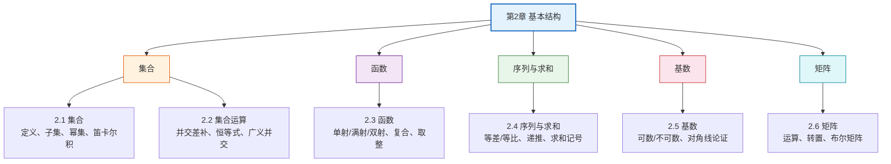

# 第02章 基本结构 — 章节汇总

> [!abstract] 概览
> 第2章介绍离散数学的==基本结构==：==集合==、==函数==、==序列==与==矩阵==。这些结构是后续所有章节的基础工具——集合用于定义关系和图，函数用于描述算法复杂度，序列用于递归和计数，矩阵用于表示图和关系。

---

## 全章知识框架



---

## 各节核心知识点汇总

### 2.1 集合

- **集合**（set）：无序、不重复的元素集合
- 表示方法：列举法 $\{a, b, c\}$、描述法 $\{x \mid P(x)\}$
- 常用数集：$\mathbb{N}, \mathbb{Z}, \mathbb{Q}, \mathbb{R}, \mathbb{C}$
- **子集** $A \subseteq B$ 与**真子集** $A \subset B$
- **空集** $\emptyset$ vs $\{\emptyset\}$ 的关键区别
- **幂集** $\mathcal{P}(S)$：$|\mathcal{P}(S)| = 2^{|S|}$
- **笛卡尔积** $A \times B$：$|A \times B| = |A| \cdot |B|$

### 2.2 集合运算

- 六种基本运算：并 $\cup$、交 $\cap$、差 $-$、补 $\overline{A}$、对称差 $\oplus$
- **集合恒等式表**（9 类）与命题逻辑等价律的对应关系
- 三种证明方法：子集法、成员表法、恒等式推导法
- **广义并交** $\bigcup_{i \in I} A_i$、$\bigcap_{i \in I} A_i$
- 位字符串表示法
- 多重集（multiset）及其运算

### 2.3 函数

- **函数** $f: A \to B$：定义域、值域、像、原像
- **单射**（injective）、**满射**（surjective）、**双射**（bijective）
- 反函数 $f^{-1}$ 存在条件：$f$ 是双射
- **函数复合** $f \circ g$（不满足交换律）
- **下取整** $\lfloor x \rfloor$ 与**上取整** $\lceil x \rceil$
- 阶乘函数与 Stirling 公式

### 2.4 序列与求和

- **序列**（sequence）：定义域为自然数集的函数
- 等差数列、等比数列
- **递推关系**与初始条件、斐波那契数列
- **求和记号** $\sum_{i=1}^{n} a_i$ 及其线性性质
- 常用求和公式表
- 双重求和与无穷级数

### 2.5 基数

- **等势** $|A| = |B|$ 与基数比较 $|A| \leq |B|$
- **可数集**：$\mathbb{N}$、$\mathbb{Z}$、$\mathbb{Q}$ 均可数
- **Cantor 对角线论证**：$\mathbb{R}$ 不可数
- Schröder-Bernstein 定理、Cantor 定理 $|S| < |\mathcal{P}(S)|$
- 连续统假设

### 2.6 矩阵

- 矩阵定义、加法、乘法（维度分析）
- 单位矩阵 $\mathbf{I}_n$、矩阵的幂、转置
- **0-1 矩阵**：Join $\vee$、Meet $\wedge$、布尔积 $\odot$、布尔幂

---

## 学习脉络

```
集合（2.1-2.2）— 离散数学的基本语言
  ↓
函数（2.3）— 集合之间的映射关系
  ↓
序列与求和（2.4）— 函数的特例（定义域=ℕ）
  ↓
基数（2.5）— 集合大小的度量
  ↓
矩阵（2.6）— 表示关系和图的数据结构
  ↓ 预告
算法（第3章）— 将用函数描述算法复杂度
```

---

## 跨章关联

| 后续章节 | 关联内容 | 关联方式 |
|:---------|:---------|:---------|
| 第3章 算法 | 函数描述算法复杂度 | 直接应用 |
| 第5章 归纳与递归 | 递推关系、序列求和 | 深化 |
| 第6章 计数 | 集合计数、容斥原理 | 直接应用 |
| 第9章 关系 | 关系用集合和矩阵表示 | 直接应用 |
| 第10章 图论 | 邻接矩阵是 0-1 矩阵 | 直接应用 |

---

## 复习题

> [!faq]- 综合复习题 1
> **题目：** 设 $A = \{1, 2, 3, 4\}$，求 $\mathcal{P}(A)$ 中满足 $1 \in S$ 且 $|S| = 3$ 的子集 $S$ 的个数。
>
> **解答：**
> $|S| = 3$ 且 $1 \in S$，因此还需从 $\{2, 3, 4\}$ 中选 2 个元素。
> $$\binom{3}{2} = 3$$
> 满足条件的子集为：$\{1, 2, 3\}, \{1, 2, 4\}, \{1, 3, 4\}$。共 3 个。

> [!faq]- 综合复习题 2
> **题目：** 证明：如果 $f: A \to B$ 和 $g: B \to C$ 都是双射，则 $g \circ f: A \to C$ 也是双射。
>
> **解答：**
> **单射性**：设 $(g \circ f)(a_1) = (g \circ f)(a_2)$，则 $g(f(a_1)) = g(f(a_2))$。因为 $g$ 是单射，所以 $f(a_1) = f(a_2)$。又因为 $f$ 是单射，所以 $a_1 = a_2$。
>
> **满射性**：对任意 $c \in C$，因为 $g$ 是满射，存在 $b \in B$ 使得 $g(b) = c$。又因为 $f$ 是满射，存在 $a \in A$ 使得 $f(a) = b$。因此 $(g \circ f)(a) = g(f(a)) = g(b) = c$。
>
> 因此 $g \circ f$ 是双射。$\blacksquare$

---

## 笔记索引

| 节 | 标题 | 笔记链接 |
|:---|:-----|:---------|
| 2.1 | 集合 | [[2.1 集合]] |
| 2.2 | 集合运算 | [[2.2 集合运算]] |
| 2.3 | 函数 | [[2.3 函数]] |
| 2.4 | 序列与求和 | [[2.4 序列与求和]] |
| 2.5 | 基数 | [[2.5 基数]] |
| 2.6 | 矩阵 | [[2.6 矩阵]] |

#学习/离散数学/基本结构
