**相关笔记：** [[2.3 函数]] | [[3.2 函数的增长]]

> [!abstract] 概览
> 本节是离散数学中==算法（algorithm）==的入门章节，系统介绍了算法的定义与五大特性、==伪代码（pseudocode）==语法规范、两大类经典搜索算法（==线性搜索==与==二分搜索==）、两种基础排序算法（==冒泡排序==与==插入排序==）、==字符串匹配==、==贪心算法（greedy algorithm）==的设计思想，以及著名的==停机问题（halting problem）==的不可判定性证明。
>
> - **算法**是用于执行计算或求解问题的==有限精确指令序列==
> - 算法必须具备==输入==、==输出==、==确定性==、==正确性==、==有限性==、==有效性==和==通用性==
> - ==伪代码==是介于自然语言描述和编程语言实现之间的中间表示
> - ==线性搜索==适用于任意列表，时间复杂度为 $O(n)$；==二分搜索==要求列表有序，时间复杂度为 $O(\log n)$
> - ==冒泡排序==通过相邻元素比较交换实现排序；==插入排序==将每个元素插入到已排序部分的正确位置
> - ==贪心算法==在每一步做出局部最优选择，但不一定总能得到全局最优解
> - ==停机问题==是计算机科学中最著名的不可判定问题之一，由 Alan Turing 于 1936 年证明

---

## 一、知识结构总览

```mermaid
graph TD
    A["3.1 算法 Algorithms"] --> B["算法的定义与特性"]
    A --> C["搜索算法 Searching"]
    A --> D["排序算法 Sorting"]
    A --> E["字符串匹配 String Matching"]
    A --> F["贪心算法 Greedy Algorithms"]
    A --> G["停机问题 Halting Problem"]

    B --> B1["算法的定义 Definition"]
    B --> B2["五大特性 Properties"]
    B --> B3["伪代码 Pseudocode"]
    B --> B4["求最大值算法 Algorithm 1"]

    C --> C1["线性搜索 Linear Search"]
    C --> C2["二分搜索 Binary Search"]

    D --> D1["冒泡排序 Bubble Sort"]
    D --> D2["插入排序 Insertion Sort"]
    D --> D3["选择排序 Selection Sort"]
    D --> D4["二分插入排序 Binary Insertion Sort"]

    E --> E1["朴素字符串匹配 Naive String Matcher"]

    F --> F1["找零钱算法 Cashier's Algorithm"]
    F --> F2["活动安排 Scheduling Talks"]

    G --> G1["图灵的证明 Turing's Proof"]
    G --> G2["对角线论证 Diagonalization"]
```



---

## 二、核心思想

> [!tip] 核心思想
> 本节的核心思想是==算法==作为求解问题的有限精确指令序列，其设计需要兼顾==正确性==与==有效性==。通过伪代码这一中间表示，我们可以在不依赖特定编程语言的前提下精确描述算法逻辑。搜索、排序、字符串匹配等经典算法展示了从蛮力到优化的设计思路演进，而贪心算法则引入了"局部最优"的设计范式。停机问题的不可判定性则揭示了计算的内在极限。

### 1. 算法的定义与特性

> [!def] 算法（Algorithm）
> ==算法==是一个用于执行计算或求解问题的==有限精确指令序列==。
>
> "algorithm"一词源自 9 世纪数学家 al-Khowarizmi 的名字，最初指用十进制记数法进行算术运算的规则，后来演变为包含所有用于求解问题的确定过程的更一般概念。

> [!def] 算法的五大特性
> | 特性 | 说明 |
> |------|------|
> | ==输入（Input）== | 算法从指定的集合中接收输入值 |
> | ==输出（Output）== | 对于每组输入值，算法产生指定集合中的输出值，即问题的解 |
> | ==确定性（Definiteness）== | 算法的每一步都必须被精确地定义 |
> | ==正确性（Correctness）== | 算法对于每组输入值都应产生正确的输出值 |
> | ==有限性（Finiteness）== | 对于任何输入，算法应在有限步（但可能很多步）之后产生期望的输出 |
> | ==有效性（Effectiveness）== | 算法的每一步都必须能在有限时间内精确地执行 |
> | ==通用性（Generality）== | 算法应适用于所有期望形式的问题，而不仅仅是特定的输入值 |

> [!example] 求最大值算法（Algorithm 1）
> 求有限整数序列中的最大值：
>
> ```
> procedure max(a1, a2, ..., an: integers)
>     max := a1
>     for i := 2 to n
>         if max < ai then max := ai
>     return max
> ```
>
> **追踪示例**：输入 8, 4, 11, 3, 10
>
> | 步骤 | i | 当前 ai | max 值 | 操作 |
> |------|---|---------|--------|------|
> | 初始化 | — | — | 8 | max := a1 |
> | 第1次比较 | 2 | 4 | 8 | 4 ≤ 8，不变 |
> | 第2次比较 | 3 | 11 | 11 | 8 < 11，更新 |
> | 第3次比较 | 4 | 3 | 11 | 3 ≤ 11，不变 |
> | 第4次比较 | 5 | 10 | 11 | 10 ≤ 11，不变 |
> | 终止 | — | — | 11 | 返回 max = 11 |

### 2. 伪代码

> [!def] 伪代码（Pseudocode）
> ==伪代码==是介于自然语言描述和编程语言实现之间的==中间表示==，其指令类似于编程语言中的语句，但可以使用任何定义良好的操作或语句。
>
> - 伪代码不受特定编程语言语法的限制
> - 可以使用任何定义良好的指令，即使该指令在实际编程语言中需要多行代码来实现
> - 伪代码可以作为将算法转换为任何编程语言程序的起点

**伪代码基本语法要素**：

| 结构 | 语法 | 说明 |
|------|------|------|
| 赋值 | `变量 := 表达式` | 将表达式的值赋给变量 |
| 条件语句 | `if 条件 then 语句` | 条件为真时执行 |
| 循环 | `for 变量 := 初值 to 终值` | 计数循环 |
| 循环 | `while 条件` | 条件循环 |
| 过程 | `procedure 名称(参数)` | 定义一个过程 |
| 返回 | `return 值` | 返回结果 |

### 3. 搜索算法

> [!def] 线性搜索（Linear Search / Sequential Search）
> ==线性搜索==从列表的第一个元素开始，逐个将目标元素 $x$ 与列表中的元素进行比较，直到找到匹配或搜索完整个列表。
>
> ```
> procedure linear_search(x: integer, a1, a2, ..., an: distinct integers)
>     i := 1
>     while (i ≤ n and x ≠ ai)
>         i := i + 1
>     if i ≤ n then location := i
>     else location := 0
>     return location
> ```
>
> - 返回值为 $x$ 在列表中的位置（下标），若未找到则返回 0
> - ==时间复杂度==：最坏情况下需要比较 $n$ 次，即 $O(n)$
> - ==适用条件==：列表中的元素可以是任意顺序

> [!def] 二分搜索（Binary Search）
> ==二分搜索==利用列表==有序==这一条件，通过反复将搜索区间减半来快速定位目标元素。
>
> ```
> procedure binary_search(x: integer, a1, a2, ..., an: increasing integers)
>     i := 1                    {i 是搜索区间的左端点}
>     j := n                    {j 是搜索区间的右端点}
>     while i < j
>         m := ⌊(i + j)/2⌋
>         if x > am then i := m + 1
>         else j := m
>     if x = ai then location := i
>     else location := 0
>     return location
> ```
>
> - ==时间复杂度==：每次将搜索区间减半，最坏情况下需要 $O(\log n)$ 次比较
> - ==适用条件==：列表必须按递增顺序排列
> - ==核心思想==：比较 $x$ 与中间元素 $a_m$，若 $x > a_m$ 则搜索右半部分，否则搜索左半部分

> [!example] 二分搜索追踪示例
> 在列表 $1, 2, 3, 5, 6, 7, 8, 10, 12, 13, 15, 16, 18, 19, 20, 22$ 中搜索 19：
>
> | 步骤 | 搜索区间 | 中间位置 $m$ | $a_m$ | 比较 | 新区间 |
> |------|---------|-------------|-------|------|--------|
> | 1 | [1, 16] | 8 | 10 | 19 > 10 | [9, 16] |
> | 2 | [9, 16] | 12 | 16 | 19 > 16 | [13, 16] |
> | 3 | [13, 16] | 14 | 19 | 19 ≤ 19 | [13, 14] |
> | 4 | [13, 14] | 13 | 18 | 19 > 18 | [14, 14] |
> | 5 | [14, 14] | — | — | $i = j$，退出循环 | — |
>
> 检查 $a_{14} = 19 = x$，返回 location = 14。

### 4. 排序算法

> [!def] 冒泡排序（Bubble Sort）
> ==冒泡排序==通过反复比较相邻元素，若顺序错误则交换它们，使较大的元素逐渐"下沉"到列表末尾，较小的元素"上浮"到列表前端。
>
> ```
> procedure bubblesort(a1, ..., an: real numbers with n ≥ 2)
>     for i := 1 to n - 1
>         for j := 1 to n - i
>             if aj > aj+1 then interchange aj and aj+1
> ```
>
> - 第 $i$ 趟遍历后，最大的 $i$ 个元素已就位
> - ==时间复杂度==：$O(n^2)$ 次比较
> - 类比：就像水中的气泡，较轻的（较小的）元素逐渐浮到顶部

> [!example] 冒泡排序追踪示例
> 对列表 3, 2, 4, 1, 5 进行冒泡排序：
>
> | 趟数 | 操作过程 | 结果 |
> |------|---------|------|
> | 第1趟 | 3↔2, 4↔1 | 2, 3, 1, 4, 5 |
> | 第2趟 | 3↔1 | 2, 1, 3, 4, 5 |
> | 第3趟 | 2↔1 | 1, 2, 3, 4, 5 |
> | 第4趟 | 无交换 | 1, 2, 3, 4, 5 |

> [!def] 插入排序（Insertion Sort）
> ==插入排序==从第二个元素开始，将每个元素插入到前面已排序部分的正确位置。
>
> ```
> procedure insertion_sort(a1, a2, ..., an: real numbers with n ≥ 2)
>     for j := 2 to n
>         i := 1
>         while aj > ai
>             i := i + 1
>         m := aj
>         for k := 0 to j - i - 1
>             aj-k := aj-k-1
>         ai := m
> ```
>
> - 在第 $j$ 步中，第 $j$ 个元素被插入到前 $j-1$ 个已排序元素中的正确位置
> - 插入时使用线性搜索找到正确位置，然后将元素后移腾出空间
> - ==时间复杂度==：最坏情况下 $O(n^2)$ 次比较；最好情况（已排序）$O(n)$ 次比较

> [!example] 插入排序追踪示例
> 对列表 3, 2, 4, 1, 5 进行插入排序：
>
> | 步骤 | 待插入元素 | 已排序部分 | 操作 | 结果 |
> |------|-----------|-----------|------|------|
> | j=2 | 2 | [3] | 2 < 3，插入到位置1 | 2, 3, 4, 1, 5 |
> | j=3 | 4 | [2, 3] | 4 > 3，保持位置 | 2, 3, 4, 1, 5 |
> | j=4 | 1 | [2, 3, 4] | 1 < 2，插入到位置1 | 1, 2, 3, 4, 5 |
> | j=5 | 5 | [1, 2, 3, 4] | 5 > 4，保持位置 | 1, 2, 3, 4, 5 |

### 5. 字符串匹配

> [!def] 朴素字符串匹配（Naive String Matcher）
> ==字符串匹配==问题：在文本 $T = t_1 t_2 \ldots t_n$ 中查找模式 $P = p_1 p_2 \ldots p_m$ 的所有出现位置。当模式从文本的第 $s+1$ 个位置开始匹配时，称 $P$ 在 $T$ 中以位移 $s$ 出现。
>
> ```
> procedure string_match(n, m: positive integers, m ≤ n,
>     t1, t2, ..., tn, p1, p2, ..., pm: characters)
>     for s := 0 to n - m
>         j := 1
>         while (j ≤ m and ts+j = pj)
>             j := j + 1
>         if j > m then print "s is a valid shift"
> ```
>
> - 对每个可能的位移 $s$（从 0 到 $n-m$），逐一比较模式与文本的对应字符
> - ==时间复杂度==：$O((n-m+1) \cdot m)$
> - ==应用场景==：文本编辑、垃圾邮件过滤、搜索引擎、生物信息学（DNA 序列比对）等

### 6. 贪心算法

> [!def] 贪心算法（Greedy Algorithm）
> ==贪心算法==在每一步做出==局部最优选择==，而不考虑所有可能导向全局最优解的步骤序列。
>
> - 贪心算法的设计关键在于选择合适的贪心准则
> - 贪心算法不一定总能找到最优解，需要通过证明或反例来验证
> - 即使贪心算法不总能找到最优解，它仍然可能找到可行解

> [!thm] 找零钱算法的最优性（Theorem 1）
> 使用 quarters（25美分）、dimes（10美分）、nickels（5美分）和 pennies（1美分）时，==收银员算法（Cashier's Algorithm）==总是使用最少数量的硬币完成找零。
>
> **证明思路**（反证法）：
>
> 1. 假设存在某个正整数 $n$，使得有一种使用更少硬币的找零方式
> 2. 由引理 1：最优解中 dime 不超过 2 个、nickel 不超过 1 个、penny 不超过 4 个，且 dime 和 nickel 不能同时出现
> 3. 因此 dime、nickel 和 penny 的总金额不超过 24 美分
> 4. 贪心算法使用了尽可能多的 quarters，而最优解中不可能使用更少的 quarters（否则需要用小面额硬币凑出至少 25 美分，与引理 1 矛盾）
> 5. 两者的 quarters 数量相同，同理 dimes、nickels、pennies 的数量也相同，矛盾

> [!warning] 贪心算法不一定最优
> 如果只有 quarters、dimes 和 pennies（没有 nickels），贪心算法对 30 美分会使用 6 枚硬币（1 quarter + 5 pennies），而最优解是 3 枚 dimes。这说明==贪心算法的最优性依赖于具体的硬币面额组合==。

> [!def] 活动安排贪心算法（Algorithm 8）
> 在一个报告厅中安排尽可能多的报告，每个报告有预设的开始时间和结束时间。
>
> ```
> procedure schedule(s1 ≤ s2 ≤ ... ≤ sn: start times,
>     e1 ≤ e2 ≤ ... ≤ en: ending times)
>     sort talks by finish time so that e1 ≤ e2 ≤ ... ≤ en
>     S := ∅
>     for j := 1 to n
>         if talk j is compatible with S then
>             S := S ∪ {talk j}
>     return S
> ```
>
> - 按结束时间递增排序后，贪心地选择与已选报告兼容的下一个报告
> - ==按最早结束时间选择==这一贪心准则可以保证最优性（证明需要数学归纳法，见第5章）
> - 按最早开始时间或最短时间选择则不能保证最优性（存在反例）

### 7. 停机问题

> [!thm] 停机问题的不可判定性
> ==停机问题（Halting Problem）==：是否存在一个过程，以程序 $P$ 和输入 $I$ 为输入，能够判定 $P$ 在给定 $I$ 时是否会最终停止？
>
> **Alan Turing（1936）通过反证法证明了不存在这样的过程**。
>
> **证明思路**：
>
> 1. 假设存在这样的过程 $H(P, I)$，它输出 "halt" 或 "loops forever"
> 2. 构造过程 $K(P)$：若 $H(P, P)$ 输出 "loops forever"，则 $K(P)$ 停止；若 $H(P, P)$ 输出 "halt"，则 $K(P)$ 无限循环
> 3. 考虑 $K(K)$：若 $H(K, K)$ 输出 "loops forever"，则 $K(K)$ 停止，与 $H$ 的定义矛盾；若 $H(K, K)$ 输出 "halt"，则 $K(K)$ 无限循环，同样矛盾
> 4. 因此 $H$ 不可能对所有输入给出正确答案，即停机问题是不可判定的
>
> 这个证明使用了==对角线论证（diagonalization）==的思想，是计算机科学中最深刻的结果之一。

---

## 三、补充理解与易混淆点

### 补充理解

> [!info] 补充1：伪代码与实际编程语言
> 伪代码（pseudocode）作为一种"程序设计语言无关"的算法描述方式，由 Donald Knuth 在《The Art of Computer Programming》第 1 卷（Knuth, 1968）中系统推广。其核心设计原则是忽略语法细节（分号、括号类型）、使用缩进表示代码块、用自然语言与数学符号混合表达，从而使算法的逻辑结构成为关注的焦点。此后，Cormen, Leiserson, Rivest 和 Stein 合著的《Introduction to Algorithms》（CLRS, Cormen et al., 2009）所采用的伪代码风格成为当前最广泛使用的教学标准。
>
> 伪代码与实际编程语言的典型对应关系如下：
>
> | 伪代码结构 | Python 对应 | 说明 |
> |------------|-------------|------|
> | `if 条件 then 语句` | `if 条件:` / `elif` / `else` | 条件分支 |
> | `while 条件` | `while 条件:` | 条件循环 |
> | `for i := 1 to n` | `for i in range(1, n+1):` | 计数循环（注意边界） |
> | `return 值` | `return 值` | 返回结果 |
> | `procedure 名称(参数)` | `def 名称(参数):` | 过程/函数定义 |
> | `变量 := 表达式` | `变量 = 表达式` | 赋值 |
>
> 将伪代码转换为实际代码时需特别注意：本书伪代码的数组下标从 **1** 开始，而 Python/C/Java 从 **0** 开始；伪代码中的 `:=` 对应 Python 的 `=`，而伪代码的 `=` 对应 Python 的 `==`。
>
> - [Visualgo - Sorting](https://visualgo.net/en/sorting) -- 排序算法可视化，支持伪代码逐步执行
> - [Algorithm Visualizer](https://algorithm-visualizer.seancoughlin.me/) -- 多种算法的交互式可视化
> 来源：Knuth, D. E. (1968). *The Art of Computer Programming, Vol. 1: Fundamental Algorithms*. Addison-Wesley, Section 1.1.
> 来源：Cormen, T. H., Leiserson, C. E., Rivest, R. L. & Stein, C. (2009). *Introduction to Algorithms* (3rd ed.), MIT Press, Chapter 2.

> [!info] 补充2：搜索与排序算法的实际应用场景
> 线性搜索虽然时间复杂度为 $O(n)$，但在小数据集或无序数据中仍是最佳选择——无需预处理开销，实现简单且对缓存友好（Knuth, 1997）。二分搜索的思想可追溯到古巴比伦方法（约公元前 200 年），当时用于求解方程的近似根，其"区间减半"的核心策略在数学史上反复出现。
>
> 排序算法的选择高度依赖于数据特征：小数据集（$n < 50$）适合插入排序，因其常数因子小且实现简单；大数据集则应选择归并排序或快速排序等 $O(n \log n)$ 算法；对于近似有序的数据，插入排序可达到接近 $O(n)$ 的性能（Sedgewick & Wayne, 2011）。Python 内置的 `sorted()` 函数使用 Timsort 算法（Peters, 2002），这是一种混合了归并排序与插入排序的自适应算法，时间复杂度为 $O(n \log n)$，在现实世界中已排序或部分有序的输入上表现尤为出色。
>
> - [DSA Visualizer](https://visualizedsa.com/) -- 交互式数据结构与算法可视化，实时显示比较次数与性能分析
> - [Oakland Algorithm Visualizations](https://www.secs.oakland.edu/~tianlema/3610/03_Tools/AlgorithmVisualizations/index.html) -- 多种排序算法的逐步可视化
> 来源：Knuth, D. E. (1997). *The Art of Computer Programming, Vol. 3: Sorting and Searching* (2nd ed.), Addison-Wesley.
> 来源：Sedgewick, R. & Wayne, K. (2011). *Algorithms* (4th ed.), Addison-Wesley.

### 易混淆点

> [!warning] 误区：算法与程序的区别
> - ❌ 认为"算法"和"程序"是同一个概念
> - ✅ 算法和程序有关键区别：
>
> | 特征 | 算法 | 程序 |
> |------|------|------|
> | 有限性 | 必须在有限步后终止 | 可能无限循环（如操作系统） |
> | 描述方式 | 伪代码或自然语言 | 特定编程语言 |
> | 抽象层次 | 高层抽象，关注"做什么" | 低层实现，关注"怎么做" |
> | 通用性 | 描述一般问题的解法 | 针对特定问题的具体实现 |
>
> 例如，操作系统的主循环是一个程序但不是算法，因为它不满足有限性（操作系统设计为永不停止）。而二分搜索既可以用伪代码描述为算法，也可以用 Python 实现为程序。

> [!warning] 误区：线性搜索与二分搜索的适用条件
> - ❌ 在无序列表中使用二分搜索，或认为二分搜索总是比线性搜索好
> - ✅ 两种搜索算法有不同的适用场景：
>
> | 特征 | 线性搜索 | 二分搜索 |
> |------|---------|---------|
> | 前提条件 | 无（适用于任意列表） | 列表必须有序 |
> | 时间复杂度 | $O(n)$ | $O(\log n)$ |
> | 最好情况 | $O(1)$（第一个元素就是） | $O(1)$（中间元素就是） |
> | 最坏情况 | $O(n)$（不在列表中） | $O(\log n)$ |
> | 是否需要预处理 | 否 | 是（需要先排序，代价 $O(n \log n)$） |
>
> **关键结论**：如果只需要搜索一次，线性搜索可能更优（因为省去了排序的代价）；如果需要多次搜索同一个列表，先排序再使用二分搜索总体更高效。二分搜索的效率优势在数据量大时尤为明显：对于 $n = 10^6$，线性搜索最多需要 $10^6$ 次比较，而二分搜索最多只需约 20 次。

---

## 四、习题精选

> [!todo] 习题概览
> | 题号范围 | 核心考点 | 难度 | 解题思路提示 |
> |---------|---------|------|-------------|
> | 1 | 求最大值算法的追踪 | ⭐ | 按算法步骤逐步执行，记录每一步 max 的值 |
> | 2 | 算法特性的判定 | ⭐⭐ | 逐一检查输入、输出、确定性、有限性、有效性、通用性 |
> | 3-4 | 设计简单算法（求和、求最大差） | ⭐⭐ | 用伪代码描述，注意循环和条件语句的正确使用 |
> | 5-8 | 设计搜索类算法 | ⭐⭐ | 利用线性搜索的思想，注意边界条件和返回值 |
> | 9 | 判断回文串 | ⭐⭐ | 比较第 $i$ 个和第 $n-i+1$ 个字符 |
> | 10 | 计算 $x^n$ | ⭐⭐ | 分正指数（连续乘法）和负指数（$x^{-n} = 1/x^n$）两种情况 |
> | 11-12 | 变量交换算法 | ⭐ | 使用临时变量，最少需要 3 次赋值 |
> | 13-14 | 线性搜索与二分搜索追踪 | ⭐⭐ | 分别按两种算法的步骤逐行执行 |
> | 15-16 | 有序插入算法 | ⭐⭐ | 先用搜索找到插入位置，再将元素后移 |
> | 17-18 | 查找最值位置 | ⭐⭐ | 注意"第一个"和"最后一个"的区别 |
> | 19-20 | 综合统计量算法 | ⭐⭐⭐ | 先排序再求中位数，同时跟踪最大值和最小值 |
> | 26-28 | 二分搜索的变体 | ⭐⭐⭐ | 三分搜索、四分搜索：修改中间元素的计算方式 |
> | 36-38 | 冒泡排序追踪 | ⭐⭐ | 逐趟记录交换过程和中间结果 |
> | 39 | 改进冒泡排序（提前终止） | ⭐⭐⭐ | 添加标志位检测某趟是否发生交换 |
> | 40-42 | 插入排序追踪 | ⭐⭐ | 逐步记录每个元素的插入过程 |
> | 43-44 | 选择排序 | ⭐⭐⭐ | 每趟找到最小元素放到正确位置 |
> | 47-48 | 插入排序比较次数分析 | ⭐⭐⭐ | 最好情况（已排序）$n-1$ 次，最坏情况（逆序）$\frac{n(n-1)}{2}$ 次 |
> | 49-53 | 二分插入排序 | ⭐⭐⭐ | 用二分搜索替代线性搜索确定插入位置 |
> | 54-55 | 字符串匹配追踪 | ⭐⭐ | 对每个位移逐一比较字符 |
> | 56-60 | 找零钱算法 | ⭐⭐ | 按贪心策略逐步选择最大面额硬币 |
> | 61-62 | 活动安排算法 | ⭐⭐⭐ | 按结束时间排序后贪心选择兼容报告 |

### 题1：求最大值算法追踪

> [!problem] 题目
> 使用求最大值算法（Algorithm 1），追踪在列表 $[3, 7, 2, 9, 5]$ 中寻找最大值的过程，列出每一步的 $i$、$a_i$ 和 $\max$ 的值。

> [!faq]- 解答
> | 步骤 | $i$ | $a_i$ | $\max$ | 操作 |
> |------|-----|-------|--------|------|
> | 初始化 | — | — | 3 | $\max := a_1$ |
> | 第1次比较 | 2 | 7 | 7 | $3 < 7$，更新 |
> | 第2次比较 | 3 | 2 | 7 | $2 \leq 7$，不变 |
> | 第3次比较 | 4 | 9 | 9 | $7 < 9$，更新 |
> | 第4次比较 | 5 | 5 | 9 | $5 \leq 9$，不变 |
> | 终止 | — | — | 9 | 返回 $\max = 9$ |
>
> $\blacksquare$

### 题2：线性搜索算法与追踪

> [!problem] 题目
> （1）用伪代码写出线性搜索算法。
> （2）追踪在列表 $[3, 5, 1, 4, 2]$ 中搜索元素 $4$ 的过程，列出每一步的 $i$、$a_i$ 和比较结果。

> [!faq]- 解答
> **（1）线性搜索伪代码**：
>
> ```
> procedure linear_search(x: integer, a1, a2, ..., an: distinct integers)
>     i := 1
>     while (i ≤ n and x ≠ ai)
>         i := i + 1
>     if i ≤ n then location := i
>     else location := 0
>     return location
> ```
>
> **（2）在 $[3, 5, 1, 4, 2]$ 中搜索 $4$ 的追踪**：
>
> | 步骤 | $i$ | $a_i$ | $x \neq a_i$？ | 操作 |
> |------|-----|-------|----------------|------|
> | 初始 | 1 | 3 | $4 \neq 3$，是 | $i := 2$ |
> | 第1次循环后 | 2 | 5 | $4 \neq 5$，是 | $i := 3$ |
> | 第2次循环后 | 3 | 1 | $4 \neq 1$，是 | $i := 4$ |
> | 第3次循环后 | 4 | 4 | $4 \neq 4$，否 | 退出循环 |
>
> 退出循环时 $i = 4 \leq n = 5$，故 $\text{location} = 4$。
>
> 返回 4，表示元素 $4$ 在列表的第 4 个位置。
>
> $\blacksquare$

### 题3：冒泡排序算法与追踪

> [!problem] 题目
> （1）用伪代码写出冒泡排序算法。
> （2）对列表 $[5, 1, 4, 2, 8]$ 进行冒泡排序，写出每一趟的比较和交换过程。

> [!faq]- 解答
> **（1）冒泡排序伪代码**：
>
> ```
> procedure bubblesort(a1, ..., an: real numbers with n ≥ 2)
>     for i := 1 to n - 1
>         for j := 1 to n - i
>             if aj > aj+1 then interchange aj and aj+1
> ```
>
> **（2）对 $[5, 1, 4, 2, 8]$ 进行冒泡排序**：
>
> **第1趟**（$i = 1$，比较 $j = 1$ 到 $4$）：
>
> | $j$ | 比较 | 结果 | 是否交换 |
> |-----|------|------|---------|
> | 1 | $5 > 1$？是 | $[1, 5, 4, 2, 8]$ | 交换 |
> | 2 | $5 > 4$？是 | $[1, 4, 5, 2, 8]$ | 交换 |
> | 3 | $5 > 2$？是 | $[1, 4, 2, 5, 8]$ | 交换 |
> | 4 | $5 > 8$？否 | $[1, 4, 2, 5, 8]$ | 不交换 |
>
> 第1趟结束：$[1, 4, 2, 5, 8]$，最大元素 $8$ 已就位。
>
> **第2趟**（$i = 2$，比较 $j = 1$ 到 $3$）：
>
> | $j$ | 比较 | 结果 | 是否交换 |
> |-----|------|------|---------|
> | 1 | $1 > 4$？否 | $[1, 4, 2, 5, 8]$ | 不交换 |
> | 2 | $4 > 2$？是 | $[1, 2, 4, 5, 8]$ | 交换 |
> | 3 | $4 > 5$？否 | $[1, 2, 4, 5, 8]$ | 不交换 |
>
> 第2趟结束：$[1, 2, 4, 5, 8]$，次大元素 $5$ 已就位。
>
> **第3趟**（$i = 3$，比较 $j = 1$ 到 $2$）：
>
> | $j$ | 比较 | 结果 | 是否交换 |
> |-----|------|------|---------|
> | 1 | $1 > 2$？否 | $[1, 2, 4, 5, 8]$ | 不交换 |
> | 2 | $2 > 4$？否 | $[1, 2, 4, 5, 8]$ | 不交换 |
>
> 第3趟结束：$[1, 2, 4, 5, 8]$，无交换发生。
>
> **第4趟**（$i = 4$，比较 $j = 1$）：
>
> | $j$ | 比较 | 结果 | 是否交换 |
> |-----|------|------|---------|
> | 1 | $1 > 2$？否 | $[1, 2, 4, 5, 8]$ | 不交换 |
>
> 排序完成，最终结果：$[1, 2, 4, 5, 8]$。
>
> $\blacksquare$

### 题4：二分搜索的递归版本与追踪

> [!problem] 题目
> （1）写出二分搜索的递归版本伪代码。
> （2）追踪在有序列表 $[1, 3, 5, 7, 9, 11, 13]$ 中搜索 $7$ 的递归调用过程，列出每次递归调用的参数和中间位置。

> [!faq]- 解答
> **（1）二分搜索递归版本伪代码**：
>
> ```
> procedure binary_search_recursive(x: integer, a: sorted list, left, right: integers)
>     if left > right then
>         return 0                          {未找到}
>     mid := ⌊(left + right) / 2⌋
>     if x = a[mid] then
>         return mid                        {找到目标}
>     else if x > a[mid] then
>         return binary_search_recursive(x, a, mid + 1, right)  {搜索右半部分}
>     else
>         return binary_search_recursive(x, a, left, mid - 1)   {搜索左半部分}
> ```
>
> **（2）在 $[1, 3, 5, 7, 9, 11, 13]$ 中搜索 $7$ 的递归调用追踪**：
>
> 初始调用：`binary_search_recursive(7, a, 1, 7)`
>
> | 调用层次 | left | right | mid | a[mid] | 比较 | 操作 |
> |---------|------|-------|-----|--------|------|------|
> | 第1层 | 1 | 7 | $\lfloor(1+7)/2\rfloor = 4$ | $a_4 = 7$ | $7 = 7$ | 返回 mid = 4 |
>
> 由于第一次递归调用就在 $\text{mid} = 4$ 处找到了目标元素 $7$，递归仅执行了 1 层即返回。
>
> 返回值为 $4$，表示元素 $7$ 在列表的第 $4$ 个位置。
>
> **补充追踪**：若搜索元素 $9$，则递归过程如下：
>
> | 调用层次 | left | right | mid | a[mid] | 比较 | 操作 |
> |---------|------|-------|-----|--------|------|------|
> | 第1层 | 1 | 7 | 4 | $a_4 = 7$ | $9 > 7$ | 递归搜索右半 [5, 7] |
> | 第2层 | 5 | 7 | 6 | $a_6 = 11$ | $9 < 11$ | 递归搜索左半 [5, 5] |
> | 第3层 | 5 | 5 | 5 | $a_5 = 9$ | $9 = 9$ | 返回 mid = 5 |
>
> $\blacksquare$

### 题5：归并排序算法与时间复杂度分析

> [!problem] 题目
> （1）用伪代码写出归并排序算法（包括归并排序主过程和合并两个有序子数组的过程）。
> （2）分析归并排序的时间复杂度，证明其为 $O(n \log n)$。

> [!faq]- 解答
> **（1）归并排序伪代码**：
>
> ```
> procedure merge_sort(a1, a2, ..., an: real numbers)
>     if n > 1 then
>         m := ⌊n / 2⌋
>         merge_sort(a1, a2, ..., am)          {递归排序左半部分}
>         merge_sort(am+1, am+2, ..., an)      {递归排序右半部分}
>         merge(a1, ..., am, am+1, ..., an)    {合并两个有序子数组}
> ```
>
> ```
> procedure merge(L: a1, ..., am, R: am+1, ..., an: sorted lists)
>     i := 1, j := 1, k := 1
>     while i ≤ m and j ≤ n - m
>         if Li ≤ Rj then
>             ak := Li; i := i + 1
>         else
>             ak := Rj; j := j + 1
>         k := k + 1
>     {处理剩余元素}
>     while i ≤ m do ak := Li; i := i + 1; k := k + 1
>     while j ≤ n - m do ak := Rj; j := j + 1; k := k + 1
> ```
>
> **（2）时间复杂度分析**：
>
> 设 $T(n)$ 为对 $n$ 个元素进行归并排序所需的时间。
>
> **递推关系**：
> - 归并排序将数组分成两半，分别递归排序：$T(\lfloor n/2 \rfloor) + T(\lceil n/2 \rceil)$
> - 合并两个有序子数组需要遍历所有 $n$ 个元素：$O(n)$
>
> 因此递推关系为：
> $$T(n) = T(\lfloor n/2 \rfloor) + T(\lceil n/2 \rceil) + \Theta(n)$$
>
> 为简化分析，假设 $n = 2^k$（$k$ 为正整数），则：
> $$T(n) = 2T(n/2) + cn \quad (c \text{ 为常数})$$
>
> **展开递推关系**：
>
> $$T(n) = 2T(n/2) + cn$$
> $$= 2\left[2T(n/4) + c \cdot \frac{n}{2}\right] + cn = 4T(n/4) + 2cn$$
> $$= 4\left[2T(n/8) + c \cdot \frac{n}{4}\right] + 2cn = 8T(n/8) + 3cn$$
> $$\vdots$$
> $$= 2^k T(n/2^k) + kcn$$
>
> 当 $n/2^k = 1$ 时，$k = \log_2 n$，且 $T(1) = d$（常数），故：
>
> $$T(n) = 2^{\log_2 n} \cdot d + (\log_2 n) \cdot cn = dn + cn\log_2 n$$
>
> 因此 $T(n) = O(n \log n)$。
>
> **用主定理验证**：
>
> 递推关系 $T(n) = 2T(n/2) + O(n)$ 中：
> - $a = 2$，$b = 2$，$f(n) = O(n)$
> - $n^{\log_b a} = n^{\log_2 2} = n^1 = n$
> - $f(n) = O(n) = O(n^{\log_b a})$，属于主定理的**情况2**
> - 因此 $T(n) = \Theta(n \log n)$
>
> $\blacksquare$

> [!tip] 解题思路提示
> 算法习题的解题方法论：
> 1. **算法追踪**：按照伪代码的每一行逐步执行，记录每一步变量的值，关键是不跳步、不遗漏
> 2. **排序算法追踪**：逐趟记录比较和交换操作，注意外层循环控制趟数、内层循环控制每趟的比较范围
> 3. **递归算法追踪**：画出递归调用树，标注每层调用的参数（left、right、mid），明确递归终止条件
> 4. **时间复杂度分析**：先建立递推关系，再用展开法或主定理求解；展开法的关键是找到递推的层数和每层的总工作量

---

## 五、视频学习指南

> [!info] 视频资源
> | 资源 | 链接 | 对应内容 | 备注 |
> |:-----|:-----|:---------|:-----|
> | MIT 6.006 | [YouTube](https://www.youtube.com/watch?v=2XkKLRqOTxM) | Lecture 1: Algorithmic Thinking, Peak Finding | 48 min |
> | Harvard CS50 | [YouTube](https://www.youtube.com/watch?v=FWXpEHv6K6c) | Algorithms | 2h |
> | 3Blue1Brown | [YouTube](https://www.youtube.com/watch?v=rL8X2mlN2ks) | Algorithms Explained | 20 min |
> | Abdul Bari | [YouTube](https://www.youtube.com/watch?v=nmhjrI-aW5o) | Bubble Sort Algorithm | 9 min |
> | Abdul Bari | [YouTube](https://www.youtube.com/watch?v=ROalU379l3U) | Insertion Sort Algorithm | 10 min |

---

## 六、教材原文

> [!quote] 教材原文
> An algorithm is a finite sequence of precise instructions for performing a computation or for solving a problem.
>
> — Definition 1, Section 3.1
>
> There are several properties that algorithms generally share. They are useful to keep in mind when algorithms are described. These properties are: Input, Output, Definiteness, Correctness, Finiteness, Effectiveness, and Generality.
>
> — Properties of Algorithms, Section 3.1

---

## 参见 Wiki

- [[离散数学/concepts/算法]] -- 算法的基本概念与特性
- [[离散数学/concepts/算法|搜索算法]] -- 线性搜索与二分搜索
- [[离散数学/concepts/算法|排序算法]] -- 冒泡排序与插入排序
- [[离散数学/concepts/算法|递归]] -- 递归算法与递推关系
- [[离散数学/concepts/算法|贪心算法]] -- 贪心策略的设计与最优性分析
- [[离散数学/concepts/算法|停机问题]] -- Turing 的不可判定性证明
- [[离散数学/concepts/算法|伪代码]] -- 伪代码语法规范与编程语言对比

#学习/离散数学/算法
