**相关笔记：** [[3.1 算法]] | [[3.3 算法复杂度分析]]

> [!abstract] 概览
> 本节系统介绍了用于描述==函数增长==的渐近记号体系，包括==大O记号（Big-O）==、==大$\Omega$记号（Big-Omega）==和==大$\Theta$记号（Big-Theta）==。这些记号是分析算法效率的数学基础，使我们能够在忽略常数因子和低阶项的前提下，比较不同函数的增长速率。
>
> - ==大O记号== $f(x) = O(g(x))$ 表示 $f(x)$ 的增长不超过 $g(x)$ 的某个常数倍，提供==上界==
> - ==大$\Omega$记号== $f(x) = \Omega(g(x))$ 表示 $f(x)$ 的增长不低于 $g(x)$ 的某个常数倍，提供==下界==
> - ==大$\Theta$记号== $f(x) = \Theta(g(x))$ 表示 $f(x)$ 与 $g(x)$ ==同阶增长==，同时提供上界和下界
> - 重要增长阶排序：$1 < \log n < \sqrt{n} < n < n\log n < n^2 < n^3 < 2^n < n!$
> - 多项式 $a_n x^n + \cdots + a_0$ 的阶由==最高次项==决定：$\Theta(x^n)$
> - 大O记号具有对和与积的封闭性，可用于组合函数的增长估计

---

## 一、知识结构总览

```mermaid
graph TB
    A["3.2 函数的增长 The Growth of Functions"] --> B["大O记号 Big-O"]
    A --> C["大Ω记号 Big-Omega"]
    A --> D["大Θ记号 Big-Theta"]
    A --> E["重要函数的增长阶"]
    A --> F["函数组合的增长估计"]
    A --> G["Little-o 记号"]

    B --> B1["定义：|f(x)| ≤ C|g(x)|"]
    B --> B2["证人 Witnesses C, k"]
    B --> B3["多项式估计：O(x^n)"]
    B --> B4["对数与指数估计"]

    C --> C1["定义：|f(x)| ≥ C|g(x)|"]
    C --> C2["与 Big-O 的对偶关系"]
    C --> C3["提供增长下界"]

    D --> D1["定义：同时 O 和 Ω"]
    D --> D2["同阶增长 Same Order"]
    D --> D3["多项式的阶 = 最高次项"]

    E --> E1["1 < log n < n < n log n"]
    E --> E2["n² < n³ < 2ⁿ < n!"]
    E --> E3["对数幂 < 多项式幂 < 指数"]
    E --> E4["实际运行时间对比表"]

    F --> F1["和的估计 Theorem 2"]
    F --> F2["积的估计 Theorem 3"]
    F --> F3["推论：同 g 的和仍为 O(g)"]

    G --> G1["定义：lim f(x)/g(x) = 0"]
    G --> G2["严格小于的渐近关系"]
```

---

## 二、核心思想

> [!tip] 核心思想
> 本节的核心思想是==渐近分析==（asymptotic analysis）：通过大O、大$\Omega$、大$\Theta$三种渐近记号，在忽略常数因子和低阶项的前提下，用简洁的数学语言描述函数的增长速率。这为==算法复杂度的比较==提供了统一的理论框架——我们不再关注算法在特定输入下的精确运行时间，而是关注当输入规模趋于无穷时，运行时间的增长趋势属于哪个"阶"。

### 1. 大O记号（Big-O Notation）

> [!def] 大O记号（Big-O Notation）
> 设 $f$ 和 $g$ 是从整数集或实数集到实数集的函数。若存在常数 $C$ 和 $k$ 使得
>
> $$|f(x)| \leq C|g(x)| \quad \text{对所有 } x > k$$
>
> 则称 $f(x)$ 是 $O(g(x))$，读作"$f(x)$ 是大O的 $g(x)$"。
>
> - 常数 $C$ 和 $k$ 称为该关系的==证人（witnesses）==
> - 直觉含义：$f(x)$ 的增长速度不超过 $g(x)$ 的某个常数倍
> - 若 $f(x) = O(g(x))$ 且 $|h(x)| > |g(x)|$（$x$ 足够大时），则 $f(x) = O(h(x))$

> [!example] 证明 $f(x) = x^2 + 2x + 1$ 是 $O(x^2)$
> 当 $x > 1$ 时，$x < x^2$ 且 $1 < x^2$，因此：
>
> $$0 \leq x^2 + 2x + 1 \leq x^2 + 2x^2 + x^2 = 4x^2$$
>
> 取 $C = 4$，$k = 1$ 作为证人即可。
>
> 也可以取 $C = 3$，$k = 2$（当 $x > 2$ 时，$2x \leq x^2$，$1 \leq x^2$）。

> [!example] 证明 $n^2$ 不是 $O(n)$
> 反证法：假设存在 $C$ 和 $k$ 使得 $n^2 \leq Cn$ 对所有 $n > k$ 成立。
>
> 两边除以 $n$ 得 $n \leq C$，但无论 $C$ 取何值，$n$ 都可以大于 $\max(k, C)$，矛盾。

> [!thm] 多项式的大O估计（Theorem 1）
> 设 $f(x) = a_n x^n + a_{n-1} x^{n-1} + \cdots + a_1 x + a_0$，则 $f(x) = O(x^n)$。
>
> **证明**：当 $x > 1$ 时，利用三角不等式：
> $$|f(x)| \leq |a_n|x^n + |a_{n-1}|x^{n-1} + \cdots + |a_0|$$
> $$= x^n\left(|a_n| + \frac{|a_{n-1}|}{x} + \cdots + \frac{|a_0|}{x^n}\right) \leq x^n(|a_n| + |a_{n-1}| + \cdots + |a_0|)$$
>
> 取 $C = |a_n| + |a_{n-1}| + \cdots + |a_0|$，$k = 1$ 即可。

### 2. 大$\Omega$记号（Big-Omega Notation）

> [!def] 大$\Omega$记号（Big-Omega Notation）
> 设 $f$ 和 $g$ 是从整数集或实数集到实数集的函数。若存在正常数 $C$ 和 $k$ 使得
>
> $$|f(x)| \geq C|g(x)| \quad \text{对所有 } x > k$$
>
> 则称 $f(x)$ 是 $\Omega(g(x))$，读作"$f(x)$ 是大Omega的 $g(x)$"。
>
> - 大$\Omega$ 提供函数增长的==下界==
> - 关键对偶关系：$f(x) = \Omega(g(x))$ 当且仅当 $g(x) = O(f(x))$

> [!example] $f(x) = 8x^3 + 5x^2 + 7$ 是 $\Omega(x^3)$
> 因为 $f(x) = 8x^3 + 5x^2 + 7 \geq 8x^3$ 对所有正实数 $x$ 成立，取 $C = 8$，$k = 1$。

### 3. 大$\Theta$记号（Big-Theta Notation）

> [!def] 大$\Theta$记号（Big-Theta Notation）
> $f(x) = \Theta(g(x))$ 当且仅当 $f(x) = O(g(x))$ 且 $f(x) = \Omega(g(x))$。
>
> 等价定义：存在正常数 $C_1$、$C_2$ 和 $k$ 使得
>
> $$C_1|g(x)| \leq |f(x)| \leq C_2|g(x)| \quad \text{对所有 } x > k$$
>
> - $\Theta$ 表示两个函数==同阶增长（same order）==
> - $f(x) = \Theta(g(x))$ 当且仅当 $f(x) = O(g(x))$ 且 $g(x) = O(f(x))$

> [!example] 证明 $1 + 2 + \cdots + n$ 是 $\Theta(n^2)$
> **上界**：$1 + 2 + \cdots + n \leq n \cdot n = n^2$，故 $O(n^2)$。
>
> **下界**：只保留大于 $\lceil n/2 \rceil$ 的项：
> $$1 + 2 + \cdots + n \geq \lceil n/2 \rceil + \cdots + n \geq (n/2)(n/2) = n^2/4$$
>
> 故 $\Omega(n^2)$，因此 $\Theta(n^2)$。

> [!thm] 多项式的阶（Theorem 4）
> 设 $f(x) = a_n x^n + a_{n-1} x^{n-1} + \cdots + a_1 x + a_0$，其中 $a_n \neq 0$，则 $f(x) = \Theta(x^n)$。
>
> 即多项式的阶完全由其==最高次项==决定。

### 4. 重要函数的增长阶比较

> [!def] 常见增长函数的阶
> 以下函数按增长速度从慢到快排列：
>
> $$1 < \log n < \sqrt{n} < n < n\log n < n^2 < n^3 < 2^n < n!$$
>
> 更一般地：
> - 若 $d > c > 0$，则 $(\log_b n)^c = O(n^d)$，但 $n^d \neq O((\log_b n)^c)$
> - 若 $d > 0$，$b > 1$，则 $n^d = O(b^n)$，但 $b^n \neq O(n^d)$
> - 若 $c > b > 1$，则 $b^n = O(c^n)$，但 $c^n \neq O(b^n)$
> - 若 $c > 1$，则 $c^n = O(n!)$，但 $n! \neq O(c^n)$

> [!def] 阶乘与对数阶乘的估计
> - $n! = 1 \cdot 2 \cdot 3 \cdots n \leq n^n$，故 $n! = O(n^n)$
> - $\log n! \leq \log n^n = n\log n$，故 $\log n! = O(n\log n)$
> - $n < 2^n$（正整数），故 $n = O(2^n)$，$\log n = O(n)$

### 5. 函数组合的增长估计

> [!thm] 和的大O估计（Theorem 2）
> 若 $f_1(x) = O(g_1(x))$ 且 $f_2(x) = O(g_2(x))$，则 $(f_1 + f_2)(x) = O(\max(|g_1(x)|, |g_2(x)|))$。
>
> **推论（Corollary 1）**：若 $f_1(x)$ 和 $f_2(x)$ 都是 $O(g(x))$，则 $(f_1 + f_2)(x) = O(g(x))$。

> [!thm] 积的大O估计（Theorem 3）
> 若 $f_1(x) = O(g_1(x))$ 且 $f_2(x) = O(g_2(x))$，则 $(f_1 \cdot f_2)(x) = O(g_1(x) \cdot g_2(x))$。

> [!example] 估计 $f(n) = 3n\log(n!) + (n^2 + 3)\log n$
> - $3n = O(n)$，$\log(n!) = O(n\log n)$，由 Theorem 3：$3n\log(n!) = O(n^2 \log n)$
> - $n^2 + 3 = O(n^2)$，$\log n = O(\log n)$，由 Theorem 3：$(n^2 + 3)\log n = O(n^2 \log n)$
> - 由 Corollary 1：$f(n) = O(n^2 \log n)$

### 6. Little-o 记号

> [!def] Little-o 记号
> $f(x) = o(g(x))$（读作"$f(x)$ 是 little-o 的 $g(x)$"）当且仅当
>
> $$\lim_{x \to \infty} \frac{f(x)}{g(x)} = 0$$
>
> - Little-o 表示 $f(x)$ 的增长==严格小于== $g(x)$
> - $f(x) = o(g(x))$ 蕴含 $f(x) = O(g(x))$，但反之不成立
> - 例如：$x^2 = o(x^3)$，$x\log x = o(x^2)$，但 $x^2 + x + 1 \neq o(x^2)$

---

## 三、补充理解与易混淆点

### 补充理解

> [!info] 补充1：为什么大O记号忽略常数因子
> 大O记号由德国数学家 Paul Bachmann 于 1894 年在其解析数论著作中首次引入（Bachmann, 1894），后经 Edmund Landau（Landau, 1909）在解析数论研究中广泛推广使用，因此也被称为"Bachmann-Landau 记号"。Donald Knuth 在 1976 年的论文中进一步规范了 $O$、$\Omega$、$\Theta$ 三种记号的定义与用法（Knuth, 1976）。
>
> 忽略常数因子的核心原因在于：当 $n$ 足够大时，常数因子的影响被增长阶完全主导。例如 $0.001n^2$ 最终会超过 $1000n\log n$——无论常数因子相差多大，高阶函数终将胜出。在实际意义层面，不同编程语言或硬件平台之间的常数因子差异可达 10-100 倍（解释型语言 vs 编译型语言、不同 CPU 微架构等），但这些差异无法改变算法的渐近阶。正如《算法导论》（CLRS, Cormen et al., 2009, Ch.3）所强调的：大O记号刻画的是"增长率的上界"，而非精确运行时间，它使我们在不依赖具体硬件和实现细节的前提下比较算法的内在效率。
>
> - [Big O Complexity Visualizer](https://web-apps.thecoatlessprofessor.com/coding/big-o-visualizer.html) -- 大O复杂度交互式可视化，对比不同增长阶的运行时间
> - [Big O Notation Tutorial](https://www.phpcluster.com/big-o-notation-tutorial/) -- 大O记号完整教程
> 来源：Knuth, D. E. (1976). "Big Omicron and Big Omega and Big Theta." *ACM SIGACT News*, 8(2), 18–24.
> 来源：Cormen, T. H., et al. (2009). *Introduction to Algorithms* (3rd ed.), MIT Press, Chapter 3, Section 3.1.

> [!info] 补充2：增长阶的实际意义——当 $n$ 足够大时
> 不同增长阶的函数在 $n$ 较小时可能差异不大，但当 $n$ 增大时差异极其惊人。Sedgewick & Wayne（2011）给出了实用的经验法则：$n < 10$ 时所有算法都足够快；$n < 100$ 时 $O(n^2)$ 可接受；$n < 1000$ 时 $O(n^2)$ 开始吃力；$n > 10^6$ 时需要 $O(n \log n)$ 或更优的算法。
>
> 以下是基于单核 CPU（约 $10^9$ 次基本操作/秒）的实际运行时间参考：
>
> | 复杂度 | $n = 10^4$ | $n = 10^7$ | $n = 10^8$ |
> |--------|-----------|-----------|-----------|
> | $O(n)$ | $\approx 0.01$ ms | $\approx 0.01$ s | $\approx 0.1$ s |
> | $O(n \log n)$ | $\approx 0.13$ ms | $\approx 0.23$ s | $\approx 2.7$ s |
> | $O(n^2)$ | $\approx 0.1$ s | $\approx 1.2$ 天 | $\approx 3.2$ 年 |
> | $O(2^n)$ | 不可行 | 不可行 | 不可行 |
>
> 这说明算法复杂度的选择直接决定了问题是否可解。此外，空间换时间也是常见的策略：哈希表用 $O(n)$ 的额外空间实现 $O(1)$ 的平均查找时间，在很多场景下是值得的权衡。
>
> - [DSA Visualizer](https://visualizedsa.com/) -- 实时显示算法性能随输入规模的变化
> - [Big O Complexity Visualizer](https://web-apps.thecoatlessprofessor.com/coding/big-o-visualizer.html) -- 增长阶对比可视化
> 来源：Cormen, T. H., et al. (2009). *Introduction to Algorithms* (3rd ed.), MIT Press, Chapter 3.
> 来源：Sipser, M. (2012). *Introduction to the Theory of Computation* (3rd ed.), Cengage Learning, Chapter 7.

### 易混淆点

> [!warning] 误区：大O与大$\Omega$与大$\Theta$的区别
> - ❌ 认为 $f(x) = O(g(x))$ 意味着 $f(x)$ 和 $g(x)$ 增长速度差不多
> - ✅ 三种记号提供不同精度的信息：
>   - $O(g(x))$：$f(x)$ 增长**不超过** $g(x)$ 的常数倍（上界）
>   - $\Omega(g(x))$：$f(x)$ 增长**不低于** $g(x)$ 的常数倍（下界）
>   - $\Theta(g(x))$：$f(x)$ 与 $g(x)$ **同阶增长**（上界 + 下界）
>
> - ❌ 混淆 $O$ 和 $\Theta$，例如说"$n^2$ 是 $O(n^3)$ 所以它和 $n^3$ 差不多"
> - ✅ $n^2 = O(n^3)$ 只说明 $n^2$ 不超过 $n^3$ 的常数倍（这当然成立），但 $n^2$ 的精确阶是 $\Theta(n^2)$，而非 $\Theta(n^3)$
> - ⚠️ Knuth 指出，许多作者粗心地用 $O$ 代替 $\Theta$。当需要同时表达上界和下界时，应使用 $\Theta$

> [!warning] 误区：$O(n \log n)$ 与 $O(n^2)$ 的实际差距
> - ❌ 认为 $O(n\log n)$ 和 $O(n^2)$ 差别不大，因为 $\log n$ 增长很慢
> - ✅ 当 $n = 10^6$ 时：
>   - $n\log_2 n \approx 2 \times 10^7$
>   - $n^2 = 10^{12}$
>   - 差距达 ==5 万倍==
> - 当 $n = 10^9$ 时，差距超过 ==3 亿倍==
>
> 这就是为什么归并排序（$O(n\log n)$）在实际应用中远优于冒泡排序（$O(n^2)$）。即使 $O(n\log n)$ 算法的常数因子更大，只要 $n$ 足够大，它一定会胜出。

---

## 四、习题精选

> [!todo] 习题概览
> | 题号范围 | 核心考点 | 难度 |
> |---------|---------|------|
> | 1-2 | 判断函数是否为 $O(x)$ / $O(x^2)$，找证人 $C, k$ | ⭐ |
> | 3-6 | 用定义证明大O关系 | ⭐⭐ |
> | 7-8 | 求最小整数 $n$ 使 $f(x) = O(x^n)$ | ⭐⭐ |
> | 9-14 | 证明大O关系不成立（反证法） | ⭐⭐⭐ |
> | 15-18 | $O(1)$ 的含义、传递性、幂和 | ⭐⭐ |
> | 19-20 | 指数函数与对数函数的大O关系 | ⭐⭐ |
> | 21-22 | 将多个函数按增长阶排列 | ⭐⭐⭐ |
> | 23-24 | 比较两个算法的操作数 | ⭐⭐ |
> | 25-27 | 复杂函数的大O估计（和、积、组合） | ⭐⭐⭐ |
> | 28-29 | 判断 $\Omega$ 和 $\Theta$ 关系 | ⭐⭐ |
> | 30-34 | 证明 $\Theta$ 关系（等价条件） | ⭐⭐⭐ |
> | 35-37 | $\Theta(1)$、$\Omega(1)$ 的含义 | ⭐⭐ |
> | 38-39 | 阶乘与幂的大O估计 | ⭐⭐⭐ |
> | 40-42 | 对数底变换、复合函数 | ⭐⭐⭐ |
> | 43-50 | $\Theta$ 的运算性质（和、积、商） | ⭐⭐⭐⭐ |
> | 51-56 | 多变量大O/$\Omega$/$\Theta$ | ⭐⭐⭐ |
> | 57-62 | 微积分证明（需 L'Hopital 法则） | ⭐⭐⭐⭐ |
> | 63-77 | Little-o 记号与渐近关系 | ⭐⭐⭐⭐ |

### 题1：用定义证明大O关系

> [!problem] 题目
> 证明 $f(x) = 7x^3 - 2x^2 + 5x + 3$ 是 $O(x^3)$，并找出证人 $C$ 和 $k$。

> [!faq]- 解答
> 当 $x > 1$ 时：
> - $x^2 < x^3$，$x < x^3$，$1 < x^3$
> - 因此 $|7x^3 - 2x^2 + 5x + 3| \leq 7x^3 + 2x^3 + 5x^3 + 3x^3 = 17x^3$
>
> 取 $C = 17$，$k = 1$ 作为证人即可。
>
> **更优的证人**：当 $x > 2$ 时，$2x^2 \leq x^3$，$5x \leq 3x^3$，$3 \leq x^3$，因此：
> $|7x^3 - 2x^2 + 5x + 3| \leq 7x^3 + x^3 + 3x^3 + x^3 = 12x^3$
>
> 取 $C = 12$，$k = 2$。
>
> $\blacksquare$

### 题2：证明大O关系不成立

> [!problem] 题目
> 证明 $x^3$ 不是 $O(x^2)$。

> [!faq]- 解答
> 反证法：假设存在 $C$ 和 $k$ 使得 $x^3 \leq Cx^2$ 对所有 $x > k$ 成立。
>
> 两边除以 $x^2$（$x > 0$）得 $x \leq C$。
>
> 但无论 $C$ 取何值，总可以取 $x > \max(k, C)$，此时 $x > C$，矛盾。
>
> 因此 $x^3$ 不是 $O(x^2)$。

$\blacksquare$

### 题3：判断大O关系并找证人

> [!problem] 题目
> 判断 $f(x) = 3x^2 + 2x + 1$ 是否为 $O(x^2)$。如果是，找出证人 $C$ 和 $k$。

> [!faq]- 解答
> 当 $x > 1$ 时：$x < x^2$，$1 < x^2$
>
> $|3x^2 + 2x + 1| \leq 3x^2 + 2x^2 + x^2 = 6x^2$
>
> 取 $C = 6$，$k = 1$。
>
> $\blacksquare$

### 题4：证明 Θ 关系

> [!problem] 题目
> 证明 $f(x) = 6x^2 + 3x + 2$ 是 $\Theta(x^2)$。

> [!faq]- 解答
> **证 $O(x^2)$**：当 $x > 1$ 时，$3x \leq 3x^2$，$2 \leq 2x^2$，故 $|f(x)| \leq 6x^2 + 3x^2 + 2x^2 = 11x^2$，取 $C_1 = 11$，$k_1 = 1$。
>
> **证 $\Omega(x^2)$**：当 $x > 1$ 时，$3x \geq 0$，$2 \geq 0$，故 $|f(x)| \geq 6x^2$，取 $C_2 = 6$，$k_2 = 1$。
>
> 由 $O$ 和 $\Omega$ 同时成立，得 $f(x) = \Theta(x^2)$。
>
> $\blacksquare$

### 题5：利用 L'Hôpital 法则证明 Little-o 关系

> [!problem] 题目
> 证明 $x^2 \log x$ 是 $o(x^3)$，即证明 $\lim_{x \to \infty} \frac{x^2 \log x}{x^3} = 0$。

> [!faq]- 解答
> $\lim_{x \to \infty} \frac{x^2 \log x}{x^3} = \lim_{x \to \infty} \frac{\log x}{x}$
>
> 由 L'Hôpital 法则（$\infty/\infty$ 型）：
>
> $\lim_{x \to \infty} \frac{\log x}{x} = \lim_{x \to \infty} \frac{1/x}{1} = 0$
>
> 因此 $x^2 \log x = o(x^3)$。
>
> $\blacksquare$

> [!tip] 解题思路提示
> 大O/$\Omega$/$\Theta$ 证明的解题方法论：
> 1. **证明 $O$ 关系**：利用不等式放缩，将 $|f(x)|$ 放大到 $C|g(x)|$ 的形式，关键是找到合适的证人 $C$ 和 $k$
> 2. **证明 $O$ 关系不成立**：使用反证法，假设关系成立后推出矛盾（通常是 $x$ 可以无限增大而超过常数 $C$）
> 3. **证明 $\Theta$ 关系**：分别证明 $O$ 和 $\Omega$ 关系，即同时找到上界和下界的证人
> 4. **多项式估计**：最高次项决定阶，其余项通过放缩被吸收进最高次项的常数因子中
> 5. **利用已知定理**：多项式的阶（Theorem 1/4）、和的估计（Theorem 2）、积的估计（Theorem 3）可以直接引用

---

## 五、视频学习指南

> [!info] 视频资源
> | 资源 | 链接 | 对应内容 | 备注 |
> |:-----|:-----|:---------|:-----|
> | Rosen 8e Section 3.2 | [教材原文](https://www.mheducation.com/highered/product/discrete-mathematics-applications-rosen/M9781259676512.html) | 完整定义、定理与例题 | 英文教材 |
> | MIT 6.042J Lecture 10 | [链接](https://www.youtube.com/watch?v=RSWkF5pVOII) | 渐近记号讲解 | 英文，MIT开放课程 |

---

## 六、教材原文

> [!quote] 教材原文
> "Big-O notation is used extensively to estimate the number of operations an algorithm uses as its input grows. With the help of this notation, we can determine whether it is practical to use a particular algorithm to solve a problem as the size of the input increases."
>
> "The German mathematician Paul Bachmann first introduced big-O notation in 1892 in an important book on number theory. The big-O symbol is sometimes called a Landau symbol after the German mathematician Edmund Landau. The use of big-O notation in computer science was popularized by Donald Knuth, who also introduced the big-$\Omega$ and big-$\Theta$ notations."

---

## 参见 Wiki

- [[离散数学/concepts/大O记号]] -- 大O记号的定义与性质
- [[离散数学/concepts/函数增长]] -- 常见增长函数的比较
- [[离散数学/concepts/渐近分析]] -- 渐近记号体系
- [[离散数学/concepts/大O记号|Big-Omega]] -- 大$\Omega$ 记号
- [[离散数学/concepts/大O记号|Big-Theta]] -- 大$\Theta$ 记号
- [[离散数学/concepts/大O记号|Little-o]] -- Little-o 记号
- [[离散数学/concepts/函数增长|多项式阶]] -- 多项式的阶由最高次项决定

#学习/离散数学/算法
