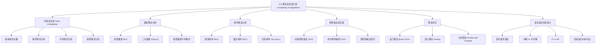

**相关笔记：** [[3.1 算法]] | [[3.2 函数的增长]]

> [!abstract] 概览
> 本节介绍了==算法复杂度分析==的基本方法，以==时间复杂度（time complexity）==为核心，系统分析了搜索算法、排序算法和矩阵乘法的效率。讨论了==最坏情况（worst-case）==、==最好情况（best-case）==和==平均情况（average-case）==三种分析视角，并引入了==可解性（solvable）==、==可 tractable（tractable）==和==不可解（unsolvable）==等计算复杂性理论的基本概念。
>
> - ==时间复杂度==用算法执行的基本操作次数来度量，而非实际运行时间
> - ==线性搜索==最坏情况 $\Theta(n)$，==二分搜索==最坏情况 $\Theta(\log n)$
> - ==冒泡排序==和==插入排序==最坏情况均为 $\Theta(n^2)$
> - 最有效的排序算法（如归并排序）可达 $O(n\log n)$
> - 矩阵乘法的朴素算法复杂度为 $O(n^3)$
> - ==可解问题==有算法能解决；==易解问题==有多项式时间算法；==不可解问题==（如停机问题）无任何算法能解决

---

## 一、知识结构总览



---

## 二、核心思想

> [!tip] 核心思想
> 本节的核心思想是==算法复杂度分析==：通过计算算法在输入规模为 $n$ 时所需的基本操作次数，而非依赖特定硬件的实际运行时间，来度量算法的效率。复杂度分析使我们能够在==最坏情况==、==平均情况==和==最好情况==三种视角下评估算法性能，并据此选择适合问题规模和约束的算法。结合大O、大$\Omega$、大$\Theta$ 等渐近记号，复杂度分析为算法的比较和选择提供了统一的理论框架。

### 1. 时间复杂度的基本概念

> [!def] 时间复杂度（Time Complexity）
> 算法的==时间复杂度==用算法在输入规模为 $n$ 时所使用的==基本操作次数==来度量。
>
> - 基本操作可以是：整数比较、加法、乘法、除法等
> - 使用操作次数而非实际时间的原因：
>   - 不同计算机执行同一操作的时间不同（超级计算机 vs 个人电脑可能差 1000 倍）
>   - 不同操作（加法 vs 乘法）的执行时间也不同
> - ==空间复杂度（space complexity）==：算法所需的计算机内存量（本节不深入讨论）

> [!def] 三种分析视角
> | 类型 | 定义 | 用途 |
> |------|------|------|
> | ==最坏情况（worst-case）== | 对给定规模 $n$ 的所有输入，算法所需的最大操作数 | 保证算法一定能完成 |
> | ==平均情况（average-case）== | 对给定规模 $n$ 的所有可能输入，算法所需的平均操作数 | 评估算法的典型性能 |
> | ==最好情况（best-case）== | 对给定规模 $n$ 的所有输入，算法所需的最小操作数 | 了解算法的最优表现 |

### 2. 搜索算法的复杂度分析

> [!def] 求最大值算法的复杂度
> 在 $n$ 个元素中找最大值（Algorithm 1 of Section 3.1）：
> - 对第 2 到第 $n$ 个元素，每次需要 2 次比较（$i \leq n$ 和 $\max < a_i$）
> - 最后一次循环退出需要 1 次比较
> - 总计：$2(n-1) + 1 = 2n - 1$ 次比较
> - 时间复杂度：$\Theta(n)$（与具体输入无关）

> [!def] 线性搜索（Linear Search）的复杂度
> 在 $n$ 个元素的列表中搜索元素 $x$（Algorithm 2 of Section 3.1）：
> - 若 $x = a_i$，需要 $2i + 1$ 次比较
> - ==最坏情况==（$x$ 不在列表中）：$2n + 2$ 次比较 $\Rightarrow$ $\Theta(n)$
> - ==平均情况==（$x$ 在列表中且等概率出现在任何位置）：
>
> $$\frac{3 + 5 + 7 + \cdots + (2n+1)}{n} = \frac{2 \cdot \frac{n(n+1)}{2} + n}{n} = n + 2$$
>
> 故平均情况也是 $\Theta(n)$。

> [!def] 二分搜索（Binary Search）的复杂度
> 在 $n = 2^k$ 个有序元素的列表中搜索 $x$（Algorithm 3 of Section 3.1）：
> - 每次迭代将搜索范围减半，使用 2 次比较
> - 从 $2^k$ 个元素 $\to$ $2^{k-1}$ 个 $\to$ $\cdots$ $\to$ $2$ 个 $\to$ $1$ 个
> - 总比较次数：$2k + 2 = 2\log n + 2$
> - ==最坏情况复杂度==：$O(\log n)$（更精确地，$\Theta(\log n)$）
> - 二分搜索比线性搜索高效得多：$\log n \ll n$

### 3. 排序算法的复杂度分析

> [!def] 冒泡排序（Bubble Sort）的复杂度
> 冒泡排序通过多趟扫描，每趟将相邻元素中较大的向后交换：
> - 第 1 趟：$n - 1$ 次比较
> - 第 2 趟：$n - 2$ 次比较
> - $\cdots$
> - 第 $n - 1$ 趟：$1$ 次比较
> - 总比较次数：
>
> $$(n-1) + (n-2) + \cdots + 1 = \frac{(n-1)n}{2}$$
>
> - 冒泡排序==始终==使用这么多比较（即使列表已有序），最坏情况复杂度：$\Theta(n^2)$

> [!def] 插入排序（Insertion Sort）的复杂度
> 插入排序在第 $j$ 步将第 $j$ 个元素插入到前 $j-1$ 个已排序元素的正确位置：
> - 最坏情况（第 $j$ 个元素需要与前面所有 $j-1$ 个元素比较）：$j$ 次比较
> - 总比较次数：
>
> $$2 + 3 + \cdots + n = \frac{n(n+1)}{2} - 1$$
>
> - ==最坏情况复杂度==：$\Theta(n^2)$
> - ==最好情况==（列表已有序）：每步只需 1 次比较，总计 $n - 1$ 次 $\Rightarrow$ $O(n)$
> - 插入排序在"几乎有序"的列表上表现很好

> [!tip] 高效排序算法
> 最有效的排序算法可以在 $O(n\log n)$ 时间内排序 $n$ 个元素，例如：
> - ==归并排序（Merge Sort）==：使用分治策略，将在第 8 章和第 11 章详细介绍
> - ==快速排序（Quick Sort）==：平均 $O(n\log n)$，最坏 $O(n^2)$
> - $O(n\log n)$ 是基于比较的排序算法的理论下界

### 4. 矩阵乘法的复杂度

> [!def] 朴素矩阵乘法（Algorithm 1）
> 计算 $m \times k$ 矩阵 $A$ 与 $k \times n$ 矩阵 $B$ 的乘积：
> - 乘积有 $m \times n$ 个元素
> - 每个元素需要 $k$ 次乘法和 $k - 1$ 次加法
> - 对于两个 $n \times n$ 矩阵：$n^3$ 次乘法和 $n^2(n-1)$ 次加法
> - 总复杂度：$O(n^3)$

> [!def] 布尔矩阵乘积（Algorithm 2）
> 两个 $n \times n$ 的 0-1 矩阵的布尔积：
> - 每个元素需要 $n$ 次 AND 和 $n$ 次 OR
> - 每个元素共 $2n$ 次位运算
> - 总计：$2n^3$ 次位运算

> [!example] 矩阵链乘法的优化
> 矩阵乘法满足结合律，不同的乘法顺序影响总乘法次数：
> - $A_1$（$30 \times 20$）、$A_2$（$20 \times 40$）、$A_3$（$40 \times 10$）
> - 方案一 $(A_1 A_2)A_3$：$30 \times 20 \times 40 + 30 \times 40 \times 10 = 24000 + 12000 = 36000$
> - 方案二 $A_1(A_2 A_3)$：$20 \times 40 \times 10 + 30 \times 20 \times 10 = 8000 + 6000 = 14000$
> - 方案二节省了 22000 次乘法！

### 5. 算法范式与蛮力算法

> [!def] 蛮力算法（Brute Force）
> ==蛮力算法==是最直接的算法设计方法，基于问题的陈述和定义来解决问题，不考虑计算资源的限制。
>
> - 特点：检查所有可能的解，寻找最优
> - 优点：简单直接，对小规模输入实用
> - 缺点：对大规模输入效率极低
> - 例子：
>   - 求最大值：逐一比较所有元素
>   - 朴素字符串匹配：逐一检查所有位置
>   - 最近点对：计算所有点对的距离（$O(n^2)$），而最优算法可达 $O(n\log n)$

### 6. 复杂度的实际意义

> [!def] 复杂度术语表
> | 复杂度 | 术语 | 典型算法 |
> |--------|------|---------|
> | $\Theta(1)$ | ==常数复杂度== | 取列表前 100 个元素的最大值 |
> | $\Theta(\log n)$ | ==对数复杂度== | 二分搜索 |
> | $\Theta(n)$ | ==线性复杂度== | 线性搜索 |
> | $\Theta(n\log n)$ | ==线性对数复杂度== | 归并排序 |
> | $\Theta(n^b)$ | ==多项式复杂度== | 冒泡排序（$b=2$） |
> | $\Theta(b^n)$, $b > 1$ | ==指数复杂度== | 可满足性问题的穷举搜索 |
> | $\Theta(n!)$ | ==阶乘复杂度== | 旅行商问题的穷举 |

> [!def] 可解性分类
> - ==可解问题（solvable）==：存在算法能解决
> - ==不可解问题（unsolvable）==：不存在任何算法能解决（如==停机问题==，由 Alan Turing 证明）
> - ==易解问题（tractable）==：存在==多项式时间==算法能解决（属于类 ==P==）
> - ==难解问题（intractable）==：不存在多项式时间算法（或尚未发现）
> - ==NP 问题==：解可以在多项式时间内==验证==
> - ==NP 完全问题（NP-complete）==：NP 中"最难"的问题，若任一 NP 完全问题有多项式时间算法，则所有 NP 问题都有

> [!def] P vs NP
> ==P vs NP 问题==是计算机科学最著名的未解问题之一，也是千禧年七大数学难题之一（奖金 100 万美元）。
>
> - **P**：可以在多项式时间内==求解==的问题类
> - **NP**：可以在多项式时间内==验证==解的问题类
> - 显然 $P \subseteq NP$，但 $P = NP$ 是否成立尚无定论
> - 大多数理论计算机科学家相信 $P \neq NP$
> - ==Cook-Levin 定理==（1970s）：可满足性问题（SAT）是第一个被证明为 NP 完全的问题

---

## 三、补充理解与易混淆点

### 补充理解

> [!info] 补充1：为什么平均情况分析往往困难
> 平均情况分析需要对输入的概率分布做出明确假设，而实际输入分布往往未知或难以精确建模（Knuth, 1997）。例如，快速排序的平均复杂度 $O(n \log n)$ 建立在"所有排列等概率"的假设之上，但实际数据可能呈现特定的偏序模式，导致性能偏离理论预期（Sedgewick, 1998）。
>
> 为应对这一困难，算法设计领域发展了多种替代分析方法。**随机化算法**（randomized algorithms）通过在算法执行过程中引入随机选择，使得即使面对恶意构造的最坏输入，期望运行时间也能得到保证——随机化快速排序就是典型例子（Motwani & Raghavan, 1995）。**摊还分析**（amortized analysis）则从另一角度出发：不要求单次操作的最坏情况，而是证明一系列 $n$ 次操作的总代价的上界，从而得到每次操作的"平均"代价——动态数组的扩容策略是经典应用案例（Tarjan, 1985）。这两种方法都避免了传统平均情况分析对输入分布的依赖，使分析结果更具鲁棒性。
>
> - [Algorithm Visualizer](https://algorithm-visualizer.seancoughlin.me/) -- 算法可视化，可对比不同输入下的运行时间
> - [Oakland Algorithm Visualizations](https://www.secs.oakland.edu/~tianlema/3610/03_Tools/AlgorithmVisualizations/index.html) -- 排序算法性能对比
> 来源：Knuth, D. E. (1997). *The Art of Computer Programming, Vol. 3: Sorting and Searching* (2nd ed.), Addison-Wesley, Section 5.2.2.
> 来源：Cormen, T. H., et al. (2009). *Introduction to Algorithms* (3rd ed.), MIT Press, Chapter 12.

> [!info] 补充2：实际编程中的性能优化策略
> 理解算法复杂度是性能优化的基础，但实际工程中的优化遵循明确的优先级层次：**算法选择 > 数据结构选择 > 常数级优化 > 微优化**（Aho et al., 1986）。选择正确的算法可以将运行时间从数天缩短到数秒，而底层微优化通常只能带来常数倍的提升。
>
> 在算法与数据结构之上，**缓存友好性**（cache friendliness）是现代计算环境中不可忽视的因素。分块矩阵乘法（cache-oblivious algorithm, Frigo et al., 1999）通过递归分块使数据访问模式适应 CPU 缓存层次，可比朴素的逐元素实现快 4-8 倍。此外，实际工程中需要在时间、空间和代码可维护性之间做出权衡——正如 Knuth（1974）的名言："过早优化是万恶之源"（"We should forget about small efficiencies, say about 97% of the time: premature optimization is the root of all evil"）。正确的做法是先用清晰的代码实现正确算法，再通过 **profiling 工具**（如 Python 的 `cProfile`、C++ 的 `perf`、Java 的 VisualVM）定位实际瓶颈，针对热点进行有依据的优化。
>
> - [DSA Visualizer](https://visualizedsa.com/) -- 交互式算法性能分析
> - [Big O Notation Tutorial](https://www.phpcluster.com/big-o-notation-tutorial/) -- 复杂度分析实用指南
> 来源：Aho, A. V., Hopcroft, J. E. & Ullman, J. D. (1974). *The Design and Analysis of Computer Algorithms*. Addison-Wesley.
> 来源：Knuth, D. E. (1968). *The Art of Computer Programming, Vol. 1: Fundamental Algorithms*. Addison-Wesley, Section 1.3.

### 易混淆点

> [!warning] 误区：时间复杂度与空间复杂度
> - ❌ 混淆时间复杂度和空间复杂度，认为 $O(n)$ 的算法在所有方面都是 $O(n)$
> - ✅ 时间复杂度和空间复杂度是两个==独立的==度量维度：
>   - ==时间复杂度==：算法执行所需的操作次数（或时间）
>   - ==空间复杂度==：算法执行所需的内存空间
> - 一个算法可能时间复杂度优秀但空间复杂度差，反之亦然
> - 例如：归并排序时间 $O(n\log n)$ 但需要 $O(n)$ 额外空间；原地排序（如堆排序）空间 $O(1)$ 但实现更复杂
> - ==时空权衡（time-space tradeoff）==是算法设计中的常见主题

> [!warning] 误区：最坏情况与平均情况的区别
> - ❌ 认为最坏情况就是"通常情况"，或认为平均情况一定比最坏情况好很多
> - ✅ 两者的区别：
>   - ==最坏情况==：对所有输入的==上界保证==，无论输入如何，算法的操作数不会超过此值
>   - ==平均情况==：对所有输入的==期望值==，需要概率分布假设
> - 有时两者相同：冒泡排序的最坏情况和平均情况都是 $\Theta(n^2)$
> - 有时差距巨大：快速排序最坏 $O(n^2)$，平均 $O(n\log n)$
> - ⚠️ 平均情况依赖概率假设，若假设不成立，实际表现可能与分析不符
> - 在安全关键系统（如医疗、航空）中，必须使用最坏情况分析

---

## 四、习题精选

> [!todo] 习题概览
> | 题号范围 | 核心考点 | 难度 |
> |---------|---------|------|
> | 1-4 | 给定代码段的大O估计 | ⭐ |
> | 5-6 | 求最小自然数算法的比较次数 | ⭐⭐ |
> | 7 | 线性搜索 vs 二分搜索的实际选择 | ⭐ |
> | 8 | 快速幂算法的乘法次数 | ⭐⭐ |
> | 9-10 | 位串中 1 的计数算法 | ⭐⭐ |
> | 11-12 | 暴力算法的大O估计 | ⭐⭐ |
> | 13-14 | 多项式求值（常规法 vs Horner 法） | ⭐⭐ |
> | 15-17 | 给定时间内可解决的最大 $n$ | ⭐⭐ |
> | 18-19 | 给定 $n$ 的实际运行时间计算 | ⭐ |
> | 20-21 | 输入规模加倍时的时间变化 | ⭐⭐ |
> | 22-23 | 最好情况与平均情况分析 | ⭐⭐⭐ |
> | 24 | 最优算法的概念 | ⭐⭐ |
> | 25-31 | 各种搜索算法的复杂度分析 | ⭐⭐⭐ |
> | 32-34 | 排序与字符串算法的复杂度 | ⭐⭐⭐ |
> | 35-37 | 二分插入排序与字符串匹配 | ⭐⭐⭐ |
> | 38-40 | 暴力算法的复杂度估计 | ⭐⭐ |
> | 41-42 | 调度问题的复杂度 | ⭐⭐⭐ |
> | 43-44 | 搜索/排序算法输入加倍时的比较次数变化 | ⭐⭐ |
> | 45-49 | 矩阵乘法优化（上三角矩阵、矩阵链乘法） | ⭐⭐⭐ |

### 题1：线性搜索的复杂度分析

> [!problem] 题目
> 分析线性搜索算法在 $n$ 个元素的列表中搜索元素 $x$ 的时间复杂度：
> （1）最坏情况下需要多少次比较？
> （2）若 $x$ 在列表中且等概率出现在任何位置，平均需要多少次比较？

> [!faq]- 解答
> **（1）最坏情况**：$x$ 不在列表中，需要遍历所有 $n$ 个元素，每次循环执行 2 次比较（$i \leq n$ 和 $x \neq a_i$），最后一次循环退出还需 1 次比较。
>
> 总比较次数：$2n + 1$，时间复杂度为 $\Theta(n)$。
>
> **（2）平均情况**：$x = a_i$ 时需要 $2i + 1$ 次比较（$i-1$ 次不匹配各 2 次，加上最后一次匹配 2 次和循环条件 1 次）。
>
> $$\text{平均比较次数} = \frac{1}{n}\sum_{i=1}^{n}(2i+1) = \frac{1}{n}\left(2 \cdot \frac{n(n+1)}{2} + n\right) = \frac{n(n+1) + n}{n} = n + 2$$
>
> 因此平均情况时间复杂度也是 $\Theta(n)$。
>
> $\blacksquare$

### 题2：嵌套循环的时间复杂度分析

> [!problem] 题目
> 分析以下代码片段的时间复杂度：
> ```
> for i from 1 to n:
>     for j from 1 to n:
>         print(i + j)
> ```

> [!faq]- 解答
> **逐步分析**：
>
> - 外层循环 `for i from 1 to n` 执行 $n$ 次
> - 对于外层循环的每一次迭代，内层循环 `for j from 1 to n` 执行 $n$ 次
> - 内层循环体 `print(i + j)` 执行 1 次基本操作（加法 + 输出）
>
> **总操作次数**：
>
> $$\sum_{i=1}^{n}\sum_{j=1}^{n} 1 = \sum_{i=1}^{n} n = n \cdot n = n^2$$
>
> 因此时间复杂度为 $O(n^2)$，更精确地 $\Theta(n^2)$。
>
> **直观理解**：外层循环 $n$ 次，每次内层循环 $n$ 次，总共执行 $n \times n = n^2$ 次。这是嵌套循环的典型模式——每层循环贡献一个 $n$ 的因子。
>
> $\blacksquare$

### 题3：二分搜索的三种情况复杂度

> [!problem] 题目
> 分析二分搜索算法在 $n$ 个有序元素的列表中搜索元素 $x$ 的：
> （1）最好情况时间复杂度
> （2）最坏情况时间复杂度
> （3）平均情况时间复杂度

> [!faq]- 解答
> **（1）最好情况**：
>
> 目标元素恰好位于中间位置，第一次比较就命中。
>
> 比较次数：$1$ 次（$x = a_{\lfloor(n+1)/2\rfloor}$）
>
> 最好情况时间复杂度：$O(1)$
>
> **（2）最坏情况**：
>
> 目标元素不在列表中，或位于搜索区间的端点处，需要将搜索区间不断减半直到区间为空。
>
> 每次迭代将区间从 $n$ 减半为 $\lfloor n/2 \rfloor$，最多迭代 $\lceil \log_2 n \rceil$ 次。每次迭代执行 2 次比较。
>
> 总比较次数：$2\lceil \log_2 n \rceil + 1$
>
> 最坏情况时间复杂度：$O(\log n)$，更精确地 $\Theta(\log n)$
>
> **（3）平均情况**：
>
> 假设 $x$ 在列表中且等概率出现在任何位置。二分搜索的搜索过程对应一棵二叉搜索树，平均查找深度为 $O(\log n)$。
>
> 更精确地，对于 $n = 2^k - 1$ 个元素（完全二叉搜索树），平均比较次数为：
>
> $$\frac{1}{n}\sum_{i=1}^{k} i \cdot 2^{i-1}$$
>
> 利用等比数列求和公式可化简为：
>
> $$\frac{(k-1) \cdot 2^k + 1}{n} = \frac{(k-1)(n+1) + 1}{n} \approx \log_2 n$$
>
> 平均情况时间复杂度：$O(\log n)$
>
> **总结**：
>
> | 情况 | 比较次数 | 时间复杂度 |
> |------|---------|-----------|
> | 最好 | $1$ | $O(1)$ |
> | 最坏 | $2\lceil \log_2 n \rceil + 1$ | $O(\log n)$ |
> | 平均 | $\approx \log_2 n$ | $O(\log n)$ |
>
> $\blacksquare$

### 题4：用主定理分析归并排序递推关系

> [!problem] 题目
> 分析以下递归算法的时间复杂度：
> $$T(n) = 2T(n/2) + n, \quad T(1) = 1$$
> 这是归并排序的递推关系。请用主定理（Master Theorem）求解。

> [!faq]- 解答
> **主定理（Master Theorem）**：
>
> 对于递推关系 $T(n) = aT(n/b) + f(n)$，其中 $a \geq 1$，$b > 1$：
>
> 设 $c = \log_b a$，则：
> - **情况1**：若 $f(n) = O(n^c - \epsilon)$（$\epsilon > 0$），则 $T(n) = \Theta(n^c)$
> - **情况2**：若 $f(n) = \Theta(n^c \log^k n)$（$k \geq 0$），则 $T(n) = \Theta(n^c \log^{k+1} n)$
> - **情况3**：若 $f(n) = \Omega(n^c + \epsilon)$（$\epsilon > 0$），则 $T(n) = \Theta(f(n))$
>
> **应用到本题**：
>
> - $a = 2$（两个子问题）
> - $b = 2$（每个子问题规模为 $n/2$）
> - $f(n) = n$
>
> 计算 $c = \log_b a = \log_2 2 = 1$，故 $n^c = n^1 = n$。
>
> 判断属于哪种情况：
> - $f(n) = n = \Theta(n^1) = \Theta(n^c \log^0 n)$
>
> 这属于**情况2**（$k = 0$），因此：
>
> $$T(n) = \Theta(n^c \log^{k+1} n) = \Theta(n \log n)$$
>
> **验证（展开法）**：
>
> $$T(n) = 2T(n/2) + n$$
> $$= 2[2T(n/4) + n/2] + n = 4T(n/4) + 2n$$
> $$= 4[2T(n/8) + n/4] + 2n = 8T(n/8) + 3n$$
> $$\vdots$$
> $$= 2^k T(n/2^k) + kn$$
>
> 当 $n/2^k = 1$，即 $k = \log_2 n$ 时：
> $$T(n) = 2^{\log_2 n} \cdot T(1) + n \log_2 n = n + n \log_2 n = \Theta(n \log n)$$
>
> 两种方法结果一致：$T(n) = \Theta(n \log n)$。
>
> $\blacksquare$

### 题5：Strassen 矩阵乘法的复杂度分析

> [!problem] 题目
> 分析 Strassen 矩阵乘法的时间复杂度：
> $$T(n) = 7T(n/2) + O(n^2)$$
> （1）用主定理证明其时间复杂度为 $O(n^{\log_2 7}) \approx O(n^{2.81})$。
> （2）将 Strassen 算法与朴素矩阵乘法 $O(n^3)$ 进行对比分析。

> [!faq]- 解答
> **（1）用主定理求解**：
>
> 递推关系 $T(n) = 7T(n/2) + O(n^2)$ 中：
> - $a = 7$（Strassen 将两个 $n \times n$ 矩阵的乘法分解为 7 个 $(n/2) \times (n/2)$ 矩阵的乘法）
> - $b = 2$（每个子问题规模为 $n/2$）
> - $f(n) = O(n^2)$（合并步骤涉及矩阵加法，复杂度为 $O(n^2)$）
>
> 计算 $c = \log_b a = \log_2 7$：
>
> $$\log_2 7 \approx 2.8074$$
>
> 因此 $n^c = n^{\log_2 7} \approx n^{2.81}$。
>
> 判断属于哪种情况：
> - $f(n) = O(n^2)$
> - $n^c = n^{\log_2 7} \approx n^{2.81}$
> - 因为 $2 < \log_2 7 \approx 2.81$，所以 $f(n) = O(n^2) = O(n^{2.81 - \epsilon})$，其中 $\epsilon = \log_2 7 - 2 \approx 0.81 > 0$
>
> 这属于**情况1**（$f(n)$ 多项式地小于 $n^c$），因此：
>
> $$T(n) = \Theta(n^c) = \Theta(n^{\log_2 7}) \approx \Theta(n^{2.81})$$
>
> **（2）与朴素算法的对比**：
>
> | 特征 | 朴素矩阵乘法 | Strassen 矩阵乘法 |
> |------|-------------|-------------------|
> | 递推关系 | $T(n) = 8T(n/2) + O(n^2)$ | $T(n) = 7T(n/2) + O(n^2)$ |
> | 时间复杂度 | $\Theta(n^3)$ | $\Theta(n^{2.81})$ |
> | 子问题数 | 8 | 7 |
> | 每次乘法数 | 8 | 7 |
> | 加法次数 | $O(n^2)$ | $O(n^2)$（但常数更大） |
> | 数值稳定性 | 好 | 较差（浮点误差累积） |
> | 实际适用性 | 通用 | $n$ 较大时优势明显 |
>
> **关键洞察**：
>
> Strassen 算法的核心创新是将 8 次子矩阵乘法减少为 7 次，通过巧妙地构造 7 个中间矩阵（$M_1, M_2, \ldots, M_7$），每个中间矩阵只需 1 次乘法和若干次加法。虽然增加了加法操作的常数因子，但乘法次数从 8 减少到 7 带来了渐近复杂度的实质性降低：
>
> $$n^3 \text{ vs } n^{\log_2 7} \approx n^{2.81}$$
>
> 当 $n$ 很大时，差距显著。例如 $n = 1024$：
> - 朴素算法：$1024^3 \approx 1.07 \times 10^9$ 次乘法
> - Strassen：$1024^{2.81} \approx 2.84 \times 10^8$ 次乘法，约为朴素算法的 $26.5\%$
>
> 但需注意：Strassen 算法的实际加速受限于（1）加法的常数开销较大，（2）当 $n$ 较小时递归开销超过收益（通常在 $n < 64$ 时切换回朴素算法），（3）数值稳定性不如朴素算法。
>
> $\blacksquare$

> [!tip] 解题思路提示
> 算法复杂度分析习题的解题方法论：
> 1. **嵌套循环分析**：从内到外逐层分析，外层循环次数乘以内层循环次数；$k$ 层嵌套循环通常为 $O(n^k)$
> 2. **三种情况分析**：最好情况（最乐观的输入）、最坏情况（最不利的输入）、平均情况（所有输入的期望值，需要概率假设）
> 3. **主定理应用**：先识别 $a$（子问题数）、$b$（缩小因子）、$f(n)$（合并代价），再计算 $c = \log_b a$，最后判断属于三种情况中的哪一种
> 4. **展开法验证**：将递推关系展开若干层，寻找规律（等比数列），适用于验证主定理的结果或处理主定理不直接适用的情况
> 5. **算法对比**：关注时间复杂度的渐近阶、常数因子、实际适用条件（如数据规模、数值稳定性）

---

## 五、视频学习指南

> [!info] 视频资源
> | 资源 | 链接 | 对应内容 | 备注 |
> |:-----|:-----|:---------|:-----|
> | Rosen 8e Section 3.3 | [教材原文](https://www.mheducation.com/highered/product/discrete-mathematics-applications-rosen/M9781259676512.html) | 完整分析过程与例题 | 英文教材 |
> | MIT 6.006 Introduction to Algorithms | [YouTube](https://www.youtube.com/watch?v=HtSuA80QTyo) | 排序与搜索复杂度 | 英文，MIT开放课程 |
> | Visualgo (visualgo.net) | [链接](https://visualgo.net/en/sorting) | 排序算法可视化动画 | 直观感受不同算法的效率差异 |

---

## 六、教材原文

> [!quote] 教材原文
> "The time complexity of an algorithm can be expressed in terms of the number of operations used by the algorithm when the input has a particular size. The operations used to measure time complexity can be the comparison of integers, the addition of integers, the multiplication of integers, the division of integers, or any other basic operation."
>
> "A problem that is solvable using an algorithm with polynomial (or better) worst-case complexity is called tractable... A problem that cannot be solved using an algorithm with worst-case polynomial time complexity is called intractable."
>
> "The P versus NP problem asks whether NP, the class of problems for which it is possible to check solutions in polynomial time, equals P, the class of tractable problems. This is one of the most famous unsolved problems in the mathematical sciences. It is one of the seven famous Millennium Prize Problems. A prize of $1,000,000 is offered by the Clay Mathematics Institute for its solution."

---

## 参见 Wiki

- [[离散数学/concepts/算法复杂度]] -- 复杂度分析方法
- [[离散数学/concepts/算法复杂度|排序算法复杂度]] -- 常见排序算法复杂度对比
- [[离散数学/concepts/大O记号]] -- 大O记号在复杂度分析中的应用
- [[离散数学/concepts/算法复杂度|时间复杂度]] -- 时间复杂度的定义与度量
- [[离散数学/concepts/算法复杂度|空间复杂度]] -- 空间复杂度
- [[离散数学/concepts/算法复杂度|最坏情况分析]] -- 最坏情况分析
- [[离散数学/concepts/算法复杂度|平均情况分析]] -- 平均情况分析
- [[离散数学/concepts/算法复杂度|冒泡排序]] -- 冒泡排序的复杂度分析
- [[离散数学/concepts/算法复杂度|插入排序]] -- 插入排序的复杂度分析
- [[离散数学/concepts/算法复杂度|归并排序]] -- 归并排序的复杂度分析
- [[离散数学/concepts/算法复杂度|NP完全]] -- NP 完全问题与 P vs NP

#学习/离散数学/算法
