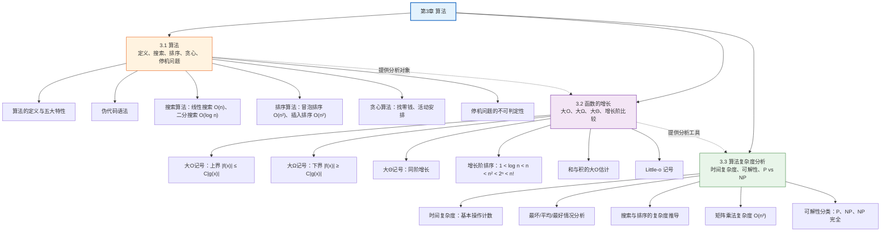

# 第03章 算法 — 章节汇总

> [!abstract] 概览
> 第3章系统介绍==算法==的核心概念与分析方法：从算法的定义与特性出发（3.1），学习经典搜索算法（线性搜索、二分搜索）、排序算法（冒泡排序、插入排序）、贪心算法与停机问题；然后建立==渐近记号==体系——大O、大$\Omega$、大$\Theta$（3.2），为算法效率提供数学描述工具；最后将这些工具应用于算法的==复杂度分析==（3.3），涵盖最坏情况、平均情况与最好情况三种分析视角，并引入可解性、易解性与 P vs NP 等计算复杂性理论的基本概念。

---

## 全章知识框架



---

## 各节核心知识点汇总

### 3.1 算法

- **算法**（algorithm）：用于执行计算或求解问题的==有限精确指令序列==
- 五大特性：输入、输出、确定性、正确性、有限性、有效性、通用性
- ==伪代码==（pseudocode）：介于自然语言和编程语言之间的中间表示，数组下标从 1 开始
- ==线性搜索==（linear search）：适用于任意列表，最坏 $O(n)$
- ==二分搜索==（binary search）：要求列表有序，最坏 $O(\log n)$，核心思想是反复将搜索区间减半
- ==冒泡排序==（bubble sort）：相邻元素比较交换，$\Theta(n^2)$ 次比较
- ==插入排序==（insertion sort）：将元素插入已排序部分的正确位置，最坏 $\Theta(n^2)$，最好 $O(n)$
- ==贪心算法==（greedy algorithm）：每步做局部最优选择，最优性需证明（如收银员算法可证最优，但缺少 nickel 时反例不最优）
- ==停机问题==（halting problem）：Turing（1936）用对角线论证证明不可判定

### 3.2 函数的增长

- ==大O记号== $f(x) = O(g(x))$：$|f(x)| \leq C|g(x)|$，提供增长==上界==
- ==大$\Omega$记号== $f(x) = \Omega(g(x))$：$|f(x)| \geq C|g(x)|$，提供增长==下界==
- ==大$\Theta$记号== $f(x) = \Theta(g(x))$：同时满足 $O$ 和 $\Omega$，表示==同阶增长==
- 多项式 $a_n x^n + \cdots + a_0$ 的阶由==最高次项==决定：$\Theta(x^n)$
- 增长阶排序：$1 < \log n < \sqrt{n} < n < n\log n < n^2 < n^3 < 2^n < n!$
- 和的大O估计：$(f_1 + f_2)(x) = O(\max(|g_1|, |g_2|))$
- 积的大O估计：$(f_1 \cdot f_2)(x) = O(g_1(x) \cdot g_2(x))$
- ==Little-o 记号==：$\lim f(x)/g(x) = 0$，表示严格小于的渐近关系

### 3.3 算法复杂度分析

- ==时间复杂度==用基本操作次数度量，而非实际运行时间
- 三种分析视角：==最坏情况==（上界保证）、==平均情况==（期望性能，需概率假设）、==最好情况==（最优表现）
- 线性搜索：最坏 $\Theta(n)$，平均 $\Theta(n)$
- 二分搜索：最坏 $\Theta(\log n)$
- 冒泡排序：始终 $\Theta(n^2)$ 次比较
- 插入排序：最坏 $\Theta(n^2)$，最好 $O(n)$（已有序）
- 高效排序（如归并排序）可达 $O(n\log n)$，这是基于比较排序的理论下界
- 朴素矩阵乘法：$O(n^3)$；布尔矩阵乘积：$O(n^3)$
- ==可解性分类==：可解 vs 不可解（停机问题）、易解（多项式时间，类 P）vs 难解
- ==P vs NP==：千禧年七大难题之一，$P \subseteq NP$，$P = NP$ 尚无定论
- ==NP 完全问题==：NP 中最难的问题，Cook-Levin 定理证明 SAT 是首个 NP 完全问题

---

## 学习脉络

```
算法基础（3.1）— 什么是算法、如何描述算法
  ↓
经典算法实例 — 搜索、排序、贪心、字符串匹配
  ↓
函数的增长（3.2）— 如何用数学语言描述算法效率
  ↓
渐近记号体系 — 大O（上界）、大Ω（下界）、大Θ（精确阶）
  ↓
算法复杂度分析（3.3）— 将渐近记号应用于具体算法
  ↓
可解性理论 — P、NP、NP 完全、停机问题
```

**学习建议**：3.1 节侧重"算法是什么"——理解定义、掌握伪代码、能追踪算法执行过程；3.2 节侧重"如何度量效率"——掌握三种渐近记号的定义与证明方法；3.3 节侧重"如何分析复杂度"——将 3.2 的工具应用于 3.1 的算法，完成从"会描述算法"到"会分析算法"的闭环。

---

## 跨章关联

| 关联章节 | 关联内容 | 关联方式 |
|:---------|:---------|:---------|
| 第2章 函数 | 函数概念→算法复杂度的数学基础 | 直接应用 |
| 第2章 序列与求和 | 求和公式→复杂度推导中的求和计算 | 工具支撑 |
| 第2章 矩阵 | 矩阵乘法→矩阵乘法复杂度分析 | 直接应用 |
| 第4章 数论 | 欧几里得算法→算法实例与复杂度分析 | 深化 |
| 第5章 归纳与递归 | 数学归纳法→贪心算法最优性证明、递归算法分析 | 深化 |
| 第6章 计数 | 排列组合→平均情况分析中的概率计算 | 工具支撑 |
| 第8章/第11章 高级算法 | 分治策略→归并排序 $O(n\log n)$ 分析 | 前置基础 |

---

## 综合复习题

> [!faq]- 综合复习题 1
> **题目：** 对一个有 $n = 10^6$ 个元素的有序列表，分别用线性搜索和二分搜索查找一个不存在的元素。在最坏情况下，各需要多少次比较？若使用每秒 $10^9$ 次比较的计算机，各需多长时间？
>
> **解答：**
>
> **线性搜索**：最坏情况需要遍历整个列表，比较次数为 $2n + 2 = 2 \times 10^6 + 2 \approx 2 \times 10^6$ 次。
>
> 所需时间：$\frac{2 \times 10^6}{10^9} = 2 \times 10^{-3}$ 秒 = 2 毫秒。
>
> **二分搜索**：最坏情况比较次数为 $2\lfloor \log_2 n \rfloor + 2 \approx 2 \times 20 + 2 = 42$ 次。
>
> 所需时间：$\frac{42}{10^9} = 4.2 \times 10^{-8}$ 秒 = 42 纳秒。
>
> 二分搜索比线性搜索快约 $\frac{2 \times 10^6}{42} \approx 47619$ 倍，体现了 $O(\log n)$ 与 $O(n)$ 的巨大差距。

> [!faq]- 综合复习题 2
> **题目：** 证明 $f(n) = n^3 + 2n^2 + 5n + 1$ 是 $\Theta(n^3)$，并说明为什么它也是 $O(n^4)$ 但不是 $O(n^2)$。
>
> **解答：**
>
> **证明 $\Theta(n^3)$**：
>
> - **上界**（$O(n^3)$）：当 $n > 1$ 时，$n^3 + 2n^2 + 5n + 1 \leq n^3 + 2n^3 + 5n^3 + n^3 = 9n^3$，取 $C_2 = 9$，$k = 1$。
> - **下界**（$\Omega(n^3)$）：当 $n > 1$ 时，$n^3 + 2n^2 + 5n + 1 \geq n^3$，取 $C_1 = 1$，$k = 1$。
> - 因此 $f(n) = \Theta(n^3)$。$\blacksquare$
>
> **$O(n^4)$ 成立**：因为 $n^3 = O(n^4)$（取 $C = 1$，$k = 1$），而 $f(n) = \Theta(n^3)$ 蕴含 $f(n) = O(n^3) = O(n^4)$。
>
> **$O(n^2)$ 不成立**：反证法，假设 $n^3 + 2n^2 + 5n + 1 \leq Cn^2$ 对所有 $n > k$ 成立。两边除以 $n^2$ 得 $n + 2 + 5/n + 1/n^2 \leq C$，即 $n \leq C - 2 - 5/n - 1/n^2$。但 $n$ 可以任意大，矛盾。

> [!faq]- 综合复习题 3
> **题目：** 冒泡排序和插入排序的最坏情况时间复杂度都是 $\Theta(n^2)$。如果一个列表"几乎有序"（只有少量元素不在正确位置），哪种算法更高效？为什么？
>
> **解答：**
>
> **插入排序更高效**。
>
> - **冒泡排序**始终执行 $\frac{(n-1)n}{2}$ 次比较，与输入数据的初始排列无关。即使列表已经完全有序，冒泡排序仍需 $\Theta(n^2)$ 次比较（除非添加提前终止的优化标志）。
> - **插入排序**在最好情况（已有序）下只需 $n - 1$ 次比较，即 $O(n)$。对于"几乎有序"的列表，大部分元素只需与少量前驱元素比较即可确定位置，总比较次数接近 $O(n)$。
>
> 这说明==相同的最坏情况复杂度并不意味着相同的实际性能==，最好情况和平均情况分析同样重要。实际中，许多标准库排序算法（如 Timsort）正是利用了插入排序在"几乎有序"数据上的优势，在子问题较小时切换到插入排序。

---

## 笔记索引

| 小节 | 笔记链接 | 核心主题 |
|:-----|:---------|:---------|
| 3.1 | [[3.1 算法]] | 算法定义与特性、伪代码、搜索与排序算法、贪心算法、停机问题 |
| 3.2 | [[3.2 函数的增长]] | 大O/大$\Omega$/大$\Theta$记号、增长阶比较、Little-o |
| 3.3 | [[3.3 算法复杂度分析]] | 时间复杂度、最坏/平均/最好情况、可解性、P vs NP |

#学习/离散数学/算法
