**相关笔记：** [[3.3 算法复杂度分析]] | [[4.2 整数表示与算法]]

> [!abstract] 概览
> 本节系统介绍了数论的基础概念——==整除==与==模运算==。整除关系是整数之间最基本的二元关系之一，由此引出的==带余除法==（Division Algorithm）是后续所有数论结果的基础。在此基础上，我们引入了==同余==（congruence）的概念，它由伟大的数学家高斯（Gauss）在18世纪末系统发展。同余关系是整数集上的==等价关系==，将整数划分为==同余类==，并赋予模 $m$ 上的算术运算，构成一个==交换环== $\mathbb{Z}_m$。
>
> - ==整除== $a \mid b$：存在整数 $c$ 使得 $b = ac$，是整数间的核心二元关系
> - ==带余除法==：$a = dq + r$，其中 $0 \leq r < d$，保证商和余数的唯一性
> - ==模运算== $a \bmod m$：$a$ 除以 $m$ 的余数，即 $a - m \lfloor a/m \rfloor$
> - ==同余== $a \equiv b \pmod{m}$：$m \mid (a - b)$，等价于 $a \bmod m = b \bmod m$
> - 同余关系满足==自反性==、==对称性==、==传递性==，是等价关系
> - 同余对==加法==和==乘法==保持封闭：$a+c \equiv b+d$，$ac \equiv bd \pmod{m}$
> - ==同余类== $\mathbb{Z}_m = \{0, 1, \ldots, m-1\}$ 构成交换环，但乘法逆元不一定存在

---

## 一、知识结构总览

```mermaid
graph TB
    A["4.1 整除与模运算<br/>Divisibility and Modular Arithmetic"] --> B["整除 Divisibility"]
    A --> C["带余除法 Division Algorithm"]
    A --> D["模运算 Modular Arithmetic"]
    A --> E["同余 Congruence"]
    A --> F["模m算术 Arithmetic Modulo m"]

    B --> B1["定义：a|b ⟺ ∃c(b=ac)"]
    B --> B2["Theorem 1：整除的基本性质"]
    B --> B3["Corollary 1：线性组合的整除性"]

    C --> C1["Theorem 2：a = dq + r"]
    C --> C2["div 和 mod 运算"]
    C --> C3["负数的余数非负"]

    D --> D1["a mod m = a - m⌊a/m⌋"]
    D --> D2["mod 是函数，非关系"]

    E --> E1["定义：a≡b mod m ⟺ m|(a-b)"]
    E --> E2["Theorem 3：同余 ⟺ 余数相同"]
    E --> E3["Theorem 4：a≡b ⟺ a=b+km"]
    E --> E4["Theorem 5：加减乘保持同余"]
    E --> E5["Corollary 2：mod函数的运算规则"]
    E --> E6["等价关系：自反/对称/传递"]

    F --> F1["Zm = {0,1,...,m-1}"]
    F --> F2["+m 和 ·m 运算"]
    F --> F3["封闭/结合/交换/单位元/逆元"]
    F --> F4["分配律"]
    F --> F5["交换环 Commutative Ring"]
```

---

## 二、核心思想

> [!tip] 核心思想
> 本节的核心思想是==同余==（congruence modulo $m$）：通过关注整数除以 $m$ 的余数，将无穷的整数集压缩为有限的 $\mathbb{Z}_m = \{0, 1, \ldots, m-1\}$，并在其上定义封闭的算术运算。同余的本质是整数集上的==等价关系==——它将所有相差 $m$ 的整数归为同一类（同余类），从而将"无穷"化为"有限"。这种"化无穷为有限"的思想贯穿整个数论与密码学，是==RSA加密==、==哈希函数==、==校验码==等应用的数学根基。

### 1. 整除（Divisibility）

> [!def] 整除（Definition 1）
> 设 $a$ 和 $b$ 为整数且 $a \neq 0$。若存在整数 $c$ 使得 $b = ac$，则称 $a$ ==整除== $b$，记作 $a \mid b$。
>
> - 此时称 $a$ 是 $b$ 的==因子==（factor）或==除数==（divisor），$b$ 是 $a$ 的==倍数==（multiple）
> - 用量词表示：$a \mid b \iff \exists c(ac = b)$，论域为整数集
> - 若 $a$ 不整除 $b$，记作 $a \nmid b$

> [!example] 判断整除关系
> - $3 \nmid 7$，因为 $7/3$ 不是整数
> - $3 \mid 12$，因为 $12/3 = 4$ 是整数
> - 不超过 $n$ 的正整数中，被 $d$ 整除的有 $\lfloor n/d \rfloor$ 个

> [!thm] 整除的基本性质（Theorem 1）
> 设 $a, b, c$ 为整数，$a \neq 0$。则：
> - (i) 若 $a \mid b$ 且 $a \mid c$，则 $a \mid (b + c)$
> - (ii) 若 $a \mid b$，则对所有整数 $c$，$a \mid bc$
> - (iii) 若 $a \mid b$ 且 $b \mid c$，则 $a \mid c$（整除的传递性）
>
> **证明 (i)**：由 $a \mid b$ 和 $a \mid c$，存在整数 $s, t$ 使得 $b = as$，$c = at$。故 $b + c = as + at = a(s + t)$，因此 $a \mid (b + c)$。
>
> **证明 (ii)**：由 $a \mid b$，存在整数 $s$ 使得 $b = as$。故 $bc = a(sc)$，因此 $a \mid bc$。
>
> **证明 (iii)**：由 $a \mid b$ 和 $b \mid c$，存在整数 $s, t$ 使得 $b = as$，$c = bt = a(st)$，因此 $a \mid c$。
>
> $\blacksquare$

> [!thm] 线性组合的整除性（Corollary 1）
> 若 $a, b, c$ 为整数，$a \neq 0$，且 $a \mid b$，$a \mid c$，则对所有整数 $m, n$，$a \mid (mb + nc)$。
>
> **证明**：由 Theorem 1(ii)，$a \mid mb$ 且 $a \mid nc$。由 Theorem 1(i)，$a \mid (mb + nc)$。
>
> $\blacksquare$

### 2. 带余除法（The Division Algorithm）

> [!thm] 带余除法（Theorem 2）
> 设 $a$ 为整数，$d$ 为正整数。则存在==唯一==的整数 $q$ 和 $r$，满足 $0 \leq r < d$，使得
>
> $$a = dq + r$$
>
> - $d$ 称为==除数==（divisor），$a$ 称为==被除数==（dividend）
> - $q$ 称为==商==（quotient），$r$ 称为==余数==（remainder）
> - 记号：$q = a \textbf{ div } d$，$r = a \bmod d$
> - 注意：$a \textbf{ div } d = \lfloor a/d \rfloor$，$a \bmod d = a - d \cdot \lfloor a/d \rfloor$

> [!example] 带余除法实例
> - $101 = 11 \times 9 + 2$，故 $101 \textbf{ div } 11 = 9$，$101 \bmod 11 = 2$
> - $-11 = 3 \times (-4) + 1$，故 $-11 \textbf{ div } 3 = -4$，$-11 \bmod 3 = 1$
> - 注意：$-11 \bmod 3 = 1$ 而非 $-2$，因为余数必须满足 $0 \leq r < 3$

> [!warning] 注意
> 带余除法中的余数 $r$ 始终非负（$0 \leq r < d$）。即使被除数为负数，余数也不能为负。例如 $-11 = 3 \times (-3) - 2$ 不是合法的带余除法形式，因为 $r = -2$ 不满足 $0 \leq r < 3$。

### 3. 同余（Congruence）

> [!def] 同余（Definition 3）
> 设 $a, b$ 为整数，$m$ 为正整数。若 $m \mid (a - b)$，则称 $a$ ==同余于== $b$ 模 $m$，记作 $a \equiv b \pmod{m}$。
>
> - $a \equiv b \pmod{m}$ 是整数集上的==二元关系==（relation）
> - $a \bmod m$ 是整数集上的==函数==（function）
> - 两者密切相关但本质不同：前者是关系，后者是函数

> [!thm] 同余的等价刻画（Theorem 3）
> 设 $a, b$ 为整数，$m$ 为正整数。则
>
> $$a \equiv b \pmod{m} \iff a \bmod m = b \bmod m$$
>
> 即 $a$ 与 $b$ 同余模 $m$ 当且仅当它们除以 $m$ 的余数相同。

> [!thm] 同余的等价形式（Theorem 4）
> 设 $m$ 为正整数。整数 $a$ 与 $b$ 同余模 $m$ 当且仅当存在整数 $k$ 使得 $a = b + km$。
>
> **证明**：
> - ($\Rightarrow$) 若 $a \equiv b \pmod{m}$，由定义 $m \mid (a - b)$，故存在整数 $k$ 使得 $a - b = km$，即 $a = b + km$。
> - ($\Leftarrow$) 若 $a = b + km$，则 $a - b = km$，故 $m \mid (a - b)$，即 $a \equiv b \pmod{m}$。
>
> $\blacksquare$

> [!thm] 同余的等价关系性质
> 同余关系 $\equiv \pmod{m}$ 是整数集上的==等价关系==：
> - **自反性**：$a \equiv a \pmod{m}$（因为 $m \mid 0$）
> - **对称性**：若 $a \equiv b \pmod{m}$，则 $b \equiv a \pmod{m}$（因为 $m \mid (a-b) \Rightarrow m \mid (b-a)$）
> - **传递性**：若 $a \equiv b \pmod{m}$ 且 $b \equiv c \pmod{m}$，则 $a \equiv c \pmod{m}$（因为 $m \mid (a-b)$ 且 $m \mid (b-c) \Rightarrow m \mid (a-c)$）

### 4. 同余的运算性质

> [!thm] 同余的加法与乘法保持性（Theorem 5）
> 设 $m$ 为正整数。若 $a \equiv b \pmod{m}$ 且 $c \equiv d \pmod{m}$，则
>
> $$a + c \equiv b + d \pmod{m}$$
> $$ac \equiv bd \pmod{m}$$
>
> **证明**：由 $a \equiv b \pmod{m}$ 和 $c \equiv d \pmod{m}$，根据 Theorem 4，存在整数 $s, t$ 使得 $b = a + sm$，$d = c + tm$。故
> $$b + d = (a + sm) + (c + tm) = (a + c) + m(s + t)$$
> $$bd = (a + sm)(c + tm) = ac + m(at + cs + stm)$$
> 因此 $a + c \equiv b + d \pmod{m}$ 且 $ac \equiv bd \pmod{m}$。
>
> $\blacksquare$

> [!thm] mod 函数的运算规则（Corollary 2）
> 设 $m$ 为正整数，$a, b$ 为整数。则
>
> $$(a + b) \bmod m = ((a \bmod m) + (b \bmod m)) \bmod m$$
> $$ab \bmod m = ((a \bmod m)(b \bmod m)) \bmod m$$
>
> **证明**：由 $a \equiv (a \bmod m) \pmod{m}$ 和 $b \equiv (b \bmod m) \pmod{m}$，根据 Theorem 5：
> $$a + b \equiv (a \bmod m) + (b \bmod m) \pmod{m}$$
> $$ab \equiv (a \bmod m)(b \bmod m) \pmod{m}$$
> 再由 Theorem 3 即得等式。
>
> $\blacksquare$

> [!example] 模运算计算
> 因为 $7 \equiv 2 \pmod{5}$ 且 $11 \equiv 1 \pmod{5}$，由 Theorem 5：
> - $18 = 7 + 11 \equiv 2 + 1 = 3 \pmod{5}$
> - $77 = 7 \times 11 \equiv 2 \times 1 = 2 \pmod{5}$

> [!warning] 同余运算的陷阱
> - 同余==不能随意除==：若 $ac \equiv bc \pmod{m}$，不能推出 $a \equiv b \pmod{m}$（除非 $\gcd(c, m) = 1$）
> - 例如：$2 \times 3 \equiv 2 \times 8 \pmod{10}$（即 $6 \equiv 16 \pmod{10}$），但 $3 \not\equiv 8 \pmod{10}$

### 5. 模 $m$ 算术（Arithmetic Modulo $m$）

> [!def] $\mathbb{Z}_m$ 上的运算
> 定义 $\mathbb{Z}_m = \{0, 1, \ldots, m-1\}$ 上的两种运算：
> - ==加法==：$a +_m b = (a + b) \bmod m$
> - ==乘法==：a \cdot_m b = (a \cdot b) \bmod m$
>
> 这两种运算满足以下性质：
>
> | 性质 | 加法 $+_m$ | 乘法 $\cdot_m$ |
> |:-----|:----------|:--------------|
> | 封闭性 | $a +_m b \in \mathbb{Z}_m$ | $a \cdot_m b \in \mathbb{Z}_m$ |
> | 结合律 | $(a +_m b) +_m c = a +_m (b +_m c)$ | $(a \cdot_m b) \cdot_m c = a \cdot_m (b \cdot_m c)$ |
> | 交换律 | $a +_m b = b +_m a$ | $a \cdot_m b = b \cdot_m a$ |
> | 单位元 | $0$（$a +_m 0 = a$） | $1$（$a \cdot_m 1 = a$） |
> | 逆元 | $m - a$ 是 $a$ 的加法逆元 | ==不一定存在== |
> | 分配律 | $a \cdot_m (b +_m c) = (a \cdot_m b) +_m (a \cdot_m c)$ | |

> [!example] $\mathbb{Z}_{11}$ 上的运算
> - $7 +_{11} 9 = (7 + 9) \bmod 11 = 16 \bmod 11 = 5$
> - $7 \cdot_{11} 9 = (7 \times 9) \bmod 11 = 63 \bmod 11 = 8$

> [!info] 抽象代数视角
> $\mathbb{Z}_m$ 配合加法 $+_m$ 构成==交换群==（commutative group），配合加法和乘法 $\cdot_m$ 构成==交换环==（commutative ring）。注意：乘法逆元不一定存在（例如 $2$ 在 $\mathbb{Z}_6$ 中没有乘法逆元），因此 $\mathbb{Z}_m$ 一般不是域。只有当 $m$ 为素数时，$\mathbb{Z}_m$ 才是域。

---

## 三、补充理解与易混淆点

### 补充理解

> [!info] 补充1：同余概念的历史渊源
> 同余的概念由德国数学家==卡尔-弗里德里希-高斯==（Carl Friedrich Gauss, 1777--1855）在18世纪末系统发展。高斯在其1801年出版的划时代著作《算术研究》（*Disquisitiones Arithmeticae*）中，首次将同余符号 $\equiv$ 引入数学，并建立了模运算的完整理论体系。高斯被誉为"数学王子"，他曾说："数学是科学的皇后，而数论是数学的皇后。"同余理论的建立使数论从零散的命题集合变为一个结构化的理论体系，为后来的代数数论、密码学等奠定了基础（Gauss, 1801; Ireland & Rosen, 1990）。
>
> - [Disquisitiones Arithmeticae (维基百科)](https://en.wikipedia.org/wiki/Disquisitiones_Arithmeticae) -- 高斯《算术研究》的历史背景与影响
> - [Modular Arithmetic (Khan Academy)](https://www.khanacademy.org/computing/computer-science/cryptography/modarithmetic/a/what-is-modular-arithmetic) -- 模运算的直观讲解
>
> 来源：Gauss, C. F. (1801). *Disquisitiones Arithmeticae*. Leipzig: Fleischer, Article 1–2.
> 来源：Rosen, K. H. (2019). *Discrete Mathematics and Its Applications* (8th ed.), McGraw-Hill, Section 4.1.

> [!info] 补充2：模运算在计算机科学中的核心地位
> 模运算在计算机科学中无处不在。在编程语言中，`%` 运算符（C/C++/Java/Python）或 `mod` 运算符（BASIC/SQL）实现了模运算。但需注意：不同语言对负数的模运算结果可能不同。例如，Python 中 $-11 \bmod 3 = 1$（数学定义），而 C/C++ 中 $-11 \% 3 = -2$（截断除法）。在密码学中，RSA 加密的核心运算 $c = m^e \bmod n$ 依赖模幂运算；在哈希表中，`hash(key) = key % table_size` 是最常用的哈希函数；在循环队列、时钟运算、日历计算中，模运算同样是基础工具（Knuth, 1997, Vol. 2, Sec. 4.3.2）。
>
> - [Modular Arithmetic (Brilliant)](https://brilliant.org/wiki/modular-arithmetic/) -- 模运算的交互式教程
> - [C vs Python modulo for negative numbers](https://stackoverflow.com/questions/1907565/c-and-python-difference-between-modulo-operation) -- 不同语言模运算的差异
>
> 来源：Rosen, K. H. (2019). *Discrete Mathematics and Its Applications* (8th ed.), McGraw-Hill, Section 4.1.
> 来源：Stinson, D. R. (2018). *Cryptography: Theory and Practice* (4th ed.), CRC Press, Chapter 5.

### 易混淆点

> [!warning] 误区1：$a \equiv b \pmod{m}$ 与 $a \bmod m = b$ 的混淆
> - ❌ 认为 $a \equiv b \pmod{m}$ 和 $a \bmod m = b$ 是同一回事
> - ✅ $a \equiv b \pmod{m}$ 是一个==关系==（relation），表示 $m \mid (a - b)$，$a$ 和 $b$ 可以是任意整数
> - ✅ $a \bmod m$ 是一个==函数==（function），返回值范围是 $\{0, 1, \ldots, m-1\}$
> - ✅ 两者的联系：$a \equiv b \pmod{m} \iff a \bmod m = b \bmod m$
> - 例如：$17 \equiv 5 \pmod{6}$ 是正确的（因为 $6 \mid 12$），但 $17 \bmod 6 = 5$（不是 $17 \bmod 6 = 17$）

> [!warning] 误区2：同余式两边不能随意除以公因子
> - ❌ 从 $ac \equiv bc \pmod{m}$ 直接推出 $a \equiv b \pmod{m}$
> - ✅ 正确做法：$ac \equiv bc \pmod{m} \Rightarrow a \equiv b \pmod{m / \gcd(c, m)}$
> - 例如：$6 \equiv 12 \pmod{6}$，两边除以 $3$ 得 $2 \equiv 4 \pmod{6}$，但 $2 \not\equiv 4 \pmod{6}$
> - ✅ 如果 $\gcd(c, m) = 1$（即 $c$ 与 $m$ 互素），则可以安全地除以 $c$
> - 这个性质将在后续[[4.3 素数与最大公约数]]和[[4.4 解同余方程]]中详细讨论

---

## 四、习题精选

> [!todo] 习题概览
> | 题号范围 | 核心考点 | 难度 |
> |---------|---------|------|
> | 1-2 | 判断整除关系 | ⭐ |
> | 3-4 | 证明 Theorem 1 的 (ii)(iii) | ⭐⭐ |
> | 5-7 | 整除关系的推导 | ⭐⭐ |
> | 8 | 反例：$a \mid bc \not\Rightarrow a \mid b$ 或 $a \mid c$ | ⭐⭐ |
> | 9-12 | 整除与奇偶性 | ⭐⭐ |
> | 13-14 | 计算 div 和 mod | ⭐ |
> | 15-16 | 时钟问题（模12/模24） | ⭐⭐ |
> | 17-18 | 模运算求值 | ⭐⭐ |
> | 19-20 | div 运算的性质 | ⭐⭐⭐ |
> | 21-22 | 证明 Theorem 3 | ⭐⭐ |
> | 23-25 | mod 运算的公式推导 | ⭐⭐⭐ |
> | 26-29 | 求模运算值 | ⭐ |
> | 30-31 | 在指定范围内找同余整数 | ⭐⭐ |
> | 32-33 | 列举同余的整数 | ⭐ |
> | 34-35 | 判断同余关系 | ⭐ |
> | 36-39 | 复合模运算求值 | ⭐⭐ |
> | 40-43 | 同余性质的证明与反例 | ⭐⭐⭐ |
> | 44-47 | 平方数的同余性质 | ⭐⭐⭐ |
> | 48-50 | 证明 $\mathbb{Z}_m$ 的代数性质 | ⭐⭐⭐⭐ |
> | 51-52 | 构造 $\mathbb{Z}_m$ 的运算表 | ⭐⭐ |

### 题1：判断整除关系

> [!problem] 题目
> 判断 $17$ 是否整除下列各数：(a) $68$；(b) $84$；(c) $357$；(d) $1001$。

> [!faq]- 解答
> (a) $68 / 17 = 4$，是整数，故 $17 \mid 68$。
>
> (b) $84 / 17 \approx 4.94$，不是整数，故 $17 \nmid 84$。
>
> (c) $357 / 17 = 21$，是整数，故 $17 \mid 357$。
>
> (d) $1001 / 17 \approx 58.88$，不是整数，故 $17 \nmid 1001$。
>
> $\blacksquare$

### 题2：计算 div 和 mod

> [!problem] 题目
> 求下列除法的商和余数：(a) $19$ 除以 $7$；(b) $-111$ 除以 $11$；(c) $789$ 除以 $23$。

> [!faq]- 解答
> (a) $19 = 7 \times 2 + 5$，故 $19 \textbf{ div } 7 = 2$，$19 \bmod 7 = 5$。
>
> (b) $-111 = 11 \times (-11) + 10$，故 $-111 \textbf{ div } 11 = -11$，$-111 \bmod 11 = 10$。
>
> (c) $789 = 23 \times 34 + 7$，故 $789 \textbf{ div } 23 = 34$，$789 \bmod 23 = 7$。
>
> $\blacksquare$

### 题3：同余运算求值

> [!problem] 题目
> 设 $a \equiv 4 \pmod{13}$ 且 $b \equiv 9 \pmod{13}$。求满足 $0 \leq c \leq 12$ 的整数 $c$，使得 $c \equiv a + b \pmod{13}$。

> [!faq]- 解答
> $a + b \equiv 4 + 9 = 13 \equiv 0 \pmod{13}$。
>
> 故 $c = 0$。
>
> $\blacksquare$

### 题4：证明同余的传递性

> [!problem] 题目
> 证明：若 $a \equiv b \pmod{m}$ 且 $b \equiv c \pmod{m}$，则 $a \equiv c \pmod{m}$。

> [!faq]- 解答
> 由 $a \equiv b \pmod{m}$，存在整数 $k_1$ 使得 $a - b = k_1 m$。
>
> 由 $b \equiv c \pmod{m}$，存在整数 $k_2$ 使得 $b - c = k_2 m$。
>
> 两式相加：$(a - b) + (b - c) = k_1 m + k_2 m$，即 $a - c = (k_1 + k_2)m$。
>
> 因为 $k_1 + k_2$ 是整数，故 $m \mid (a - c)$，即 $a \equiv c \pmod{m}$。
>
> $\blacksquare$

> [!tip] 解题思路提示
> 同余证明的核心方法论：
> 1. **利用定义**：$a \equiv b \pmod{m} \iff m \mid (a - b) \iff a = b + km$
> 2. **利用余数**：$a \equiv b \pmod{m} \iff a \bmod m = b \bmod m$
> 3. **利用运算保持性**：Theorem 5 保证加法和乘法保持同余
> 4. **反证法**：证明同余不成立时，假设成立后推出矛盾
> 5. **注意陷阱**：同余式不能随意除以公因子，除非该因子与模互素

### 题5：复合模运算求值

> [!problem] 题目
> 求 $(19^3 \bmod 31)^4 \bmod 23$ 的值。

> [!faq]- 解答
> 第一步：计算 $19^3 \bmod 31$。
> $19^3 = 6859$，$6859 = 221 \times 31 + 8$，故 $19^3 \bmod 31 = 8$。
>
> 第二步：计算 $8^4 \bmod 23$。
> $8^4 = 4096$，$4096 = 178 \times 23 + 2$，故 $4096 \bmod 23 = 2$。
>
> 因此 $(19^3 \bmod 31)^4 \bmod 23 = 2$。
>
> $\blacksquare$

---

## 五、视频学习指南

> [!info] 视频资源
> | 资源 | 链接 | 对应内容 | 备注 |
> |:-----|:-----|:---------|:-----|
> | Rosen 8e Section 4.1 | [教材原文](https://www.mheducation.com/highered/product/discrete-mathematics-applications-rosen/M9781259676512.html) | 完整定义、定理与例题 | 英文教材 |
> | Number Theory: Divisibility | [链接](https://www.youtube.com/watch?v=0yO6eMIOTkU) | 整除与带余除法 | 英文讲解 |
> | Modular Arithmetic | [链接](https://www.khanacademy.org/computing/computer-science/cryptography/modarithmetic/a/what-is-modular-arithmetic) | 模运算基础 | Khan Academy |

---

## 六、教材原文

> [!quote] 教材原文
> "The part of mathematics devoted to the study of the set of integers and their properties is known as number theory. In this chapter we will develop some of the important concepts of number theory including many of those used in computer science."
>
> "The great German mathematician Karl Friedrich Gauss developed the concept of congruences at the end of the eighteenth century. The notion of congruences has played an important role in the development of number theory."
>
> "You cannot always divide both sides of a congruence by the same number!"

---

## 参见 Wiki

- [[离散数学/concepts/整除]] -- 整除的定义与性质
- [[离散数学/concepts/整除|带余除法]] -- 带余除法与商、余数
- [[离散数学/concepts/同余]] -- 同余关系的定义与等价性质
- [[离散数学/concepts/模运算]] -- mod 函数与模运算规则
- [[离散数学/concepts/同余|同余类]] -- 等价类与 $\mathbb{Z}_m$
- [[离散数学/concepts/同余|交换环]] -- $\mathbb{Z}_m$ 的代数结构

#学习/离散数学/数论与密码学
