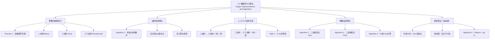

**相关笔记：** [[4.1 整除与模运算]] | [[4.3 素数与最大公约数]]

> [!abstract] 概览
> 本节介绍了整数的==进制表示==以及基于二进制表示的==整数运算算法==。首先，我们证明了任意正整数都可以唯一地表示为任意基数 $b > 1$ 的展开式，并给出了进制转换的具体算法。然后，我们详细描述了二进制加法、乘法算法，分析了它们的位运算复杂度。最后，我们介绍了密码学中至关重要的==模幂算法==（快速幂），它利用指数的二进制展开，将计算 $b^n \bmod m$ 的时间复杂度从 $O(n)$ 降至 $O(\log n)$ 级别。
>
> - ==基数展开定理==：$n = a_k b^k + a_{k-1}b^{k-1} + \cdots + a_1 b + a_0$，其中 $0 \leq a_i < b$
> - ==进制转换算法==：反复除以基数 $b$，余数从右到左构成目标进制表示
> - ==二进制/八进制/十六进制==互转：每3位二进制对应1位八进制，每4位对应1位十六进制
> - ==二进制加法==：$O(n)$ 位运算，逐位相加并处理进位
> - ==二进制乘法==：$O(n^2)$ 位运算，利用分配律将乘法分解为移位与加法
> - ==模幂算法==（快速幂）：$O((\log m)^2 \log n)$ 位运算，利用==反复平方法==

---

## 一、知识结构总览



---

## 二、核心思想

> [!tip] 核心思想
> 本节的核心思想是==进制表示==（base representation）与==算法复杂度==（algorithm complexity）的结合。任意正整数都可以唯一地表示为任意基数 $b > 1$ 的多项式展开，这为计算机使用二进制表示数据提供了理论基础。在此基础上，我们关注的不是算法"能不能算"，而是"算得有多快"——二进制加法需要 $O(n)$ 次位运算，乘法需要 $O(n^2)$ 次，而模幂运算通过==反复平方法==（successive squaring）将朴素方法的 $O(n)$ 次乘法降低到 $O(\log n)$ 次，这一技巧是密码学中 RSA 等算法能够高效运行的关键。

### 1. 整数的基数表示（Representations of Integers）

> [!thm] 基数展开定理（Theorem 1）
> 设 $b$ 为大于 $1$ 的整数。若 $n$ 为正整数，则 $n$ 可以==唯一==地表示为
>
> $$n = a_k b^k + a_{k-1} b^{k-1} + \cdots + a_1 b + a_0$$
>
> 其中 $k$ 为非负整数，$a_0, a_1, \ldots, a_k$ 为满足 $0 \leq a_i < b$ 的非负整数，且 $a_k \neq 0$。
>
> - 该表示称为 $n$ 的==$b$ 进制展开==（base $b$ expansion），记作 $(a_k a_{k-1} \ldots a_1 a_0)_b$
> - 证明可用数学归纳法（见第5章）

> [!example] 二进制转十进制
> $(1\ 0101\ 1111)_2 = 1 \cdot 2^8 + 0 \cdot 2^7 + 1 \cdot 2^6 + 0 \cdot 2^5 + 1 \cdot 2^4 + 1 \cdot 2^3 + 1 \cdot 2^2 + 1 \cdot 2^1 + 1 \cdot 2^0$
> $= 256 + 0 + 64 + 0 + 16 + 8 + 4 + 2 + 1 = 351$

> [!example] 八进制转十进制
> $(7016)_8 = 7 \cdot 8^3 + 0 \cdot 8^2 + 1 \cdot 8 + 6 = 3584 + 0 + 8 + 6 = 3598$

> [!example] 十六进制转十进制
> $(2AE0B)_{16} = 2 \cdot 16^4 + 10 \cdot 16^3 + 14 \cdot 16^2 + 0 \cdot 16 + 11$
> $= 131072 + 40960 + 3584 + 0 + 11 = 175627$
>
> 其中 $A = 10$，$B = 11$，$E = 14$。

### 2. 进制转换算法（Base Conversion）

> [!def] 进制转换算法（Algorithm 1）
> 将十进制正整数 $n$ 转换为 $b$ 进制表示的方法：
> 1. 用 $n$ 除以 $b$，得商 $q_0$ 和余数 $a_0$（$0 \leq a_0 < b$），$a_0$ 是最低位
> 2. 用 $q_0$ 除以 $b$，得商 $q_1$ 和余数 $a_1$，$a_1$ 是次低位
> 3. 重复此过程，直到商为 $0$
> 4. 余数序列 $a_k, a_{k-1}, \ldots, a_1, a_0$（从最后一次到第一次）构成 $b$ 进制表示
>
> **伪代码**：
> ```
> procedure base_b_expansion(n, b)
>     q := n; k := 0
>     while q ≠ 0
>         a_k := q mod b
>         q := q div b
>         k := k + 1
>     return (a_{k-1}, ..., a_1, a_0)
> ```

> [!example] 十进制转八进制
> 将 $(12345)_{10}$ 转换为八进制：
> - $12345 = 8 \times 1543 + 1$，余数 $a_0 = 1$
> - $1543 = 8 \times 192 + 7$，余数 $a_1 = 7$
> - $192 = 8 \times 24 + 0$，余数 $a_2 = 0$
> - $24 = 8 \times 3 + 0$，余数 $a_3 = 0$
> - $3 = 8 \times 0 + 3$，余数 $a_4 = 3$
>
> 故 $(12345)_{10} = (30071)_8$。

> [!example] 十进制转十六进制
> 将 $(177130)_{10}$ 转换为十六进制：
> - $177130 = 16 \times 11070 + 10$，余数 $A$
> - $11070 = 16 \times 691 + 14$，余数 $E$
> - $691 = 16 \times 43 + 3$，余数 $3$
> - $43 = 16 \times 2 + 11$，余数 $B$
> - $2 = 16 \times 0 + 2$，余数 $2$
>
> 故 $(177130)_{10} = (2B3EA)_{16}$。

> [!example] 十进制转二进制
> 将 $(241)_{10}$ 转换为二进制：
> - $241 = 2 \times 120 + 1$
> - $120 = 2 \times 60 + 0$
> - $60 = 2 \times 30 + 0$
> - $30 = 2 \times 15 + 0$
> - $15 = 2 \times 7 + 1$
> - $7 = 2 \times 3 + 1$
> - $3 = 2 \times 1 + 1$
> - $1 = 2 \times 0 + 1$
>
> 故 $(241)_{10} = (1111\ 0001)_2$。

### 3. 二进制、八进制、十六进制互转

> [!def] 二/八/十六进制快速互转
> - 每位==八进制==数字对应==3位==二进制数字
> - 每位==十六进制==数字对应==4位==二进制数字
> - 转换方法：将二进制按3位（八进制）或4位（十六进制）分组，不足的在左边补零

> [!example] 进制互转
> **二进制转八进制和十六进制**：
> $(11\ 1110\ 1011\ 1100)_2$
> - 按3位分组：$011\ 111\ 010\ 111\ 100 \to (37274)_8$
> - 按4位分组：$0011\ 1110\ 1011\ 1100 \to (3EBC)_{16}$
>
> **八进制转二进制**：$(765)_8 = 111\ 110\ 101 = (1111\ 10101)_2$
>
> **十六进制转二进制**：$(A8D)_{16} = 1010\ 1000\ 1101 = (1010\ 1000\ 1101)_2$

### 4. 二进制加法算法（Addition Algorithm）

> [!def] 二进制加法（Algorithm 2）
> 给定两个 $n$ 位二进制数 $a = (a_{n-1} \ldots a_0)_2$ 和 $b = (b_{n-1} \ldots b_0)_2$：
> 1. 从最低位开始，逐位相加：$a_j + b_j + c_j = 2c_{j+1} + s_j$，其中 $c_j$ 为进位，$s_j$ 为结果位
> 2. 初始进位 $c_0 = 0$
> 3. 最终进位 $s_n = c_{n-1}$ 作为最高位
>
> **复杂度**：每次位加法需要2次位运算，共 $n$ 位，总计 $O(n)$ 次位运算。

> [!example] 二进制加法
> 计算 $(1110)_2 + (1011)_2$：
> - $a_0 + b_0 = 0 + 1 = 0 \cdot 2 + 1$，$c_0 = 0$，$s_0 = 1$
> - $a_1 + b_1 + c_0 = 1 + 1 + 0 = 1 \cdot 2 + 0$，$c_1 = 1$，$s_1 = 0$
> - $a_2 + b_2 + c_1 = 1 + 0 + 1 = 1 \cdot 2 + 0$，$c_2 = 1$，$s_2 = 0$
> - $a_3 + b_3 + c_2 = 1 + 1 + 1 = 1 \cdot 2 + 1$，$c_3 = 1$，$s_3 = 1$
> - $s_4 = c_3 = 1$
>
> 结果：$(1\ 1001)_2 = 25$（验证：$14 + 11 = 25$ ✓）

### 5. 二进制乘法算法（Multiplication Algorithm）

> [!def] 二进制乘法（Algorithm 3）
> 给定两个 $n$ 位二进制数 $a$ 和 $b$：
> 1. 利用分配律：$ab = a(b_0 \cdot 2^0) + a(b_1 \cdot 2^1) + \cdots + a(b_{n-1} \cdot 2^{n-1})$
> 2. 若 $b_j = 1$，则部分积 $c_j = a$ 左移 $j$ 位；若 $b_j = 0$，则 $c_j = 0$
> 3. 将所有部分积相加得到最终结果
>
> **复杂度**：
> - 移位次数：$\sum_{j=0}^{n-1} j = O(n^2)$
> - 加法次数：$n$ 次加法，每次 $O(n)$ 位运算，总计 $O(n^2)$
> - 总复杂度：$O(n^2)$ 位运算

> [!example] 二进制乘法
> 计算 $(110)_2 \times (101)_2$：
> - $b_0 = 1$：$c_0 = (110)_2 \times 2^0 = (110)_2$
> - $b_1 = 0$：$c_1 = 0$
> - $b_2 = 1$：$c_2 = (110)_2 \times 2^2 = (11000)_2$
> - 求和：$(110)_2 + (0000)_2 + (11000)_2 = (1\ 1110)_2 = 30$
>
> 验证：$6 \times 5 = 30$ ✓

> [!info] 更高效的乘法算法
> 传统的 $O(n^2)$ 乘法算法并非最优。第8.3节将介绍的 Karatsuba 算法只需 $O(n^{1.585})$ 次位运算，而 Schonhage-Strassen 算法可达 $O(n \log n \log \log n)$。这些算法展示了算法设计对计算效率的巨大影响。

### 6. div 和 mod 的计算（Algorithm 4）

> [!def] 计算 div 和 mod（Algorithm 4）
> 给定整数 $a$ 和正整数 $d$，计算 $q = a \textbf{ div } d$ 和 $r = a \bmod d$：
> 1. 令 $q = 0$，$r = |a|$
> 2. 当 $r \geq d$ 时，反复执行 $r := r - d$，$q := q + 1$
> 3. 若 $a < 0$ 且 $r > 0$，则 $r := d - r$，$q := -(q + 1)$
>
> **复杂度**：当 $a > d$ 时，需要 $O(q \log a)$ 次位运算。更高效的算法只需 $O(\log a \cdot \log d)$ 次位运算。

### 7. 模幂算法（Modular Exponentiation）

> [!def] 快速幂算法（Algorithm 5）
> 计算 $b^n \bmod m$，其中 $b, n, m$ 为大整数：
>
> **核心思想**：利用指数 $n$ 的二进制展开 $n = (a_{k-1} \ldots a_1 a_0)_2$，将 $b^n$ 分解为：
> $$b^n = b^{a_{k-1} \cdot 2^{k-1} + \cdots + a_1 \cdot 2 + a_0} = \prod_{j: a_j = 1} b^{2^j}$$
>
> **算法步骤**：
> 1. 预计算 $b^{2^j} \bmod m$（$j = 0, 1, \ldots, k-1$），通过反复平方法：$b^{2^{j+1}} = (b^{2^j})^2$
> 2. 将 $a_j = 1$ 对应的项相乘，每次乘法后取模
>
> **伪代码**：
> ```
> procedure modular_exponentiation(b, n, m)
>     x := 1
>     power := b mod m
>     for i := 0 to k-1
>         if a_i = 1 then x := (x · power) mod m
>         power := (power · power) mod m
>     return x
> ```
>
> **复杂度**：只需 $O(\log n)$ 次乘法，每次乘法 $O((\log m)^2)$ 位运算，总计 $O((\log m)^2 \log n)$ 位运算。

> [!example] 快速幂计算 $3^{644} \bmod 645$
> $644 = (1010000100)_2$，共10位。
>
> 初始：$x = 1$，$\text{power} = 3 \bmod 645 = 3$。
>
> | $i$ | $a_i$ | 操作 | $x$ | $\text{power}$ |
> |:---:|:-----:|:-----|:---:|:--------------:|
> | 0 | 0 | 不乘 | 1 | $3^2 \bmod 645 = 9$ |
> | 1 | 0 | 不乘 | 1 | $9^2 \bmod 645 = 81$ |
> | 2 | 1 | $x = 1 \times 81 = 81$ | 81 | $81^2 \bmod 645 = 111$ |
> | 3 | 0 | 不乘 | 81 | $111^2 \bmod 645 = 66$ |
> | 4 | 0 | 不乘 | 81 | $66^2 \bmod 645 = 486$ |
> | 5 | 0 | 不乘 | 81 | $486^2 \bmod 645 = 126$ |
> | 6 | 0 | 不乘 | 81 | $126^2 \bmod 645 = 396$ |
> | 7 | 1 | $x = 81 \times 396 \bmod 645 = 471$ | 471 | $396^2 \bmod 645 = 81$ |
> | 8 | 0 | 不乘 | 471 | $81^2 \bmod 645 = 111$ |
> | 9 | 1 | $x = 471 \times 111 \bmod 645 = 36$ | 36 | -- |
>
> 结果：$3^{644} \bmod 645 = 36$。

> [!info] 为什么需要快速幂
> 在密码学（如RSA）中，我们需要计算 $m^e \bmod n$，其中 $e$ 和 $n$ 可能是数百位的大整数。如果先计算 $m^e$ 再取模，$m^e$ 的位数可能达到 $e \cdot \log_2 m$ 位，远超计算机内存容量。快速幂算法通过"边乘边取模"的策略，始终保持中间结果不超过 $m^2$，在时间和空间上都实现了巨大的节省。

---

## 三、补充理解与易混淆点

### 补充理解

> [!info] 补充1："算法"一词的历史渊源
> 英文单词"algorithm"（算法）源于波斯数学家==花拉子密==（al-Khwarizmi, 约780--850）的名字。花拉子密在其著作中系统描述了印度-阿拉伯数字的算术运算步骤，这些步骤正是最早的"算法"。有趣的是，本节讨论的二进制加法和乘法算法，正是历史上最早被称为"算法"的计算过程（Knuth, 1997, Vol. 1）。在计算机科学中，"算法"一词的含义已经远远超出了算术运算的范畴，但其核心——精确的、有限的、机械化的步骤序列——始终未变。
>
> - [Al-Khwarizmi (维基百科)](https://en.wikipedia.org/wiki/Muhammad_ibn_Musa_al-Khwarizmi) -- 花拉子密的生平与贡献
> - [The Art of Computer Programming (Knuth)](https://www-cs-faculty.stanford.edu/~knuth/taocp.html) -- Knuth 经典著作
>
> 来源：Knuth, D. E. (1968). *The Art of Computer Programming, Vol. 1: Fundamental Algorithms*. Addison-Wesley, Section 1.1.
> 来源：Rosen, K. H. (2019). *Discrete Mathematics and Its Applications* (8th ed.), McGraw-Hill, Section 4.2.

> [!info] 补充2：快速幂的广泛应用
> 快速幂（反复平方法）是计算机科学中最重要的算法技巧之一，应用远超密码学。在==竞赛编程==中，快速幂是必学的基础算法；在==大整数运算==中，Python 的 `pow(base, exp, mod)` 内置函数就使用了快速幂；在==矩阵快速幂==中，同样的技巧可以用于 $O(\log n)$ 时间内计算矩阵的 $n$ 次幂，从而高效求解线性递推关系（如斐波那契数列的第 $n$ 项）；在==多项式求值==中，Horner 法则与快速幂思想类似。快速幂的核心洞察是：$n$ 的二进制表示只有 $O(\log n)$ 位，因此只需 $O(\log n)$ 次平方运算就能覆盖所有可能的幂次（Cormen et al., 2009, Ch. 31）。
>
> - [Modular Exponentiation (Wikipedia)](https://en.wikipedia.org/wiki/Modular_exponentiation) -- 模幂算法的详细分析
> - [Exponentiation by Squaring (Brilliant)](https://brilliant.org/wiki/exponentiation-by-squaring/) -- 反复平方法的交互式讲解
>
> 来源：Cormen, T. H., et al. (2009). *Introduction to Algorithms* (3rd ed.), MIT Press, Section 31.6.
> 来源：Knuth, D. E. (1997). *The Art of Computer Programming, Vol. 2: Seminumerical Algorithms* (3rd ed.), Addison-Wesley, Section 4.6.3.

### 易混淆点

> [!warning] 误区1：进制转换时余数的排列顺序
> - ❌ 将十进制转 $b$ 进制时，把余数从先到后（从左到右）排列
> - ✅ 余数应==从后到先==（从最后一个余数到第一个余数）排列，即第一个余数是最低位
> - 例如：$12345$ 转八进制，余数依次为 $1, 7, 0, 0, 3$，结果为 $(30071)_8$ 而非 $(10073)_8$
> - 记忆方法：先得到的余数是"个位"，最后得到的是"最高位"

> [!warning] 误区2：快速幂中 power 的更新时机
> - ❌ 在判断 $a_i = 1$ 之前先更新 power
> - ✅ 正确顺序：先判断当前位 $a_i$，若为 $1$ 则乘入 $x$，==然后==再更新 power（平方）
> - 因为 $a_i$ 对应的是 $b^{2^i}$，所以第 $i$ 步时 power 应为 $b^{2^i} \bmod m$
> - 在 Algorithm 5 中，power 的初始值为 $b \bmod m = b^{2^0} \bmod m$，每次循环末尾平方得到 $b^{2^{i+1}} \bmod m$

---

## 四、习题精选

> [!todo] 习题概览
> | 题号范围 | 核心考点 | 难度 |
> |---------|---------|------|
> | 1-2 | 十进制转二进制 | ⭐ |
> | 3-4 | 二进制转十进制 | ⭐ |
> | 5-6 | 八进制与二进制互转 | ⭐ |
> | 7-9 | 十六进制与二进制互转 | ⭐ |
> | 10-12 | 二进制转十六进制 | ⭐ |
> | 13-16 | 证明二/八/十六进制互转的正确性 | ⭐⭐ |
> | 17-20 | 进制转换综合题 | ⭐⭐ |
> | 21-24 | 二/八/十六进制下的加法和乘法 | ⭐⭐ |
> | 25-28 | 快速幂计算 | ⭐⭐ |
> | 29 | 二进制展开的唯一性证明 | ⭐⭐⭐ |
> | 30 | 平衡三进制展开 | ⭐⭐⭐ |
> | 31-32 | 整除性与数字和的关系 | ⭐⭐⭐ |
> | 33 | 二进制数字和与整除性 | ⭐⭐⭐ |
> | 34-35 | 十进制展开判断整除性 | ⭐⭐ |
> | 36-37 | b进制展开的位数公式 | ⭐⭐ |
> | 38-39 | 等比数列求和与进制展开 | ⭐⭐⭐ |
> | 40-51 | 补码与反码表示 | ⭐⭐⭐ |

### 题1：十进制转二进制

> [!problem] 题目
> 将十进制数 $231$ 转换为二进制。

> [!faq]- 解答
> 反复除以 $2$ 取余：
> - $231 = 2 \times 115 + 1$
> - $115 = 2 \times 57 + 1$
> - $57 = 2 \times 28 + 1$
> - $28 = 2 \times 14 + 0$
> - $14 = 2 \times 7 + 0$
> - $7 = 2 \times 3 + 1$
> - $3 = 2 \times 1 + 1$
> - $1 = 2 \times 0 + 1$
>
> 余数从后到前：$11100111$。
>
> 故 $(231)_{10} = (1110\ 0111)_2$。
>
> $\blacksquare$

### 题2：二进制转十进制

> [!problem] 题目
> 将 $(10\ 0000\ 0001)_2$ 转换为十进制。

> [!faq]- 解答
> $(10\ 0000\ 0001)_2 = 1 \cdot 2^9 + 0 \cdot 2^8 + \cdots + 0 \cdot 2^1 + 1 \cdot 2^0$
> $= 512 + 1 = 513$。
>
> $\blacksquare$

### 题3：快速幂计算

> [!problem] 题目
> 使用快速幂算法计算 $7^{644} \bmod 645$。

> [!faq]- 解答
> $644 = (1010000100)_2$。
>
> 初始：$x = 1$，$\text{power} = 7 \bmod 645 = 7$。
>
> | $i$ | $a_i$ | $x$ | $\text{power}$ |
> |:---:|:-----:|:---:|:--------------:|
> | 0 | 0 | 1 | $7^2 \bmod 645 = 49$ |
> | 1 | 0 | 1 | $49^2 \bmod 645 = 2401 \bmod 645 = 466$ |
> | 2 | 1 | $1 \times 466 = 466$ | $466^2 \bmod 645 = 217156 \bmod 645 = 391$ |
> | 3 | 0 | 466 | $391^2 \bmod 645 = 152881 \bmod 645 = 121$ |
> | 4 | 0 | 466 | $121^2 \bmod 645 = 14641 \bmod 645 = 391$ |
> | 5 | 0 | 466 | $391^2 \bmod 645 = 121$ |
> | 6 | 0 | 466 | $121^2 \bmod 645 = 391$ |
> | 7 | 1 | $466 \times 391 \bmod 645 = 182206 \bmod 645 = 181$ | $391^2 \bmod 645 = 121$ |
> | 8 | 0 | 181 | $121^2 \bmod 645 = 391$ |
> | 9 | 1 | $181 \times 391 \bmod 645 = 70771 \bmod 645 = 436$ | -- |
>
> 结果：$7^{644} \bmod 645 = 436$。
>
> $\blacksquare$

### 题4：进制互转

> [!problem] 题目
> 将 $(1111\ 0111)_2$ 分别转换为八进制和十六进制。

> [!faq]- 解答
> **转八进制**（按3位分组）：$011\ 110\ 111 \to 3\ 6\ 7$
>
> 故 $(1111\ 0111)_2 = (367)_8$。
>
> **转十六进制**（按4位分组）：$1111\ 0111 \to F\ 7$
>
> 故 $(1111\ 0111)_2 = (F7)_{16}$。
>
> $\blacksquare$

> [!tip] 解题思路提示
> 进制转换与快速幂的解题方法论：
> 1. **十进制转 $b$ 进制**：反复除以 $b$ 取余，余数从后到前排列
> 2. **$b$ 进制转十进制**：按位展开为 $b$ 的幂次和
> 3. **二/八/十六互转**：利用3位或4位分组，对照 Table 1
> 4. **快速幂**：将指数写为二进制，逐位扫描，遇 $1$ 则乘入当前 power
> 5. **注意**：快速幂中每次乘法后都要取模，防止数值溢出

### 题5：证明二进制展开的位数公式

> [!problem] 题目
> 证明：若 $n$ 和 $b$ 为正整数且 $b \geq 2$，则 $n$ 的 $b$ 进制表示有 $\lfloor \log_b n \rfloor + 1$ 位。

> [!faq]- 解答
> 设 $n$ 的 $b$ 进制展开为 $n = a_k b^k + a_{k-1} b^{k-1} + \cdots + a_0$，其中 $a_k \neq 0$，$0 \leq a_i < b$。
>
> 因为 $a_k \geq 1$，故 $n \geq b^k$。
>
> 因为 $a_i < b$，故 $n < (b-1)b^k + (b-1)b^{k-1} + \cdots + (b-1) = b^{k+1} - 1 < b^{k+1}$。
>
> 因此 $b^k \leq n < b^{k+1}$。
>
> 取以 $b$ 为底的对数：$k \leq \log_b n < k + 1$。
>
> 故 $k = \lfloor \log_b n \rfloor$。
>
> 位数（从 $a_0$ 到 $a_k$）为 $k + 1 = \lfloor \log_b n \rfloor + 1$。
>
> $\blacksquare$

---

## 五、视频学习指南

> [!info] 视频资源
> | 资源 | 链接 | 对应内容 | 备注 |
> |:-----|:-----|:---------|:-----|
> | Rosen 8e Section 4.2 | [教材原文](https://www.mheducation.com/highered/product/discrete-mathematics-applications-rosen/M9781259676512.html) | 完整定义、定理与例题 | 英文教材 |
> | Base Conversion | [链接](https://www.khanacademy.org/math/algebra-home/alg-intro-to-algebra/algebra-alternate-number-bases/v/number-systems-introduction) | 进制转换基础 | Khan Academy |
> | Fast Modular Exponentiation | [链接](https://www.khanacademy.org/computing/computer-science/cryptography/modarithmetic/a/fast-modular-exponentiation) | 快速幂算法 | Khan Academy |

---

## 六、教材原文

> [!quote] 教材原文
> "Integers can be expressed using any integer greater than one as a base, as we will show in this section. Although we commonly use decimal (base 10), representations, binary (base 2), octal (base 8), and hexadecimal (base 16) representations are often used, especially in computer science."
>
> "In cryptography it is important to be able to find $b^n \bmod m$ efficiently without using an excessive amount of memory, where $b$, $n$, and $m$ are large integers. It is impractical to first compute $b^n$ and then find its remainder when divided by $m$, because $b^n$ can be a huge number and we will need a huge amount of computer memory to store such numbers."
>
> "As mentioned in Section 3.1, the term algorithm originally referred to procedures for performing arithmetic operations using the decimal representations of integers."

---

## 参见 Wiki

- [[离散数学/concepts/进制表示]] -- 基数展开定理与进制转换
- [[离散数学/concepts/进制表示|二进制]] -- 二进制表示与运算
- [[离散数学/concepts/进制表示|十六进制]] -- 十六进制表示与转换
- [[离散数学/concepts/二进制|二进制加法]] -- 二进制加法算法与复杂度
- [[离散数学/concepts/二进制|二进制乘法]] -- 二进制乘法算法与复杂度
- [[离散数学/concepts/快速幂]] -- 模幂算法与反复平方法
- [[离散数学/concepts/补码]] -- 二进制补码表示

#学习/离散数学/数论与密码学
