**相关笔记：** [[4.2 整数表示与算法]] | [[4.4 解同余方程]]

> [!abstract] 概览
> 本节系统介绍了==素数==（prime）与==最大公约数==（greatest common divisor）的核心理论，这是数论的基石内容，也是现代密码学的重要数学工具。
>
> - ==素数==的定义：大于1且仅被1和自身整除的正整数，其余大于1的正整数为==合数==（composite）
> - ==算术基本定理==（Fundamental Theorem of Arithmetic）：每个大于1的整数都能==唯一==分解为素数的乘积（按非递减序排列）
> - ==素数定理==（Prime Number Theorem）：$\pi(x) \sim x / \ln x$，刻画素数的渐近分布
> - ==素数有无穷多个==，欧几里得给出了经典的反证法证明
> - ==试除法==（Trial Division）：若 $n$ 为合数，则 $n$ 必有不超过 $\sqrt{n}$ 的素因子
> - ==埃拉托斯特尼筛法==（Sieve of Eratosthenes）：高效找出不超过给定整数的一切素数
> - ==最大公约数== $\gcd(a,b)$ 与==最小公倍数== $\operatorname{lcm}(a,b)$，满足 $ab = \gcd(a,b) \cdot \operatorname{lcm}(a,b)$
> - ==欧几里得算法==（Euclidean Algorithm）：通过反复取余高效计算 $\gcd(a,b)$，复杂度为 $O(\log b)$
> - ==扩展欧几里得算法==：求出 $\gcd(a,b) = sa + tb$ 中的贝祖系数 $s, t$
> - ==贝祖定理==（Bézout's Theorem）：$\gcd(a,b)$ 可表示为 $a$ 和 $b$ 的整数线性组合
> - 与 [[3.2 函数的增长]] 的联系：欧几里得算法的除法次数为 $O(\log b)$，是高效算法的典型范例

---

## 一、知识结构总览

```mermaid
graph TB
    A["4.3 素数与最大公约数<br>Primes and Greatest Common Divisors"] --> B["素数 Primes"]
    A --> C["素性测试与筛法"]
    A --> D["素数分布与猜想"]
    A --> E["最大公约数 GCD"]
    A --> F["最小公倍数 LCM"]
    A --> G["欧几里得算法"]
    A --> H["扩展欧几里得与贝祖定理"]
    A --> I["算术基本定理与唯一分解"]

    B --> B1["素数定义 Definition 1"]
    B --> B2["合数定义"]
    B --> B3["1 既非素数也非合数"]

    C --> C1["试除法 Trial Division"]
    C --> C2["Theorem 2: 合数有 ≤ √n 的素因子"]
    C --> C3["埃拉托斯特尼筛法 Sieve"]
    C --> C4["Miller-Rabin / AKS 素性测试"]

    D --> D1["素数无穷多 Theorem 3"]
    D --> D2["素数定理 Theorem 4: π(x) ~ x/ln x"]
    D --> D3["梅森素数 Mersenne Primes"]
    D --> D4["哥德巴赫猜想 / 孪生素数猜想"]
    D --> D5["等差数列中的素数"]

    E --> E1["GCD 定义 Definition 2"]
    E --> E2["互素 Relatively Prime"]
    E --> E3["两两互素 Pairwise Relatively Prime"]
    E --> E4["素因子分解法求 GCD"]

    F --> F1["LCM 定义 Definition 5"]
    F --> F2["Theorem 5: ab = gcd·lcm"]

    G --> G1["Lemma 1: gcd(a,b) = gcd(b,r)"]
    G --> G2["欧几里得算法 Algorithm 1"]
    G --> G3["复杂度: O(log b) 次除法"]

    H --> H1["贝祖定理 Theorem 6"]
    H --> H2["贝祖系数 Bézout Coefficients"]
    H --> H3["反向代入法"]
    H --> H4["扩展欧几里得算法"]
    H --> H5["Lemma 2: gcd(a,b)=1 且 a|bc ⇒ a|c"]
    H --> H6["Lemma 3: p|a₁a₂...aₙ ⇒ p|某 aᵢ"]
    H --> H7["Theorem 7: 同余式消去律"]

    I --> I1["算术基本定理 Theorem 1"]
    I --> I2["唯一分解的证明（反证法）"]
```

---

## 二、核心思想

> [!tip] 核心思想
> 本节围绕两个核心主题展开：**素数**与**最大公约数**。素数是正整数的"原子"——每个大于1的整数都可以唯一分解为素数的乘积（算术基本定理），正如化学中每个分子由原子组成。最大公约数则刻画了两个整数之间"最大的公共度量"，而欧几里得算法通过==辗转相除==的巧妙策略，将 GCD 的计算从"需要先分解素因子"的低效方法，提升到 $O(\log b)$ 的高效算法。贝祖定理进一步揭示了 GCD 的代数本质——它等于两个整数所有整数线性组合中的最小正整数。这些结果不仅是数论的基石，更是 [[4.6 密码学]] 中 RSA 等公钥密码系统的数学基础。

### 1. 素数与合数

> [!def] 素数与合数（Definition 1）
> - 大于1的正整数 $p$ 如果仅被1和 $p$ 整除，则称 $p$ 为==素数==（prime）
> - 大于1的正整数如果不是素数，则称为==合数==（composite）
> - 注意：整数 ==1 既不是素数也不是合数==（它只有一个正因子）
> - 等价判定：$n$ 是合数当且仅当存在整数 $a$ 使得 $a \mid n$ 且 $1 < a < n$

> [!example] 判断素数
> - $7$ 是素数：其正因子只有 $1$ 和 $7$
> - $9$ 是合数：$3 \mid 9$ 且 $1 < 3 < 9$

### 2. 算术基本定理

> [!thm] 算术基本定理（Theorem 1: The Fundamental Theorem of Arithmetic）
> 每个大于1的整数都可以唯一地表示为一个素数或两个及以上素数的乘积，其中素因子按非递减顺序排列。
>
> 即若 $n > 1$，则存在唯一的表示
> $$n = p_1^{a_1} p_2^{a_2} \cdots p_k^{a_k}$$
> 其中 $p_1 < p_2 < \cdots < p_k$ 为素数，$a_i \geq 1$。

> [!example] 素因子分解（Example 2）
> $$100 = 2^2 \cdot 5^2, \quad 641 = 641, \quad 999 = 3^3 \cdot 37, \quad 1024 = 2^{10}$$

### 3. 试除法与素性判定

> [!thm] 合数的素因子上界（Theorem 2）
> 若 $n$ 是合数，则 $n$ 有一个不超过 $\sqrt{n}$ 的素因子。
>
> **证明**：若 $n$ 是合数，由定义存在因子 $a$ 满足 $1 < a < n$。设 $n = ab$，其中 $b > 1$。
>
> 我们证明 $a \leq \sqrt{n}$ 或 $b \leq \sqrt{n}$。若 $a > \sqrt{n}$ 且 $b > \sqrt{n}$，则 $ab > \sqrt{n} \cdot \sqrt{n} = n$，矛盾。
>
> 因此 $a \leq \sqrt{n}$ 或 $b \leq \sqrt{n}$。该因子本身是素数，或者由算术基本定理，它有一个比自身更小的素因子。无论哪种情况，$n$ 都有一个不超过 $\sqrt{n}$ 的素因子。
>
> $\blacksquare$

> [!example] 用试除法验证 101 是素数（Example 3）
> $\sqrt{101} \approx 10.05$，不超过 $\sqrt{101}$ 的素数只有 $2, 3, 5, 7$。
>
> 检验：$101 \div 2, 101 \div 3, 101 \div 5, 101 \div 7$ 均不整除。因此 $101$ 是素数。

> [!example] 用试除法分解 7007（Example 4）
> - $7007 \div 2$ 不整除，$7007 \div 3$ 不整除，$7007 \div 5$ 不整除
> - $7007 \div 7 = 1001$
> - $1001 \div 7 = 143$
> - $143 \div 7$ 不整除，$143 \div 11 = 13$
> - $13$ 是素数，分解完毕
> - $$7007 = 7^2 \cdot 11 \cdot 13$$

### 4. 埃拉托斯特尼筛法

> [!def] 埃拉托斯特尼筛法（Sieve of Eratosthenes）
> 一种找出不超过给定正整数 $n$ 的所有素数的算法：
> 1. 列出 $2$ 到 $n$ 的所有整数
> 2. 从第一个素数 $2$ 开始，删除所有 $2$ 的倍数（$2$ 本身保留）
> 3. 找到下一个未被删除的数（即下一个素数），删除其所有倍数
> 4. 重复步骤3，直到处理完不超过 $\sqrt{n}$ 的所有素数
> 5. 剩余未被删除的数即为不超过 $n$ 的所有素数
>
> **原理**：不超过 $n$ 的合数必有不超过 $\sqrt{n}$ 的素因子（Theorem 2），因此只需筛去 $\sqrt{n}$ 以内各素数的倍数即可。

> [!example] 找出不超过 100 的素数
> 不超过 $\sqrt{100} = 10$ 的素数为 $2, 3, 5, 7$。依次筛去它们的倍数后，剩余的素数为：
> $$2, 3, 5, 7, 11, 13, 17, 19, 23, 29, 31, 37, 41, 43, 47, 53, 59, 61, 67, 71, 73, 79, 83, 89, 97$$

### 5. 素数的无穷性

> [!thm] 素数有无穷多个（Theorem 3）
> **证明**（欧几里得反证法）：
>
> 假设素数只有有限个，设为 $p_1, p_2, \ldots, p_n$。令
> $$Q = p_1 p_2 \cdots p_n + 1$$
>
> 由算术基本定理，$Q$ 是素数或可分解为素数的乘积。但没有任何 $p_j$ 能整除 $Q$：若 $p_j \mid Q$，则 $p_j \mid (Q - p_1 p_2 \cdots p_n) = 1$，而素数不能整除 $1$，矛盾。
>
> 因此存在不在列表中的素数（$Q$ 本身或 $Q$ 的素因子），与假设矛盾。
>
> $\blacksquare$
>
> **注意**：此证明中 $Q$ 本身不一定是素数（例如 $2 \cdot 3 \cdot 5 \cdot 7 \cdot 11 \cdot 13 + 1 = 30031 = 59 \times 509$）。这是一个==非构造性==的存在性证明。

### 6. 素数定理与素数分布

> [!thm] 素数定理（Theorem 4: The Prime Number Theorem）
> 设 $\pi(x)$ 为不超过 $x$ 的素数个数，则
> $$\lim_{x \to \infty} \frac{\pi(x)}{x / \ln x} = 1$$
> 即 $\pi(x) \sim x / \ln x$。
>
> 该定理由 Hadamard 和 de la Vallée-Poussin 于1896年利用复变函数理论证明。所有已知证明都相当复杂。
>
> **推论**：在 $n$ 附近随机选取一个正整数，它是素数的概率约为 $1 / \ln n$。例如，在 $10^{1000}$ 附近找到素数的概率约为 $1/2300$。

> [!def] 素数计数函数 $\pi(x)$ 的近似
> | $x$ | $\pi(x)$ | $x / \ln x$ | $\pi(x) / (x / \ln x)$ |
> |-----|----------|-------------|------------------------|
> | $10^3$ | 168 | 144.8 | 1.161 |
> | $10^4$ | 1,229 | 1,085.7 | 1.132 |
> | $10^5$ | 9,592 | 8,685.9 | 1.104 |
> | $10^6$ | 78,498 | 72,382.4 | 1.084 |
> | $10^7$ | 664,579 | 620,420.7 | 1.071 |
> | $10^8$ | 5,761,455 | 5,428,681.0 | 1.061 |
> | $10^9$ | 50,847,534 | 48,254,942.4 | 1.054 |
> | $10^{10}$ | 455,052,512 | 434,294,481.9 | 1.048 |
>
> 比值逐渐趋近于 $1$，验证了素数定理。

> [!def] 梅森素数（Mersenne Primes）
> 形如 $2^p - 1$（$p$ 为素数）的素数称为==梅森素数==。注意 $2^n - 1$ 在 $n$ 不是素数时一定是合数。
>
> - $2^2 - 1 = 3$，$2^3 - 1 = 7$，$2^5 - 1 = 31$，$2^7 - 1 = 127$ 都是梅森素数
> - $2^{11} - 1 = 2047 = 23 \times 89$ 不是梅森素数
> - 判定 $2^p - 1$ 是否为素数有高效的 ==Lucas-Lehmer 测试==
> - 目前已知最大素数几乎都是梅森素数，由 GIMPS（Great Internet Mersenne Prime Search）分布式计算项目发现

### 7. 最大公约数与最小公倍数

> [!def] 最大公约数（Definition 2）
> 设 $a$ 和 $b$ 是不全为零的整数。同时整除 $a$ 和 $b$ 的最大整数 $d$ 称为 $a$ 和 $b$ 的==最大公约数==，记作 $\gcd(a, b)$。

> [!def] 互素与两两互素（Definition 3 & 4）
> - $\gcd(a, b) = 1$ 时，称 $a$ 和 $b$ ==互素==（relatively prime）
> - 对一组整数 $a_1, a_2, \ldots, a_n$，若对所有 $1 \leq i < j \leq n$ 都有 $\gcd(a_i, a_j) = 1$，则称它们==两两互素==（pairwise relatively prime）

> [!example] 互素与两两互素（Example 13）
> - $\gcd(10, 17) = 1$，$\gcd(10, 21) = 1$，$\gcd(17, 21) = 1$，故 $\{10, 17, 21\}$ 两两互素
> - $\gcd(10, 24) = 2 > 1$，故 $\{10, 19, 24\}$ 不是两两互素

> [!def] 用素因子分解求 GCD 和 LCM
> 设 $a = p_1^{a_1} p_2^{a_2} \cdots p_n^{a_n}$，$b = p_1^{b_1} p_2^{b_2} \cdots p_n^{b_n}$，则：
> $$\gcd(a, b) = p_1^{\min(a_1,b_1)} p_2^{\min(a_2,b_2)} \cdots p_n^{\min(a_n,b_n)}$$
> $$\operatorname{lcm}(a, b) = p_1^{\max(a_1,b_1)} p_2^{\max(a_2,b_2)} \cdots p_n^{\max(a_n,b_n)}$$

> [!example] 用素因子分解求 GCD（Example 14）
> $120 = 2^3 \cdot 3 \cdot 5$，$500 = 2^2 \cdot 5^3$
> $$\gcd(120, 500) = 2^{\min(3,2)} \cdot 3^{\min(1,0)} \cdot 5^{\min(1,3)} = 2^2 \cdot 3^0 \cdot 5^1 = 20$$

> [!thm] GCD 与 LCM 的关系（Theorem 5）
> 设 $a$ 和 $b$ 为正整数，则
> $$ab = \gcd(a, b) \cdot \operatorname{lcm}(a, b)$$

### 8. 欧几里得算法

> [!def] 欧几里得算法的核心引理（Lemma 1）
> 设 $a = bq + r$，其中 $a, b, q, r$ 为整数，则
> $$\gcd(a, b) = \gcd(b, r)$$
>
> **证明**：只需证明 $\{a, b\}$ 的公因子集合与 $\{b, r\}$ 的公因子集合相同。
> - 若 $d \mid a$ 且 $d \mid b$，则 $d \mid (a - bq) = r$，故 $d$ 也是 $b$ 和 $r$ 的公因子
> - 若 $d \mid b$ 且 $d \mid r$，则 $d \mid (bq + r) = a$，故 $d$ 也是 $a$ 和 $b$ 的公因子
>
> 因此 $\gcd(a, b) = \gcd(b, r)$。
>
> $\blacksquare$

> [!def] 欧几里得算法（Algorithm 1: The Euclidean Algorithm）
> **输入**：正整数 $a, b$（设 $a \geq b$）
>
> **步骤**：反复应用带余除法
> $$r_0 = r_1 q_1 + r_2, \quad 0 \leq r_2 < r_1$$
> $$r_1 = r_2 q_2 + r_3, \quad 0 \leq r_3 < r_2$$
> $$\cdots$$
> $$r_{n-2} = r_{n-1} q_{n-1} + r_n, \quad 0 \leq r_n < r_{n-1}$$
> $$r_{n-1} = r_n q_n$$
>
> 其中 $r_0 = a$，$r_1 = b$。由 Lemma 1：
> $$\gcd(a, b) = \gcd(r_0, r_1) = \gcd(r_1, r_2) = \cdots = \gcd(r_{n-1}, r_n) = r_n$$
>
> **结论**：最后一个非零余数 $r_n$ 即为 $\gcd(a, b)$。
>
> **复杂度**：需要 $O(\log b)$ 次除法（将在第5.3节证明）。

> [!example] 欧几里得算法求 $\gcd(91, 287)$
> $$287 = 91 \times 3 + 14$$
> $$91 = 14 \times 6 + 7$$
> $$14 = 7 \times 2 + 0$$
>
> 最后一个非零余数为 $7$，故 $\gcd(91, 287) = 7$。

> [!example] 欧几里得算法求 $\gcd(414, 662)$（Example 16）
> | $j$ | $r_j$ | $r_{j+1}$ | $q_{j+1}$ | $r_{j+2}$ |
> |-----|-------|-----------|-----------|-----------|
> | 0 | 662 | 414 | 1 | 248 |
> | 1 | 414 | 248 | 1 | 166 |
> | 2 | 248 | 166 | 1 | 82 |
> | 3 | 166 | 82 | 2 | 2 |
> | 4 | 82 | 2 | 41 | 0 |
>
> $\gcd(414, 662) = 2$。

### 9. 贝祖定理与扩展欧几里得算法

> [!thm] 贝祖定理（Theorem 6: Bézout's Theorem）
> 若 $a$ 和 $b$ 为正整数，则存在整数 $s$ 和 $t$ 使得
> $$\gcd(a, b) = sa + tb$$
>
> 满足此等式的 $s$ 和 $t$ 称为 $a$ 和 $b$ 的==贝祖系数==（Bézout coefficients），该等式称为==贝祖恒等式==（Bézout's identity）。

> [!example] 反向代入法求贝祖系数（Example 17）
> 求 $\gcd(252, 198) = 18$ 的贝祖系数。
>
> **正向**（欧几里得算法）：
> $$252 = 198 \times 1 + 54$$
> $$198 = 54 \times 3 + 36$$
> $$54 = 36 \times 1 + 18$$
> $$36 = 18 \times 2 + 0$$
>
> **反向代入**：
> $$18 = 54 - 1 \times 36$$
> 将 $36 = 198 - 3 \times 54$ 代入：
> $$18 = 54 - 1 \times (198 - 3 \times 54) = 4 \times 54 - 1 \times 198$$
> 将 $54 = 252 - 1 \times 198$ 代入：
> $$18 = 4 \times (252 - 1 \times 198) - 1 \times 198 = 4 \times 252 - 5 \times 198$$
>
> 因此 $\gcd(252, 198) = 4 \times 252 + (-5) \times 198$。

> [!def] 扩展欧几里得算法
> 在欧几里得算法的同时，维护两组系数 $s_j$ 和 $t_j$，使得 $r_j = s_j \cdot a + t_j \cdot b$。
>
> **初始化**：$s_0 = 1, s_1 = 0, t_0 = 0, t_1 = 1$
>
> **递推**（$j = 2, 3, \ldots, n$）：
> $$s_j = s_{j-2} - q_{j-1} \cdot s_{j-1}$$
> $$t_j = t_{j-2} - q_{j-1} \cdot t_{j-1}$$
>
> 最终 $\gcd(a, b) = s_n \cdot a + t_n \cdot b$。

> [!example] 扩展欧几里得算法（Example 18）
> 对 $\gcd(252, 198)$，商序列 $q_1 = 1, q_2 = 3, q_3 = 1, q_4 = 2$：
>
> | $j$ | $r_j$ | $q_{j+1}$ | $r_{j+2}$ | $s_j$ | $t_j$ |
> |-----|-------|-----------|-----------|-------|-------|
> | 0 | 252 | 1 | 54 | 1 | 0 |
> | 1 | 198 | 3 | 36 | 0 | 1 |
> | 2 | 54 | 1 | 18 | 1 | -1 |
> | 3 | 36 | 2 | 0 | -3 | 4 |
> | 4 | 18 | | | 4 | -5 |
>
> 验证：$4 \times 252 + (-5) \times 198 = 1008 - 990 = 18 = \gcd(252, 198)$。$\blacksquare$

### 10. 贝祖定理的重要推论

> [!thm] 互素整数的整除性质（Lemma 2）
> 若 $a, b, c$ 为正整数，$\gcd(a, b) = 1$ 且 $a \mid bc$，则 $a \mid c$。
>
> **证明**：由贝祖定理，存在整数 $s, t$ 使得 $sa + tb = 1$。两边乘以 $c$：
> $$sac + tbc = c$$
> 由于 $a \mid sac$（显然）且 $a \mid tbc$（因为 $a \mid bc$），故 $a \mid (sac + tbc) = c$。
>
> $\blacksquare$

> [!thm] 素数整除乘积的性质（Lemma 3）
> 若 $p$ 为素数且 $p \mid a_1 a_2 \cdots a_n$（每个 $a_i$ 为整数），则 $p \mid a_i$ 对某个 $i$ 成立。
>
> 这是算术基本定理中"唯一分解"部分证明的关键引理。

> [!thm] 同余式的消去律（Theorem 7）
> 设 $m$ 为正整数，$a, b, c$ 为整数。若 $ac \equiv bc \pmod{m}$ 且 $\gcd(c, m) = 1$，则
> $$a \equiv b \pmod{m}$$
>
> **证明**：$ac \equiv bc \pmod{m}$ 意味着 $m \mid c(a - b)$。由 Lemma 2，$\gcd(c, m) = 1$ 蕴含 $m \mid (a - b)$，即 $a \equiv b \pmod{m}$。
>
> $\blacksquare$

### 11. 算术基本定理的唯一性证明

> [!thm] 算术基本定理——唯一性
> 每个大于1的正整数至多有一种按非递减顺序排列的素因子分解方式。
>
> **证明**（反证法）：假设正整数 $n$ 有两种不同的素因子分解：
> $$n = p_1 p_2 \cdots p_s = q_1 q_2 \cdots q_t$$
> 其中 $p_1 \leq p_2 \leq \cdots \leq p_s$，$q_1 \leq q_2 \leq \cdots \leq q_t$。
>
> 消去两边的公共素数后得到：
> $$p_{i_1} p_{i_2} \cdots p_{i_u} = q_{j_1} q_{j_2} \cdots q_{j_v}$$
> 其中等式两边的素数互不相同，$u, v \geq 1$。
>
> 由 Lemma 3，$p_{i_1}$ 必须整除右边的某个 $q_{j_k}$。但素数不能整除另一个不同的素数，矛盾。
>
> $\blacksquare$

---

## 三、补充理解与易混淆点

### 补充理解

> [!info] 补充1：素性测试的算法演进——从试除法到 AKS
> 素性测试（primality testing）是计算数论的核心问题之一。试除法的时间复杂度为 $O(\sqrt{n})$，对于大整数效率不足。实际应用中广泛使用的是 ==Miller-Rabin 概率性素性测试==（Miller & Rabin, 1980），它基于费马小定理的逆命题，可以在 $O(k \log^3 n)$ 时间内以 $4^{-k}$ 的错误概率判定 $n$ 是否为素数（Rosen, 2019, Section 4.6）。2002年，Agrawal、Kayal 和 Saxena 发现了 ==AKS 素性测试==，这是第一个==确定性多项式时间==的素性测试算法，复杂度为 $O((\log n)^6)$ 位运算（Agrawal, Kayal & Saxena, 2002, "PRIMES is in P", *Annals of Mathematics*）。这一发现解决了计算复杂性理论中的一个长期开放问题。值得注意的是，虽然素性测试有多项式时间算法，但整数分解（integer factorization）至今没有已知的多项式时间算法，这一不对称性正是 RSA 密码系统安全性的基础。
>
> - [PRIMES is in P (原始论文)](https://www.cse.iitk.ac.in/users/manindra/algebra/primality_v6.pdf) -- AKS 算法的原始论文
> - [Miller-Rabin 素性测试可视化](https://en.wikipedia.org/wiki/Miller%E2%80%93Rabin_primality_test) -- Wikipedia 上的详细说明
>
> 来源：Agrawal, M., Kayal, N. & Saxena, N. (2004). "PRIMES is in P." *Annals of Mathematics*, 160(2), 781–793.
> 来源：Rivest, R. L., Shamir, A. & Adleman, L. (1978). "A Method for Obtaining Digital Signatures and Public-Key Cryptosystems." *Communications of the ACM*, 21(2), 120–126.

> [!info] 补充2：欧几里得算法与斐波那契数列——Lamé 定理
> 欧几里得算法的效率分析是算法复杂度理论的经典案例。1845年，法国数学家 ==Gabriel Lamé== 证明了：用欧几里得算法计算 $\gcd(a, b)$（$a \geq b$）所需的除法次数不超过 $\log_\phi(b) \times 5$，其中 $\phi = (1+\sqrt{5})/2$ 为黄金比例（Lamé, 1844）。更精确地说，除法次数最多为 $5 \times$（$b$ 的十进制位数）。最坏情况出现在 $a$ 和 $b$ 是==相邻的斐波那契数==时。例如 $\gcd(F_{n+1}, F_n) = 1$ 恰好需要 $n-1$ 次除法。这一结果与 [[3.2 函数的增长]] 中的大O分析直接相关：欧几里得算法的除法次数为 $O(\log b)$，其中每次除法涉及 $O(\log b)$ 位数的运算，因此总位运算复杂度为 $O(\log^2 b)$。这一效率使欧几里得算法成为实际应用中最常用的 GCD 计算方法。
>
> - [欧几里得算法的可视化演示](https://visualgo.net/en/numbertheory) -- 逐步展示欧几里得算法的执行过程
> - [斐波那契数列与欧几里得算法的关系](https://en.wikipedia.org/wiki/Euclidean_algorithm#Number_of_steps) -- Wikipedia 上的详细分析
>
> 来源：Lamé, G. (1844). "Note sur la limite du nombre de divisions dans la recherche du plus grand commun diviseur entre deux nombres entiers." *Comptes Rendus de l'Académie des Sciences*, 19, 867–870.
> 来源：Knuth, D. E. (1997). *The Art of Computer Programming, Vol. 2: Seminumerical Algorithms* (3rd ed.), Addison-Wesley, Section 4.5.3.

### 易混淆点

> [!warning] 误区1：欧几里得证明中 $Q = p_1 p_2 \cdots p_n + 1$ 一定是素数
> - ❌ 认为 $Q$ 一定是素数，从而得出"素数公式"
> - ✅ $Q$ 不一定是素数！例如 $2 \times 3 \times 5 \times 7 \times 11 \times 13 + 1 = 30031 = 59 \times 509$
> - ✅ 证明的关键是：$Q$ 要么本身是素数，要么有一个不在原列表中的素因子——无论哪种情况，都说明存在列表之外的素数
> - ⚠️ 这是一个非构造性证明，它证明了"存在更大的素数"，但没有告诉我们那个素数具体是多少
> - ⚠️ 不存在能对所有正整数 $n$ 都输出素数的多项式 $f(n)$（见教材 Example 6）

> [!warning] 误区2：互素 vs 两两互素
> - ❌ 认为"一组整数互素"等价于"它们两两互素"
> - ✅ "互素"（relatively prime）通常指 $\gcd(a_1, a_2, \ldots, a_n) = 1$，即所有数的最大公约数为1
> - ✅ "两两互素"（pairwise relatively prime）要求更强：任意两个数的 GCD 都为1
> - ✅ 两两互素 ⇒ 互素，但反之不成立
>
> **反例**：$\{6, 10, 15\}$
> - $\gcd(6, 10, 15) = 1$，所以它们"互素"
> - 但 $\gcd(6, 10) = 2 > 1$，所以它们不是"两两互素"
>
> 这一区别在后续学习中国剩余定理（[[4.4 解同余方程]]）时非常重要。

---

## 四、习题精选

> [!todo] 习题概览
> | 题号范围 | 核心考点 | 难度 |
> |---------|---------|------|
> | 1-2 | 判断素数 | ⭐ |
> | 3-4 | 素因子分解 | ⭐ |
> | 7-8 | 试除法伪代码 | ⭐⭐ |
> | 9-10 | 梅森数与素数的关系 | ⭐⭐ |
> | 14-15 | 求与给定数互素的整数 | ⭐ |
> | 16-17 | 判断两两互素 | ⭐⭐ |
> | 24-25 | 用素因子分解求 GCD | ⭐⭐ |
> | 26-27 | 用素因子分解求 LCM | ⭐⭐ |
> | 28-29 | 验证 $\gcd \cdot \operatorname{lcm} = ab$ | ⭐⭐ |
> | 32-33 | 欧几里得算法求 GCD | ⭐⭐ |
> | 34-35 | 欧几里得算法的除法次数 | ⭐⭐ |
> | 39 | 反向代入法求贝祖系数 | ⭐⭐⭐ |
> | 31 | 证明 $\gcd \cdot \operatorname{lcm} = ab$ | ⭐⭐⭐ |
> | 36-37 | $2^a - 1$ 与 $2^b - 1$ 的 GCD | ⭐⭐⭐⭐ |

### 题1：判断素数

> [!problem] 题目
> 判断以下整数是否为素数：$21, 29, 71, 97, 111, 143$。

> [!faq]- 解答
> - $21 = 3 \times 7$，合数
> - $29$：$\sqrt{29} \approx 5.39$，检验 $2, 3, 5$ 均不整除，**素数**
> - $71$：$\sqrt{71} \approx 8.43$，检验 $2, 3, 5, 7$ 均不整除，**素数**
> - $97$：$\sqrt{97} \approx 9.85$，检验 $2, 3, 5, 7$ 均不整除，**素数**
> - $111 = 3 \times 37$，合数（$1+1+1=3$ 被 $3$ 整除）
> - $143 = 11 \times 13$，合数
>
> $\blacksquare$

### 题2：素因子分解

> [!problem] 题目
> 求以下整数的素因子分解：$88, 126, 729, 1001, 1111, 909090$。

> [!faq]- 解答
> - $88 = 8 \times 11 = 2^3 \times 11$
> - $126 = 2 \times 63 = 2 \times 3^2 \times 7$
> - $729 = 9^3 = 3^6$
> - $1001 = 7 \times 143 = 7 \times 11 \times 13$
> - $1111 = 101 \times 11$
> - $909090 = 90 \times 10101 = 2 \times 3^2 \times 5 \times 7 \times 11 \times 13$
>
> $\blacksquare$

### 题3：欧几里得算法求 GCD

> [!problem] 题目
> 使用欧几里得算法求 $\gcd(12345, 54321)$。

> [!tip] 解题思路提示
> 反复执行带余除法，记录每步的商和余数，直到余数为0。最后一个非零余数即为 GCD。

> [!faq]- 解答
> $$54321 = 12345 \times 4 + 4941$$
> $$12345 = 4941 \times 2 + 2463$$
> $$4941 = 2463 \times 2 + 15$$
> $$2463 = 15 \times 164 + 3$$
> $$15 = 3 \times 5 + 0$$
>
> 最后一个非零余数为 $3$，故 $\gcd(12345, 54321) = 3$。
>
> $\blacksquare$

### 题4：用扩展欧几里得算法求贝祖系数

> [!problem] 题目
> 使用扩展欧几里得算法，将 $\gcd(252, 198) = 18$ 表示为 $252$ 和 $198$ 的线性组合。

> [!tip] 解题思路提示
> 先执行欧几里得算法得到商序列，然后利用递推公式 $s_j = s_{j-2} - q_{j-1} s_{j-1}$ 和 $t_j = t_{j-2} - q_{j-1} t_{j-1}$ 计算 $s_j$ 和 $t_j$。

> [!faq]- 解答
> **第一步：欧几里得算法**
> $$252 = 198 \times 1 + 54 \quad (q_1 = 1)$$
> $$198 = 54 \times 3 + 36 \quad (q_2 = 3)$$
> $$54 = 36 \times 1 + 18 \quad (q_3 = 1)$$
> $$36 = 18 \times 2 + 0 \quad (q_4 = 2)$$
>
> **第二步：扩展欧几里得算法**
>
> 初始化：$s_0 = 1, s_1 = 0, t_0 = 0, t_1 = 1$
>
> | $j$ | $s_j = s_{j-2} - q_{j-1} s_{j-1}$ | $t_j = t_{j-2} - q_{j-1} t_{j-1}$ |
> |-----|------|------|
> | 2 | $s_2 = 1 - 1 \times 0 = 1$ | $t_2 = 0 - 1 \times 1 = -1$ |
> | 3 | $s_3 = 0 - 3 \times 1 = -3$ | $t_3 = 1 - 3 \times (-1) = 4$ |
> | 4 | $s_4 = 1 - 1 \times (-3) = 4$ | $t_4 = -1 - 1 \times 4 = -5$ |
>
> 验证：$4 \times 252 + (-5) \times 198 = 1008 - 990 = 18$。$\blacksquare$

### 题5：证明素数有无穷多个（变体）

> [!problem] 题目
> 证明：存在无穷多个形如 $4k + 3$ 的素数（即 $\equiv 3 \pmod{4}$ 的素数有无穷多个）。

> [!tip] 解题思路提示
> 模仿欧几里得证明的结构，构造一个特殊形式的数，然后分析其素因子。关键观察：形如 $4k + 1$ 的数的乘积仍然是 $4k + 1$ 的形式，因此 $4k + 3$ 形式的合数至少有一个 $4k + 3$ 形式的素因子。

> [!faq]- 解答
> **证明**（反证法）：
>
> 假设形如 $4k + 3$ 的素数只有有限个，设为 $p_1, p_2, \ldots, p_n$（其中 $p_1 = 3$）。
>
> 令 $Q = 4 \cdot p_1 p_2 \cdots p_n - 1 = 4 \cdot p_1 p_2 \cdots p_n + (-1)$。
>
> 注意 $Q \equiv -1 \equiv 3 \pmod{4}$，且 $Q > p_n$，$Q > 1$。
>
> $Q$ 的素因子分解中，不可能全部是 $4k + 1$ 形式的素数（因为 $4k+1$ 形式的数之积仍为 $4k+1$ 形式，而 $Q \equiv 3 \pmod{4}$）。因此 $Q$ 至少有一个 $4k + 3$ 形式的素因子 $p$。
>
> 但 $p$ 不能是 $p_1, p_2, \ldots, p_n$ 中的任何一个（因为 $p_i \mid 4p_1 \cdots p_n$，而 $p_i \nmid 1$，故 $p_i \nmid Q$）。
>
> 这与"所有 $4k+3$ 形式的素数都在列表中"的假设矛盾。
>
> 因此形如 $4k + 3$ 的素数有无穷多个。
>
> $\blacksquare$

> [!tip] 解题思路提示
> 素数与 GCD 相关题目的解题方法论：
> 1. **判断素数**：用试除法，只需检验不超过 $\sqrt{n}$ 的素数
> 2. **素因子分解**：从最小素数开始逐个试除
> 3. **欧几里得算法**：反复带余除法，最后一个非零余数即为 GCD
> 4. **求贝祖系数**：先正向执行欧几里得算法，再反向代入；或直接使用扩展欧几里得算法
> 5. **证明素数无穷**：构造特殊形式的数，分析其素因子必在列表之外
> 6. **GCD 与 LCM 关系**：牢记 $ab = \gcd(a,b) \cdot \operatorname{lcm}(a,b)$

---

## 五、视频学习指南

> [!info] 视频资源
> | 资源 | 链接 | 对应内容 | 备注 |
> |:-----|:-----|:---------|:-----|
> | Rosen 8e Section 4.3 | [教材原文](https://www.mheducation.com/highered/product/discrete-mathematics-applications-rosen/M9781259676512.html) | 完整定义、定理与例题 | 英文教材 |
> | MIT 6.042J Lecture 8 | [链接](https://www.youtube.com/watch?v=8l1EYzNjSPo) | 欧几里得算法与 GCD | 英文，MIT开放课程 |
> | 3Blue1Brown - 素数 | [链接](https://www.youtube.com/watch?v=RF7MXQI1zPk) | 素数的可视化与分布 | 英文，动画讲解 |
> | Numberphile - 欧几里得算法 | [链接](https://www.youtube.com/watch?v=JUz6cXkUKRQ) | 欧几里得算法的直觉理解 | 英文，科普视频 |

---

## 六、教材原文

> [!quote] 教材原文
> "A prime is an integer greater than 1 that is divisible by no positive integers other than 1 and itself. The study of prime numbers goes back to ancient times. Thousands of years ago it was known that there are infinitely many primes; the proof of this fact, found in the works of Euclid, is famous for its elegance and beauty."
>
> "The fundamental theorem of arithmetic asserts that every positive integer can be written uniquely as the product of primes in nondecreasing order."
>
> "Primes have become essential in modern cryptographic systems, and we will develop some of their properties important in cryptography. For example, finding large primes is essential in modern cryptography. The length of time required to factor large integers into their prime factors is the basis for the strength of some important modern cryptographic systems."
>
> "The Euclidean algorithm is based on the principle that the greatest common divisor of two numbers does not change if the larger number is replaced by its difference with the smaller number."

---

## 参见 Wiki

- [[离散数学/concepts/素数]] -- 素数的定义与基本性质
- [[离散数学/concepts/算术基本定理]] -- 唯一素因子分解定理
- [[离散数学/concepts/最大公约数]] -- GCD 的定义与性质
- [[离散数学/concepts/欧几里得算法]] -- 辗转相除法求 GCD
- [[离散数学/concepts/贝祖定理]] -- GCD 的线性组合表示
- [[离散数学/concepts/素数|素数定理]] -- 素数分布的渐近规律
- [[离散数学/concepts/素数|埃拉托斯特尼筛法]] -- 筛法求素数
- [[离散数学/concepts/素数|梅森素数]] -- 形如 $2^p - 1$ 的素数
- [[离散数学/concepts/最大公约数|最小公倍数]] -- LCM 的定义与性质

#学习/离散数学/数论与密码学
