**相关笔记：** [[4.3 素数与最大公约数]] | [[4.5 同余的应用]]

> [!abstract] 概览
> 本节系统介绍了==线性同余方程==的求解方法，以及同余理论中若干核心定理与应用。主要内容包括：
>
> - ==线性同余方程== $ax \equiv b \pmod{m}$ 的求解方法：通过==模逆元==将方程转化为 $x \equiv \bar{a}b \pmod{m}$
> - ==模逆元==的存在条件：$\gcd(a, m) = 1$ 时逆元存在且在模 $m$ 下唯一（Theorem 1）
> - 利用==扩展欧几里得算法==求模逆元的具体步骤
> - ==中国剩余定理（CRT）==：当模数两两互素时，线性同余方程组有唯一解（Theorem 2）
> - CRT 的两种求解方法：构造法与==回代法==
> - CRT 在==大整数算术==中的应用：利用模数分解实现并行计算
> - ==费马小定理==：若 $p$ 为素数且 $p \nmid a$，则 $a^{p-1} \equiv 1 \pmod{p}$（Theorem 3）
> - ==伪素数==与==Carmichael 数==的概念
> - ==原根==与==离散对数==的定义，以及离散对数问题的计算困难性

---

## 一、知识结构总览

```mermaid
graph TB
    A["4.4 解同余方程 Solving Congruences"] --> B["线性同余方程"]
    A --> C["模逆元"]
    A --> D["中国剩余定理 CRT"]
    A --> E["大整数算术"]
    A --> F["费马小定理"]
    A --> G["伪素数与 Carmichael 数"]
    A --> H["原根与离散对数"]

    B --> B1["ax ≡ b (mod m)"]
    B --> B2["利用逆元求解"]

    C --> C1["存在条件：gcd(a,m)=1"]
    C --> C2["唯一性（模 m 下）"]
    C --> C3["扩展欧几里得算法求解"]

    D --> D1["模数两两互素"]
    D --> D2["构造法求解"]
    D --> D3["回代法求解"]
    D --> D4["唯一解模 m₁m₂⋯mₙ"]

    E --> E1["整数的大元组表示"]
    E --> E2["分量并行运算"]
    E --> E3["CRT 恢复结果"]

    F --> F1["a^(p-1) ≡ 1 (mod p)"]
    F --> F2["a^p ≡ a (mod p)"]
    F --> F3["大幂模 p 的快速计算"]

    G --> G1["伪素数定义"]
    G --> G2["Carmichael 数"]
    G --> G3["概率素性测试"]

    H --> H1["原根定义"]
    H --> H2["离散对数定义"]
    H --> H3["离散对数问题 DLP"]
```

---

## 二、核心思想

> [!tip] 核心思想
> 本节的核心思想是==同余方程的求解==与==模运算中的逆元理论==。线性同余方程 $ax \equiv b \pmod{m}$ 的求解关键在于找到 $a$ 的==模逆元== $\bar{a}$，使得 $a\bar{a} \equiv 1 \pmod{m}$。逆元存在的充要条件是 $\gcd(a, m) = 1$，其本质是 [[4.3 素数与最大公约数|Bézout 定理]]的直接应用。当需要同时满足多个同余条件时，==中国剩余定理==提供了系统化的求解框架，其核心构造思想是利用逆元将各方程的贡献"叠加"起来。此外，==费马小定理==揭示了素数模下幂运算的周期性规律，为高效计算大幂模素数提供了理论基础。

### 1. 线性同余方程与模逆元

> [!def] 线性同余方程（Linear Congruence）
> 形如
>
> $$ax \equiv b \pmod{m}$$
>
> 的方程称为==线性同余方程==，其中 $m$ 为正整数，$a$、$b$ 为整数，$x$ 为未知量。
>
> 求解的关键是找到 $a$ 的==模逆元==。

> [!def] 模逆元（Modular Inverse）
> 若整数 $\bar{a}$ 满足
>
> $$a\bar{a} \equiv 1 \pmod{m}$$
>
> 则称 $\bar{a}$ 为 $a$ 的==模 $m$ 的逆元==。

> [!thm] 逆元存在与唯一性定理（Theorem 1）
> 若 $\gcd(a, m) = 1$ 且 $m > 1$，则 $a$ 的模 $m$ 逆元存在，且在模 $m$ 下==唯一==。
>
> **证明**：由 [[4.3 素数与最大公约数|Bézout 定理]]（Section 4.3 Theorem 6），因为 $\gcd(a, m) = 1$，存在整数 $s$ 和 $t$ 使得
>
> $$sa + tm = 1$$
>
> 两边取模 $m$：
>
> $$sa + tm \equiv 1 \pmod{m}$$
>
> 因为 $tm \equiv 0 \pmod{m}$，所以 $sa \equiv 1 \pmod{m}$。
>
> 因此 $s$ 是 $a$ 的模 $m$ 逆元。唯一性的证明留作练习（Exercise 7）。
>
> $\blacksquare$

> [!example] 例1：求 3 模 7 的逆元
> 因为 $\gcd(3, 7) = 1$，逆元存在。用欧几里得算法：
>
> $$7 = 2 \cdot 3 + 1$$
>
> 反向表示：
>
> $$1 = 7 - 2 \cdot 3 = (-2) \cdot 3 + 1 \cdot 7$$
>
> 因此 $-2$ 是 3 模 7 的逆元。等价地，$-2 \equiv 5 \pmod{7}$，所以 $5$ 也是逆元。
>
> 验证：$5 \cdot 3 = 15 \equiv 1 \pmod{7}$。 ✓

> [!example] 例2：求 101 模 4620 的逆元
> 用欧几里得算法计算 $\gcd(101, 4620)$：
>
> $$\begin{aligned} 4620 &= 45 \cdot 101 + 75 \\ 101 &= 1 \cdot 75 + 26 \\ 75 &= 2 \cdot 26 + 23 \\ 26 &= 1 \cdot 23 + 3 \\ 23 &= 7 \cdot 3 + 2 \\ 3 &= 1 \cdot 2 + 1 \end{aligned}$$
>
> 因为最后非零余数为 1，$\gcd(101, 4620) = 1$。反向代入：
>
> $$\begin{aligned} 1 &= 3 - 1 \cdot 2 \\ &= 3 - 1 \cdot (23 - 7 \cdot 3) = -1 \cdot 23 + 8 \cdot 3 \\ &= -1 \cdot 23 + 8 \cdot (26 - 1 \cdot 23) = 8 \cdot 26 - 9 \cdot 23 \\ &= 8 \cdot 26 - 9 \cdot (75 - 2 \cdot 26) = -9 \cdot 75 + 26 \cdot 26 \\ &= -9 \cdot 75 + 26 \cdot (101 - 1 \cdot 75) = 26 \cdot 101 - 35 \cdot 75 \\ &= 26 \cdot 101 - 35 \cdot (4620 - 45 \cdot 101) = 1601 \cdot 101 - 35 \cdot 4620 \end{aligned}$$
>
> 因此 $1601$ 是 $101$ 模 $4620$ 的逆元。

> [!example] 例3：求解 $3x \equiv 4 \pmod{7}$
> 由例1，$-2$ 是 3 模 7 的逆元。两边乘以 $-2$：
>
> $$-2 \cdot 3x \equiv -2 \cdot 4 \pmod{7}$$
>
> $$x \equiv -8 \equiv 6 \pmod{7}$$
>
> 验证：$3 \cdot 6 = 18 \equiv 4 \pmod{7}$。 ✓
>
> 解集为 $\{x \mid x \equiv 6 \pmod{7}\}$，即 $\ldots, -8, -1, 6, 13, 20, \ldots$

### 2. 中国剩余定理

> [!thm] 中国剩余定理（Theorem 2, Chinese Remainder Theorem）
> 设 $m_1, m_2, \ldots, m_n$ 为两两互素的正整数（$>1$），$a_1, a_2, \ldots, a_n$ 为任意整数。则同余方程组
>
> $$\begin{cases} x \equiv a_1 \pmod{m_1} \\ x \equiv a_2 \pmod{m_2} \\ \quad \vdots \\ x \equiv a_n \pmod{m_n} \end{cases}$$
>
> 在模 $m = m_1 m_2 \cdots m_n$ 下有==唯一解==。
>
> **证明（构造法）**：令 $M_k = m / m_k$（即除 $m_k$ 外所有模数的乘积）。因为 $\gcd(m_k, M_k) = 1$，由 Theorem 1，存在 $M_k$ 模 $m_k$ 的逆元 $y_k$，使得 $M_k y_k \equiv 1 \pmod{m_k}$。
>
> 构造解：
>
> $$x = a_1 M_1 y_1 + a_2 M_2 y_2 + \cdots + a_n M_n y_n$$
>
> 验证：对每个 $k$，当 $j \neq k$ 时 $M_j \equiv 0 \pmod{m_k}$，因此
>
> $$x \equiv a_k M_k y_k \equiv a_k \cdot 1 \equiv a_k \pmod{m_k}$$
>
> 故 $x$ 同时满足所有 $n$ 个同余方程。唯一性的证明见 Exercise 30。
>
> $\blacksquare$

> [!example] 例4：孙子问题（Sun-Tsu's Puzzle）
> "有物不知其数，三三数之剩二，五五数之剩三，七七数之剩二。问物几何？"
>
> 转化为同余方程组：
> $$\begin{cases} x \equiv 2 \pmod{3} \\ x \equiv 3 \pmod{5} \\ x \equiv 2 \pmod{7} \end{cases}$$
>
> **构造法求解**：$m = 3 \cdot 5 \cdot 7 = 105$
>
> - $M_1 = 105/3 = 35$，求 $35 y_1 \equiv 1 \pmod{3}$，即 $2y_1 \equiv 1 \pmod{3}$，$y_1 = 2$
> - $M_2 = 105/5 = 21$，求 $21 y_2 \equiv 1 \pmod{5}$，即 $1 \cdot y_2 \equiv 1 \pmod{5}$，$y_2 = 1$
> - $M_3 = 105/7 = 15$，求 $15 y_3 \equiv 1 \pmod{7}$，即 $1 \cdot y_3 \equiv 1 \pmod{7}$，$y_3 = 1$
>
> $$x = 2 \cdot 35 \cdot 2 + 3 \cdot 21 \cdot 1 + 2 \cdot 15 \cdot 1 = 140 + 63 + 30 = 233 \equiv 23 \pmod{105}$$
>
> 最小正整数解为 $23$。

> [!example] 例6：回代法求解
> 求解 $x \equiv 1 \pmod{5}$，$x \equiv 2 \pmod{6}$，$x \equiv 3 \pmod{7}$。
>
> 由第一个方程：$x = 5t + 1$。代入第二个方程：
>
> $$5t + 1 \equiv 2 \pmod{6} \implies 5t \equiv 1 \pmod{6} \implies t \equiv 5 \pmod{6}$$
>
> 令 $t = 6u + 5$，则 $x = 5(6u + 5) + 1 = 30u + 26$。代入第三个方程：
>
> $$30u + 26 \equiv 3 \pmod{7} \implies 2u + 5 \equiv 3 \pmod{7} \implies 2u \equiv -2 \equiv 5 \pmod{7} \implies u \equiv 6 \pmod{7}$$
>
> 令 $u = 7v + 6$，则 $x = 30(7v + 6) + 26 = 210v + 206$。
>
> 因此 $x \equiv 206 \pmod{210}$。

### 3. 大整数算术中的应用

> [!def] CRT 在大整数算术中的应用
> 设 $m_1, m_2, \ldots, m_n$ 两两互素，$m = m_1 m_2 \cdots m_n$。则每个满足 $0 \leq a < m$ 的整数 $a$ 可以被其==余数向量==唯一表示：
>
> $$(a \bmod m_1,\ a \bmod m_2,\ \ldots,\ a \bmod m_n)$$
>
> 算术运算可以==分量并行执行==，最后通过 CRT 恢复结果。

> [!example] 例8：利用 CRT 做大整数加法
> 选取模数 $99, 98, 97, 95$（两两互素），$m = 99 \times 98 \times 97 \times 95 = 89{,}403{,}930$。
>
> - $123{,}684$ 表示为 $(33, 8, 9, 89)$
> - $413{,}456$ 表示为 $(32, 92, 42, 16)$
>
> 加法：$(33+32, 8+92, 9+42, 89+16) = (65, 100, 51, 105)$
>
> 取模：$(65 \bmod 99,\ 100 \bmod 98,\ 51 \bmod 97,\ 105 \bmod 95) = (65, 2, 51, 10)$
>
> 通过 CRT 恢复得 $537{,}140$，即 $123{,}684 + 413{,}456 = 537{,}140$。 ✓

### 4. 费马小定理

> [!thm] 费马小定理（Theorem 3, Fermat's Little Theorem）
> 若 $p$ 为素数且 $p \nmid a$，则
>
> $$a^{p-1} \equiv 1 \pmod{p}$$
>
> 进一步，对任意整数 $a$：
>
> $$a^p \equiv a \pmod{p}$$
>
> **证明思路**（Exercise 19）：
> (a) 若 $p \nmid a$，则 $a, 2a, \ldots, (p-1)a$ 这 $p-1$ 个数在模 $p$ 下互不相同（且均非零），因此它们是 $\{1, 2, \ldots, p-1\}$ 的一个排列。
>
> (b) 因此 $\prod_{i=1}^{p-1}(ia) \equiv \prod_{i=1}^{p-1} i \pmod{p}$，即 $a^{p-1}(p-1)! \equiv (p-1)! \pmod{p}$。
>
> (c) 因为 $p \nmid (p-1)!$，由消去律得 $a^{p-1} \equiv 1 \pmod{p}$。
>
> $\blacksquare$

> [!example] 例9：利用费马小定理计算 $7^{222} \bmod 11$
> 由费马小定理，$7^{10} \equiv 1 \pmod{11}$。
>
> 将指数分解：$222 = 22 \times 10 + 2$。
>
> $$7^{222} = 7^{22 \times 10 + 2} = (7^{10})^{22} \cdot 7^2 \equiv 1^{22} \cdot 49 \equiv 49 \equiv 5 \pmod{11}$$
>
> 因此 $7^{222} \bmod 11 = 5$。

> [!tip] 费马小定理的应用要点
> 计算大幂 $a^n \bmod p$（$p$ 为素数，$p \nmid a$）时：
> 1. 用除法算法将 $n$ 表示为 $n = q(p-1) + r$，其中 $0 \leq r < p-1$
> 2. 则 $a^n \equiv (a^{p-1})^q \cdot a^r \equiv 1^q \cdot a^r \equiv a^r \pmod{p}$
> 3. 只需计算 $a^r \bmod p$，大幅降低计算量

### 5. 伪素数与 Carmichael 数

> [!def] 伪素数（Pseudoprime, Definition 1）
> 设 $b$ 为正整数。若 $n$ 是==合数==，且满足
>
> $$b^{n-1} \equiv 1 \pmod{n}$$
>
> 则称 $n$ 为==以 $b$ 为基的伪素数==。

> [!example] 例10：341 是以 2 为基的伪素数
> $341 = 11 \times 31$ 是合数，但可以验证 $2^{340} \equiv 1 \pmod{341}$。

> [!def] Carmichael 数（Definition 2）
> 若合数 $n$ 满足：对所有满足 $\gcd(b, n) = 1$ 的正整数 $b$，都有
>
> $$b^{n-1} \equiv 1 \pmod{n}$$
>
> 则称 $n$ 为==Carmichael 数==。

> [!example] 例11：561 是 Carmichael 数
> $561 = 3 \times 11 \times 17$ 是合数。若 $\gcd(b, 561) = 1$，则 $\gcd(b, 3) = \gcd(b, 11) = \gcd(b, 17) = 1$。
>
> 由费马小定理：$b^2 \equiv 1 \pmod{3}$，$b^{10} \equiv 1 \pmod{11}$，$b^{16} \equiv 1 \pmod{17}$。
>
> 因为 $560 = 280 \times 2 = 56 \times 10 = 35 \times 16$：
>
> $$b^{560} = (b^2)^{280} \equiv 1 \pmod{3}$$
> $$b^{560} = (b^{10})^{56} \equiv 1 \pmod{11}$$
> $$b^{560} = (b^{16})^{35} \equiv 1 \pmod{17}$$
>
> 由 CRT 得 $b^{560} \equiv 1 \pmod{561}$。因此 $561$ 是 Carmichael 数。

### 6. 原根与离散对数

> [!def] 原根（Primitive Root, Definition 3）
> 若 $r \in \mathbb{Z}_p$（$p$ 为素数），且 $\mathbb{Z}_p$ 中每个非零元素都是 $r$ 的某个幂次（模 $p$），则称 $r$ 为==模 $p$ 的原根==。
>
> 重要事实：每个素数 $p$ 都存在原根。

> [!example] 例12：判断 2 和 3 是否为模 11 的原根
> 计算 2 的各次幂模 11：
>
> $2^1=2,\ 2^2=4,\ 2^3=8,\ 2^4=5,\ 2^5=10,\ 2^6=9,\ 2^7=7,\ 2^8=3,\ 2^9=6,\ 2^{10}=1$
>
> 遍历了 $\{1, 2, \ldots, 10\}$ 的所有元素，因此 $2$ 是模 $11$ 的原根。 ✓
>
> 计算 3 的各次幂模 11：
>
> $3^1=3,\ 3^2=9,\ 3^3=5,\ 3^4=4,\ 3^5=1$
>
> 只产生了 5 个不同的值，未遍历所有非零元素，因此 $3$ 不是模 $11$ 的原根。 ✗

> [!def] 离散对数（Discrete Logarithm, Definition 4）
> 设 $p$ 为素数，$r$ 是模 $p$ 的原根，$a \in \{1, 2, \ldots, p-1\}$。若
>
> $$r^e \equiv a \pmod{p},\quad 0 \leq e \leq p-1$$
>
> 则称 $e$ 为 $a$ 模 $p$ 以 $r$ 为底的==离散对数==，记作 $\log_r a = e$。

> [!example] 例13：求离散对数
> 由例12，$2^8 \equiv 3 \pmod{11}$，$2^4 \equiv 5 \pmod{11}$。
>
> 因此 $\log_2 3 = 8$，$\log_2 5 = 4$（模 11 下）。

> [!warning] 离散对数问题的计算困难性
> ==离散对数问题（DLP）==：已知素数 $p$、原根 $r$ 和 $a \in \mathbb{Z}_p^*$，求 $e$ 使得 $r^e \equiv a \pmod{p}$。
>
> 目前==没有已知的多项式时间算法==可以求解一般情况下的离散对数问题。这一计算困难性是许多密码系统（如 [[4.6 密码学|Diffie-Hellman 密钥交换]]）安全性的基础。

---

## 三、补充理解与易混淆点

### 补充理解

> [!info] 补充1：中国剩余定理的历史渊源与数学意义
> 中国剩余定理的最早形式可追溯至中国南北朝时期的数学著作《孙子算经》（约公元 3-5 世纪），其中记载了著名的"物不知数"问题。该问题在 1247 年由南宋数学家秦九韶在《数书九章》中给出了系统化的解法，称为"大衍求一术"。在西方，该定理由欧拉（Euler）于 18 世纪重新发现并给出严格证明。CRT 不仅是数论中的重要定理，在抽象代数中也有深刻推广：它是环论中==中国剩余定理（环论版本）==的特殊情形，即当理想 $I_1, \ldots, I_n$ 两两互素时，$R/(I_1 \cap \cdots \cap I_n) \cong R/I_1 \times \cdots \times R/I_n$。在现代计算机科学中，CRT 被广泛应用于==大整数运算加速==、秘密共享方案（Shamir's Secret Sharing）以及 RSA 解密优化等领域。
>
> - [Chinese Remainder Theorem - Wikipedia](https://en.wikipedia.org/wiki/Chinese_remainder_theorem) -- CRT 的历史与推广
> - [CRT Interactive Demo](https://crypto.interactive-maths.com/chinese-remainder-theorem.html) -- CRT 交互式演示
>
> 来源：Sun Zi (孙子). *Sunzi Suanjing* (孙子算经), Chapter 3, Problem 26 (circa 3rd–5th century AD).
> 来源：Rosen, K. H. (2019). *Discrete Mathematics and Its Applications* (8th ed.), McGraw-Hill, Section 4.4.

> [!info] 补充2：费马小定理与 Euler 定理的关系
> 费马小定理是更一般的==Euler 定理==的特殊情形。Euler 定理指出：若 $\gcd(a, n) = 1$，则 $a^{\varphi(n)} \equiv 1 \pmod{n}$，其中 $\varphi(n)$ 是 Euler 函数（小于 $n$ 且与 $n$ 互素的正整数个数）。当 $n = p$ 为素数时，$\varphi(p) = p - 1$，Euler 定理退化为费马小定理。Euler 定理在 RSA 密码系统的正确性证明中扮演核心角色（见 [[4.6 密码学]]）。此外，费马小定理也是==概率素性测试==（如 Miller-Rabin 测试）的理论基础：通过检验 $a^{n-1} \equiv 1 \pmod{n}$ 是否成立，可以高效地判断一个大数是否"很可能"是素数。
>
> - [Euler's Totient Function - Wikipedia](https://en.wikipedia.org/wiki/Euler%27s_totient_function) -- Euler 函数详解
> - [Miller-Rabin Primality Test - Wikipedia](https://en.wikipedia.org/wiki/Miller%E2%80%93Rabin_primality_test) -- Miller-Rabin 素性测试
>
> 来源：Euler, L. (1763). "Theoremata arithmetica nova methodo demonstrata." *Novi Commentarii Academiae Scientiarum Imperialis Petropolitanae*, 8, 74–104.
> 来源：Hardy, G. H. & Wright, E. M. (2008). *An Introduction to the Theory of Numbers* (6th ed.), Oxford University Press, Theorem 72 & 91.

### 易混淆点

> [!warning] 误区1：混淆"模逆元"与"普通倒数"
> - ❌ 认为 $a$ 的模 $m$ 逆元就是 $1/a$（普通除法意义下的倒数）
> - ✅ 模逆元是在模 $m$ 意义下定义的：$\bar{a}$ 满足 $a\bar{a} \equiv 1 \pmod{m}$
> - ❌ 认为任何整数都有模逆元
> - ✅ 模逆元存在的==充要条件==是 $\gcd(a, m) = 1$。例如，$2$ 模 $4$ 没有逆元，因为 $\gcd(2, 4) = 2 \neq 1$
> - ⚠️ 当 $\gcd(a, m) > 1$ 时，$ax \equiv b \pmod{m}$ 可能无解或有多个解（取决于 $\gcd(a, m) \mid b$ 是否成立）

> [!warning] 误区2：中国剩余定理要求模数两两互素
> - ❌ 认为任意同余方程组都可以直接用 CRT 求解
> - ✅ CRT 的前提条件是模数 $m_1, m_2, \ldots, m_n$ ==两两互素==
> - ❌ 当模数不互素时，直接套用 CRT 构造公式会得到错误结果
> - ✅ 当模数不互素时，需要先判断方程组是否有解（检查一致性条件），再用==逐步合并==的方法求解
> - ⚠️ 例如，$x \equiv 1 \pmod{4}$ 和 $x \equiv 3 \pmod{6}$ 的模数 $\gcd(4, 6) = 2 \neq 1$，不能直接用 CRT

---

## 四、习题精选

> [!todo] 习题概览
> | 题号范围 | 核心考点 | 难度 |
> |---------|---------|------|
> | 1-4 | 验证模逆元 / 观察法求逆元 | ⭐ |
> | 5-6 | 扩展欧几里得算法求逆元 | ⭐⭐ |
> | 7-8 | 逆元唯一性证明 / 逆元不存在条件 | ⭐⭐ |
> | 9-12 | 利用逆元求解线性同余方程 | ⭐⭐ |
> | 13-14 | 二次同余方程（因式分解法） | ⭐⭐⭐ |
> | 20-24 | CRT 构造法 / 回代法求解方程组 | ⭐⭐⭐ |
> | 26-27 | 模数不互素时的方程组 | ⭐⭐⭐ |
> | 33-39 | 费马小定理计算大幂 + CRT 联合应用 | ⭐⭐⭐ |
> | 40-43 | 费马小定理证明 Mersenne 数性质 | ⭐⭐⭐ |
> | 44-49 | Miller 测试、Carmichael 数判定 | ⭐⭐⭐⭐ |
> | 54-57 | 原根判定与离散对数计算 | ⭐⭐⭐ |

### 题1：验证模逆元

> [!problem] 题目
> 证明 $15$ 是 $7$ 模 $26$ 的逆元。

> [!faq]- 解答
> 需要验证 $7 \times 15 \equiv 1 \pmod{26}$。
>
> $$7 \times 15 = 105$$
> $$105 = 4 \times 26 + 1$$
>
> 因此 $105 \equiv 1 \pmod{26}$，即 $7 \times 15 \equiv 1 \pmod{26}$。 ✓
>
> $\blacksquare$

> [!tip] 解题思路提示
> 验证逆元只需计算乘积并取模，确认结果为 1 即可。

### 题2：利用扩展欧几里得算法求逆元

> [!problem] 题目
> 求 $4$ 模 $9$ 的逆元。

> [!faq]- 解答
> 因为 $\gcd(4, 9) = 1$，逆元存在。用欧几里得算法：
>
> $$9 = 2 \cdot 4 + 1$$
>
> 反向表示：$1 = 9 - 2 \cdot 4$，因此 $-2$ 是 $4$ 模 $9$ 的逆元。
>
> $-2 \equiv 7 \pmod{9}$，所以逆元为 $7$。
>
> 验证：$4 \times 7 = 28 = 3 \times 9 + 1 \equiv 1 \pmod{9}$。 ✓
>
> $\blacksquare$

> [!tip] 解题思路提示
> 用欧几里得算法求 $\gcd(a, m) = 1$，然后反向代入将 1 表示为 $a$ 和 $m$ 的线性组合，$a$ 的系数即为逆元。

### 题3：利用逆元求解线性同余方程

> [!problem] 题目
> 求解 $4x \equiv 5 \pmod{9}$。

> [!faq]- 解答
> 由题2，$4$ 模 $9$ 的逆元为 $7$。两边乘以 $7$：
>
> $$7 \cdot 4x \equiv 7 \cdot 5 \pmod{9}$$
> $$x \equiv 35 \equiv 8 \pmod{9}$$
>
> 验证：$4 \times 8 = 32 = 3 \times 9 + 5 \equiv 5 \pmod{9}$。 ✓
>
> 解集为 $\{x \mid x \equiv 8 \pmod{9}\}$。
>
> $\blacksquare$

> [!tip] 解题思路提示
> 求解 $ax \equiv b \pmod{m}$ 的步骤：(1) 确认 $\gcd(a, m) = 1$；(2) 求 $a$ 的模 $m$ 逆元 $\bar{a}$；(3) $x \equiv \bar{a}b \pmod{m}$。

### 题4：利用费马小定理计算大幂

> [!problem] 题目
> 利用费马小定理求 $7^{121} \bmod 13$。

> [!faq]- 解答
> 由费马小定理，$7^{12} \equiv 1 \pmod{13}$。
>
> 将指数分解：$121 = 10 \times 12 + 1$。
>
> $$7^{121} = (7^{12})^{10} \cdot 7^1 \equiv 1^{10} \cdot 7 \equiv 7 \pmod{13}$$
>
> 因此 $7^{121} \bmod 13 = 7$。
>
> $\blacksquare$

> [!tip] 解题思路提示
> 费马小定理计算大幂的步骤：(1) 确认模数 $p$ 为素数且 $p \nmid a$；(2) 将指数 $n$ 除以 $p-1$ 得 $n = q(p-1) + r$；(3) $a^n \equiv a^r \pmod{p}$。

### 题5：中国剩余定理求解方程组

> [!problem] 题目
> 用中国剩余定理的构造法求解方程组：
> $$\begin{cases} x \equiv 2 \pmod{3} \\ x \equiv 1 \pmod{4} \\ x \equiv 3 \pmod{5} \end{cases}$$

> [!faq]- 解答
> $m = 3 \times 4 \times 5 = 60$。
>
> - $M_1 = 60/3 = 20$，求 $20y_1 \equiv 1 \pmod{3}$，即 $2y_1 \equiv 1 \pmod{3}$，$y_1 = 2$
> - $M_2 = 60/4 = 15$，求 $15y_2 \equiv 1 \pmod{4}$，即 $3y_2 \equiv 1 \pmod{4}$，$y_2 = 3$
> - $M_3 = 60/5 = 12$，求 $12y_3 \equiv 1 \pmod{5}$，即 $2y_3 \equiv 1 \pmod{5}$，$y_3 = 3$
>
> $$x = 2 \times 20 \times 2 + 1 \times 15 \times 3 + 3 \times 12 \times 3 = 80 + 45 + 108 = 233 \equiv 53 \pmod{60}$$
>
> 验证：
> - $53 = 17 \times 3 + 2$ ✓
> - $53 = 13 \times 4 + 1$ ✓
> - $53 = 10 \times 5 + 3$ ✓
>
> $\blacksquare$

> [!tip] 解题思路提示
> CRT 构造法求解步骤：(1) 计算 $m = m_1 m_2 \cdots m_n$；(2) 对每个 $k$，计算 $M_k = m/m_k$；(3) 求 $M_k$ 模 $m_k$ 的逆元 $y_k$；(4) 计算 $x = \sum a_k M_k y_k$；(5) 取 $x \bmod m$ 得最小非负解。

---

## 五、视频学习指南

> [!info] 视频资源
> | 资源 | 链接 | 对应内容 | 备注 |
> |:-----|:-----|:---------|:-----|
> | Rosen 8e Section 4.4 | [教材原文](https://www.mheducation.com/highered/product/discrete-mathematics-applications-rosen/M9781259676512.html) | 完整定义、定理与例题 | 英文教材 |
> | 3Blue1Brown - CRT | [链接](https://www.youtube.com/watch?v=zIFhqsAdZyQ) | 中国剩余定理可视化 | 英文，直观动画 |
> | Michael Penn - Fermat's Little Theorem | [链接](https://www.youtube.com/watch?v=WUvTyaaNkzM) | 费马小定理证明与应用 | 英文，板书推导 |
> | Numberphile - Carmichael Numbers | [链接](https://www.youtube.com/watch?v=9mclWEQ7gBM) | Carmichael 数的趣味讲解 | 英文，科普向 |

---

## 六、教材原文

> [!quote] 教材原文
> "Solving linear congruences, which have the form $ax \equiv b \pmod{m}$, is an essential task in the study of number theory and its applications, just as solving linear equations plays an important role in calculus and linear algebra."
>
> "The Chinese remainder theorem, named after the Chinese heritage of problems involving systems of linear congruences, states that when the moduli of a system of linear congruences are pairwise relatively prime, there is a unique solution of the system modulo the product of the moduli."
>
> "If $p$ is prime and $a$ is an integer not divisible by $p$, then $a^{p-1} \equiv 1 \pmod{p}$. Furthermore, for every integer $a$ we have $a^p \equiv a \pmod{p}$."
>
> "Finding discrete logarithms turns out to be an extremely difficult problem in general. The difficulty of this problem is the basis for the security of many cryptographic systems."

---

## 参见 Wiki

- [[离散数学/concepts/线性同余方程]] -- 线性同余方程的定义与求解
- [[离散数学/concepts/模逆元]] -- 模逆元的存在条件与计算
- [[离散数学/concepts/中国剩余定理]] -- CRT 的构造法与回代法
- [[离散数学/concepts/费马小定理]] -- 费马小定理及其应用
- [[离散数学/concepts/费马小定理|伪素数]] -- 伪素数与 Carmichael 数
- [[离散数学/concepts/原根]] -- 原根的定义与判定
- [[离散数学/concepts/原根|离散对数]] -- 离散对数问题及其密码学意义

#学习/离散数学/数论与密码学
