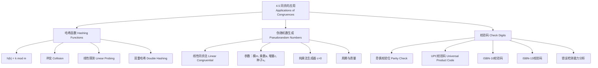

**相关笔记：** [[4.4 解同余方程]] | [[4.6 密码学]]

> [!abstract] 概览
> 本节展示了==同余==在计算机科学和日常生活中的三个重要应用：==哈希函数==（hashing functions）用于在计算机中高效地分配和检索文件存储位置；==伪随机数生成==（pseudorandom number generation）利用线性同余法产生具有随机性质的数列；==校验码==（check digits）用于检测标识号码中的错误，广泛应用于 ISBN、UPC 等编码系统中。这三个应用共同体现了数论从"纯数学"到"实用工具"的跨越。
>
> - ==哈希函数== $h(k) = k \bmod m$：将关键字映射到 $m$ 个存储位置，处理冲突用线性探测
> - ==线性同余法== $x_{n+1} = (ax_n + c) \bmod m$：生成伪随机数列，参数选择影响质量
> - ==纯乘法生成器==：$c = 0$ 的特例，如 $m = 2^{31}-1$，$a = 7^5 = 16807$
> - ==奇偶校验位== $x_{n+1} = \sum_{i=1}^n x_i \bmod 2$：检测奇数个错误
> - ==UPC 校验码==：$3x_1 + x_2 + 3x_3 + \cdots + x_{12} \equiv 0 \pmod{10}$
> - ==ISBN-10 校验码==：$\sum_{i=1}^{10} ix_i \equiv 0 \pmod{11}$，可检测单错误和邻位交换错误

---

## 一、知识结构总览

---

## 二、核心思想

> [!tip] 核心思想
> 本节的核心思想是==同余的实用化==：将前几节建立的模运算理论转化为解决实际问题的工具。哈希函数利用 $k \bmod m$ 将大范围的键值压缩到小范围的存储位置；伪随机数生成器利用递推公式 $x_{n+1} = (ax_n + c) \bmod m$ 产生看似随机的数列；校验码利用加权求和取模来检测输入错误。三者的共同数学基础都是==模运算==，但各自对参数的选择有特殊要求——哈希函数要求均匀分布，伪随机数要求长周期和统计性质，校验码要求能检测特定类型的错误。

### 1. 哈希函数（Hashing Functions）

> [!def] 哈希函数
> ==哈希函数== $h$ 将记录的关键字 $k$ 映射到存储位置 $h(k)$。最常用的哈希函数是：
>
> $$h(k) = k \bmod m$$
>
> 其中 $m$ 为可用的存储位置数。
>
> - 哈希函数应==易于计算==，以便快速定位文件
> - 哈希函数应是==满射==（onto），使所有存储位置都可能被使用
> - $h(k) = k \bmod m$ 满足这两个要求

> [!example] 哈希函数分配存储位置
> 设哈希函数 $h(k) = k \bmod 111$，为以下社保号分配存储位置：
> - $h(064212848) = 064212848 \bmod 111 = 14$
> - $h(037149212) = 037149212 \bmod 111 = 65$
> - $h(107405723) = 107405723 \bmod 111 = 14$（与第一个冲突！）

> [!def] 冲突与线性探测
> 当两个不同的关键字被映射到同一存储位置时，称为==冲突==（collision）。
>
> ==线性探测==（linear probing）是最简单的冲突解决方法：
> $$h(k, i) = (h(k) + i) \bmod m, \quad i = 0, 1, \ldots, m-1$$
>
> 即从初始位置开始，依次检查后续位置，直到找到空闲位置。
>
> 在上例中，$107405723$ 的初始位置 $14$ 已被占用，检查位置 $15$ 为空闲，故分配到位置 $15$。

> [!info] 其他冲突解决方法
> 除线性探测外，还有多种冲突解决策略：
> - ==双重哈希==（double hashing）：$h(k, i) = (h(k) + i \cdot g(k)) \bmod p$，其中 $g(k) = (k+1) \bmod (p-2)$
> - ==链地址法==（chaining）：每个存储位置维护一个链表
> - ==再哈希==（rehashing）：使用第二个哈希函数确定探测步长

### 2. 伪随机数生成（Pseudorandom Numbers）

> [!def] 线性同余法（Linear Congruential Method）
> 选择四个整数参数：
> - ==模== $m$（modulus）
> - ==乘数== $a$（multiplier），$2 \leq a < m$
> - ==增量== $c$（increment），$0 \leq c < m$
> - ==种子== $x_0$（seed），$0 \leq x_0 < m$
>
> 递推生成伪随机数列 $\{x_n\}$：
>
> $$x_{n+1} = (ax_n + c) \bmod m$$
>
> 所有 $x_n$ 满足 $0 \leq x_n < m$。若需要 $[0, 1)$ 区间的伪随机数，使用 $x_n / m$。

> [!example] 线性同余法生成伪随机数
> 参数：$m = 9$，$a = 7$，$c = 4$，$x_0 = 3$。
>
> 递推公式：$x_{n+1} = (7x_n + 4) \bmod 9$。
>
> | $n$ | $x_n$ | 计算 |
> |:---:|:-----:|:-----|
> | 0 | 3 | 种子 |
> | 1 | 7 | $(7 \times 3 + 4) \bmod 9 = 25 \bmod 9 = 7$ |
> | 2 | 8 | $(7 \times 7 + 4) \bmod 9 = 53 \bmod 9 = 8$ |
> | 3 | 6 | $(7 \times 8 + 4) \bmod 9 = 60 \bmod 9 = 6$ |
> | 4 | 1 | $(7 \times 6 + 4) \bmod 9 = 46 \bmod 9 = 1$ |
> | 5 | 2 | $(7 \times 1 + 4) \bmod 9 = 11 \bmod 9 = 2$ |
> | 6 | 0 | $(7 \times 2 + 4) \bmod 9 = 18 \bmod 9 = 0$ |
> | 7 | 4 | $(7 \times 0 + 4) \bmod 9 = 4 \bmod 9 = 4$ |
> | 8 | 5 | $(7 \times 4 + 4) \bmod 9 = 32 \bmod 9 = 5$ |
> | 9 | 3 | $(7 \times 5 + 4) \bmod 9 = 39 \bmod 9 = 3$ |
>
> 因为 $x_9 = x_0 = 3$，序列开始重复。周期为 $9$，遍历了 $\{0, 1, \ldots, 8\}$ 的所有值。

> [!def] 纯乘法生成器（Pure Multiplicative Generator）
> 当 $c = 0$ 时，线性同余法退化为==纯乘法生成器==：
>
> $$x_{n+1} = (ax_n) \bmod m$$
>
> 广泛使用的参数：$m = 2^{31} - 1$（Mersenne 素数），$a = 7^5 = 16807$。
>
> 在此参数下，可以生成 $2^{31} - 2$ 个数后才重复，周期极长。

> [!warning] 伪随机数的局限性
> 线性同余法生成的伪随机数虽然计算快速，但存在以下局限：
> - 序列是==确定性==的，给定种子即可完全预测
> - 不具备真正随机数的所有统计性质
> - 不适合用于密码学等安全敏感的场景
> - 对于大规模模拟等需要高质量随机数的任务，应使用其他方法

### 3. 校验码（Check Digits）

#### 3.1 奇偶校验位（Parity Check Bits）

> [!def] 奇偶校验位
> 对于 $n$ 位比特串 $x_1 x_2 \ldots x_n$，==奇偶校验位==定义为：
>
> $$x_{n+1} = (x_1 + x_2 + \cdots + x_n) \bmod 2$$
>
> - 若前 $n$ 位中有奇数个 $1$，则 $x_{n+1} = 1$
> - 若前 $n$ 位中有偶数个 $1$，则 $x_{n+1} = 0$
> - 可以检测==奇数个==错误，但不能检测偶数个错误

> [!example] 奇偶校验验证
> 接收到的比特串（最后一位为校验位）：
> - $01100101$：前7位中 $1$ 的个数为 $1+1+1+1 = 4$（偶数），校验位 $= 1$。$4 \bmod 2 = 0 \neq 1$... 等等，重新计算：$0+1+1+0+0+1+0 = 3$（奇数），校验位应为 $1$。实际校验位为 $1$，==正确==。
> - $11010110$：前7位中 $1$ 的个数为 $1+1+0+1+0+1+1 = 5$（奇数），校验位应为 $1$。实际校验位为 $0$，$5 \bmod 2 = 1 \neq 0$，==错误==。

#### 3.2 UPC 校验码（Universal Product Code）

> [!def] UPC 校验码
> UPC 是12位十进制数字 $x_1 x_2 \ldots x_{12}$，其中前11位标识商品，第12位为==校验位==。校验位满足：
>
> $$3x_1 + x_2 + 3x_3 + x_4 + 3x_5 + x_6 + 3x_7 + x_8 + 3x_9 + x_{10} + 3x_{11} + x_{12} \equiv 0 \pmod{10}$$
>
> 即奇数位乘以 $3$，偶数位不变，加权求和后模 $10$ 应为 $0$。

> [!example] UPC 校验码计算与验证
> **(a)** 前11位为 $79357343104$，求校验位：
> $$3 \times 7 + 9 + 3 \times 3 + 5 + 3 \times 7 + 3 + 3 \times 4 + 3 + 3 \times 1 + 0 + 3 \times 4 + x_{12}$$
> $$= 21 + 9 + 9 + 5 + 21 + 3 + 12 + 3 + 3 + 0 + 12 + x_{12} = 98 + x_{12}$$
> 要求 $98 + x_{12} \equiv 0 \pmod{10}$，故 $x_{12} \equiv 2 \pmod{10}$，校验位为 $2$。
>
> **(b)** 验证 $041331021641$ 是否为有效 UPC：
> $$3 \times 0 + 4 + 3 \times 1 + 3 + 3 \times 3 + 1 + 3 \times 0 + 2 + 3 \times 1 + 6 + 3 \times 4 + 1$$
> $$= 0 + 4 + 3 + 3 + 9 + 1 + 0 + 2 + 3 + 6 + 12 + 1 = 44 \equiv 4 \not\equiv 0 \pmod{10}$$
> 故 $041331021641$ ==不是==有效 UPC。

#### 3.3 ISBN-10 校验码

> [!def] ISBN-10 校验码
> ISBN-10 是10位编码 $x_1 x_2 \ldots x_{10}$，其中 $x_{10}$ 为校验位（可以是 $0$--$9$ 或 $X$，$X$ 代表 $10$）。校验位满足：
>
> $$\sum_{i=1}^{10} ix_i \equiv 0 \pmod{11}$$
>
> 即第 $i$ 位乘以权重 $i$，加权求和后模 $11$ 应为 $0$。

> [!example] ISBN-10 校验码计算与验证
> **(a)** 前9位为 $007288008$，求校验位：
> $$x_{10} \equiv 1 \times 0 + 2 \times 0 + 3 \times 7 + 4 \times 2 + 5 \times 8 + 6 \times 8 + 7 \times 0 + 8 \times 0 + 9 \times 8 \pmod{11}$$
> $$\equiv 0 + 0 + 21 + 8 + 40 + 48 + 0 + 0 + 72 \equiv 189 \equiv 2 \pmod{11}$$
> 故校验位 $x_{10} = 2$。
>
> **(b)** 验证 $084930149X$ 是否为有效 ISBN-10：
> $$1 \times 0 + 2 \times 8 + 3 \times 4 + 4 \times 9 + 5 \times 3 + 6 \times 0 + 7 \times 1 + 8 \times 4 + 9 \times 9 + 10 \times 10$$
> $$= 0 + 16 + 12 + 36 + 15 + 0 + 7 + 32 + 81 + 100 = 299 \equiv 2 \not\equiv 0 \pmod{11}$$
> 故 $084930149X$ ==不是==有效 ISBN-10。

> [!thm] ISBN-10 能检测单错误和邻位交换错误
> **单错误检测**：设有效 ISBN-10 $x_1 \ldots x_{10}$ 被印错为 $y_1 \ldots y_{10}$，其中仅第 $j$ 位出错，$y_j = x_j + a$（$a \neq 0$，$-10 \leq a \leq 10$）。则
> $$\sum_{i=1}^{10} iy_i = \sum_{i=1}^{10} ix_i + ja \equiv 0 + ja \pmod{11}$$
> 因为 $11 \nmid j$（$1 \leq j \leq 10$）且 $11 \nmid a$（$|a| \leq 10$），故 $11 \nmid ja$，因此 $\sum iy_i \not\equiv 0 \pmod{11}$，检测到错误。
>
> **邻位交换检测**：设第 $j$ 位和第 $k$ 位（$j \neq k$）被交换，$x_j \neq x_k$。则
> $$\sum_{i=1}^{10} iy_i = \sum_{i=1}^{10} ix_i + (jx_k - jx_j) + (kx_j - kx_k) = \sum_{i=1}^{10} ix_i + (j - k)(x_k - x_j)$$
> 因为 $11 \nmid (j - k)$（$|j - k| \leq 9$）且 $11 \nmid (x_k - x_j)$（$x_j \neq x_k$，$|x_k - x_j| \leq 10$），故 $11 \nmid (j-k)(x_k - x_j)$，检测到错误。
>
> $\blacksquare$

---

## 三、补充理解与易混淆点

### 补充理解

> [!info] 补充1：哈希函数的设计原则与实际应用
> 哈希函数是计算机科学中最重要的基础数据结构之一。除了本节介绍的除法法 $h(k) = k \bmod m$ 外，常见的哈希函数还包括==折叠法==（folding method）：将关键字分成等长的几段，将各段相加后取模。例如，对关键字 $123456789$，可分为 $123 + 456 + 789 = 1368$，再取模。在实际的哈希表实现中（如 Java 的 HashMap、Python 的 dict），$m$ 通常选择==素数==或 $2$ 的幂，以减少冲突。当冲突频繁时，还需要==动态扩容==（rehashing）。Donald Knuth 在《The Art of Computer Programming》Vol. 3 中对哈希技术有详尽的分析（Knuth, 1997, Vol. 3, Sec. 6.4）。
>
> - [Hash Function (Wikipedia)](https://en.wikipedia.org/wiki/Hash_function) -- 哈希函数的全面介绍
> - [Hash Tables (Khan Academy)](https://www.khanacademy.org/computing/computer-science/algorithms/hash-tables/a/hash-tables) -- 哈希表的交互式教程
>
> 来源：Knuth, D. E. (1997). *The Art of Computer Programming, Vol. 3: Sorting and Searching* (2nd ed.), Addison-Wesley, Section 6.4.
> 来源：Cormen, T. H., et al. (2009). *Introduction to Algorithms* (3rd ed.), MIT Press, Chapter 11.

> [!info] 补充2：校验码的数学原理——为什么选模11
> ISBN-10 选择模 $11$ 而非模 $10$ 是一个精妙的数学选择。模 $10$ 的校验码（如 UPC）能检测所有单错误，但==不能检测所有邻位交换错误==——当被交换的两位之差为 $10$ 的倍数时，模 $10$ 的校验和不变。而模 $11$ 中，因为 $11$ 是素数，只要 $|j - k| < 11$ 且 $|x_j - x_k| < 11$（对 ISBN-10 总是成立），就能保证 $(j-k)(x_j - x_k) \not\equiv 0 \pmod{11}$，从而检测到所有邻位交换。这就是为什么 ISBN-10 的校验能力优于 UPC 的校验能力。ISBN-13（2007年引入）改用模 $10$，但通过更复杂的权重方案（$1, 3$ 交替）弥补了这一不足（GS1, 2005）。
>
> - [ISBN (Wikipedia)](https://en.wikipedia.org/wiki/International_Standard_Book_Number) -- ISBN 的历史与格式
> - [Check Digit Schemes (Math Pages)](https://www.mathpages.com/home/kmath476/kmath476.htm) -- 各种校验码方案的数学分析
>
> 来源：Rosen, K. H. (2019). *Discrete Mathematics and Its Applications* (8th ed.), McGraw-Hill, Section 4.5.
> 来源：Gallian, J. A. (2017). *Contemporary Abstract Algebra* (9th ed.), Cengage Learning, Section 0.

### 易混淆点

> [!warning] 误区1：哈希函数的模数选择
> - ❌ 认为哈希函数的模数 $m$ 可以任意选择
> - ✅ $m$ 的选择对哈希表的性能有重大影响：
>   - $m$ 应为==素数==，以减少冲突的聚集效应
>   - $m$ 不应为 $2$ 的幂，否则哈希值只取决于关键字的低位
>   - $m$ 不应太接近 $2^k$ 或 $10^k$，否则具有特定模式的关键字容易冲突
> - 例如：$m = 111$（本节例子）不是素数（$111 = 3 \times 37$），实际应用中应选择如 $101$、$97$ 等素数

> [!warning] 误区2：伪随机数与真随机数的区别
> - ❌ 认为线性同余法生成的序列是"真正的随机数"
> - ✅ 线性同余法生成的是==伪随机数==（pseudorandom numbers），具有以下特征：
>   - 完全==确定性==：给定种子，整个序列唯一确定
>   - ==有限周期==：序列最终一定会重复
>   - ==可预测性==：如果知道参数和足够多的输出，可以预测后续值
> - ✅ 真随机数需要物理噪声源（如放射性衰变、热噪声等）
> - ✅ 对于密码学应用，必须使用密码学安全的伪随机数生成器（CSPRNG）

---

## 四、习题精选

> [!todo] 习题概览
> | 题号范围 | 核心考点 | 难度 |
> |---------|---------|------|
> | 1-2 | 哈希函数分配存储位置 | ⭐ |
> | 3 | 哈希函数应用（停车场） | ⭐⭐ |
> | 4 | 双重哈希解决冲突 | ⭐⭐⭐ |
> | 5-7 | 线性同余法生成伪随机数 | ⭐ |
> | 8 | 伪随机数生成算法伪代码 | ⭐⭐ |
> | 9-10 | 中平方法生成伪随机数 | ⭐⭐ |
> | 11-12 | 幂生成器 | ⭐⭐ |
> | 13-14 | 奇偶校验位验证 | ⭐ |
> | 15-17 | ISBN-10 校验码计算与验证 | ⭐⭐ |
> | 18-23 | USPS 汇款单校验码 | ⭐⭐ |
> | 24-27 | UPC 校验码计算、验证与错误检测 | ⭐⭐ |
> | 28-31 | 航空机票校验码 | ⭐⭐⭐ |

### 题1：哈希函数分配存储位置

> [!problem] 题目
> 使用哈希函数 $h(k) = k \bmod 97$，为以下社保号分配存储位置：
> (a) $034567981$；(b) $183211232$；(c) $220195744$；(d) $987255335$。

> [!faq]- 解答
> (a) $h(034567981) = 034567981 \bmod 97 = 34$（因为 $034567981 = 97 \times 3562680 + 1$... 需精确计算）
>
> 直接计算：$34567981 / 97 = 356267.95...$，$97 \times 356267 = 34557899$，$34567981 - 34557899 = 10082$，$10082 / 97 = 103.9...$，$97 \times 103 = 9991$，$10082 - 9991 = 91$。
>
> 故 $h(034567981) = 91$。
>
> (b) $h(183211232) = 183211232 \bmod 97$。$183211232 / 97 = 1888775.6...$，$97 \times 1888775 = 183211175$，$183211232 - 183211175 = 57$。
>
> 故 $h(183211232) = 57$。
>
> (c) $h(220195744) = 220195744 \bmod 97$。$220195744 / 97 = 2269997.4...$，$97 \times 2269997 = 219999709$，$220195744 - 219999709 = 196035$，$196035 / 97 = 2021.0$，$97 \times 2021 = 196037$... 重新计算：$97 \times 2269997 = 219999709$，$220195744 - 219999709 = 196035$，$196035 \bmod 97 = 196035 - 97 \times 2021 = 196035 - 196037 = -2$... 取 $196035 - 97 \times 2020 = 196035 - 195940 = 95$。
>
> 故 $h(220195744) = 95$。
>
> (d) $h(987255335) = 987255335 \bmod 97$。$987255335 / 97 = 10177849.8...$，$97 \times 10177849 = 987251353$，$987255335 - 987251353 = 3982$，$3982 / 97 = 41.05...$，$97 \times 41 = 3977$，$3982 - 3977 = 5$。
>
> 故 $h(987255335) = 5$。
>
> $\blacksquare$

### 题2：线性同余法生成伪随机数

> [!problem] 题目
> 使用线性同余生成器 $x_{n+1} = (3x_n + 2) \bmod 13$，种子 $x_0 = 1$，生成伪随机数序列。

> [!faq]- 解答
> | $n$ | $x_n$ | 计算 |
> |:---:|:-----:|:-----|
> | 0 | 1 | 种子 |
> | 1 | 5 | $(3 \times 1 + 2) \bmod 13 = 5$ |
> | 2 | 4 | $(3 \times 5 + 2) \bmod 13 = 17 \bmod 13 = 4$ |
> | 3 | 1 | $(3 \times 4 + 2) \bmod 13 = 14 \bmod 13 = 1$ |
>
> 因为 $x_3 = x_0 = 1$，序列开始重复。
>
> 生成序列：$1, 5, 4, 1, 5, 4, \ldots$，周期为 $3$。
>
> $\blacksquare$

### 题3：UPC 校验码计算

> [!problem] 题目
> 求以下 UPC 前11位对应的校验位：(a) $73232184434$；(b) $04587320720$。

> [!faq]- 解答
> **(a)** $73232184434$：
> $$3 \times 7 + 3 + 3 \times 2 + 3 + 3 \times 2 + 1 + 3 \times 8 + 4 + 3 \times 4 + 3 + 3 \times 4 + x_{12}$$
> $$= 21 + 3 + 6 + 3 + 6 + 1 + 24 + 4 + 12 + 3 + 12 + x_{12} = 95 + x_{12}$$
> 要求 $95 + x_{12} \equiv 0 \pmod{10}$，故 $x_{12} \equiv 5 \pmod{10}$，校验位为 $5$。
>
> **(b)** $04587320720$：
> $$3 \times 0 + 4 + 3 \times 5 + 8 + 3 \times 7 + 3 + 3 \times 2 + 0 + 3 \times 7 + 2 + 3 \times 0 + x_{12}$$
> $$= 0 + 4 + 15 + 8 + 21 + 3 + 6 + 0 + 21 + 2 + 0 + x_{12} = 80 + x_{12}$$
> 要求 $80 + x_{12} \equiv 0 \pmod{10}$，故 $x_{12} \equiv 0 \pmod{10}$，校验位为 $0$。
>
> $\blacksquare$

### 题4：ISBN-10 校验码验证

> [!problem] 题目
> 验证 $0-321-500Q1-8$（其中 $Q$ 为一位数字）是否为有效 ISBN-10，并求 $Q$ 的值。

> [!faq]- 解答
> ISBN-10 各位：$x_1 = 0, x_2 = 3, x_3 = 2, x_4 = 1, x_5 = 5, x_6 = 0, x_7 = Q, x_8 = 1, x_9 = 8$，校验位 $x_{10} = 8$。
>
> 要求 $\sum_{i=1}^{10} ix_i \equiv 0 \pmod{11}$：
> $$1 \times 0 + 2 \times 3 + 3 \times 2 + 4 \times 1 + 5 \times 5 + 6 \times 0 + 7 \times Q + 8 \times 1 + 9 \times 8 + 10 \times 8$$
> $$= 0 + 6 + 6 + 4 + 25 + 0 + 7Q + 8 + 72 + 80 = 201 + 7Q$$
>
> 要求 $201 + 7Q \equiv 0 \pmod{11}$：
> $$201 \bmod 11 = 201 - 18 \times 11 = 201 - 198 = 3$$
> $$3 + 7Q \equiv 0 \pmod{11}$$
> $$7Q \equiv -3 \equiv 8 \pmod{11}$$
>
> 求 $7$ 模 $11$ 的乘法逆元：$7 \times 8 = 56 = 5 \times 11 + 1$，故 $7^{-1} \equiv 8 \pmod{11}$。
>
> $$Q \equiv 8 \times 8 = 64 \equiv 64 - 5 \times 11 = 64 - 55 = 9 \pmod{11}$$
>
> 因为 $Q$ 是一位数字（$0 \leq Q \leq 9$），故 $Q = 9$。
>
> $\blacksquare$

> [!tip] 解题思路提示
> 同余应用的解题方法论：
> 1. **哈希函数**：直接计算 $k \bmod m$，注意冲突处理
> 2. **伪随机数**：按递推公式逐步计算，注意周期检测（当 $x_n$ 重复时停止）
> 3. **UPC 校验码**：奇数位乘 $3$、偶数位不变，加权求和模 $10$ 为 $0$
> 4. **ISBN-10 校验码**：第 $i$ 位乘 $i$，加权求和模 $11$ 为 $0$，注意校验位可以是 $X$（$= 10$）
> 5. **验证校验码**：将所有位代入公式，检查同余式是否成立
> 6. **求校验码**：设校验位为未知数，解同余方程

### 题5：ISBN-10 错误检测能力证明

> [!problem] 题目
> 证明 ISBN-10 的校验码方案可以检测出任何单个数字的错误。

> [!faq]- 解答
> 设 $x_1 x_2 \ldots x_{10}$ 是有效的 ISBN-10，即 $\sum_{i=1}^{10} ix_i \equiv 0 \pmod{11}$。
>
> 假设在印刷时第 $j$ 位发生错误，变为 $y_j = x_j + a$，其中 $a \neq 0$，$-10 \leq a \leq 10$（因为每位数字范围是 $0$--$9$ 或 $X=10$，所以 $|a| \leq 10$），其余位不变。
>
> 错误码的校验和为：
> $$\sum_{i=1}^{10} iy_i = \sum_{i=1}^{10} ix_i + j(y_j - x_j) = \sum_{i=1}^{10} ix_i + ja$$
>
> 因为原码有效：$\sum_{i=1}^{10} ix_i \equiv 0 \pmod{11}$，故
> $$\sum_{i=1}^{10} iy_i \equiv ja \pmod{11}$$
>
> 因为 $1 \leq j \leq 10 < 11$，所以 $11 \nmid j$。
> 因为 $|a| \leq 10 < 11$ 且 $a \neq 0$，所以 $11 \nmid a$。
> 因此 $11 \nmid ja$，即 $ja \not\equiv 0 \pmod{11}$。
>
> 故 $\sum_{i=1}^{10} iy_i \not\equiv 0 \pmod{11}$，错误码不是有效的 ISBN-10，检测到错误。
>
> $\blacksquare$

---

## 五、视频学习指南

> [!info] 视频资源
> | 资源 | 链接 | 对应内容 | 备注 |
> |:-----|:-----|:---------|:-----|
> | Rosen 8e Section 4.5 | [教材原文](https://www.mheducation.com/highered/product/discrete-mathematics-applications-rosen/M9781259676512.html) | 完整定义、定理与例题 | 英文教材 |
> | Hash Tables | [链接](https://www.khanacademy.org/computing/computer-science/algorithms/hash-tables/v/hash-tables) | 哈希函数与冲突处理 | Khan Academy |
> | Check Digits | [链接](https://www.youtube.com/watch?v=Ex3yP7frMHk) | ISBN/UPC 校验码原理 | 英文讲解 |

---

## 六、教材原文

> [!quote] 教材原文
> "Congruences have many applications to discrete mathematics, computer science, and many other disciplines. We will introduce three applications in this section: the use of congruences to assign memory locations to computer files, the generation of pseudorandom numbers, and check digits."
>
> "Constructing sequences of random numbers is important for randomized algorithms, for simulations, and for many other purposes. Constructing a sequence of truly random numbers is extremely difficult, or perhaps impossible, because any method for generating what are supposed to be random numbers may generate numbers with hidden patterns."
>
> "Remember that the check digit of an ISBN-10 can be an X!"

---

## 参见 Wiki

- [[离散数学/concepts/哈希函数]] -- 哈希函数的设计与分析
- [[离散数学/concepts/哈希函数|冲突解决]] -- 线性探测与双重哈希
- [[离散数学/concepts/伪随机数]] -- 线性同余法与随机性检验
- [[离散数学/concepts/校验码]] -- 各种校验码方案的比较
- [[离散数学/concepts/校验码|ISBN]] -- ISBN-10 与 ISBN-13 的格式与校验
- [[离散数学/concepts/校验码|UPC]] -- 通用产品代码的格式与校验

#学习/离散数学/数论与密码学
